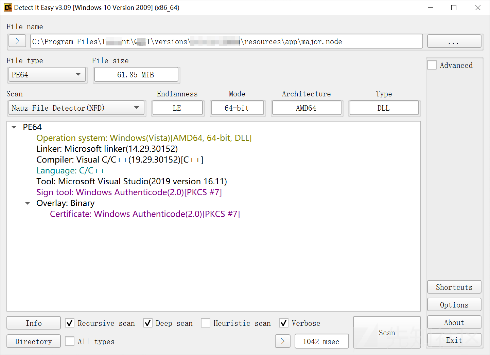
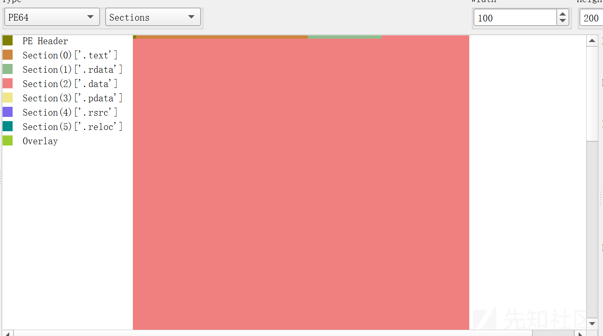
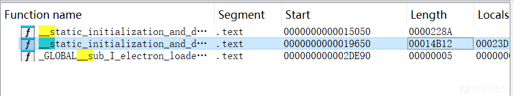
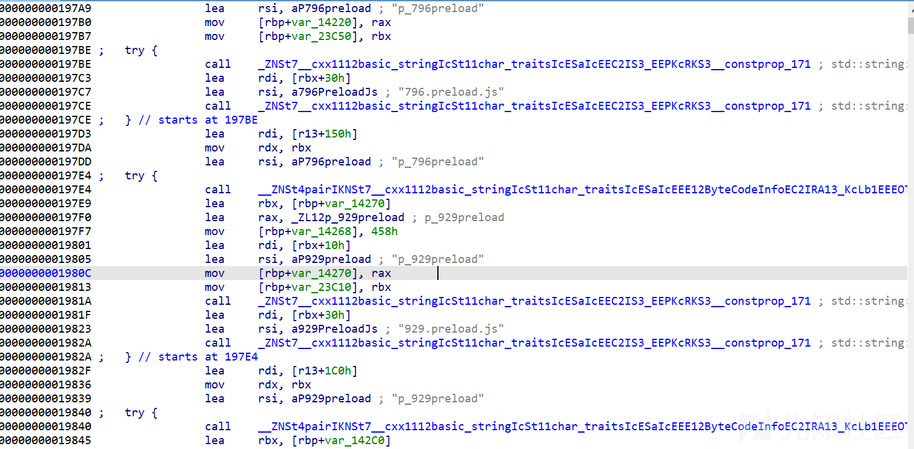
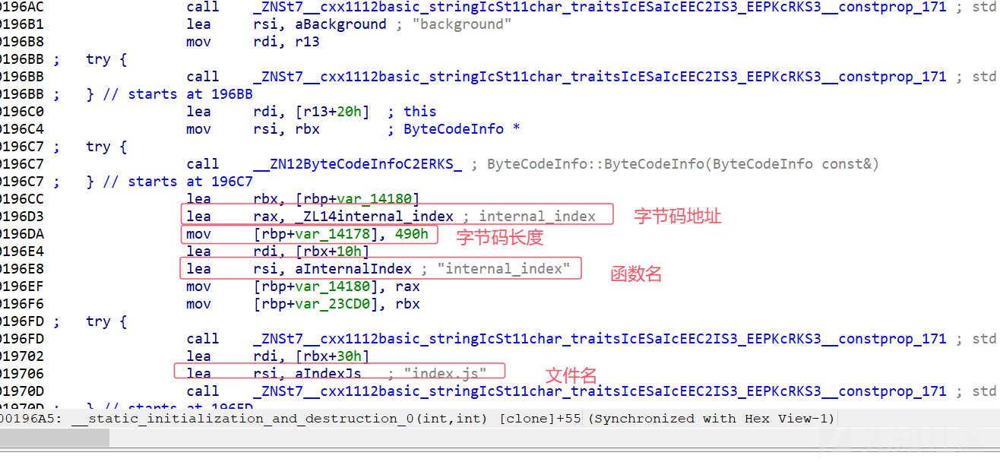
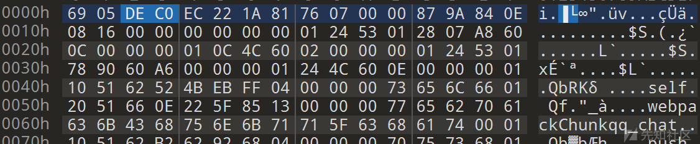
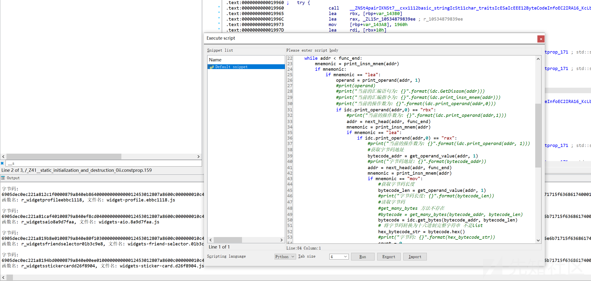
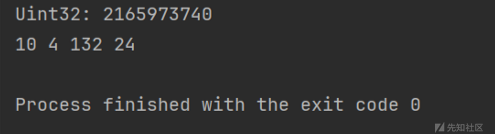
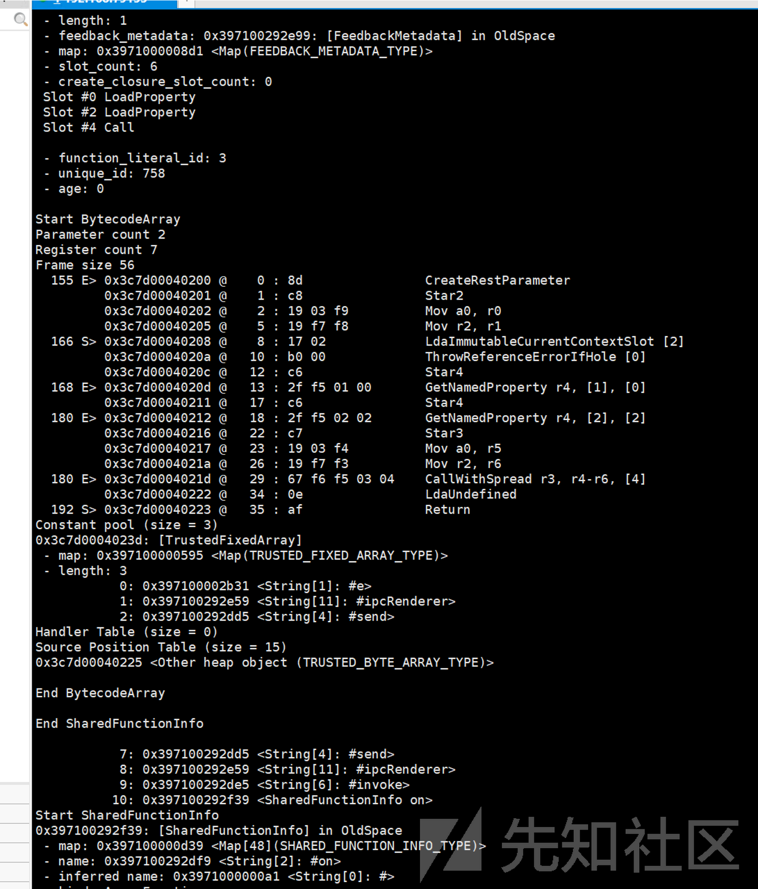
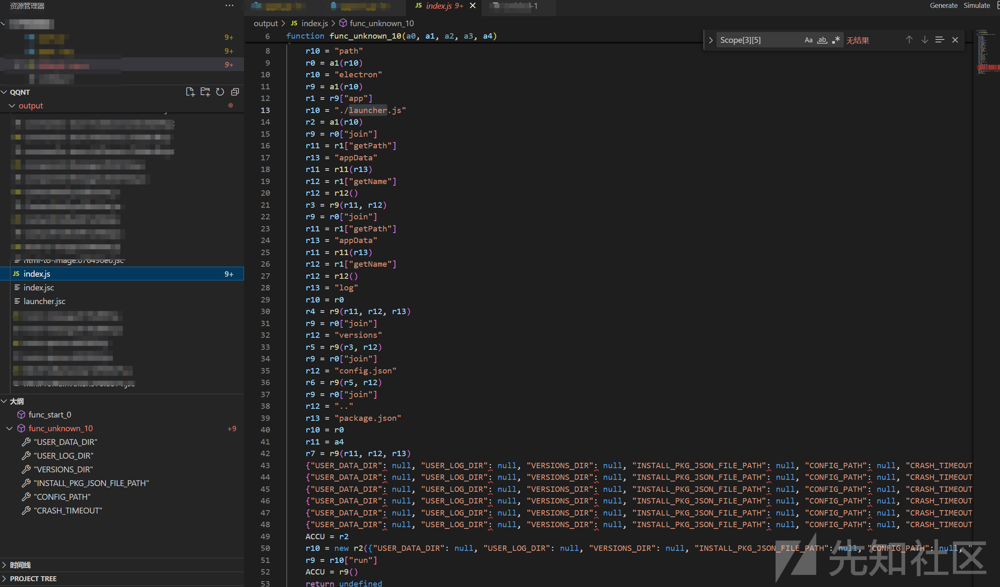

# V8 字节码反编译 | 还原bytenode保护的js代码-先知社区

> **来源**: https://xz.aliyun.com/news/16489  
> **文章ID**: 16489

---

# 前言

某日，我看到某IM应用发布了一个全新的桌面客户端开始了公测


我马上就下载来试用了一番，发现它使用了`electron`重构了PC客户端。用`electron`重写？逆起来应该很容易吧

注意：新版本使用的V8 12.\*版本并没有反编译成功

# 一个奇怪的electron应用

分析`electron`引用第一步就是寻找资源文件。

所以，我就想在安装目录下寻找`app.asar`，来看看它的js代码是怎么写的。~~能不能整出点花活~~

进行一番寻找之后，我并没有在安装目录下找到任何的ASAR文件。

但是通过文件大小来看，安装目录下几个奇怪的`.node`文件看起来比较可疑。

`wrapper.node` `major.node`两个数十M的文件是PE文件




简单查看了一下字符串发现，这个PE文件内出现了少量明文的js代码，和有规律的js文件名储存结构，猜测js代码解密可能在这里?

通过JS文件名字符串，很容易定位一个函数体非常大的函数





这个函数内组装了数百个`ByteCodeInfo` 结构体，最终生成了生成一个结构体数组 `[]ByteCodeInfo`。



通过结构体名可以猜测出，它可能储存的是V8字节码和js文件名与函数名的映射关系。

导出的字节码印证了这一点：熟悉nodejs分析的应该很容易看出来，他的头出现了 V8字节码的魔数部分`?? ?? DE C0`



这个程序和开源的`bytenode`保护使用了相同的方法。都是把缓存的V8字节码保存下来，然后在运行时直接加载字节码缓存来避免源代码打包入代码，以达成源代码保护或是压缩代码提升性能的目的。

既然找到了字节码，我们就把它全部提取出来吧



这里我写了一个IDA python脚本，把这个奇怪的`node`文件里面的所有储存的字节码和对应的文件信息全部提取了

## V8字节码

### V8字节码长什么样?

V8 字节码的生成是在`SerializedCodeData::SerializedCodeData` 中进行的

```
SerializedCodeData::SerializedCodeData(const std::vector<uint8_t>* payload,
                                       const CodeSerializer* cs) {
  DisallowGarbageCollection no_gc;

  // Calculate sizes.
  uint32_t size = kHeaderSize + static_cast<uint32_t>(payload->size());
  DCHECK(IsAligned(size, kPointerAlignment));

  // Allocate backing store and create result data.
  AllocateData(size);

  // Zero out pre-payload data. Part of that is only used for padding.
  memset(data_, 0, kHeaderSize);

  // Set header values.
  SetMagicNumber();
  SetHeaderValue(kVersionHashOffset, Version::Hash());
  SetHeaderValue(kSourceHashOffset, cs->source_hash());
  SetHeaderValue(kFlagHashOffset, FlagList::Hash());
  SetHeaderValue(kReadOnlySnapshotChecksumOffset,
                 Snapshot::ExtractReadOnlySnapshotChecksum(
                     cs->isolate()->snapshot_blob()));
  SetHeaderValue(kPayloadLengthOffset, static_cast<uint32_t>(payload->size()));

  // Zero out any padding in the header.
  memset(data_ + kUnalignedHeaderSize, 0, kHeaderSize - kUnalignedHeaderSize);

  // Copy serialized data.
  CopyBytes(data_ + kHeaderSize, payload->data(),
            static_cast<size_t>(payload->size()));
  uint32_t checksum =
      v8_flags.verify_snapshot_checksum ? Checksum(ChecksummedContent()) : 0;
  SetHeaderValue(kChecksumOffset, checksum);
}

```

V8 的字节码并没有固定的`C/C++`结构体定义，而是通过字节流的形式动态组织的。V8 中的某些类和辅助结构，像 `BytecodeArray`、`SerializedData` 或 `SnapshotData`，提供了一种逻辑上的结构化视图，使开发者能够以类和方法的形式操作字节码。

V8 字节码是一个字节流，类似于汇编语言中的指令序列，每条指令由 **操作码 (Opcode)** 和 **可选的操作数 (Operands)** 组成。每个操作码和操作数的组合可能具有不同的长度和参数布局。因此，字节码整体上并没有一个固定的内存对齐或结构体。

#### 魔数

首先，我们先看魔数(`MagicNumber`)部分。魔数在可以帮助我们快速在二进制文件中定位字节码可能出现的位置。

```
static constexpr uint32_t kMagicNumberOffset = 0;
static constexpr uint32_t kMagicNumber = 0xC0DE0000 ^ ExternalReferenceTable::kSize;

void SetMagicNumber() { 
    SetHeaderValue(kMagicNumberOffset, kMagicNumber); 
}

```

魔数的值是通过固定值 `0xC0DE0000` 和 `ExternalReferenceTable::kSize` 的异或 (`^`) 操作得出的

```
static constexpr int kSize =
      kSizeIsolateIndependent + kExternalReferenceCountIsolateDependent +
      kIsolateAddressReferenceCount + kStubCacheReferenceCount +
      kStatsCountersReferenceCount;

```

魔数间接编码了与 `ExternalReferenceTable::kSize` 相关的信息

魔数位于序列化数据或快照数据的头部，作为识别该数据是否合法的标志。通过魔数，V8 可以快速判断数据是否符合特定版本和格式，如果加载了错误版本的字节码，V8引擎会直接抛出异常。

#### 版本哈希

版本哈希是 V8 代码中对当前版本的唯一标识。

```
static uint32_t Hash() {
    return static_cast<uint32_t>(
        base::hash_combine(major_, minor_, build_, patch_));
}

```

它并没有直接明文记录当前版本的版本号，而是将版本号通过hash函数计算后写入头部.。

```
V8_INLINE size_t hash_combine(Ts const&... vs) {
  return Hasher{}.Combine(vs...);
}

```

```
// Combine two hash values together. This code was taken from MurmurHash.
V8_INLINE size_t hash_combine(size_t seed, size_t hash) {
#if V8_HOST_ARCH_32_BIT
  const uint32_t c1 = 0xCC9E2D51;
  const uint32_t c2 = 0x1B873593;

  hash *= c1;
  hash = bits::RotateRight32(hash, 15);
  hash *= c2;

  seed ^= hash;
  seed = bits::RotateRight32(seed, 13);
  seed = seed * 5 + 0xE6546B64;
#else
  const uint64_t m = uint64_t{0xC6A4A7935BD1E995};
  const uint32_t r = 47;

  hash *= m;
  hash ^= hash >> r;
  hash *= m;

  seed ^= hash;
  seed *= m;
#endif  // V8_HOST_ARCH_32_BIT
  return seed;
}

```

HASH 算法使用的是`MururHash`

最终写了一个Go版本的 `V8` 字节码`版本Hash`的计算函数

```
func hashValueUnsigned(v uint64) uint64 {
    v = ((v << 15) - v - 1) & 0xFFFFFFFF
    v = (v ^ (v >> 12)) & 0xFFFFFFFF
    v = (v + (v << 2)) & 0xFFFFFFFF
    v = (v ^ (v >> 4)) & 0xFFFFFFFF
    v = (v * 2057) & 0xFFFFFFFF
    v = (v ^ (v >> 16)) & 0xFFFFFFFF
    return v
}

func hashCombine(seed, value int64) int64 {
    value = (value * 0xCC9E2D51) & 0xFFFFFFFF
    value = ((value >> 15) | (value << (32 - 15))) & 0xFFFFFFFF
    value = (value * 0x1b873593) & 0xFFFFFFFF
    seed ^= value
    seed = ((seed >> 13) | (seed << (32 - 13))) & 0xFFFFFFFF
    seed = (seed*5 + 0xE6546B64) & 0xFFFFFFFF
    return seed
}

func hashCombine64(seed, value uint64) uint64 {
    const m = uint64(0xC6A4A7935BD1E995)
    value = (value * m) & 0xFFFFFFFFFFFFFFFF
    value = (value ^ (value >> 47)) & 0xFFFFFFFFFFFFFFFF
    value = (value * m) & 0xFFFFFFFFFFFFFFFF
    seed = (seed ^ value) & 0xFFFFFFFFFFFFFFFF
    seed = (seed * m) & 0xFFFFFFFFFFFFFFFF
    return seed
}

func versionHash(major, minor, build, patch int) uint64 {
    seed := uint64(0)
    v := hashValueUnsigned(uint64(patch))
    seed = hashCombine64(seed, v)
    v = hashValueUnsigned(uint64(build))
    seed = hashCombine64(seed, v)
    v = hashValueUnsigned(uint64(minor))
    seed = hashCombine64(seed, v)
    v = hashValueUnsigned(uint64(major))
    seed = hashCombine64(seed, v)
    return seed & 0xFFFFFFFF
}
func versionHash64(major, minor, build, patch int) uint32 {
    seed := uint64(0)
    v := hashValueUnsigned(uint64(patch))
    seed = hashCombine64(seed, v)
    v = hashValueUnsigned(uint64(build))
    seed = hashCombine64(seed, v)
    v = hashValueUnsigned(uint64(minor))
    seed = hashCombine64(seed, v)
    v = hashValueUnsigned(uint64(major))
    seed = hashCombine64(seed, v)
    return uint32(seed & 0xFFFFFFFF)
}

```

到了这里我们就可以实现通过hash爆破版本号 (如果是electron CEF 应用 也可以通过字符串判断版本号 这里只是给出一个通用的方法)

V8 的版本号通常采用以下格式：

`<major>.<minor>.<build>.<patch>`

* **主版本号 (major)**：

  + 代表重大版本更新。
  + 可能引入不向后兼容的特性或架构变更。
  + 例如，从 V8 9.x 升级到 V8 10.x。
* **次版本号 (minor)**：

  + 表示功能性更新。
  + 新增特性，但通常保持向后兼容性。
  + 例如，V8 10.2 表示在主版本 10.x 上新增了功能。
* **构建号 (build)**：

  + 表示内部改进、Bug 修复或特定的构建变化。
  + 一般不会影响外部 API。
* **补丁号 (patch)**：

  + 表示小范围的修复或调整。

这里直接暴力搜索

```
for i := 0; i < 20; i++ {
        for j := 0; j < 20; j++ {

            for k := 0; k < 500; k++ {
                for l := 0; l < 100; l++ {

                    result := versionHash64(i, j, k, l)
                    if result == myUint32 {
                        fmt.Println(i, j, k, l)
                        return
                    }
                }
            }
        }
    }

```

很快，我们就定位到了目标字节码对应V8引擎的准确版本号 10.4.132.24。



## V8字节码"反编译"

### V8字节码"反汇编"

[v8dasm](https://github.com/noelex/v8dasm) 项目已经给出了一个解决方案

虽然是几年前的老项目，但是它的思路在新版本的V8引擎也可以正常工作。

##### 拉取V8代码

**第一步 安装依赖**

```
apt-get install ninja-build clang pkg-config

```

**第二步 安装**`depot_tools`

depot\_tools 是谷歌官方给出的`Chromium`项目相关小工具 完成一些代码仓库检出等操作

将depot\_tools clone到你要安装的位置

```
mkdir  ~/v8tools/
cd ~/v8tools/
git clone https://chromium.googlesource.com/chromium/tools/depot_tools.git

```

之后将工具添加到path

```
export PATH=~/v8tools/depot_tools/:$PATH

```

**第四步 准备一个保存目录 拉取v8代码**

```
mkdir ~/v8
cd ~/v8
fetch v8
cd v8

```

`fetch` 为刚刚`depot_tools`中安装的工具之一

**第五步 切换到对应版本分支**

这里必须和目标字节码版本号对上

```
git checkout refs/tags/10.4.132.24

```

**第六步 同步依赖**

```
gclient sync -D
```

现在，我们在本地上就有了一套完整的V8源代码

##### 魔改V8引擎

正常V8内置了字节码的"反汇编"操作，用于从JS源代码编译的调试。为了脱离源代码来调用他的原生字节码分析操作，我们需要修改V8引擎。在解析字节码的过程中调用几个内部方法，来实现打印字节码内的指令和常量池。

下面的是V11之前的修改方法?

V12 函数位置有所差异 编译时也要额外添加启用沙箱参数 来启用压缩指针特性

**修改** `src/snapshot/code-serializer.cc` **文件：**

* 在 `CodeSerializer::Deserialize` 方法中插入打印代码，找到判断是否已经成功反序列化代码块后

```
if (FLAG_profile_deserialization) PrintF("[Deserializing failed]\n");
return MaybeHandle<SharedFunctionInfo>();

```

* 在此处后插入以下代码：

```
std::cout << "\nStart SharedFunctionInfo\n";
result->SharedFunctionInfoPrint(std::cout);
std::cout << "\nEnd SharedFunctionInfo\n";
std::cout << std::flush;
```

**注意：这里的**`Start SharedFunctionInfo` **和后续修改中的打印 都是后续使用的的**`View8`**工具的识别标记，不要修改。**

* 然后修改`SerializedCodeData::SanityCheck` 方法 让它直接返回成功 绕过检查

```
SerializedCodeSanityCheckResult SerializedCodeData::SanityCheck(
     uint32_t expected_source_hash) const {
  return SerializedCodeSanityCheckResult::kSuccess;
 }

```

**修改** `src/diagnostics/objects-printer.cc` **文件：**

```
SharedFunctionInfo::SharedFunctionInfoPrint(std::ostream& os) {
//......
     os << "<none>";
   }
   os << "\n";
//插入位置
//......

```

```
1. 在 `SharedFunctionInfo::SharedFunctionInfoPrint` 方法内寻找`PrintSourceCode(os);` 代码行 **注释它**。
2. 寻找以下代码
```

* 在此处插入以下代码：

```
os << "\nStart BytecodeArray\n";
this->GetActiveBytecodeArray().Disassemble(os);
os << "\nEnd BytecodeArray\n";
os << std::flush;

```

**修改** `src/objects/objects.cc` **文件：**

搜索函数 `HeapObject::HeapObjectShortPrint`：

找到以下片段：

```
os << accumulator.ToCString().get();
     return;
   }

```

**插入代码**

```
if (map(cage_base).instance_type() == ASM_WASM_DATA_TYPE) {
    os << "<ArrayBoilerplateDescription> ";
    ArrayBoilerplateDescription::cast(*this)
        .constant_elements()
        .HeapObjectShortPrint(os);
    return;
}
```

在函数 `HeapObject::HeapObjectShortPrint` 内找到 `FIXED_ARRAY_TYPE` 的分支：

```
case FIXED_ARRAY_TYPE:
    os << "<FixedArray[" << FixedArray::cast(*this).length() << "]>";
    //插入位置
    break;

```

在分支内插入代码

```
os << "\nStart FixedArray\n";
    FixedArray::cast(*this).FixedArrayPrint(os);
    os << "\nEnd FixedArray\n";

```

找到 `OBJECT_BOILERPLATE_DESCRIPTION_TYPE` 的分支：

```
case OBJECT_BOILERPLATE_DESCRIPTION_TYPE:
       os << "<ObjectBoilerplateDescription[" << FixedArray::cast(*this).length()
          << "]>";
    //插入位置
       break;

```

在分支内插入代码

```
os << "\nStart ObjectBoilerplateDescription\n";
    ObjectBoilerplateDescription::cast(*this)
        .ObjectBoilerplateDescriptionPrint(os);
    os << "\nEnd ObjectBoilerplateDescription\n";

```

找到 `FIXED_DOUBLE_ARRAY_TYPE` 的分支：

```
case FIXED_DOUBLE_ARRAY_TYPE:
       os << "<FixedDoubleArray[" << FixedDoubleArray::cast(*this).length()
          << "]>";
    //插入位置
       break;

```

在分支内插入代码

```
os << "\nStart FixedDoubleArray\n";
      FixedDoubleArray::cast(*this).FixedDoubleArrayPrint(os);
      os << "\nEnd FixedDoubleArray\n";

```

找到 `SHARED_FUNCTION_INFO_TYPE` 分支

```
case SHARED_FUNCTION_INFO_TYPE: {
  //.....
        if (debug_name[0] != '\0') {
 //.....
  } else {
         os << "<SharedFunctionInfo>";
       }
  //插入
  }

```

在分支内的最后插入

```
os << "\nStart SharedFunctionInfo\n";
      shared.SharedFunctionInfoPrint(os);
      os << "\nEnd SharedFunctionInfo\n";

```

**修改** `src/objects/string.cc` **文件：**

在`String::StringShortPrint` 方法内

找到以下代码行

```
if (len > kMaxShortPrintLength) {
    accumulator->Add("...<truncated>>");
    accumulator->Add(SuffixForDebugPrint());
    accumulator->Put('>');
    return;
  }

```

全部注释掉

最后，如果需要尝试反编译魔数匹配不上当前版本的字节码

可以修改 `src/snapshot/deserializer.cc` 文件中的`Deserializer<IsolateT>::Deserializer`方法

注释掉`CHECK_EQ(magic_number_, SerializedData::kMagicNumber);` 绕过魔数检查

现在我们已经完成了对V8引擎代码的修改

接下来 使用v8dsm的代码 `v8dasm.cpp` 把它编译出反汇编工具

**注意 V12 反编译需要添加初始化沙箱上下文的代码**

```
#include <fstream>
#include <iostream>
#include <string>

#include "libplatform/libplatform.h"
#include "v8.h"

#pragma comment(lib, "v8_libbase.lib")
#pragma comment(lib, "v8_libplatform.lib")
#pragma comment(lib, "wee8.lib")

#pragma comment(lib, "secur32.lib")
#pragma comment(lib, "winmm.lib")
#pragma comment(lib, "dmoguids.lib")
#pragma comment(lib, "wmcodecdspuuid.lib")
#pragma comment(lib, "msdmo.lib")
#pragma comment(lib, "Strmiids.lib")
#pragma comment(lib, "DbgHelp.lib")

using namespace v8;

static Isolate* isolate = nullptr;

static void loadBytecode(uint8_t* bytecodeBuffer, int length) {
  // Load code into code cache.
  ScriptCompiler::CachedData* cached_data =
      new ScriptCompiler::CachedData(bytecodeBuffer, length);

  // Create dummy source.
  ScriptOrigin origin(isolate, String::NewFromUtf8Literal(isolate, "code.jsc"));
  ScriptCompiler::Source source(String::NewFromUtf8Literal(isolate, "\"ಠ_ಠ\""),
                                origin, cached_data);

  // Compile code from code cache to print disassembly.
  MaybeLocal<UnboundScript> script = ScriptCompiler::CompileUnboundScript(
      isolate, &source, ScriptCompiler::kConsumeCodeCache);
}

static void readAllBytes(const std::string& file, std::vector<char>& buffer) {
  std::ifstream infile(file, std::ios::binary);

  infile.seekg(0, infile.end);
  size_t length = infile.tellg();
  infile.seekg(0, infile.beg);

  if (length > 0) {
    buffer.resize(length);
    infile.read(&buffer[0], length);
  }
}

int main(int argc, char* argv[]) {
  V8::SetFlagsFromString("--no-lazy --no-flush-bytecode");

  V8::InitializeICU();
  std::unique_ptr<Platform> platform = platform::NewDefaultPlatform();
  V8::InitializePlatform(platform.get());
  V8::Initialize();

  Isolate::CreateParams create_params;
  create_params.array_buffer_allocator =
      ArrayBuffer::Allocator::NewDefaultAllocator();

  isolate = Isolate::New(create_params);
  Isolate::Scope isolate_scope(isolate);
  HandleScope scope(isolate);

  std::vector<char> data;
  readAllBytes(argv[1], data);
  loadBytecode((uint8_t*)data.data(), data.size());
}

```

##### 编译V8引擎

生成编译脚本

```
./tools/dev/v8gen.py x64.release

```

生成的位置在 `out.gn` 目录

修改编译参数

```
vim out.gn/x64.release/args.gn

```

```
dcheck_always_on = false
is_component_build = false
is_debug = false
target_cpu = "x64"
use_custom_libcxx = false
v8_monolithic = true
v8_use_external_startup_data = false
v8_static_library = true
v8_enable_disassembler = true
v8_enable_object_print = true
```

注: 如果是 **Node** app 可能需要禁用压缩指针 `v8_enable_pointer_compression = false`

**另外正式反编译不要开启调试模式 可能会导致反汇编报错**

使用`ninja`编译共享库

```
ninja -C out.gn/x64.release v8_monolith
```

等待编译30分钟-1小时 看机器怎么样了 编译非常慢 建议使用固态硬盘 16G内存 16C

##### 编译反汇编工具

共享库编译完成 编译我们的反汇编工具

electron

```
clang++ v8dasm.cpp -g -std=c++17 -Iinclude -Lout.gn/x64.release/obj -lv8_libbase -lv8_libplatform -lv8_monolith -o v8dasm -DV8_COMPRESS_POINTERS -ldl -pthread

```

Node 不使用压缩指针的情况

```
clang++ v8dasm.cpp -g -std=c++17 -Iinclude -Lout.gn/x64.release/obj -lv8_libbase -lv8_libplatform -lv8_monolith -o v8dasm

```

```
./v8dasm test.jsc

```

最终我们得到了一个可以"反汇编"特定版本字节码的"反汇编"器



### V8字节码反编译

[View8](https://github.com/j4k0xb/View8) 这个开源项目对V8的伪汇编 做了解析

直接 clone 安装

```
git clone https://github.com/j4k0xb/View8
cd View8

```

```
pip insall -r requirements.txt

```

执行工具

--path 为我们自己编译出的反汇编工具的位置

```
python view8.py input_file output_file --path /path/to/disassembler

```

最后我们得到了"反编译"出的"代码"

虽然还是有点难看，但是总比看机器码强）
