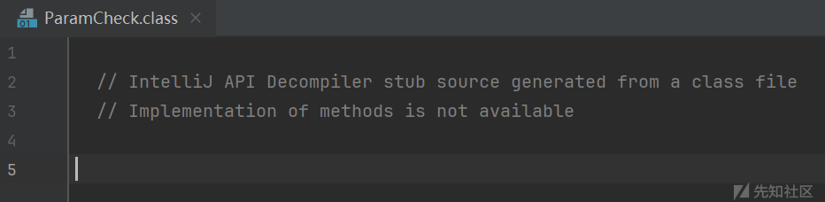
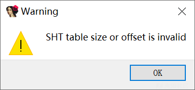
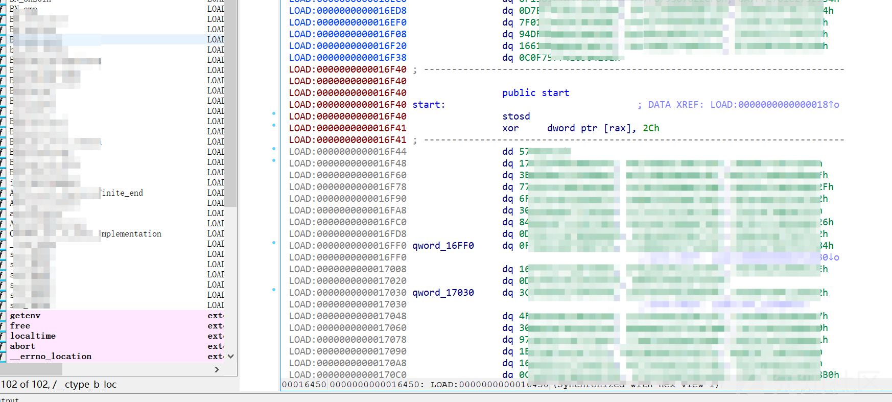
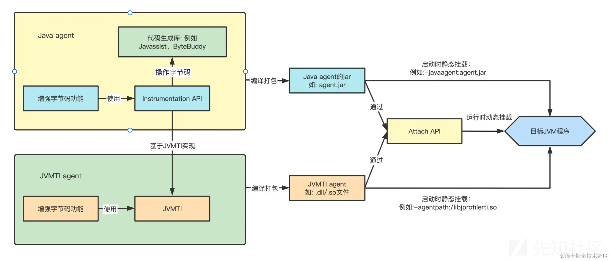
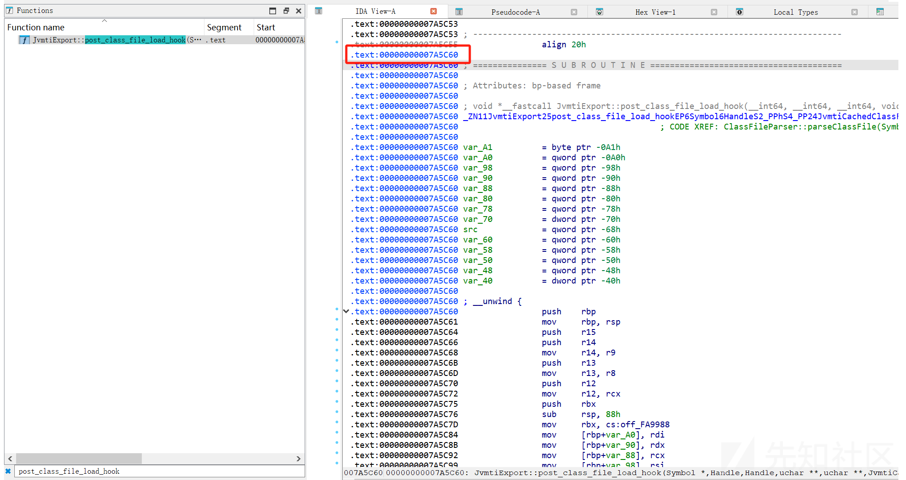
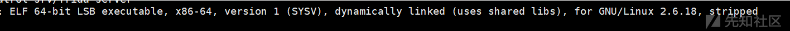
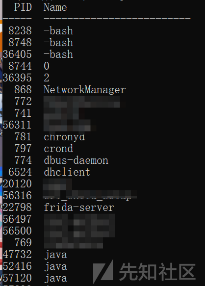
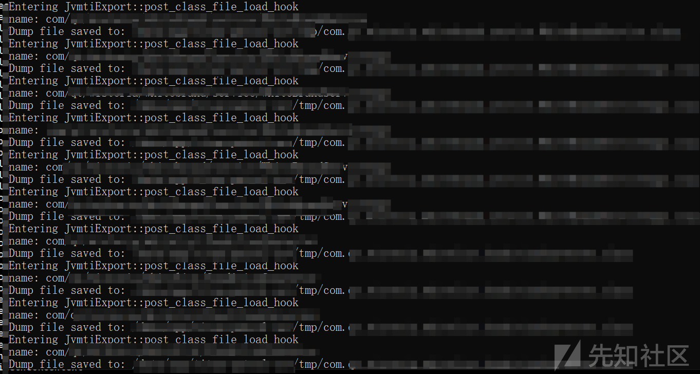
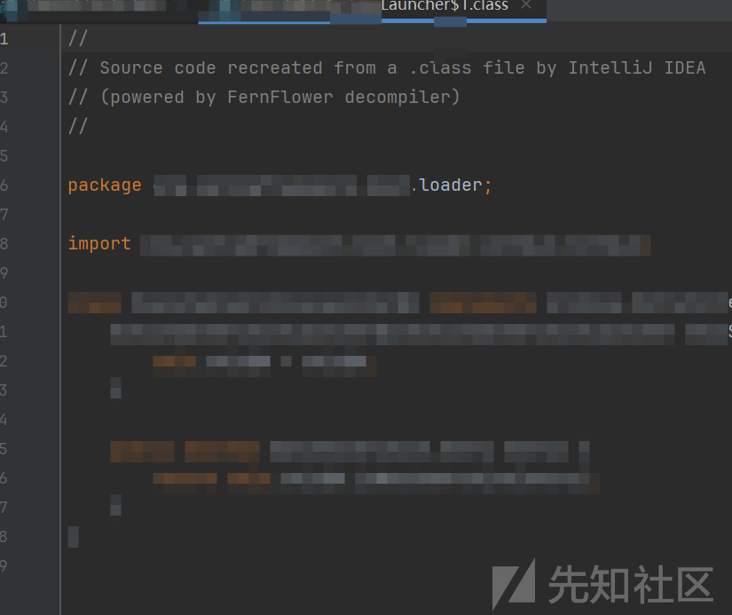

# Java 代码解密：使用 Frida 还原 JVMTI Agent 加密保护的java类-先知社区

> **来源**: https://xz.aliyun.com/news/16491  
> **文章ID**: 16491

---

# 从一个奇怪jar开始の奇妙分析

在一次平常的代码审计中，我在尝试反编译一个 JAR 文件，发现大部分的CLASS反编译失败了，返回的结果一片空白



这一定是被什么东西加密了，平常也经常遇到java agent的加密，先检查一下JVM启动参数

/bin/java -- -Dsun.misc.URLClassPath.disableJarChecking=true -agentpath:./xxxagent.so

但是这次好像不太一样，agentpath 参数对应的不是JAR 而是一个so库，这里只能先试着逆着看看了


## 从零开始の代码还原

### SO分析

接下来就开始使用ida分析这个so了



这看起来不太妙



IDA仅识别出了一部分函数，并且大多数函数体无法正确反编译。我不太擅长逆向，这里节约时间只能使用其他方法了。

### JVMTI



不同于常见的Java Agent ，目标项目使用了一种更底层的Agent类型 JVM Tool Interface (JVM TI) Agent。它是通过JVM导出的C++ API 对JVM 进行操作，来实现某些特定功能。

通过阅读JVMTI的相关文档发现 JVMTI Agent 可以通过注册 ClassFileLoadHook 来拦截 JVM 加载的类文件，从而实现在类加载时对其进行解密。

```
//场景的伪代码示例

void JNICALL ClassFileLoadHook(jvmtiEnv *jvmti_env, JNIEnv *jni_env, jclass class_being_loaded,

                               const char *name, jobject protection_domain, jint class_data_len,

                               const unsigned char *class_data, jint *new_class_data_len,

                               unsigned char **new_class_data) {

    // 在这里可以插入解密代码, 它会加载class文件之前进行解密操作


    std::cout << "Class file loaded: " << name << std::endl;


    // 例如，解密后的字节码存放到new_class_data中

    *new_class_data_len = class_data_len;  // 设置新的字节码长度

    *new_class_data = const_cast<unsigned char *>(class_data);  // 这里假设没有改变数据


    // 继续加载原始或解密后的class数据

}

jvmtiEnv *jvmti = nullptr;

JavaVM *jvm = nullptr;

JNIEXPORT jint JNICALL Agent_OnLoad(JavaVM *vm, char *options, void *reserved) {

    // 获取jvmti环境

    jint res = vm->GetEnv(reinterpret_cast<void **>(&jvmti), JVMTI_VERSION);

    if (res != JNI_OK || jvmti == nullptr) {

        std::cerr << "Error: Unable to access JVMTI version." << std::endl;

        return res;

    }


    // 注册ClassFileLoadHook回调

    jvmtiEventCallbacks callbacks = {0};

    callbacks.ClassFileLoadHook = &ClassFileLoadHook;


    res = jvmti->SetEventCallbacks(&callbacks, sizeof(callbacks));

    if (res != JVMTI_ERROR_NONE) {

        std::cerr << "Error: Unable to set event callbacks." << std::endl;

        return res;

    }


    // 启动ClassFileLoadHook事件

    res = jvmti->SetEventNotificationMode(JVMTI_EVENT_CLASS_FILE_LOAD, JVMTI_ENABLE, nullptr);

    if (res != JVMTI_ERROR_NONE) {

        std::cerr << "Error: Unable to enable class file load event." << std::endl;

        return res;

    }


    return JNI_OK;

}
```

显然，我们只要 HOOK Agent中定义的 ClassFileLoadHook函数就可以拿到解密后的class字节码。

但是加壳后Agent 的解密函数难以定位，这里我们只能转到JVM的代码中分析了。

### JVM

目标使用了Open JDK，到官网就可以下到历史版本的源码（Oracle JDK 并没有提供JVM部分的源码）。

简单的搜索了下JVM的源码，通过API关键字定位到了一个函数`hotspot\src\share\vm\prims\jvmtiExport.cpp:post_to_env`。

```
void post_to_env(JvmtiEnv* env, bool caching_needed) {

    unsigned char *new_data = NULL;

    jint new_len = 0;

  /*......*/

    JvmtiClassFileLoadEventMark jem(_thread, _h_name, _class_loader,

                                    _h_protection_domain,

                                    _h_class_being_redefined);

    JvmtiJavaThreadEventTransition jet(_thread);

    JNIEnv* jni_env =  (JvmtiEnv::get_phase() == JVMTI_PHASE_PRIMORDIAL)?

                                                        NULL : jem.jni_env();

    jvmtiEventClassFileLoadHook callback = env->callbacks()->ClassFileLoadHook;

    if (callback != NULL) {

      (*callback)(env->jvmti_external(), jni_env,

                  jem.class_being_redefined(),

                  jem.jloader(), jem.class_name(),

                  jem.protection_domain(),

                  _curr_len, _curr_data,

                  &new_len, &new_data);

    }

    if (new_data != NULL) {

      // this agent has modified class data.

      if (caching_needed && *_cached_class_file_ptr == NULL) {

        // data has been changed by the new retransformable agent

        // and it hasn't already been cached, cache it

        JvmtiCachedClassFileData *p;

        p = (JvmtiCachedClassFileData *)os::malloc(

          offset_of(JvmtiCachedClassFileData, data) + _curr_len, mtInternal);

        if (p == NULL) {

          vm_exit_out_of_memory(offset_of(JvmtiCachedClassFileData, data) + _curr_len,

            OOM_MALLOC_ERROR,

            "unable to allocate cached copy of original class bytes");

        }

        p->length = _curr_len;

        memcpy(p->data, _curr_data, _curr_len);

        *_cached_class_file_ptr = p;

      }


      if (_curr_data != *_data_ptr) {

        // curr_data is previous agent modified class data.

        // And this has been changed by the new agent so

        // we can delete it now.

        _curr_env->Deallocate(_curr_data);

      }


      // Class file data has changed by the current agent.

      _curr_data = new_data;

      _curr_len = new_len;

      // Save the current agent env we need this to deallocate the

      // memory allocated by this agent.

      _curr_env = env;

    }

  }

  /*......*/

};
```

在JVM加载class字节码的时候，JVM会判断当前是否存在jvmtiEventClassFileLoadHook。如果存在就先执行hook，如果执行后字节码被修改则使用修改后的字节码。

一路跟随，我找到了这个函数，这个函数看起来非常适合HOOK，这里就决定使用它了。

```
// this entry is for class file load hook on class load, redefine and retransform

void JvmtiExport::post_class_file_load_hook(Symbol* h_name,

                                            Handle class_loader,

                                            Handle h_protection_domain,

                                            unsigned char **data_ptr,

                                            unsigned char **end_ptr,

                                            JvmtiCachedClassFileData **cache_ptr) {

  JvmtiClassFileLoadHookPoster poster(h_name, class_loader,

                                      h_protection_domain,

                                      data_ptr, end_ptr,

                                      cache_ptr);

  poster.post();

}
```

JVM 的模块名是libjava.so，找到目标的JDK位置，寻找模块并保存下来。用IDA 反编译，找到对应函数的地址偏移以备后续使用。注意这里必须和目标环境上的完全一致。



现在HOOK所需的条件已经齐全了，下面需要找到一个合适的HOOK框架来HOOK这个函数。

### Frida

Frida 是一个易用的HOOK框架，它可以大大的简化HOOK的流程。它只要编写简单的JS代码就可以在不同的平台完成一些复杂的HOOK操作。

网上大部分的文章都写的是Frida在安卓平台下的HOOK教程，但是该工具其实是跨平台的，其中Frida也支持linux和windows平台。

##### Linux平台下的远程 Frida HOOK

###### HOOK环境搭建

被调试机配置很简单，不需要安装python环境，这里只需要将`frida-server`的二进制文件上传到目标服务器就可以了。

（吐槽一下 虽然它的体积有十几MB，但并不是静态编译的，如果遇到特殊环境，可能需要自行进行静态编译。）



在目标环境上启动Frida服务器 `0.0.0.0` 使用默认端口`27042`

`frida-server -l 0.0.0.0:27042`

在本地安装完整的frida命令行工具集 `frida-tools`

`pip install frida-tools`

连接目标测试下

`frida-ps -H 192.168.12.1`

如果连接成功，它会列出服务器上的进程列表



现在就可以开始远程HOOK了。frida -f 指定执行的文件路径，后面可以跟上命令行参数

`frida -H 192.168.12.1 -f /bin/java -- -agentpath:./xxxxx.so -jar /xxxxxx.jar`

如果连接成功，会启动一个控制台。和常见的调试工具一样，启动HOOK后进程是暂停状态，这是可以预先写一些脚本指令。除了几个基本的指令外，都是使用js语法的语句执行一些操作，具体参考官方文档

```
[Remote::java ]-> %help

Available commands:

  %resume(0) - resume execution of the spawned process

  %load(1) - Load an additional script and reload the current REPL state

  %reload(0) - reload (i.e. rerun) the script that was given as an argument to the REPL

  %unload(0) - no description

  %autoperform(1) - receive on/off as first and only argument, when switched on will wrap any REPL code with Java.performNow()

  %autoreload(1) - disable or enable auto reloading of script files

  %exec(1) - execute the given file path in the context of the currently loaded scripts

  %time(1+) - measure the execution time of the given expression and print it to the screen

  %help(0) - print a list of available REPL commands
```

###### HOOK JVM

为了HOOK JVM的目标函数，我们需要找到libjava.so模块的基址

```
Module.enumerateExports("libjava.so", {

    onMatch: function(exp) {

        console.log("Exported function: " + exp.name + " | Address: " + exp.address);

    },

    onComplete: function() {

        console.log("Finished enumerating exports.");

    }

});
```

frida 需要输入`%resume`指令来继续进程的执行。不出意外的话，你可能会发现获取不到你要找的模块。

那是因为脚本执行时，目标模块可能还没有被加载。为了解决这种情况，可以先让程序执行一段时间加载模块后，再执行脚本。

但是这里其实还有一种更优雅的方法，我们可以HOOK C标准库的`dlopen` 函数，拦截进程内动态库的动态加载过程。在检测到我们需要的模块加载后，我们再去获取模块基址。

###### HOOK dlopen

先查看下dlopen的函数声明  
`void *dlopen(const char *filename, int flags);`  
第一个参数`filename`就是我们需要的参数，我们可以根据加载的模块名来判断出合适的HOOK时机。

`*filename`是一个指向字符串的指针，这里可以直接使用Frida预先定义好的方法readCString 一键读取指针对应的C字符串。

`args[0].readCString();`

`Interceptor.attach` 是最基础的hook 语法，它可以HOOK一个函数的调用。

`onEnter`会在函数被调用前被触发，`onLeave`会在函数调用完成被触发

```
// HOOK模块加载

const moduleName = "libjvm.so"; // JVM模块

var dlopen = Module.findExportByName(null, "dlopen"); //查找dlopen函数的地址

if(dlopen != null){

    // 使用Interceptor来对dlopen函数进行拦截

    Interceptor.attach(dlopen,{

        // 当dlopen函数被调用时触发 这时模块还没有被加载

        onEnter: function(args){

            // 读取第一个参数，即加载的模块名称 *filename

            var soName = args[0].readCString();

            console.log(soName);

            // 检查模块名称是否包含目标模块名

            if(soName.indexOf(moduleName) != -1){

                this.hook = true;// 标记已找到目标模块

            }

        },

        // 当dlopen函数执行完返回时触发 也就是模块加载完成后

        onLeave: function(retval){

            if(this.hook){

                hookFunction();// 执行我们的HOOK函数

            }

        }

    });

}
```

这下应该就可以获取到`libjvm`模块的基址了。

拿到的基址加上我们之前用IDA寻找的地址偏移，我们就可以得到目标函数实际上在目标机器的函数地址。

```
const moduleName = "libjvm.so";

const functionOffset = 0x7A5C60; // 函数的实际偏移量

    const baseAddress = Module.findBaseAddress(moduleName);

    if (baseAddress === null) {

        console.log("Module not found: " + moduleName);

        return;

    }

const targetAddress = baseAddress.add(functionOffset);
```

###### HOOK JVMTI

接下来开始HOOK目标函数，下面是目标函数的声明。

```
static void post_class_file_load_hook(Symbol* h_name, Handle class_loader,

                                        Handle h_protection_domain,

                                        unsigned char **data_ptr, unsigned char **end_ptr,

                                        JvmtiCachedClassFileData **cache_ptr) NOT_JVMTI_RETURN;
```

`h_name` 是加载的类名，我们需要利用这个参数还原class文件名（虽然也可以全部dump完用框架读字节码的类名），但它不是一个标准的C字符串类型。而是一个 `Symbol` 对象，它是JVM 内部用来表示字符串的结构。

稍微看一下这个结构体

```
class SymbolBase : public MetaspaceObj {

 public:

  ATOMIC_SHORT_PAIR(

    volatile short _refcount,  // needs atomic operation

    unsigned short _length     // number of UTF8 characters in the symbol (does not need atomic op)

  );

  int            _identity_hash;

};


class Symbol : private SymbolBase {

  friend class VMStructs;

  friend class SymbolTable;

  friend class MoveSymbols;

 private:

  jbyte _body[1];

  .....

}
```

在内存中的布局

```
| _refcount (2 bytes) | _length (2 bytes) | _identity_hash (4 bytes) | _body[1] (variable length) |
```

`_length`是 \_body(字符串)的长度。

根据这些信息，我们就可以通过简单的偏移计算来读出Java字符串了。

```
function getSymbolString(symbolAddr) {

    // 读取 Symbol 的 _length 字段，它是一个 unsigned short 类型（2 字节）

    const length = ptr(symbolAddr).add(2).readU16();

    // 读取 _body 数组的首地址，从它开始读取 _length 长度的字节数据

    const symbolBodyAddr = ptr(symbolAddr).add(8); // _body 的起始偏移是 8 字节

    // 使用 readByteArray 读取字节，再将其转换为 UTF-8 字符串

    const byteArray = symbolBodyAddr.readByteArray(length);

    const str = Memory.readUtf8String(byteArray, length);

    return str;

}
```

之后就可以开始实现dump class了

为了获取解密的结果，我们需要先在进入函数时拿到解密class 的两个偏移存放地址的地址，以备后续函数执行完成使用。

`this.ptrAddress = args[3];`

`this.endPtrAddress = args[4];`

在函数执行完成后，这两个地址对应的内容会变成我们需要的数据位置

`const ptr = this.ptrAddress.readPointer();`

`const endPtr = this.endPtrAddress.readPointer();`

最后使用拿到的内存位置来读取数据，并写入到以class名命名的文件

```
function hookFunction() {

    const baseAddress = Module.findBaseAddress(moduleName);

    if (baseAddress === null) {

        console.log("Module not found: " + moduleName);

        return;

    }

    const targetAddress = baseAddress.add(functionOffset);

    console.log("Hooking function at: " + targetAddress);

    //JvmtiExport::post_class_file_load_hook(name, class_loader(), protection_domain, &ptr, &end_ptr, &cached_class_file);

    Interceptor.attach(targetAddress, {

        onEnter: function(args) 

            this.ptrAddress = args[3];

            this.endPtrAddress = args[4];

            this.name = getSymbolString(args[0]);  //偏移量8处存储字符串内容

        },

        onLeave: function(retval) {

            console.log("Entering JvmtiExport::post_class_file_load_hook");

            console.log("name: " + this.name  );

            //读取ptr和end_ptr的值

            const ptr = this.ptrAddress.readPointer();

            const endPtr = this.endPtrAddress.readPointer();

            // 计算读取范围

            const length = endPtr.sub(ptr).toInt32();

            //>0

            if (length > 0) {

                // 读取 ptr 到 end_ptr 范围内的数据

                const data = ptr.readByteArray(length);

                const dumpPath = "/tmp/"+this.name.replaceAll("/",".") +".class";

                const file = new File(dumpPath, "wb");

                file.write(data);

                console.log("Dump file saved to: " + dumpPath);

                file.flush();

                file.close();

            } else {

                console.log('Invalid memory range to dump.');

            }


        }

    });
```

使用 `-l` 参数加上刚刚写的脚本，执行脚本

`frida -H 192.168.12.1 -l hook.js -f /bin/java -- -agentpath:./xxxxx.so -jar /xxxxxx.jar`



成功解密class类



接下来就可以写一个简单的`classloder` 来触发所有的class类加载，加载后的class同时会被解密。这样就可以实现完整的jar解密，而不是只能解密已经加载的class。

因为这种方法是在JVM解析class字节码前拦截的，所以即使class加载出错（少依赖 字节码问题），也可以正常dump。

## 参考

【JVM】Java agent超详细知识梳理 <https://juejin.cn/post/7157684112122183693>

JVM(TM) Tool Interface 1.2.3 <https://docs.oracle.com/javase/8/docs/platform/jvmti/jvmti.html>

Frida JavaScript <https://frida.re/docs/examples/javascript/>
