# 某edu证书站渗透测试-先知社区

> **来源**: https://xz.aliyun.com/news/16493  
> **文章ID**: 16493

---

本文章中所有内容仅供学习交流，严禁用于商业用途和非法用途，否则由此产生的一切后果均与文章作者无关

### 前言

在挖掘edusrc中最重要的环境就是信息收集，因为现在安全意识的提高，经常会遇见一些设备或者是waf，但对我这种小白来说，绕waf只会一些基础的思路很难绕过，只有做好信息收集拿到账号或者是一些敏感信息进行下一步的操作。我在挖掘过程中就发现了一个非常简单的key泄露进行了通杀。

### 信息收集

我使用的思路是主要测试sql注入，使用hunter进行信息收集。主要就是为测登录框，然后找一些旁站进行挖掘。  
命令:

```
domain="edu.cn"&&body="注册"&&body="Login"&&title="系统"还可搜索body="/upload"
```

谷歌语法了使用起来非常的方便下列进行举例师傅们可以根据这些进行拓展

```
配合使用：
site: xxx.edu.cn intest:"学号|身份证|姓名|24&23级信息"
关键词 intext:证件号(需要什么搜什么) filetype:pdf
林业管理 物业管理 城市管理 城市管理 学生管理 交通管理 智慧管理 智慧平台 校园卡 学院管理
```

还有一些特殊扩展名也可以进行利用

```
site: *.edu.cn filetype:txt OR filetype:xLs OR filetype:xlsx OR filetype:doc OR filetype:docx OR filetype:pdf
```

当然大家可以根据一些自己思路自行增加或者是修改，当然社区有很多大佬写的很好的文章  
<https://xz.aliyun.com/t/15337>  
<https://xz.aliyun.com/t/9994>

### 案例1

#### 水平越权

使用hunter进行测绘发现了一个某技校的迎新系统，并进行信息收集。  
使用谷歌语法：siet: URL intest："sfz| xh "  
  
成功收集到sfz，并成功查看到信息。查看到还有一个查看通知书的功能进行进一步测试。  
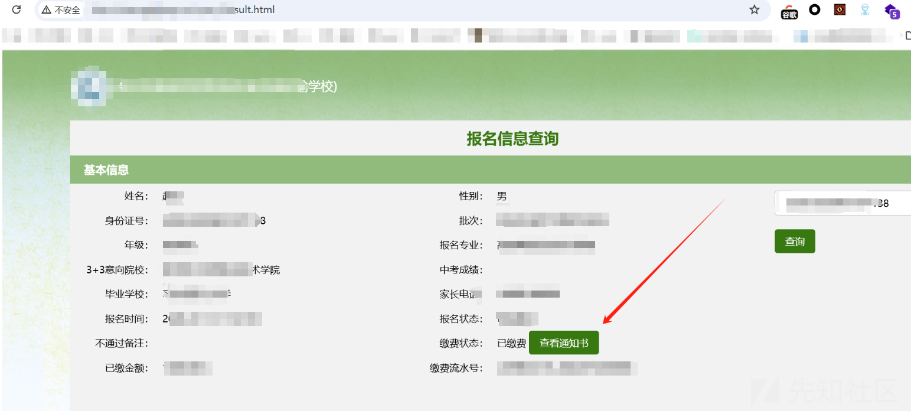  
思路非常清晰看见id就给他改一下看能否进行越权。并测试了其他功能点的id也能成功遍历，大致思路一样就不进行说明了。  
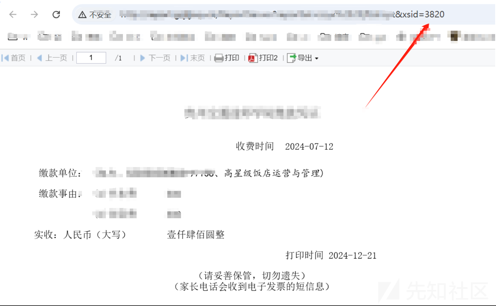  
更改以后成功越权，但是这样手动遍历非常的繁琐，这里可以写一个py脚本来帮助我们证明具体泄露量有多大。  
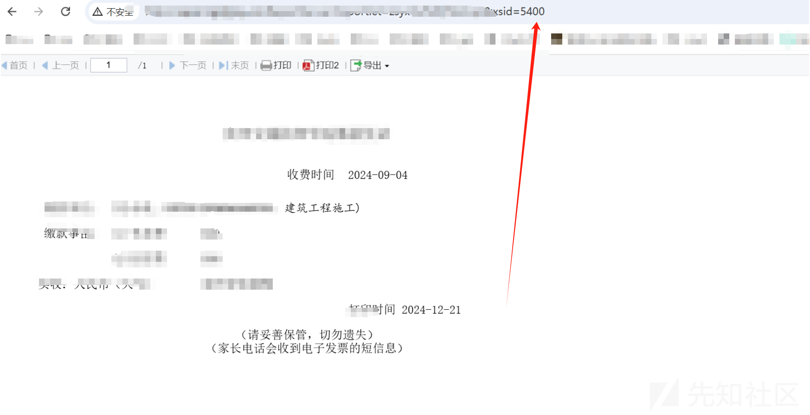  
脚本如下

```
import requests
import concurrent.futures

# URL 前缀
url_prefix = "url"

# 成功回显计数器
success_count = 0

# 请求函数
def check_url(xsid):
    global success_count
    full_url = url_prefix + xsid
    try:
        # 发送请求
        response = requests.get(full_url, timeout=5)
        # 如果状态码是 200，打印成功的 URL
        if response.status_code == 200:
            success_count += 1
            print(f"Success: {full_url}")
    except requests.exceptions.RequestException as e:
        # 处理请求异常
        pass

# 使用线程池来加速请求
with concurrent.futures.ThreadPoolExecutor(max_workers=10) as executor:
    # 遍历从 0000 到 9999 的 ID
    executor.map(lambda i: check_url(f"{i:04d}"), range(10000))

# 输出成功回显的总数
print(f"\nTotal successful responses: {success_count}")

```

将该脚本跑出来的结果贴在你的报告中，审核员也会一眼明了。

### 案例2

#### swagger接口未授权访问+任意文件下载

直接看图，这里给大家推荐一个工具主要就是遍历所有API接口，自动填充参数非常的方便。也有一些一键梭哈的接口的工具，大家也可以梭哈完成后手测，但不要太过依赖工具这样可能会错失很多QAQ。  
地址：<https://github.com/lijiejie/swagger-exp>  
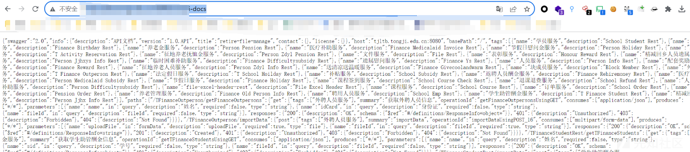  
当获取到接口以后将接口复制到api-docs.json保存。  
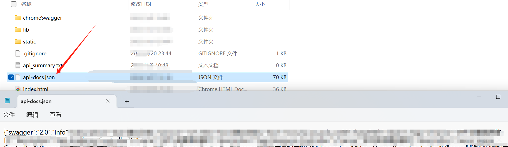  
运行swagger-exp.py就可以直接进行就可进行查看。  
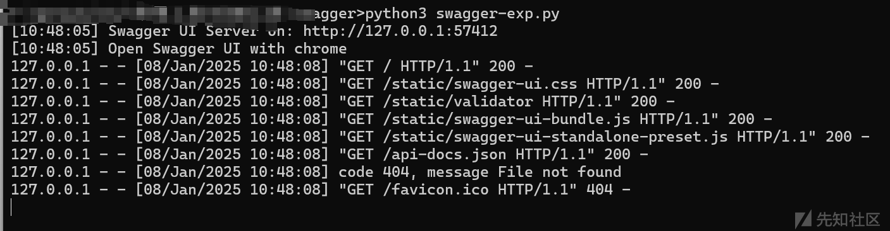  
发现其中可以利用一个接口获取人员信息。在下面的图片中有一个2000的功能点可以使用burp遍历查看其中有的存活，会方便很多。  
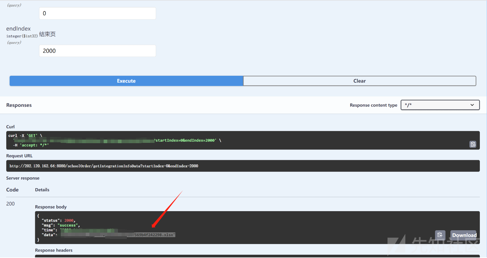  
然后进行接口拼接成功下载文件后可以直接看见sfz等敏感信息。在文件中可以发现之前说到的2000用于控制文件数据条数的。  
  
中危。  


### 案例3

#### 任意文件上传

信息收集中没用拿到账号，就在外围查看找一些未授权接口查看是否能利用。  
  
在burp中查看历史过程中发现一个接口，改为POST后上传一个xml文件打一个xss。  
  
返回包中也存在文件路径直接进行并接访问。  
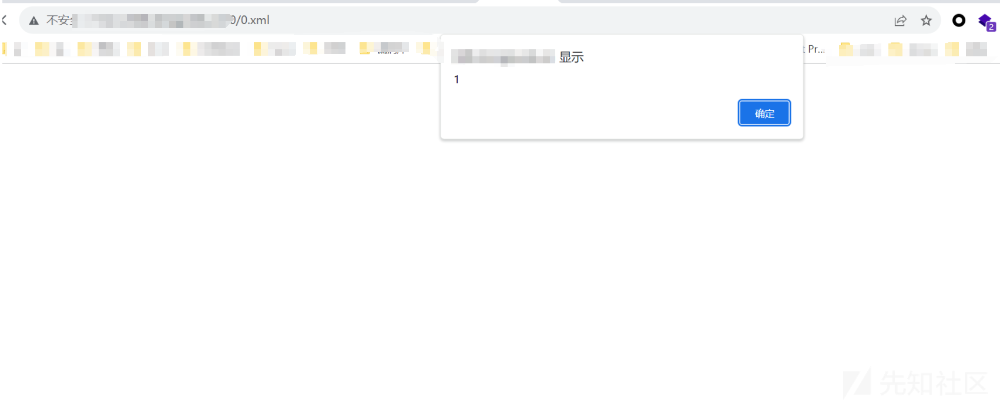  
这里就只有低危。  


### 案例4

#### Druid未授权

这里也是开局一个登录框，在摸索了半天也没有找到可以利用的点，但是看样子像一个通用系统，通过特征查找一些类似的系统看看有没有突破口。  
  
然后还是有惊喜的发现了一个专家入口，抓包查看发现一个参数看名字应该是登录验证。在数据包中还有shiro。  
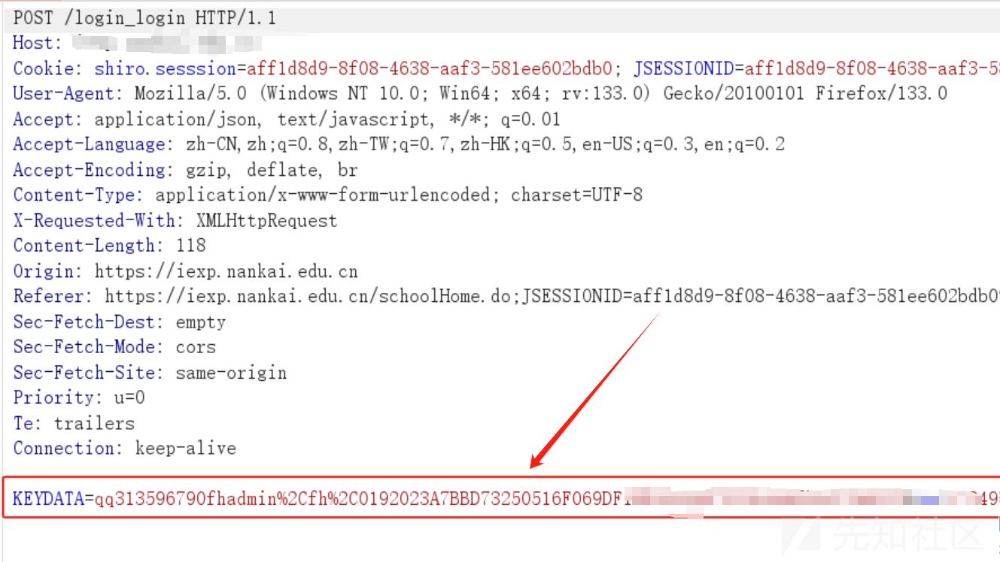  
后回到需要测试的系统使用key成功登录。  
  
进去以后burp就检测到存在Druid。  
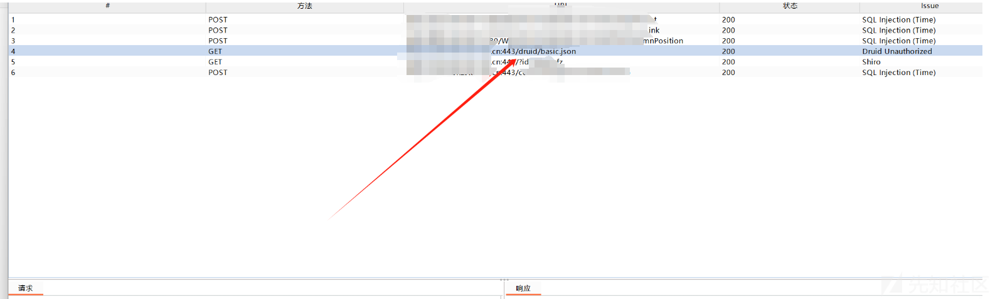  
拼接接口后查看成功未授权。  
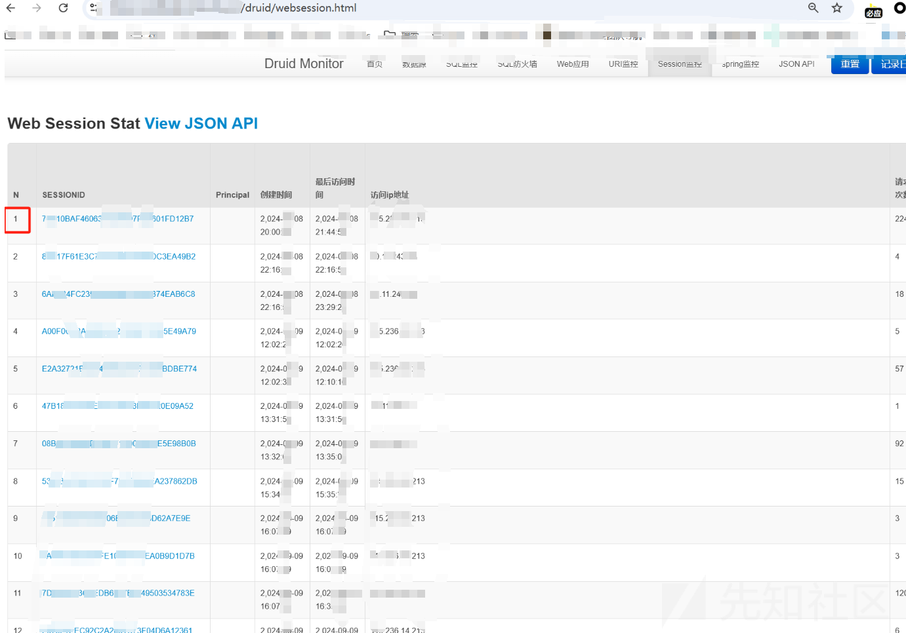  
Druid打法还有很多这里给大家推荐一个文章个人感觉写的非常的强。  
<https://mp.weixin.qq.com/s/b44dwzmc7LVj2BUtsyfewA>
