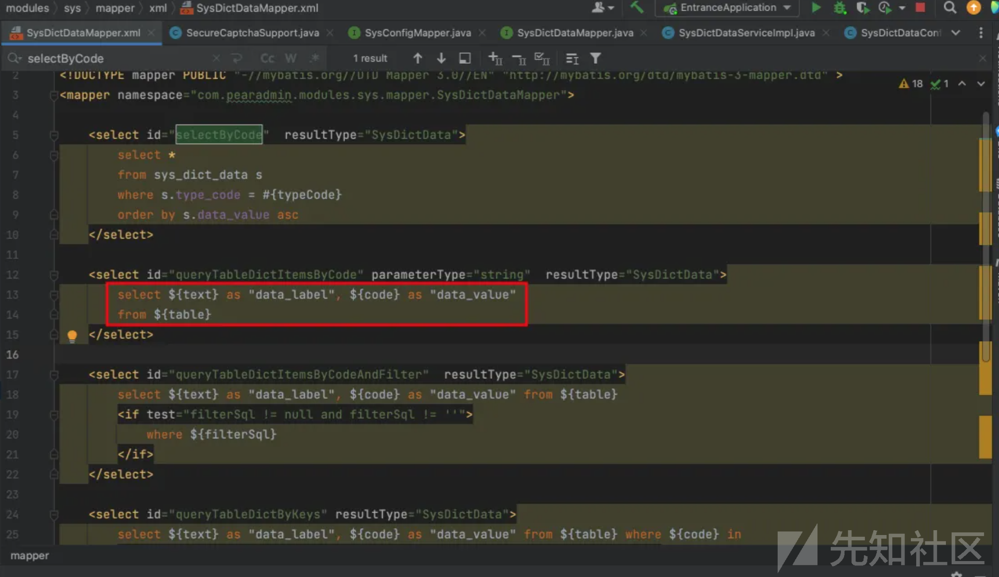
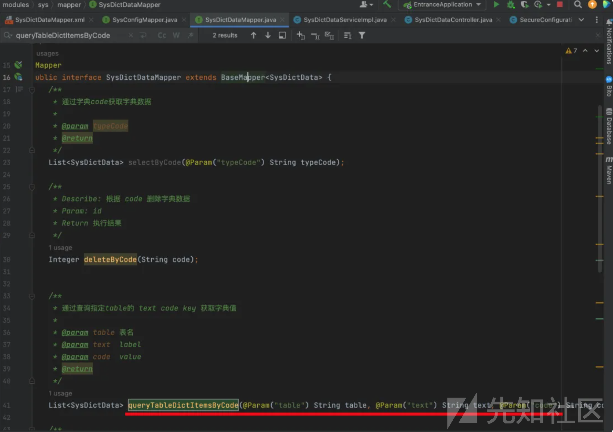
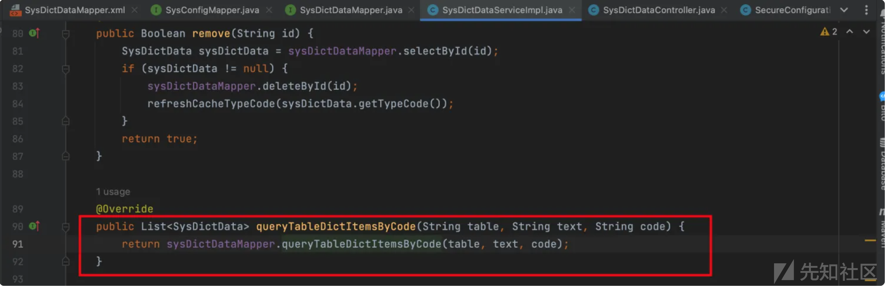
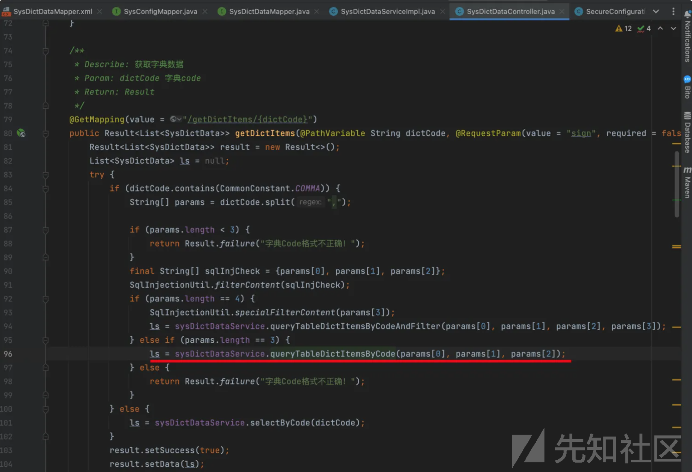
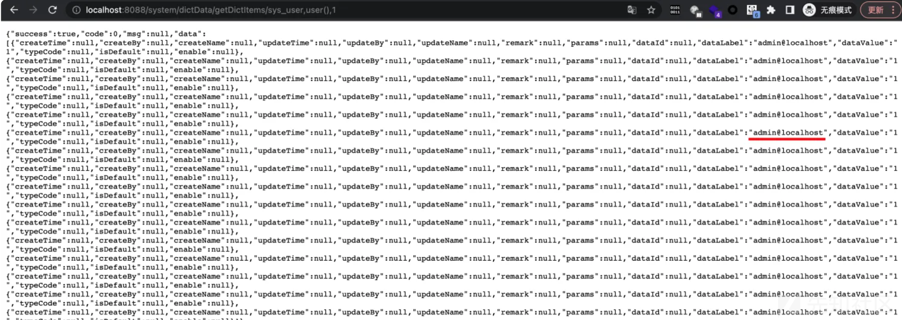

# Pear Admin Boot2.0.2-后台getDictItems/sys_user接口SQL注入（CVE-2024-6241）-先知社区

> **来源**: https://xz.aliyun.com/news/16510  
> **文章ID**: 16510

---

## 简介

Pear Admin Boot 是 Pear Admin 开源社区推出的 Spring Boot 生态下的快速开发平台，采用 Pear Admin Layui 作为用户交互UI ，并集成权限控制，流程设计，代码生成，定时任务模块 帮助用户快速构建业务体系。

## 漏洞分析

1、通过全局搜索可以直接定位 ${} ，观察这里传入的text、code、table三个参数均没有做任何过滤操作，下面我们来寻找他们都是如何进行传参



2、根据上面的定位往上查到对应的mapper层，我们在图中就可以看到，这里的 queryTableDictItemsByCode�（）方法会接收这三个参数，下面我们寻找哪里又调用了这个方法



3、在下图调用的这个方法仍然没有对参数做过滤，继续跟踪 queryTableDictItemsByCode（）方法



4、最终来到 controller层，通常在这一层就能发现具体从哪个路径传递进来的参数了，在 getDictItems/{{dictCode}}� 接口我们可以直接给text、code、table这三个变量进行赋值，并且能根据下图构造路由了



## 漏洞复现

```
http://localhost:8088/system/dictData/getDictItems/sys_user,user(),1
```


