# UJCMS v9.7.3代码审计-先知社区

> **来源**: https://xz.aliyun.com/news/16512  
> **文章ID**: 16512

---

# 前言

网上开源CMS基本上出来一个星期左右就没戏了，但是还是想试一试，随便找一套源代码，简单审计一下，看看有无收获

# 审计

登录网站，文件处可进行文件上传

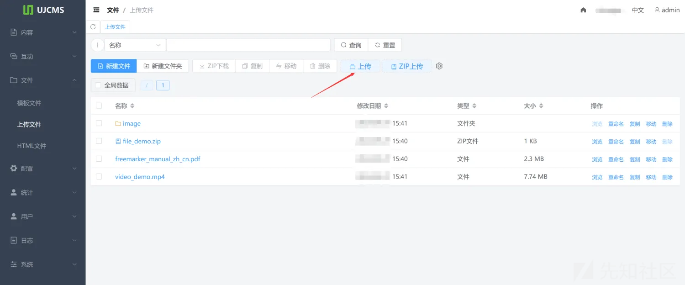  
上传文件发现jsp和jspx都不行，这里一般就是做了过滤，但是我们可以通过代码审计来分析一下

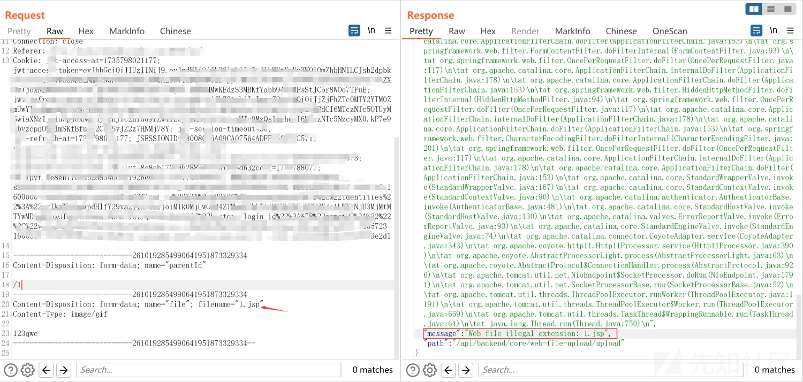

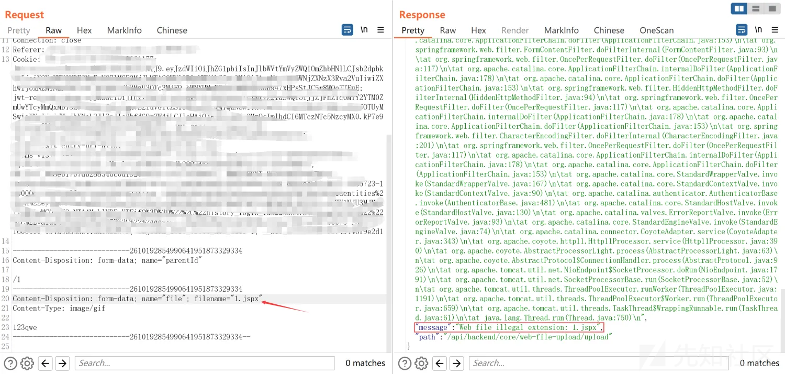  
通过上述我们可以知道文件上传处理接口为/api/backend/core/web-file-upload/upload，我们可以直接搜索关键词来定位关键代码

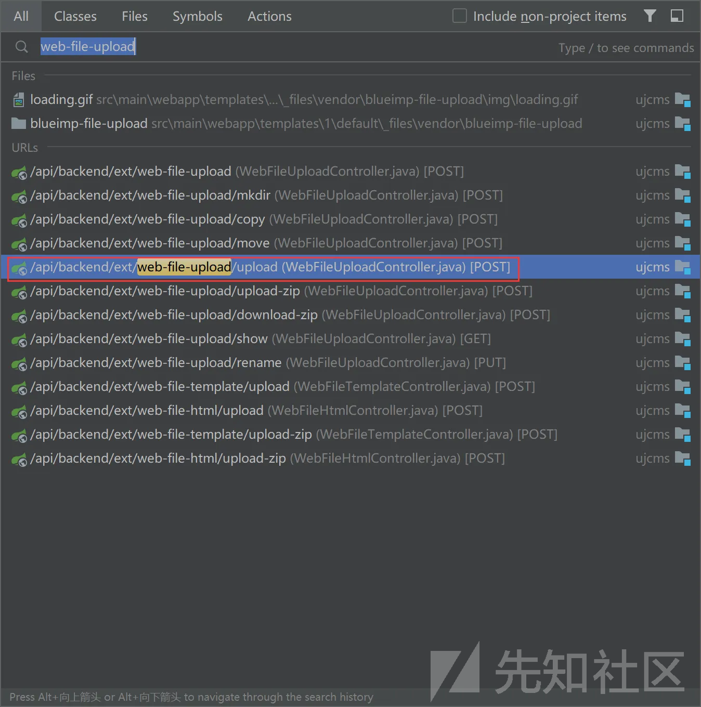  
发现文件处理代码

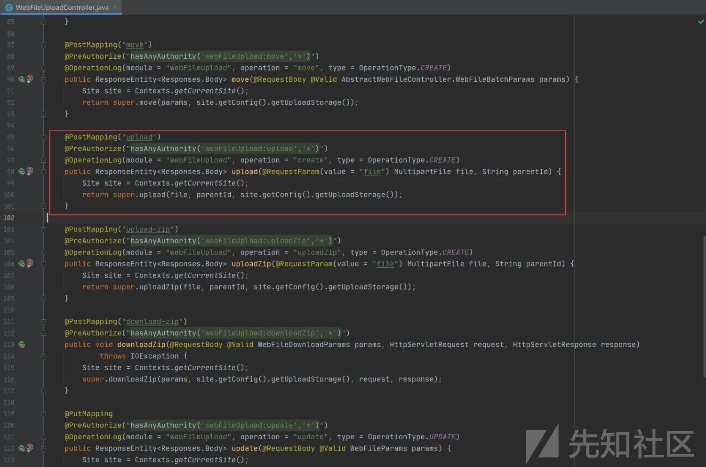  
我们通过上述代码可知主要由100行的upload进行处理，跟进upload函数跳转至如下图121进行处理

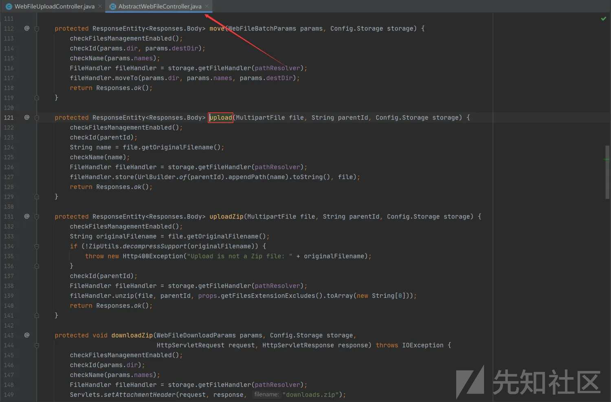  
通过上图发现在125行存在checkName函数，跟进函数，发现此处正是抓包上传脚本文件回显异常处理的代码，并且在227行先对扩展名进行统一转换为大小写然后进行判断

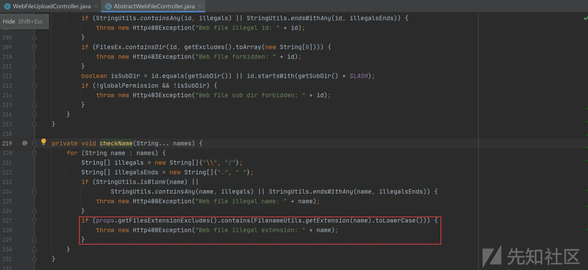  
通过上图我们可以知道由getFilesExtensionExcludes函数对我们的文件后缀进行检测，我们跟进该函数发现跳转至如下图，定义了一个filesExtensionBlacklist变量

  
发现该变量主要是对脚本文件后缀进行处理但是，并没有对html后缀进行处理，并且使用的黑名单过滤，明显还存在jspa这种后缀可以进行上传

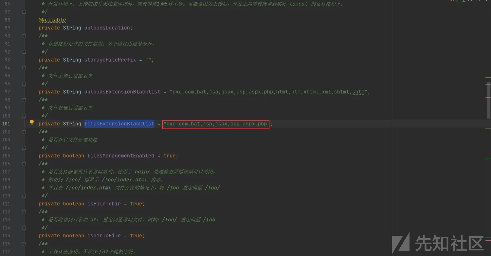  
我们通过测试，发现jspa文件上传成功，但是访问文件时进行了下载，猜测是spring框架的问题  
这里说一下，互联网上有大佬可以进行上传web.xml覆盖tomcat文件进行getshell，有兴趣的师傅可以试一下

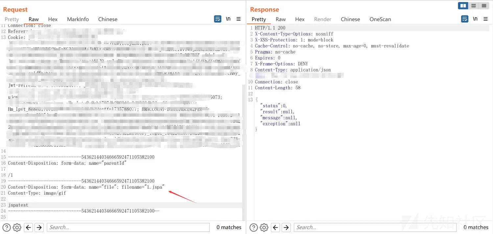

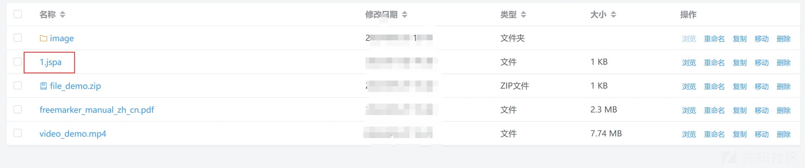

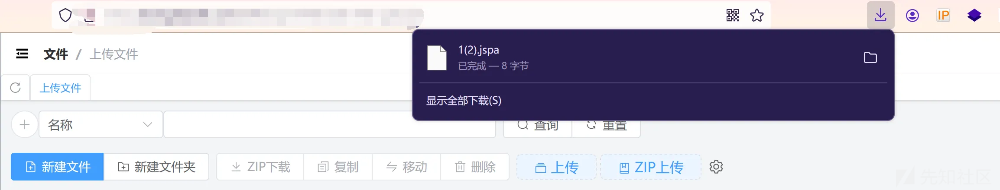  
但是可以上传html文件造成存储型XSS

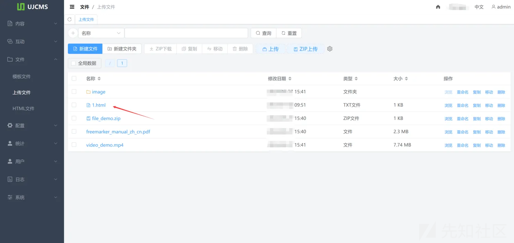

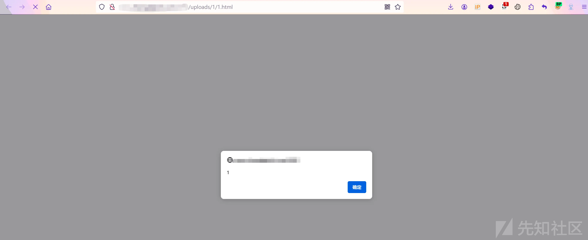  
通过上述我们发现其实黑名单进行文件后缀过滤是非常不安全得，并且该CMS我感觉在黑名单变量处理处存在缺陷，如下图所示，我们发现存在两个文件上传的变量，但是对于后缀的过滤确实不同的，明显filesExtensionBlacklist变量过滤的更少，且相较于uploadExtensionBlacklist变量而言没有过滤html相关的前端文件后缀，因此造成XSS产生

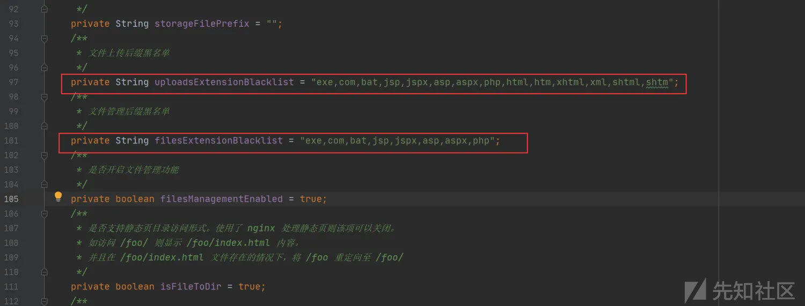  
这里模板文件模块处存在模板编辑功能，也可进行存储型XSS

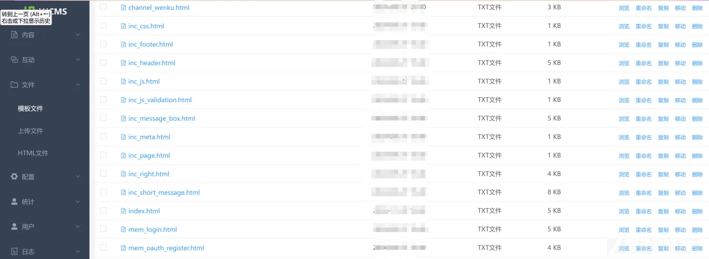
