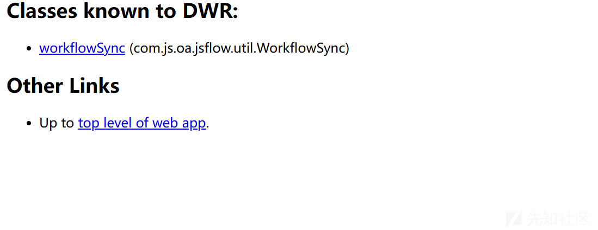
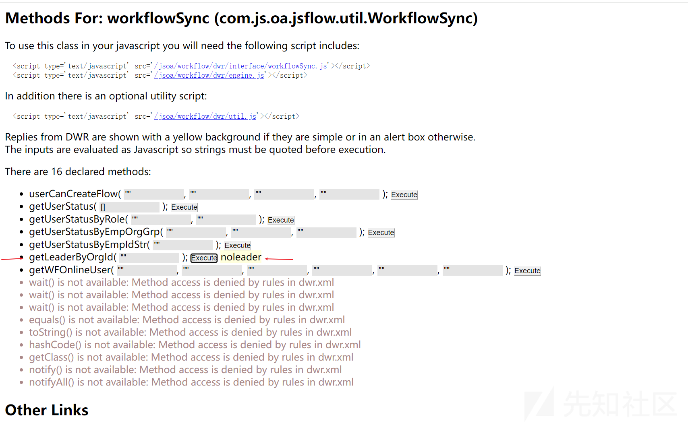
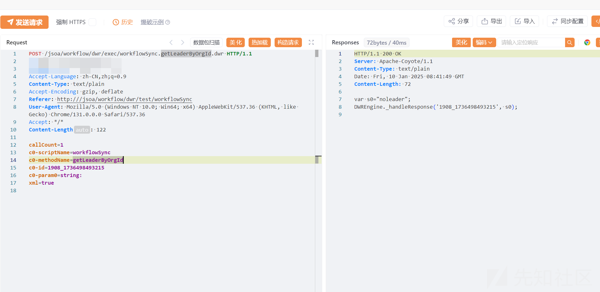
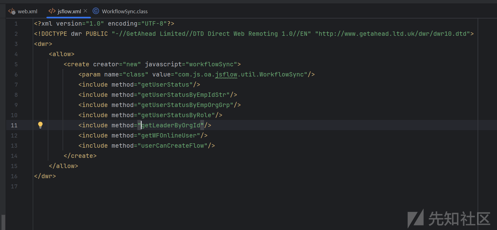
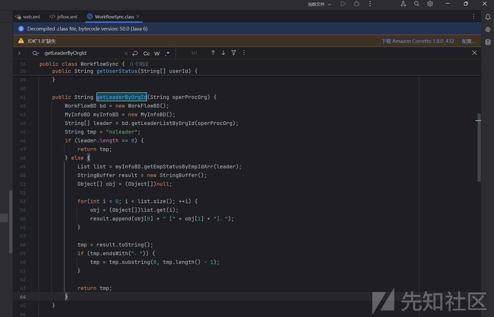
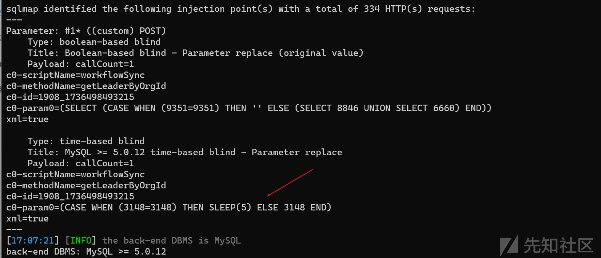
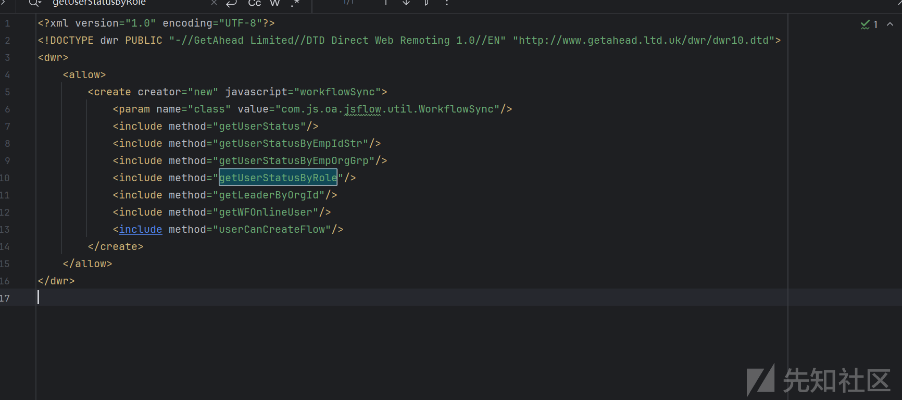

# 某OA dwr组件未授权导致SQL注入分析-先知社区

> **来源**: https://xz.aliyun.com/news/16515  
> **文章ID**: 16515

---

### **0x01** 漏洞介绍

北京九思协同办公软件/workflow/dwr/接口处存在SQL注入漏洞，攻击者除了可以利用 SQL 注入漏洞获取数据库中的信息（例如，管理员后台密码、站点的用户个人信息）之外，甚至在高权限的情况可向服务器中写入木马，进一步获取服务器系统权限。

### **0x02** 漏洞分析

在WEB-INF/web.xml 中存在 dwr-workflow，匹配路由 /workflow/dwr/\*

```
<servlet-mapping>
    <servlet-name>dwr-workflow</servlet-name>
    <url-pattern>/workflow/dwr/*</url-pattern>
  </servlet-mapping>

```

设置一个名为 dwr-workflow 的Servlet，它使用了 Direct Web Remoter (DWR) 技术来允许客户端JavaScript直接调用Java方法uk.ltd.getahead.dwr. ，发现是一个第三方组件dwr。

```
<servlet>
       <servlet-name>dwr-workflow</servlet-name>
       <display-name>DWR Servlet</display-name>
       <description>Direct Web Remoter Servlet</description>
       <servlet-class>uk.ltd.getahead.dwr.DWRServlet</servlet-class>  #DWR组件
       <init-param>
           <param-name>debug</param-name>
           <param-value>true</param-value>
       </init-param>
       <init-param>
           <param-name>config-webform</param-name>
           <param-value>/WEB-INF/xml/jsflow.xml</param-value>
       </init-param>
   </servlet>

```

关于dwr的介绍我们可以看一下远海师傅的介绍 <https://xz.aliyun.com/t/8431>

访问 jsoa/workflow/dwr/




点击workflowSync，进入测试方法页面。测试方法如红框所示。





获取数据包如下

```
POST /jsoa/workflow/dwr/exec/workflowSync.getLeaderByOrgId.dwr HTTP/1.1
Host: 
Accept-Language: zh-CN,zh;q=0.9
Content-Type: text/plain
Accept-Encoding: gzip, deflate
User-Agent: Mozilla/5.0 (Windows NT 10.0; Win64; x64) AppleWebKit/537.36 (KHTML, like Gecko) Chrome/131.0.0.0 Safari/537.36
Accept: */*
Content-Length: 122

callCount=1
c0-scriptName=workflowSync
c0-methodName=getLeaderByOrgId
c0-id=1908_1736498493215
c0-param0=string:
xml=true
```

定位接口 getLeaderByOrgId





```
public String getLeaderByOrgId(String operProcOrg) {
```

定义了一个公共方法 `getLeaderByOrgId`，接受一个字符串类型的参数 `operProcOrg`，并返回一个字符串类型的值。

```
WorkFlowBD bd = new WorkFlowBD();
    MyInfoBD myInfoBD = new MyInfoBD();
```

创建了两个实例：`WorkFlowBD` 类的 `bd` 和 `MyInfoBD` 类的 `myInfoBD`。

```
String[] leader = bd.getLeaderListByOrgId(operProcOrg);
```

这里的 `getLeaderListByOrgId` 方法是关键。如果该方法直接将 `operProcOrg` 参数用于构建SQL查询语句

**0x03** 漏洞复现



```
<include method="getUserStatus"/>
            <include method="getUserStatusByEmpIdStr"/>
            <include method="getUserStatusByEmpOrgGrp"/>
            <include method="getUserStatusByRole"/>
            <include method="getLeaderByOrgId"/>
            <include method="getWFOnlineUser"/>
            <include method="userCanCreateFlow"/>
剩下的接口也都存在SQL注入漏洞
```


