# lim开源cms代码审计-先知社区

> **来源**: https://xz.aliyun.com/news/16531  
> **文章ID**: 16531

---

# 前言

lin-cms-springboot是一套开源的内容管理系统，有java搭建。其对代码进行审计发现存在JWT相关的验证逻辑问题导致可对后台接口进行访问并且其可进行权限提升。

# 代码审计

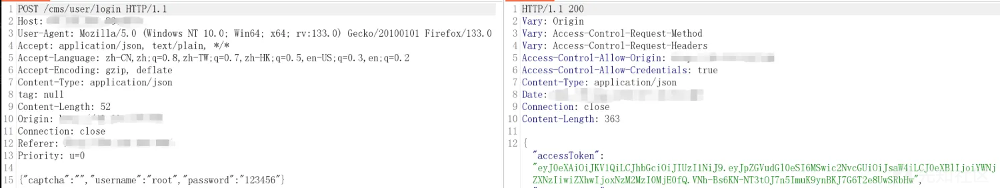

通过上述登录抓包可以发现处理登录是否成功的接口为/cms/user/login

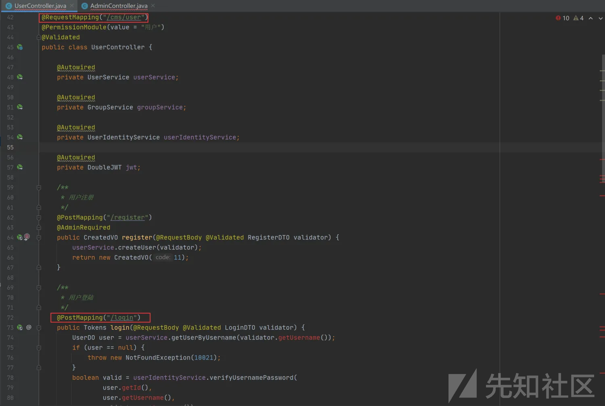

我们查看登录处理的方法发现会返回值为token，先对用户名是否存在进行处理，如果不存在则抛异常，再使用verifyUsernamePassword方法对用户名，密码，用户ID进行验证，通过跟进verifyUsernamePassword方法可以发现返回值布尔值。

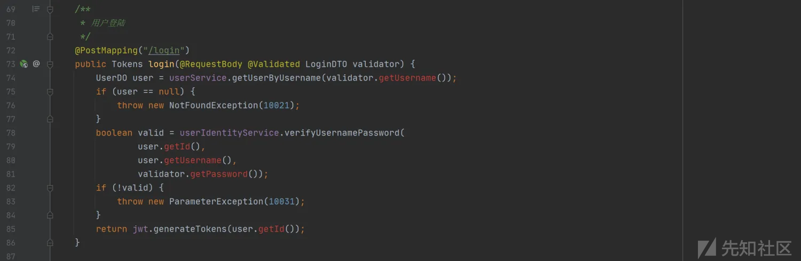

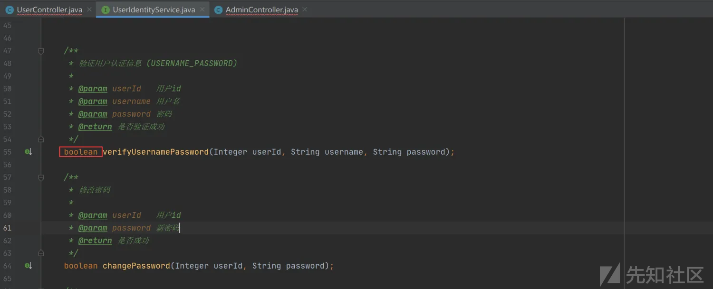

如果上述均校验成功则会调用generateTokens方法进行处理然后返回到前端界面，我们跟进generateTokens查看该方法，我们发现会返回两个值，一个为access值，一个为refresh值，并且从上述值中可以发现存在四个字段，分别为type、scope、identity、exp，这四个值中，type、scope是固定值，而exp为JWT 的过期时间，这是JWT率先定义好的（其实这个过期时间定义也存在缺陷，如果用户指定了退出登录，但是token还没有过期，因此如果有人拿到这个token还是可以查看用户信息）。

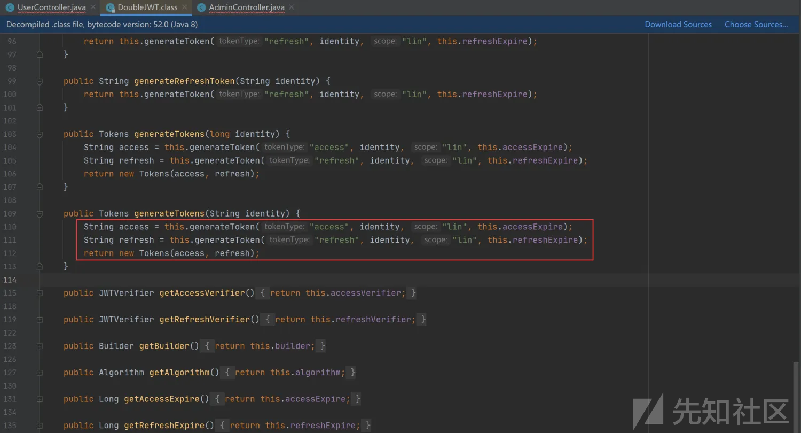

先对两个网站分别进行登录，其token进行比较可发现，处理过期时间不一样，其它值均是固定的

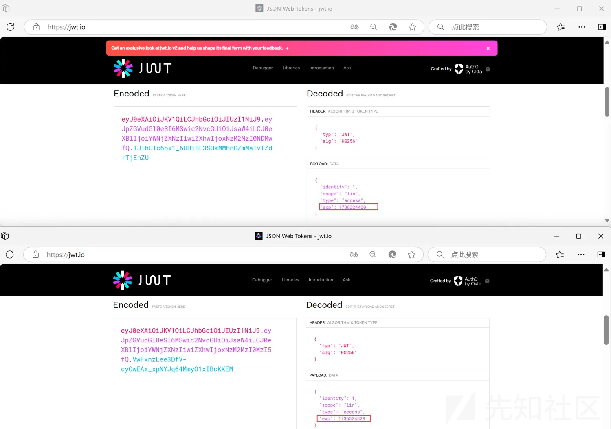

我们查看一下identity字段，我们发现identity由UserController中的login方法调用generateTokens方法，再把其中的user.getId()复制给identity字段，而我们通过分析可以知道user.getId()是从数据库中取出来的。

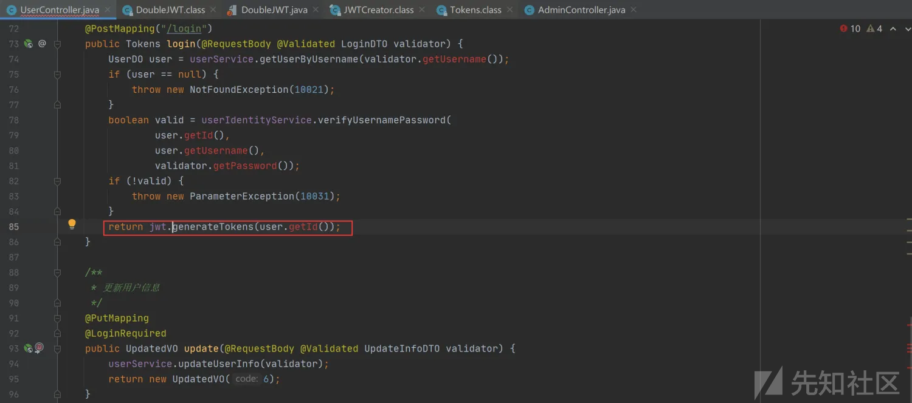

通过上述分析可以发现最重要的值为identity，该值为访问控制权限划分的值，当我们使用管理员用户登录时值为identity=1，因此在这一步造成CVE-2022-32430漏洞产生，而在这其中最重要的是需要jwt secret进行构造，而secret是固定值，因此我们通过查找可以发现在application.yml中已经设置好了。

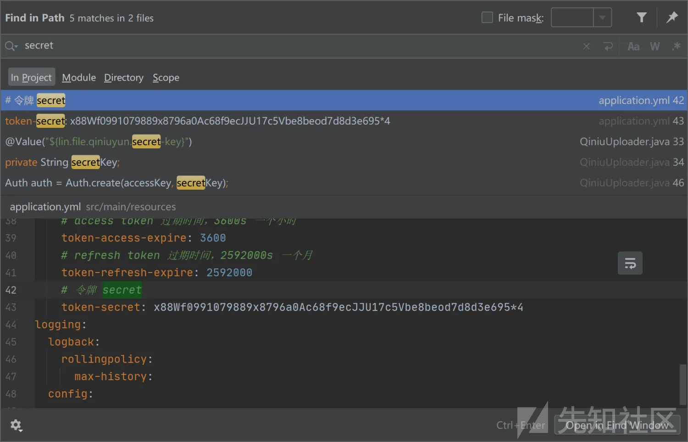

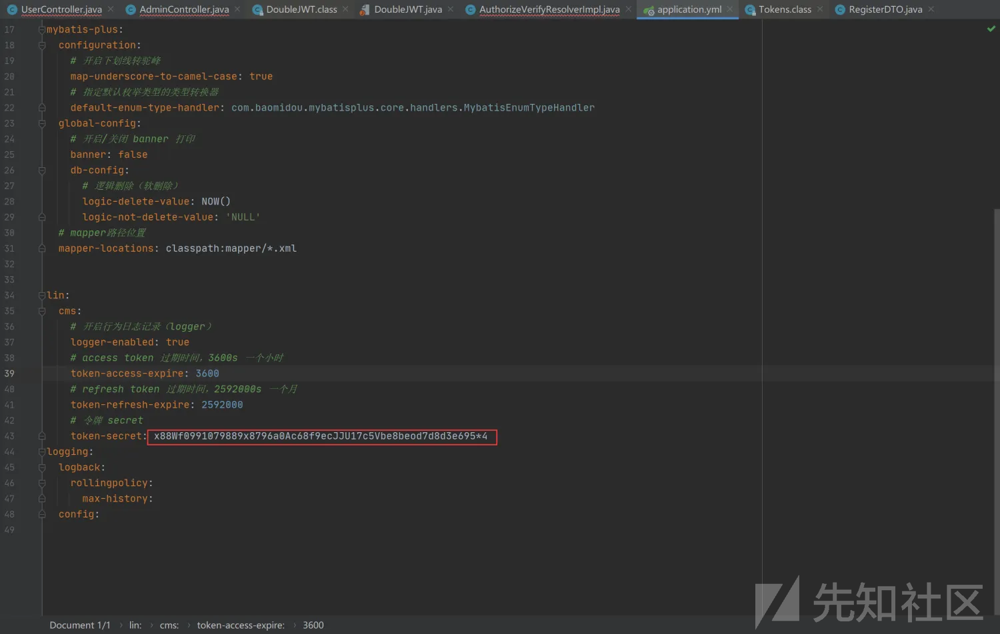

再对上述代码进行分析时，发现存在secret固定值，因此可以进行构造JWT不仅能够达到权限提升还能够对任意网站的任意接口进行任意访问，造成敏感信息泄露，而且我们可以发现该网站并没有对用户存储的token一致性进行校验，只需要用户的token格式正确即可，不然服务器会返回token损坏结果，如下图：

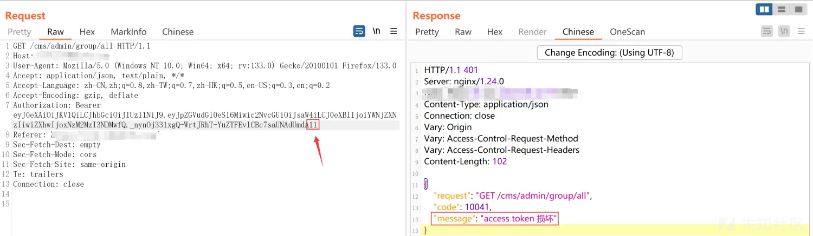

如上所属，可以发现代码存在JWT secret固定值，那么我们在不知晓secret的情况下，只要知晓任意网站的管理员密码登录至网站，获取其token值，使用该值即可访问所有的网站（前提是固定secret值并没有被修改的情况下），我们可以进行漏洞复现证明一下上述两个漏洞。  
漏洞复现  
首先找寻两个网站  
网站1：

  
网站2：

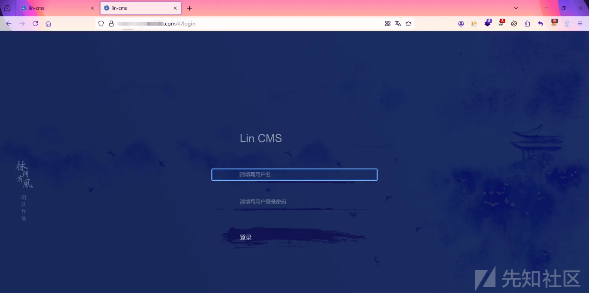

两个网站都进行登录

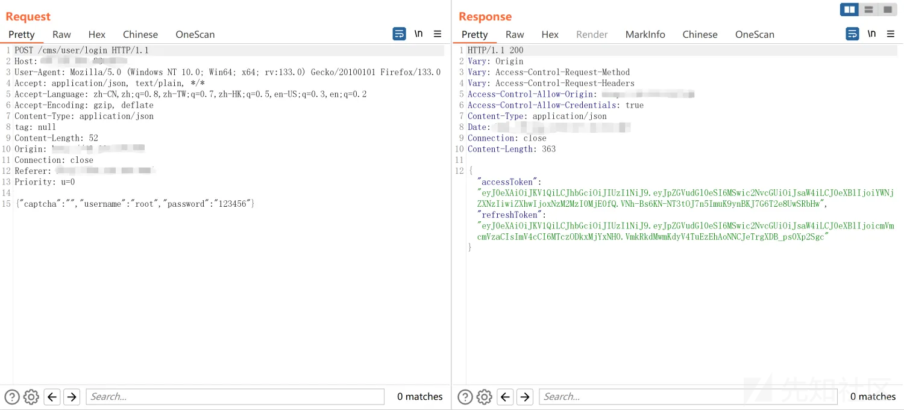

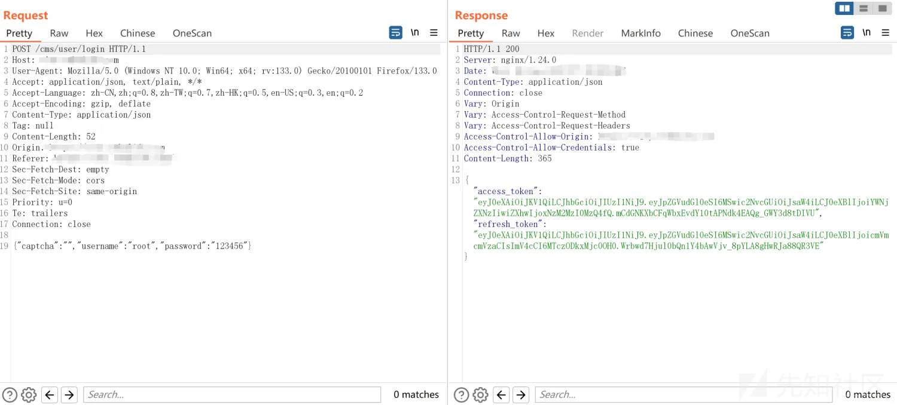

点击网站2的用户管理处，抓包获取其用户信息

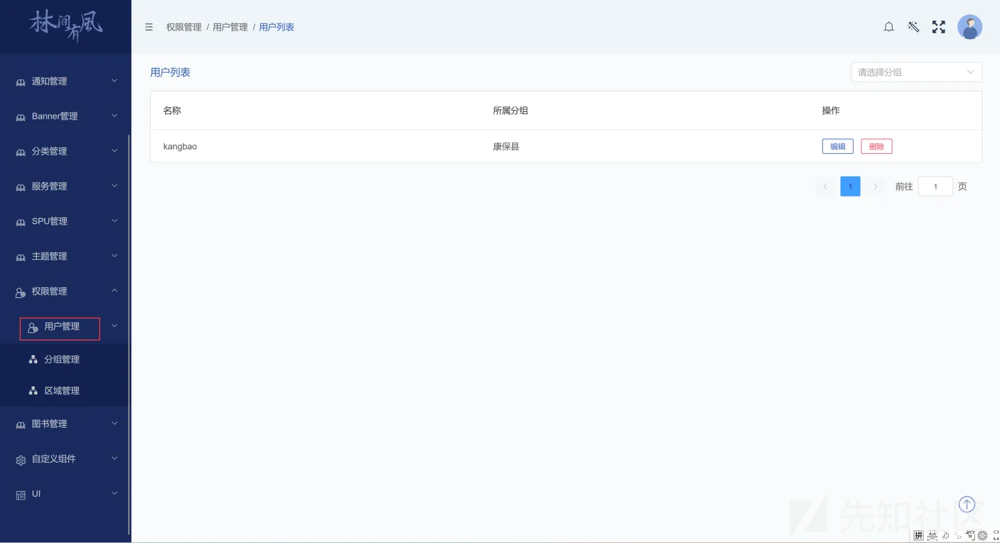

发现存在Authorization字段的情况下可以进行访问

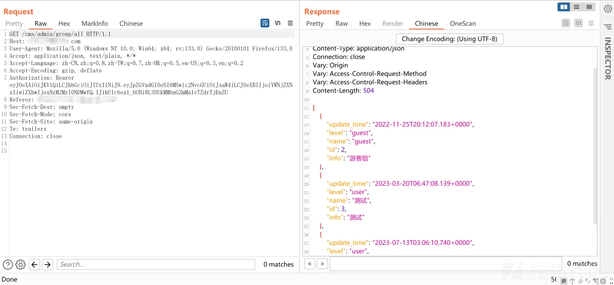

删除Authorization字段，显示401，未授权访问

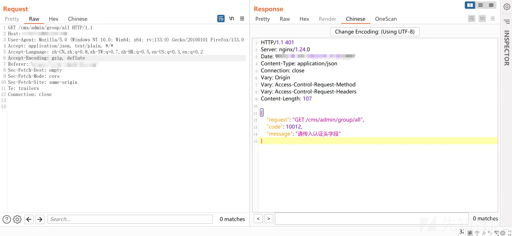

这里对另一个网站1进行抓包，获取其Authorization字段中的token

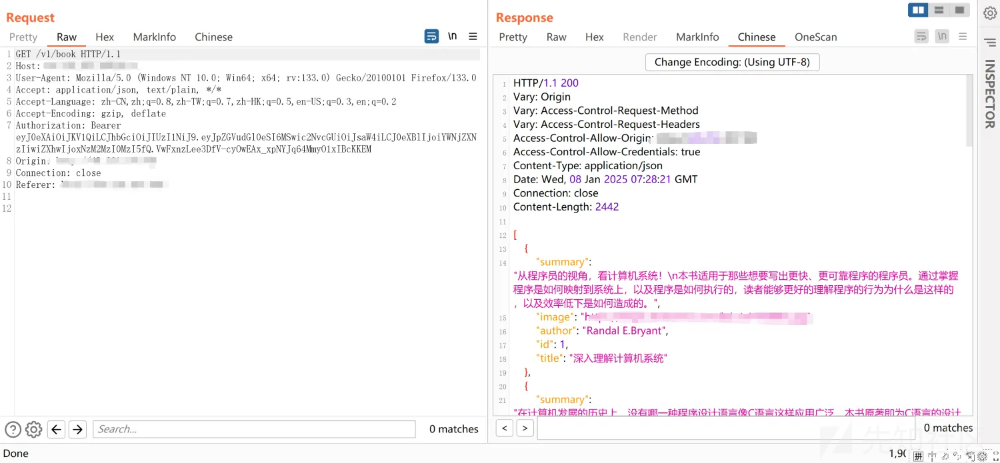

使用网站1的Authorization字段token对网站2添加上，发起请求发现同样能够使用

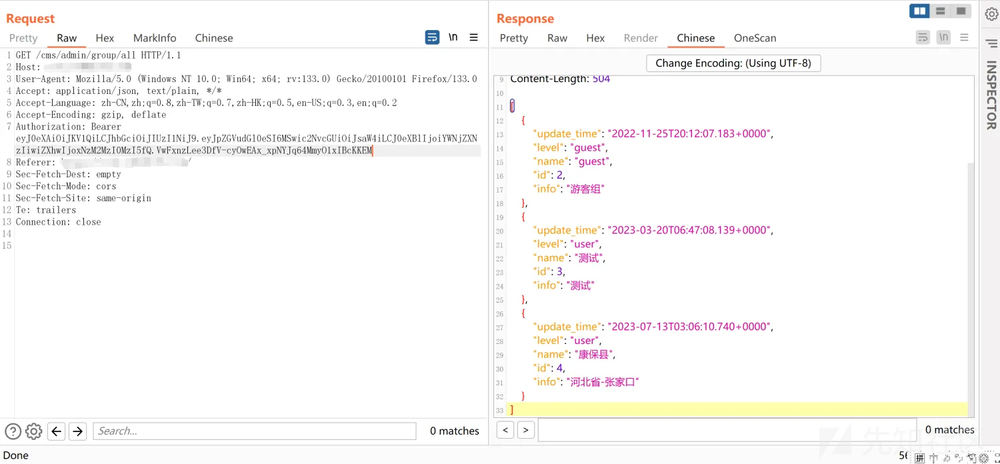

在对另一个网站进行复现，我们在已知固定的secret值得情况下使用在线jwt网站进行构造，把identity字段更改为2，在进行编码

使用如上图，得到低权限的token字段，使用该对需要管理员权限才能访问的接口进行访问，发现提示权限不足。

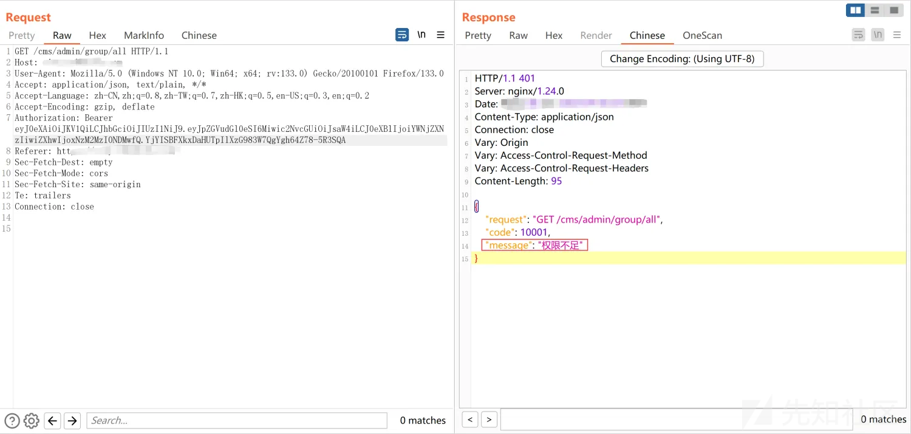
