# ZrLog3.1.4代码审计CSRF+XSS组合利用-先知社区

> **来源**: https://xz.aliyun.com/news/16540  
> **文章ID**: 16540

---

# 前言

zrlog由java语言搭建的开源博客网站，其在审计最新版本的源码时，发现该系统未使用大型框架，只存在一个freemarker框架，因此很大程度上存在一些前端漏洞的出现。

# XSS-CSRF组合

## 代码审计

全局搜索，网站统计等字样

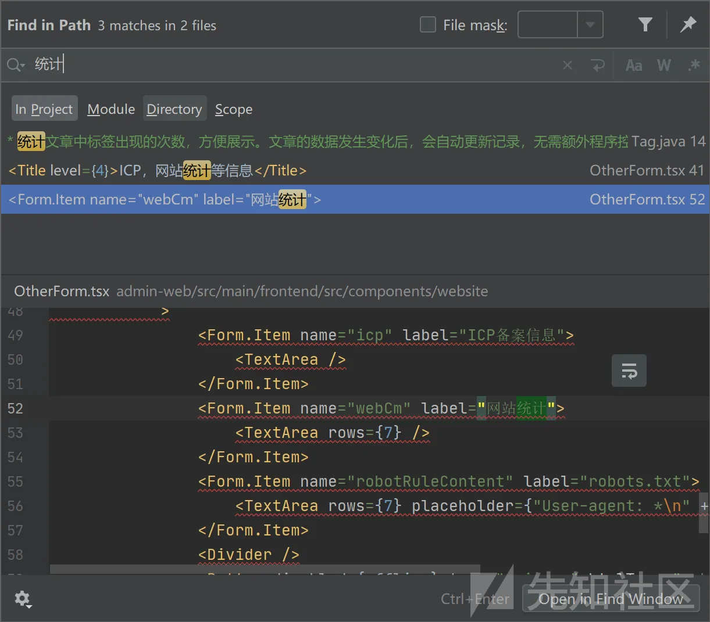

发现在OtherForm.tsx文件中存在该代码  
解释一下tsx文件，tsx文件是typescript文件，但它同时包含了javascript xml（JSX）文件，而JSX文件是React组件内部构建标签的类XML语法。可以理解为React提供的语法糖，可以让编译器更方便快速的选择编译方式。而如下图中，前端代码代码即使用的React 和 Ant Design 库创建的一个表单组件

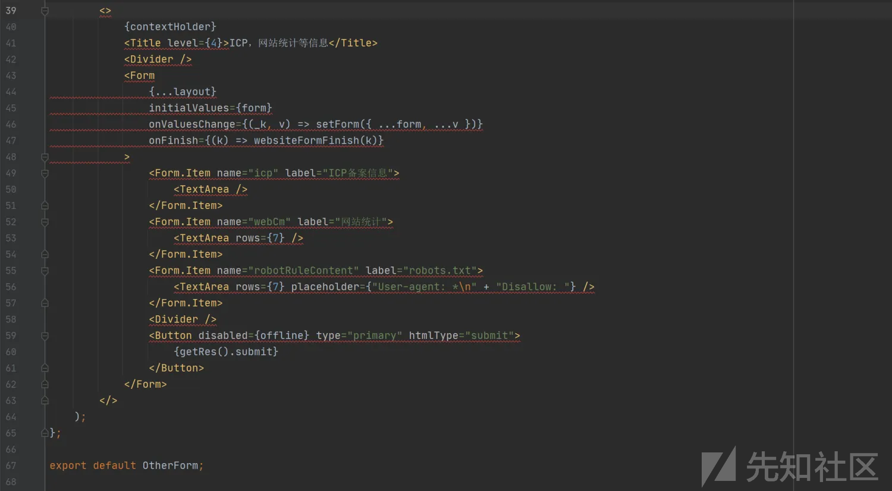

通过查看上述代码我们发现并没有直接包含 XSS（跨站脚本）过滤逻辑，React 默认会对插入到 DOM 中的内容进行转义，这意味着如果你将用户输入直接插入到 JSX 中，React 会将其转换为安全的字符串，从而防止 XSS 攻击。例如：

```
<div>{userInput}</div>

```

而上图使用的Ant Design 的表单输入组件（ TextArea）通常不会直接将用户输入渲染为 HTML。它们只是用于收集用户输入的数据，而不是直接在页面上显示这些数据。因此可以确认前台不存在XSS过滤，那么我们可以跟一下服务端，查看是否存在filter。  
我们通过OtherForm.tsx文件可以发现异步提交表单到/api/admin/website/other接口

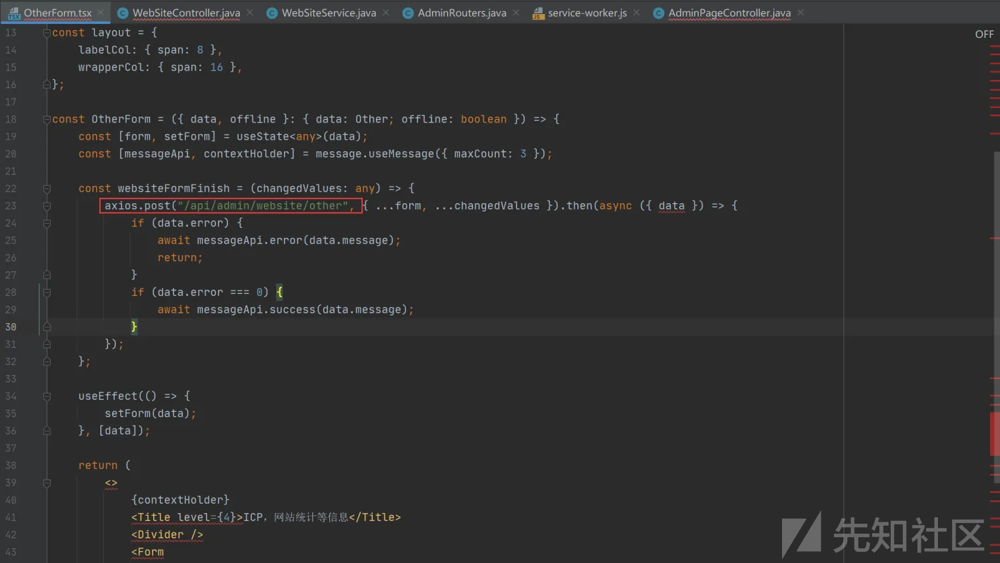

通过查看AdminRouters类可以发现该接口由WebSiteController进行处理

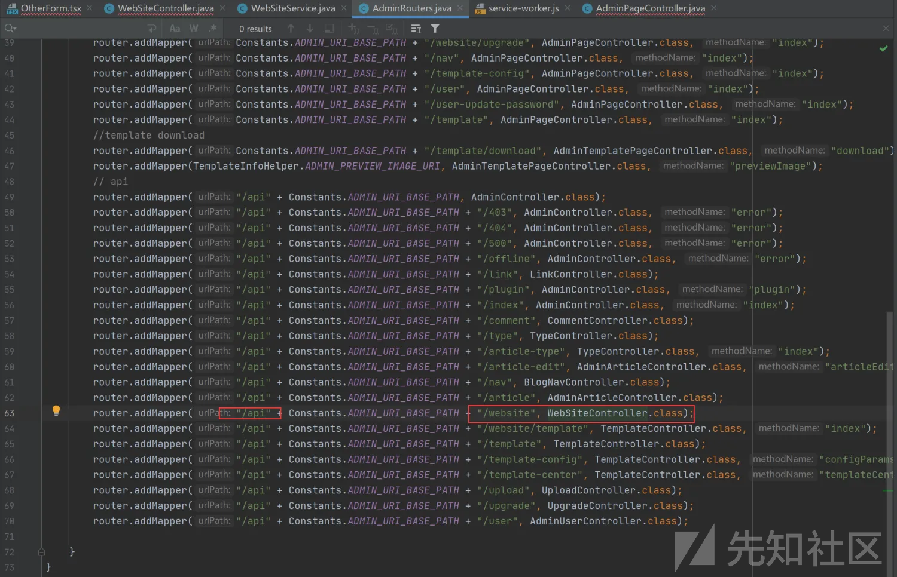

我们跟进WebSiteController类中，发现other函数，该函数就是处理与网站信息相关的请求。对于 POST 请求，它会更新网站信息并刷新缓存；对于其他类型的请求，它会返回当前的网站信息数据，并附带一条成功消息。并且在最后调用webSiteService.other() 获取的网站信息数据并返回

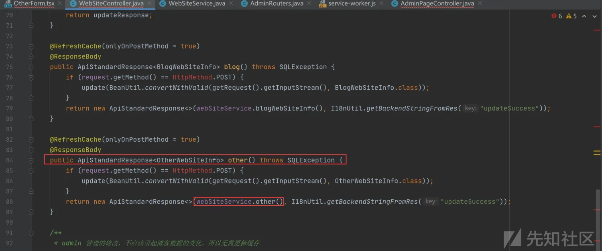

而webSiteService变量实例化了WebSiteService对象

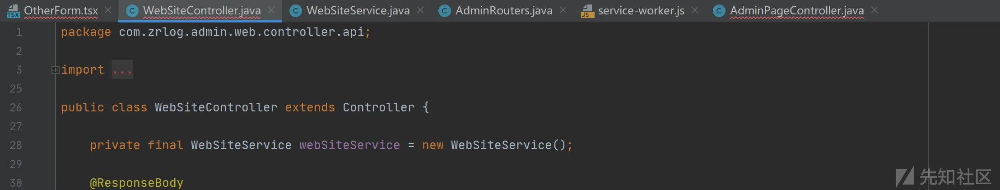

我们查看WebSiteService类中的other函数，这个函数的主要功能是从配置中提取网站的 ICP 备案信息、网站统计信息和 robots.txt 文件的内容，并将这些信息封装到一个 OtherWebSiteInfo 对象中返回到我们的前端页面中展现出来。

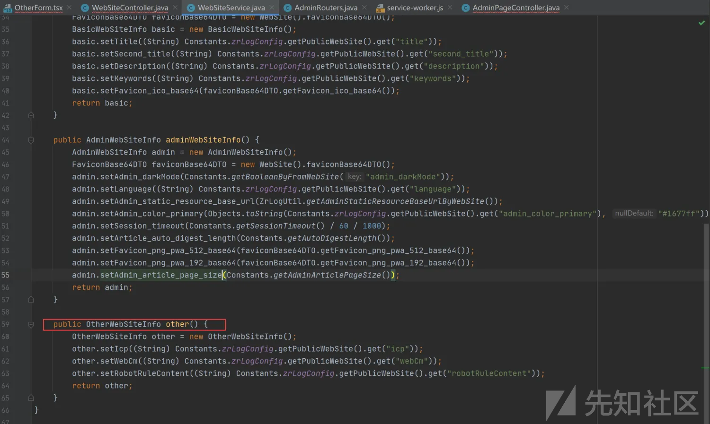

通过上述分析我们可以发现在整个调用流程中并没有XSS相关的过滤器，因此此处存在XSS，且在查看的时候不仅没有XSS过滤，也没有其它的过滤机制，因此可能还存在其它漏洞产生。

## 漏洞复现

访问设置->其他设置处，网站统计处输入xsspayload（<script>alert(1)</script>）提交即可

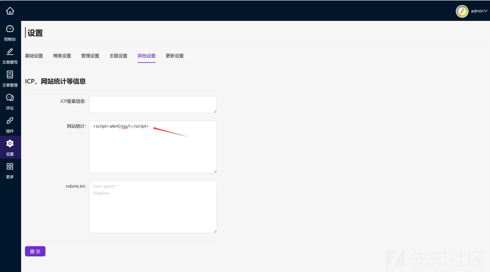

我们查看源代码可以发现插入成功，刷新网站，前台即可弹窗


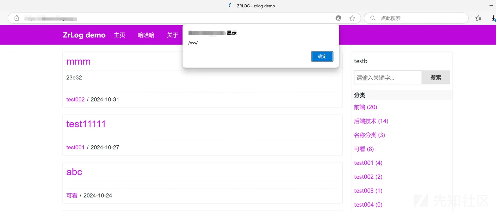

该处还存在CSRF漏洞，任意输入，提交抓包

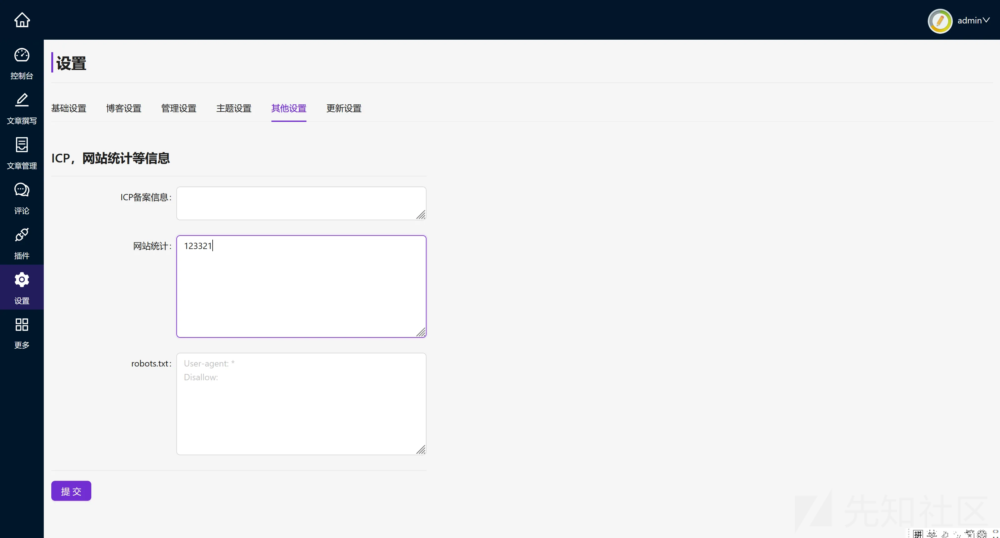

此使正常情况就是生成一个html文件然后用户点击，CSRF攻击利用成功，但是这里有个坑点，就是用户提交数据为json格式，进行请求或者用户点击时，json格式后面会存在一个=，如下图：

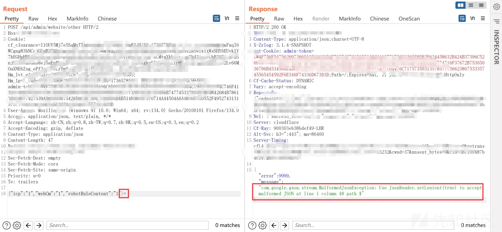

这种情况下，我们可以添加一个json数据格式的参数嵌套进json中，如果过滤不严谨的系统那么就能用这个方式进行绕过，如果还是不行可以参考这篇文章  
<https://www.cnblogs.com/cat47/p/12389020.html>  
因此我们更改payload为如下：  
{"icp":"","webCm":"<script>alert(/CSRF/)</script>","robotRuleContent":"'value'="}

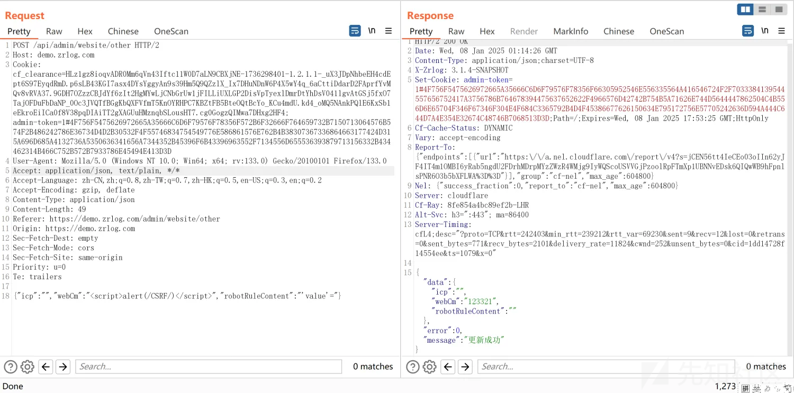

使用burp自带的CSRF POC开启一个web网站

```
<html>
  <!-- CSRF PoC - generated by Burp Suite Professional -->
  <body>
  <script>history.pushState('', '', '/')</script>
    <form action="https://demo.zrlog.com/api/admin/website/other" method="POST" enctype="text/plain">
      <input type="hidden" name="&#123;&quot;icp&quot;&#58;&quot;&quot;&#44;&quot;webCm&quot;&#58;&quot;&lt;script&gt;alert&#40;&#47;CSRF&#47;&#41;&lt;&#47;script&gt;&quot;&#44;&quot;robotRuleContent&quot;&#58;&quot;&apos;value&apos;" value="&quot;&#125;" />
      <input type="submit" value="Submit request" />
    </form>
  </body>
</html>

```

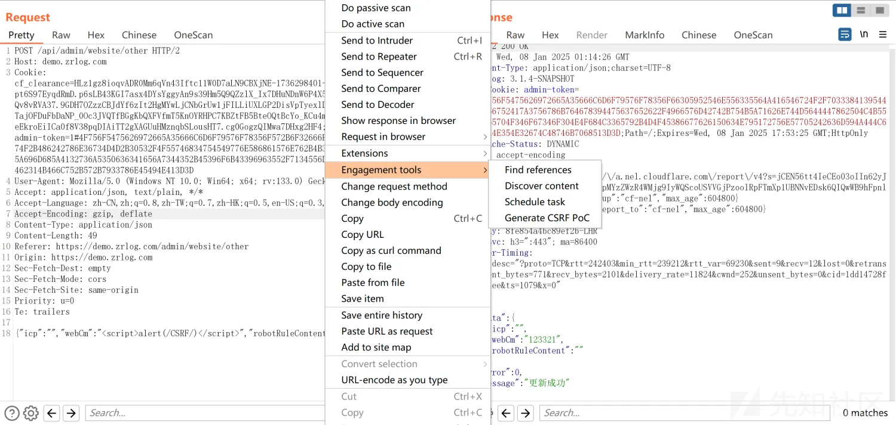

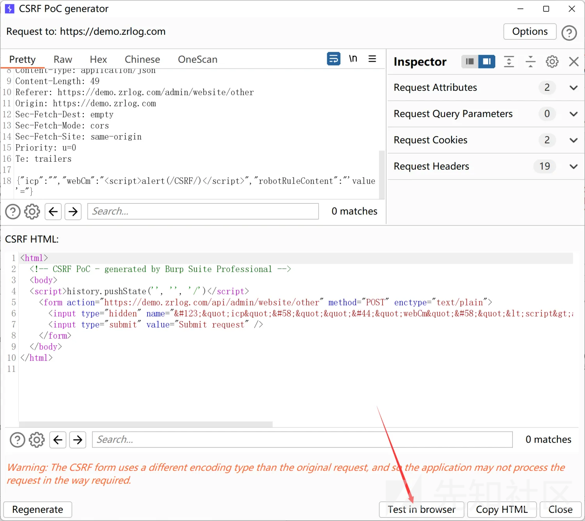

访问链接，更新成功

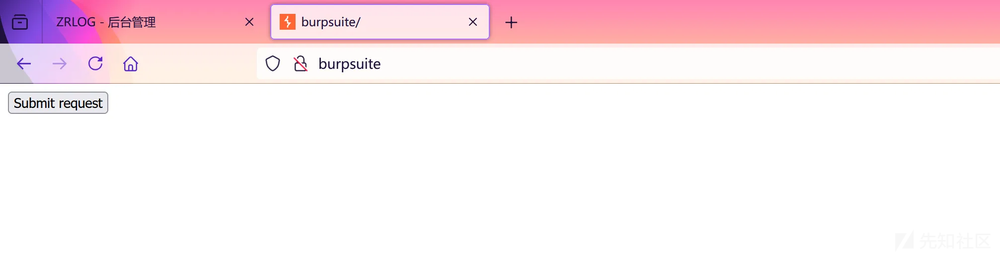

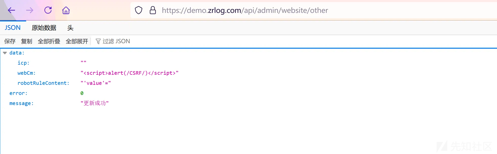

查看设置处，成功设置

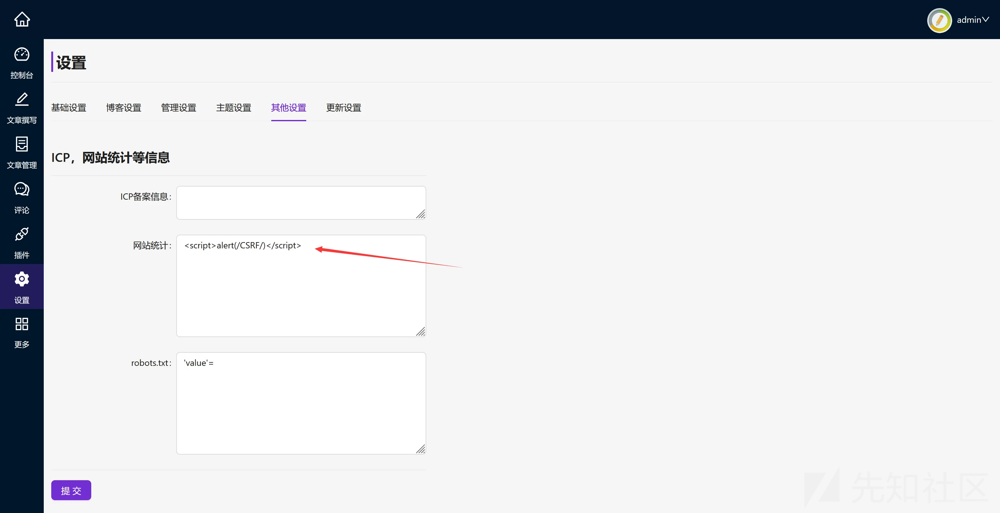

访问前台发现存在插入的payload并且弹窗

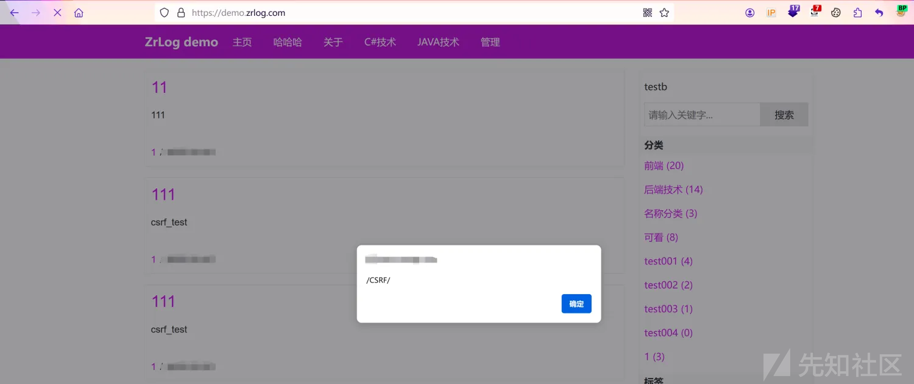

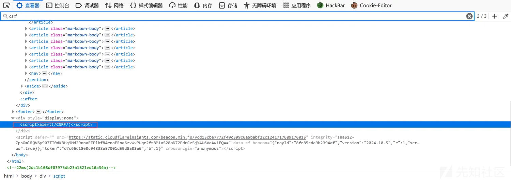

## XSS

文章管理处还存在一个XSS，这个地方按理说其实也存在XSS+CSRF的，但是参数存在时间检验参数，所以在进行跨站请求伪造的时候每次都提示文章过期，也许还存在其它的利用方式，感兴趣的师傅可以测试一下。  
文章管理处任意选择一个文章进行编辑

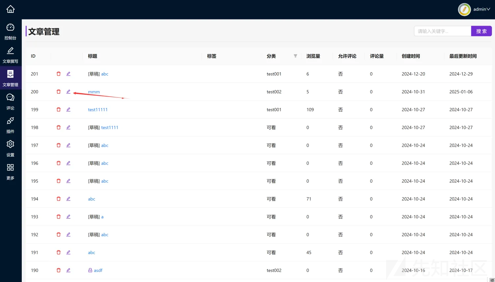

插入XSS paylaod，然后点击发布即可

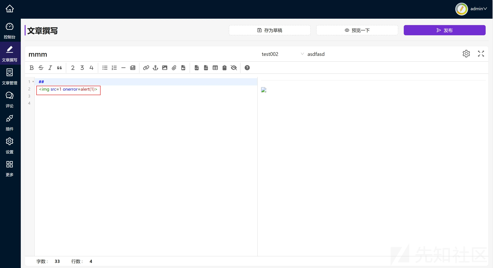

前台浏览文章即可弹窗成功

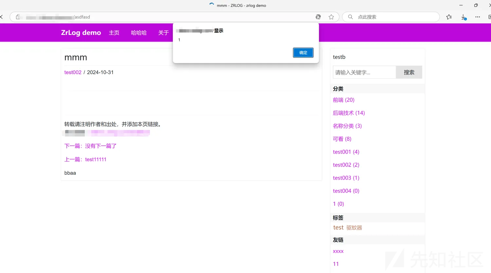
