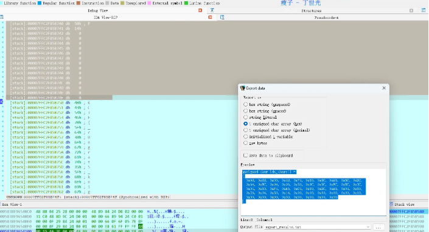
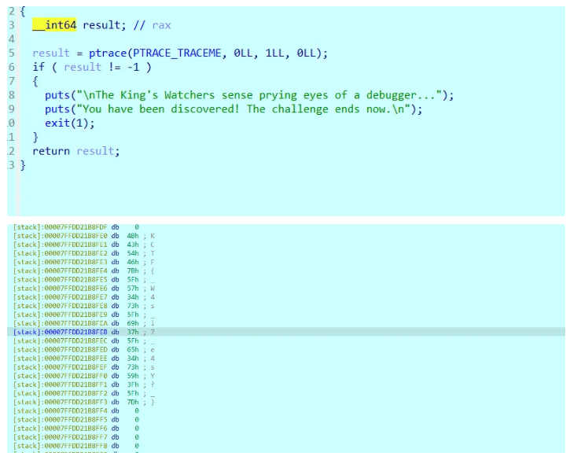
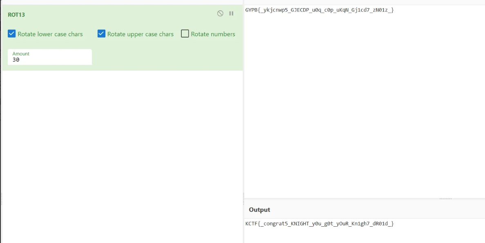
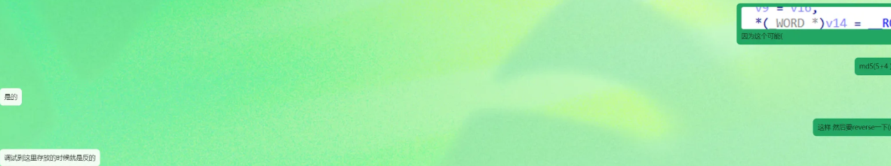
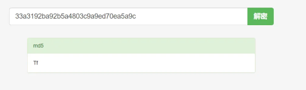

# 2025 KnightCTF reverse方向AK全题解-先知社区

> **来源**: https://xz.aliyun.com/news/16609  
> **文章ID**: 16609

---

### 前言

难度中等的一次国外赛事，re中规中矩，但比赛奖品很有实力，居然送IDA!

有一道SSE的题目有些难度，笔者提供了两种解决方法。

### Knight’s Enigma

本场比赛最难的一道题目吧，用SSE指令塞了一大坨指令进去，第一眼看上去确实想让人直接垃圾桶。这里提供一下两种做题方法。一个是还原代码后直接逆向，另外一个是动调发现单字节加密，使用查表方式。

第一种做法，算法还原

SSE指令翻译一下 然后这样 厨子解一下凯撒 最后缺两位直接进去调试拿最后2位密文

IDA代码如下

```
 v109 = __readfsqword(0x28u);
  v103 = 5200;
  s2[0] = (__int128)_mm_load_si128((const __m128i *)&xmmword_5838E9655060);
  s2[1] = (__int128)_mm_load_si128((const __m128i *)&xmmword_5838E9655070);
  printf("Hello Knight
Enter your secret: ");
  fgets(s, 128, stdin);
  v3 = strlen(s);
  if ( !v3 )
    goto LABEL_5;
  if ( s[v3 - 1] == 10 )
    s[--v3] = 0;
  if ( v3 != 34 )
    goto LABEL_5;
  v5 = *__ctype_b_loc();
  v6 = 0LL;
  v95 = _mm_shuffle_epi32(_mm_cvtsi32_si128(0xFFFFFFC0), 0);
  v96 = _mm_shuffle_epi32(_mm_cvtsi32_si128(0xFFFFFFA0), 0);
  v97 = _mm_shuffle_epi32(_mm_cvtsi32_si128(0x1000100u), 0);
  v91 = _mm_shuffle_epi32(_mm_cvtsi32_si128(0xFF00FFu), 0);
  v7 = _mm_shuffle_epi32(_mm_cvtsi32_si128(0x4EC4EC4Fu), 0);
  v98 = _mm_shuffle_epi32(_mm_cvtsi32_si128(0x41414141u), 0);
  v8 = _mm_cmpgt_epi32((__m128i)0LL, v7);
  v99 = _mm_shuffle_epi32(_mm_cvtsi32_si128(0x61616161u), 0);
  v100[0] = _mm_shuffle_epi32(_mm_cvtsi32_si128(0x4000400u), 0);
  do
  {
    si128 = _mm_load_si128((const __m128i *)&s[v6]);
    v100[14] = si128;
    v100[13] = si128;
    v100[12] = si128;
    v100[11] = si128;
    v100[10] = si128;
    v100[9] = si128;
    inserted = _mm_insert_epi16(_mm_cvtsi32_si128(v5[si128.m128i_u8[4]]), v5[si128.m128i_u8[5]], 1);
    v10 = _mm_unpacklo_epi32(
            _mm_insert_epi16(_mm_cvtsi32_si128(v5[(unsigned __int8)_mm_cvtsi128_si32(si128)]), v5[si128.m128i_u8[1]], 1),
            _mm_insert_epi16(_mm_cvtsi32_si128(v5[si128.m128i_u8[2]]), v5[si128.m128i_u8[3]], 1));
    v11 = _mm_insert_epi16(_mm_cvtsi32_si128(v5[si128.m128i_u8[6]]), v5[si128.m128i_u8[7]], 1);
    v100[8] = si128;
    v100[7] = si128;
    v100[6] = si128;
    v100[5] = si128;
    v100[4] = si128;
    v12 = _mm_load_si128(&v95);
    v100[3] = si128;
    v13 = _mm_load_si128(&v96);
    v14 = v12;
    v15 = v12;
    v100[2] = si128;
    v100[1] = si128;
    v16 = v5[si128.m128i_u8[8]];
    v92 = _mm_unpacklo_epi64(v10, _mm_unpacklo_epi32(inserted, v11));
    v17 = v12;
    v93 = _mm_unpacklo_epi64(
            _mm_unpacklo_epi32(
              _mm_insert_epi16(_mm_cvtsi32_si128(v16), v5[si128.m128i_u8[9]], 1),
              _mm_insert_epi16(_mm_cvtsi32_si128(v5[si128.m128i_u8[10]]), v5[si128.m128i_u8[11]], 1)),
            _mm_unpacklo_epi32(
              _mm_insert_epi16(_mm_cvtsi32_si128(v5[si128.m128i_u8[12]]), v5[si128.m128i_u8[13]], 1),
              _mm_insert_epi16(_mm_cvtsi32_si128(v5[si128.m128i_u8[14]]), v5[si128.m128i_u8[15]], 1)));
    v18 = _mm_unpacklo_epi8(si128, (__m128i)0LL);
    v19 = _mm_unpackhi_epi8(si128, (__m128i)0LL);
    v20 = _mm_unpackhi_epi16(v19, (__m128i)0LL);
    v21 = _mm_unpacklo_epi16(v18, (__m128i)0LL);
    v22 = _mm_unpackhi_epi16(v18, (__m128i)0LL);
    v90 = _mm_add_epi32(v12, v20);
    v23 = v20;
    v24 = _mm_load_si128(&v97);
    v25 = _mm_unpacklo_epi16(v19, (__m128i)0LL);
    v26 = _mm_add_epi32(v14, v21);
    v27 = _mm_add_epi32(v15, v22);
    v28 = _mm_add_epi32(v17, v25);
    v29 = _mm_add_epi32(v21, v13);
    v30 = _mm_add_epi32(v22, v13);
    v31 = _mm_add_epi32(v25, v13);
    v32 = _mm_add_epi32(v23, v13);
    v94 = _mm_packus_epi16(
            _mm_and_si128(
              _mm_cmpeq_epi16(_mm_cmpeq_epi16(_mm_and_si128(v24, v92), (__m128i)0LL), (__m128i)0LL),
              _mm_load_si128(&v91)),
            _mm_and_si128(_mm_cmpeq_epi16(_mm_cmpeq_epi16(_mm_and_si128(v24, v93), (__m128i)0LL), (__m128i)0LL), v91));
    v33 = _mm_srli_epi64(v26, 0x20u);
    v34 = _mm_sub_epi32(
            _mm_srai_epi32(
              _mm_shuffle_epi32(
                (__m128i)_mm_shuffle_ps(
                           (__m128)_mm_add_epi64(
                                     _mm_mul_epu32(v26, v7),
                                     _mm_slli_epi64(
                                       _mm_add_epi64(
                                         _mm_mul_epu32(_mm_cmpgt_epi32((__m128i)0LL, v26), v7),
                                         _mm_mul_epu32(v8, v26)),
                                       0x20u)),
                           (__m128)_mm_add_epi64(
                                     _mm_mul_epu32(v33, v7),
                                     _mm_slli_epi64(
                                       _mm_add_epi64(
                                         _mm_mul_epu32(_mm_cmpgt_epi32((__m128i)0LL, v33), v7),
                                         _mm_mul_epu32(v8, v33)),
                                       0x20u)),
                           221),
                216),
              3u),
            _mm_srai_epi32(v26, 0x1Fu));
    v35 = _mm_sub_epi32(
            v26,
            _mm_slli_epi32(_mm_add_epi32(v34, _mm_slli_epi32(_mm_add_epi32(_mm_slli_epi32(v34, 1u), v34), 2u)), 1u));
    v36 = _mm_srli_epi64(v27, 0x20u);
    v37 = _mm_sub_epi32(
            _mm_srai_epi32(
              _mm_shuffle_epi32(
                (__m128i)_mm_shuffle_ps(
                           (__m128)_mm_add_epi64(
                                     _mm_mul_epu32(v27, v7),
                                     _mm_slli_epi64(
                                       _mm_add_epi64(
                                         _mm_mul_epu32(_mm_cmpgt_epi32((__m128i)0LL, v27), v7),
                                         _mm_mul_epu32(v8, v27)),
                                       0x20u)),
                           (__m128)_mm_add_epi64(
                                     _mm_mul_epu32(v36, v7),
                                     _mm_slli_epi64(
                                       _mm_add_epi64(
                                         _mm_mul_epu32(_mm_cmpgt_epi32((__m128i)0LL, v36), v7),
                                         _mm_mul_epu32(v8, v36)),
                                       0x20u)),
                           221),
                216),
              3u),
            _mm_srai_epi32(v27, 0x1Fu));
    v38 = v35;
    v39 = _mm_sub_epi32(
            v27,
            _mm_slli_epi32(_mm_add_epi32(v37, _mm_slli_epi32(_mm_add_epi32(_mm_slli_epi32(v37, 1u), v37), 2u)), 1u));
    v40 = v35;
    v41 = _mm_load_si128(&v90);
    v42 = _mm_unpackhi_epi16(v40, v39);
    v43 = _mm_unpacklo_epi16(v38, v39);
    v44 = _mm_unpacklo_epi16(_mm_unpacklo_epi16(v43, v42), _mm_unpackhi_epi16(v43, v42));
    v45 = _mm_srli_epi64(v28, 0x20u);
    v46 = _mm_sub_epi32(
            _mm_srai_epi32(
              _mm_shuffle_epi32(
                (__m128i)_mm_shuffle_ps(
                           (__m128)_mm_add_epi64(
                                     _mm_mul_epu32(v28, v7),
                                     _mm_slli_epi64(
                                       _mm_add_epi64(
                                         _mm_mul_epu32(_mm_cmpgt_epi32((__m128i)0LL, v28), v7),
                                         _mm_mul_epu32(v8, v28)),
                                       0x20u)),
                           (__m128)_mm_add_epi64(
                                     _mm_mul_epu32(v45, v7),
                                     _mm_slli_epi64(
                                       _mm_add_epi64(
                                         _mm_mul_epu32(_mm_cmpgt_epi32((__m128i)0LL, v45), v7),
                                         _mm_mul_epu32(v8, v45)),
                                       0x20u)),
                           221),
                216),
              3u),
            _mm_srai_epi32(v28, 0x1Fu));
    v47 = _mm_sub_epi32(
            v28,
            _mm_slli_epi32(_mm_add_epi32(v46, _mm_slli_epi32(_mm_add_epi32(_mm_slli_epi32(v46, 1u), v46), 2u)), 1u));
    v48 = _mm_srli_epi64(v41, 0x20u);
    v49 = _mm_sub_epi32(
            _mm_srai_epi32(
              _mm_shuffle_epi32(
                (__m128i)_mm_shuffle_ps(
                           (__m128)_mm_add_epi64(
                                     _mm_mul_epu32(v41, v7),
                                     _mm_slli_epi64(
                                       _mm_add_epi64(
                                         _mm_mul_epu32(_mm_cmpgt_epi32((__m128i)0LL, v41), v7),
                                         _mm_mul_epu32(v8, v41)),
                                       0x20u)),
                           (__m128)_mm_add_epi64(
                                     _mm_mul_epu32(v48, v7),
                                     _mm_slli_epi64(
                                       _mm_add_epi64(
                                         _mm_mul_epu32(_mm_cmpgt_epi32((__m128i)0LL, v48), v7),
                                         _mm_mul_epu32(v8, v48)),
                                       0x20u)),
                           221),
                216),
              3u),
            _mm_srai_epi32(v41, 0x1Fu));
    v50 = _mm_add_epi32(_mm_slli_epi32(_mm_add_epi32(_mm_slli_epi32(v49, 1u), v49), 2u), v49);
    v51 = v47;
    v52 = _mm_sub_epi32(v41, _mm_slli_epi32(v50, 1u));
    v53 = _mm_unpacklo_epi16(v47, v52);
    v54 = _mm_unpackhi_epi16(v51, v52);
    v55 = _mm_load_si128(&v91);
    v56 = _mm_add_epi8(
            _mm_packus_epi16(
              _mm_and_si128(v44, v55),
              _mm_and_si128(_mm_unpacklo_epi16(_mm_unpacklo_epi16(v53, v54), _mm_unpackhi_epi16(v53, v54)), v55)),
            v98);
    v57 = _mm_srli_epi64(v29, 0x20u);
    v58 = _mm_sub_epi32(
            _mm_srai_epi32(
              _mm_shuffle_epi32(
                (__m128i)_mm_shuffle_ps(
                           (__m128)_mm_add_epi64(
                                     _mm_mul_epu32(v29, v7),
                                     _mm_slli_epi64(
                                       _mm_add_epi64(
                                         _mm_mul_epu32(_mm_cmpgt_epi32((__m128i)0LL, v29), v7),
                                         _mm_mul_epu32(v8, v29)),
                                       0x20u)),
                           (__m128)_mm_add_epi64(
                                     _mm_mul_epu32(v57, v7),
                                     _mm_slli_epi64(
                                       _mm_add_epi64(
                                         _mm_mul_epu32(_mm_cmpgt_epi32((__m128i)0LL, v57), v7),
                                         _mm_mul_epu32(v8, v57)),
                                       0x20u)),
                           221),
                216),
              3u),
            _mm_srai_epi32(v29, 0x1Fu));
    v59 = _mm_sub_epi32(
            v29,
            _mm_slli_epi32(_mm_add_epi32(v58, _mm_slli_epi32(_mm_add_epi32(_mm_slli_epi32(v58, 1u), v58), 2u)), 1u));
    v60 = _mm_srli_epi64(v30, 0x20u);
    v61 = _mm_sub_epi32(
            _mm_srai_epi32(
              _mm_shuffle_epi32(
                (__m128i)_mm_shuffle_ps(
                           (__m128)_mm_add_epi64(
                                     _mm_mul_epu32(v30, v7),
                                     _mm_slli_epi64(
                                       _mm_add_epi64(
                                         _mm_mul_epu32(_mm_cmpgt_epi32((__m128i)0LL, v30), v7),
                                         _mm_mul_epu32(v8, v30)),
                                       0x20u)),
                           (__m128)_mm_add_epi64(
                                     _mm_mul_epu32(v60, v7),
                                     _mm_slli_epi64(
                                       _mm_add_epi64(
                                         _mm_mul_epu32(_mm_cmpgt_epi32((__m128i)0LL, v60), v7),
                                         _mm_mul_epu32(v8, v60)),
                                       0x20u)),
                           221),
                216),
              3u),
            _mm_srai_epi32(v30, 0x1Fu));
    v62 = _mm_sub_epi32(
            v30,
            _mm_slli_epi32(_mm_add_epi32(v61, _mm_slli_epi32(_mm_add_epi32(_mm_slli_epi32(v61, 1u), v61), 2u)), 1u));
    v63 = _mm_unpackhi_epi16(v59, v62);
    v64 = _mm_unpacklo_epi16(v59, v62);
    v65 = _mm_unpacklo_epi16(_mm_unpacklo_epi16(v64, v63), _mm_unpackhi_epi16(v64, v63));
    v66 = _mm_srli_epi64(v31, 0x20u);
    v67 = _mm_sub_epi32(
            _mm_srai_epi32(
              _mm_shuffle_epi32(
                (__m128i)_mm_shuffle_ps(
                           (__m128)_mm_add_epi64(
                                     _mm_mul_epu32(v31, v7),
                                     _mm_slli_epi64(
                                       _mm_add_epi64(
                                         _mm_mul_epu32(_mm_cmpgt_epi32((__m128i)0LL, v31), v7),
                                         _mm_mul_epu32(v8, v31)),
                                       0x20u)),
                           (__m128)_mm_add_epi64(
                                     _mm_mul_epu32(v66, v7),
                                     _mm_slli_epi64(
                                       _mm_add_epi64(
                                         _mm_mul_epu32(_mm_cmpgt_epi32((__m128i)0LL, v66), v7),
                                         _mm_mul_epu32(v8, v66)),
                                       0x20u)),
                           221),
                216),
              3u),
            _mm_srai_epi32(v31, 0x1Fu));
    v68 = _mm_sub_epi32(
            v31,
            _mm_slli_epi32(_mm_add_epi32(v67, _mm_slli_epi32(_mm_add_epi32(_mm_slli_epi32(v67, 1u), v67), 2u)), 1u));
    v69 = _mm_srli_epi64(v32, 0x20u);
    v70 = _mm_sub_epi32(
            _mm_srai_epi32(
              _mm_shuffle_epi32(
                (__m128i)_mm_shuffle_ps(
                           (__m128)_mm_add_epi64(
                                     _mm_mul_epu32(v32, v7),
                                     _mm_slli_epi64(
                                       _mm_add_epi64(
                                         _mm_mul_epu32(_mm_cmpgt_epi32((__m128i)0LL, v32), v7),
                                         _mm_mul_epu32(v8, v32)),
                                       0x20u)),
                           (__m128)_mm_add_epi64(
                                     _mm_mul_epu32(v69, v7),
                                     _mm_slli_epi64(
                                       _mm_add_epi64(
                                         _mm_mul_epu32(_mm_cmpgt_epi32((__m128i)0LL, v69), v7),
                                         _mm_mul_epu32(v8, v69)),
                                       0x20u)),
                           221),
                216),
              3u),
            _mm_srai_epi32(v32, 0x1Fu));
    v71 = _mm_sub_epi32(
            v32,
            _mm_slli_epi32(_mm_add_epi32(_mm_slli_epi32(_mm_add_epi32(_mm_slli_epi32(v70, 1u), v70), 2u), v70), 1u));
    v72 = _mm_unpackhi_epi16(v68, v71);
    v73 = _mm_unpacklo_epi16(v68, v71);
    v74 = _mm_add_epi8(
            _mm_packus_epi16(
              _mm_and_si128(v65, v55),
              _mm_and_si128(_mm_unpacklo_epi16(_mm_unpacklo_epi16(v73, v72), _mm_unpackhi_epi16(v73, v72)), v55)),
            v99);
    v75 = _mm_load_si128(&v94);
    v76 = _mm_load_si128(v100);
    v77 = _mm_or_si128(_mm_and_si128(v56, v75), _mm_andnot_si128(v75, v74));
    v78 = _mm_packus_epi16(
            _mm_and_si128(
              _mm_cmpeq_epi16(_mm_cmpeq_epi16(_mm_and_si128(_mm_load_si128(&v92), v76), (__m128i)0LL), (__m128i)0LL),
              v55),
            _mm_and_si128(
              _mm_cmpeq_epi16(_mm_cmpeq_epi16(_mm_and_si128(_mm_load_si128(&v93), v76), (__m128i)0LL), (__m128i)0LL),
              v55));
    v79 = _mm_or_si128(_mm_andnot_si128(v78, si128), _mm_and_si128(v77, v78));
    v80 = _mm_shuffle_epi32(_mm_cvtsi32_si128(0x1010101u), 0);
    v81 = _mm_or_si128(
            _mm_and_si128(
              _mm_and_si128(_mm_shuffle_epi32(_mm_cvtsi32_si128(0x7F7F7F7Fu), 0), _mm_srli_epi16(v79, 1u)),
              v80),
            _mm_and_si128(_mm_add_epi8(v79, v79), _mm_shuffle_epi32(_mm_cvtsi32_si128(0x2020202u), 0)));
    v82 = _mm_or_si128(
            _mm_add_epi8(v81, v81),
            _mm_and_si128(
              _mm_and_si128(_mm_shuffle_epi32(_mm_cvtsi32_si128(0x3F3F3F3Fu), 0), _mm_srli_epi16(v79, 2u)),
              v80));
    v83 = _mm_or_si128(
            _mm_add_epi8(v82, v82),
            _mm_and_si128(
              _mm_and_si128(_mm_shuffle_epi32(_mm_cvtsi32_si128(0x1F1F1F1Fu), 0), _mm_srli_epi16(v79, 3u)),
              v80));
    v84 = _mm_or_si128(
            _mm_add_epi8(v83, v83),
            _mm_and_si128(
              _mm_and_si128(_mm_shuffle_epi32(_mm_cvtsi32_si128(0xF0F0F0Fu), 0), _mm_srli_epi16(v79, 4u)),
              v80));
    v85 = _mm_or_si128(
            _mm_add_epi8(v84, v84),
            _mm_and_si128(
              _mm_and_si128(_mm_shuffle_epi32(_mm_cvtsi32_si128(0x7070707u), 0), _mm_srli_epi16(v79, 5u)),
              v80));
    v86 = _mm_or_si128(
            _mm_add_epi8(v85, v85),
            _mm_and_si128(
              _mm_and_si128(_mm_shuffle_epi32(_mm_cvtsi32_si128(0x3030303u), 0), _mm_srli_epi16(v79, 6u)),
              v80));
    *(__m128i *)&s1[v6] = _mm_xor_si128(
                            _mm_or_si128(_mm_add_epi8(v86, v86), _mm_and_si128(_mm_srli_epi16(v79, 7u), v80)),
                            _mm_shuffle_epi32(_mm_cvtsi32_si128(0xAAAAAAAA), 0));
    v6 += 16LL;
  }
  while ( v6 != 32 );
  LOBYTE(v87) = v106;
  v88 = v5[v106];
  if ( (v88 & 0x400) != 0 )
  {
    if ( (v88 & 0x100) != 0 )
      v87 = (v106 - 64) % 26 + 65;
    else
      v87 = (v106 - 96) % 26 + 97;
  }
  s1[32] = ((2
           * ((2
             * ((2
               * ((2 * ((2 * ((2 * ((2 * v87) & 2 | ((v87 & 2) != 0))) | ((v87 & 4) != 0))) | ((v87 & 8) != 0))) | ((v87 & 0x10) != 0))) | ((v87 & 0x20) != 0))) | ((v87 & 0x40) != 0))) | ((unsigned __int8)v87 >> 7)) ^ 0xAA;
  LOBYTE(v87) = v107;
  v89 = v5[v107];
  if ( (v89 & 0x400) != 0 )
  {
    if ( (v89 & 0x100) != 0 )
      v87 = (v107 - 64) % 26 + 65;
    else
      v87 = (v107 - 96) % 26 + 97;
  }
  s1[33] = ((2
           * ((2
             * ((2
               * ((2 * ((2 * ((2 * (((v87 & 2) != 0) | (2 * v87) & 2)) | ((v87 & 4) != 0))) | ((v87 & 8) != 0))) | ((v87 & 0x10) != 0))) | ((v87 & 0x20) != 0))) | ((v87 & 0x40) != 0))) | ((unsigned __int8)v87 >> 7)) ^ 0xAA;
  if ( !memcmp(s1, s2, 0x22uLL) )
    puts("Congratulations knight!");
  else
LABEL_5:
    puts("Incorrect flag!");
  return 0LL;
```

翻译后代码如下

```
int main() {
  char secret[32];
  char flag[32];
  char flag_enc[32];
  char flag_enc_exp[32];
  int i;
  memcpy(flag, FLAG, 32);
  memcpy(flag_enc_exp, FLAG_ENC_EXP, 32);
  printf("Hello Knight
Enter your secret: ");
  fgets(secret, 128, stdin);
  size_t len = strlen(secret);
  if (len == 0) {
    printf("Incorrect flag!
");
    return 0;
  }
  if (secret[len - 1] == '
') secret[--len] = '\0';
  if (len != 34) {
    printf("Incorrect flag!
");
    return 0;
  }
  for (i = 0; i < 32; i++) {
    char c = secret[i];
    if (isalpha(c)) {
      c = isupper(c) ? 'A' + (c - 'A' + 13) % 26 : 'a' + (c - 'a' + 13) % 26;
    }
    flag_enc[i] = c;
  }
  if (memcmp(flag_enc, flag, 32) != 0) {
    printf("Incorrect flag!
");
    return 0;
  }
  for (i = 0; i < 32; i++) {
    unsigned char c = flag_enc[i];
    c = (((c >> 7) & 1) | ((c >> 5) & 2) | ((c >> 3) & 4) | ((c >> 1) & 8) |
         ((c << 1) & 16) | ((c << 3) & 32) | ((c << 5) & 64) | ((c << 7) & 128));
    c ^= 0xaa;
    flag_enc_exp[i] = c;
  }
  if (memcmp(flag_enc_exp, flag, 32) != 0) {
    printf("Incorrect flag!
");
    return 0;
  }
  printf("Congratulations knight!
");
  return 0;
}
```

动调拿最后2位密文



```
def decrypt_flag(flag_enc_exp):
    # 对 flag_enc_exp 进行逆操作
    flag_enc = []
    for c in flag_enc_exp:
        c ^= 0xaa
        c = ((c & 1) << 7) | ((c & 2) << 5) | ((c & 4) << 3) | ((c & 8) << 1) | ((c & 16) >> 1) | ((c & 32) >> 3) | ((c & 64) >> 5) | ((c & 128) >> 7)
        flag_enc.append(c)
    flag = []
    for c in flag_enc:
        c = chr(c)
        flag.append(c)
    return ''.join(flag)

# 示例使用
flag_enc_exp = [
    0x98, 0x88, 0x00, 0x48, 0x74, 0x50, 0x8C, 0xA6, 0x5C, 0xBC,
    0x64, 0xEC, 0x04, 0x06, 0x50, 0x9C, 0x5C, 0xFC, 0xBC, 0x3C,
    0x04, 0x50, 0xF4, 0xA6, 0xC4, 0x50, 0xBC, 0xA6, 0x04, 0x50,
    0x26, 0x04, 0x50, 0x14]

decrypted_flag = decrypt_flag(flag_enc_exp)
print(decrypted_flag)
#KCTF{_c0ngrat5_knight_y0u_g0t_1t_}
```

第二种做法，查表映射，exp如下，来自余

```
table = 'ABCDEFGHIJKLMNOPQRSTUVWXYZabcdefghijklmnopqrstuvwxyz0123456789_{}'

table_list = [0xE8, 0x68, 0x88, 0x08, 0xC8, 0x48, 0xB8, 0x38, 0xF8, 0x78, 
  0x98, 0x18, 0xD8, 0x58, 0xA0, 0x20, 0xE0, 0x60, 0x80, 0x00, 
  0xC0, 0x40, 0xB0, 0x30, 0xF0, 0x28, 0xEC, 0x6C, 0x8C, 0x0C, 
  0xCC, 0x4C, 0xBC, 0x3C, 0xFC, 0x7C, 0x9C, 0x1C, 0xDC, 0x5C, 0xA4, 0x24, 
  0xE4, 0x64, 0x84, 0x04, 0xC4, 0x44, 0xB4, 0x34, 0xF4, 0x2C, 
  0xA6, 0x26, 0xE6, 0x66, 0x86, 0x06, 0xC6, 0x46, 0xB6, 0x36, 
  0x50, 0x74]

enc = [0x98, 0x88, 0x00, 0x48, 0x74, 0x50, 0x8C, 0xA6, 0x5C, 0xBC, 
  0x64, 0xEC, 0x04, 0x06, 0x50, 0x9C, 0x5C, 0xFC, 0xBC, 0x3C, 0x04, 0x50, 0xF4, 0xA6, 0xC4, 0x50, 
  0xBC, 0xA6, 0x04, 0x50, 0x26, 0x04]

def map_enc():
    result = []
    for value in enc:
        if value in table_list:
            index = table_list.index(value)
            if index < len(table):
                result.append(table[index])
            else:
                result.append('?')
        else:
            result.append('?')
    return result

mapped_result = ''.join(map_enc())
print(mapped_result)
```

### Binary Quest

简单patch解决ptrace反调

本题有2种解法，逆向算法与动态调试。

题目的密文分成了2段，一段是明文另一段是密文，然后密文会自解密所以我们直接动调。

第二种解法关键在于解决ptrace反调试，这里我的解决方法是非常经典的jz改成jnz过反调试。



### **Knight's Droid**

非常经典的逆向签到题，写py脚本或者cyberchef都轻松解决

两种exp

```
def compute_shift_from_key(key):
    # 计算密钥中字符的 ASCII 值之和，并对 26 取模
    return sum(ord(char) for char in key) % 26

def decrypt(input_str):
    # 计算偏移量
    droid_task = compute_shift_from_key("com.knight") % 26
    decrypted_chars = []

    for c in input_str:
        if c.isupper():
            # 逆向替换大写字母
            decrypted_chars.append(chr((ord(c) - 65 - droid_task + 26) % 26 + 65))
        elif c.islower():
            # 逆向替换小写字母
            decrypted_chars.append(chr((ord(c) - 97 - droid_task + 26) % 26 + 97))
        else:
            # 非字母字符保持不变
            decrypted_chars.append(c)

    # 将字符列表连接成字符串返回
    return ''.join(decrypted_chars)

# 示例用法
if __name__ == "__main__":
    encrypted = "GYPB{_ykjcnwp5_GJECDP_u0q_c0p_uKqN_Gj1cd7_zN01z_}"
    decrypted = decrypt(encrypted)
    print("Decrypted:", decrypted)
```



### grail.knight

单字节加密所以直接使用查表方法，操作如下。

单字节爆破 表映射每个字母 然后查表即可


```

enc=[0xd2,0xc2,0x2a,0x62,0xde,0xa6,0x2c,0xce,0x9e,0xfa,0x0e,0xcc,0x86,0xce,0x9a,0xfa,0x4e,0xcc,0x6e,0xfa,0xc6,0x16,0x2c,0x36,0x36,0xcc,0x76,0xe6,0xa6,0xbe]
def dec(d):
    b = 0
    for i in range(8):
        b = d & 1 | (2 * b)
        d >>= 1
    return b
table = 'ABCDEFGHIJKLMNOPQRSTUVWXYZabcdefghijklmnopqrstuvwxyz0123456789_{}'
for z in range(len(enc)):
    for dnc in table:
        out = dec(ord(dnc))
        if out == enc[z]:
            print(dnc, end='')
```

### worthy.knight

简单的单字节不同加密与逆向。要注意的是有一个地方使用了ROL进行了位移使得数组位置变换，这一点可以通过动态调试获知。



```

import hashlib

def main():
    # 1. 定义 s 列表，存储元素
    s = [0] * 10
    # 2. 设置满足条件的值
    s[1] = ord('j')
    s[3] = ord('S')
    s[7] = 97
    s[9] = ord('i')
    # 确保 s[0] ^ s[1] == ord('$') 等条件
    s[0] = ord('$') ^ s[1]
    s[2] = ord('8') ^ s[3]
    s[6] = 56 ^ s[7]
    s[8] = 32 ^ s[9]

    # 3. 处理 v14 的逻辑
    v14 = bytes([(s[4] << 8) | s[5]])
    # 4. 进行 MD5 计算
    print("Success!")
    for i in s:
        print(chr(i),end=" ")

if __name__ == "__main__":
    main()
    #NjkSfTYaIi
```

网站解md5


