# 代码审计之Foritify规则自定义-先知社区

> **来源**: https://xz.aliyun.com/news/16610  
> **文章ID**: 16610

---

### 文章前言

Fortify SCA运用了Fortify Security研究小组开发的Fortify Source Code Analyzers的相关规则(语意规则、配置规则、数据流规则、控制流规则、结构化规则)和Code Modeling规则类型(Alias rules、Allocation rules、Buffer Copy rules、Non-Returning rules、String Length rules)去分析安全漏洞中的源代码，本篇文章将对Foritify用户自定义规则的创建和使用进行简单介绍

​

### 基本介绍

Fortify静态代码分析器使用规则库来建模所分析程序的重要属性，这些规则为相关数据值提供了意义并实施了适用于代码库的安全编码标准，安全编码规则包描述了流行语言和公共API的通用安全编码习惯用法，代码审计人员可以为ABAP、ASP.NET、C、C++、Java、.NET、PL/SQL、T-SQL和VB.NET编写自定义规则，自定义规则可以提高Fortify静态代码分析器分析的完整性和准确性，这可以通过对安全相关库的行为进行建模、描述专有业务和输入验证以及实施组织和行业特定的编码标准来实现

​

### 产品组成

Fortify SCA由内置的分析引擎、安全编码规则包、审查工作台、规则自定义编辑器和向导、IDE插件五部分组成

* Fortify Source Code Analysis Engine(源代码分析引擎)：采用数据流分析引擎，语义分析引擎，结构分析引擎，控制流分析引擎，配置分析引擎和特有的X-Tier跟踪器从不同的方面查看代码的安全漏洞，最大化降低代码安全风险
* Fortify Secure Code rules：Fortify(软件安全代码规则集)：采用国际公认的安全漏洞规则和众多软件安全专家的建议，辅助软件开发人员、安全人员和管理人员快速掌握软件安全知识、识别软件安全漏洞和修复软件安全漏洞，其规则的分类和定义被众多国际权威机构采用，包括美国国土安全(CWE)标准、OWASP，PCI等
* Fortify Audit Workbench(安全审计工作台)：辅助开发人员、安全审计人员对Fortify Source Code Analysis Engines(源代码分析引擎)扫描结果进行快速分析、查找、定位和区分软件安全问题严重级别
* Fortify Rules Builder(安全规则构建器)：提供自定义软件安全代码规则功能，满足特定项目环境和企业软件安全的需要
* Fortify Source Code Analysis Suite plug in(Fortify SCA IDE集成开发插件)：Eclipse, WSAD, Visual Studio集成开发环境中的插件，便于开发者在编写代码过程中可以直接使用工具扫描代码，立刻识别代码安全漏洞，并立即根据建议修复，消除安全缺陷在最初的编码阶段，及早发现安全问题，降低安全问题的查找和修复的成本

​

### 产品功能

源代码安全漏洞的扫描分析功能

* 自定义安全代码规则功能
* 独特的代码结构分析技术从代码的结构方面分析代码，识别代码结构不合理而带来的安全弱点和问题
* 独特的控制流分析技术精确地跟踪业务操作的先后顺序，发现因代码构造不合理而带来的软件安全隐患
* 独特的配置流分析技术分析软件的配置和代码的关系，发现在软件配置和代码之间，配置丢失或者不一致而带来的安全隐患
* 独特的数据流分析技术，跟踪被感染的、可疑的输入数据，直到该数据被不安全使用的全过程，并跨越整个软件的各个层次和编程语言的边界
* 独特的语义分析技术发现易于遭受攻击的语言函数或者过程，并理解它们使用的上下文环境，并标识出使用特定函数或者过程带来的软件安全的隐患

源代码安全漏洞的审计功能：

* 安全审计自动导航功能
* 安全问题查询和过滤功能
* 安全问题描述和推荐修复建议
* 安全问题定位和问题传递过程跟踪功能
* 安全漏洞扫描结果的汇总和问题优先级别划分功能
* 安全问题审计结果、审计类别划分和问题旁注功能

​

### 工作原理

Foritfy SCA首先调用语言的编译器或者解释器把前端语言(java c/c++)转换为一种中间媒体文件NST(Normal Syntax Tree)将其源代码的调用关系,执行环境,上下文等分析清楚，然后再通过上述的五大分析引擎从5个切面来分析这个NST，匹配所有规则库中漏洞特征，一旦发现漏洞就抓取下来，最后形成包含漏洞信息的FPR 结果文件，用AWB打开查看

​

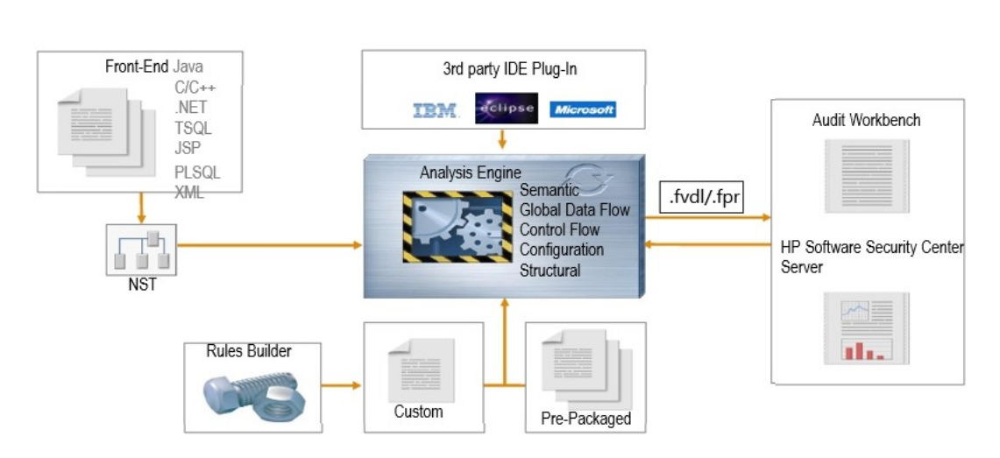

​

​

​

​

​

​

​

​

​

### 规则元素

Fortify Static Code Analyzer包含多个分析器，它们执行不同类型的分析并在代码中找到不同类型的问题，每个分析器支持一种或多种不同的规则类型，安全编码规则包用XML表示，规则包包含一个或多个任意类型的规则：

* AliasRule
* CharacterizationRule (for Dataflow Analyzer)
* ConfigurationRule
* ContentRule
* ControlflowRule
* CustomDescriptionRule
* DataflowCleanseRule
* DataflowEntrypointRule
* DataflowPassthroughRule
* DataflowSinkRule
* DataflowSourceRule
* RegexRule
* ResultFilterRule
* StructuralRule
* SuppressionRule

##### RulePack Element

Rulepack的根元素是<Rulepack>，其中包含描述RulePack的标头信息，下面是一个简易示例：

> <?xml version="1.0" encoding="UTF-8" standalone="yes"?>
>
> <RulePack>
>
> <RulePackID>06A6CC97-8C3F-4E73-9093-3E74C64A2AAF</RulePackID>
>
> <Name><![CDATA[
>
> Sample Custom Fortify Rulepack
>
> ]]></Name>
>
> <SKU>SKU-D:\Environment\FortifySCA\Core\config\customrules\custom-rule</SKU>
>
> <Version>0000.0.0.0000</Version>
>
> <Language>java</Language>
>
> <Description><![CDATA[
>
> Custom Rules for Java
>
> ]]></Description>
>
> <Rules version="22.1">...</Rules>
>
> </RulePack>

RulePack子元素说明如下：

* RulePackID：规则包的唯一标识符
* Name：规则包的名称
* SKU：全局唯一标识符
* Version：用于关联同一Rulepack(具有相同Rulepack标识符的Rulepack)的多个版本的任意数字版本(可选)
* Language：适用于规则包中所有规则编程语言，Fortify静态代码分析器仅在处理指定语言源文件时加载规则包，如果不包含<Language>元素，Fortify静态代码分析器将始终加载Rulepack(可选)
* Description：规则包说明
* Rules：包含一个<RuleDefinitions>元素

​

##### Rules Element

<Rules>元素包含所有规则定义

​

> <Rules version="22.1">
>
> <RuleDefinitions>
>
> <!--... rules go here ...-->
>
> <xyzRule>...</xyzRule>
>
> ...
>
> <xyzRule>...</xyzRule>
>
> </RuleDefinitions>
>
> </Rules>

Rules相关元素说明如下：

* RuleDefinitions：包含一个或多个顶级规则
* xyzRule：每个规则唯一的一个规则元素：<xyzRule>，其中"xyz"是有效的规则类型，有效规则元素的示例有<StructuralRule>、<DataflowRule>、<ControlflowRule>等

* formatVersion：规则兼容的Fortify静态代码分析器的版本，指定已安装的Fortify静态代码分析器版本号以利用所有当前功能，要确定Fortify静态代码分析器的版本可以在命令行中键入"sourceanalyzer -v"查看版本号，版本号格式为<major>.<minor>.<patch>.<buildnumber>(例如:22.1.0.0140)，只需要版本的主要部分和次要部分
* language：规则适用的编程语言，语言有效值为abap、cpp、dotnet、java和sql，语言属性可以应用于多种编程语言，下表描述了如何将语言属性值应用于编程语言

​

​

##### Common Rule Elements

规则类型不同的顶级规则元素包含不同的元素，Fortify静态代码分析器规则共享一些常见元素，所有规则都有一个<RuleID>元素：

```
<xyzRule formatVersion="22.1">
  <RuleID>...</RuleID>
  <MetaInfo>
    <Group name="Accuracy">4.0</Group>
    <Group name="Impact">5.0</Group>
    <Group name="Probability">4.0</Group>
  </MetaInfo>
  <Notes>...</Notes>
  ...
</xyzRule>
```

​

下面描述了顶级规则元素的公共子元素：

* RuleID：规则所需的唯一标识符，可以是任意字符串，Fortify使用全局唯一标识符(GUID)生成器生成唯一规则标识符
* MetaInfo：提供有关分析结果优先级排序规则的其他信息，其子元素是<Group>，使用<Group>元素的name属性指定漏洞的准确性、影响、概率，有效值为0.1到5.0
* Notes：您自己对规则的内部评论(可选)

下述顶级规则元素仅适用于直接导致相应分析器报告问题的规则：

```
<xyzRule formatVersion="22.1">
  <RuleID>C9ECD6EC-DAA1-41BE-9715-033F74CE664F</RuleID>
  <VulnCategory>Poor Error Handling</VulnCategory>
  <DefaultSeverity>2.0</DefaultSeverity>
  <Description>...</Description>
</xyzRule>
```

​

下面描述了漏洞生成规则常见的规则元素：

* VulnKingdom：分配给规则揭示问题的漏洞王国
* VulnCategory：分配给规则揭示问题的漏洞类别
* VulnSubcategory：分配给规则揭示问题的漏洞子类别(可选)
* Description：规则标识的漏洞描述，＜Description＞元素可以包含＜Abstract＞、＜Explain＞、＜Recommendations＞、＜References＞和＜Tips＞
* DefaultSeverity：不再使用此元素，但向后兼容需要此元素，为此元素指定值2.0
* FunctionIdentifier：指定引用函数或方法调用的规则

​

###### FunctionIdentifier Element

引用函数或方法调用的规则(相对于配置文件、属性文件、HTML和其他内容)可以使用< FunctionIdentifier >元素，例如：

```
<xyzRule formatVersion="22.1" language="java">
  <RuleID>...</RuleID>
  <VulnCategory>...</VulnCategory>
  <DefaultSeverity>2.0</DefaultSeverity>
  <Description>...</Description>
  <FunctionIdentifier>
    <NamespaceName>
      <Value>java.lang</Value>
    </NamespaceName>
    <ClassName>
      <Value>String</Value>
    </ClassName>
    <FunctionName>
      <Value>trim</Value>
    </FunctionName>
    <ApplyTo implements="true" overrides="true" extends="true"/>  
    <Parameters>...</Parameters> 
  </FunctionIdentifier>
</xyzRule>
```

​

下表描述了<FunctionIdentifier>子元素，对于面向对象的语言总是指定<ClassName>和<NamespaceName>：

* FunctionName：规则匹配的方法或函数的名称
* ClassName：规则匹配的类名，如果不指定< ClassName >则规则只匹配不在类中的函数，如果要匹配任何类中的函数，则需要使用<Pattern>.\*</Pattern>子元素，若要匹配嵌套类，则需要使用点标记法(例如：< Value>OuterClass.NestedClass</Value >)(可选)
* NamespaceName：规则匹配的包或命名空间的名称，如果未指定<NamespaceName>，则该规则仅匹配不在命名空间内的函数(可选)
* ApplyTo：控制规则如何与扩展指定类或实现指定接口的类相匹配(可选)，下述三个< ApplyTo >元素属性的默认值都是false

* implements—True表示规则应匹配实现了规则指定接口方法的方法(可选)
* overrides—True表示规则应与子类中定义的方法相匹配，这些子类会覆盖规则指定的方法(可选)
* extends—True表示规则应匹配扩展规则指定的类的类中的方法(可选)

* ReturnType：限制与具有指定返回类型的函数匹配的函数，返回类型是特定于语言的基本类型或已定义的类型(例如：java.lang.String或std::string)，您可以选择使用分别代表指针、数组或C++引用的\*、[]或&来修改类型，若要匹配嵌套类型，请使用点标记法(例如：OuterType。NestedType)
* MatchExpression：匹配函数的表达式，不能将此元素与<FunctionName>, <ClassName>, <NamespaceName>, <ApplyTo>, <Modifiers>, <Parameters>或<ReturnType>结合使用，属于可选属性
* Parameters：根据函数的类型签名限制规则匹配的方法(可选)
* Modifiers：将规则匹配的方法限制为用指定修饰符声明的方法(可选)
* Except：指定不应匹配的嵌套<FunctionIdentifier>元素(可选)

<FunctionName>、<ClassName>和<NamespaceName>元素使用下表中描述的子元素之一来表示：

* Value：Fortify静态代码分析器将该名称解释为标准字符串，例如：<Value>java.util</Value>
* Pattern：Fortify静态代码分析器将该名称解释为有效的Java正则表达式，确保对正则表达式符号进行转义，例如：<Pattern>java.util</Pattern>

​

###### Parameters Element

<Parameters>元素用于限制规则匹配的方法，以下示例显示了具有两个可选子元素的<Parameters>元素：

```
<Parameters>
  <ParamType>java.lang.String</ParamType>
  <WildCard min="0" max="2"/>
</Parameters>
```

​

相关子元素解释如下：

(1) ParamType

指定特定于语言的基元类型或已定义类型的单个参数(例如：java.lang.String或std::string)，您可以选择使用代表指针、数组或C++引用的\*、[]或&来修改类型，若要匹配嵌套类型，请使用点标记法(例如：OuterType.NestedType)

​

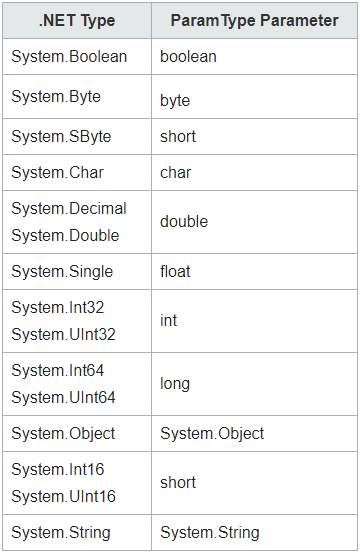

(2) WildCard

在方法的参数列表末尾表示可变数量的任意类型的参数，该元素可以包含以下属性：

* 最小值—指定规则允许的通配符参数的最小数量
* 最大值—指定规则允许的通配符参数的最大数量

###### Modifiers Element

<Modifiers>元素将规则匹配的方法限制为用指定修饰符声明的方法：

```
<Modifiers>
  <Modifier>static</Modifier>
</Modifiers>
```

​

###### Conditional Elements

很多规则类型允许使用带有<conditional>元素的条件表达式来进一步限制匹配，函数标识符指定规则所属的函数或方法，条件表达式限制对规则匹配的函数的调用，您可以编写条件表达式来检查方法调用中使用的常量值(布尔值(true/false)、整数、字符串(不区分大小写)和null)以及方法参数的类型(与方法声明的形参类型不同)，对于数据流接收器，条件表达式也可以检查taintClosed标志，以下示例显示了各种条件元素：

```
<Conditional>
  <And>
    <Not>
      <TaintFlagSet taintFlag="XSS"/>
    </Not>
    <And>
      <ConstantEq argument="0" value="strong"/>
      <ConstantGt argument="1" value="1023"/>
      <ConstantLt argument="2" value="2048"/>
    </And>
    <IsType argument="0">
      <NamespaceName>
        <Value>javax.servlet</Value>
      </NamespaceName>
      <ClassName>
        <Pattern>(Http)?ServletRequest</Pattern>
      </ClassName>
    </IsType>
    <Or>
      <NameEq argument="3" name="xyz"/>
    </Or>
  </And>
</Conditional>
```

​

##### **Custom Descriptions**

审计人员可将自定义描述添加到Fortify规则或将Fortify描述添加到自定义规则，自定义描述使您能够将特定于组织的内容添加到Fortify安全编码规则包生成的问题中，自定义描述内容可以包括组织特定的安全编码指南、最佳实践、内部文档参考等，同时将Fortify描述添加到自定义规则中可以利用Fortify在自定义规则中创建的描述来识别安全编码规则包已报告的漏洞类别：

###### Fortify Descriptions

您可以使用Fortify描述来描述自定义规则发现的问题，首先我们需要确定要使用的描述的标识符，描述标识符位于https://vulncat.fortify.com，找到要使用的描述的标识符后将自定义规则的ref属性设置为Fortify描述的标识符，例如：以下规则生成的SQL注入结果的描述与Fortify规则For Java的SQL注入的结果相同

​

```
<DataflowSinkRule formatVersion="22.1" language="java">
  ...
  <Description ref="desc.dataflow.java.sql_injection"/>
  ...
</DataflowSinkRule>
```

###### Custom Descriptions

您可以使用<CustomDescriptionRule>元素添加自定义描述，每个自定义描述规则定义新的描述内容并指定一组Fortify规则以确定如何应用它，默认情况下Fortify静态代码分析器工具在Fortify描述之前显示自定义描述，以下自定义描述规则示例为SQL注入和访问控制添加了自定义的<Abstract>和<Explanation>

```
<CustomDescriptionRule formatVersion="22.1">
  <RuleID>D40B319C-F9D6-424F-9D62-BB1FA3B3C644</RuleID>
  <RuleMatch> 
    <Category> 
      <Value>SQL Injection</Value>
    </Category> 
  </RuleMatch> 
  <RuleMatch> 
    <Category> 
      <Value>Access Control</Value>
    </Category> 
    <Subcategory>
      <Value>Database</Value>
    </Subcategory>
  </RuleMatch>
  <Description> 
    <Abstract>[custom abstract text]</Abstract>
    <Explanation>[custom explanation text]</Explanation> 
  </Description> 
  <Header>[string to replace Custom]</Header>
</CustomDescriptionRule>
```

​

如果要向Fortify规则添加自定义描述，需要执行以下操作：

* 定义自定义描述内容：使用自定义描述规则的<Description>和<Header>元素定义自定义描述属性
* 识别要修改的规则：使用<RuleMatch>元素来识别Fortify静态代码分析器添加自定义描述内容的规则

下面描述了<CustomDescriptionRule>子元素：

* RuleID：规则所需的唯一标识符
* RuleMatch：指定用于标识Fortify静态代码分析器添加自定义描述内容的规则的条件
* Description：自定义描述可以指定<description>子元素的全部或子集
* Header：指定在Fortify静态代码分析器和应用程序显示规则描述时替换单词"自定义"的文本(可选)

自定义描述可以包含多个规则匹配项，每个规则匹配都基于类别、子类别、规则标识符和描述标识符的任意组合指定规则，当规则匹配规则匹配中指定的所有条件时Fortify静态代码分析器才会对规则生成的问题应用自定义描述：

* Category：漏洞类型
* Subcategory：漏洞子类型
* RuleID：规则ID
* DescriptionID：要使用的描述的标识符(例如：desc.dataflow.java.sql\_injection）

​

### 规则定义

下面开始自定义规则阶段

##### 规则创建

假设我们现在有如下JAVA源代码文件：

```
package org.example;

public class HardPassword {
    public String iamUser="Admin";
    public String iamPassword="123456";
    public String iampassword="123456";
    public String iamPass="1234567";
    public String iam="12345678";
    public String password="123456789";

    public String getUsername() {
        return username;
    }

    public void setUsername(String username) {
        this.username = username;
    }

    public String getPassword() {
        return Password;
    }

    public void setPassword(String password) {
        Password = password;
    }
}
```

​

从上面我们可以看到这里对IAM的用户密码使用了硬编码，下面我们通过Fortify内置的规则编辑器CustomRulesEditor自定义规则来对源代码中的硬编码问题进行排查扫描，首先我们进入到Fortify的bin目录中运行CustomRulesEditor规则编辑器：

​

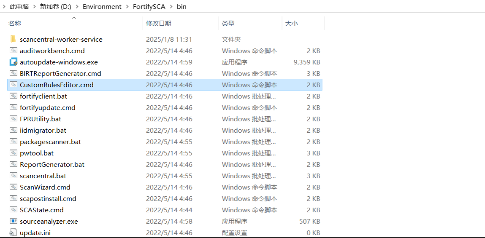

打开规则编辑器之后我们可以看到规则分类有以下四类：

* Taint Flags/Rule Type：Taint Flags是一种标记机制，用于指示数据流的来源是否是"污点"的(即不可信的)数据源，这些标记帮助识别潜在的安全问题，例如：SQL注入、跨站脚本攻击(XSS)以及 XML外部实体(XXE)等漏洞
* Package/Category：Package和Category用于组织和分类规则以便于管理和使用，Package为规则的包名称，表示规则所属的特定库或模块，这有助于用户快速找到相关规则并理解其上下文，Category表示规则的功能类别，例如：输入验证、安全性检查等，通过将规则分类用户可以更轻松地定位与特定安全主题相关的规则
* Audience/Rule Type：Audience指的是规则的目标用户群体，这可能包括开发人员、安全分析师或代码审查人员等，了解受众有助于设置规则的详细程度和复杂性以适应不同技能水平的用户
* Kingdom/Rule Type：Kingdom通常用于更高层次的分类，可能代表规则的主要领域或大类，例如："网络安全"、"应用程序安全"等，它提供了一种结构化的方式来组织规则，使用户能够快速识别与特定领域相关的规则
* Category/Rule Type：Category在此上下文中再次出现，表示规则的功能分类，例如："输入验证"、"输出编码"等，这有助于用户快速了解规则的目的和作用


​

我们直接保持默认的"Taint Flags/Rule Type"并选择"File->Generate Rule"来创建规则：

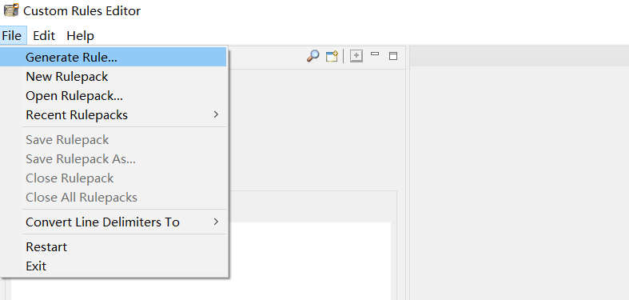

随后会显示自定义规则的引用模板，目前主要按照漏洞类型(Category)和规则类型(Rule Type)进行分类，但是不管是何种分类都可以大致分为数据污染源Tainted规则、数据控制流规则、数据传递规则、漏洞缺陷爆发的Sink规则

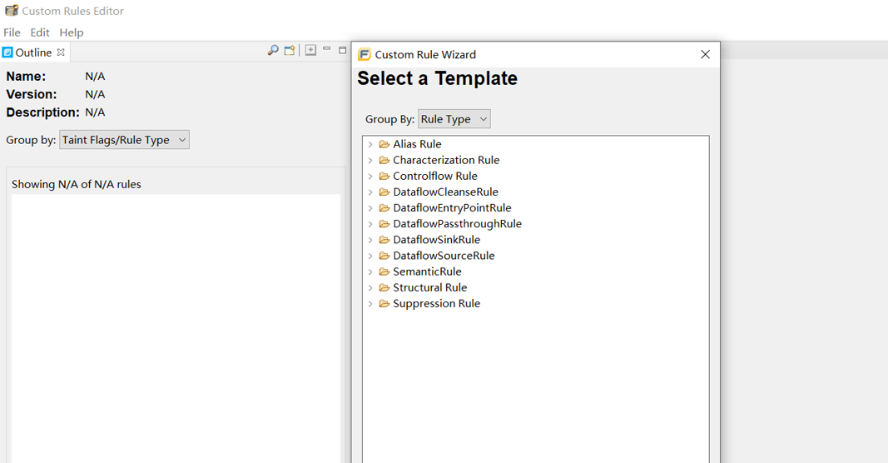

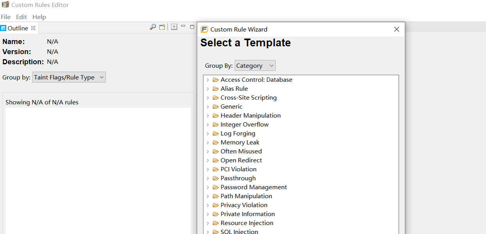

在这里我们选择漏洞类型(Category)中Password Management下的"Structural Rule for Password Management"模板

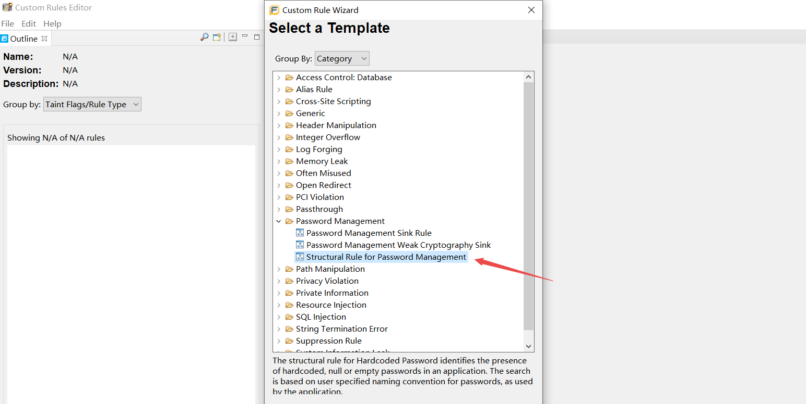

随后选择规则适用的编程语言：

​

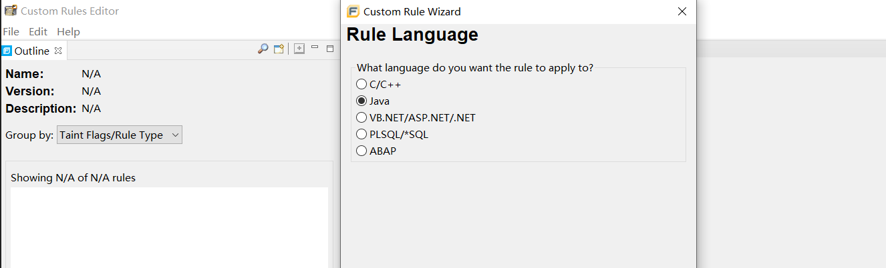

随后填写用于匹配密码的正则表达式(备注：在这里要多做验证测试)：

​

```
(?i)iampass(|wd|word)
```

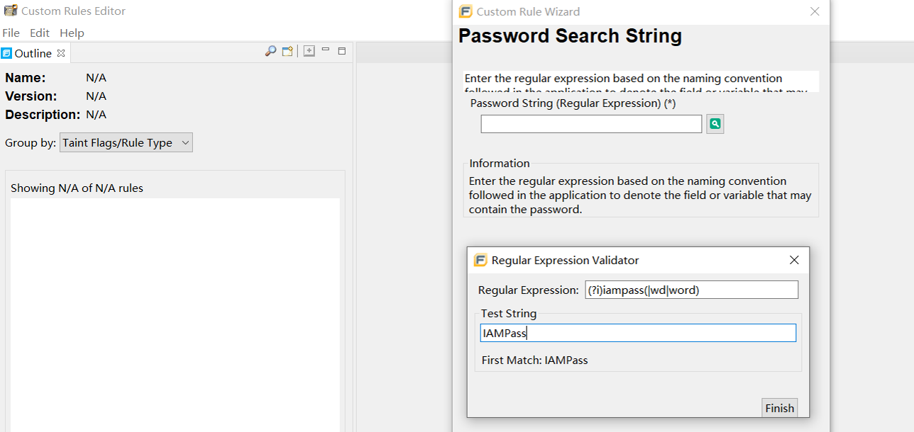

配置规则存储路径：

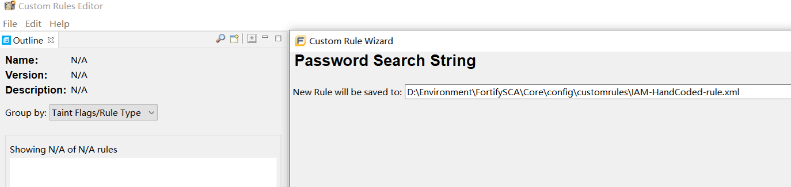

随后可以看到根据模板生成的规则，其中总计6条匹配项，其中2项为匹配硬编码密码，另外4项为匹配空密码操作：

* RulePackID：规则包唯一ID
* SKU：全局唯一标识符
* Name：规则包名称
* Version：规则包版本
* Description：规则包描述
* Rules：规则组，里面可容纳多个规则
* RuleDefinitions：规则定义

​

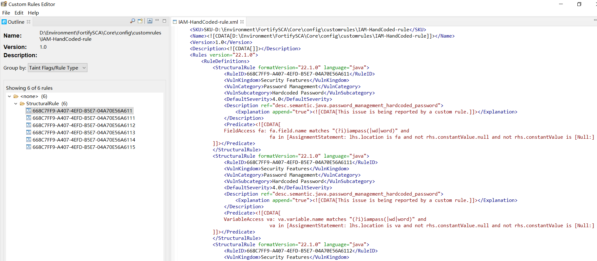

根据我们当前的规则目的我们无需去处理空密码，所以我们直接删除后面的四项，最后留下以下内容：

​

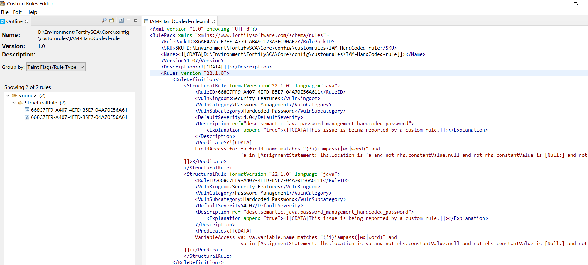

```
<?xml version="1.0" encoding="UTF-8"?>
<RulePack xmlns="xmlns://www.fortifysoftware.com/schema/rules">
    <RulePackID>86AF47A5-E7EF-4779-AB49-123A3EC90AE2</RulePackID>
    <SKU>SKU-D:\Environment\FortifySCA\Core\config\customrules\IAM-HandCoded-rule</SKU>
    <Name><![CDATA[D:\Environment\FortifySCA\Core\config\customrules\IAM-HandCoded-rule]]></Name>
    <Version>1.0</Version>
    <Description><![CDATA[]]></Description>
    <Rules version="22.1.0">
        <RuleDefinitions>
            <StructuralRule formatVersion="22.1.0" language="java">
                <RuleID>668C7FF9-A407-4EFD-B5E7-04A70E56A611</RuleID>
                <VulnKingdom>Security Features</VulnKingdom>
                <VulnCategory>Password Management</VulnCategory>
                <VulnSubcategory>Hardcoded Password</VulnSubcategory>
                <DefaultSeverity>4.0</DefaultSeverity>
                <Description ref="desc.semantic.java.password_management_hardcoded_password">
                    <Explanation append="true"><![CDATA[This issue is being reported by a custom rule.]]></Explanation>
                </Description>
                <Predicate><![CDATA[
                FieldAccess fa: fa.field.name matches "(?i)iampass(|wd|word)" and
                                fa in [AssignmentStatement: lhs.location is fa and not rhs.constantValue.null and not rhs.constantValue is [Null:] and not rhs.constantValue == ""] and fa.field is [Field f:]*
            ]]></Predicate>
            </StructuralRule>
            <StructuralRule formatVersion="22.1.0" language="java">
                <RuleID>668C7FF9-A407-4EFD-B5E7-04A70E56A6111</RuleID>
                <VulnKingdom>Security Features</VulnKingdom>
                <VulnCategory>Password Management</VulnCategory>
                <VulnSubcategory>Hardcoded Password</VulnSubcategory>
                <DefaultSeverity>4.0</DefaultSeverity>
                <Description ref="desc.semantic.java.password_management_hardcoded_password">
                    <Explanation append="true"><![CDATA[This issue is being reported by a custom rule.]]></Explanation>
                </Description>
                <Predicate><![CDATA[
                VariableAccess va: va.variable.name matches "(?i)iampass(|wd|word)" and
                                va in [AssignmentStatement: lhs.location is va and not rhs.constantValue.null and not rhs.constantValue is [Null:] and not rhs.constantValue == ""] and va.variable is [Variable v:]*
            ]]></Predicate>
            </StructuralRule>
        </RuleDefinitions>
    </Rules>
</RulePack>

```

##### 简易测试

首先将自定义规则保存到用户自定义规则目录中去(上面我们在创建时就直接保存到了自定义规则目录)——FortifySCA\Core\config\customrules

​

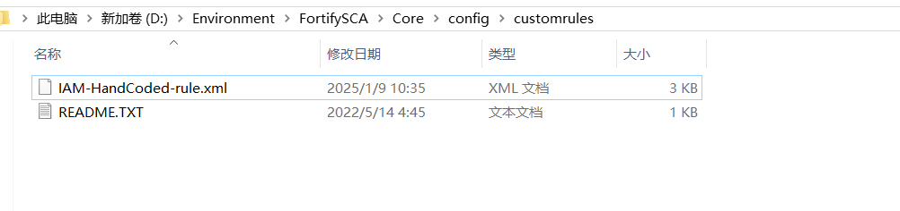

当然你也可以在${FortifyInstall}/Core/config/fortify-sca.properties进行配置自定义路径

​

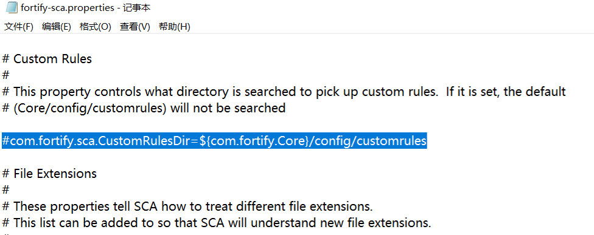

随后启动Fortify代码扫描工具并配置加载自定义规则：

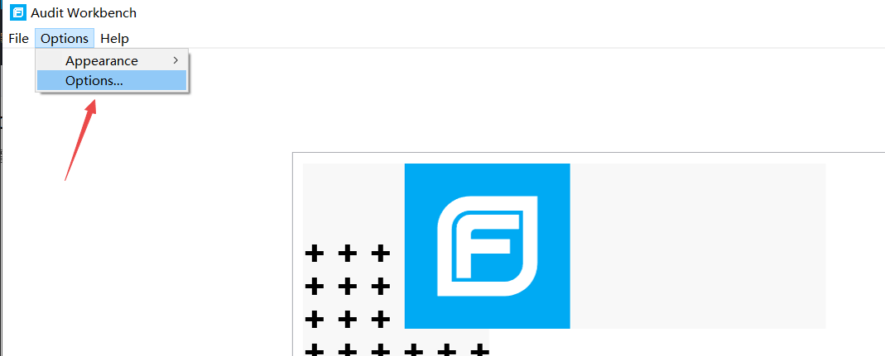

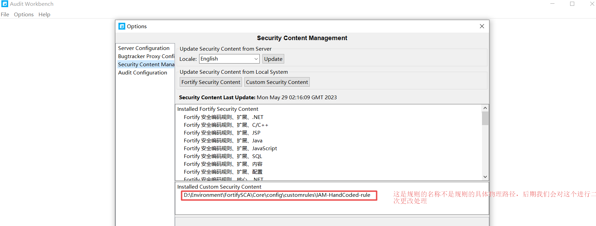

选择工程执行静态代码扫描：

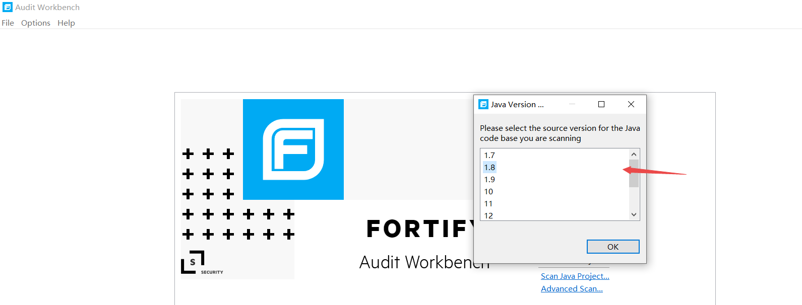

扫描结果如下：

​

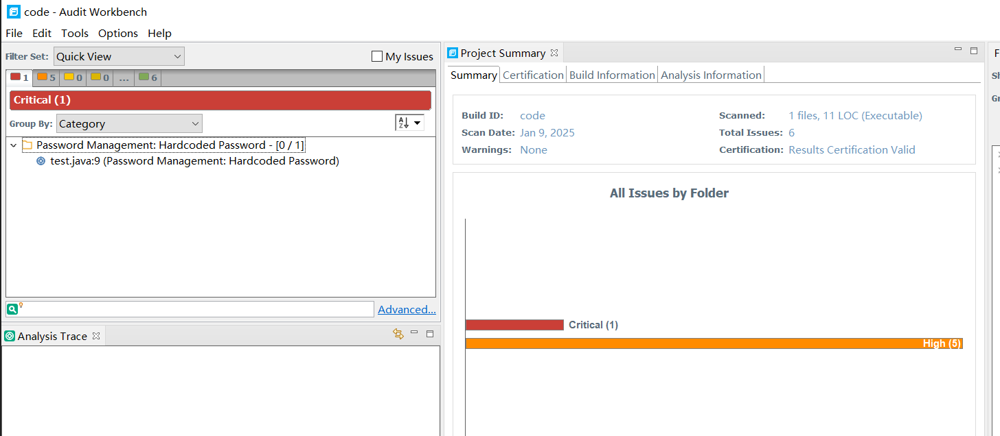

在这里由于我们扫描的时候加载了默认的扫描规则，其中也包含了HardCoded Password规则所以有一部分是重复的，在验证的时候我们需要特别留意以下这里的RuleID是否和我们自定义的规则中的一致来确保我们自己定义的规则是有被加载且保证正常扫描执行到：

​

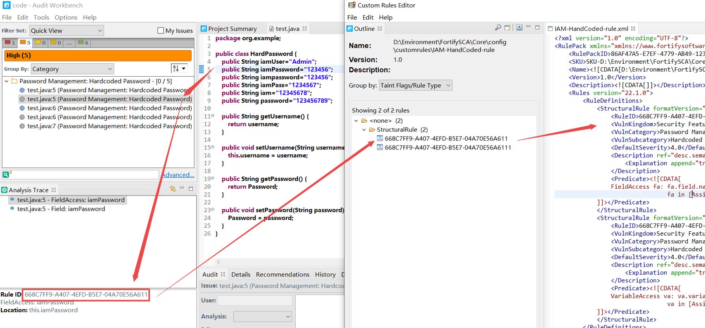

在这里我们为了规避默认的规则带来的影响我们可以对项目执行"重新扫描"并只勾选自定义规则：

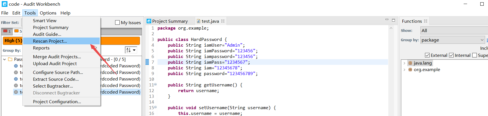

​

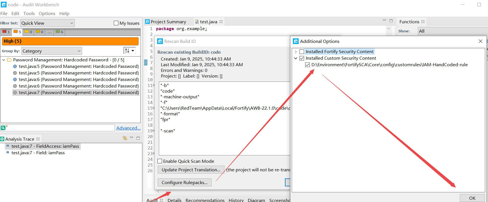随后得到如下结果，从中可以看到这里的大小写以及关键字的匹配都是我们预期想要的内容，所以至此规则测试完成且符合我们的预期

​

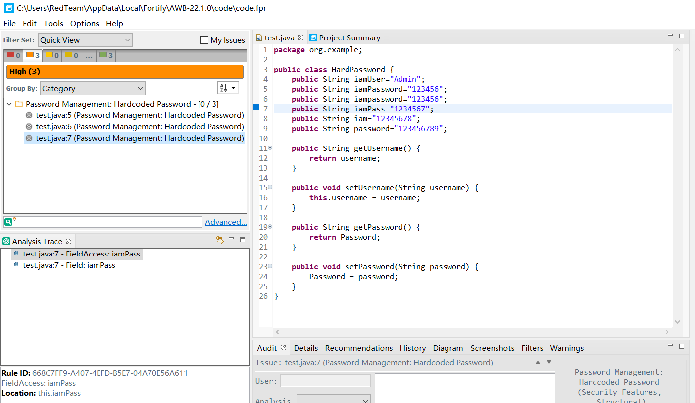

##### 规则完善

在完成上面的规则的测试之后我们还需要对规则进行进一步的优化处理，包括：规则名称、修复建议、

###### 规则名称

前面我们说过在加载规则的时候的那个路径是规则的名称而不是规则的路径，这里为了后期规则的区分我们对规则名称进行一次更改，变更的方式为更改规则中的"Name"标签属性：

​

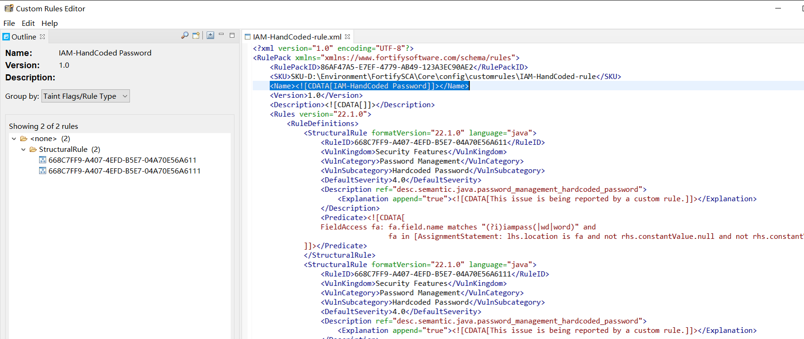

随后可以看到再次加载规则的时候规则名称被成功更改：

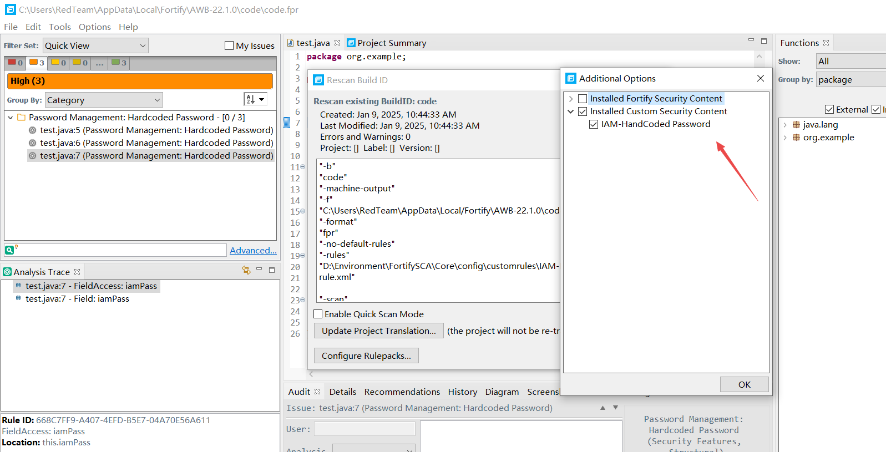

​

###### 漏洞描述

在创建自定义规则时我们有两种选择来生成关于漏洞的描述：

**A、引用Foritify官方的描述**

首先我们需要确定要使用的描述的标识符，描述标识符位于https://vulncat.fortify.com/en/weakness，找到要使用的描述的标识符后将自定义规则的ref属性设置为Fortify描述的标识符

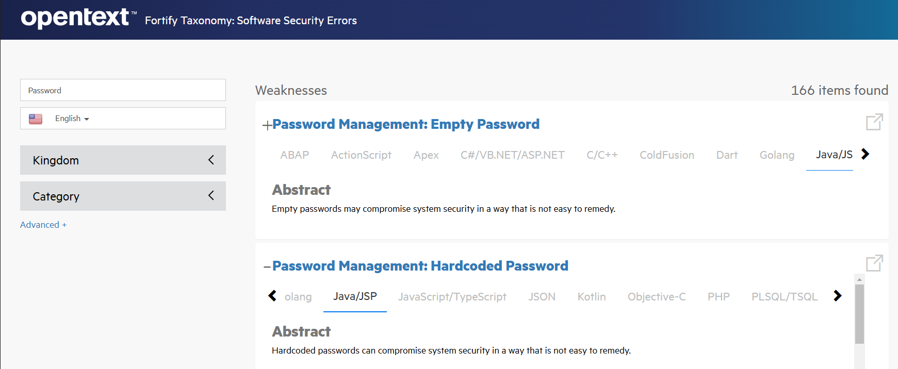

描述有点偏，位于每个描述的最下面部分，例如：

​

```
desc.semantic.java.password_management_hardcoded_password
```

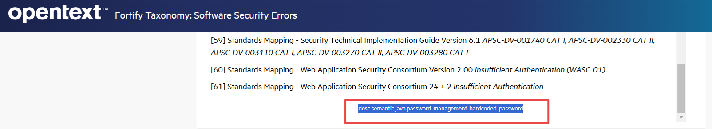

随后变更规则，加入漏洞描述：

​

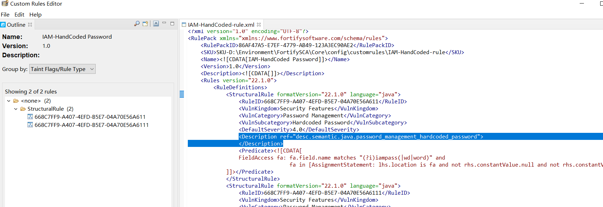

但是并没有什么效果：

​

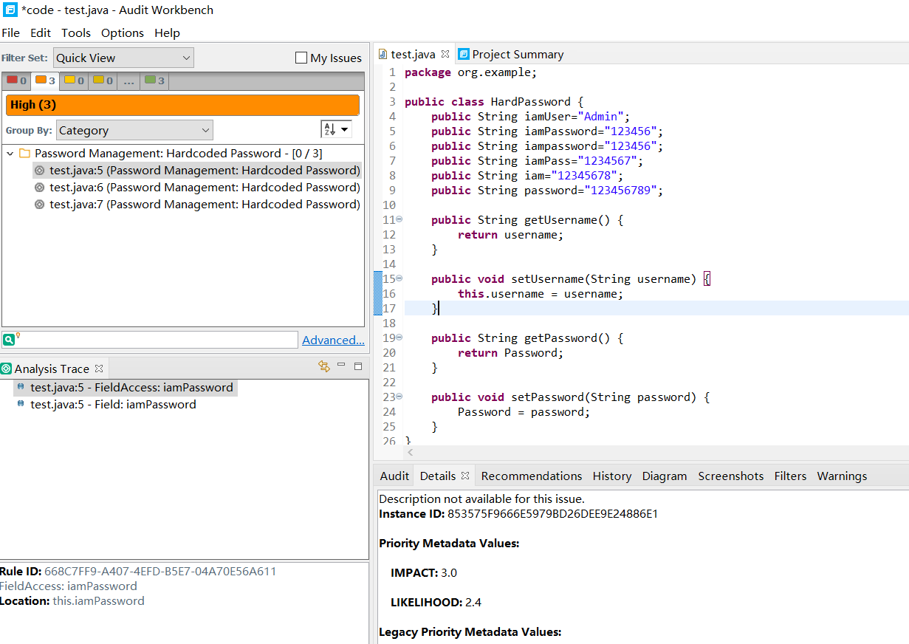

```
<?xml version="1.0" encoding="UTF-8"?>
<RulePack xmlns="xmlns://www.fortifysoftware.com/schema/rules">
    <RulePackID>86AF47A5-E7EF-4779-AB49-123A3EC90AE2</RulePackID>
    <SKU>SKU-D:\Environment\FortifySCA\Core\config\customrules\IAM-HandCoded-rule</SKU>
    <Name><![CDATA[IAM-HandCoded Password]]></Name>
    <Version>1.0</Version>
    <Description><![CDATA[]]></Description>
    <Rules version="22.1.0">
        <RuleDefinitions>
            <StructuralRule formatVersion="22.1.0" language="java">
                <RuleID>668C7FF9-A407-4EFD-B5E7-04A70E56A611</RuleID>
                <VulnKingdom>Security Features</VulnKingdom>
                <VulnCategory>Password Management</VulnCategory>
                <VulnSubcategory>Hardcoded Password</VulnSubcategory>
                <DefaultSeverity>4.0</DefaultSeverity>
                <Description ref="desc.semantic.java.password_management_hardcoded_password">
                </Description>
                <Predicate><![CDATA[
                FieldAccess fa: fa.field.name matches "(?i)iampass(|wd|word)" and
                                fa in [AssignmentStatement: lhs.location is fa and not rhs.constantValue.null and not rhs.constantValue is [Null:] and not rhs.constantValue == ""] and fa.field is [Field f:]*
            ]]></Predicate>
            </StructuralRule>
            <StructuralRule formatVersion="22.1.0" language="java">
                <RuleID>668C7FF9-A407-4EFD-B5E7-04A70E56A6111</RuleID>
                <VulnKingdom>Security Features</VulnKingdom>
                <VulnCategory>Password Management</VulnCategory>
                <VulnSubcategory>Hardcoded Password</VulnSubcategory>
                <DefaultSeverity>4.0</DefaultSeverity>
                <Description ref="desc.semantic.java.password_management_hardcoded_password">
                    <Explanation append="true"><![CDATA[This issue is being reported by a custom rule.]]></Explanation>
                </Description>
                <Predicate><![CDATA[
                VariableAccess va: va.variable.name matches "(?i)iampass(|wd|word)" and
                                va in [AssignmentStatement: lhs.location is va and not rhs.constantValue.null and not rhs.constantValue is [Null:] and not rhs.constantValue == ""] and va.variable is [Variable v:]*
            ]]></Predicate>
            </StructuralRule>
        </RuleDefinitions>
    </Rules>
</RulePack>

```

**B、用户自定义描述**

关于用户的自定义描述我们可以直接借助自定义规则编辑器来实现：

```
<Abstract>：漏洞摘要
<Explanation>：漏洞描述
<Recommendations>：修复建议
```

​

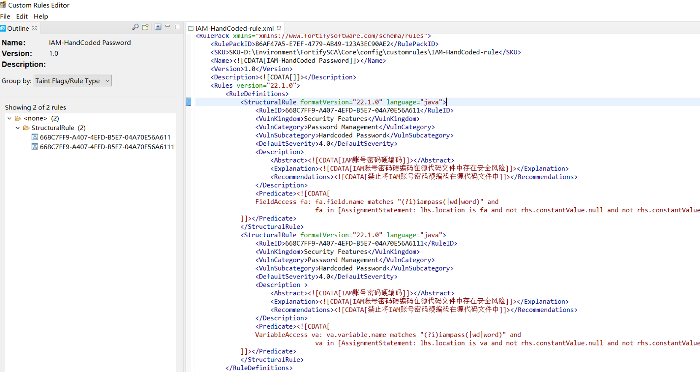

随后可以看到如下效果：

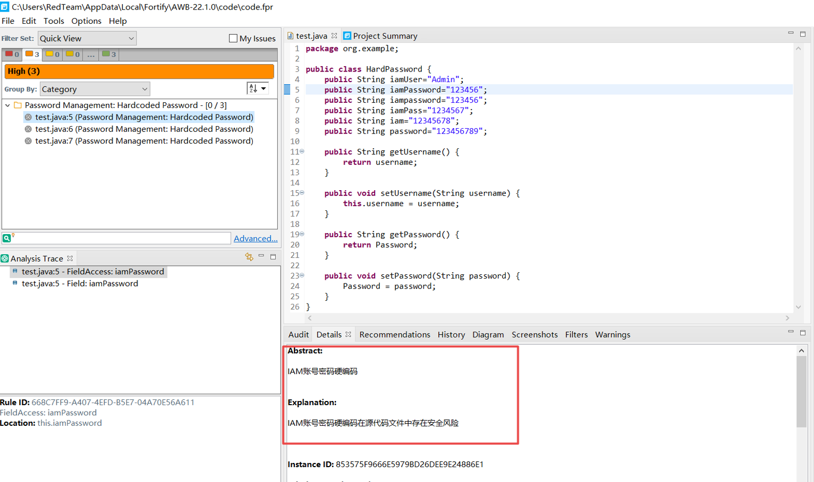

变更后的规则如下：

```
<?xml version="1.0" encoding="UTF-8"?>
<RulePack xmlns="xmlns://www.fortifysoftware.com/schema/rules">
    <RulePackID>86AF47A5-E7EF-4779-AB49-123A3EC90AE2</RulePackID>
    <SKU>SKU-D:\Environment\FortifySCA\Core\config\customrules\IAM-HandCoded-rule</SKU>
    <Name><![CDATA[IAM-HandCoded Password]]></Name>
    <Version>1.0</Version>
    <Description><![CDATA[]]></Description>
    <Rules version="22.1.0">
        <RuleDefinitions>
            <StructuralRule formatVersion="22.1.0" language="java">
                <RuleID>668C7FF9-A407-4EFD-B5E7-04A70E56A611</RuleID>
                <VulnKingdom>Security Features</VulnKingdom>
                <VulnCategory>Password Management</VulnCategory>
                <VulnSubcategory>Hardcoded Password</VulnSubcategory>
                <DefaultSeverity>4.0</DefaultSeverity>
                <Description>
                    <Abstract><![CDATA[IAM账号密码硬编码]]></Abstract>
                    <Explanation><![CDATA[IAM账号密码硬编码在源代码文件中存在安全风险]]></Explanation>
                    <Recommendations><![CDATA[禁止将IAM账号密码硬编码在源代码文件中]]></Recommendations>
                </Description>
                <Predicate><![CDATA[
                FieldAccess fa: fa.field.name matches "(?i)iampass(|wd|word)" and
                                fa in [AssignmentStatement: lhs.location is fa and not rhs.constantValue.null and not rhs.constantValue is [Null:] and not rhs.constantValue == ""] and fa.field is [Field f:]*
            ]]></Predicate>
            </StructuralRule>
            <StructuralRule formatVersion="22.1.0" language="java">
                <RuleID>668C7FF9-A407-4EFD-B5E7-04A70E56A6111</RuleID>
                <VulnKingdom>Security Features</VulnKingdom>
                <VulnCategory>Password Management</VulnCategory>
                <VulnSubcategory>Hardcoded Password</VulnSubcategory>
                <DefaultSeverity>4.0</DefaultSeverity>
                <Description >
                    <Abstract><![CDATA[IAM账号密码硬编码]]></Abstract>
                    <Explanation><![CDATA[IAM账号密码硬编码在源代码文件中存在安全风险]]></Explanation>
                    <Recommendations><![CDATA[禁止将IAM账号密码硬编码在源代码文件中]]></Recommendations>
                </Description>
                <Predicate><![CDATA[
                VariableAccess va: va.variable.name matches "(?i)iampass(|wd|word)" and
                                va in [AssignmentStatement: lhs.location is va and not rhs.constantValue.null and not rhs.constantValue is [Null:] and not rhs.constantValue == ""] and va.variable is [Variable v:]*
            ]]></Predicate>
            </StructuralRule>
        </RuleDefinitions>
    </Rules>
</RulePack>

```

### 函数调用

场景描述：代码审计过程中发现存在具备特征的函数名称时我们可以为函数名称制定规则来实现全量检索，在检索时我们的终极目的时检索定位处所有调用该函数的位置点

具体实现：

示例代码：

```
package org.example;

public class SecTest {
    public int evil(int a, int b) {
        //do something
		return a+b;
    }

    public int verify() {
        //do something
	   return evil(1,2);
    }
}
```

新建扫描规则

​

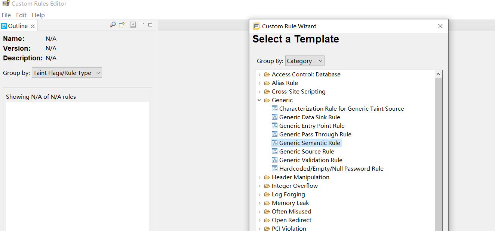

选择语言：

​

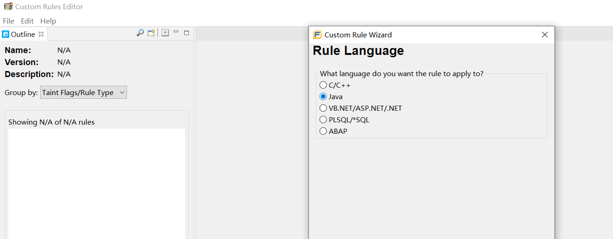

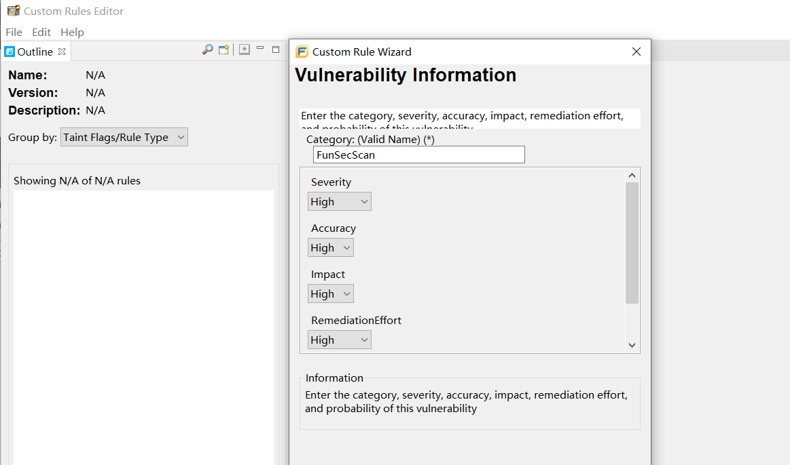

```
(?i)evil
```

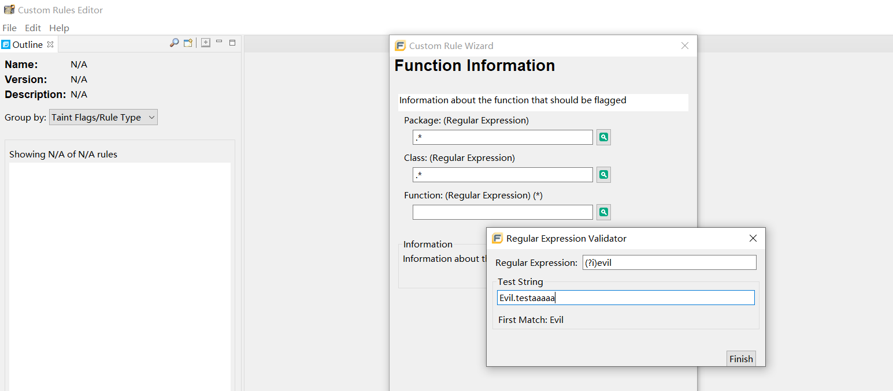

最终规则如下：

```
<?xml version="1.0" encoding="UTF-8"?>
<RulePack xmlns="xmlns://www.fortifysoftware.com/schema/rules">
    <RulePackID>96F34CB0-3E78-4410-B6FE-E4D87859E682</RulePackID>
    <SKU>SKU-D:\Environment\FortifySCA\Core\config\customrules\evil-rule</SKU>
    <Name><![CDATA[D:\Environment\FortifySCA\Core\config\customrules\evil-rule]]></Name>
    <Version>1.0</Version>
    <Description><![CDATA[]]></Description>
    <Rules version="22.1.0">
        <RuleDefinitions>
            <SemanticRule formatVersion="22.1.0" language="java">
                <MetaInfo>
                    <Group name="Accuracy">5.0</Group>
                    <Group name="Impact">5.0</Group>
                    <Group name="RemediationEffort">15.0</Group>
                    <Group name="Probability">5.0</Group>
                </MetaInfo>
                <RuleID>5C3B2AC3-9F40-4CF3-9942-88E7C76ED780</RuleID>
                <VulnCategory>FunSecScan</VulnCategory>
                <DefaultSeverity>4.0</DefaultSeverity>
                <Description/>
                <Type>default</Type>
                <FunctionIdentifier>
                    <NamespaceName>
                        <Pattern>.*</Pattern>
                    </NamespaceName>
                    <ClassName>
                        <Pattern>.*</Pattern>
                    </ClassName>
                    <FunctionName>
                        <Pattern>(?i)evil</Pattern>
                    </FunctionName>
                    <ApplyTo implements="true" overrides="true" extends="true"/>
                </FunctionIdentifier>
            </SemanticRule>
        </RuleDefinitions>
    </Rules>
</RulePack>

```

规则扫描结果：

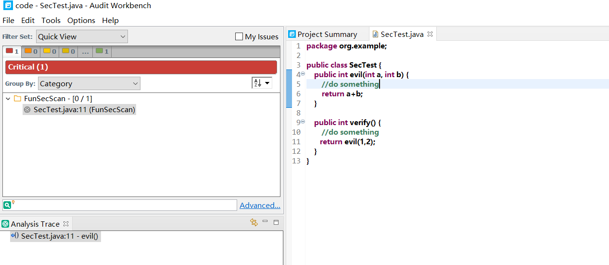

后续的优化同之前的部分~

​

### 文末小结

Foritify自定义规则适用频次最多的应该属于SemanticRule，如果要使用更为复杂的数据流规则、控制流规则、内容规则等则自行进行配置测试即可，建议结合具体的漏洞代码展开为好，由于篇幅问题后续再介绍关于控制流规则的定义和使用，到时候回结合XXE漏洞来开展规则的定义并给出相关可以正式投入使用的规则
